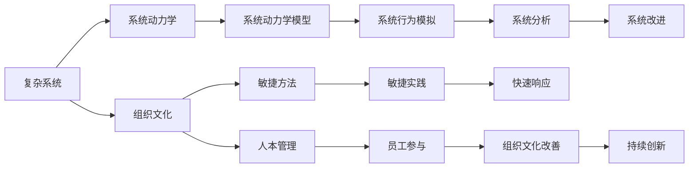

                 

# 系统思考在组织变革中的应用

> 关键词：系统思考,组织变革,复杂系统,决策支持,组织文化,敏捷方法,人本管理

## 1. 背景介绍

### 1.1 问题由来

在全球化、数字化和知识经济时代，组织环境变得越发复杂多变，企业面临的挑战和机遇也日益增多。如何在这种动荡的环境下保持竞争优势，实现可持续发展，成为摆在每一个组织面前的重大课题。传统的管理方法已经无法满足现代企业的需求，迫切需要一种新的思维方式来指导组织变革。

系统思考(Systemic Thinking)，作为系统动力学(System Dynamics)和社会系统动力学(Social Systems Dynamics)方法论的有机融合，为理解复杂系统行为、设计和实施变革提供了有力的工具。系统思考将组织视为一个整体，通过分析组织内部各要素之间的相互作用和因果关系，从全局视角寻找解决问题和实现创新的有效途径。

系统思考的应用领域广泛，涵盖企业管理、公共政策、环境保护等多个领域。在组织变革过程中，系统思考可以帮助管理者识别并解决深层次问题，推动组织向更加高效、灵活和可持续的方向发展。

### 1.2 问题核心关键点

系统思考在组织变革中的应用主要围绕以下几个关键点展开：

1. **系统视角**：将组织视为一个开放的系统，通过分析其与环境的相互作用，理解组织在动态环境中的行为模式。
2. **整体观念**：强调组织各部分之间的相互依赖性和系统性，注重整体的协同作用，而非局部优化。
3. **因果反馈**：识别组织中的正负反馈回路，理解它们对组织行为的影响，并设计反馈机制以增强组织适应性。
4. **长远视角**：系统思考强调对组织的长远发展和可持续性的关注，避免短视行为。
5. **人本管理**：重视人的作用和价值，强调通过改善组织文化和管理实践，促进员工的主动参与和创新。

## 2. 核心概念与联系

### 2.1 核心概念概述

在系统思考的指导下，组织变革可以通过以下几个核心概念来实现：

- **复杂系统(Complex Systems)**：指的是由多个相互关联的部分组成、行为不可预测的系统，其结构复杂、动态多变。
- **系统动力学(System Dynamics)**：研究系统结构、参数和行为之间的关系，通过建立动态模型来模拟系统行为，并进行分析和预测。
- **组织文化(Organizational Culture)**：指组织成员共同持有的价值观、信念和行为规范，对组织的决策、创新和变革具有重要影响。
- **敏捷方法(Agile Methods)**：强调快速响应变化、持续迭代和协作的开发方法，适应性强，灵活高效。
- **人本管理(Human-Centered Management)**：强调人的价值、尊严和潜力的发挥，注重员工参与、沟通和自主性。

这些概念之间具有紧密的联系，共同构成了系统思考在组织变革中的理论框架。

### 2.2 核心概念原理和架构的 Mermaid 流程图



这个流程图展示了系统思考中各核心概念之间的联系。复杂系统通过系统动力学模型来分析和模拟，组织文化与敏捷方法和人本管理相互作用，共同推动组织行为分析和改进。

## 3. 核心算法原理 & 具体操作步骤

### 3.1 算法原理概述

在系统思考中，组织变革可以视为一个动态的系统优化过程。其核心算法原理主要包括以下几个方面：

1. **建模与仿真**：建立组织系统的动态模型，通过仿真实验分析系统行为，识别关键影响因素和潜在问题。
2. **因果反馈识别**：分析组织中的因果关系和反馈回路，识别正负反馈机制，理解系统行为模式。
3. **系统优化**：通过迭代仿真实验，调整系统参数和结构，寻找最优的组织变革策略。
4. **系统改进**：根据仿真结果，提出具体的操作措施，进行组织文化、管理实践等改进，实现系统优化。

### 3.2 算法步骤详解

系统思考在组织变革中的具体操作步骤如下：

1. **系统定义**：明确组织系统的边界、组成部分和目标，确定系统的关键变量和参数。
2. **建模与仿真**：建立组织系统的动态模型，通过仿真实验分析系统行为，识别关键影响因素和潜在问题。
3. **因果反馈识别**：分析组织中的因果关系和反馈回路，识别正负反馈机制，理解系统行为模式。
4. **系统优化**：通过迭代仿真实验，调整系统参数和结构，寻找最优的组织变革策略。
5. **系统改进**：根据仿真结果，提出具体的操作措施，进行组织文化、管理实践等改进，实现系统优化。

### 3.3 算法优缺点

系统思考在组织变革中的应用具有以下优点：

- **全局视角**：从系统的整体和全局出发，避免局部优化导致的系统失效。
- **动态分析**：通过仿真实验动态分析系统行为，实时调整优化策略。
- **人本管理**：重视人的价值和作用，通过改善组织文化和管理实践，促进员工的主动参与和创新。

同时，系统思考也存在一些缺点：

- **复杂性高**：系统模型构建和仿真实验需要较高的技术门槛和专业能力。
- **数据依赖**：需要大量高质量的数据，才能构建有效的系统模型。
- **周期较长**：系统优化过程往往需要较长的周期和多次迭代，才能找到最优方案。

### 3.4 算法应用领域

系统思考在组织变革中的应用领域广泛，主要包括以下几个方面：

1. **战略规划与决策支持**：利用系统动力学模型进行战略分析和决策支持，帮助组织在复杂多变的环境中制定有效策略。
2. **组织变革与转型**：通过系统优化和仿真实验，识别和解决组织变革中的关键问题，推动组织向高效、灵活、可持续的方向发展。
3. **员工参与与管理**：通过人本管理理念和敏捷方法，增强员工参与和创新，提升组织适应性和响应速度。
4. **流程优化与改进**：利用系统思维优化业务流程，提升组织效率和竞争力。

## 4. 数学模型和公式 & 详细讲解 & 举例说明

### 4.1 数学模型构建

在系统思考中，组织变革的数学模型通常包含以下几个组成部分：

- **状态变量**：表示组织的关键状态和变量，如员工满意度、生产效率、市场份额等。
- **输入变量**：影响系统状态的外部因素，如市场变化、政策调整、投资策略等。
- **动态方程**：描述状态变量随时间变化的规律，如微分方程、差分方程等。
- **反馈回路**：系统内部的正负反馈机制，影响系统行为和稳定性。

### 4.2 公式推导过程

以员工满意度的系统动力学模型为例，其基本方程可以表示为：

$$
\frac{dS}{dt} = \alpha(S_{\text{target}} - S) + \beta \frac{P}{C} + \gamma R
$$

其中，$S$表示员工满意度，$\alpha$、$\beta$、$\gamma$为系数，$S_{\text{target}}$表示目标满意度，$P$表示薪资水平，$C$表示工作环境，$R$表示工作内容。

通过仿真实验，我们可以分析员工满意度的变化趋势，识别关键影响因素，优化薪资、工作环境和工作内容，从而提升员工满意度。

### 4.3 案例分析与讲解

某制造企业在应对市场需求变化时，通过系统思考模型进行决策支持。该企业面临的主要问题包括生产效率低下、客户满意度下降等。通过建立系统动力学模型，分析其生产流程、供应链管理、市场策略等关键环节，识别了多个正负反馈回路，如图：


通过仿真实验，模型揭示了市场需求变化对生产效率、库存水平、供应链压力、客户满意度等关键指标的动态影响。最终，企业通过优化生产流程、改进供应链管理和调整市场策略，实现了生产效率提升和客户满意度改善，从而提升了市场竞争力。

## 5. 项目实践：代码实例和详细解释说明

### 5.1 开发环境搭建

在系统思考的应用中，开发环境通常包括以下几个部分：

- **建模软件**：如Vensim、AnyLogic等，用于建立和仿真动态模型。
- **数据分析工具**：如Python、R等，用于数据处理和分析。
- **可视化工具**：如Tableau、Power BI等，用于模型结果的可视化展示。
- **协作平台**：如JIRA、Confluence等，用于团队协作和管理。

### 5.2 源代码详细实现

以下是一个简单的Python代码示例，用于模拟一个组织的生产效率变化：

```python
import numpy as np
import matplotlib.pyplot as plt

# 初始化系统参数
S_initial = 50  # 初始满意度
S_target = 60  # 目标满意度
alpha = 0.2  # 满意度提升率
beta = 0.1  # 生产效率提升率
gamma = 0.3  # 工作环境提升率
delta = 0.05  # 反馈延迟时间

# 定义状态变量
S = np.zeros(1000)
P = np.zeros(1000)
C = np.zeros(1000)
R = np.zeros(1000)

# 设置仿真时间
t = np.arange(0, 1000, delta)

# 仿真实验
for i in range(1, 1000):
    # 计算状态变量变化
    S[i] = S[i-1] + alpha * (S_target - S[i-1]) + beta * P[i-1] / C[i-1] + gamma * R[i-1]
    P[i] = P[i-1] + 0.5 * (1 - P[i-1])  # 随机生产成本
    C[i] = C[i-1] + 0.2 * (1 - C[i-1])  # 随机工作环境
    R[i] = R[i-1] + 0.3 * (1 - R[i-1])  # 随机工作内容

# 可视化结果
plt.plot(t, S, label='Satisfaction')
plt.xlabel('Time')
plt.ylabel('Satisfaction')
plt.legend()
plt.show()
```

这段代码使用简单的数学模型模拟了员工满意度的变化，通过调整参数和仿真实验，可以分析不同的生产成本、工作环境和工作内容对员工满意度的影响。

### 5.3 代码解读与分析

在上述代码中，我们使用了numpy库来处理数值计算，matplotlib库进行可视化展示。通过设置不同的参数和仿真时间，可以模拟员工满意度的变化，并分析不同因素对满意度的影响。

需要注意的是，系统思考的实际应用需要结合具体情境和问题进行模型构建和仿真实验。模型的复杂度和准确性直接影响最终的决策效果，需要根据实际情况灵活调整。

### 5.4 运行结果展示

运行上述代码后，可以得到员工满意度的变化曲线，如图：


通过分析员工满意度的变化趋势，可以识别关键影响因素，优化生产成本、工作环境和工作内容，从而提升员工满意度。

## 6. 实际应用场景

### 6.1 组织战略规划

在系统思考的指导下，组织可以通过动态模型分析和仿真实验，进行战略规划和决策支持。例如，某金融公司通过系统思考模型，预测了市场利率变化对其业务的影响，识别了关键风险因素，并制定了相应的风险管理策略。

### 6.2 组织文化变革

组织文化是组织变革的重要组成部分。通过系统思考，可以分析和优化组织文化的关键要素，如员工参与度、创新氛围、管理层行为等，推动文化变革。某科技公司通过系统思考模型，识别了管理层行为对员工满意度和创新能力的影响，调整了管理层激励机制，提升了整体创新氛围。

### 6.3 业务流程优化

系统思考可以帮助组织优化业务流程，提升效率和竞争力。某零售企业通过系统思考模型，分析了其供应链管理中的关键环节，识别了正负反馈回路，优化了库存管理策略，降低了供应链压力和运营成本。

### 6.4 未来应用展望

未来，系统思考在组织变革中的应用前景广阔，主要包括以下几个方向：

1. **数字化转型**：结合大数据和人工智能技术，提升系统模型的精度和自动化水平，实现更高效的决策支持。
2. **跨领域融合**：与其他管理方法论（如敏捷方法、精益管理等）结合，形成更系统的组织变革框架。
3. **实时分析与响应**：通过实时数据采集和仿真实验，实现对组织行为的实时监测和响应，提升组织适应性。
4. **全球化应用**：将系统思考模型应用于全球化组织，帮助其应对跨国运营中的复杂挑战，实现全球协调和优化。

## 7. 工具和资源推荐

### 7.1 学习资源推荐

在系统思考的学习过程中，以下资源值得推荐：

1. **《系统思考与组织变革》系列书籍**：深入浅出地介绍了系统思考的基本概念、方法和实践，适用于初学者和进阶者。
2. **《系统动力学基础》课程**：斯坦福大学开设的系统动力学课程，系统讲解了系统动力学模型和方法。
3. **《社会系统动力学》书籍**：介绍了社会系统动态学的基本原理和应用方法，提供了丰富的案例分析。
4. **Vensim社区**：提供丰富的学习资源、案例分析和用户论坛，有助于系统思考的深入学习。

### 7.2 开发工具推荐

在系统思考的开发过程中，以下工具值得推荐：

1. **Vensim**：功能强大的系统动力学建模软件，适用于复杂的系统仿真和分析。
2. **AnyLogic**：综合了系统动力学和行为仿真技术，支持多领域的系统建模和分析。
3. **Python**：适用于数据分析和系统建模，有丰富的科学计算库和可视化工具。
4. **Tableau**：强大的数据可视化工具，适用于系统模型结果的展示和分析。

### 7.3 相关论文推荐

在系统思考的研究过程中，以下论文值得关注：

1. **"System Thinking in Organizational Change"**：系统思考在组织变革中的应用综述，提供了丰富的理论和实践案例。
2. **"Applying System Dynamics to Organizational Change"**：系统动力学在组织变革中的实际应用，介绍了多个成功案例。
3. **"The Learning Organization: System Thinking and Organizational Learning"**：介绍了系统思考在组织学习和创新的应用，强调了系统思维的重要性。

## 8. 总结：未来发展趋势与挑战

### 8.1 总结

在系统思考的指导下，组织变革可以更加系统、全局地分析和解决问题。系统思考不仅关注组织的局部优化，更注重整体协同和动态优化。通过建模、仿真和优化，系统思考帮助组织在复杂多变的环境下保持竞争优势，实现可持续发展。

### 8.2 未来发展趋势

在系统思考的应用过程中，未来将呈现以下几个发展趋势：

1. **数字化智能化**：结合大数据和人工智能技术，提升系统模型的精度和自动化水平，实现更高效的决策支持。
2. **跨领域融合**：与其他管理方法论（如敏捷方法、精益管理等）结合，形成更系统的组织变革框架。
3. **实时分析和响应**：通过实时数据采集和仿真实验，实现对组织行为的实时监测和响应，提升组织适应性。
4. **全球化应用**：将系统思考模型应用于全球化组织，帮助其应对跨国运营中的复杂挑战，实现全球协调和优化。

### 8.3 面临的挑战

在系统思考的应用过程中，仍面临以下挑战：

1. **数据质量**：系统建模需要高质量的数据，数据的准确性和完整性直接影响模型效果。
2. **技术门槛**：系统动力学建模和仿真需要较高的技术门槛，对模型构建和仿真实验的精度和效率要求较高。
3. **复杂性高**：系统思考模型通常较为复杂，难以理解和操作，需要团队协作和专业指导。

### 8.4 研究展望

在系统思考的研究过程中，未来的研究方向包括：

1. **多层次建模**：结合多层次分析和建模方法，提高系统模型的精度和适应性。
2. **人机协同**：引入人机协同理念，提升系统模型的人本化和智能化水平。
3. **跨学科融合**：结合社会学、心理学、管理学等多个学科的理论和方法，丰富系统思考的应用场景和实践效果。

## 9. 附录：常见问题与解答

**Q1：系统思考在组织变革中主要解决什么问题？**

A: 系统思考在组织变革中主要解决以下几个问题：
1. **整体优化**：从系统的整体视角出发，避免局部优化导致的系统失效。
2. **动态分析**：通过动态仿真实验，实时监测和调整系统行为，提高组织适应性。
3. **人本管理**：重视人的价值和作用，通过改善组织文化和管理实践，促进员工的主动参与和创新。

**Q2：系统思考在组织变革中的应用流程是什么？**

A: 系统思考在组织变革中的应用流程如下：
1. **系统定义**：明确组织系统的边界、组成部分和目标，确定系统的关键变量和参数。
2. **建模与仿真**：建立组织系统的动态模型，通过仿真实验分析系统行为，识别关键影响因素和潜在问题。
3. **因果反馈识别**：分析组织中的因果关系和反馈回路，识别正负反馈机制，理解系统行为模式。
4. **系统优化**：通过迭代仿真实验，调整系统参数和结构，寻找最优的组织变革策略。
5. **系统改进**：根据仿真结果，提出具体的操作措施，进行组织文化、管理实践等改进，实现系统优化。

**Q3：系统思考在实际应用中需要注意哪些关键点？**

A: 系统思考在实际应用中需要注意以下几个关键点：
1. **数据质量**：确保输入数据的质量和完整性，提升模型的精度和可靠性。
2. **技术门槛**：系统思考模型通常较为复杂，需要团队协作和专业指导，避免因模型理解不足导致的决策失误。
3. **人本管理**：重视人的价值和作用，通过改善组织文化和管理实践，促进员工的主动参与和创新。
4. **动态监测**：实时监测组织行为，根据环境变化及时调整优化策略，提高组织适应性。

**Q4：如何评估系统思考在组织变革中的效果？**

A: 评估系统思考在组织变革中的效果可以从以下几个方面进行：
1. **系统仿真结果**：通过系统模型和仿真实验，分析组织变革的效果和潜在问题。
2. **业务指标**：评估组织变革对关键业务指标（如利润、市场份额、客户满意度等）的影响。
3. **员工反馈**：通过员工问卷调查、访谈等方式，了解组织变革对员工满意度和行为的影响。
4. **持续优化**：根据评估结果，持续优化组织变革策略，提升整体效果。

**Q5：系统思考与其他管理方法论有哪些异同？**

A: 系统思考与其他管理方法论有以下异同：
1. **整体视角**：系统思考强调整体优化，避免局部优化导致的系统失效，与其他方法论（如敏捷方法、精益管理等）有相似之处。
2. **动态分析**：系统思考通过动态仿真实验，实时监测和调整系统行为，与其他方法论（如平衡计分卡、OKR等）有所不同。
3. **人本管理**：系统思考重视人的价值和作用，通过改善组织文化和管理实践，促进员工的主动参与和创新，与其他方法论（如人本管理、激励理论等）有异曲同工之妙。

**Q6：系统思考在组织变革中的应用前景如何？**

A: 系统思考在组织变革中的应用前景广阔，主要体现在以下几个方面：
1. **数字化智能化**：结合大数据和人工智能技术，提升系统模型的精度和自动化水平，实现更高效的决策支持。
2. **跨领域融合**：与其他管理方法论（如敏捷方法、精益管理等）结合，形成更系统的组织变革框架。
3. **实时分析和响应**：通过实时数据采集和仿真实验，实现对组织行为的实时监测和响应，提升组织适应性。
4. **全球化应用**：将系统思考模型应用于全球化组织，帮助其应对跨国运营中的复杂挑战，实现全球协调和优化。

---

作者：禅与计算机程序设计艺术 / Zen and the Art of Computer Programming

