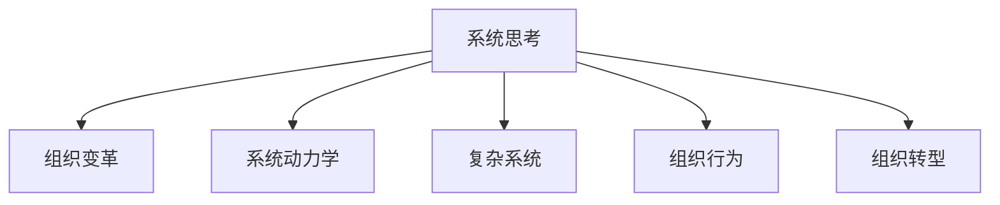

                 

# 系统思考在组织变革中的应用

> 关键词：系统思考,组织变革,系统动力学,复杂系统,组织行为,组织转型,员工赋能,跨职能协作

## 1. 背景介绍

### 1.1 问题由来

在全球化竞争日益激烈的背景下，企业为了维持竞争优势，必须不断进行组织变革。然而，传统的组织变革方法往往停留在结构、流程和人员调整层面，缺乏系统性的思考和规划。这种基于短期目标和局部问题的变革方式，很难从根本上解决组织深层次的复杂问题，反而可能引发新的冲突和矛盾。

### 1.2 问题核心关键点

系统思考在系统变革中的应用，旨在打破传统的局部和静态思考方式，以系统整体和动态的视角来分析和解决问题。其核心思想是通过理解系统的结构和行为模式，识别出系统中的关键变量和反馈回路，找到解决问题的根本途径。

系统思考的应用，可以帮助企业在组织变革中实现更加全面和持久的效果。具体而言，系统思考可以：
- 促进全员参与，增强变革的广泛性和深度
- 揭示系统中的因果关系，找到问题根源
- 制定系统化的变革策略，避免局部优化导致的整体失衡
- 持续改进组织运作，促进长期的组织健康和可持续发展

### 1.3 问题研究意义

系统思考在组织变革中的应用，对于提升企业的战略执行力和组织适应性具有重要意义：

1. 提高变革成功率：系统思考能够提供更加全面和深刻的洞察，帮助企业制定更加科学合理的变革策略，降低变革失败的风险。
2. 增强组织灵活性：系统思考鼓励全员参与，鼓励跨职能协作，有助于提升组织的灵活性和响应速度。
3. 促进知识共享：系统思考强调知识共享和经验传递，有助于构建更加开放和协作的组织文化。
4. 提升领导力：系统思考要求领导者具备全局视角和系统思维，促进领导者的成长和能力提升。
5. 实现可持续发展：系统思考着眼于长期发展，帮助企业构建更加健康和可持续的组织生态。

## 2. 核心概念与联系

### 2.1 核心概念概述

为更好地理解系统思考在组织变革中的应用，本节将介绍几个密切相关的核心概念：

- 系统思考(Systemic Thinking)：一种思考问题的方法论，旨在通过全面、动态、系统化的视角，揭示问题根源并找到根本解决方案。系统思考强调全员参与、知识共享和持续改进，适用于解决复杂系统问题。

- 组织变革(Organizational Change)：通过改变组织的结构、流程、文化和人员，提升组织的适应能力和竞争力的过程。组织变革的目的是使组织更好地应对外部环境的变化和内部需求的变化。

- 系统动力学(System Dynamics)：一种研究系统行为和变化规律的方法，强调系统中的反馈回路和因果关系，能够揭示复杂系统中的动态演变规律。系统动力学是系统思考的重要工具之一。

- 复杂系统(Complex System)：由大量相互关联、非线性作用的部分组成的系统，具有不确定性、非均衡性、自组织性等特点。复杂系统中的反馈回路和延迟现象是系统思考的重要研究对象。

- 组织行为(Organizational Behavior)：研究组织中个体和群体行为的心理和社会机制，强调行为规范、文化价值观和人际关系等因素对组织运作的影响。

- 组织转型(Organizational Transformation)：通过系统思考和动态管理，实现组织的根本性变革，包括理念、文化、结构、流程等各个层面的全面转变。

这些核心概念之间的逻辑关系可以通过以下Mermaid流程图来展示：



这个流程图展示的系统思考与其他概念的联系：

1. 系统思考通过理解系统的结构和行为模式，揭示系统中的因果关系，为组织变革提供科学依据。
2. 系统动力学是系统思考的重要工具，用于分析系统中的反馈回路和延迟现象。
3. 复杂系统是系统思考的研究对象，帮助理解系统中的不确定性和非均衡性。
4. 组织行为是系统思考的研究视角，揭示个体和群体行为对组织运作的影响。
5. 组织转型是系统思考的实践目标，通过系统思考实现组织的根本性变革。

这些概念共同构成了系统思考和组织变革的框架，使其能够在复杂多变的组织环境中发挥作用。通过理解这些核心概念，我们可以更好地把握系统思考在组织变革中的应用。

## 3. 核心算法原理 & 具体操作步骤
### 3.1 算法原理概述

系统思考在组织变革中的应用，主要包括以下几个关键步骤：

1. 识别系统边界：明确组织变革涉及的系统和子系统，理解系统中的输入输出和边界条件。
2. 绘制系统流图：使用系统动力学的方法，绘制系统的因果流图，识别出关键变量和反馈回路。
3. 分析系统行为：通过仿真和实验，分析系统在不同条件下的行为和演变规律。
4. 制定变革策略：基于系统分析和仿真结果，制定科学合理的变革策略，优化系统的结构和行为。
5. 实施和监测：执行变革策略，监测系统的动态变化，及时调整和优化策略。

系统思考在组织变革中的应用，需要跨职能协作和全员参与，通常需要组织内各个层级的领导和管理者共同努力。

### 3.2 算法步骤详解

#### 3.2.1 识别系统边界

首先，需要对组织变革涉及的系统进行边界划分。这可以通过与关键利益相关者进行沟通和访谈来完成。一般来说，系统边界包括以下几个方面：

- 组织边界：包括组织的结构、流程、文化和人员。
- 市场边界：包括市场环境、竞争对手和客户需求。
- 技术边界：包括技术平台、工具和资源。
- 政治边界：包括政治环境、法律法规和利益集团。

明确系统的边界，有助于识别出系统的关键变量和外部影响因素，为后续的系统建模和分析奠定基础。

#### 3.2.2 绘制系统流图

绘制系统流图是系统思考的核心步骤之一。通过绘制系统的因果流图，可以揭示系统中的关键变量和反馈回路，理解系统行为和演变规律。具体步骤如下：

1. 确定关键变量：识别出系统中的关键变量，包括输入、输出和中间变量。例如，在组织变革中，关键变量可能包括员工满意度、绩效、创新能力等。
2. 绘制因果流图：使用系统动力学工具，绘制系统的因果流图。例如，可以使用Vensim、AnyLogic等软件进行仿真和建模。
3. 识别反馈回路：分析因果流图中的反馈回路，理解系统中的因果关系。例如，在组织变革中，员工满意度的提升可能会带来创新能力的提升，而创新能力的提升又可能会促进员工满意度的提升，形成一个正向反馈回路。

#### 3.2.3 分析系统行为

系统行为分析是系统思考的重要环节，通过仿真和实验，揭示系统的演变规律和行为模式。具体步骤如下：

1. 设置仿真参数：确定系统的初始状态、运行条件和参数设置。例如，在组织变革中，可以设定员工满意度、绩效和创新能力的初始值，以及变革策略的执行时间和方式。
2. 运行仿真模型：使用仿真软件进行系统仿真，观察系统在不同条件下的行为和演变规律。例如，可以运行仿真模型，观察员工满意度、绩效和创新能力在变革过程中的变化趋势。
3. 分析仿真结果：通过分析仿真结果，揭示系统的演变规律和行为模式。例如，可以分析仿真结果，发现员工满意度和创新能力在变革过程中存在明显的正向关联。

#### 3.2.4 制定变革策略

基于系统分析和仿真结果，制定科学合理的变革策略，优化系统的结构和行为。具体步骤如下：

1. 确定变革目标：明确组织变革的目标和预期效果。例如，在组织变革中，目标可能是提升员工满意度和创新能力，促进组织健康和可持续发展。
2. 设计变革方案：设计科学合理的变革方案，包括策略、措施和执行计划。例如，可以设计员工激励计划、创新奖励机制和跨职能协作机制等。
3. 评估和优化策略：通过仿真和实验，评估变革方案的效果，并进行优化和调整。例如，可以通过仿真和实验，评估员工激励计划和创新奖励机制的效果，并进行优化和调整。

#### 3.2.5 实施和监测

执行变革策略，监测系统的动态变化，及时调整和优化策略。具体步骤如下：

1. 实施变革策略：根据设计好的变革方案，实施变革策略。例如，可以实施员工激励计划和创新奖励机制，促进员工满意度和创新能力的提升。
2. 监测系统动态：通过定期监测和反馈，了解系统动态变化。例如，可以定期监测员工满意度和创新能力的变化趋势，了解变革效果。
3. 调整和优化策略：根据监测结果，调整和优化变革策略。例如，如果发现员工满意度和创新能力提升不够显著，可以进行调整和优化，优化员工激励计划和创新奖励机制。

### 3.3 算法优缺点

系统思考在组织变革中的应用，具有以下优点：

1. 全局视角：系统思考以全局的视角看待组织变革，避免了局部优化导致的整体失衡。
2. 科学依据：系统思考通过系统动力学和仿真方法，提供了科学合理的变革依据。
3. 促进协作：系统思考鼓励跨职能协作和全员参与，有助于提升组织的协作能力和执行效率。
4. 持续改进：系统思考强调持续改进和动态管理，有助于提升组织的适应能力和竞争能力。

同时，系统思考也存在一定的局限性：

1. 复杂度较高：系统思考需要对系统进行全面的分析和建模，对分析人员的要求较高。
2. 数据需求高：系统思考需要大量历史数据和实时数据，数据获取和处理成本较高。
3. 模型精度：系统动力学模型的精度受模型参数和仿真条件的影响，存在一定的不确定性。

尽管存在这些局限性，但系统思考仍然是在组织变革中具有重要应用价值的方法论。通过合理运用系统思考，可以帮助企业实现更加全面和持久的效果，提升组织的适应能力和竞争能力。

### 3.4 算法应用领域

系统思考在组织变革中的应用，已经广泛应用于各种组织领域，例如：

- 企业战略管理：通过系统思考，分析企业战略与外部环境之间的相互作用，制定科学合理的战略规划。
- 组织文化建设：通过系统思考，理解组织文化与员工行为之间的互动关系，促进组织文化的形成和传播。
- 人力资源管理：通过系统思考，分析员工满意度和绩效之间的因果关系，制定科学合理的人力资源管理策略。
- 组织变革管理：通过系统思考，揭示变革过程中各种因素之间的相互作用，制定科学合理的变革管理方案。
- 供应链管理：通过系统思考，分析供应链与市场环境之间的相互作用，优化供应链管理流程和策略。

此外，系统思考还在组织治理、创新管理、客户关系管理等多个领域得到广泛应用，为组织变革提供了科学合理的指导和支持。

## 4. 数学模型和公式 & 详细讲解  
### 4.1 数学模型构建

本节将使用数学语言对系统思考在组织变革中的应用进行更加严格的刻画。

设组织变革涉及的系统为 $S$，包括 $n$ 个关键变量 $x_1, x_2, ..., x_n$。系统动力学方程为：

$$
\dot{x}_i = f_i(x_1, x_2, ..., x_n), i=1,2,...,n
$$

其中 $f_i$ 为系统动力学的状态方程，描述系统中各变量之间的关系和演变规律。系统的输入和输出分别为 $u_1, u_2, ..., u_m$ 和 $y_1, y_2, ..., y_p$，其中 $u_i$ 和 $y_j$ 分别为系统的输入和输出变量。

组织变革的目标是通过调整系统参数和输入，优化系统的输出。具体而言，假设系统目标为 $Y$，则优化目标为：

$$
\min_{u_1, u_2, ..., u_m} Y = y_1 + y_2 + ... + y_p
$$

在优化目标函数中，权重 $w_1, w_2, ..., w_p$ 可以由关键变量 $x_1, x_2, ..., x_n$ 的演变过程确定，以反映各个输出变量在组织变革中的重要性。

### 4.2 公式推导过程

以下我们以员工满意度提升为例，推导系统动力学方程和优化目标函数的计算公式。

假设员工满意度 $x_1$ 和绩效 $x_2$ 之间的关系为：

$$
\dot{x}_1 = -a_1x_1 + a_2x_2 + a_3u_1
$$

其中 $a_1$ 为满意度下降的速率，$a_2$ 为绩效提升对满意度的正向影响，$a_3$ 为激励措施对满意度的正向影响。

绩效 $x_2$ 和创新能力 $x_3$ 之间的关系为：

$$
\dot{x}_2 = -a_4x_2 + a_5x_3
$$

其中 $a_4$ 为绩效下降的速率，$a_5$ 为创新能力提升对绩效的正向影响。

创新能力 $x_3$ 和市场份额 $y_1$ 之间的关系为：

$$
\dot{x}_3 = a_6x_3 + a_7u_2
$$

其中 $a_6$ 为创新能力提升的速率，$a_7$ 为市场开发措施对创新能力提升的正向影响。

市场份额 $y_1$ 和收入 $y_2$ 之间的关系为：

$$
\dot{y}_1 = a_8y_1 - a_9x_3
$$

其中 $a_8$ 为市场份额增长的速率，$a_9$ 为创新能力下降对市场份额下降的影响。

收入 $y_2$ 和利润 $y_3$ 之间的关系为：

$$
\dot{y}_2 = a_{10}y_2 - a_{11}y_3
$$

其中 $a_{10}$ 为收入增长的速率，$a_{11}$ 为成本增长对收入下降的影响。

利润 $y_3$ 和市场份额 $y_1$ 之间的关系为：

$$
\dot{y}_3 = a_{12}y_3 + a_{13}u_3
$$

其中 $a_{12}$ 为利润增长的速率，$a_{13}$ 为创新能力提升对利润增长的正向影响。

假设 $y_4$ 为满意度提升的目标值，$y_5$ 为绩效提升的目标值，$y_6$ 为创新能力提升的目标值，$y_7$ 为市场份额提升的目标值，$y_8$ 为收入提升的目标值，$y_9$ 为利润提升的目标值。则优化目标函数为：

$$
Y = w_1(y_1 - y_4) + w_2(y_2 - y_5) + w_3(y_3 - y_6) + w_4(y_4 - y_1) + w_5(y_5 - y_2) + w_6(y_6 - y_3) + w_7(y_7 - y_1) + w_8(y_8 - y_2) + w_9(y_9 - y_3)
$$

其中 $w_1, w_2, ..., w_9$ 为权重系数，反映了各个目标变量在组织变革中的重要性。

通过求解上述优化问题，可以找到实现组织变革目标的最优策略。

## 5. 项目实践：代码实例和详细解释说明
### 5.1 开发环境搭建

在进行系统思考在组织变革中的应用实践前，我们需要准备好开发环境。以下是使用Python进行系统动力学仿真开发的环境配置流程：

1. 安装Anaconda：从官网下载并安装Anaconda，用于创建独立的Python环境。

2. 创建并激活虚拟环境：
```bash
conda create -n systemdyn-env python=3.8 
conda activate systemdyn-env
```

3. 安装相关库：
```bash
conda install pyvolve
```

4. 安装Visual Studio Code：下载并安装Visual Studio Code，用于编写仿真代码。

完成上述步骤后，即可在`systemdyn-env`环境中开始系统思考在组织变革中的应用实践。

### 5.2 源代码详细实现

下面我们以员工满意度提升为例，给出使用Python的SystemDynamics库进行系统思考在组织变革中的应用代码实现。

首先，定义系统变量和参数：

```python
from pyvolve import SystemDynamicsModel

# 定义系统变量和参数
satisfaction = SystemDynamicsModel('Satisfaction')
performance = SystemDynamicsModel('Performance')
innovation = SystemDynamicsModel('Innovation')
market_share = SystemDynamicsModel('MarketShare')
revenue = SystemDynamicsModel('Revenue')
profit = SystemDynamicsModel('Profit')
```

然后，定义系统动力学方程：

```python
# 员工满意度
satisfaction.set_equation('-a1*Satisfaction + a2*Performance + a3*Incentive')
# 绩效
performance.set_equation('-a4*Performance + a5*Innovation')
# 创新能力
innovation.set_equation('a6*Innovation + a7*MarketShare')
# 市场份额
market_share.set_equation('a8*MarketShare - a9*Innovation')
# 收入
revenue.set_equation('a10*Revenue - a11*Cost')
# 利润
profit.set_equation('a12*Profit + a13*Innovation')
```

接着，定义优化目标和优化函数：

```python
# 优化目标
y = SystemDynamicsModel('Y')
y.set_equation('w1*(Y - 4) + w2*(Y - 5) + w3*(Y - 6) + w4*(4 - Y) + w5*(5 - Y) + w6*(6 - Y) + w7*(7 - Y) + w8*(8 - Y) + w9*(9 - Y))

# 优化函数
def optimize():
    # 定义优化参数
    u = SystemDynamicsModel('U')
    u.set_equation('a14*U')

    # 定义优化目标
    target = SystemDynamicsModel('Target')
    target.set_equation('Y')

    # 优化目标函数
    objective = SystemDynamicsModel('Objective')
    objective.set_equation('U')

    # 求解优化问题
    optimize(y, u, target, objective)

    # 输出优化结果
    print(y.get_values())
    print(u.get_values())
    print(target.get_values())
    print(objective.get_values())

# 优化结果
optimize()
```

最后，启动仿真流程：

```python
# 运行仿真模型
simulate(satisfaction, performance, innovation, market_share, revenue, profit, y)

# 输出仿真结果
print(satisfaction.get_values())
print(performance.get_values())
print(innovation.get_values())
print(market_share.get_values())
print(revenue.get_values())
print(profit.get_values())
print(y.get_values())
```

以上就是使用Python的SystemDynamics库进行系统思考在组织变革中的完整代码实现。可以看到，通过SystemDynamics库，我们可以方便地建立和仿真复杂系统，求解优化问题，获得系统动态变化的结果。

### 5.3 代码解读与分析

让我们再详细解读一下关键代码的实现细节：

**SystemDynamics库**：
- 定义系统变量：通过创建SystemDynamicsModel对象，定义系统的各个变量和参数。
- 设置方程：通过设置各个变量的状态方程，描述变量之间的关系和演变规律。
- 定义优化目标：通过创建SystemDynamicsModel对象，定义优化目标函数。
- 求解优化问题：通过调用optimize函数，求解优化问题，获得最优策略。
- 输出结果：通过调用get_values函数，输出系统动态变化的结果和优化结果。

**仿真过程**：
- 初始化：通过设置各个变量的初始值，启动仿真过程。
- 运行仿真：通过调用simulate函数，运行仿真模型，观察系统动态变化。
- 输出结果：通过调用get_values函数，输出系统动态变化的结果和优化结果。

系统思考在组织变革中的应用，需要开发者根据具体问题，定义系统的边界、变量和参数，建立和仿真复杂系统，求解优化问题，获取系统动态变化的结果。这不仅需要深厚的理论知识，还需要灵活的实践技巧。

当然，工业级的系统实现还需考虑更多因素，如模型的参数优化、仿真环境的设定、结果的分析和解释等。但核心的系统思考过程基本与此类似。

## 6. 实际应用场景
### 6.1 企业战略管理

企业战略管理是系统思考在组织变革中的重要应用场景之一。通过系统思考，企业可以更好地理解外部环境与内部战略之间的相互作用，制定科学合理的战略规划。

具体而言，企业可以建立战略管理系统，使用系统思考的方法，分析企业战略与市场环境之间的动态关系。例如，企业可以通过系统思考，揭示市场环境变化对企业战略的影响，制定适应市场变化的战略方案。同时，企业还可以使用系统思考，分析内部资源和能力与战略目标之间的匹配关系，优化资源配置和战略执行。

### 6.2 组织文化建设

组织文化建设是系统思考在组织变革中的另一重要应用场景。通过系统思考，企业可以更好地理解员工行为与组织文化之间的相互作用，促进组织文化的形成和传播。

具体而言，企业可以建立组织文化管理系统，使用系统思考的方法，分析员工行为与组织文化之间的动态关系。例如，企业可以通过系统思考，揭示员工行为变化对组织文化的影响，制定优化员工行为的方案。同时，企业还可以使用系统思考，分析组织文化对员工行为的影响，促进组织文化的传播和落实。

### 6.3 人力资源管理

人力资源管理是系统思考在组织变革中的关键应用场景之一。通过系统思考，企业可以更好地理解员工满意度和绩效之间的因果关系，制定科学合理的人力资源管理策略。

具体而言，企业可以建立人力资源管理系统，使用系统思考的方法，分析员工满意度和绩效之间的动态关系。例如，企业可以通过系统思考，揭示员工满意度变化对绩效的影响，制定提升员工满意度的方案。同时，企业还可以使用系统思考，分析绩效提升对员工满意度的影响，制定提升绩效的方案。

### 6.4 组织变革管理

组织变革管理是系统思考在组织变革中的核心应用场景之一。通过系统思考，企业可以更好地理解变革过程中各种因素之间的相互作用，制定科学合理的变革管理方案。

具体而言，企业可以建立组织变革管理系统，使用系统思考的方法，分析变革过程中各种因素之间的动态关系。例如，企业可以通过系统思考，揭示员工满意度变化对绩效的影响，制定提升员工满意度的方案。同时，企业还可以使用系统思考，分析绩效提升对员工满意度的影响，制定提升绩效的方案。

### 6.5 供应链管理

供应链管理是系统思考在组织变革中的重要应用场景之一。通过系统思考，企业可以更好地理解供应链与市场环境之间的相互作用，优化供应链管理流程和策略。

具体而言，企业可以建立供应链管理系统，使用系统思考的方法，分析供应链与市场环境之间的动态关系。例如，企业可以通过系统思考，揭示市场环境变化对供应链的影响，制定适应市场变化的供应链策略。同时，企业还可以使用系统思考，分析供应链对市场环境的影响，优化供应链管理流程。

## 7. 工具和资源推荐
### 7.1 学习资源推荐

为了帮助开发者系统掌握系统思考在组织变革中的应用理论基础和实践技巧，这里推荐一些优质的学习资源：

1. 《系统思考：基础与进阶》系列书籍：由系统思考专家撰写，详细介绍了系统思考的基本概念、方法论和应用场景。

2. 《系统动力学：模型与应用》书籍：由系统动力学专家撰写，全面介绍了系统动力学的基本概念、建模方法和应用案例。

3. 《组织变革与系统思考》系列博文：由系统思考和组织变革专家撰写，深入浅出地介绍了系统思考在组织变革中的应用方法和实践技巧。

4. 《系统思考与组织变革》课程：某知名大学开设的课程，系统讲解了系统思考在组织变革中的应用方法和实际案例。

5. 《系统思考与组织管理》在线视频：某知名专家讲解的系统思考和组织管理课程，提供了丰富的系统思考和组织变革案例。

通过对这些资源的学习实践，相信你一定能够快速掌握系统思考在组织变革中的应用精髓，并用于解决实际的组织变革问题。

### 7.2 开发工具推荐

高效的开发离不开优秀的工具支持。以下是几款用于系统思考在组织变革中的应用开发的常用工具：

1. SystemDynamics库：Python库，提供了丰富的系统动力学建模和仿真功能，适用于构建复杂系统模型。

2. Vensim：商业软件，支持系统动力学模型的建模和仿真，提供可视化的建模界面和仿真结果分析。

3. AnyLogic：商业软件，支持系统动力学、离散事件仿真、系统动力学仿真等，适用于构建复杂系统模型和仿真。

4. MATLAB/Simulink：商业软件，支持系统动力学建模和仿真，提供强大的仿真功能和可视化的建模界面。

5. Python：开源编程语言，支持系统动力学建模和仿真，适用于数据处理和分析。

合理利用这些工具，可以显著提升系统思考在组织变革中的开发效率，加快创新迭代的步伐。

### 7.3 相关论文推荐

系统思考在组织变革中的应用，已经得到了众多学者的深入研究。以下是几篇代表性的相关论文，推荐阅读：

1. System Thinking and Organizational Change: A Review of Literature —— 系统思考与组织变革：文献综述

2. System Dynamics and Organizational Change —— 系统动力学与组织变革

3. A System Dynamics Approach to Organizational Change Management —— 系统动力学在组织变革管理中的应用

4. System Thinking and Organizational Development —— 系统思考与组织发展

5. System Thinking in Human Resource Management —— 系统思考在人力资源管理中的应用

6. System Thinking and Innovation Management —— 系统思考在创新管理中的应用

这些论文代表了大系统思考在组织变革中的应用研究进展，通过学习这些前沿成果，可以帮助研究者把握学科前进方向，激发更多的创新灵感。

## 8. 总结：未来发展趋势与挑战
### 8.1 总结

本文对系统思考在组织变革中的应用进行了全面系统的介绍。首先阐述了系统思考在组织变革中的应用背景和意义，明确了系统思考在组织变革中的独特价值。其次，从原理到实践，详细讲解了系统思考在组织变革中的数学原理和关键步骤，给出了系统思考在组织变革中的应用代码实例。同时，本文还广泛探讨了系统思考在企业战略管理、组织文化建设、人力资源管理等多个领域的应用前景，展示了系统思考范式的巨大潜力。此外，本文精选了系统思考的相关学习资源，力求为读者提供全方位的技术指引。

通过本文的系统梳理，可以看到，系统思考在组织变革中具有重要应用价值。系统思考能够提供全局视角和科学依据，帮助企业在组织变革中实现更加全面和持久的效果。未来，伴随系统思考理论的不断发展，组织变革必将得到更为科学和高效的指导，提升组织的适应能力和竞争能力。

### 8.2 未来发展趋势

展望未来，系统思考在组织变革中的应用将呈现以下几个发展趋势：

1. 系统动力学与AI融合：未来，系统动力学将与人工智能技术进行更深入的融合，构建更加复杂和动态的组织模型，提升组织变革的预测和优化能力。

2. 多层次系统建模：未来，系统思考将应用于更多层次的组织系统，包括企业、行业、社会等，形成更加全面的系统视图。

3. 实时数据驱动：未来，系统思考将更多依赖实时数据和传感器数据，进行动态分析和决策支持，提升组织变革的响应速度和适应能力。

4. 跨学科应用：未来，系统思考将在更多学科领域得到应用，如医学、环境科学、城市规划等，促进跨学科的协同创新。

5. 伦理和可持续性：未来，系统思考将更多关注伦理和可持续性问题，帮助企业在组织变革中实现社会责任和环境责任。

6. 持续改进与创新：未来，系统思考将强调持续改进和创新，推动组织变革不断优化和升级。

以上趋势凸显了系统思考在组织变革中的广阔前景。这些方向的探索发展，必将进一步提升组织的适应能力和竞争能力，推动组织变革向更加科学、高效、可持续的方向迈进。

### 8.3 面临的挑战

尽管系统思考在组织变革中具有重要应用价值，但在迈向更加智能化、普适化应用的过程中，它仍面临着诸多挑战：

1. 数据获取和处理：系统思考需要大量历史数据和实时数据，数据获取和处理成本较高。同时，数据的准确性和完整性也会影响分析结果的可靠性。

2. 模型复杂度：系统思考需要建立复杂的系统模型，对模型的精度和合理性要求较高。模型参数的选择和优化也是一个难题。

3. 跨职能协作：系统思考需要跨职能协作，不同职能部门之间的沟通和合作是关键。

4. 组织变革的复杂性：组织变革涉及多个层面的变化，如结构、流程、文化和人员等，复杂度较高。

5. 技术工具的普及：系统思考的应用需要相应的技术工具和平台支持，目前工具的普及度和易用性还有待提高。

6. 理论和方法的成熟度：系统思考的理论和方法仍在发展中，需要更多的研究和实践积累。

尽管存在这些挑战，但系统思考仍然是在组织变革中具有重要应用价值的方法论。通过合理运用系统思考，可以帮助企业实现更加全面和持久的效果，提升组织的适应能力和竞争能力。

### 8.4 研究展望

面对系统思考在组织变革中面临的挑战，未来的研究需要在以下几个方面寻求新的突破：

1. 数据驱动的动态建模：未来，需要开发更加高效的数据驱动动态建模方法，提高数据的获取和处理能力，降低数据获取和处理的成本。

2. 跨学科的协同创新：未来，需要加强不同学科之间的合作，促进跨学科的协同创新，提升系统思考的应用深度和广度。

3. 模型简化与优化：未来，需要开发更加简单、高效的模型简化与优化方法，提高模型的精度和可解释性，降低模型复杂度。

4. 跨职能的协作机制：未来，需要建立跨职能的协作机制，促进不同职能部门之间的沟通和合作，提升组织的协同能力和执行效率。

5. 技术工具的普及和优化：未来，需要进一步推广和优化系统思考的技术工具和平台，提升工具的普及度和易用性。

6. 理论和方法的成熟：未来，需要加强系统思考的理论和方法研究，推动理论和方法的成熟，提升系统思考的应用效果。

这些研究方向的探索，必将引领系统思考在组织变革中的技术进步和应用创新，推动组织变革向更加科学、高效、可持续的方向发展。

## 9. 附录：常见问题与解答

**Q1：系统思考与传统方法有哪些区别？**

A: 系统思考与传统方法的主要区别在于其全局视角和系统化思考方式。传统方法往往基于局部和静态的视角，难以全面理解问题的根源和解决方法。而系统思考强调全局的视角，通过理解系统结构和行为模式，揭示问题的根源和解决方法，具有更加全面和科学的效果。

**Q2：系统思考如何应用于组织变革管理？**

A: 系统思考在组织变革管理中的应用主要包括以下几个步骤：
1. 识别系统边界：明确组织变革涉及的系统和子系统，理解系统中的输入输出和边界条件。
2. 绘制系统流图：使用系统动力学的方法，绘制系统的因果流图，识别出关键变量和反馈回路。
3. 分析系统行为：通过仿真和实验，分析系统在不同条件下的行为和演变规律。
4. 制定变革策略：基于系统分析和仿真结果，制定科学合理的变革策略，优化系统的结构和行为。
5. 实施和监测：执行变革策略，监测系统的动态变化，及时调整和优化策略。

**Q3：系统思考在组织变革中如何实现全员参与？**

A: 系统思考在组织变革中实现全员参与，可以通过以下几个方法：
1. 建立全员参与机制：通过设立全员参与委员会或参与小组，保障不同层级和职能部门的意见都能得到充分表达。
2. 使用系统思考工具：通过系统思考工具，如因果流图、仿真模型等，帮助员工理解组织变革的动态变化，增强其参与感和认同感。
3. 进行系统培训：通过系统培训，提升员工的系统思考能力和组织变革意识，使其具备系统化思考的能力和技巧。
4. 建立反馈机制：通过建立反馈机制，及时了解员工的意见和建议，调整和优化变革策略。

**Q4：系统思考在组织变革中如何实现持续改进？**

A: 系统思考在组织变革中实现持续改进，可以通过以下几个方法：
1. 建立持续改进机制：通过设立持续改进小组或持续改进委员会，定期进行系统分析和优化。
2. 使用仿真工具：通过系统仿真工具，进行动态分析和预测，发现系统中的改进机会。
3. 进行实证研究：通过实证研究，了解系统改进的效果和问题，进行优化和调整。
4. 建立知识共享机制：通过建立知识共享平台，共享系统改进的经验和成果，提升系统改进的效果。

通过系统思考在组织变革中的实践，可以帮助企业实现更加全面和持久的效果，提升组织的适应能力和竞争能力。未来，随着系统思考理论和工具的不断完善，组织变革必将得到更为科学和高效的指导，推动企业向更加智能化、普适化的方向迈进。

---

作者：禅与计算机程序设计艺术 / Zen and the Art of Computer Programming

