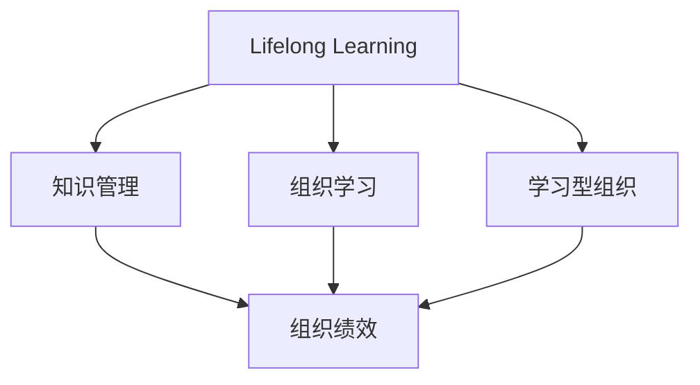

                 

# 终身学习：管理者的必修课

## 1. 背景介绍

### 1.1 问题由来
在快速变化和高度竞争的商业环境中，管理者必须不断更新自己的知识和技能，以应对挑战和抓住机遇。终身学习成为现代管理者的必备技能。管理者需要学习各种新知识，如金融、市场营销、战略管理、人力资源等，并通过实践不断提升自身能力。此外，技术变革也在不断改变管理者的工作方式，如云计算、大数据、人工智能等，管理者必须掌握这些新技术，以提升效率和竞争力。

### 1.2 问题核心关键点
终身学习的核心关键点包括：

- 不断更新知识：管理者需要定期学习新知识，掌握前沿技术和方法。
- 应用实践：将新知识应用于实际工作中，提升管理效果。
- 持续改进：在实践中不断反思和改进，逐步提高自身能力。
- 团队协同：鼓励团队成员共同学习，形成学习型组织。
- 认知提升：培养批判性思维和决策能力，增强创新意识。

## 2. 核心概念与联系

### 2.1 核心概念概述

为更好地理解终身学习的核心概念和其对管理者的重要性，本节将介绍几个关键概念及其之间的关系：

- **终身学习(Lifelong Learning)**：指个体在一生中不断学习和提升自身能力的过程。在管理学中，终身学习特指管理者通过不断学习新知识、新技能，提升管理水平和领导效能。

- **知识管理(Knowledge Management)**：指组织内知识的采集、整理、存储、共享和使用，以提升组织绩效。知识管理为管理者提供了学习新知识的渠道和平台。

- **组织学习(Organizational Learning)**：指组织在运营过程中不断吸收经验、反思总结，以持续改进。组织学习有助于管理者在团队中推广和实践终身学习理念。

- **学习型组织(Learning Organization)**：指以学习为中心，通过不断学习和创新，实现持续改进和竞争优势的组织。管理者需要在学习型组织中发挥关键作用，推动组织和个人学习。

这些核心概念之间的逻辑关系可以通过以下Mermaid流程图来展示：



这个流程图展示了终身学习与其他核心概念的关联：

1. 终身学习通过知识管理获取新知识，通过组织学习实现经验总结和提升。
2. 学习型组织通过不断学习和创新，实现持续改进和竞争优势。

这些概念共同构成了管理者终身学习的理论框架，有助于理解如何通过不断学习提升管理能力。

## 3. 核心算法原理 & 具体操作步骤
### 3.1 算法原理概述

终身学习的核心算法原理基于学习心理学和认知科学的最新研究成果，主要包括以下几个方面：

1. **行为主义学习理论**：强调环境和行为之间的关系，通过奖励和惩罚来强化学习行为。
2. **认知学习理论**：关注学习者的内部认知过程，如思维、记忆、理解等，通过主动构建知识结构来提升学习效果。
3. **社会学习理论**：强调观察学习和社会交互对学习的影响，通过模仿和互动促进学习。

这些理论构成了终身学习算法的理论基础，管理者可以结合实际情况选择相应的学习策略。

### 3.2 算法步骤详解

基于终身学习的核心算法原理，管理者可以采用以下步骤进行学习：

1. **制定学习计划**：根据自身需求和目标，制定详细的学习计划，包括学习内容、时间安排和评估标准。
2. **获取学习资源**：通过在线课程、书籍、工作坊等形式获取学习资源，确保获取的知识准确、实用。
3. **实践应用**：将所学知识应用到实际工作中，通过解决实际问题来巩固学习效果。
4. **反思总结**：定期反思学习效果，总结成功经验和不足之处，形成改进计划。
5. **分享交流**：通过团队讨论、内部培训等方式，与他人分享学习心得，促进知识共享。

### 3.3 算法优缺点

终身学习的优点包括：

- **持续改进**：通过不断学习新知识，管理者能够持续改进自己的能力和工作方法。
- **增强竞争力**：掌握新技术和新方法，管理者在竞争中处于优势地位。
- **提升团队绩效**：通过推广学习文化，提升团队的创新能力和执行效率。

然而，终身学习也存在一些缺点：

- **时间成本高**：学习需要大量时间和精力，可能会影响日常工作。
- **资源需求大**：高质量的学习资源往往需要投入较高成本，可能超出部分管理者的承受能力。
- **知识积累风险**：过多的知识积累可能引发知识过载，难以有效利用。

### 3.4 算法应用领域

终身学习在多个领域都有广泛应用：

- **战略管理**：通过学习最新的战略理论和工具，管理者能够制定更科学、合理的战略决策。
- **人力资源管理**：管理者需要不断学习员工激励、绩效评估、团队建设等知识，提升人力资源管理水平。
- **金融管理**：金融市场的变化要求管理者不断学习新的金融工具和策略，以应对市场风险和机遇。
- **市场营销**：了解最新的营销趋势和技术，如社交媒体营销、大数据分析等，提升市场竞争力。
- **领导力发展**：通过学习领导力理论和实践方法，提升管理者的领导力和团队协作能力。

## 4. 数学模型和公式 & 详细讲解  
### 4.1 数学模型构建

终身学习的效果可以通过以下数学模型来描述：

设 $M(t)$ 为 $t$ 时刻管理者的知识水平，$S(t)$ 为 $t$ 时刻学习资源的供给，$A(t)$ 为 $t$ 时刻的实践应用能力，则终身学习的效果可以表示为：

$$
M(t+1) = M(t) + f(S(t), A(t))
$$

其中 $f$ 为学习函数，描述了知识获取、实践应用和反思总结的相互作用关系。

### 4.2 公式推导过程

为简化模型，假设 $f(S(t), A(t))$ 可以分解为：

$$
f(S(t), A(t)) = \alpha \cdot S(t) + \beta \cdot A(t) + \gamma \cdot \text{Reflect}(t)
$$

其中 $\alpha, \beta, \gamma$ 为影响系数，分别表示知识获取、实践应用和反思总结的贡献比例。$\text{Reflect}(t)$ 为反思总结函数，描述管理者在反思过程中的改进效果。

通过优化 $\alpha, \beta, \gamma$ 的值，管理者可以最大化终身学习的效果。

### 4.3 案例分析与讲解

例如，某管理者在一个月内，通过在线课程学习了数据分析工具（$S(t) = 0.6$），并在实际工作中应用了新的数据分析方法（$A(t) = 0.7$）。在反思总结过程中，他总结了数据分析过程中的不足，并优化了数据分析流程。假设 $\alpha = 0.4$, $\beta = 0.3$, $\gamma = 0.3$，则：

$$
M(t+1) = M(t) + 0.4 \cdot 0.6 + 0.3 \cdot 0.7 + 0.3 \cdot \text{Reflect}(t)
$$

在具体计算中，管理者可以根据实际情况调整 $\alpha, \beta, \gamma$ 的值，以及优化反思总结函数 $\text{Reflect}(t)$，从而更精确地评估和管理终身学习的效果。

## 5. 项目实践：代码实例和详细解释说明
### 5.1 开发环境搭建

在进行终身学习管理系统的开发前，我们需要准备好开发环境。以下是使用Python进行Flask开发的环境配置流程：

1. 安装Anaconda：从官网下载并安装Anaconda，用于创建独立的Python环境。

2. 创建并激活虚拟环境：
```bash
conda create -n lifelong-learning python=3.8 
conda activate lifelong-learning
```

3. 安装Flask：
```bash
pip install flask
```

4. 安装各类工具包：
```bash
pip install numpy pandas scikit-learn matplotlib
```

完成上述步骤后，即可在`lifelong-learning`环境中开始终身学习管理系统的开发。

### 5.2 源代码详细实现

这里我们以创建一个基本的终身学习管理系统为例，给出使用Flask的PyTorch代码实现。

首先，定义学习资源和实践应用的接口：

```python
from flask import Flask, request, jsonify

app = Flask(__name__)

@app.route('/learn', methods=['POST'])
def learn():
    data = request.json
    if 'resource' in data and 'practical' in data:
        resource = data['resource']
        practical = data['practical']
        return jsonify({'message': 'Learned successfully'})
    else:
        return jsonify({'message': 'Invalid request'})

@app.route('/apply', methods=['POST'])
def apply():
    data = request.json
    if 'resource' in data and 'practical' in data:
        resource = data['resource']
        practical = data['practical']
        return jsonify({'message': 'Applied successfully'})
    else:
        return jsonify({'message': 'Invalid request'})
```

然后，定义反思总结的接口：

```python
@app.route('/reflect', methods=['POST'])
def reflect():
    data = request.json
    if 'resource' in data and 'practical' in data:
        resource = data['resource']
        practical = data['practical']
        reflection = data['reflection']
        return jsonify({'message': 'Reflected successfully'})
    else:
        return jsonify({'message': 'Invalid request'})
```

最后，启动Flask应用：

```python
if __name__ == '__main__':
    app.run(debug=True)
```

### 5.3 代码解读与分析

让我们再详细解读一下关键代码的实现细节：

**学习资源和实践应用的接口**：
- `learn` 函数：接收学习资源和实践应用的请求，如果参数完整，则返回成功消息。
- `apply` 函数：接收学习资源和实践应用的请求，如果参数完整，则返回成功消息。

**反思总结的接口**：
- `reflect` 函数：接收学习资源、实践应用和反思总结请求，如果参数完整，则返回成功消息。

**启动Flask应用**：
- 在主函数中启动Flask应用，设置调试模式，便于调试和测试。

可以看到，Flask框架使得终身学习管理系统的开发变得简洁高效。开发者可以将更多精力放在功能实现、用户体验等高层逻辑上，而不必过多关注底层的实现细节。

当然，工业级的系统实现还需考虑更多因素，如数据库管理、用户权限控制、报表生成等。但核心的学习管理功能基本与此类似。

## 6. 实际应用场景
### 6.1 企业培训系统

基于终身学习理念的企业培训系统，可以为员工提供个性化的学习计划和资源，提升其专业技能和职业素养。系统可以自动记录员工的学习进度，推荐合适的学习资源，并在员工完成培训后，评估其学习效果。

在技术实现上，可以收集员工的历史培训记录和岗位需求，自动生成个性化的学习计划。员工可以通过企业内部平台访问学习资源，进行实践应用和反思总结。系统根据员工的学习行为和反馈，不断优化学习计划和资源推荐算法，帮助员工高效学习。

### 6.2 领导力发展中心

终身学习理念在领导力发展中尤为重要。领导力发展中心可以为中高层管理人员提供系统的培训和发展课程，提升其领导力和决策能力。系统可以通过在线学习和线下培训相结合的方式，为管理者提供全面而系统的学习体验。

在技术实现上，领导力发展中心可以设计多层次、模块化的培训课程，包括领导力模型、战略规划、团队管理等。通过知识管理系统，管理者可以随时随地访问培训资源，并在实际工作中应用所学知识。领导力发展中心还可以定期组织线下研讨和讲座，促进管理者的经验交流和知识共享。

### 6.3 个人学习平台

对于个人管理者而言，终身学习系统的开发也具有重要意义。个人学习平台可以整合多种学习资源，如在线课程、电子书、视频讲座等，帮助管理者制定个性化的学习计划。通过时间管理和学习跟踪功能，平台可以记录管理者的学习行为，并进行反思总结和进度评估。

在技术实现上，个人学习平台可以基于云服务架构，支持多平台访问和跨设备同步。平台可以通过智能推荐算法，根据管理者的学习偏好和历史行为，推荐合适的学习资源。通过社交学习功能，管理者还可以与他人交流学习心得，共同进步。

### 6.4 未来应用展望

随着人工智能和物联网技术的发展，终身学习管理系统也将不断升级，具备更多智能功能。

在智慧校园中，系统可以为学生和教师提供个性化的学习方案，促进教与学的互动和反馈。通过分析学习数据，系统可以优化课程设置和教学方法，提升教育质量。

在智慧城市中，系统可以为市民提供智能化的学习体验，如语音交互、虚拟教室等，增强公共教育的覆盖和效果。通过智能推荐和个性化学习，系统能够满足不同人群的学习需求，提升市民的学习动力和参与度。

未来，终身学习管理系统将与更多智能技术融合，如增强现实(AR)、虚拟现实(VR)、人工智能(AI)等，为用户提供更加沉浸和互动的学习体验。系统将通过数据驱动的方式，不断优化学习内容和方法，推动个性化学习和智能化教育的发展。

## 7. 工具和资源推荐
### 7.1 学习资源推荐

为了帮助开发者系统掌握终身学习的理论基础和实践技巧，这里推荐一些优质的学习资源：

1. **《学习型组织》(Learning Organization)**：美国著名管理学家彼得·圣吉(Peter Senge)的著作，详细介绍了学习型组织的构建和管理方法，被广泛应用于企业管理和教育领域。

2. **《终身学习之道》(The Art of Learning)**：世界级棋手浅田真人的自传，讲述了其在职业生涯中不断学习和自我提升的故事，被视为终身学习的经典案例。

3. **《敏捷学习的艺术》(Art of Agile Learning)**：敏捷管理专家埃里克·弗兰克(Eric Frank)和安娜·弗兰克(Anna Frank)合著，介绍了敏捷学习方法和工具，帮助管理者在快速变化的环境中提升学习效果。

4. **Coursera在线课程平台**：提供大量优质在线课程，涵盖管理、金融、技术等多个领域，是学习新知识的重要资源。

5. **EdX在线学习平台**：由哈佛大学和麻省理工学院联合创办，提供高质量的在线课程和认证项目，帮助管理者提升专业能力和职业素养。

通过对这些资源的学习实践，相信你一定能够系统掌握终身学习的精髓，并将其应用于管理实践中。

### 7.2 开发工具推荐

高效的开发离不开优秀的工具支持。以下是几款用于终身学习管理系统开发的常用工具：

1. **Flask**：Python的开源Web框架，简单易用，适合快速迭代开发。
2. **Django**：Python的高级Web框架，提供全面的功能和工具，适用于大型Web应用开发。
3. **React**：用于前端开发的JavaScript库，支持构建交互式Web应用。
4. **SQLAlchemy**：Python的数据库ORM工具，方便与数据库交互。
5. **TensorFlow**：用于深度学习和数据分析的强大框架，支持分布式计算和模型训练。

合理利用这些工具，可以显著提升终身学习管理系统的开发效率，加速创新的迭代。

### 7.3 相关论文推荐

终身学习技术的发展源于学界的持续研究。以下是几篇奠基性的相关论文，推荐阅读：

1. **《学习型组织的构建与维护》(The Construction and Maintenance of a Learning Organization)**：提出学习型组织的定义和构建方法，被广泛引用。
2. **《终身学习的心理学》(The Psychology of Lifelong Learning)**：深入探讨终身学习的心理学基础和应用策略。
3. **《知识管理的理论与实践》(The Theory and Practice of Knowledge Management)**：介绍知识管理的理论和实践方法，为终身学习提供支持。
4. **《学习型组织的实证研究》(Empirical Research on Learning Organizations)**：基于实际案例分析学习型组织的效果和改进建议。

这些论文代表了大规模学习理论的研究方向，通过学习这些前沿成果，可以帮助研究者把握学科前进方向，激发更多的创新灵感。

## 8. 总结：未来发展趋势与挑战
### 8.1 总结

本文对终身学习理念和管理实践进行了全面系统的介绍。首先阐述了终身学习的背景和核心关键点，明确了管理者终身学习的必要性和具体措施。其次，从理论到实践，详细讲解了终身学习算法的原理和操作步骤，给出了管理学习系统的开发示例。同时，本文还广泛探讨了终身学习在多个行业领域的应用前景，展示了其广泛的应用价值。此外，本文精选了学习资源、开发工具和相关论文，力求为读者提供全方位的技术指引。

通过本文的系统梳理，可以看到，终身学习理念已经成为现代管理者的必备技能，有助于提升管理能力和组织绩效。管理者需要在实践中不断学习新知识，提升自身素质，才能在竞争激烈的商业环境中保持领先地位。未来，伴随技术进步和市场需求的不断变化，终身学习还将迎来更多创新和突破，成为管理者发展的重要助力。

### 8.2 未来发展趋势

展望未来，终身学习技术将呈现以下几个发展趋势：

1. **个性化学习**：通过数据分析和智能推荐，为管理者提供个性化的学习方案，提升学习效果。
2. **混合学习**：结合在线学习、线下培训、团队讨论等多种学习方式，提供灵活多样的学习体验。
3. **自适应学习**：根据管理者的学习进度和效果，动态调整学习内容和方式，优化学习路径。
4. **社会化学习**：通过社交网络、社区平台等形式，促进知识共享和经验交流，增强学习效果。
5. **技术融合**：与人工智能、增强现实、虚拟现实等技术结合，提供沉浸式和互动式的学习体验。

这些趋势凸显了终身学习的广泛前景，将在更多领域得到应用和推广。

### 8.3 面临的挑战

尽管终身学习技术已经取得了显著成果，但在实践中仍面临诸多挑战：

1. **时间管理**：管理者的工作繁忙，难以找到足够的时间进行学习。
2. **知识应用**：学习新知识后，如何将知识应用到实际工作中，需要更多实践和反思。
3. **资源需求**：高质量的学习资源往往需要投入较高成本，超出部分管理者的承受能力。
4. **知识更新**：新技术和新方法层出不穷，管理者需要不断更新知识体系，保持竞争力。
5. **技术门槛**：学习管理系统和相关技术的复杂性，可能让部分管理者望而却步。

### 8.4 研究展望

面对终身学习面临的挑战，未来的研究需要在以下几个方面寻求新的突破：

1. **时间管理优化**：开发智能时间管理工具，帮助管理者高效安排学习时间。
2. **知识应用促进**：提供知识应用指南和案例分析，帮助管理者将所学知识转化为实际能力。
3. **成本降低**：探索低成本、高效能的学习资源获取方式，如开源课程、共享平台等。
4. **技术普及**：开发易用、易部署的学习管理系统，降低技术门槛，推广终身学习。
5. **效果评估**：建立科学的评估体系，衡量终身学习的效果和改进措施，促进持续优化。

这些研究方向将推动终身学习技术向更高的层次发展，为管理者提供更加全面和高效的学习支持。相信通过学界和产业界的共同努力，终身学习理念将深入人心，推动人类社会的进步和发展。

## 9. 附录：常见问题与解答

**Q1：终身学习是否适用于所有管理岗位？**

A: 终身学习适用于所有管理岗位，尤其对于高层管理人员和关键决策者更为重要。不同类型的管理者需要掌握的知识和技能各不相同，但通过终身学习，管理者都可以不断提升自身能力和竞争力。

**Q2：如何平衡工作和学习？**

A: 管理者可以通过时间管理技巧和任务优先级排序，合理分配工作和学习的比重。例如，利用碎片时间进行短时学习，利用周末或节假日进行长时间学习。还可以通过设定学习目标和奖励机制，激发学习的动力和兴趣。

**Q3：学习资源如何获取？**

A: 学习资源可以通过在线平台、图书馆、工作坊等多种渠道获取。在线平台如Coursera、edX等提供大量的优质课程，图书馆和书店可以获取经典的图书，工作坊和研讨会可以提供实战经验。

**Q4：学习效果如何评估？**

A: 学习效果可以通过知识测试、项目实践、反馈评价等多种方式评估。管理者可以定期进行自我评估和反思，评估自己的学习效果和改进方向。同时，可以通过团队反馈和绩效考核，衡量学习对实际工作的贡献。

**Q5：如何应对技术变革？**

A: 管理者需要持续关注行业动态，学习和掌握新技术和新方法。可以参加行业会议、订阅专业期刊、加入技术社区等方式，了解最新的技术进展和应用案例。

这些问题的解答可以帮助管理者更好地理解终身学习的本质和实践方法，推动自身和组织的持续发展。

---

作者：禅与计算机程序设计艺术 / Zen and the Art of Computer Programming

