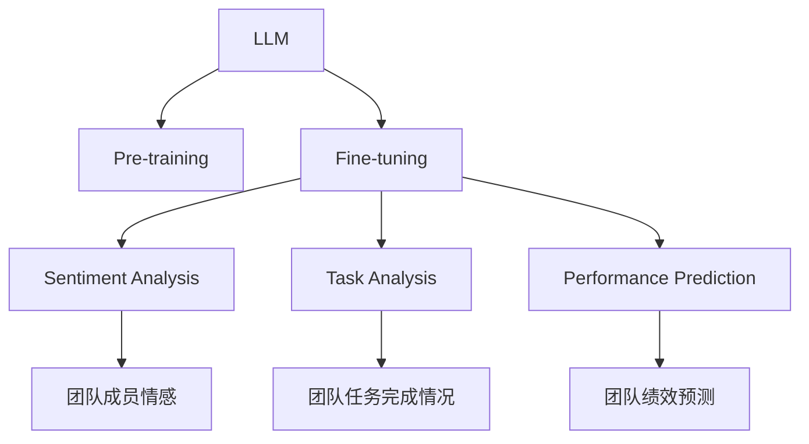

                 

# 绩效管理分析师：LLM 提升团队绩效

> 关键词：大语言模型(LLM), 团队绩效, 数据分析, 自然语言处理(NLP), 人工智能(AI), 预测模型, 员工反馈

## 1. 背景介绍

### 1.1 问题由来
在现代企业中，团队绩效管理是提升组织效率和员工满意度的关键。传统的绩效管理方式依赖于问卷调查、数据分析、绩效评估等手段，存在数据收集困难、分析过程复杂、评估结果主观等问题。而自然语言处理(NLP)和人工智能(AI)技术的发展，为绩效管理提供了新的思路和工具。

近年来，大语言模型(LLM)在NLP领域的突破性进展，为团队绩效管理带来了革命性的改变。LLM模型通过大规模无监督预训练和有监督微调，具备强大的语言理解和生成能力，可以处理大量非结构化数据，从而为团队绩效分析提供更为智能、高效的手段。

### 1.2 问题核心关键点
如何利用LLM技术提升团队绩效管理，成为当前HR和团队管理的重要课题。通过大语言模型，可以从团队文档、会议记录、反馈数据等多个维度进行综合分析，及时发现问题和改进措施。具体问题核心关键点包括：

- **数据获取与处理**：如何快速、准确地获取和处理团队成员的反馈数据。
- **情感分析**：如何分析团队成员的情感倾向，了解其满意度、压力水平等。
- **任务分析**：如何通过文本分析，识别团队成员的任务完成情况和挑战。
- **能力评估**：如何根据文档和记录，评估团队成员的技能水平和工作态度。
- **预测模型**：如何构建预测模型，预测团队绩效的提升路径。

## 2. 核心概念与联系

### 2.1 核心概念概述

为更好地理解基于LLM的团队绩效管理方法，本节将介绍几个关键概念：

- **大语言模型(LLM)**：以自回归或自编码模型为代表的、大规模预训练语言模型，通过在海量无标签文本语料上进行预训练，学习通用的语言表示，具备强大的语言理解和生成能力。
- **预训练(Pre-training)**：指在大规模无标签文本语料上，通过自监督学习任务训练通用语言模型的过程。
- **微调(Fine-tuning)**：指在预训练模型的基础上，使用下游任务的少量标注数据，通过有监督学习优化模型在该任务上的性能。
- **情感分析(Sentiment Analysis)**：通过分析文本中的情感倾向，了解用户对某事件或产品的态度。
- **自然语言处理(NLP)**：使计算机能够理解、分析、生成人类语言的技术，包括文本分类、实体识别、关系抽取、生成等任务。
- **人工智能(AI)**：模拟人类智能行为，包括学习、推理、决策等能力的机器系统。
- **预测模型(Prediction Model)**：通过历史数据预测未来趋势的模型，如回归模型、分类模型、序列模型等。

这些概念之间的逻辑关系可以通过以下Mermaid流程图来展示：



这个流程图展示了大语言模型的核心概念及其之间的关系：

1. LLM通过预训练获得基础能力。
2. Fine-tuning对预训练模型进行任务特定的优化，可以用于情感分析、任务分析、绩效预测等多个任务。
3. Sentiment Analysis、Task Analysis等是Fine-tuning中常用的下游任务。
4. Performance Prediction结合历史数据，预测团队绩效的未来变化。

## 3. 核心算法原理 & 具体操作步骤
### 3.1 算法原理概述

基于LLM的团队绩效管理，本质上是一个多任务学习的任务。其核心思想是：利用大语言模型对团队文档、会议记录、反馈数据等多个维度的非结构化数据进行处理，从中提取有价值的信息，用于情感分析、任务分析、绩效预测等任务，从而提升团队管理的效果。

形式化地，假设团队数据集为 $D=\{(x_i,y_i)\}_{i=1}^N$，其中 $x_i$ 为输入（如团队文档、会议记录），$y_i$ 为标注数据（如情感标签、任务完成度等）。LLM模型 $M_{\theta}$ 通过预训练获得初始参数 $\theta$，然后使用Fine-tuning方法，在团队绩效管理任务上进行优化，使得模型输出逼近真实标签。

具体而言，Fine-tuning过程通常包括以下几个步骤：

1. 准备预训练模型和数据集
2. 添加任务适配层
3. 设置微调超参数
4. 执行梯度训练
5. 测试和部署

### 3.2 算法步骤详解

基于LLM的团队绩效管理，通常包括以下几个关键步骤：

**Step 1: 准备预训练模型和数据集**
- 选择合适的预训练语言模型 $M_{\theta}$ 作为初始化参数，如 BERT、GPT等。
- 准备团队绩效管理任务的标注数据集 $D$，划分为训练集、验证集和测试集。标注数据包括文本文档、会议记录、反馈问卷等，标注内容如情感标签、任务完成度、能力评价等。

**Step 2: 添加任务适配层**
- 根据团队绩效管理任务的性质，在预训练模型顶层设计合适的输出层和损失函数。
- 对于情感分析任务，通常在顶层添加分类器，使用交叉熵损失函数。
- 对于任务分析，使用序列标注器，如BiLSTM-CRF，输出任务完成情况。
- 对于绩效预测，使用回归器，如线性回归、RNN等，输出绩效评分。

**Step 3: 设置微调超参数**
- 选择合适的优化算法及其参数，如 AdamW、SGD 等，设置学习率、批大小、迭代轮数等。
- 设置正则化技术及强度，包括权重衰减、Dropout、Early Stopping等。
- 确定冻结预训练参数的策略，如仅微调顶层，或全部参数都参与微调。

**Step 4: 执行梯度训练**
- 将训练集数据分批次输入模型，前向传播计算损失函数。
- 反向传播计算参数梯度，根据设定的优化算法和学习率更新模型参数。
- 周期性在验证集上评估模型性能，根据性能指标决定是否触发 Early Stopping。
- 重复上述步骤直到满足预设的迭代轮数或 Early Stopping 条件。

**Step 5: 测试和部署**
- 在测试集上评估微调后模型 $M_{\hat{\theta}}$ 的性能，对比微调前后的精度提升。
- 使用微调后的模型对新数据进行推理预测，集成到实际的应用系统中。
- 持续收集新的数据，定期重新微调模型，以适应数据分布的变化。

以上是基于LLM的团队绩效管理的一般流程。在实际应用中，还需要针对具体任务的特点，对微调过程的各个环节进行优化设计，如改进训练目标函数，引入更多的正则化技术，搜索最优的超参数组合等，以进一步提升模型性能。

### 3.3 算法优缺点

基于LLM的团队绩效管理方法具有以下优点：
1. 数据利用率高。LLM模型能够处理非结构化文本数据，从大量文档中提取有价值信息。
2. 分析结果客观。通过模型学习，可以去除人工评估的主观偏差。
3. 预测精准度高。通过预测模型，可以提前发现团队绩效问题，及时采取措施。
4. 实时性高。LLM模型可以实时处理文本数据，快速输出分析结果。

同时，该方法也存在一定的局限性：
1. 数据质量依赖高。模型的效果依赖于标注数据的准确性和全面性，标注成本较高。
2. 上下文理解能力有限。LLM模型在处理复杂文本时，可能会丢失上下文信息，影响分析效果。
3. 领域特定性强。通用模型往往需要针对特定领域进行微调，才能取得良好效果。
4. 计算资源消耗大。大模型训练和推理需要较高的计算资源和存储能力。
5. 可解释性不足。模型决策过程缺乏可解释性，难以对其推理逻辑进行分析和调试。

尽管存在这些局限性，但就目前而言，基于LLM的团队绩效管理方法仍是最主流范式之一。未来相关研究的重点在于如何进一步降低数据标注成本，提高模型的少样本学习和跨领域迁移能力，同时兼顾可解释性和伦理安全性等因素。

### 3.4 算法应用领域

基于LLM的团队绩效管理方法，在企业人力资源管理、项目管理、团队协作等领域已经得到了广泛的应用，为团队管理提供了新的解决方案。

- **人力资源管理**：通过LLM模型分析员工反馈、绩效评估、培训记录等数据，了解员工满意度和需求，优化人力资源管理策略。
- **项目管理**：使用LLM模型分析项目文档、会议记录、任务进度等数据，评估项目执行情况，预测项目风险，优化项目管理流程。
- **团队协作**：通过LLM模型分析团队沟通记录、协作文档等数据，评估团队协作效果，发现协作问题，提升团队协作效率。
- **知识管理**：使用LLM模型分析团队文档、学习资料等数据，提取关键知识，构建知识图谱，支持团队知识共享和传承。

除了上述这些经典应用外，LLM模型还在智能招聘、员工健康监测、团队文化建设等多个场景中得到了创新性的应用，为团队管理带来了新的突破。

## 4. 数学模型和公式 & 详细讲解  
### 4.1 数学模型构建

本节将使用数学语言对基于LLM的团队绩效管理过程进行更加严格的刻画。

记团队数据集为 $D=\{(x_i,y_i)\}_{i=1}^N$，其中 $x_i$ 为输入文本，$y_i$ 为情感标签、任务完成度等标注数据。

定义模型 $M_{\theta}$ 在输入 $x$ 上的输出为 $\hat{y}=M_{\theta}(x) \in \mathcal{Y}$，其中 $\mathcal{Y}$ 为模型输出空间，如情感分类、任务完成度评分等。

定义模型 $M_{\theta}$ 在数据样本 $(x,y)$ 上的损失函数为 $\ell(M_{\theta}(x),y)$，则在数据集 $D$ 上的经验风险为：

$$
\mathcal{L}(\theta) = \frac{1}{N} \sum_{i=1}^N \ell(M_{\theta}(x_i),y_i)
$$

微调的优化目标是最小化经验风险，即找到最优参数：

$$
\theta^* = \mathop{\arg\min}_{\theta} \mathcal{L}(\theta)
$$

在实践中，我们通常使用基于梯度的优化算法（如SGD、Adam等）来近似求解上述最优化问题。设 $\eta$ 为学习率，$\lambda$ 为正则化系数，则参数的更新公式为：

$$
\theta \leftarrow \theta - \eta \nabla_{\theta}\mathcal{L}(\theta) - \eta\lambda\theta
$$

其中 $\nabla_{\theta}\mathcal{L}(\theta)$ 为损失函数对参数 $\theta$ 的梯度，可通过反向传播算法高效计算。

### 4.2 公式推导过程

以下我们以情感分析任务为例，推导交叉熵损失函数及其梯度的计算公式。

假设模型 $M_{\theta}$ 在输入 $x$ 上的输出为 $\hat{y}=M_{\theta}(x) \in [0,1]$，表示样本属于情感正向的概率。真实标签 $y \in \{0,1\}$。则二分类交叉熵损失函数定义为：

$$
\ell(M_{\theta}(x),y) = -[y\log \hat{y} + (1-y)\log (1-\hat{y})]
$$

将其代入经验风险公式，得：

$$
\mathcal{L}(\theta) = -\frac{1}{N}\sum_{i=1}^N [y_i\log M_{\theta}(x_i)+(1-y_i)\log(1-M_{\theta}(x_i))]
$$

根据链式法则，损失函数对参数 $\theta_k$ 的梯度为：

$$
\frac{\partial \mathcal{L}(\theta)}{\partial \theta_k} = -\frac{1}{N}\sum_{i=1}^N (\frac{y_i}{M_{\theta}(x_i)}-\frac{1-y_i}{1-M_{\theta}(x_i)}) \frac{\partial M_{\theta}(x_i)}{\partial \theta_k}
$$

其中 $\frac{\partial M_{\theta}(x_i)}{\partial \theta_k}$ 可进一步递归展开，利用自动微分技术完成计算。

在得到损失函数的梯度后，即可带入参数更新公式，完成模型的迭代优化。重复上述过程直至收敛，最终得到适应情感分析任务的最优模型参数 $\theta^*$。

## 5. 项目实践：代码实例和详细解释说明
### 5.1 开发环境搭建

在进行LLM微调实践前，我们需要准备好开发环境。以下是使用Python进行PyTorch开发的环境配置流程：

1. 安装Anaconda：从官网下载并安装Anaconda，用于创建独立的Python环境。

2. 创建并激活虚拟环境：
```bash
conda create -n pytorch-env python=3.8 
conda activate pytorch-env
```

3. 安装PyTorch：根据CUDA版本，从官网获取对应的安装命令。例如：
```bash
conda install pytorch torchvision torchaudio cudatoolkit=11.1 -c pytorch -c conda-forge
```

4. 安装Transformers库：
```bash
pip install transformers
```

5. 安装各类工具包：
```bash
pip install numpy pandas scikit-learn matplotlib tqdm jupyter notebook ipython
```

完成上述步骤后，即可在`pytorch-env`环境中开始微调实践。

### 5.2 源代码详细实现

下面我以情感分析任务为例，给出使用Transformers库对BERT模型进行微调的PyTorch代码实现。

首先，定义情感分析任务的数据处理函数：

```python
from transformers import BertTokenizer
from torch.utils.data import Dataset
import torch

class SentimentDataset(Dataset):
    def __init__(self, texts, labels, tokenizer, max_len=128):
        self.texts = texts
        self.labels = labels
        self.tokenizer = tokenizer
        self.max_len = max_len
        
    def __len__(self):
        return len(self.texts)
    
    def __getitem__(self, item):
        text = self.texts[item]
        label = self.labels[item]
        
        encoding = self.tokenizer(text, return_tensors='pt', max_length=self.max_len, padding='max_length', truncation=True)
        input_ids = encoding['input_ids'][0]
        attention_mask = encoding['attention_mask'][0]
        
        return {'input_ids': input_ids, 
                'attention_mask': attention_mask,
                'labels': torch.tensor(label, dtype=torch.long)}
```

然后，定义模型和优化器：

```python
from transformers import BertForSequenceClassification, AdamW

model = BertForSequenceClassification.from_pretrained('bert-base-cased', num_labels=2)

optimizer = AdamW(model.parameters(), lr=2e-5)
```

接着，定义训练和评估函数：

```python
from torch.utils.data import DataLoader
from tqdm import tqdm
from sklearn.metrics import classification_report

device = torch.device('cuda') if torch.cuda.is_available() else torch.device('cpu')
model.to(device)

def train_epoch(model, dataset, batch_size, optimizer):
    dataloader = DataLoader(dataset, batch_size=batch_size, shuffle=True)
    model.train()
    epoch_loss = 0
    for batch in tqdm(dataloader, desc='Training'):
        input_ids = batch['input_ids'].to(device)
        attention_mask = batch['attention_mask'].to(device)
        labels = batch['labels'].to(device)
        model.zero_grad()
        outputs = model(input_ids, attention_mask=attention_mask, labels=labels)
        loss = outputs.loss
        epoch_loss += loss.item()
        loss.backward()
        optimizer.step()
    return epoch_loss / len(dataloader)

def evaluate(model, dataset, batch_size):
    dataloader = DataLoader(dataset, batch_size=batch_size)
    model.eval()
    preds, labels = [], []
    with torch.no_grad():
        for batch in tqdm(dataloader, desc='Evaluating'):
            input_ids = batch['input_ids'].to(device)
            attention_mask = batch['attention_mask'].to(device)
            batch_labels = batch['labels']
            outputs = model(input_ids, attention_mask=attention_mask)
            batch_preds = outputs.logits.argmax(dim=1).to('cpu').tolist()
            batch_labels = batch_labels.to('cpu').tolist()
            for pred, label in zip(batch_preds, batch_labels):
                preds.append(pred)
                labels.append(label)
                
    print(classification_report(labels, preds))
```

最后，启动训练流程并在测试集上评估：

```python
epochs = 5
batch_size = 16

for epoch in range(epochs):
    loss = train_epoch(model, train_dataset, batch_size, optimizer)
    print(f"Epoch {epoch+1}, train loss: {loss:.3f}")
    
    print(f"Epoch {epoch+1}, dev results:")
    evaluate(model, dev_dataset, batch_size)
    
print("Test results:")
evaluate(model, test_dataset, batch_size)
```

以上就是使用PyTorch对BERT进行情感分析任务微调的完整代码实现。可以看到，得益于Transformers库的强大封装，我们可以用相对简洁的代码完成BERT模型的加载和微调。

### 5.3 代码解读与分析

让我们再详细解读一下关键代码的实现细节：

**SentimentDataset类**：
- `__init__`方法：初始化文本、标签、分词器等关键组件。
- `__len__`方法：返回数据集的样本数量。
- `__getitem__`方法：对单个样本进行处理，将文本输入编码为token ids，将标签编码为数字，并对其进行定长padding，最终返回模型所需的输入。

**情感分析任务的数据处理**：
- 使用BertTokenizer将文本数据进行分词和编码。
- 将标签转换为数字，并纳入模型训练。
- 进行定长padding，使所有样本输入的token ids长度一致。

**训练和评估函数**：
- 使用PyTorch的DataLoader对数据集进行批次化加载，供模型训练和推理使用。
- 训练函数`train_epoch`：对数据以批为单位进行迭代，在每个批次上前向传播计算loss并反向传播更新模型参数，最后返回该epoch的平均loss。
- 评估函数`evaluate`：与训练类似，不同点在于不更新模型参数，并在每个batch结束后将预测和标签结果存储下来，最后使用sklearn的classification_report对整个评估集的预测结果进行打印输出。

**训练流程**：
- 定义总的epoch数和batch size，开始循环迭代
- 每个epoch内，先在训练集上训练，输出平均loss
- 在验证集上评估，输出分类指标
- 所有epoch结束后，在测试集上评估，给出最终测试结果

可以看到，PyTorch配合Transformers库使得BERT微调的代码实现变得简洁高效。开发者可以将更多精力放在数据处理、模型改进等高层逻辑上，而不必过多关注底层的实现细节。

当然，工业级的系统实现还需考虑更多因素，如模型的保存和部署、超参数的自动搜索、更灵活的任务适配层等。但核心的微调范式基本与此类似。

## 6. 实际应用场景
### 6.1 员工绩效管理

基于大语言模型微调的情感分析技术，可以应用于员工绩效管理的各个环节。通过分析员工的反馈文本、会议记录、工作日志等数据，可以实时监控员工的情感状态和工作满意度。

在技术实现上，可以收集员工的历史绩效评估、反馈问卷、任务完成记录等文本数据，将文本数据作为模型输入，情感标签作为标注数据。在此基础上对预训练语言模型进行微调，使其能够自动分析员工的情感倾向，了解其工作状态和心理需求。

**实际应用示例**：
- **员工情绪监测**：通过分析员工的日常沟通记录，识别出负面情绪、压力水平等，及时提供心理辅导和支持。
- **绩效预警**：根据员工的情绪变化，预测其绩效下滑的风险，提前采取干预措施。
- **任务分配优化**：根据员工的情绪和能力，合理分配任务，提高工作效率。

### 6.2 项目管理

使用基于LLM的情感分析技术，可以对项目管理中的文档、会议记录等非结构化数据进行分析，了解项目团队的情绪状态和合作效果。

在实际应用中，可以收集项目团队的历史沟通记录、会议纪要、任务进展等文本数据，将其作为模型输入，情感标签作为标注数据。在此基础上对预训练语言模型进行微调，使其能够自动分析项目团队的情感倾向，评估项目的合作效果和执行情况。

**实际应用示例**：
- **项目情绪监测**：通过分析项目团队的沟通记录，识别出负面情绪和冲突点，及时协调和解决问题。
- **项目风险预警**：根据团队的情绪状态，预测项目执行风险，提前采取措施。
- **团队协作优化**：通过情感分析，了解团队成员的合作效果，优化团队协作方式。

### 6.3 人力资源管理

使用基于LLM的情感分析技术，可以对员工反馈、绩效评估、培训记录等文本数据进行分析，了解员工的工作满意度、需求和建议。

在实际应用中，可以收集员工的绩效评估反馈、培训记录、员工满意度调查等文本数据，将其作为模型输入，情感标签作为标注数据。在此基础上对预训练语言模型进行微调，使其能够自动分析员工的情绪倾向，识别出工作中的问题和需求。

**实际应用示例**：
- **员工满意度分析**：通过分析员工的反馈文本，了解员工对工作环境、薪酬福利、职业发展等方面的满意度。
- **员工需求识别**：根据员工的反馈文本，识别出其工作中的需求和痛点，优化人力资源管理策略。
- **培训效果评估**：通过分析培训后的员工反馈，评估培训效果，优化培训内容和方法。

### 6.4 未来应用展望

随着LLM技术的不断进步，基于微调范式的绩效管理方法将展现出更广阔的应用前景。

在智慧人力资源领域，基于LLM的情感分析、任务分析等技术，可以为人力资源管理提供更智能、高效的手段，优化人力资源配置，提升员工满意度。

在智能项目管理中，LLM模型可以通过情感分析、任务分析等技术，帮助项目管理者更好地了解团队状态，预测项目风险，优化项目管理流程。

在智能团队协作中，LLM模型可以通过情感分析、任务分析等技术，提升团队成员的合作效果，优化团队协作方式，增强团队凝聚力。

除了上述这些经典应用外，LLM模型还在员工健康监测、员工培养、组织文化建设等多个场景中得到了创新性的应用，为绩效管理提供了新的突破。随着技术的日益成熟，LLM模型必将在绩效管理领域大放异彩，为组织管理带来新的变革。

## 7. 工具和资源推荐
### 7.1 学习资源推荐

为了帮助开发者系统掌握LLM的微调方法，这里推荐一些优质的学习资源：

1. 《Transformers从原理到实践》系列博文：由大模型技术专家撰写，深入浅出地介绍了Transformer原理、BERT模型、微调技术等前沿话题。

2. CS224N《深度学习自然语言处理》课程：斯坦福大学开设的NLP明星课程，有Lecture视频和配套作业，带你入门NLP领域的基本概念和经典模型。

3. 《Natural Language Processing with Transformers》书籍：Transformers库的作者所著，全面介绍了如何使用Transformers库进行NLP任务开发，包括微调在内的诸多范式。

4. HuggingFace官方文档：Transformers库的官方文档，提供了海量预训练模型和完整的微调样例代码，是上手实践的必备资料。

5. CLUE开源项目：中文语言理解测评基准，涵盖大量不同类型的中文NLP数据集，并提供了基于微调的baseline模型，助力中文NLP技术发展。

通过对这些资源的学习实践，相信你一定能够快速掌握LLM微调的精髓，并用于解决实际的绩效管理问题。
###  7.2 开发工具推荐

高效的开发离不开优秀的工具支持。以下是几款用于LLM微调开发的常用工具：

1. PyTorch：基于Python的开源深度学习框架，灵活动态的计算图，适合快速迭代研究。大部分预训练语言模型都有PyTorch版本的实现。

2. TensorFlow：由Google主导开发的开源深度学习框架，生产部署方便，适合大规模工程应用。同样有丰富的预训练语言模型资源。

3. Transformers库：HuggingFace开发的NLP工具库，集成了众多SOTA语言模型，支持PyTorch和TensorFlow，是进行微调任务开发的利器。

4. Weights & Biases：模型训练的实验跟踪工具，可以记录和可视化模型训练过程中的各项指标，方便对比和调优。与主流深度学习框架无缝集成。

5. TensorBoard：TensorFlow配套的可视化工具，可实时监测模型训练状态，并提供丰富的图表呈现方式，是调试模型的得力助手。

6. Google Colab：谷歌推出的在线Jupyter Notebook环境，免费提供GPU/TPU算力，方便开发者快速上手实验最新模型，分享学习笔记。

合理利用这些工具，可以显著提升LLM微调任务的开发效率，加快创新迭代的步伐。

### 7.3 相关论文推荐

LLM和微调技术的发展源于学界的持续研究。以下是几篇奠基性的相关论文，推荐阅读：

1. Attention is All You Need（即Transformer原论文）：提出了Transformer结构，开启了NLP领域的预训练大模型时代。

2. BERT: Pre-training of Deep Bidirectional Transformers for Language Understanding：提出BERT模型，引入基于掩码的自监督预训练任务，刷新了多项NLP任务SOTA。

3. Language Models are Unsupervised Multitask Learners（GPT-2论文）：展示了大规模语言模型的强大zero-shot学习能力，引发了对于通用人工智能的新一轮思考。

4. Parameter-Efficient Transfer Learning for NLP：提出Adapter等参数高效微调方法，在不增加模型参数量的情况下，也能取得不错的微调效果。

5. Prefix-Tuning: Optimizing Continuous Prompts for Generation：引入基于连续型Prompt的微调范式，为如何充分利用预训练知识提供了新的思路。

6. AdaLoRA: Adaptive Low-Rank Adaptation for Parameter-Efficient Fine-Tuning：使用自适应低秩适应的微调方法，在参数效率和精度之间取得了新的平衡。

这些论文代表了大语言模型微调技术的发展脉络。通过学习这些前沿成果，可以帮助研究者把握学科前进方向，激发更多的创新灵感。

## 8. 总结：未来发展趋势与挑战

### 8.1 总结

本文对基于LLM的团队绩效管理方法进行了全面系统的介绍。首先阐述了LLM和微调技术的研究背景和意义，明确了微调在拓展预训练模型应用、提升下游任务性能方面的独特价值。其次，从原理到实践，详细讲解了LLM的微调过程和具体步骤，给出了微调任务开发的完整代码实例。同时，本文还广泛探讨了微调方法在员工绩效管理、项目管理、人力资源管理等多个领域的应用前景，展示了微调范式的巨大潜力。此外，本文精选了微调技术的各类学习资源，力求为读者提供全方位的技术指引。

通过本文的系统梳理，可以看到，基于LLM的团队绩效管理方法正在成为人力资源管理的重要范式，极大地拓展了预训练语言模型的应用边界，催生了更多的落地场景。得益于大规模语料的预训练，LLM模型在处理非结构化文本数据上表现优异，可以高效、客观地分析团队绩效，提升管理效率。未来，伴随LLM技术的持续演进，基于微调范式的人力资源管理方法将进一步成熟，为组织管理带来新的变革。

### 8.2 未来发展趋势

展望未来，基于LLM的团队绩效管理方法将呈现以下几个发展趋势：

1. 模型规模持续增大。随着算力成本的下降和数据规模的扩张，预训练语言模型的参数量还将持续增长。超大规模语言模型蕴含的丰富语言知识，有望支撑更加复杂多变的下游任务微调。

2. 微调方法日趋多样。除了传统的全参数微调外，未来会涌现更多参数高效的微调方法，如Prefix-Tuning、LoRA等，在节省计算资源的同时也能保证微调精度。

3. 持续学习成为常态。随着数据分布的不断变化，LLM模型也需要持续学习新知识以保持性能。如何在不遗忘原有知识的同时，高效吸收新样本信息，将成为重要的研究课题。

4. 标注样本需求降低。受启发于提示学习(Prompt-based Learning)的思路，未来的微调方法将更好地利用LLM的语言理解能力，通过更加巧妙的任务描述，在更少的标注样本上也能实现理想的微调效果。

5. 计算资源消耗小。随着模型压缩、量化加速等技术的成熟，LLM模型的计算资源消耗将显著降低，使得模型部署更加便捷。

6. 可解释性增强。通过引入因果分析和博弈论工具，增强LLM模型的决策过程的因果性和逻辑性，提高其可解释性。

以上趋势凸显了基于LLM的团队绩效管理技术的广阔前景。这些方向的探索发展，必将进一步提升人力资源管理的智能化水平，为组织管理带来新的突破。

### 8.3 面临的挑战

尽管基于LLM的团队绩效管理技术已经取得了显著成就，但在迈向更加智能化、普适化应用的过程中，它仍面临着诸多挑战：

1. 标注成本瓶颈。虽然微调方法可以大幅降低数据标注成本，但对于长尾应用场景，获取高质量标注数据仍是一大难题。如何进一步降低数据标注成本，将是一大难题。

2. 模型鲁棒性不足。当前LLM模型面对域外数据时，泛化性能往往大打折扣。对于测试样本的微小扰动，LLM模型的预测也容易发生波动。如何提高LLM模型的鲁棒性，避免灾难性遗忘，还需要更多理论和实践的积累。

3. 推理效率有待提高。尽管LLM模型精度高，但在实际部署时往往面临推理速度慢、内存占用大等效率问题。如何在保证性能的同时，简化模型结构，提升推理速度，优化资源占用，将是重要的优化方向。

4. 可解释性亟需加强。当前LLM模型更像是"黑盒"系统，难以解释其内部工作机制和决策逻辑。对于医疗、金融等高风险应用，算法的可解释性和可审计性尤为重要。如何赋予LLM模型更强的可解释性，将是亟待攻克的难题。

5. 安全性有待保障。预训练语言模型难免会学习到有偏见、有害的信息，通过微调传递到下游任务，产生误导性、歧视性的输出，给实际应用带来安全隐患。如何从数据和算法层面消除模型偏见，避免恶意用途，确保输出的安全性，也将是重要的研究课题。

6. 知识整合能力不足。现有的LLM模型往往局限于任务内数据，难以灵活吸收和运用更广泛的先验知识。如何让微调过程更好地与外部知识库、规则库等专家知识结合，形成更加全面、准确的信息整合能力，还有很大的想象空间。

正视LLM微调面临的这些挑战，积极应对并寻求突破，将是大语言模型微调走向成熟的必由之路。相信随着学界和产业界的共同努力，这些挑战终将一一被克服，LLM微调必将在构建智能人力资源管理体系中扮演越来越重要的角色。

### 8.4 研究展望

面对LLM微调所面临的种种挑战，未来的研究需要在以下几个方面寻求新的突破：

1. 探索无监督和半监督微调方法。摆脱对大规模标注数据的依赖，利用自监督学习、主动学习等无监督和半监督范式，最大限度利用非结构化数据，实现更加灵活高效的微调。

2. 研究参数高效和计算高效的微调范式。开发更加参数高效的微调方法，在固定大部分预训练参数的同时，只更新极少量的任务相关参数。同时优化微调模型的计算图，减少前向传播和反向传播的资源消耗，实现更加轻量级、实时性的部署。

3. 融合因果和对比学习范式。通过引入因果推断和对比学习思想，增强LLM模型的建立稳定因果关系的能力，学习更加普适、鲁棒的语言表征，从而提升模型泛化性和抗干扰能力。

4. 引入更多先验知识。将符号化的先验知识，如知识图谱、逻辑规则等，与神经网络模型进行巧妙融合，引导微调过程学习更准确、合理的语言模型。同时加强不同模态数据的整合，实现视觉、语音等多模态信息与文本信息的协同建模。

5. 结合因果分析和博弈论工具。将因果分析方法引入LLM模型，识别出模型决策的关键特征，增强输出解释的因果性和逻辑性。借助博弈论工具刻画人机交互过程，主动探索并规避模型的脆弱点，提高系统稳定性。

6. 纳入伦理道德约束。在模型训练目标中引入伦理导向的评估指标，过滤和惩罚有偏见、有害的输出倾向。同时加强人工干预和审核，建立模型行为的监管机制，确保输出符合人类价值观和伦理道德。

这些研究方向的探索，必将引领LLM微调技术迈向更高的台阶，为构建安全、可靠、可解释、可控的智能系统铺平道路。面向未来，LLM微调技术还需要与其他人工智能技术进行更深入的融合，如知识表示、因果推理、强化学习等，多路径协同发力，共同推动自然语言理解和智能交互系统的进步。只有勇于创新、敢于突破，才能不断拓展语言模型的边界，让智能技术更好地造福人类社会。

## 9. 附录：常见问题与解答

**Q1：LLM微调是否适用于所有NLP任务？**

A: 尽管LLM在处理非结构化文本数据上表现优异，但对于一些特定领域的任务，如医学、法律等，仅仅依靠通用语料预训练的模型可能难以很好地适应。此时需要在特定领域语料上进一步预训练，再进行微调，才能取得理想效果。此外，对于一些需要时效性、个性化很强的任务，如对话、推荐等，LLM方法也需要针对性的改进优化。

**Q2：如何选择适合的LLM模型进行微调？**

A: 选择合适的LLM模型进行微调，需要考虑多个因素，包括任务类型、数据量、计算资源等。对于大规模、复杂的任务，如情感分析、任务分类，可以选择如BERT、GPT等大模型；对于资源有限的场景，如移动端、嵌入式设备，可以选择参数量较小的模型，如DistilBERT、DistilGPT等。此外，可以考虑使用迁移学习方法，将通用模型进行领域适应微调，提升特定任务的效果。

**Q3：微调过程中如何缓解过拟合问题？**

A: 过拟合是微调面临的主要挑战，尤其是在标注数据不足的情况下。常见的缓解策略包括：
1. 数据增强：通过回译、近义替换等方式扩充训练集
2. 正则化：使用L2正则、Dropout、Early Stopping等避免过拟合
3. 对抗训练：引入对抗样本，提高模型鲁棒性
4. 参数高效微调：只调整少量参数(如Adapter、Prefix等)，减小过拟合风险
5. 多模型集成：训练多个微调模型，取平均输出，抑制过拟合

这些策略往往需要根据具体任务和数据特点进行灵活组合。只有在数据、模型、训练、推理等各环节进行全面优化，才能最大限度地发挥LLM微调的威力。

**Q4：LLM在绩效管理中的数据隐私问题如何处理？**

A: 在绩效管理中，如何处理员工反馈和绩效数据的数据隐私问题，是另一个重要考量。为保护员工隐私，可以采取以下措施：
1. 数据匿名化：对员工反馈和绩效数据进行去标识化处理，去除敏感信息。
2. 数据加密：在数据传输和存储过程中，采用加密技术，防止数据泄露。
3. 权限控制：设置严格的数据访问权限，确保只有授权人员可以访问敏感数据。
4. 隐私保护算法：使用差分隐私、联邦学习等隐私保护算法，在保护隐私的同时，提升模型效果。

这些措施可以有效地保护员工数据隐私，同时保证LLM模型在绩效管理中的正常运行。

**Q5：如何评估LLM微调的效果？**

A: 评估LLM微调的效果，可以从多个角度进行评估，包括精度、召回率、F1分数等。具体评估方法包括：
1. 情感分析任务：使用分类精度、混淆矩阵等指标评估模型效果。
2. 任务分析任务：使用序列标注准确率、召回率等指标评估模型效果。
3. 绩效预测任务：使用回归模型的MAE、RMSE等指标评估模型效果。
4. 综合评估：结合多个指标，综合评估模型的整体效果。

在实际应用中，还需要考虑模型的鲁棒性、泛化性、可解释性等因素，确保LLM模型在复杂、多变的环境下仍能稳定运行。

---

作者：禅与计算机程序设计艺术 / Zen and the Art of Computer Programming

