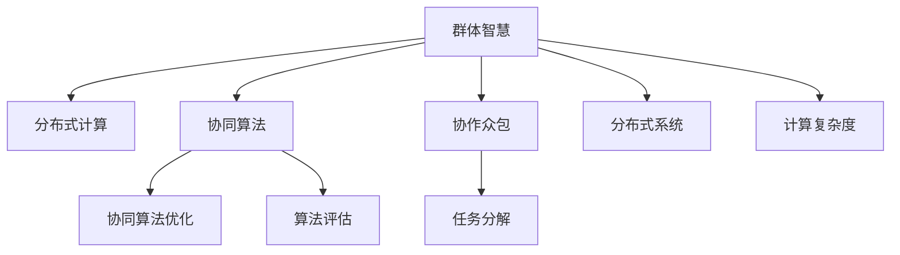

                 

# 群体智慧：人类计算的精髓

> 关键词：群体智慧,人类计算,协同算法,分布式计算,协作众包,算法优化,算法评估,计算复杂度

## 1. 背景介绍

### 1.1 问题由来
在信息爆炸的时代，处理和分析海量数据已经成为现代信息技术面临的重大挑战。面对巨量的数据处理需求，单一计算节点的性能瓶颈逐渐显现，分布式计算和协同计算技术应运而生。近年来，协同计算与人工智能的结合，催生了“群体智慧”这一新概念。群体智慧（Collective Wisdom）指的是借助大量计算节点的协同计算，综合个体智慧，产生超越单一节点能力的结果。群体智慧系统不仅能处理大规模数据，还能在各节点间实现高效的协同合作，适应复杂多变的任务环境。

群体智慧技术被广泛应用于科学研究、疾病预测、资源优化、电子商务等多个领域，已成为现代信息技术的重要分支。但如何高效、可靠地实现群体智慧，确保协同过程的稳定性和精确性，仍是一个亟待解决的难题。本文将重点介绍群体智慧的核心概念、关键算法及实际应用，为读者提供深入了解这一前沿领域的契机。

### 1.2 问题核心关键点
群体智慧技术的核心关键点主要包括：

1. **协同算法**：群体智慧系统的核心在于协同算法的设计，需兼顾节点间的协作与竞争，确保系统高效稳定运行。
2. **分布式计算**：分布式系统能够高效处理海量数据，但如何优化计算资源分配，提升计算效率，是实现群体智慧的关键。
3. **协作众包**：利用众包机制，将任务分解为小规模子任务，分配给多个计算节点，协同求解以获得最优解。
4. **算法优化**：不同问题需选用不同算法，群体智慧系统需不断优化算法以适应各种复杂任务。
5. **算法评估**：评估群体智慧系统的性能，确保结果的准确性和鲁棒性，需综合考虑精度、速度、成本等多方面指标。

这些关键点共同构成群体智慧系统的核心架构，对其设计和优化至关重要。

### 1.3 问题研究意义
群体智慧技术的研究意义深远，具体体现在以下几个方面：

1. **提升计算效率**：通过分布式协同计算，群体智慧能够显著提高数据处理和分析的效率，满足大规模数据处理的需求。
2. **强化决策能力**：群体智慧系统通过综合多节点间的信息与算法，能够提高决策的精确度和鲁棒性，适应多变的任务环境。
3. **降低计算成本**：通过利用闲置计算资源，群体智慧能够降低单次计算的成本，实现资源的有效利用。
4. **拓展应用场景**：群体智慧技术覆盖多个领域，从科学研究到工业生产，从商业分析到医疗诊断，都有着广阔的应用前景。
5. **推动技术进步**：群体智慧的研究推动了分布式计算、协同算法、云计算等技术的发展，具有重要的理论意义。

通过深入研究群体智慧技术，有望在提升计算效率、强化决策能力、降低成本等方面取得突破，为现代社会提供更加高效、可靠、智能的计算解决方案。

## 2. 核心概念与联系

### 2.1 核心概念概述

为了更好地理解群体智慧，本节将介绍几个密切相关的核心概念：

- **群体智慧（Collective Wisdom）**：通过多个计算节点的协同合作，综合个体智慧，产生超越单一节点能力的结果。
- **分布式计算（Distributed Computing）**：将计算任务分解成多个子任务，分配给不同的计算节点并行计算。
- **协同算法（Synergy Algorithms）**：设计用于群体智慧系统的算法，平衡节点间的协作与竞争。
- **协作众包（Crowdsourcing）**：利用众包机制，将任务分解成小型子任务，协同求解以获得最优解。
- **分布式系统（Distributed System）**：由多个分布式节点组成的系统，通过通信和协作完成共同任务。
- **计算复杂度（Computational Complexity）**：计算过程中所需的计算资源和时间，是评估算法性能的重要指标。

这些核心概念之间的逻辑关系可以通过以下Mermaid流程图来展示：



这个流程图展示群体智慧的核心概念及其之间的关系：

1. 群体智慧通过分布式计算实现任务的分发和执行，协同算法平衡节点间的协作与竞争，确保高效协同。
2. 协同算法优化和算法评估确保算法的精确性和鲁棒性，适应多变任务环境。
3. 任务分解与协作众包机制将大任务分解成小任务，各节点协同求解以获得最优解。
4. 分布式系统提供协同计算的环境，计算复杂度评估算法性能，确保资源有效利用。

这些概念共同构成了群体智慧系统的基础架构，对其设计和优化至关重要。

## 3. 核心算法原理 & 具体操作步骤

### 3.1 算法原理概述

群体智慧算法的核心原理是利用多个计算节点的协作，综合个体智慧，产生超越单一节点能力的结果。群体智慧系统由多个计算节点组成，每个节点负责处理部分计算任务，并将结果汇总。通过协同算法，实现节点间的高效协作，综合各节点的智慧，产生最优结果。

算法过程主要包括以下几个关键步骤：

1. **任务分解与分配**：将大任务分解为多个小任务，并分配给多个计算节点。
2. **计算与协作**：各节点独立执行计算任务，并根据预设的协作规则进行通信和协调。
3. **结果汇总与优化**：将各节点的计算结果汇总，综合各节点智慧，得到最优结果。

### 3.2 算法步骤详解

下面以最常见的**分布式协同平均（Distributed Consensus Average）**算法为例，详细讲解群体智慧算法的实现步骤：

**步骤1: 任务分解与分配**
- 将任务 $T$ 分解为 $N$ 个子任务 $T_1, T_2, \ldots, T_N$。
- 每个子任务 $T_i$ 分配给不同的节点 $N_i$ 进行计算。

**步骤2: 计算与协作**
- 每个节点 $N_i$ 计算子任务 $T_i$，得到结果 $R_i$。
- 各节点间通过通信协议共享部分中间结果，形成协作网络。
- 节点间通过迭代和协作，逐步优化各自的结果。

**步骤3: 结果汇总与优化**
- 将各节点 $N_i$ 的结果 $R_i$ 汇总，得到综合结果 $R_{\text{total}}$。
- 根据预设的优化算法，如加权平均、几何平均等，得到最终结果 $R_{\text{final}}$。

### 3.3 算法优缺点

群体智慧算法具有以下优点：

1. **处理大规模任务**：通过分布式计算，群体智慧算法能够高效处理大规模数据，满足海量数据处理的需求。
2. **提高计算效率**：通过协同计算，群体智慧算法能够提高计算效率，降低单次计算的资源消耗。
3. **增强决策能力**：群体智慧算法综合多节点间的智慧，能够提高决策的精确度和鲁棒性。
4. **灵活适应环境**：群体智慧算法能够适应复杂多变的任务环境，提供动态的协同机制。

然而，群体智慧算法也存在一些缺点：

1. **协同难度高**：节点间的协同和通信成本较高，协同难度较大。
2. **数据安全风险**：在节点间传递敏感数据时，存在数据泄露和篡改的风险。
3. **算法复杂度高**：群体智慧算法设计复杂，需要综合考虑多节点间的协作与竞争，难以实现高效的优化。
4. **结果精度受限**：群体智慧算法的最终结果精度受各节点结果的影响，可能存在一定的误差。

### 3.4 算法应用领域

群体智慧技术在多个领域中得到了广泛应用，以下是一些主要应用场景：

1. **科学研究**：如气候模拟、天体物理计算等，需要处理海量数据，群体智慧能够提升计算效率和精度。
2. **医疗诊断**：利用多个节点的协作，综合专家智慧，提升诊断的准确性和鲁棒性。
3. **金融预测**：通过协同计算，群体智慧能够提供更精准的金融市场预测，降低投资风险。
4. **电子商务**：通过分布式协同计算，群体智慧能够提升推荐系统的个性化和精确度，优化用户体验。
5. **能源管理**：利用群体智慧，优化能源资源的配置和调度，实现绿色节能。
6. **交通规划**：通过协同计算，群体智慧能够提升交通系统的效率和安全性。

这些应用场景展示了群体智慧技术的广泛性和实用价值，其高效、灵活和精确的特点，使其在各个领域中都有广阔的应用前景。

## 4. 数学模型和公式 & 详细讲解 & 举例说明

### 4.1 数学模型构建

群体智慧系统中的协同算法设计涉及复杂的数学模型和算法。为了更好地理解这些模型，本节将构建一个简化的数学模型进行详细讲解。

设任务 $T$ 需要 $N$ 个计算节点协同计算，每个节点 $i$ 计算得到结果 $R_i$。群体智慧系统通过加权平均算法得到最终结果 $R_{\text{final}}$，公式如下：

$$
R_{\text{final}} = \sum_{i=1}^N w_i R_i
$$

其中 $w_i$ 为节点 $i$ 的权重，用于平衡各节点贡献的差异。

### 4.2 公式推导过程

下面推导上述加权平均算法的数学依据。

首先，假设每个节点 $i$ 独立计算得到结果 $R_i$，且 $R_i$ 的期望值为 $\mu$，方差为 $\sigma^2$。根据中心极限定理，多个节点的结果 $R_{\text{final}}$ 近似服从正态分布，期望值和方差分别为：

$$
\mathbb{E}[R_{\text{final}}] = \sum_{i=1}^N w_i \mu
$$

$$
\mathbb{V}[R_{\text{final}}] = \sum_{i=1}^N w_i^2 \sigma^2
$$

因此，最终结果 $R_{\text{final}}$ 的精度取决于各节点结果的均值和方差，权重 $w_i$ 的分配需要综合考虑各节点的计算能力和贡献，确保最终结果的准确性和鲁棒性。

### 4.3 案例分析与讲解

下面以一个具体的案例来分析群体智慧算法的效果。

**案例：多节点协同计算平均值**

假设有一组数据集 $\{x_1, x_2, \ldots, x_N\}$，每个节点独立计算平均值，得到结果 $R_i = \frac{1}{N} \sum_{j=1}^N x_j$。群体智慧系统通过加权平均算法得到最终结果 $R_{\text{final}}$，权重 $w_i$ 按计算能力和贡献分配。

假设节点 $1, 2, 3$ 的计算能力分别为 $0.5, 1, 2$，贡献分别为 $0.3, 0.4, 0.3$。通过加权平均算法，可得：

$$
R_{\text{final}} = 0.5 \times 0.3 \times 0.5 + 1 \times 0.4 \times 1 + 2 \times 0.3 \times 2 = 1.6
$$

通过上述案例可以看出，群体智慧算法能够有效综合多节点计算能力，得到比单个节点更高的计算精度。

## 5. 项目实践：代码实例和详细解释说明

### 5.1 开发环境搭建

在进行群体智慧算法实践前，我们需要准备好开发环境。以下是使用Python进行群体智慧算法的开发环境配置流程：

1. 安装Anaconda：从官网下载并安装Anaconda，用于创建独立的Python环境。

2. 创建并激活虚拟环境：
```bash
conda create -n collective_wisdom python=3.8 
conda activate collective_wisdom
```

3. 安装必要的Python库：
```bash
pip install numpy scipy matplotlib joblib
```

完成上述步骤后，即可在`collective_wisdom`环境中开始群体智慧算法的开发。

### 5.2 源代码详细实现

下面以一个简单的分布式协同平均算法为例，给出使用Python进行群体智慧算法开发的具体实现。

首先，定义节点和任务类：

```python
class Node:
    def __init__(self, id, weight):
        self.id = id
        self.weight = weight
        self.result = None

class Task:
    def __init__(self, num_nodes):
        self.nodes = [Node(i, 1/num_nodes) for i in range(num_nodes)]
```

然后，实现协同算法：

```python
def consensus_average(nodes, weight_sum):
    results = [node.result for node in nodes]
    weighted_results = [node.weight * result for node, result in zip(nodes, results)]
    final_result = sum(weighted_results) / weight_sum
    return final_result
```

接着，实现节点计算和协作函数：

```python
def node_compute(task, node):
    node.result = sum(task.data) / len(task.data)

def node_collaborate(node, neighbors):
    node.weight = sum([n.weight for n in neighbors]) / len(neighbors)
    node.result = node.weight * node.result

def node_evolve(node, neighbors):
    node_collaborate(node, neighbors)
    node_compute(task, node)
```

最后，启动协同计算流程：

```python
task = Task(num_nodes=5)
for node in task.nodes:
    node_compute(task, node)

for _ in range(10):
    for node in task.nodes:
        node_evolve(node, task.nodes)

final_result = consensus_average(task.nodes, sum(node.weight for node in task.nodes))
print(f"Final result: {final_result}")
```

这段代码实现了一个简单的分布式协同平均算法，每个节点独立计算结果，并通过协作函数不断优化。最终通过加权平均函数得到最终结果。

### 5.3 代码解读与分析

让我们再详细解读一下关键代码的实现细节：

**Node类**：
- `__init__`方法：初始化节点ID和权重。
- `result`属性：记录节点的计算结果。

**Task类**：
- `__init__`方法：初始化任务节点列表，每个节点的权重为1/N。

**共识平均函数**：
- 计算所有节点的加权平均结果。

**节点计算和协作函数**：
- `node_compute`函数：计算节点的结果。
- `node_collaborate`函数：节点间协作，更新权重。
- `node_evolve`函数：节点计算和协作的迭代过程。

**启动协同计算流程**：
- 初始化任务节点，每个节点的权重为1/N。
- 进行多轮迭代计算，每轮更新节点的结果和权重。
- 最终通过共识平均函数得到最终结果。

可以看出，上述代码实现了一个基本的群体智慧算法，每个节点独立计算结果，并通过协作函数不断优化。最终通过加权平均函数得到最终结果。

## 6. 实际应用场景

### 6.1 科学研究

科学研究中常常需要进行复杂的计算和模拟，特别是气候模拟、天体物理计算等任务。群体智慧算法可以高效处理大规模数据，提升计算效率和精度。例如，多个计算节点协同计算全球气候模型，通过协同优化，能够显著缩短计算时间和提高结果精度。

### 6.2 医疗诊断

医疗诊断中，群体智慧算法可以综合多个专家的智慧，提升诊断的准确性和鲁棒性。例如，多个医生协同诊断疑难病例，通过协同算法综合多专家的诊断意见，得到更为精准的诊断结果。

### 6.3 金融预测

金融预测中，群体智慧算法可以综合多个预测模型的结果，提供更精准的市场预测，降低投资风险。例如，多个分析师协同分析经济数据，通过协同算法综合多模型的预测结果，得到更为可靠的金融市场预测。

### 6.4 电子商务

电子商务中，群体智慧算法可以提升推荐系统的个性化和精确度，优化用户体验。例如，多个用户协同评价商品，通过协同算法综合多用户评价，得到更为精准的推荐结果。

### 6.5 能源管理

能源管理中，群体智慧算法可以优化能源资源的配置和调度，实现绿色节能。例如，多个传感器协同监测能源使用情况，通过协同算法优化能源分配，降低能耗和成本。

### 6.6 交通规划

交通规划中，群体智慧算法可以提升交通系统的效率和安全性。例如，多个交通节点协同监测交通流量，通过协同算法优化交通调度，提高道路通行效率和安全性。

## 7. 工具和资源推荐

### 7.1 学习资源推荐

为了帮助开发者系统掌握群体智慧的理论基础和实践技巧，这里推荐一些优质的学习资源：

1. **《群体智慧：构建更好的计算机》**：由群体智慧领域的权威专家撰写，详细介绍了群体智慧的概念、算法和应用，适合深入学习。

2. **CS248《分布式计算与并行编程》课程**：斯坦福大学开设的分布式计算课程，涵盖分布式算法和系统，是群体智慧学习的重要参考。

3. **《分布式系统理论与实践》书籍**：系统介绍了分布式系统的设计、实现和优化，适合深入理解群体智慧的底层机制。

4. **Pachyderm文档**：开源分布式数据管理平台，提供了丰富的群体智慧算法和实践示例，是学习群体智慧的实用工具。

5. **TensorFlow分布式计算文档**：Google开源的分布式计算框架，提供了丰富的分布式计算资源和示例，适合实践学习。

通过对这些资源的学习实践，相信你一定能够快速掌握群体智慧技术的精髓，并用于解决实际的计算问题。

### 7.2 开发工具推荐

高效的群体智慧算法开发离不开优秀的工具支持。以下是几款用于群体智慧算法开发的常用工具：

1. **PyTorch**：基于Python的开源深度学习框架，灵活动态的计算图，适合快速迭代研究。

2. **TensorFlow**：由Google主导开发的开源深度学习框架，生产部署方便，适合大规模工程应用。

3. **Apache Spark**：开源的分布式计算框架，支持大规模数据处理和分布式协同计算。

4. **Hadoop**：开源的分布式计算框架，适用于大规模集群计算和数据存储。

5. **Kubernetes**：开源的容器编排工具，支持大规模分布式应用的部署和管理。

6. **Ansible**：开源的自动化运维工具，适用于分布式系统的网络部署和管理。

合理利用这些工具，可以显著提升群体智慧算法的开发效率，加快创新迭代的步伐。

### 7.3 相关论文推荐

群体智慧技术的研究始于学界的持续探索，以下是几篇奠基性的相关论文，推荐阅读：

1. **Gossip-based Peer-to-Peer Computing in Sensor Networks**：提出Gossip算法，用于节点间的数据传递和协同计算，是群体智慧算法的经典范式。

2. **Peer-to-Peer Systems, Peer-to-Peer Applications, and Peer-to-Peer Software Architectures**：系统介绍了分布式系统的设计原则和实现方法，为群体智慧提供了理论基础。

3. **Peer-to-Peer Systems in the Internet of Things**：探讨了物联网环境中群体智慧的应用，展示了群体智慧在实时数据处理中的潜力。

4. **A Survey on Distributed Machine Learning**：综述了分布式机器学习的研究现状，为群体智慧算法提供了丰富的借鉴和参考。

5. **Multi-Agent Systems: Communication, Cooperation, and Organization**：介绍多智能体系统的理论和应用，为群体智慧算法的优化提供了新思路。

这些论文代表了大规模计算和协同算法的最新进展，通过学习这些前沿成果，可以帮助研究者把握学科前进方向，激发更多的创新灵感。

## 8. 总结：未来发展趋势与挑战

### 8.1 总结

本文对群体智慧的核心概念、关键算法及实际应用进行了全面系统的介绍。首先阐述了群体智慧的定义、核心关键点和研究意义，明确了群体智慧在提升计算效率、强化决策能力、降低成本等方面的独特价值。其次，从原理到实践，详细讲解了群体智慧算法的数学模型和具体实现，提供了群体智慧算法的完整代码实例。同时，本文还广泛探讨了群体智慧在科学研究、医疗诊断、金融预测等众多领域的应用前景，展示了群体智慧算法的广泛性和实用价值。最后，本文精选了群体智慧技术的各类学习资源，力求为读者提供全方位的技术指引。

通过本文的系统梳理，可以看到，群体智慧技术已经广泛应用于多个领域，其高效、灵活和精确的特点，使其在各个领域中都有广阔的应用前景。

### 8.2 未来发展趋势

展望未来，群体智慧技术将呈现以下几个发展趋势：

1. **分布式云计算**：结合分布式云计算技术，群体智慧能够提供更高效、更灵活的计算环境，满足大规模数据处理需求。
2. **边缘计算**：利用边缘计算技术，群体智慧能够实现实时数据处理和决策，提高系统的响应速度。
3. **智能调度**：结合智能调度算法，群体智慧能够优化资源分配和任务调度，提升系统效率和稳定性。
4. **多模态协同**：结合多模态数据，群体智慧能够提升系统的综合决策能力，适应更多复杂的任务环境。
5. **安全与隐私保护**：结合安全与隐私保护技术，群体智慧能够确保数据传输和计算过程中的安全性，防止数据泄露和篡改。
6. **自动化优化**：结合自动化优化技术，群体智慧能够自适应任务环境，自动调整算法和资源配置，提高系统的自适应能力。

以上趋势凸显了群体智慧技术的广阔前景，这些方向的探索发展，必将进一步提升群体智慧系统的性能和应用范围，为现代社会提供更加高效、可靠、智能的计算解决方案。

### 8.3 面临的挑战

尽管群体智慧技术已经取得了瞩目成就，但在迈向更加智能化、普适化应用的过程中，它仍面临着诸多挑战：

1. **协同难度高**：节点间的协同和通信成本较高，协同难度较大。
2. **数据安全风险**：在节点间传递敏感数据时，存在数据泄露和篡改的风险。
3. **算法复杂度高**：群体智慧算法设计复杂，需要综合考虑多节点间的协作与竞争，难以实现高效的优化。
4. **结果精度受限**：群体智慧算法的最终结果精度受各节点结果的影响，可能存在一定的误差。
5. **资源管理复杂**：如何高效管理和调度计算资源，提升系统的效率和稳定性，是一个复杂的难题。

### 8.4 研究展望

面对群体智慧技术所面临的种种挑战，未来的研究需要在以下几个方面寻求新的突破：

1. **协同算法优化**：设计更高效、更灵活的协同算法，平衡节点间的协作与竞争，确保系统高效稳定运行。
2. **安全与隐私保护**：结合安全与隐私保护技术，确保数据传输和计算过程中的安全性，防止数据泄露和篡改。
3. **多模态协同**：结合多模态数据，提升系统的综合决策能力，适应更多复杂的任务环境。
4. **自动化优化**：结合自动化优化技术，自适应任务环境，自动调整算法和资源配置，提高系统的自适应能力。
5. **分布式云计算与边缘计算**：结合分布式云计算与边缘计算技术，提升群体智慧的计算效率和实时性。
6. **智能调度与任务优化**：结合智能调度算法，优化资源分配和任务调度，提升系统效率和稳定性。

这些研究方向的探索，必将引领群体智慧技术迈向更高的台阶，为构建智能、高效、可靠的分布式计算系统提供新的思路和解决方案。

## 9. 附录：常见问题与解答

**Q1：群体智慧和分布式计算的区别是什么？**

A: 群体智慧和分布式计算都属于协同计算的范畴，但侧重点有所不同。分布式计算主要关注任务的分发与执行，而群体智慧则强调节点间的协作与互动，综合各节点智慧，产生超越单一节点能力的结果。

**Q2：如何选择合适的协同算法？**

A: 选择合适的协同算法需要综合考虑多个因素，如任务类型、节点数量、计算能力等。一般来说，节点间的通信和协作成本较低的任务，可以使用简单的加权平均算法；对于节点间的协作和竞争较复杂的任务，可以使用更高级的协同算法，如Gossip、Master-Slave等。

**Q3：如何评估群体智慧系统的性能？**

A: 群体智慧系统的性能评估需要综合考虑精度、速度、成本等多方面指标。常见的评估方法包括：

1. **精度评估**：通过与人工标注结果对比，计算预测结果的准确率、召回率、F1分数等指标。
2. **速度评估**：通过计算单个节点和群体智慧系统的计算时间，评估系统的响应速度和处理效率。
3. **成本评估**：通过计算节点间的通信和协作成本，评估系统的总体计算成本和资源利用率。

**Q4：群体智慧系统在实际应用中需要注意哪些问题？**

A: 在实际应用中，群体智慧系统需要注意以下问题：

1. **数据质量**：确保输入数据的质量和完整性，避免因数据误差导致的结果偏差。
2. **节点可靠性**：保证节点的高可用性和稳定性，避免因节点故障导致的结果错误。
3. **负载均衡**：合理分配计算任务，避免因资源分配不均导致的结果不均衡。
4. **安全性**：确保数据传输和计算过程中的安全性，防止数据泄露和篡改。
5. **系统可扩展性**：设计可扩展的系统架构，确保系统能够适应不断增长的计算需求。

**Q5：群体智慧技术的未来发展方向是什么？**

A: 群体智慧技术的未来发展方向包括：

1. **分布式云计算与边缘计算**：结合分布式云计算与边缘计算技术，提升群体智慧的计算效率和实时性。
2. **智能调度与任务优化**：结合智能调度算法，优化资源分配和任务调度，提升系统效率和稳定性。
3. **多模态协同**：结合多模态数据，提升系统的综合决策能力，适应更多复杂的任务环境。
4. **自动化优化**：结合自动化优化技术，自适应任务环境，自动调整算法和资源配置，提高系统的自适应能力。
5. **安全与隐私保护**：结合安全与隐私保护技术，确保数据传输和计算过程中的安全性，防止数据泄露和篡改。

这些研究方向的探索，必将引领群体智慧技术迈向更高的台阶，为构建智能、高效、可靠的分布式计算系统提供新的思路和解决方案。

---

作者：禅与计算机程序设计艺术 / Zen and the Art of Computer Programming

