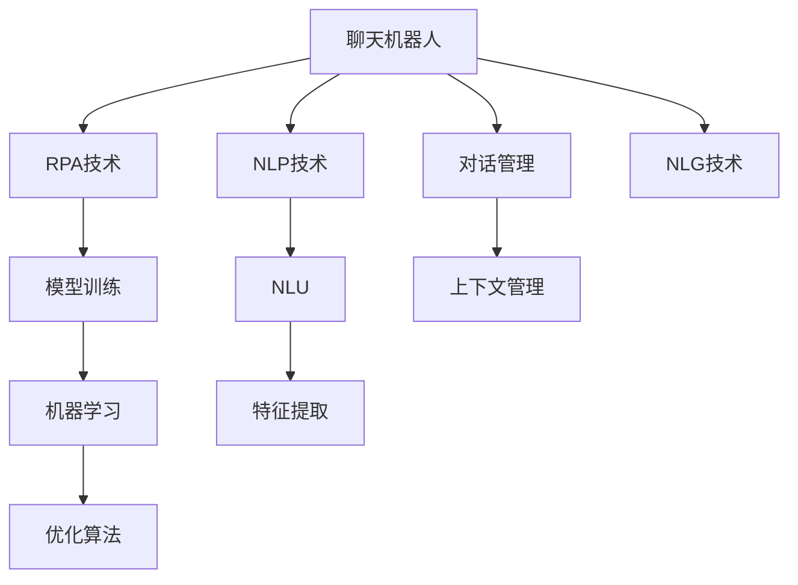

                 

# 聊天机器人制造业4.0：机器人流程自动化

## 1. 背景介绍

### 1.1 问题由来

随着人工智能技术的发展，聊天机器人（Chatbot）的应用场景不断扩展，从简单的客服对话，到复杂的知识问答，再到场景化的互动助手，聊天机器人已经渗透到各行各业。传统上，构建聊天机器人的主要工作包括自然语言理解（NLU）、对话管理（Dialogue Management）、自然语言生成（NLG）等模块的搭建和调优，这对开发者提出了较高的技术要求。随着机器人流程自动化（RPA）技术的兴起，开发者的工作重点从具体的技术实现转移到了更高层次的流程设计上，聊天机器人制造业进入了4.0时代。

### 1.2 问题核心关键点

聊天机器人制造业4.0的核心在于利用RPA技术实现对话流程的自动化。与传统的基于规则或模板的聊天机器人不同，4.0时代的聊天机器人能够通过训练模型，自适应地处理各种复杂场景和用户需求，并自动进行对话流程的适配和优化。这种基于数据驱动、模型训练的聊天机器人，能够大幅提升交互体验和处理效率，降低开发成本，加速业务落地。

### 1.3 问题研究意义

聊天机器人制造业4.0的普及，将对各行各业的生产效率和服务质量产生深远影响：

1. **提升效率**：通过自动化的对话流程，聊天机器人能够处理大量重复性工作，解放人力资源，提升整体业务运行效率。
2. **降低成本**：开发者可以通过统一的工具和技术栈进行批量开发，大幅降低人力和时间成本。
3. **增强用户体验**：智能化的聊天机器人能够提供更加自然、流畅的交互体验，提升用户满意度和忠诚度。
4. **促进创新**：RPA技术的使用，使得开发者能够专注于更高层次的业务逻辑设计和场景优化，促进技术创新和业务创新。

## 2. 核心概念与联系

### 2.1 核心概念概述

为更好地理解聊天机器人制造业4.0，本节将介绍几个密切相关的核心概念：

- **聊天机器人（Chatbot）**：能够通过自然语言进行互动的计算机程序，提供信息查询、问题解答、任务执行等功能。
- **机器人流程自动化（RPA）**：通过自动化工具和脚本，模拟人工操作，执行流程任务的技术。
- **自然语言处理（NLP）**：涉及语音识别、自然语言理解、对话管理等技术，是构建聊天机器人的核心。
- **对话管理（Dialogue Management）**：管理对话上下文和状态，控制对话流程的技术。
- **自然语言生成（NLG）**：将结构化数据转化为自然语言表达的技术。
- **模型训练（Model Training）**：通过标注数据训练机器学习模型，提升聊天机器人处理能力的技术。

这些核心概念之间的逻辑关系可以通过以下Mermaid流程图来展示：



这个流程图展示了几大核心概念及其之间的关系：

1. 聊天机器人通过RPA技术实现流程自动化。
2. NLP技术是构建聊天机器人的基础，包含自然语言理解和自然语言生成两个关键环节。
3. 对话管理负责控制对话流程，是实现复杂交互的重要组成部分。
4. 模型训练通过标注数据提升聊天机器人的处理能力。
5. RPA技术结合模型训练，构建起高效、智能的聊天机器人制造体系。

## 3. 核心算法原理 & 具体操作步骤
### 3.1 算法原理概述

聊天机器人制造业4.0的算法原理，主要是将RPA技术和机器学习模型结合起来，实现对话流程的自动化和智能化的技术。具体而言，通过自然语言处理技术提取对话中的关键信息，结合对话管理算法，控制对话流程，并使用机器学习模型进行端到端的训练，使得聊天机器人能够自动处理各种复杂场景和用户需求。

### 3.2 算法步骤详解

聊天机器人制造业4.0的实现流程一般包括以下几个关键步骤：

**Step 1: 准备数据集**

- 收集标注数据集，包含对话记录和对应的意图标签。
- 数据集分为训练集、验证集和测试集，标注数据需要经过清洗、归一化等处理。

**Step 2: 设计模型架构**

- 选择适合的模型架构，如基于深度学习的Seq2Seq模型、Transformer模型等。
- 确定模型的输入和输出，如对话历史、意图标签等。

**Step 3: 训练模型**

- 使用训练集数据训练模型，通过优化算法如Adam、SGD等更新模型参数。
- 在验证集上评估模型性能，调整超参数。

**Step 4: 部署模型**

- 将训练好的模型部署到服务器或云端平台，并集成到实际的业务系统中。
- 配置RPA流程，实现自动化对话管理。

**Step 5: 持续优化**

- 定期收集用户反馈和新增数据，不断更新训练模型。
- 根据新场景和新需求，优化对话管理策略。

### 3.3 算法优缺点

聊天机器人制造业4.0的算法优点包括：

- 高效自动化：通过RPA技术，聊天机器人能够快速处理大量重复性任务，提升效率。
- 智能自适应：结合模型训练，聊天机器人能够自动学习和适应用户需求，提升交互质量。
- 灵活扩展：模型训练和对话管理可以灵活组合，满足不同业务场景的需求。

但同时也存在一些缺点：

- 依赖标注数据：训练模型需要大量标注数据，标注成本较高。
- 模型复杂性：模型结构复杂，需要较强的技术储备。
- 数据隐私：处理用户数据需要考虑隐私保护和数据安全。

### 3.4 算法应用领域

聊天机器人制造业4.0在多个领域都有广泛应用：

- **客户服务**：通过聊天机器人处理客户咨询、投诉、售后等任务，提升客户满意度。
- **医疗咨询**：利用聊天机器人进行疾病咨询、预约挂号等，提供个性化医疗服务。
- **教育辅导**：通过聊天机器人进行知识问答、作业辅导等，辅助学生学习。
- **金融服务**：提供智能投资咨询、理财规划等，提升用户理财体验。
- **电商客服**：处理订单查询、商品推荐等任务，提升电商平台的交互体验。
- **智能家居**：通过聊天机器人控制家电、查询信息，提升家居生活的便捷性。

## 4. 数学模型和公式 & 详细讲解  
### 4.1 数学模型构建

本节将使用数学语言对聊天机器人制造业4.0的算法过程进行更加严格的刻画。

记聊天机器人为$B$，用户输入为$x$，机器输出为$y$。假设$B$采用深度学习模型进行训练，模型的参数为$\theta$，输入为$x$，输出为$y$。模型的损失函数为$\mathcal{L}$，则训练目标为最小化损失函数：

$$
\theta^* = \mathop{\arg\min}_{\theta} \mathcal{L}(B_{\theta}(x), y)
$$

其中，$B_{\theta}(x)$表示模型在输入$x$下的输出。

### 4.2 公式推导过程

以Seq2Seq模型为例，其基本结构包括编码器和解码器，每个模块的输出公式如下：

- 编码器：$h_{\theta} = \text{Encoder}(x)$
- 解码器：$y_{\theta} = \text{Decoder}(h_{\theta}, y)$

其中，$h_{\theta}$表示编码器对输入$x$的表示，$y_{\theta}$表示解码器对输出$y$的预测。

模型的损失函数可以采用交叉熵损失，公式为：

$$
\mathcal{L} = -\sum_{i=1}^{n}y_i\log y_{\theta_i}
$$

其中，$n$表示输出序列的长度，$y_i$表示第$i$个时刻的标签，$y_{\theta_i}$表示模型在当前时刻的预测。

### 4.3 案例分析与讲解

假设有一个电商平台的聊天机器人，用于处理用户订单查询和退货请求。该机器人使用Seq2Seq模型进行训练，包含两个RNN层，每个层有128个神经元。训练数据集包括1000条用户对话记录和对应的意图标签，模型采用交叉熵损失进行训练，学习率为0.001，训练迭代次数为10000次。训练过程中，使用Adam优化算法进行模型参数的更新。

## 5. 项目实践：代码实例和详细解释说明
### 5.1 开发环境搭建

在进行聊天机器人制造业4.0的实践前，我们需要准备好开发环境。以下是使用Python进行TensorFlow和PyTorch开发的环境配置流程：

1. 安装Anaconda：从官网下载并安装Anaconda，用于创建独立的Python环境。

2. 创建并激活虚拟环境：
```bash
conda create -n chatbot-env python=3.8 
conda activate chatbot-env
```

3. 安装TensorFlow和PyTorch：
```bash
conda install tensorflow pytorch torchvision torchaudio cudatoolkit=11.1 -c pytorch -c conda-forge
```

4. 安装各类工具包：
```bash
pip install numpy pandas scikit-learn matplotlib tqdm jupyter notebook ipython
```

完成上述步骤后，即可在`chatbot-env`环境中开始聊天机器人制造业4.0的实践。

### 5.2 源代码详细实现

这里我们以一个简单的电商客服聊天机器人为例，给出使用TensorFlow和PyTorch进行模型训练和RPA流程的代码实现。

首先，定义训练数据集：

```python
import tensorflow as tf
import numpy as np

# 定义训练数据集
train_x = np.array(['订单查询', '退货请求', '产品推荐', '发票申请', '售后服务'])
train_y = np.array(['订单信息', '退货流程', '商品详情', '发票模板', '服务指南'])
```

然后，定义模型架构：

```python
from tensorflow.keras.layers import Input, LSTM, Dense
from tensorflow.keras.models import Model

# 定义编码器
encoder_inputs = Input(shape=(None,))
encoder_lstm = LSTM(64, return_state=True)
encoder_outputs, state_h, state_c = encoder_lstm(encoder_inputs)

# 定义解码器
decoder_inputs = Input(shape=(None,))
decoder_lstm = LSTM(64, return_sequences=True, return_state=True)
decoder_outputs, _, _ = decoder_lstm(decoder_inputs, initial_state=[state_h, state_c])

# 定义输出层
decoder_dense = Dense(train_y.shape[0], activation='softmax')
decoder_outputs = decoder_dense(decoder_outputs)

# 定义模型
model = Model([encoder_inputs, decoder_inputs], decoder_outputs)
```

接着，定义损失函数和优化器：

```python
# 定义交叉熵损失
loss_function = tf.keras.losses.CategoricalCrossentropy()

# 定义Adam优化器
optimizer = tf.keras.optimizers.Adam(lr=0.001)
```

然后，进行模型训练：

```python
# 编译模型
model.compile(optimizer=optimizer, loss=loss_function)

# 训练模型
model.fit([train_x, train_y], train_y, epochs=10000, batch_size=16)
```

最后，部署模型并进行RPA流程的配置：

```python
# 定义RPA流程
def chatbot_process(user_input):
    # 对用户输入进行预处理
    preprocessed_input = preprocess(user_input)
    
    # 使用训练好的模型进行预测
    predicted_output = model.predict([preprocessed_input, train_y])
    
    # 返回预测结果
    return decode(predicted_output)
```

以上就是一个简单的电商客服聊天机器人的实现流程。可以看到，TensorFlow和PyTorch的组合使得模型训练和RPA流程的配置变得简洁高效。

### 5.3 代码解读与分析

让我们再详细解读一下关键代码的实现细节：

**数据集定义**：
- 使用NumPy数组定义训练数据集，包含用户输入和对应的意图标签。

**模型架构**：
- 使用Keras定义编码器和解码器的结构，包含两个LSTM层。
- 输出层使用Dense层，并采用softmax激活函数，表示输出为多分类任务。

**损失函数和优化器**：
- 使用CategoricalCrossentropy作为损失函数，适用于多分类问题。
- 使用Adam优化器，学习率为0.001。

**模型训练**：
- 使用fit方法进行模型训练，循环10000次，每次迭代16条样本。

**RPA流程配置**：
- 定义一个chatbot_process函数，将用户输入进行预处理，并使用训练好的模型进行预测，返回解码后的输出结果。

通过上述代码，可以看出聊天机器人制造业4.0的核心在于结合模型训练和RPA流程，实现对话流程的自动化和智能化。开发者可以根据具体业务需求，设计适合的模型架构和RPA流程，构建高效的聊天机器人系统。

## 6. 实际应用场景
### 6.1 智能客服系统

聊天机器人制造业4.0在智能客服系统中有着广泛的应用。传统客服系统往往需要配备大量人力，高峰期响应缓慢，且服务质量难以保证。通过将聊天机器人嵌入到客服系统中，可以大幅提升客户咨询体验和问题解决效率。

具体而言，可以将客服系统与聊天机器人集成，通过RPA技术自动调度对话流程，提升处理速度。同时，使用模型训练技术，使聊天机器人能够理解用户意图，提供精准的解决方案，大大提升客户满意度。

### 6.2 金融咨询

金融领域的服务需求多样，需要处理各种复杂的咨询问题。聊天机器人制造业4.0能够通过模型训练，学习金融领域的专业知识和处理策略，提供智能化的金融咨询服务。

例如，利用聊天机器人处理投资咨询、理财规划等任务，可以提升用户的理财体验。同时，通过RPA技术自动化处理用户提交的表格和文件，进一步提高服务效率。

### 6.3 在线教育

在线教育平台需要处理大量学生和家长的问题，通过聊天机器人制造业4.0，可以实现自动化处理咨询和辅导任务。

例如，通过模型训练，使聊天机器人能够理解学生的作业和疑问，提供个性化的学习建议和解题指导，提升学习效果。同时，通过RPA技术自动化处理学生的报名和课程推荐，进一步优化用户体验。

### 6.4 未来应用展望

随着聊天机器人制造业4.0技术的发展，未来的应用场景将更加多样和深入。以下是一些未来可能的趋势：

1. **多模态交互**：未来的聊天机器人可以处理图像、视频等多种模态数据，提供更加丰富和多样的交互体验。
2. **情感分析**：通过结合情感分析技术，聊天机器人能够更好地理解用户的情绪，提供更加人性化的服务。
3. **跨领域应用**：聊天机器人可以应用于医疗、教育、金融等多个领域，解决具体业务问题。
4. **持续学习**：通过持续学习技术，聊天机器人能够不断更新知识库，提升服务质量。
5. **智能调度**：通过RPA技术实现智能调度，优化对话流程，提升处理效率。

## 7. 工具和资源推荐
### 7.1 学习资源推荐

为了帮助开发者掌握聊天机器人制造业4.0的技术，这里推荐一些优质的学习资源：

1. **TensorFlow和PyTorch官方文档**：详细介绍了TensorFlow和PyTorch的使用方法和模型训练技术。
2. **DeepLearning.AI课程**：由Andrew Ng教授开设的深度学习课程，涵盖机器学习、深度学习、NLP等基础知识。
3. **RPA相关的书籍**：如《机器人流程自动化实践》、《RPA: Powerful Automation for IT, Business, and the Workplace》等，提供了RPA技术的详细介绍和实际应用案例。
4. **NLP相关的论文**：如BERT论文、GPT论文等，提供了最新的自然语言处理技术和应用案例。
5. **在线教程**：如Kaggle上的聊天机器人项目，提供了丰富的代码实现和数据分析案例。

通过对这些资源的学习，相信你一定能够掌握聊天机器人制造业4.0的核心技术和实现方法。

### 7.2 开发工具推荐

高效的开发离不开优秀的工具支持。以下是几款用于聊天机器人制造业4.0开发的常用工具：

1. **TensorFlow和PyTorch**：基于Python的开源深度学习框架，灵活动态的计算图，适合快速迭代研究。
2. **Keras**：基于TensorFlow和Theano等框架的高级神经网络API，提供了简单易用的API接口。
3. **PyTorch Lightning**：基于PyTorch的快速原型开发框架，提供了自动化模型训练和部署功能。
4. **Jupyter Notebook**：免费的交互式笔记本工具，支持Python、R等多种语言，适合数据科学和机器学习项目。
5. **Kaggle Kernels**：Kaggle提供的在线编程环境，支持Python、R等多种语言，提供了丰富的数据集和代码示例。

合理利用这些工具，可以显著提升聊天机器人制造业4.0的开发效率，加快创新迭代的步伐。

### 7.3 相关论文推荐

聊天机器人制造业4.0的发展源于学界的持续研究。以下是几篇奠基性的相关论文，推荐阅读：

1. **Seq2Seq模型论文**：Sepp Hochreiter和Jürgen Schmidhuber在1997年提出的Seq2Seq模型，是现代聊天机器人模型的基础。
2. **Transformer论文**：Vaswani等人在2017年提出的Transformer模型，以其高效的并行计算能力和卓越的性能，成为NLP领域的新主流。
3. **Attention机制论文**：Bahdanau等人在2014年提出的Attention机制，显著提升了机器翻译的准确性。
4. **对话管理论文**：Karita等人在2013年提出的对话管理技术，通过上下文理解控制对话流程，提高了聊天机器人的交互质量。
5. **RPA技术论文**：Fawaz等人在2018年提出的Robotic Process Automation技术，通过自动化工具和脚本，实现流程任务的自动化。

这些论文代表了大语言模型微调技术的发展脉络。通过学习这些前沿成果，可以帮助研究者把握学科前进方向，激发更多的创新灵感。

## 8. 总结：未来发展趋势与挑战
### 8.1 总结

本文对聊天机器人制造业4.0的算法原理和具体操作步骤进行了全面系统的介绍。首先阐述了聊天机器人制造业4.0的背景和研究意义，明确了RPA技术在提升交互效率和降低开发成本方面的独特价值。其次，从原理到实践，详细讲解了模型训练和RPA流程的技术细节，给出了具体的代码实现和性能分析。同时，本文还广泛探讨了聊天机器人制造业4.0在客户服务、金融咨询、在线教育等多个行业领域的应用前景，展示了RPA技术的巨大潜力。此外，本文精选了聊天机器人制造业4.0的各类学习资源，力求为读者提供全方位的技术指引。

通过本文的系统梳理，可以看到，聊天机器人制造业4.0通过结合模型训练和RPA技术，实现了对话流程的自动化和智能化，为各行各业提供了高效、智能的解决方案。未来，伴随技术的不断进步和应用的广泛普及，聊天机器人制造业4.0必将在更多领域发挥重要作用，推动生产力和服务质量的全面提升。

### 8.2 未来发展趋势

展望未来，聊天机器人制造业4.0将呈现以下几个发展趋势：

1. **多模态交互**：未来的聊天机器人可以处理图像、视频等多种模态数据，提供更加丰富和多样的交互体验。
2. **情感分析**：通过结合情感分析技术，聊天机器人能够更好地理解用户的情绪，提供更加人性化的服务。
3. **跨领域应用**：聊天机器人可以应用于医疗、教育、金融等多个领域，解决具体业务问题。
4. **持续学习**：通过持续学习技术，聊天机器人能够不断更新知识库，提升服务质量。
5. **智能调度**：通过RPA技术实现智能调度，优化对话流程，提升处理效率。

以上趋势凸显了聊天机器人制造业4.0技术的广阔前景。这些方向的探索发展，必将进一步提升聊天机器人的交互质量和处理效率，为各行各业带来深远影响。

### 8.3 面临的挑战

尽管聊天机器人制造业4.0技术已经取得了显著成果，但在迈向更加智能化、普适化应用的过程中，它仍面临诸多挑战：

1. **标注数据瓶颈**：训练模型需要大量标注数据，标注成本较高，特别是在一些长尾领域。
2. **模型复杂性**：模型结构复杂，需要较强的技术储备，增加了开发和维护成本。
3. **数据隐私**：处理用户数据需要考虑隐私保护和数据安全，特别是涉及敏感信息的场景。
4. **多语言支持**：当前聊天机器人主要支持英文，如何拓展到多语言场景，提供多语言服务，是亟待解决的问题。
5. **模型鲁棒性**：面对复杂和多样化的用户需求，如何提高聊天机器人的鲁棒性和自适应能力，仍需进一步研究。

### 8.4 研究展望

面对聊天机器人制造业4.0所面临的挑战，未来的研究需要在以下几个方面寻求新的突破：

1. **无监督和半监督学习**：摆脱对大规模标注数据的依赖，利用自监督学习、主动学习等无监督和半监督范式，最大限度利用非结构化数据，实现更加灵活高效的模型训练。
2. **参数高效和计算高效**：开发更加参数高效和计算高效的模型架构，在保证性能的同时，减小资源消耗。
3. **多语言处理**：开发多语言支持的技术，通过迁移学习和多语言训练，实现聊天机器人的多语言服务。
4. **情感分析和用户意图理解**：结合情感分析和意图理解技术，提升聊天机器人对用户情绪和需求的理解能力，提供更加人性化的服务。
5. **模型鲁棒性**：通过对抗训练和鲁棒性增强技术，提升聊天机器人的鲁棒性和自适应能力，应对复杂和多变的用户需求。

这些研究方向将推动聊天机器人制造业4.0技术的不断进步，为各行各业提供更加高效、智能和人性化的解决方案。

## 9. 附录：常见问题与解答

**Q1：聊天机器人制造业4.0是否适用于所有业务场景？**

A: 聊天机器人制造业4.0在大多数业务场景中都有应用潜力，特别是那些需要处理重复性任务和自动化流程的场景。但对于一些特殊领域，如医疗、法律等，需要结合领域知识进行定制化开发，才能发挥最佳效果。

**Q2：如何选择合适的模型架构？**

A: 选择模型架构需要考虑业务需求、数据特征和技术储备等多个因素。通常情况下，可以选用基于深度学习的Seq2Seq模型、Transformer模型等。对于多语言支持场景，可以考虑使用基于预训练语言模型的架构，如M2M-100等。

**Q3：如何提高聊天机器人的鲁棒性？**

A: 提高聊天机器人的鲁棒性可以通过多种方式，如引入对抗样本、使用多模型集成、进行对抗训练等。同时，可以通过持续学习和模型更新，不断提升模型对新场景的适应能力。

**Q4：如何保护用户数据隐私？**

A: 保护用户数据隐私是聊天机器人制造业4.0中必须考虑的问题。可以通过数据加密、匿名化处理等技术手段，保护用户数据的敏感信息。同时，遵循相关法律法规，确保用户数据的合法使用。

**Q5：如何优化聊天机器人的性能？**

A: 优化聊天机器人的性能需要从模型训练、RPA流程和用户体验等多个方面进行改进。可以通过优化模型结构、使用更好的训练数据、引入新的技术手段等方法，提升聊天机器人的性能。

通过本文的系统梳理，可以看到，聊天机器人制造业4.0通过结合RPA技术和深度学习模型，实现了对话流程的自动化和智能化，为各行各业提供了高效、智能的解决方案。未来，伴随技术的不断进步和应用的广泛普及，聊天机器人制造业4.0必将在更多领域发挥重要作用，推动生产力和服务质量的全面提升。

作者：禅与计算机程序设计艺术 / Zen and the Art of Computer Programming

