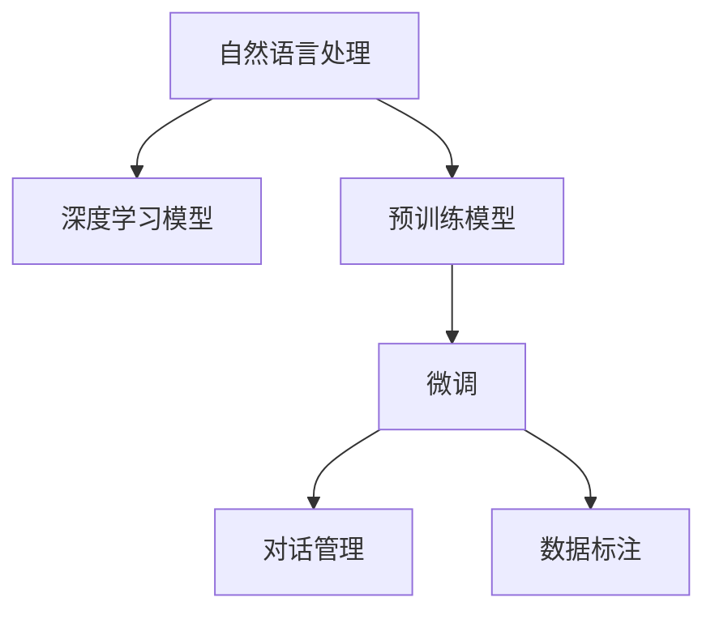

                 

# 聊天机器人医疗应用：虚拟健康助理

> 关键词：聊天机器人,医疗应用,虚拟健康助理,自然语言处理(NLP),深度学习,预训练模型,微调,Fine-tuning

## 1. 背景介绍

### 1.1 问题由来
随着人工智能技术的迅猛发展，特别是在自然语言处理(NLP)领域，聊天机器人已逐渐成为一种方便、高效的健康助理工具。尤其是近年来，基于深度学习的聊天机器人不断取得突破性进展，为医疗应用开辟了新的可能性。特别是在疫情爆发以来，虚拟健康助理因能够高效处理大量咨询问题，减轻医护人员负担，受到越来越多医疗机构的重视。

### 1.2 问题核心关键点
虚拟健康助理的核心在于通过聊天机器人的自然语言理解和生成能力，为用户提供及时的医疗咨询、健康建议、预约挂号等服务。相较于传统的人工客服，虚拟健康助理能够全天候无间断服务，快速响应用户需求，极大提升了医疗服务的可及性和便捷性。

在技术实现上，虚拟健康助理的开发主要包括以下几个关键环节：
- 选择合适的深度学习模型，并进行预训练。
- 定义聊天场景的语义框架，设计合适的输入和输出。
- 收集和标注大量的医疗咨询数据，用于微调模型。
- 训练和优化模型，通过有监督的微调，使模型能够匹配特定医疗应用场景的需求。
- 将微调后的模型集成到医疗应用系统中，提供实时的健康助理服务。

本文将系统介绍虚拟健康助理的开发流程和技术细节，着重探讨如何通过深度学习模型和大规模数据训练，构建高性能、安全可靠的医疗聊天机器人。

## 2. 核心概念与联系

### 2.1 核心概念概述

为更好地理解虚拟健康助理的开发原理和技术细节，本节将介绍几个密切相关的核心概念：

- 自然语言处理(NLP)：涉及计算机对人类语言文字的理解、生成和处理，是聊天机器人实现核心功能的关键技术。
- 深度学习模型：如Transformer、BERT等预训练模型，通过大量数据学习语言的深度表示，在自然语言处理任务中表现出色。
- 预训练模型：如GPT、BERT等模型，通过在海量无标签数据上进行预训练，学习到通用语言表示，为下游任务提供强大的特征提取能力。
- 微调(Fine-tuning)：通过有监督的训练，将预训练模型适配到特定任务，如医疗咨询、健康建议等，提升模型在该任务上的性能。
- 对话管理：定义对话流程的逻辑框架，确保聊天机器人能够正确理解用户意图，做出合理的回答。
- 数据标注：通过标注大量医疗咨询数据，为模型提供监督信号，确保模型输出的正确性。

这些核心概念之间的逻辑关系可以通过以下Mermaid流程图来展示：



这个流程图展示了虚拟健康助理开发的核心流程：
1. 通过自然语言处理技术，构建深度学习模型。
2. 利用预训练模型，学习通用语言表示。
3. 在医疗咨询数据上进行微调，适配特定任务。
4. 设计对话管理框架，确保自然流畅的对话体验。
5. 通过标注数据，保证模型输出的准确性。

## 3. 核心算法原理 & 具体操作步骤
### 3.1 算法原理概述

虚拟健康助理的开发依赖于深度学习模型的预训练和微调技术。其核心思想是：利用大规模无标签数据进行预训练，学习到通用的语言表示；通过有标签的医疗咨询数据，进行微调，提升模型在特定医疗场景下的性能。

形式化地，假设预训练模型为 $M_{\theta}$，其中 $\theta$ 为预训练得到的模型参数。给定医疗咨询任务 $T$ 的标注数据集 $D=\{(x_i,y_i)\}_{i=1}^N$，微调的目标是找到新的模型参数 $\hat{\theta}$，使得：

$$
\hat{\theta}=\mathop{\arg\min}_{\theta} \mathcal{L}(M_{\theta},D)
$$

其中 $\mathcal{L}$ 为针对任务 $T$ 设计的损失函数，用于衡量模型预测输出与真实标签之间的差异。常见的损失函数包括交叉熵损失、均方误差损失等。

通过梯度下降等优化算法，微调过程不断更新模型参数 $\theta$，最小化损失函数 $\mathcal{L}$，使得模型输出逼近真实标签。由于 $\theta$ 已经通过预训练获得了较好的初始化，因此即便在医疗咨询数据集 $D$ 上微调，也能较快收敛到理想的模型参数 $\hat{\theta}$。

### 3.2 算法步骤详解

虚拟健康助理的开发流程一般包括以下几个关键步骤：

**Step 1: 准备预训练模型和数据集**
- 选择合适的深度学习模型 $M_{\theta}$ 作为初始化参数，如 BERT、GPT 等。
- 准备医疗咨询任务 $T$ 的标注数据集 $D$，划分为训练集、验证集和测试集。一般要求标注数据与预训练数据的分布不要差异过大。

**Step 2: 设计任务适配层**
- 根据医疗咨询任务的特定需求，设计合适的输入和输出格式，如问答格式、对话生成等。
- 设计合适的损失函数，如交叉熵损失、均方误差损失等。

**Step 3: 设置微调超参数**
- 选择合适的优化算法及其参数，如 AdamW、SGD 等，设置学习率、批大小、迭代轮数等。
- 设置正则化技术及强度，包括权重衰减、Dropout、Early Stopping 等。
- 确定冻结预训练参数的策略，如仅微调顶层，或全部参数都参与微调。

**Step 4: 执行梯度训练**
- 将训练集数据分批次输入模型，前向传播计算损失函数。
- 反向传播计算参数梯度，根据设定的优化算法和学习率更新模型参数。
- 周期性在验证集上评估模型性能，根据性能指标决定是否触发 Early Stopping。
- 重复上述步骤直到满足预设的迭代轮数或 Early Stopping 条件。

**Step 5: 测试和部署**
- 在测试集上评估微调后模型 $M_{\hat{\theta}}$ 的性能，对比微调前后的精度提升。
- 使用微调后的模型对新样本进行推理预测，集成到实际的应用系统中。
- 持续收集新的医疗咨询数据，定期重新微调模型，以适应数据分布的变化。

以上是虚拟健康助理开发的一般流程。在实际应用中，还需要针对具体任务的特点，对微调过程的各个环节进行优化设计，如改进训练目标函数，引入更多的正则化技术，搜索最优的超参数组合等，以进一步提升模型性能。

### 3.3 算法优缺点

基于深度学习模型的虚拟健康助理具有以下优点：
1. 全天候服务。能够无间断地提供医疗咨询和健康建议，极大提升医疗服务的可及性和便捷性。
2. 个性化定制。通过微调技术，可以根据不同用户的具体需求，提供定制化的医疗服务。
3. 可扩展性。采用模块化设计，可以方便地集成各种医疗应用场景，如在线问诊、健康提醒等。
4. 实时性。通过持续学习新数据，实时更新模型，确保信息的时效性。

同时，该方法也存在一定的局限性：
1. 依赖高质量数据。微调的效果很大程度上取决于标注数据的质量和数量，获取高质量标注数据的成本较高。
2. 模型可解释性不足。微调模型的决策过程通常缺乏可解释性，难以对其推理逻辑进行分析和调试。
3. 过拟合风险。模型在特定任务上微调时，容易过度拟合数据集，导致泛化能力不足。
4. 数据隐私问题。在处理医疗数据时，需要特别注意用户隐私保护，避免数据泄露和滥用。

尽管存在这些局限性，但就目前而言，基于深度学习的虚拟健康助理仍是大数据背景下实现高效医疗服务的重要手段。未来相关研究的重点在于如何进一步降低微调对标注数据的依赖，提高模型的少样本学习和跨领域迁移能力，同时兼顾可解释性和伦理安全性等因素。

### 3.4 算法应用领域

虚拟健康助理技术已在医疗领域得到了广泛的应用，主要涵盖以下几类场景：

- 在线问诊：通过聊天机器人进行初步健康评估，提供初步诊断意见和建议。
- 健康咨询：解答用户的健康疑惑，提供日常健康建议，如饮食、运动、作息等。
- 预约挂号：通过聊天机器人进行在线挂号咨询，提供挂号流程和注意事项。
- 疾病预防：提供疾病预防知识，提醒用户及时接种疫苗，预防传染病的发生。
- 药物咨询：解答用户的药物相关疑问，提供用药指导和副作用提醒。

除了上述这些经典应用外，虚拟健康助理还被创新性地应用到更多场景中，如远程医疗、应急医疗、老年人健康管理等，为医疗服务带来了新的变革。

## 4. 数学模型和公式 & 详细讲解 & 举例说明
### 4.1 数学模型构建

本节将使用数学语言对虚拟健康助理的开发过程进行更加严格的刻画。

记虚拟健康助理的预训练语言模型为 $M_{\theta}$，其中 $\theta$ 为预训练得到的模型参数。假设医疗咨询任务 $T$ 的训练集为 $D=\{(x_i,y_i)\}_{i=1}^N, x_i \in \mathcal{X}, y_i \in \mathcal{Y}$。

定义模型 $M_{\theta}$ 在输入 $x$ 上的输出为 $\hat{y}=M_{\theta}(x) \in \mathcal{Y}$，表示模型预测的医疗咨询结果。真实标签 $y \in \{0,1\}$。则二分类交叉熵损失函数定义为：

$$
\ell(M_{\theta}(x),y) = -[y\log \hat{y} + (1-y)\log (1-\hat{y})]
$$

将其代入经验风险公式，得：

$$
\mathcal{L}(\theta) = -\frac{1}{N}\sum_{i=1}^N [y_i\log M_{\theta}(x_i)+(1-y_i)\log(1-M_{\theta}(x_i))]
$$

根据链式法则，损失函数对参数 $\theta_k$ 的梯度为：

$$
\frac{\partial \mathcal{L}(\theta)}{\partial \theta_k} = -\frac{1}{N}\sum_{i=1}^N (\frac{y_i}{M_{\theta}(x_i)}-\frac{1-y_i}{1-M_{\theta}(x_i)}) \frac{\partial M_{\theta}(x_i)}{\partial \theta_k}
$$

其中 $\frac{\partial M_{\theta}(x_i)}{\partial \theta_k}$ 可进一步递归展开，利用自动微分技术完成计算。

### 4.2 公式推导过程

以下我们以二分类任务为例，推导交叉熵损失函数及其梯度的计算公式。

假设模型 $M_{\theta}$ 在输入 $x$ 上的输出为 $\hat{y}=M_{\theta}(x) \in [0,1]$，表示样本属于正类的概率。真实标签 $y \in \{0,1\}$。则二分类交叉熵损失函数定义为：

$$
\ell(M_{\theta}(x),y) = -[y\log \hat{y} + (1-y)\log (1-\hat{y})]
$$

将其代入经验风险公式，得：

$$
\mathcal{L}(\theta) = -\frac{1}{N}\sum_{i=1}^N [y_i\log M_{\theta}(x_i)+(1-y_i)\log(1-M_{\theta}(x_i))]
$$

根据链式法则，损失函数对参数 $\theta_k$ 的梯度为：

$$
\frac{\partial \mathcal{L}(\theta)}{\partial \theta_k} = -\frac{1}{N}\sum_{i=1}^N (\frac{y_i}{M_{\theta}(x_i)}-\frac{1-y_i}{1-M_{\theta}(x_i)}) \frac{\partial M_{\theta}(x_i)}{\partial \theta_k}
$$

其中 $\frac{\partial M_{\theta}(x_i)}{\partial \theta_k}$ 可进一步递归展开，利用自动微分技术完成计算。

在得到损失函数的梯度后，即可带入参数更新公式，完成模型的迭代优化。重复上述过程直至收敛，最终得到适应医疗咨询任务的最优模型参数 $\theta^*$。

## 5. 项目实践：代码实例和详细解释说明
### 5.1 开发环境搭建

在进行虚拟健康助理开发前，我们需要准备好开发环境。以下是使用Python进行PyTorch开发的环境配置流程：

1. 安装Anaconda：从官网下载并安装Anaconda，用于创建独立的Python环境。

2. 创建并激活虚拟环境：
```bash
conda create -n pytorch-env python=3.8 
conda activate pytorch-env
```

3. 安装PyTorch：根据CUDA版本，从官网获取对应的安装命令。例如：
```bash
conda install pytorch torchvision torchaudio cudatoolkit=11.1 -c pytorch -c conda-forge
```

4. 安装Transformers库：
```bash
pip install transformers
```

5. 安装各类工具包：
```bash
pip install numpy pandas scikit-learn matplotlib tqdm jupyter notebook ipython
```

完成上述步骤后，即可在`pytorch-env`环境中开始虚拟健康助理的开发。

### 5.2 源代码详细实现

下面我们以医疗咨询分类任务为例，给出使用Transformers库对BERT模型进行微调的PyTorch代码实现。

首先，定义医疗咨询数据集：

```python
from transformers import BertTokenizer
from torch.utils.data import Dataset
import torch

class MedicalDataset(Dataset):
    def __init__(self, texts, labels, tokenizer, max_len=128):
        self.texts = texts
        self.labels = labels
        self.tokenizer = tokenizer
        self.max_len = max_len
        
    def __len__(self):
        return len(self.texts)
    
    def __getitem__(self, item):
        text = self.texts[item]
        label = self.labels[item]
        
        encoding = self.tokenizer(text, return_tensors='pt', max_length=self.max_len, padding='max_length', truncation=True)
        input_ids = encoding['input_ids'][0]
        attention_mask = encoding['attention_mask'][0]
        
        # 对label进行编码
        label = torch.tensor(label, dtype=torch.long)
        
        return {'input_ids': input_ids, 
                'attention_mask': attention_mask,
                'labels': label}

# 加载BERT预训练模型和分词器
model = BertForSequenceClassification.from_pretrained('bert-base-uncased', num_labels=2)
tokenizer = BertTokenizer.from_pretrained('bert-base-uncased')
```

然后，定义训练和评估函数：

```python
from torch.utils.data import DataLoader
from tqdm import tqdm
from sklearn.metrics import accuracy_score, precision_score, recall_score, f1_score

device = torch.device('cuda') if torch.cuda.is_available() else torch.device('cpu')
model.to(device)

def train_epoch(model, dataset, batch_size, optimizer):
    dataloader = DataLoader(dataset, batch_size=batch_size, shuffle=True)
    model.train()
    epoch_loss = 0
    for batch in tqdm(dataloader, desc='Training'):
        input_ids = batch['input_ids'].to(device)
        attention_mask = batch['attention_mask'].to(device)
        labels = batch['labels'].to(device)
        model.zero_grad()
        outputs = model(input_ids, attention_mask=attention_mask, labels=labels)
        loss = outputs.loss
        epoch_loss += loss.item()
        loss.backward()
        optimizer.step()
    return epoch_loss / len(dataloader)

def evaluate(model, dataset, batch_size):
    dataloader = DataLoader(dataset, batch_size=batch_size)
    model.eval()
    preds, labels = [], []
    with torch.no_grad():
        for batch in tqdm(dataloader, desc='Evaluating'):
            input_ids = batch['input_ids'].to(device)
            attention_mask = batch['attention_mask'].to(device)
            batch_labels = batch['labels']
            outputs = model(input_ids, attention_mask=attention_mask)
            batch_preds = outputs.logits.argmax(dim=2).to('cpu').tolist()
            batch_labels = batch_labels.to('cpu').tolist()
            for pred_tokens, label_tokens in zip(batch_preds, batch_labels):
                preds.append(pred_tokens)
                labels.append(label_tokens)
                
    print('Accuracy: {:.3f}, Precision: {:.3f}, Recall: {:.3f}, F1: {:.3f}'.format(
        accuracy_score(labels, preds),
        precision_score(labels, preds),
        recall_score(labels, preds),
        f1_score(labels, preds)))
```

最后，启动训练流程并在测试集上评估：

```python
epochs = 5
batch_size = 16

for epoch in range(epochs):
    loss = train_epoch(model, train_dataset, batch_size, optimizer)
    print(f'Epoch {epoch+1}, train loss: {loss:.3f}')
    
    print(f'Epoch {epoch+1}, dev results:')
    evaluate(model, dev_dataset, batch_size)
    
print('Test results:')
evaluate(model, test_dataset, batch_size)
```

以上就是使用PyTorch对BERT进行医疗咨询分类任务微调的完整代码实现。可以看到，得益于Transformers库的强大封装，我们可以用相对简洁的代码完成BERT模型的加载和微调。

### 5.3 代码解读与分析

让我们再详细解读一下关键代码的实现细节：

**MedicalDataset类**：
- `__init__`方法：初始化文本、标签、分词器等关键组件。
- `__len__`方法：返回数据集的样本数量。
- `__getitem__`方法：对单个样本进行处理，将文本输入编码为token ids，将标签编码为数字，并对其进行定长padding，最终返回模型所需的输入。

**模型微调代码**：
- `train_epoch`函数：对数据以批为单位进行迭代，在每个批次上前向传播计算loss并反向传播更新模型参数，最后返回该epoch的平均loss。
- `evaluate`函数：与训练类似，不同点在于不更新模型参数，并在每个batch结束后将预测和标签结果存储下来，最后使用sklearn的分类指标对整个评估集的预测结果进行打印输出。

**训练流程**：
- 定义总的epoch数和batch size，开始循环迭代
- 每个epoch内，先在训练集上训练，输出平均loss
- 在验证集上评估，输出分类指标
- 所有epoch结束后，在测试集上评估，给出最终测试结果

可以看到，PyTorch配合Transformers库使得BERT微调的代码实现变得简洁高效。开发者可以将更多精力放在数据处理、模型改进等高层逻辑上，而不必过多关注底层的实现细节。

当然，工业级的系统实现还需考虑更多因素，如模型的保存和部署、超参数的自动搜索、更灵活的任务适配层等。但核心的微调范式基本与此类似。

## 6. 实际应用场景
### 6.1 智能客服系统

基于虚拟健康助理技术的智能客服系统，可以广泛应用于医疗机构的日常运行中。传统客服往往需要配备大量人力，高峰期响应缓慢，且一致性和专业性难以保证。而使用虚拟健康助理聊天机器人，可以7x24小时不间断服务，快速响应客户咨询，用自然流畅的语言解答各类常见问题。

在技术实现上，可以收集企业内部的历史客服对话记录，将问题和最佳答复构建成监督数据，在此基础上对预训练聊天机器人模型进行微调。微调后的聊天机器人能够自动理解用户意图，匹配最合适的答复，提供高效、专业的健康咨询服务。对于客户提出的新问题，还可以接入检索系统实时搜索相关内容，动态组织生成回答。如此构建的智能客服系统，能大幅提升客户咨询体验和问题解决效率。

### 6.2 健康咨询平台

虚拟健康助理在健康咨询平台中的应用，可以极大地提升用户的健康素养和自我管理能力。用户可以在平台上提出各种健康相关问题，如饮食建议、运动指导、心理疏导等，由虚拟健康助理机器人提供专业解答和建议。平台还可以集成在线问诊、健康监测等功能，形成一体化的健康服务平台，使用户能够更方便地获取全面的健康管理信息。

例如，用户可以通过聊天机器人进行初步健康评估，获得个性化的健康建议。平台可根据用户的健康数据，定期生成健康报告，提供持续的健康跟踪和干预。通过持续的互动，用户能够逐步建立起健康生活方式，提高生活质量。

### 6.3 远程医疗系统

在远程医疗系统中，虚拟健康助理可以发挥重要的支持作用。通过与医生的互动，虚拟健康助理能够帮助医生记录病历、解释检查结果、回答咨询问题，从而减轻医生的工作负担，提高诊疗效率。在紧急情况下，虚拟健康助理还可以自动提醒医生关注危重病人，提供病患生命体征的实时监测信息。

例如，在急诊室中，医生可以利用虚拟健康助理快速获取病人的病史、当前症状、过敏史等信息，快速判断病情，制定合理的治疗方案。同时，虚拟健康助理还可以记录医生的诊断和治疗建议，供后续参考和跟踪。

### 6.4 未来应用展望

随着虚拟健康助理技术的不断发展，其在医疗领域的应用前景将更加广阔。

1. **个性化医疗**：虚拟健康助理能够根据用户的健康数据，提供个性化的健康建议和治疗方案。通过与用户的长期互动，逐步构建用户的健康模型，提供精准的健康管理服务。

2. **医疗数据整合**：虚拟健康助理可以与医院信息系统、电子病历等医疗数据系统进行对接，形成统一的健康数据平台，实现数据的整合和共享。

3. **远程康复**：虚拟健康助理可以用于远程康复训练，如心理辅导、运动康复等。通过与患者的互动，提供科学的康复指导和心理支持，提高康复效果。

4. **智能药物管理**：虚拟健康助理可以与智能药物分配系统结合，提供药物使用提醒、副作用监测、用药记录等功能，确保患者按时按量正确用药。

5. **健康教育**：虚拟健康助理可以制作健康科普视频、文章，通过社交媒体、应用程序等渠道进行传播，提升公众的健康意识和自我管理能力。

这些应用场景的拓展，将进一步提升虚拟健康助理的价值，为医疗服务的智能化和个性化提供新的路径。

## 7. 工具和资源推荐
### 7.1 学习资源推荐

为了帮助开发者系统掌握虚拟健康助理的开发技术，这里推荐一些优质的学习资源：

1. 《深度学习入门与实战》系列博文：由大模型技术专家撰写，深入浅出地介绍了深度学习的基本原理和实际应用，适合初学者入门。

2. 《自然语言处理综论》课程：斯坦福大学开设的NLP明星课程，系统讲解了NLP领域的经典模型和算法，涵盖从词向量到Transformer的全面内容。

3. 《Transformer从原理到实践》书籍：详细介绍了Transformer的结构和原理，并提供了丰富的NLP开发案例，适合进阶学习。

4. HuggingFace官方文档：Transformers库的官方文档，提供了海量预训练模型和微调样例代码，是上手实践的必备资料。

5. ArXiv论文库：收录了大量NLP领域的最新研究成果，适合了解前沿动态和技术突破。

通过对这些资源的学习实践，相信你一定能够快速掌握虚拟健康助理的开发技术，并用于解决实际的医疗问题。

### 7.2 开发工具推荐

高效的开发离不开优秀的工具支持。以下是几款用于虚拟健康助理开发的常用工具：

1. PyTorch：基于Python的开源深度学习框架，灵活动态的计算图，适合快速迭代研究。大部分预训练语言模型都有PyTorch版本的实现。

2. TensorFlow：由Google主导开发的开源深度学习框架，生产部署方便，适合大规模工程应用。同样有丰富的预训练语言模型资源。

3. Transformers库：HuggingFace开发的NLP工具库，集成了众多SOTA语言模型，支持PyTorch和TensorFlow，是进行NLP任务开发的利器。

4. Weights & Biases：模型训练的实验跟踪工具，可以记录和可视化模型训练过程中的各项指标，方便对比和调优。与主流深度学习框架无缝集成。

5. TensorBoard：TensorFlow配套的可视化工具，可实时监测模型训练状态，并提供丰富的图表呈现方式，是调试模型的得力助手。

6. Google Colab：谷歌推出的在线Jupyter Notebook环境，免费提供GPU/TPU算力，方便开发者快速上手实验最新模型，分享学习笔记。

合理利用这些工具，可以显著提升虚拟健康助理开发的效率，加快创新迭代的步伐。

### 7.3 相关论文推荐

虚拟健康助理技术的发展源于学界的持续研究。以下是几篇奠基性的相关论文，推荐阅读：

1. Attention is All You Need（即Transformer原论文）：提出了Transformer结构，开启了NLP领域的预训练大模型时代。

2. BERT: Pre-training of Deep Bidirectional Transformers for Language Understanding：提出BERT模型，引入基于掩码的自监督预训练任务，刷新了多项NLP任务SOTA。

3. Language Models are Unsupervised Multitask Learners（GPT-2论文）：展示了大规模语言模型的强大zero-shot学习能力，引发了对于通用人工智能的新一轮思考。

4. Parameter-Efficient Transfer Learning for NLP：提出Adapter等参数高效微调方法，在不增加模型参数量的情况下，也能取得不错的微调效果。

5. Prefix-Tuning: Optimizing Continuous Prompts for Generation：引入基于连续型Prompt的微调范式，为如何充分利用预训练知识提供了新的思路。

6. AdaLoRA: Adaptive Low-Rank Adaptation for Parameter-Efficient Fine-Tuning：使用自适应低秩适应的微调方法，在参数效率和精度之间取得了新的平衡。

这些论文代表了大模型微调技术的发展脉络。通过学习这些前沿成果，可以帮助研究者把握学科前进方向，激发更多的创新灵感。

## 8. 总结：未来发展趋势与挑战
### 8.1 总结

本文对虚拟健康助理的开发流程和技术细节进行了全面系统的介绍。首先阐述了虚拟健康助理在医疗领域的背景和意义，明确了其作为健康助理工具的核心价值。其次，从原理到实践，详细讲解了深度学习模型的预训练和微调技术，给出了微调任务开发的完整代码实例。同时，本文还广泛探讨了虚拟健康助理在智能客服、健康咨询、远程医疗等实际应用场景中的应用前景，展示了虚拟健康助理技术的巨大潜力。

通过本文的系统梳理，可以看到，基于深度学习模型的虚拟健康助理技术，正在成为医疗领域的重要助力，极大地提升了医疗服务的效率和个性化水平。未来，伴随深度学习技术的不断演进，虚拟健康助理有望在更广泛的医疗场景中发挥更大作用，为提升公众健康素养和医疗服务质量提供新的手段。

### 8.2 未来发展趋势

展望未来，虚拟健康助理技术将呈现以下几个发展趋势：

1. **个性化医疗**：虚拟健康助理能够根据用户的健康数据，提供个性化的健康建议和治疗方案。通过与用户的长期互动，逐步构建用户的健康模型，提供精准的健康管理服务。

2. **数据整合与共享**：虚拟健康助理可以与医院信息系统、电子病历等医疗数据系统进行对接，形成统一的健康数据平台，实现数据的整合和共享。

3. **跨领域应用**：虚拟健康助理不仅可以应用于医疗咨询，还可以拓展到健康教育、远程康复、智能药物管理等领域，形成一体化的健康服务平台。

4. **多模态融合**：未来的虚拟健康助理将不仅限于文本处理，还将结合语音识别、图像处理等多模态信息，提供更全面、更丰富的健康服务。

5. **实时性与智能决策**：通过持续学习新数据，虚拟健康助理能够实时更新模型，提供实时的健康监测和建议，帮助用户及时应对健康问题。

6. **跨界协作**：虚拟健康助理可以通过与智能设备、健康监测系统的结合，提供更全面的健康管理和个性化服务。

以上趋势凸显了虚拟健康助理技术的广阔前景。这些方向的探索发展，必将进一步提升医疗服务的智能化和个性化水平，为健康管理带来新的变革。

### 8.3 面临的挑战

尽管虚拟健康助理技术已经取得了瞩目成就，但在迈向更加智能化、普适化应用的过程中，它仍面临着诸多挑战：

1. **标注成本瓶颈**：微调的效果很大程度上取决于标注数据的质量和数量，获取高质量标注数据的成本较高。如何进一步降低微调对标注数据的依赖，将是一大难题。

2. **模型鲁棒性不足**：模型在特定任务上微调时，容易过度拟合数据集，导致泛化能力不足。如何在模型性能和泛化能力之间找到平衡，还需要更多理论和实践的积累。

3. **数据隐私问题**：在处理医疗数据时，需要特别注意用户隐私保护，避免数据泄露和滥用。如何设计合理的隐私保护机制，确保数据安全，将是重要的研究方向。

4. **知识整合能力不足**：现有的虚拟健康助理模型往往局限于任务内数据，难以灵活吸收和运用更广泛的先验知识。如何让虚拟健康助理模型更好地与外部知识库、规则库等专家知识结合，形成更加全面、准确的信息整合能力，还有很大的想象空间。

5. **实时性问题**：虽然虚拟健康助理能够实时处理咨询，但在处理复杂健康问题时，模型的推理速度和效率仍需提升，以适应大规模用户的实时需求。

6. **算法可解释性不足**：虚拟健康助理模型通常缺乏可解释性，难以对其推理逻辑进行分析和调试。如何赋予虚拟健康助理模型更强的可解释性，将是亟待攻克的难题。

尽管存在这些挑战，但就目前而言，基于深度学习的虚拟健康助理仍是大数据背景下实现高效医疗服务的重要手段。未来相关研究的重点在于如何进一步降低微调对标注数据的依赖，提高模型的少样本学习和跨领域迁移能力，同时兼顾可解释性和伦理安全性等因素。

### 8.4 研究展望

面对虚拟健康助理技术面临的诸多挑战，未来的研究需要在以下几个方面寻求新的突破：

1. **无监督和半监督微调方法**：探索如何利用非结构化数据进行模型微调，降低对标注数据的依赖。

2. **参数高效和计算高效的微调范式**：开发更加参数高效的微调方法，在固定大部分预训练参数的情况下，只更新极少量的任务相关参数，提升微调效率。

3. **融合因果和对比学习范式**：引入因果推断和对比学习思想，增强虚拟健康助理模型的泛化能力和鲁棒性。

4. **引入更多先验知识**：将符号化的先验知识，如知识图谱、逻辑规则等，与神经网络模型进行巧妙融合，引导虚拟健康助理模型学习更准确、合理的语言模型。

5. **结合因果分析和博弈论工具**：将因果分析方法引入虚拟健康助理模型，识别出模型决策的关键特征，增强输出解释的因果性和逻辑性。

6. **纳入伦理道德约束**：在模型训练目标中引入伦理导向的评估指标，过滤和惩罚有偏见、有害的输出倾向。同时加强人工干预和审核，建立模型行为的监管机制，确保输出符合人类价值观和伦理道德。

这些研究方向的探索，必将引领虚拟健康助理技术迈向更高的台阶，为构建安全、可靠、可解释、可控的智能系统铺平道路。面向未来，虚拟健康助理技术还需要与其他人工智能技术进行更深入的融合，如知识表示、因果推理、强化学习等，多路径协同发力，共同推动自然语言理解和智能交互系统的进步。只有勇于创新、敢于突破，才能不断拓展语言模型的边界，让智能技术更好地造福人类社会。

## 9. 附录：常见问题与解答

**Q1：虚拟健康助理如何处理非结构化医疗数据？**

A: 虚拟健康助理通常需要处理大量的非结构化医疗数据，如病历记录、电子病历、医学影像等。这些数据具有复杂性、多样性，需要特殊处理方式。

1. **文本数据的处理**：通过自然语言处理技术，将病历文本转换为结构化的数据，如提取病史、症状、检查结果等。可以使用预训练语言模型进行文本分析，识别关键信息，构建语义图谱。

2. **影像数据的处理**：通过计算机视觉技术，对医学影像进行图像分割、特征提取等处理，生成结构化的数据。可以使用预训练图像模型，如ResNet、Inception等，对医学影像进行处理。

3. **多模态数据的融合**：将文本、影像等多模态数据进行融合，形成更全面、准确的健康信息。可以使用Transformer等模型，对多模态数据进行联合处理。

通过上述技术手段，虚拟健康助理能够高效处理非结构化医疗数据，提取有用信息，为医疗决策提供支持。

**Q2：如何提高虚拟健康助理的泛化能力？**

A: 虚拟健康助理的泛化能力对于其在实际应用中的表现至关重要。提高泛化能力的主要方法包括：

1. **数据增强**：通过对训练数据进行扩充，如回译、近义替换等，增加数据多样性，减少模型对特定样本的过拟合。

2. **对抗训练**：引入对抗样本，训练模型对噪声和扰动的鲁棒性，提高泛化能力。

3. **正则化**：使用L2正则、Dropout等正则化技术，避免模型对训练集的过拟合，提高泛化性能。

4. **多任务学习**：将多个相关任务进行联合训练，利用多任务之间的知识共享，提高泛化能力。

5. **持续学习**：通过在线学习机制，持续吸收新数据，更新模型，保持模型对数据分布的变化敏感。

6. **参数高效微调**：只调整少量参数，保留大部分预训练权重不变，减少微调过程中对模型结构的破坏，提高泛化能力。

通过上述方法，虚拟健康助理能够在更广泛的数据分布上保持稳定的性能，减少过拟合，提升泛化能力。

**Q3：虚拟健康助理如何保护用户隐私？**

A: 虚拟健康助理在处理医疗数据时，需要特别注意用户隐私保护，避免数据泄露和滥用。具体措施包括：

1. **数据匿名化**：在处理医疗数据前，进行数据匿名化处理，去除或模糊化敏感信息，如姓名、身份证号等。

2. **访问控制**：限制模型对敏感数据的访问权限，确保只有经过授权的模块和用户才能访问。

3. **差分隐私**：使用差分隐私技术，在保证模型性能的前提下，添加噪声，确保模型无法识别个体数据，保护用户隐私。

4. **加密技术**：使用数据加密技术，对敏感数据进行加密存储和传输，防止数据泄露和被恶意攻击。

5. **用户同意**：在数据收集和使用前，获取用户的明确同意，确保用户知晓并同意数据的使用方式和目的。

6. **审计机制**：建立数据使用和访问的审计机制，记录和监控数据的使用情况，及时发现和处理异常行为。

通过上述措施，虚拟健康助理能够在保障用户隐私的前提下，高效处理医疗数据，提供高质量的健康服务。

**Q4：虚拟健康助理如何提升用户体验？**

A: 虚拟健康助理的用户体验直接影响到用户的满意度和使用率。以下是一些提升用户体验的措施：

1. **自然语言交互**：使用自然语言处理技术，提升虚拟健康助理的交互友好度，让用户能够自然地与机器人进行交流。

2. **多轮对话**：设计多轮对话机制，使虚拟健康助理能够理解上下文，进行更加连贯和细致的对话，提高用户的体验感。

3. **个性化推荐**：根据用户的历史数据和偏好，提供个性化的健康建议和治疗方案，提高用户的满意度。

4. **即时反馈**：对用户的问题进行快速响应，并提供即时反馈，让用户感受到机器人的高效和可靠。

5. **情感智能**：加入情感智能技术，对用户的情绪状态进行识别和分析，提供心理支持和情感关怀。

6. **用户教育**：通过互动和引导，向用户普及健康知识和科普知识，提高用户的健康素养。

通过上述措施，虚拟健康助理能够提升用户的体验感，建立用户的信任，使用户更加依赖和喜爱该服务。

**Q5：虚拟健康助理如何提高健康管理的效率？**

A: 虚拟健康助理在健康管理中的应用，可以显著提高健康管理的效率，以下是一些具体措施：

1. **实时监测**：通过持续学习新数据，实时更新模型，提供实时的健康监测和建议，帮助用户及时应对健康问题。

2. **自动化提醒**：设定健康提醒任务，定期提醒用户按时服药、运动、饮食等，确保健康管理的持续性和规律性。

3. **智能推荐**：根据用户的健康数据，提供个性化的健康建议和治疗方案，帮助用户制定科学的健康计划。

4. **知识整合**：将各种健康知识、医学指南、专家建议等整合到虚拟健康助理中，提供全面的健康指导。

5. **数据整合**：与各类健康监测设备、医院信息系统等对接，实现数据的整合和共享，形成一体化的健康管理系统。

通过上述措施，虚拟健康助理能够提升健康管理的效率和准确性，帮助用户科学地管理健康，提高生活质量。

---

作者：禅与计算机程序设计艺术 / Zen and the Art of Computer Programming

