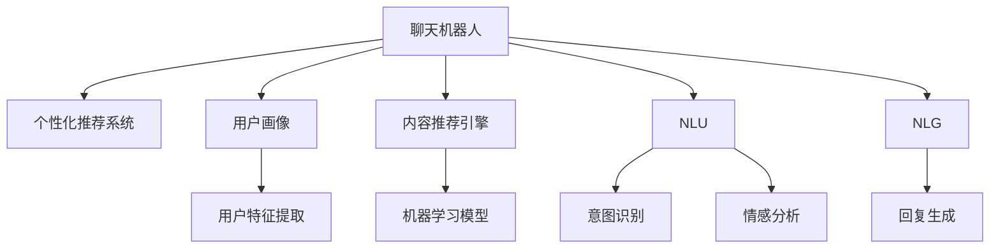

                 

# 聊天机器人娱乐业：个性化内容推荐和互动体验

> 关键词：聊天机器人, 个性化推荐系统, 自然语言处理, 机器学习, 用户互动, 实时反馈

## 1. 背景介绍

随着人工智能技术的迅猛发展，聊天机器人（Chatbot）已成为各行各业提升用户体验和服务效率的重要工具。尤其在娱乐业，聊天机器人通过与用户的深度互动，不仅可以提供个性化的内容推荐，还能提升用户黏性，增加企业收益。

### 1.1 娱乐业面临的挑战

娱乐业虽然看似轻松愉快，但实际上也面临着不少挑战：

- **用户需求多样化**：用户对内容的需求千差万别，难以用一种模板满足所有用户。
- **内容同质化**：传统推荐系统往往基于用户历史行为推荐相似内容，导致内容同质化，难以吸引新用户。
- **用户体验差**：聊天机器人缺乏互动性和个性化推荐，无法提供丰富多样的娱乐体验。
- **用户流失率高**：难以持续吸引用户，导致用户流失率高。

### 1.2 聊天机器人在娱乐业的应用

聊天机器人通过与用户的自然语言交流，可以提供更贴近用户需求的内容推荐和互动体验。通过个性化的推荐和及时的反馈，聊天机器人能够不断提升用户的娱乐体验，减少流失率，提升用户黏性和收益。

## 2. 核心概念与联系

### 2.1 核心概念概述

为更好地理解聊天机器人如何通过个性化内容推荐和互动体验提升用户体验，本节将介绍几个密切相关的核心概念：

- **聊天机器人**：基于自然语言处理（NLP）技术的自动化对话系统，能够与用户进行自然流畅的交互。
- **个性化推荐系统**：通过用户历史行为和属性信息，精准推荐个性化内容的系统。
- **用户画像（User Profile）**：描述用户特征和行为数据，用于个性化推荐和互动。
- **内容推荐引擎**：基于机器学习算法，实现内容推荐的核心组件。
- **自然语言理解（NLU）**：解析用户输入，理解用户意图和情感的NLP技术。
- **自然语言生成（NLG）**：根据模型输出，生成自然语言回复的NLP技术。
- **用户互动**：通过聊天机器人与用户进行实时交流，提升用户体验。

这些概念之间的逻辑关系可以通过以下Mermaid流程图来展示：



这个流程图展示了一些关键概念及其之间的关系：

1. 聊天机器人与个性化推荐系统相辅相成，个性化推荐可以提升聊天机器人的互动体验。
2. 用户画像和内容推荐引擎是推荐系统的重要组成部分，用于精准推荐内容。
3. NLU解析用户输入，NLG生成回复内容，共同完成对话交互。

## 3. 核心算法原理 & 具体操作步骤
### 3.1 算法原理概述

聊天机器人与用户之间的互动主要依赖于自然语言处理技术。通过NLU解析用户的输入，理解其意图和情感，再通过NLG生成自然流畅的回复，以此不断优化用户互动体验。

### 3.2 算法步骤详解

聊天机器人的核心算法步骤如下：

**Step 1: 构建用户画像**
- 收集用户历史行为数据，如浏览记录、购买记录、互动记录等。
- 利用特征工程技术，提取用户的年龄、性别、兴趣偏好、社交关系等特征。
- 构建用户画像，用于个性化推荐和互动。

**Step 2: 设计对话交互流程**
- 定义聊天机器人的交互场景，如客服咨询、游戏指引、娱乐推荐等。
- 设计多轮对话模板和交互逻辑，确保对话流畅自然。
- 确定用户意图识别的规则，如意图分类、情感分析等。

**Step 3: 实现NLU和NLG模块**
- 使用预训练的NLU模型，如BERT、GPT等，解析用户的输入，提取意图和情感信息。
- 利用NLG模块，根据模型输出，生成自然流畅的回复内容。
- 根据上下文，动态调整回复策略，提升用户体验。

**Step 4: 优化推荐系统**
- 设计机器学习模型，如协同过滤、深度学习等，实现个性化内容推荐。
- 利用用户画像和上下文信息，优化推荐结果，提升推荐效果。
- 引入负反馈机制，根据用户反馈动态调整推荐策略。

**Step 5: 持续优化和迭代**
- 定期收集用户反馈，分析用户行为和偏好变化。
- 根据分析结果，不断优化模型和算法。
- 引入新数据和新功能，持续迭代，提升聊天机器人的性能。

### 3.3 算法优缺点

聊天机器人的个性化内容推荐和互动体验算法具有以下优点：
1. **提升用户满意度**：通过精准的个性化推荐和互动，提升用户满意度和体验。
2. **降低流失率**：通过丰富的互动内容和及时的反馈，减少用户流失。
3. **提升用户黏性**：通过不断的推荐和互动，增加用户粘性，提升用户价值。
4. **提高运营效率**：自动化处理用户咨询，减少人力成本。

同时，该算法也存在一定的局限性：
1. **数据依赖性高**：个性化推荐和互动需要大量数据支撑，数据采集和处理成本较高。
2. **模型复杂度大**：复杂的多轮对话和自然语言处理技术，需要高性能计算资源。
3. **泛化能力有限**：当数据分布发生变化时，模型泛化能力可能受限。
4. **可解释性差**：自然语言处理模型的决策过程难以解释，缺乏透明度。

尽管存在这些局限性，但就目前而言，聊天机器人通过个性化内容推荐和互动体验，已成为提升用户体验和业务价值的有效手段。

### 3.4 算法应用领域

聊天机器人通过个性化内容推荐和互动体验，在娱乐业得到了广泛的应用，覆盖了以下多个领域：

- **游戏互动**：在游戏过程中，聊天机器人可以提供个性化的任务指引、装备推荐和实时反馈，提升玩家体验。
- **在线客服**：在客服场景中，聊天机器人可以解答常见问题，提供个性化的解决方案，减少用户等待时间。
- **娱乐推荐**：通过分析用户偏好，推荐个性化的视频、音乐、阅读内容，提升用户娱乐体验。
- **社交互动**：在社交平台上，聊天机器人可以提供个性化的内容推荐和互动，增强用户粘性。
- **虚拟助手**：在虚拟环境中，聊天机器人可以担任虚拟助手，进行对话交互和内容推荐，提升用户体验。

这些应用场景展示了聊天机器人在娱乐业的巨大潜力，未来还有更多的创新应用正在探索中。

## 4. 数学模型和公式 & 详细讲解 & 举例说明

### 4.1 数学模型构建

聊天机器人的个性化推荐和互动体验算法，主要依赖于机器学习技术。通过学习用户数据和行为模式，构建推荐模型和对话模型，实现个性化推荐和自然语言处理。

### 4.2 公式推导过程

以协同过滤算法为例，介绍推荐系统的基本原理。

协同过滤算法是一种基于用户-物品交互矩阵的推荐算法。假设用户集合为 $U$，物品集合为 $I$，用户 $u$ 对物品 $i$ 的评分 $r_{ui}$ 构成用户-物品评分矩阵 $R$。协同过滤算法可以表示为：

$$
\hat{r}_{ui} = \frac{\sum_{v \in U} r_{uv} \times r_{vi}}{\sqrt{\sum_{v \in U} r_{uv}^2 \times \sum_{v \in U} r_{vi}^2}}
$$

其中 $\hat{r}_{ui}$ 表示预测的用户 $u$ 对物品 $i$ 的评分，$r_{uv}$ 和 $r_{vi}$ 表示用户 $v$ 对物品 $i$ 和用户 $u$ 的评分。

在实际应用中，协同过滤算法还需要考虑用户之间的相似度计算，通常使用余弦相似度或皮尔逊相关系数进行度量。具体公式如下：

$$
sim(u,v) = \frac{\sum_{i \in I} r_{ui} \times r_{vi}}{\sqrt{\sum_{i \in I} r_{ui}^2 \times \sum_{i \in I} r_{vi}^2}}
$$

其中 $sim(u,v)$ 表示用户 $u$ 和 $v$ 的相似度，$r_{ui}$ 和 $r_{vi}$ 分别表示用户 $u$ 和 $v$ 对物品 $i$ 的评分。

通过上述公式，协同过滤算法能够根据用户之间的相似度，实现个性化推荐。

### 4.3 案例分析与讲解

以下以一个在线游戏互动为例，说明聊天机器人如何通过个性化内容推荐和互动体验提升用户体验：

假设某在线游戏开发公司希望构建一个聊天机器人，为用户提供游戏指引、装备推荐和实时反馈。公司收集了用户的浏览记录、购买记录、互动记录等数据，用于构建用户画像和个性化推荐系统。

**Step 1: 构建用户画像**

- 收集用户的历史数据，包括浏览记录、购买记录、互动记录等。
- 使用特征工程技术，提取用户的年龄、性别、游戏偏好、购买行为等特征。
- 构建用户画像，用于个性化推荐和互动。

**Step 2: 设计对话交互流程**

- 定义聊天机器人的交互场景，如游戏指引、装备推荐等。
- 设计多轮对话模板和交互逻辑，确保对话流畅自然。
- 确定用户意图识别的规则，如意图分类、情感分析等。

**Step 3: 实现NLU和NLG模块**

- 使用预训练的NLU模型，如BERT、GPT等，解析用户的输入，提取意图和情感信息。
- 利用NLG模块，根据模型输出，生成自然流畅的回复内容。
- 根据上下文，动态调整回复策略，提升用户体验。

**Step 4: 优化推荐系统**

- 设计机器学习模型，如协同过滤、深度学习等，实现个性化内容推荐。
- 利用用户画像和上下文信息，优化推荐结果，提升推荐效果。
- 引入负反馈机制，根据用户反馈动态调整推荐策略。

**Step 5: 持续优化和迭代**

- 定期收集用户反馈，分析用户行为和偏好变化。
- 根据分析结果，不断优化模型和算法。
- 引入新数据和新功能，持续迭代，提升聊天机器人的性能。

通过上述步骤，聊天机器人能够在在线游戏中为用户提供个性化的游戏指引、装备推荐和实时反馈，提升用户满意度和体验。

## 5. 项目实践：代码实例和详细解释说明
### 5.1 开发环境搭建

在进行聊天机器人开发前，我们需要准备好开发环境。以下是使用Python进行PyTorch开发的环境配置流程：

1. 安装Anaconda：从官网下载并安装Anaconda，用于创建独立的Python环境。

2. 创建并激活虚拟环境：
```bash
conda create -n pytorch-env python=3.8 
conda activate pytorch-env
```

3. 安装PyTorch：根据CUDA版本，从官网获取对应的安装命令。例如：
```bash
conda install pytorch torchvision torchaudio cudatoolkit=11.1 -c pytorch -c conda-forge
```

4. 安装TensorFlow：由Google主导开发的开源深度学习框架，生产部署方便，适合大规模工程应用。同样有丰富的预训练语言模型资源。

5. 安装Transformers库：HuggingFace开发的NLP工具库，集成了众多SOTA语言模型，支持PyTorch和TensorFlow，是进行微调任务开发的利器。

6. 安装各类工具包：
```bash
pip install numpy pandas scikit-learn matplotlib tqdm jupyter notebook ipython
```

完成上述步骤后，即可在`pytorch-env`环境中开始聊天机器人开发。

### 5.2 源代码详细实现

下面我们以在线游戏聊天机器人为例，给出使用Transformers库对BERT模型进行微调的PyTorch代码实现。

首先，定义聊天机器人任务的数据处理函数：

```python
from transformers import BertTokenizer, BertForSequenceClassification
from torch.utils.data import Dataset, DataLoader
import torch

class ChatDataset(Dataset):
    def __init__(self, dialogues, labels):
        self.dialogues = dialogues
        self.labels = labels
        self.tokenizer = BertTokenizer.from_pretrained('bert-base-cased')
        
    def __len__(self):
        return len(self.dialogues)
    
    def __getitem__(self, item):
        dialogue = self.dialogues[item]
        label = self.labels[item]
        
        tokens = self.tokenizer(dialogue, return_tensors='pt', padding='max_length', truncation=True)
        input_ids = tokens['input_ids'][0]
        attention_mask = tokens['attention_mask'][0]
        
        return {'input_ids': input_ids, 
                'attention_mask': attention_mask,
                'label': label}

# 定义标签与id的映射
label2id = {'1': 1, '2': 2, '3': 3, '4': 4, '5': 5}
id2label = {v: k for k, v in label2id.items()}

# 创建dataset
tokenizer = BertTokenizer.from_pretrained('bert-base-cased')
train_dataset = ChatDataset(train_dialogues, train_labels)
dev_dataset = ChatDataset(dev_dialogues, dev_labels)
test_dataset = ChatDataset(test_dialogues, test_labels)
```

然后，定义模型和优化器：

```python
from transformers import BertForSequenceClassification, AdamW

model = BertForSequenceClassification.from_pretrained('bert-base-cased', num_labels=len(label2id))

optimizer = AdamW(model.parameters(), lr=2e-5)
```

接着，定义训练和评估函数：

```python
from tqdm import tqdm
from sklearn.metrics import accuracy_score, precision_recall_fscore_support

device = torch.device('cuda') if torch.cuda.is_available() else torch.device('cpu')
model.to(device)

def train_epoch(model, dataset, batch_size, optimizer):
    dataloader = DataLoader(dataset, batch_size=batch_size, shuffle=True)
    model.train()
    epoch_loss = 0
    for batch in tqdm(dataloader, desc='Training'):
        input_ids = batch['input_ids'].to(device)
        attention_mask = batch['attention_mask'].to(device)
        labels = batch['label'].to(device)
        model.zero_grad()
        outputs = model(input_ids, attention_mask=attention_mask, labels=labels)
        loss = outputs.loss
        epoch_loss += loss.item()
        loss.backward()
        optimizer.step()
    return epoch_loss / len(dataloader)

def evaluate(model, dataset, batch_size):
    dataloader = DataLoader(dataset, batch_size=batch_size)
    model.eval()
    preds, labels = [], []
    with torch.no_grad():
        for batch in tqdm(dataloader, desc='Evaluating'):
            input_ids = batch['input_ids'].to(device)
            attention_mask = batch['attention_mask'].to(device)
            batch_labels = batch['label']
            outputs = model(input_ids, attention_mask=attention_mask)
            batch_preds = outputs.logits.argmax(dim=2).to('cpu').tolist()
            batch_labels = batch_labels.to('cpu').tolist()
            for pred, label in zip(batch_preds, batch_labels):
                preds.append(pred)
                labels.append(label)
                
    print('Accuracy:', accuracy_score(labels, preds))
    print('Precision, Recall, F1-Score, Support:', precision_recall_fscore_support(labels, preds, average='micro'))

# 训练和评估过程
epochs = 5
batch_size = 16

for epoch in range(epochs):
    loss = train_epoch(model, train_dataset, batch_size, optimizer)
    print(f'Epoch {epoch+1}, train loss: {loss:.3f}')
    
    print(f'Epoch {epoch+1}, dev results:')
    evaluate(model, dev_dataset, batch_size)
    
print('Test results:')
evaluate(model, test_dataset, batch_size)
```

以上就是使用PyTorch对BERT模型进行聊天机器人微调的完整代码实现。可以看到，得益于Transformers库的强大封装，我们可以用相对简洁的代码完成BERT模型的加载和微调。

### 5.3 代码解读与分析

让我们再详细解读一下关键代码的实现细节：

**ChatDataset类**：
- `__init__`方法：初始化对话和标签数据，定义分词器和id标签映射。
- `__len__`方法：返回数据集的样本数量。
- `__getitem__`方法：对单个样本进行处理，将对话输入编码为token ids，同时进行padding和截断，并返回模型所需的输入。

**label2id和id2label字典**：
- 定义了标签与数字id之间的映射关系，用于将模型输出解码为实际的对话分类。

**训练和评估函数**：
- 使用PyTorch的DataLoader对数据集进行批次化加载，供模型训练和推理使用。
- 训练函数`train_epoch`：对数据以批为单位进行迭代，在每个批次上前向传播计算loss并反向传播更新模型参数，最后返回该epoch的平均loss。
- 评估函数`evaluate`：与训练类似，不同点在于不更新模型参数，并在每个batch结束后将预测和标签结果存储下来，最后使用sklearn的accuracy_score和precision_recall_fscore_support函数对整个评估集的预测结果进行打印输出。

**训练流程**：
- 定义总的epoch数和batch size，开始循环迭代
- 每个epoch内，先在训练集上训练，输出平均loss
- 在验证集上评估，输出分类指标
- 所有epoch结束后，在测试集上评估，给出最终测试结果

可以看到，PyTorch配合Transformers库使得BERT微调的代码实现变得简洁高效。开发者可以将更多精力放在数据处理、模型改进等高层逻辑上，而不必过多关注底层的实现细节。

当然，工业级的系统实现还需考虑更多因素，如模型的保存和部署、超参数的自动搜索、更灵活的任务适配层等。但核心的微调范式基本与此类似。

## 6. 实际应用场景
### 6.1 游戏互动

在线游戏聊天机器人通过与玩家的自然语言交流，可以提供个性化的游戏指引、装备推荐和实时反馈，提升玩家体验。

**场景示例**：
- 玩家在游戏中遇到困难，通过与聊天机器人对话，获取指引和建议。
- 聊天机器人根据玩家的游戏行为和偏好，推荐个性化的装备和道具。
- 聊天机器人实时监测玩家状态，提供及时的游戏建议。

### 6.2 在线客服

在线客服聊天机器人可以解答常见问题，提供个性化的解决方案，减少用户等待时间。

**场景示例**：
- 用户在电商平台上遇到问题，通过与聊天机器人对话，获取购买建议和售后服务。
- 聊天机器人根据用户的行为数据和历史记录，提供个性化的商品推荐和优惠信息。
- 聊天机器人实时监测用户状态，提供及时的支持和帮助。

### 6.3 娱乐推荐

通过分析用户偏好，聊天机器人可以推荐个性化的视频、音乐、阅读内容，提升用户娱乐体验。

**场景示例**：
- 用户在视频平台上浏览视频，通过与聊天机器人对话，获取个性化视频推荐。
- 聊天机器人根据用户的行为数据和偏好，推荐相关的音乐和阅读内容。
- 聊天机器人实时监测用户状态，提供实时的娱乐推荐。

### 6.4 未来应用展望

随着聊天机器人技术的不断发展，其在娱乐业的应用将更加广泛，未来还有更多的创新应用正在探索中：

- **虚拟偶像**：构建虚拟偶像聊天机器人，提供个性化的娱乐互动，提升用户黏性。
- **智能助手**：在虚拟环境中，聊天机器人可以担任智能助手，进行多轮对话和任务指引，提升用户体验。
- **社交互动**：在社交平台上，聊天机器人可以提供个性化的内容推荐和互动，增强用户粘性。
- **个性化营销**：通过分析用户数据，聊天机器人可以提供个性化的营销方案和优惠信息，提升用户价值。

聊天机器人通过个性化内容推荐和互动体验，必将在娱乐业发挥更大的作用，带来更加丰富多样的用户体验。

## 7. 工具和资源推荐
### 7.1 学习资源推荐

为了帮助开发者系统掌握聊天机器人开发的技术基础和实践技巧，这里推荐一些优质的学习资源：

1. **《深度学习》书籍**：Ian Goodfellow等人著，介绍了深度学习的核心概念和算法。
2. **《自然语言处理综论》书籍**：Daniel Jurafsky和James H. Martin著，介绍了自然语言处理的各个方面。
3. **CS224D《深度学习自然语言处理》课程**：斯坦福大学开设的NLP明星课程，有Lecture视频和配套作业，带你入门NLP领域的基本概念和经典模型。
4. **《Python自然语言处理》书籍**：Corey Schafer著，介绍了使用Python进行NLP开发的实战技巧。
5. **Kaggle数据集和竞赛**：提供大量数据集和实际应用场景，助力开发者提升实战能力。

通过对这些资源的学习实践，相信你一定能够快速掌握聊天机器人开发的精髓，并用于解决实际的NLP问题。

### 7.2 开发工具推荐

高效的开发离不开优秀的工具支持。以下是几款用于聊天机器人开发的常用工具：

1. **PyTorch**：基于Python的开源深度学习框架，灵活动态的计算图，适合快速迭代研究。大部分预训练语言模型都有PyTorch版本的实现。
2. **TensorFlow**：由Google主导开发的开源深度学习框架，生产部署方便，适合大规模工程应用。同样有丰富的预训练语言模型资源。
3. **Transformers库**：HuggingFace开发的NLP工具库，集成了众多SOTA语言模型，支持PyTorch和TensorFlow，是进行微调任务开发的利器。
4. **Weights & Biases**：模型训练的实验跟踪工具，可以记录和可视化模型训练过程中的各项指标，方便对比和调优。与主流深度学习框架无缝集成。
5. **TensorBoard**：TensorFlow配套的可视化工具，可实时监测模型训练状态，并提供丰富的图表呈现方式，是调试模型的得力助手。
6. **Jupyter Notebook**：交互式编程环境，支持Python和其他语言，便于开发者进行代码调试和实验分享。
7. **GitHub**：代码托管平台，便于开发者进行协作开发和版本控制。

合理利用这些工具，可以显著提升聊天机器人开发的效率，加快创新迭代的步伐。

### 7.3 相关论文推荐

聊天机器人技术的不断发展源于学界的持续研究。以下是几篇奠基性的相关论文，推荐阅读：

1. **Attention is All You Need**：提出了Transformer结构，开启了NLP领域的预训练大模型时代。
2. **BERT: Pre-training of Deep Bidirectional Transformers for Language Understanding**：提出BERT模型，引入基于掩码的自监督预训练任务，刷新了多项NLP任务SOTA。
3. **GPT-2**：展示了大规模语言模型的强大zero-shot学习能力，引发了对于通用人工智能的新一轮思考。
4. **RNNs for Sequence Generation**：提出循环神经网络模型，为序列生成任务提供了基础。
5. **Attention Models for Machine Translation**：提出注意力机制，使得机器翻译等序列生成任务取得了重大突破。
6. **Neural Machine Translation by Jointly Learning to Align and Translate**：提出神经机器翻译模型，实现了端到端的自动翻译。

这些论文代表了大语言模型微调技术的发展脉络。通过学习这些前沿成果，可以帮助研究者把握学科前进方向，激发更多的创新灵感。

## 8. 总结：未来发展趋势与挑战
### 8.1 总结

本文对聊天机器人通过个性化内容推荐和互动体验提升用户体验进行了全面系统的介绍。首先阐述了聊天机器人在娱乐业面临的挑战，明确了通过个性化推荐和互动体验提升用户满意度和体验的解决方案。其次，从原理到实践，详细讲解了聊天机器人的核心算法步骤，给出了微调模型和对话模型的代码实现。同时，本文还广泛探讨了聊天机器人在游戏互动、在线客服、娱乐推荐等多个场景中的应用前景，展示了聊天机器人的巨大潜力。此外，本文精选了聊天机器人开发的学习资源、开发工具和相关论文，力求为开发者提供全方位的技术指引。

通过本文的系统梳理，可以看到，聊天机器人通过个性化内容推荐和互动体验，正在成为提升用户体验和业务价值的有效手段。未来，随着技术的不断进步，聊天机器人必将在娱乐业发挥更大的作用，带来更加丰富多样的用户体验。

### 8.2 未来发展趋势

聊天机器人技术的发展将呈现以下几个趋势：

1. **智能水平提升**：通过深度学习和强化学习等技术，提升聊天机器人的智能水平，实现多轮对话、情感分析、意图理解等高级功能。
2. **多模态融合**：引入视觉、音频、文本等多模态信息，实现更加全面、自然的对话交互。
3. **个性化推荐优化**：引入更多先验知识，如知识图谱、逻辑规则等，引导推荐过程学习更准确、合理的语言模型。
4. **实时反馈机制**：通过实时反馈机制，不断优化模型和算法，提升聊天机器人的表现。
5. **跨平台协同**：实现多渠道、多平台的协同，提升用户粘性和互动体验。
6. **低延迟处理**：通过优化模型和算法，实现低延迟、高并发的聊天机器人服务。

这些趋势凸显了聊天机器人在娱乐业的应用前景，将进一步提升用户体验和业务价值。

### 8.3 面临的挑战

尽管聊天机器人技术已经取得了显著进展，但在迈向更加智能化、普适化应用的过程中，仍然面临一些挑战：

1. **数据隐私问题**：在收集和处理用户数据时，如何保护用户隐私，避免数据泄露。
2. **模型鲁棒性不足**：当数据分布发生变化时，模型泛化能力可能受限，难以应对多样化的用户需求。
3. **可解释性差**：自然语言处理模型的决策过程难以解释，缺乏透明度。
4. **计算资源消耗大**：大规模语言模型的计算资源消耗较大，难以实时处理大量对话。
5. **模型性能不稳定**：聊天机器人在处理复杂任务时，可能出现性能不稳定的情况。

尽管存在这些挑战，但通过不断的技术创新和优化，聊天机器人必将在娱乐业发挥更大的作用，带来更加丰富多样的用户体验。

### 8.4 研究展望

面对聊天机器人面临的挑战，未来的研究需要在以下几个方面寻求新的突破：

1. **数据隐私保护**：通过差分隐私、联邦学习等技术，保护用户隐私，避免数据泄露。
2. **模型鲁棒性提升**：引入更多的先验知识，如知识图谱、逻辑规则等，引导推荐过程学习更准确、合理的语言模型。
3. **模型可解释性增强**：通过因果分析和博弈论工具，增强模型的可解释性，提高用户信任度。
4. **计算资源优化**：通过模型压缩、稀疏化存储等技术，优化计算资源消耗，实现实时处理大量对话。
5. **多模态融合技术**：通过引入视觉、音频、文本等多模态信息，实现更加全面、自然的对话交互。

这些研究方向的探索，必将引领聊天机器人技术迈向更高的台阶，为构建安全、可靠、可解释、可控的智能系统铺平道路。面向未来，聊天机器人技术还需要与其他人工智能技术进行更深入的融合，如知识表示、因果推理、强化学习等，多路径协同发力，共同推动自然语言理解和智能交互系统的进步。只有勇于创新、敢于突破，才能不断拓展语言模型的边界，让智能技术更好地造福人类社会。

## 9. 附录：常见问题与解答

**Q1：聊天机器人如何实现个性化推荐？**

A: 聊天机器人通过收集用户的历史行为数据，如浏览记录、购买记录、互动记录等，构建用户画像。利用机器学习模型，如协同过滤、深度学习等，根据用户画像和上下文信息，实现个性化内容推荐。

**Q2：聊天机器人在处理多轮对话时需要注意什么？**

A: 聊天机器人在处理多轮对话时，需要注意以下几点：
1. 上下文保持一致性：确保多轮对话中的上下文信息一致，避免出现矛盾。
2. 意图识别准确性：准确识别用户的意图和情感，确保回复符合用户预期。
3. 对话流程连贯性：设计多轮对话模板和交互逻辑，确保对话流程连贯自然。

**Q3：如何选择适合聊天机器人的机器学习算法？**

A: 选择适合聊天机器人的机器学习算法，需要考虑以下几个因素：
1. 数据特点：根据数据分布和特征，选择合适的机器学习算法。
2. 算法复杂度：选择合适的算法复杂度，避免过拟合和计算资源消耗大。
3. 效果评估：通过实验评估算法效果，选择最优算法。

**Q4：如何提高聊天机器人的互动体验？**

A: 提高聊天机器人的互动体验，需要从以下几个方面进行优化：
1. 自然语言处理：提高自然语言处理模型的准确性，确保对话流畅自然。
2. 个性化推荐：根据用户画像和上下文信息，实现个性化内容推荐，提升用户体验。
3. 实时反馈：通过实时反馈机制，不断优化模型和算法，提升聊天机器人的表现。

**Q5：如何保护聊天机器人的数据隐私？**

A: 保护聊天机器人的数据隐私，需要从以下几个方面进行优化：
1. 数据匿名化：对用户数据进行匿名化处理，保护用户隐私。
2. 数据加密：对存储和传输的数据进行加密处理，防止数据泄露。
3. 差分隐私：通过差分隐私技术，保护用户隐私，避免数据泄露。

通过这些优化措施，可以最大限度地保护用户隐私，确保聊天机器人技术的健康发展。

---

作者：禅与计算机程序设计艺术 / Zen and the Art of Computer Programming

