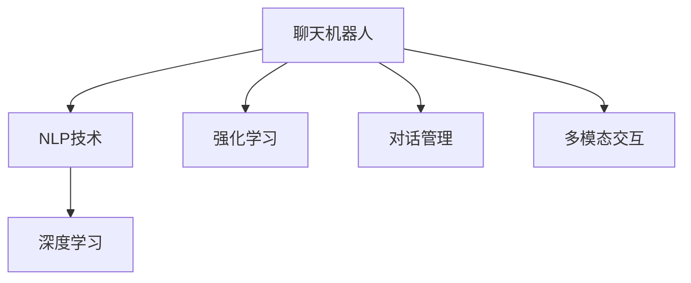

                 

# 聊天机器人工程和问题解决：创新解决方案

> 关键词：聊天机器人,自然语言处理,NLP,深度学习,强化学习,对话管理,多模态交互

## 1. 背景介绍

### 1.1 问题由来

随着人工智能技术的迅猛发展，聊天机器人（Chatbots）已成为企业客户服务和数字化转型的重要工具。聊天机器人可以全天候提供服务，支持多种语言，可以处理复杂任务，并能够快速学习和适应新的用户需求。然而，目前的聊天机器人仍存在诸多不足，如缺乏灵活性、上下文理解能力差、无法应对复杂问题等。

### 1.2 问题核心关键点

聊天机器人工程的核心在于构建能够理解自然语言、生成自然语言、并在对话中灵活应对问题并逐步提升解决问题的能力。这包括构建语言理解模型、设计对话管理机制、引入自然语言生成技术以及实现多模态交互等。

为了更好地理解聊天机器人工程的实现，本文将从核心概念、关键技术、典型案例、实际应用、未来展望等方面进行深入探讨。

## 2. 核心概念与联系

### 2.1 核心概念概述

为更好地理解聊天机器人工程，本节将介绍几个密切相关的核心概念：

- 聊天机器人（Chatbot）：能够通过自然语言与用户进行交流，提供服务和信息的人工智能应用。
- 自然语言处理（Natural Language Processing, NLP）：使计算机能够理解、生成、处理人类语言的技术。
- 深度学习（Deep Learning）：利用多层神经网络进行模型训练和预测，以处理大规模、复杂的数据。
- 强化学习（Reinforcement Learning, RL）：通过与环境的交互来学习最优决策策略的机器学习算法。
- 对话管理（Dialog Management）：聊天机器人与用户进行对话的过程，包括对话策略、状态转换等。
- 多模态交互（Multimodal Interaction）：整合文本、语音、图像、视频等多种数据形式，增强用户的交互体验。

这些概念之间的逻辑关系可以通过以下Mermaid流程图来展示：



这个流程图展示了聊天机器人工程涉及的主要概念及其相互关系：

1. 聊天机器人将NLP技术、深度学习和强化学习融合，以提升语言理解和生成能力。
2. 对话管理负责设计聊天机器人的对话策略和状态转换，以维护对话连贯性和一致性。
3. 多模态交互使得聊天机器人能够整合多种数据形式，提升用户的交互体验。

这些概念共同构成了聊天机器人工程的核心内容，使其能够在各种场景下提供流畅、高效的对话体验。

## 3. 核心算法原理 & 具体操作步骤
### 3.1 算法原理概述

聊天机器人工程的算法原理主要涉及自然语言处理（NLP）、深度学习和强化学习（RL）等方面。

- **自然语言处理（NLP）**：NLP技术是聊天机器人的基础。它包括分词、词性标注、句法分析、语义理解等步骤。通常使用预训练的Transformer模型进行NLP任务处理。

- **深度学习**：深度学习用于构建语言模型和生成模型。常用的模型包括循环神经网络（RNN）、长短时记忆网络（LSTM）和Transformer等。这些模型可以自动学习语言特征，并进行文本生成、情感分析、命名实体识别等任务。

- **强化学习**：强化学习用于优化对话管理策略。通过与环境的交互，学习如何在对话中做出最优决策，提升机器人与用户的互动效果。

聊天机器人工程的具体操作步骤通常包括以下几个步骤：

1. 数据收集与预处理：收集对话数据，并进行文本清洗、分词、标注等预处理工作。
2. 模型选择与训练：选择合适的深度学习模型，并在大量对话数据上进行训练。
3. 对话管理策略设计：根据具体应用场景，设计对话管理策略，包括状态转换、意图识别、响应生成等。
4. 多模态交互设计：结合文本、语音、图像等多种数据形式，设计多模态交互机制，提升用户交互体验。
5. 系统部署与测试：将训练好的模型部署到实际应用中，并进行系统测试和优化。

### 3.2 算法步骤详解

本节详细讲解聊天机器人工程的算法步骤：

**Step 1: 数据收集与预处理**

- **数据收集**：收集尽可能多的对话数据，涵盖不同场景和话题。
- **数据清洗**：去除无效数据、噪声数据，保留有价值的对话信息。
- **分词与标注**：对文本进行分词，并添加词性标注、命名实体标注等。
- **语料标注**：对对话进行意图识别、情感分析等标注，建立训练数据集。

**Step 2: 模型选择与训练**

- **模型选择**：选择合适的深度学习模型，如BERT、GPT等。
- **模型训练**：利用预标注数据训练模型，最小化损失函数，使模型能够预测对话意图、生成对话回复等。
- **超参数调优**：根据训练效果，调整学习率、批量大小等超参数，优化模型性能。

**Step 3: 对话管理策略设计**

- **状态管理**：设计对话状态转换规则，管理对话上下文。
- **意图识别**：利用意图分类器，识别用户意图，确定对话方向。
- **响应生成**：根据用户意图，生成自然语言回复，并进行自然语言处理，确保语法和语义正确。

**Step 4: 多模态交互设计**

- **语音识别**：将用户语音转换成文本，提高机器人理解能力。
- **图像处理**：对用户上传的图像进行分析和处理，提取有用的信息。
- **多模态融合**：结合文本、语音、图像等多种数据形式，设计多模态交互机制，提升用户交互体验。

**Step 5: 系统部署与测试**

- **系统部署**：将训练好的模型和对话管理策略部署到实际应用中，如网站、移动应用等。
- **系统测试**：在实际场景中测试聊天机器人，评估其性能和用户体验。
- **持续优化**：根据测试结果，不断调整模型和对话策略，提升系统性能。

### 3.3 算法优缺点

聊天机器人工程的算法具有以下优点：

- **高效互动**：能够24小时不间断地与用户互动，提供即时的服务。
- **个性化服务**：通过用户历史对话数据，能够提供个性化的服务和推荐。
- **自然语言处理**：能够理解自然语言，进行情感分析、命名实体识别等复杂任务。
- **可扩展性强**：能够轻松扩展到不同的应用场景和任务，如客户服务、教育、医疗等。

但聊天机器人工程也存在一些缺点：

- **依赖数据**：模型性能很大程度上依赖于对话数据的质量和数量。
- **上下文理解**：在复杂对话场景下，难以理解上下文信息，影响对话连贯性。
- **缺乏常识**：难以理解人类常识和知识，无法处理未见过的场景和问题。
- **计算资源需求高**：大规模模型和高性能计算资源是必要的，对算力和存储都有较高的要求。

### 3.4 算法应用领域

聊天机器人工程的算法主要应用于以下几个领域：

- **客户服务**：在网站、APP、智能客服系统中，提供自动问答、订单处理、客户咨询等服务。
- **教育**：在在线教育平台中，提供智能辅导、作业批改、学习建议等服务。
- **医疗**：在医疗咨询系统中，提供健康问答、初步诊断、预约服务等功能。
- **金融**：在金融服务中，提供理财咨询、交易建议、风险评估等服务。
- **游戏**：在游戏互动中，提供智能对手、NPC对话、任务引导等功能。

此外，聊天机器人工程还在电商客服、社交媒体、智能家居、智能交通等多个领域得到广泛应用，提升了用户体验和生产效率。

## 4. 数学模型和公式 & 详细讲解 & 举例说明

### 4.1 数学模型构建

本节将使用数学语言对聊天机器人工程的算法进行更加严格的刻画。

假设聊天机器人与用户之间的对话为序列 $x_1, x_2, \ldots, x_n$，其中 $x_i$ 表示用户在第 $i$ 步的输入，$y_i$ 表示机器人在第 $i$ 步的输出。

定义模型的预测函数为 $y_i = f(x_i; \theta)$，其中 $\theta$ 为模型参数。模型的损失函数为 $\mathcal{L}(\theta)$，用于衡量模型预测与实际输出之间的差异。

常用的损失函数包括交叉熵损失函数、均方误差损失函数等。以交叉熵损失函数为例，其定义如下：

$$
\mathcal{L}(\theta) = -\frac{1}{N} \sum_{i=1}^N \sum_{j=1}^C y_{ij} \log p_{ij}(x_i)
$$

其中，$y_{ij}$ 表示用户输入为 $x_i$ 时，选择第 $j$ 个回复的概率，$p_{ij}(x_i)$ 表示模型预测回复为 $y_i$ 的概率。

### 4.2 公式推导过程

以下我们以意图识别为例，推导交叉熵损失函数及其梯度的计算公式。

假设用户输入为 $x_i$，模型的意图识别结果为 $y_i$，实际标签为 $y_i'$。则意图识别任务的交叉熵损失函数定义为：

$$
\ell(y_i, y_i') = -\sum_{j=1}^C y_{ij} \log p_{ij}(x_i)
$$

将其代入经验风险公式，得：

$$
\mathcal{L}(\theta) = -\frac{1}{N} \sum_{i=1}^N \ell(y_i, y_i')
$$

根据链式法则，损失函数对模型参数 $\theta$ 的梯度为：

$$
\frac{\partial \mathcal{L}(\theta)}{\partial \theta} = -\frac{1}{N} \sum_{i=1}^N \sum_{j=1}^C \frac{\partial \ell(y_i, y_i')}{\partial p_{ij}(x_i)} \frac{\partial p_{ij}(x_i)}{\partial \theta}
$$

其中，$\frac{\partial p_{ij}(x_i)}{\partial \theta}$ 为模型输出概率对模型参数 $\theta$ 的梯度，可通过反向传播算法高效计算。

在得到损失函数的梯度后，即可带入参数更新公式，完成模型的迭代优化。重复上述过程直至收敛，最终得到适应当前任务的最优模型参数 $\theta^*$。

### 4.3 案例分析与讲解

以意图识别为例，假设我们有一个二分类任务，将用户输入分为两类：问题（QA）和命令（CM）。

我们可以使用BERT模型作为意图识别模型的基础，将其输出作为预测概率。然后，将用户输入 $x_i$ 和模型输出 $y_i$ 分别输入到分类器中，进行意图分类。

假设模型在训练数据上的损失函数为 $\mathcal{L}(\theta)$，在测试数据上的损失函数为 $\mathcal{L}^* (\theta)$，则模型的平均损失函数为：

$$
\mathcal{L}_{avg} = \frac{1}{N} \sum_{i=1}^N \ell(y_i, y_i')
$$

在实际应用中，我们需要根据具体任务设计合适的损失函数和预测函数，并使用合适的深度学习框架（如PyTorch、TensorFlow等）进行模型训练和优化。

## 5. 项目实践：代码实例和详细解释说明
### 5.1 开发环境搭建

在进行聊天机器人工程实践前，我们需要准备好开发环境。以下是使用Python进行PyTorch开发的环境配置流程：

1. 安装Anaconda：从官网下载并安装Anaconda，用于创建独立的Python环境。

2. 创建并激活虚拟环境：
```bash
conda create -n chatbot-env python=3.8 
conda activate chatbot-env
```

3. 安装PyTorch：根据CUDA版本，从官网获取对应的安装命令。例如：
```bash
conda install pytorch torchvision torchaudio cudatoolkit=11.1 -c pytorch -c conda-forge
```

4. 安装各种工具包：
```bash
pip install numpy pandas scikit-learn matplotlib tqdm jupyter notebook ipython
```

完成上述步骤后，即可在`chatbot-env`环境中开始聊天机器人工程实践。

### 5.2 源代码详细实现

这里我们以意图识别为例，给出使用Transformers库对BERT模型进行意图识别的PyTorch代码实现。

首先，定义意图识别任务的数据处理函数：

```python
from transformers import BertTokenizer
from torch.utils.data import Dataset
import torch

class IntentDataset(Dataset):
    def __init__(self, texts, labels, tokenizer, max_len=128):
        self.texts = texts
        self.labels = labels
        self.tokenizer = tokenizer
        self.max_len = max_len
        
    def __len__(self):
        return len(self.texts)
    
    def __getitem__(self, item):
        text = self.texts[item]
        label = self.labels[item]
        
        encoding = self.tokenizer(text, return_tensors='pt', max_length=self.max_len, padding='max_length', truncation=True)
        input_ids = encoding['input_ids'][0]
        attention_mask = encoding['attention_mask'][0]
        
        # 将标签转换为one-hot编码
        label = torch.tensor([label == 'QA'], dtype=torch.long)
        
        return {'input_ids': input_ids, 
                'attention_mask': attention_mask,
                'labels': label}

# 定义标签与id的映射
label2id = {'QA': 0, 'CM': 1}
id2label = {v: k for k, v in label2id.items()}

# 创建dataset
tokenizer = BertTokenizer.from_pretrained('bert-base-cased')

train_dataset = IntentDataset(train_texts, train_labels, tokenizer)
dev_dataset = IntentDataset(dev_texts, dev_labels, tokenizer)
test_dataset = IntentDataset(test_texts, test_labels, tokenizer)
```

然后，定义模型和优化器：

```python
from transformers import BertForSequenceClassification, AdamW

model = BertForSequenceClassification.from_pretrained('bert-base-cased', num_labels=len(label2id))

optimizer = AdamW(model.parameters(), lr=2e-5)
```

接着，定义训练和评估函数：

```python
from torch.utils.data import DataLoader
from tqdm import tqdm
from sklearn.metrics import accuracy_score

device = torch.device('cuda') if torch.cuda.is_available() else torch.device('cpu')
model.to(device)

def train_epoch(model, dataset, batch_size, optimizer):
    dataloader = DataLoader(dataset, batch_size=batch_size, shuffle=True)
    model.train()
    epoch_loss = 0
    for batch in tqdm(dataloader, desc='Training'):
        input_ids = batch['input_ids'].to(device)
        attention_mask = batch['attention_mask'].to(device)
        labels = batch['labels'].to(device)
        model.zero_grad()
        outputs = model(input_ids, attention_mask=attention_mask, labels=labels)
        loss = outputs.loss
        epoch_loss += loss.item()
        loss.backward()
        optimizer.step()
    return epoch_loss / len(dataloader)

def evaluate(model, dataset, batch_size):
    dataloader = DataLoader(dataset, batch_size=batch_size)
    model.eval()
    preds, labels = [], []
    with torch.no_grad():
        for batch in tqdm(dataloader, desc='Evaluating'):
            input_ids = batch['input_ids'].to(device)
            attention_mask = batch['attention_mask'].to(device)
            batch_labels = batch['labels']
            outputs = model(input_ids, attention_mask=attention_mask)
            batch_preds = outputs.logits.argmax(dim=1).to('cpu').tolist()
            batch_labels = batch_labels.to('cpu').tolist()
            for pred, label in zip(batch_preds, batch_labels):
                preds.append(pred)
                labels.append(label)
                
    return accuracy_score(labels, preds)

```

最后，启动训练流程并在测试集上评估：

```python
epochs = 5
batch_size = 16

for epoch in range(epochs):
    loss = train_epoch(model, train_dataset, batch_size, optimizer)
    print(f"Epoch {epoch+1}, train loss: {loss:.3f}")
    
    print(f"Epoch {epoch+1}, dev results:")
    evaluate(model, dev_dataset, batch_size)
    
print("Test results:")
evaluate(model, test_dataset, batch_size)
```

以上就是使用PyTorch对BERT进行意图识别任务的完整代码实现。可以看到，得益于Transformers库的强大封装，我们可以用相对简洁的代码完成BERT模型的加载和意图识别。

### 5.3 代码解读与分析

让我们再详细解读一下关键代码的实现细节：

**IntentDataset类**：
- `__init__`方法：初始化文本、标签、分词器等关键组件。
- `__len__`方法：返回数据集的样本数量。
- `__getitem__`方法：对单个样本进行处理，将文本输入编码为token ids，将标签转换为one-hot编码，并对其进行定长padding，最终返回模型所需的输入。

**label2id和id2label字典**：
- 定义了标签与数字id之间的映射关系，用于将模型预测结果解码回真实的标签。

**训练和评估函数**：
- 使用PyTorch的DataLoader对数据集进行批次化加载，供模型训练和推理使用。
- 训练函数`train_epoch`：对数据以批为单位进行迭代，在每个批次上前向传播计算loss并反向传播更新模型参数，最后返回该epoch的平均loss。
- 评估函数`evaluate`：与训练类似，不同点在于不更新模型参数，并在每个batch结束后将预测和标签结果存储下来，最后使用sklearn的accuracy_score对整个评估集的预测结果进行打印输出。

**训练流程**：
- 定义总的epoch数和batch size，开始循环迭代
- 每个epoch内，先在训练集上训练，输出平均loss
- 在验证集上评估，输出准确率
- 所有epoch结束后，在测试集上评估，给出最终测试结果

可以看到，PyTorch配合Transformers库使得BERT意图识别的代码实现变得简洁高效。开发者可以将更多精力放在数据处理、模型改进等高层逻辑上，而不必过多关注底层的实现细节。

当然，工业级的系统实现还需考虑更多因素，如模型的保存和部署、超参数的自动搜索、更灵活的任务适配层等。但核心的意图识别流程基本与此类似。

## 6. 实际应用场景
### 6.1 智能客服系统

基于聊天机器人工程的智能客服系统能够全天候提供服务，支持多种语言，可以处理复杂任务，并能够快速学习和适应新的用户需求。

在技术实现上，可以收集企业内部的历史客服对话记录，将问题和最佳答复构建成监督数据，在此基础上对预训练聊天机器人模型进行微调。微调后的模型能够自动理解用户意图，匹配最合适的答案模板进行回复。对于客户提出的新问题，还可以接入检索系统实时搜索相关内容，动态组织生成回答。如此构建的智能客服系统，能大幅提升客户咨询体验和问题解决效率。

### 6.2 金融舆情监测

金融机构需要实时监测市场舆论动向，以便及时应对负面信息传播，规避金融风险。传统的人工监测方式成本高、效率低，难以应对网络时代海量信息爆发的挑战。基于聊天机器人工程的文本分类和情感分析技术，为金融舆情监测提供了新的解决方案。

具体而言，可以收集金融领域相关的新闻、报道、评论等文本数据，并对其进行主题标注和情感标注。在此基础上对预训练语言模型进行微调，使其能够自动判断文本属于何种主题，情感倾向是正面、中性还是负面。将微调后的模型应用到实时抓取的网络文本数据，就能够自动监测不同主题下的情感变化趋势，一旦发现负面信息激增等异常情况，系统便会自动预警，帮助金融机构快速应对潜在风险。

### 6.3 个性化推荐系统

当前的推荐系统往往只依赖用户的历史行为数据进行物品推荐，无法深入理解用户的真实兴趣偏好。基于聊天机器人工程的个性化推荐系统可以更好地挖掘用户行为背后的语义信息，从而提供更精准、多样的推荐内容。

在实践中，可以收集用户浏览、点击、评论、分享等行为数据，提取和用户交互的物品标题、描述、标签等文本内容。将文本内容作为模型输入，用户的后续行为（如是否点击、购买等）作为监督信号，在此基础上微调预训练语言模型。微调后的模型能够从文本内容中准确把握用户的兴趣点。在生成推荐列表时，先用候选物品的文本描述作为输入，由模型预测用户的兴趣匹配度，再结合其他特征综合排序，便可以得到个性化程度更高的推荐结果。

### 6.4 未来应用展望

随着聊天机器人工程和自然语言处理技术的发展，未来聊天机器人将在更多领域得到应用，为传统行业带来变革性影响。

在智慧医疗领域，基于聊天机器人工程的医疗问答、病历分析、药物研发等应用将提升医疗服务的智能化水平，辅助医生诊疗，加速新药开发进程。

在智能教育领域，聊天机器人工程的智能辅导、作业批改、学习建议等功能将提升教育效率，因材施教，促进教育公平，提高教学质量。

在智慧城市治理中，聊天机器人工程的智能问答、事件监测、舆情分析等功能将提高城市管理的自动化和智能化水平，构建更安全、高效的未来城市。

此外，在企业生产、社会治理、文娱传媒等众多领域，聊天机器人工程的应用也将不断涌现，为经济社会发展注入新的动力。相信随着技术的日益成熟，聊天机器人工程必将在构建人机协同的智能时代中扮演越来越重要的角色。

## 7. 工具和资源推荐
### 7.1 学习资源推荐

为了帮助开发者系统掌握聊天机器人工程的理论基础和实践技巧，这里推荐一些优质的学习资源：

1. 《自然语言处理综论》书籍：全面介绍了自然语言处理的基本概念和经典算法，是学习聊天机器人工程的必备入门书籍。

2. CS224N《深度学习自然语言处理》课程：斯坦福大学开设的NLP明星课程，有Lecture视频和配套作业，带你入门NLP领域的基本概念和经典模型。

3. 《TensorFlow实战自然语言处理》书籍：深入浅出地介绍了TensorFlow在NLP中的应用，包括对话模型、序列标注、情感分析等任务。

4. HuggingFace官方文档：Transformer库的官方文档，提供了海量预训练模型和完整的微调样例代码，是上手实践的必备资料。

5. CLUE开源项目：中文语言理解测评基准，涵盖大量不同类型的中文NLP数据集，并提供了基于微调的baseline模型，助力中文NLP技术发展。

通过对这些资源的学习实践，相信你一定能够快速掌握聊天机器人工程的核心技术，并用于解决实际的NLP问题。
###  7.2 开发工具推荐

高效的开发离不开优秀的工具支持。以下是几款用于聊天机器人工程开发的常用工具：

1. PyTorch：基于Python的开源深度学习框架，灵活动态的计算图，适合快速迭代研究。大部分预训练语言模型都有PyTorch版本的实现。

2. TensorFlow：由Google主导开发的开源深度学习框架，生产部署方便，适合大规模工程应用。同样有丰富的预训练语言模型资源。

3. Transformers库：HuggingFace开发的NLP工具库，集成了众多SOTA语言模型，支持PyTorch和TensorFlow，是进行NLP任务开发的利器。

4. Weights & Biases：模型训练的实验跟踪工具，可以记录和可视化模型训练过程中的各项指标，方便对比和调优。与主流深度学习框架无缝集成。

5. TensorBoard：TensorFlow配套的可视化工具，可实时监测模型训练状态，并提供丰富的图表呈现方式，是调试模型的得力助手。

6. Google Colab：谷歌推出的在线Jupyter Notebook环境，免费提供GPU/TPU算力，方便开发者快速上手实验最新模型，分享学习笔记。

合理利用这些工具，可以显著提升聊天机器人工程的开发效率，加快创新迭代的步伐。

### 7.3 相关论文推荐

聊天机器人工程的发展源于学界的持续研究。以下是几篇奠基性的相关论文，推荐阅读：

1. Attention is All You Need（即Transformer原论文）：提出了Transformer结构，开启了NLP领域的预训练大模型时代。

2. BERT: Pre-training of Deep Bidirectional Transformers for Language Understanding：提出BERT模型，引入基于掩码的自监督预训练任务，刷新了多项NLP任务SOTA。

3. Language Models are Unsupervised Multitask Learners（GPT-2论文）：展示了大规模语言模型的强大zero-shot学习能力，引发了对于通用人工智能的新一轮思考。

4. Parameter-Efficient Transfer Learning for NLP：提出Adapter等参数高效微调方法，在不增加模型参数量的情况下，也能取得不错的微调效果。

5. Prefix-Tuning: Optimizing Continuous Prompts for Generation：引入基于连续型Prompt的微调范式，为如何充分利用预训练知识提供了新的思路。

6. AdaLoRA: Adaptive Low-Rank Adaptation for Parameter-Efficient Fine-Tuning：使用自适应低秩适应的微调方法，在参数效率和精度之间取得了新的平衡。

这些论文代表了大语言模型微调技术的发展脉络。通过学习这些前沿成果，可以帮助研究者把握学科前进方向，激发更多的创新灵感。

## 8. 总结：未来发展趋势与挑战
### 8.1 总结

本文对聊天机器人工程的算法原理和操作步骤进行了全面系统的介绍。首先阐述了聊天机器人工程的背景和核心概念，明确了聊天机器人工程在构建智能客服系统、金融舆情监测、个性化推荐系统等领域的应用前景。其次，从原理到实践，详细讲解了对话管理策略、意图识别、自然语言处理等关键技术，给出了完整的代码实现和详细解释说明。最后，本文还探讨了聊天机器人工程的实际应用场景、未来发展趋势以及面临的挑战。

通过本文的系统梳理，可以看到，聊天机器人工程已经成为一个高效、灵活、个性化的智能系统构建手段。利用深度学习、强化学习和自然语言处理技术，聊天机器人能够理解自然语言，生成自然语言，并在对话中灵活应对问题，逐步提升解决问题的能力。未来，随着技术的不断进步，聊天机器人工程必将在更多领域得到应用，为各行各业带来变革性影响。

### 8.2 未来发展趋势

展望未来，聊天机器人工程将呈现以下几个发展趋势：

1. 模型规模持续增大。随着算力成本的下降和数据规模的扩张，预训练语言模型的参数量还将持续增长。超大语言模型蕴含的丰富语言知识，有望支撑更加复杂多变的下游任务。

2. 多模态交互成为主流。未来的聊天机器人将不仅局限于文本交互，还将整合语音、图像、视频等多模态数据，提供更丰富、更自然的交互体验。

3. 模型鲁棒性增强。随着数据分布的变化，聊天机器人工程将需要更强的模型鲁棒性，以应对不同场景下的多样需求。

4. 上下文理解能力提升。通过引入自注意力机制、记忆机制等，提升模型的上下文理解能力，使其能够更好地处理复杂对话场景。

5. 知识图谱的整合。聊天机器人工程将更紧密地与知识图谱、知识库等外部知识源结合，提升模型的常识推理和知识迁移能力。

6. 实时响应能力提升。通过优化模型结构和计算图，提升聊天机器人的实时响应速度，使其能够满足高并发、低延迟的应用需求。

以上趋势凸显了聊天机器人工程在人工智能领域的巨大潜力。这些方向的探索发展，必将进一步提升聊天机器人工程的性能和应用范围，为人工智能技术在垂直行业的规模化落地提供新的契机。

### 8.3 面临的挑战

尽管聊天机器人工程已经取得了瞩目成就，但在迈向更加智能化、普适化应用的过程中，它仍面临着诸多挑战：

1. 数据依赖。模型的性能很大程度上依赖于对话数据的质量和数量。如何获取大规模、高质量的数据，成为制约聊天机器人工程发展的瓶颈。

2. 上下文理解不足。在复杂对话场景下，模型难以理解上下文信息，导致对话连贯性不足。

3. 知识整合能力不足。目前的聊天机器人工程难以灵活吸收和运用更广泛的先验知识，如知识图谱、逻辑规则等。

4. 计算资源需求高。大规模语言模型和高性能计算资源是必要的，对算力和存储都有较高的要求。

5. 推理速度慢。虽然模型精度高，但在实际部署时往往面临推理速度慢、内存占用大等效率问题。

6. 安全性和隐私保护。聊天机器人工程需要考虑用户隐私保护和数据安全，避免信息泄露和滥用。

7. 用户交互体验不足。当前的聊天机器人工程往往缺乏个性化的交互体验，难以满足用户的个性化需求。

这些挑战凸显了聊天机器人工程在应用中的复杂性和复杂性。要克服这些挑战，需要技术创新、数据积累、工程实践等多方面的协同努力。

### 8.4 研究展望

展望未来，聊天机器人工程的研究将主要围绕以下几个方向展开：

1. 跨领域迁移学习。利用跨领域迁移学习方法，提升聊天机器人工程在不同领域中的应用能力。

2. 少样本学习和自监督学习。通过少样本学习和自监督学习方法，降低对标注数据的依赖，提升模型的泛化能力和适应性。

3. 多模态交互和上下文理解。通过多模态交互和上下文理解方法，提升模型的语言理解和生成能力，使其能够更好地处理复杂对话场景。

4. 知识图谱和常识推理。通过知识图谱和常识推理方法，增强聊天机器人工程的常识推理和知识迁移能力，使其能够更好地整合外部知识资源。

5. 计算资源优化。通过优化模型结构和计算图，提升聊天机器人工程的推理速度和计算效率，降低计算资源需求。

6. 用户交互体验优化。通过个性化的交互体验设计和用户行为建模，提升聊天机器人工程的个性化互动能力，满足用户的个性化需求。

通过在这些方向上的持续探索，相信聊天机器人工程将能够突破现有瓶颈，实现更广泛、更深入的应用，为构建人机协同的智能时代贡献力量。

## 9. 附录：常见问题与解答

**Q1：聊天机器人如何处理复杂对话场景？**

A: 复杂对话场景的处理是聊天机器人工程的难点之一。为了解决这个问题，通常采用以下方法：

1. 上下文理解：引入上下文记忆机制，如Transformer中的自注意力机制，将上下文信息作为额外的输入，帮助模型理解对话历史。

2. 多轮对话管理：设计多轮对话管理策略，根据上下文信息动态调整对话策略，提升对话连贯性。

3. 语义角色标注：对对话中的实体、事件、关系等进行语义角色标注，帮助模型更好地理解对话意图。

4. 知识图谱整合：将知识图谱中的信息与对话进行整合，提升模型的常识推理和知识迁移能力。

5. 数据增强：通过对对话进行改写、扩充等数据增强手段，提高模型在复杂对话场景下的泛化能力。

通过这些方法，聊天机器人能够更好地处理复杂对话场景，提升用户交互体验。

**Q2：如何优化聊天机器人的推理速度？**

A: 优化聊天机器人的推理速度是提高其实时响应能力的重要手段。以下是一些优化策略：

1. 模型压缩：通过剪枝、量化等方法，减小模型参数量和计算复杂度，提升推理速度。

2. 推理引擎优化：优化推理引擎，减少计算量和内存占用，提升计算效率。

3. 异步计算：利用异步计算技术，将计算任务分解为多个小任务，并行处理，提高计算效率。

4. 混合精度训练：使用混合精度训练方法，减少计算量和内存占用，提升训练速度。

5. 硬件加速：利用GPU、TPU等高性能硬件设备，提升计算速度。

6. 分批次推理：将对话按批次进行处理，减少单批次计算量，提高推理速度。

通过这些策略，聊天机器人能够快速响应用户请求，提升用户体验。

**Q3：聊天机器人如何实现个性化服务？**

A: 个性化服务是聊天机器人工程的重要应用之一。为了实现个性化服务，通常采用以下方法：

1. 用户画像建模：通过收集用户的历史行为数据，建立用户画像，帮助模型更好地理解用户需求。

2. 上下文感知：在对话中引入上下文信息，根据用户历史行为和对话上下文，推荐个性化的回复和建议。

3. 动态调整策略：根据用户的反馈和行为数据，动态调整对话策略，提升用户满意度。

4. 推荐系统集成：将推荐系统与聊天机器人工程集成，提供个性化推荐服务，提升用户体验。

5. 数据增强：通过对对话进行改写、扩充等数据增强手段，提高模型在个性化场景下的泛化能力。

通过这些方法，聊天机器人能够更好地理解用户需求，提供个性化服务，提升用户满意度。

**Q4：如何提升聊天机器人的上下文理解能力？**

A: 提升聊天机器人的上下文理解能力是提升其对话连贯性的重要手段。以下是一些提升策略：

1. 引入上下文记忆机制：如Transformer中的自注意力机制，将上下文信息作为额外的输入，帮助模型理解对话历史。

2. 多轮对话管理：设计多轮对话管理策略，根据上下文信息动态调整对话策略，提升对话连贯性。

3. 语义角色标注：对对话中的实体、事件、关系等进行语义角色标注，帮助模型更好地理解对话意图。

4. 知识图谱整合：将知识图谱中的信息与对话进行整合，提升模型的常识推理和知识迁移能力。

5. 数据增强：通过对对话进行改写、扩充等数据增强手段，提高模型在上下文场景下的泛化能力。

通过这些方法，聊天机器人能够更好地理解上下文信息，提升对话连贯性，增强用户体验。

**Q5：如何降低聊天机器人对标注数据的依赖？**

A: 降低聊天机器人对标注数据的依赖是提升其泛化能力的重要手段。以下是一些降低策略：

1. 无监督学习和自监督学习：通过无监督和自监督学习方法，利用未标注数据进行训练，提升模型的泛化能力和适应性。

2. 迁移学习：利用迁移学习方法，将预训练模型的知识迁移到下游任务中，降低对标注数据的依赖。

3. 少样本学习和半监督学习：通过少样本学习和半监督学习方法，利用少量标注数据进行训练，提升模型的泛化能力和适应性。

4. 多模态数据融合：将多模态数据（如语音、图像、文本）进行融合，提升模型的泛化能力和适应性。

5. 生成式学习方法：通过生成式学习方法，利用生成对抗网络等技术，生成更多标注数据，提升模型的泛化能力和适应性。

通过这些方法，聊天机器人能够更好地利用未标注数据，降低对标注数据的依赖，提升模型的泛化能力和适应性。

---

作者：禅与计算机程序设计艺术 / Zen and the Art of Computer Programming

