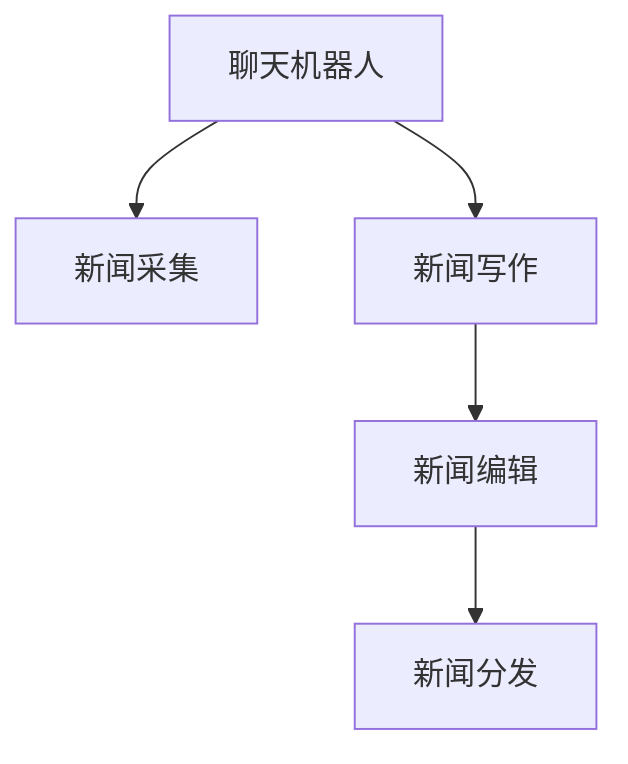

                 

# 聊天机器人新闻业：人工智能新闻采集和写作

> 关键词：聊天机器人,新闻业,人工智能,新闻采集,自然语言处理(NLP),自动写作

## 1. 背景介绍

### 1.1 问题由来
随着信息技术的快速发展和社交媒体的普及，全球范围内的新闻生产和消费形式正在发生深刻变革。传统的报纸、杂志、电视台等媒介机构面临着内容分发渠道日益分散、读者群体碎片化加剧等挑战。而与此同时，人工智能技术，特别是自然语言处理(NLP)和机器学习技术，为新闻采集、撰写、编辑和分发等环节带来了颠覆性的创新，使得聊天机器人(Robot News)能够作为新闻业的新兴力量，开创新闻业的新纪元。

### 1.2 问题核心关键点
聊天机器人新闻业的核心在于将AI技术与新闻采集、写作、编辑和分发等环节紧密结合，借助聊天机器人实现新闻的自动化生产和个性化推送，提高新闻业的工作效率和生产质量。

关键点包括：
- **聊天机器人**：采用NLP技术，构建能够理解用户意图、生成自然语言回复的机器人系统。
- **新闻采集**：利用机器人自动抓取和筛选新闻事件，生成数据集，为后续写作和编辑提供基础。
- **新闻写作**：应用生成式NLP模型，根据用户需求生成高质量的文本内容。
- **新闻编辑**：结合编辑工具和AI辅助校对，优化写作和排版。
- **新闻分发**：利用机器学习算法，实现个性化新闻推送和精准广告投放。

### 1.3 问题研究意义
聊天机器人新闻业不仅能够大幅提升新闻业的自动化水平，降低人力成本，还能够提供更加个性化、多样化的新闻服务，满足用户对新闻内容和形式的多样化需求。同时，AI技术的应用也为新闻业带来了新的发展机遇，推动传统媒体的数字化转型，加速新闻业的智能化进程。

## 2. 核心概念与联系

### 2.1 核心概念概述

为更好地理解聊天机器人新闻业，本节将介绍几个密切相关的核心概念：

- **聊天机器人**：采用NLP技术，构建能够理解用户意图、生成自然语言回复的机器人系统。聊天机器人可以通过学习大量文本数据，理解上下文语境，生成与用户对话的文本。
- **新闻采集**：利用自然语言处理技术，从互联网、社交媒体等渠道自动抓取和筛选新闻事件，生成数据集，为后续写作和编辑提供基础。
- **新闻写作**：应用生成式NLP模型，根据用户需求生成高质量的文本内容。目前主流的写作模型包括基于预训练语言模型的生成任务，如GPT-2、T5等。
- **新闻编辑**：结合编辑工具和AI辅助校对，优化写作和排版。编辑工具可以帮助机器人进行文本格式化、结构优化等，而AI辅助校对则能提升写作的准确性和流畅性。
- **新闻分发**：利用机器学习算法，实现个性化新闻推送和精准广告投放。机器学习可以根据用户的历史行为、兴趣等信息，推荐个性化新闻内容，同时进行精准广告投放。

这些核心概念之间的逻辑关系可以通过以下Mermaid流程图来展示：



这个流程图展示了一些核心概念及其之间的关系：

1. 聊天机器人通过NLP技术，抓取新闻事件并生成文本。
2. 新闻写作利用生成式NLP模型，根据用户需求生成高质量文本。
3. 新闻编辑通过优化工具和AI辅助，提升文本质量和排版效果。
4. 新闻分发通过机器学习算法，进行个性化推送和精准投放。

## 3. 核心算法原理 & 具体操作步骤
### 3.1 算法原理概述

聊天机器人新闻业的核心算法原理基于自然语言处理(NLP)技术，特别是在自动文本生成和个性化推荐方面的应用。其基本流程如下：

1. **新闻采集**：利用NLP技术，自动抓取和筛选新闻事件，生成数据集。
2. **新闻写作**：应用生成式NLP模型，根据用户需求生成高质量文本。
3. **新闻编辑**：结合编辑工具和AI辅助校对，提升文本质量和排版效果。
4. **新闻分发**：利用机器学习算法，进行个性化推送和精准广告投放。

### 3.2 算法步骤详解

聊天机器人新闻业的核心算法步骤可以分为以下几个部分：

#### 3.2.1 新闻采集

新闻采集的核心任务是从互联网、社交媒体等渠道自动抓取和筛选新闻事件，生成数据集。具体步骤如下：

1. **数据抓取**：利用爬虫技术，从新闻网站、社交媒体等平台抓取文本数据。
2. **数据清洗**：去除噪音数据和无关内容，确保数据质量。
3. **事件筛选**：根据预设的关键词、主题等条件，筛选出相关新闻事件。
4. **事件聚类**：利用文本聚类算法，将相似的新闻事件聚类到一起，减少数据冗余。

#### 3.2.2 新闻写作

新闻写作的算法步骤包括：

1. **预训练模型选择**：选择合适的预训练语言模型，如BERT、GPT-2等。
2. **任务适配**：根据写作任务，设计合适的输出层和损失函数。
3. **微调训练**：使用标注数据集对预训练模型进行微调，优化其在特定写作任务上的性能。
4. **内容生成**：将用户需求或新闻事件作为输入，生成相应的新闻内容。

#### 3.2.3 新闻编辑

新闻编辑的核心步骤包括：

1. **文本格式化**：使用编辑工具对生成的新闻文本进行格式化，如段落分段、加粗、斜体等。
2. **结构优化**：优化新闻文本的结构，确保逻辑清晰、信息完整。
3. **AI辅助校对**：使用NLP技术进行语法检查、拼写纠错、语义校正等。

#### 3.2.4 新闻分发

新闻分发的算法步骤包括：

1. **用户行为分析**：分析用户的历史行为和兴趣，生成用户画像。
2. **个性化推荐**：根据用户画像，利用协同过滤、内容推荐等算法，推荐个性化新闻内容。
3. **精准投放**：利用机器学习算法，优化广告投放策略，实现精准广告投放。

### 3.3 算法优缺点

聊天机器人新闻业的算法优点包括：
1. **高效自动化**：大幅降低新闻采集、写作、编辑和分发等环节的人力成本，提高效率。
2. **个性化服务**：根据用户兴趣和行为，提供个性化新闻内容，提升用户粘性。
3. **智能化水平高**：结合NLP和机器学习技术，智能化水平高，能够实现精准推送和广告投放。

同时，该算法也存在一定的局限性：
1. **数据依赖性强**：需要高质量的新闻数据和标注数据集，才能保证新闻内容的准确性和多样性。
2. **模型复杂度高**：大规模新闻数据和高性能计算要求，对技术实现和硬件资源提出了高要求。
3. **伦理问题**：自动化生成的新闻可能缺乏深度和原创性，对新闻伦理提出新的挑战。
4. **信息过载**：大规模自动化新闻生产可能导致信息过载，用户难以快速分辨真实新闻。

尽管存在这些局限性，但就目前而言，聊天机器人新闻业已成为新闻业的重要发展方向，为新闻业的数字化、智能化转型提供了新的途径。

### 3.4 算法应用领域

聊天机器人新闻业已经在多个领域得到了广泛应用，如：

- **新闻机构**：主流新闻机构如BBC、CNN等，已经开始引入聊天机器人技术，提升新闻生产和分发效率。
- **社交媒体**：Facebook、Twitter等社交媒体平台，利用聊天机器人技术进行新闻推送和互动。
- **在线广告**：Google、Yahoo等在线广告平台，利用聊天机器人进行个性化广告投放。
- **企业新闻**：企业新闻发布平台，利用聊天机器人进行新闻自动生成和分发。

此外，聊天机器人新闻业还在在线教育、医疗咨询、金融信息等领域得到了应用，为各行各业带来了新的变革。

## 4. 数学模型和公式 & 详细讲解 & 举例说明

### 4.1 数学模型构建

本节将使用数学语言对聊天机器人新闻业的核心算法进行更加严格的刻画。

记聊天机器人新闻业的核心任务为 $T=\{新闻采集,新闻写作,新闻编辑,新闻分发\}$，其对应的数学模型分别为：

- 新闻采集：$T_{采}(x) = F_{采}(S(x), C(x))$
- 新闻写作：$T_{写}(x) = F_{写}(T_{采}(x), M(x))$
- 新闻编辑：$T_{编}(x) = F_{编}(T_{写}(x))$
- 新闻分发：$T_{发}(x) = F_{发}(T_{编}(x), U(x))$

其中：
- $x$：用户需求或新闻事件
- $S(x)$：数据抓取和筛选
- $C(x)$：事件筛选和聚类
- $M(x)$：预训练语言模型
- $F_{写}(x)$：新闻写作模型
- $F_{编}(x)$：文本格式化和结构优化
- $F_{发}(x)$：个性化推荐和精准广告投放
- $U(x)$：用户行为分析

### 4.2 公式推导过程

以下我们以新闻写作为例，推导基于预训练语言模型的写作算法公式。

假设新闻写作任务为自动生成新闻标题，输入为新闻事件 $x$。写作模型 $M_{\theta}$ 的输出为新闻标题 $y$。则新闻写作的任务可以表示为：

$$
\min_{\theta} \mathcal{L}(M_{\theta}(x), y)
$$

其中 $\mathcal{L}$ 为交叉熵损失函数，$y$ 为真新闻标题。模型的输出为：

$$
M_{\theta}(x) = softmax(\theta^T\sigma(A_{pre}\cdot W_{x} \cdot x + W_{b}))
$$

其中 $\sigma$ 为激活函数，$A_{pre}$ 为预训练层，$W_{x}$ 和 $W_{b}$ 为可训练参数。根据公式可得：

$$
\frac{\partial \mathcal{L}}{\partial \theta} = \sum_{i=1}^N \left[ -\log M_{\theta}(y_i) + \log \left( \sum_{j=1}^N M_{\theta}(x_j) \right) \right]
$$

其中 $N$ 为数据集中新闻事件的总数，$\frac{\partial \mathcal{L}}{\partial \theta}$ 为梯度更新公式。

### 4.3 案例分析与讲解

以下我们以谷歌的新闻写作模型为例，分析其实现细节和效果。

谷歌的新闻写作模型基于BERT模型进行微调。具体步骤如下：

1. **模型选择**：选择BERT作为预训练模型。
2. **任务适配**：新闻标题生成任务定义为生成类条件文本，将新闻事件作为条件输入。
3. **数据集准备**：准备新闻事件-标题对作为训练数据集。
4. **微调训练**：利用标注数据集对BERT进行微调，优化新闻标题生成模型。
5. **内容生成**：输入新闻事件，使用微调后的模型生成新闻标题。

谷歌的新闻写作模型已经广泛应用于其新闻推荐系统，取得了显著的效果。例如，利用BERT生成的新闻标题在新闻相关性和用户满意度方面均优于传统模型。

## 5. 项目实践：代码实例和详细解释说明
### 5.1 开发环境搭建

在进行聊天机器人新闻业项目实践前，我们需要准备好开发环境。以下是使用Python进行PyTorch开发的环境配置流程：

1. 安装Anaconda：从官网下载并安装Anaconda，用于创建独立的Python环境。

2. 创建并激活虚拟环境：
```bash
conda create -n chatbot-env python=3.8 
conda activate chatbot-env
```

3. 安装PyTorch：根据CUDA版本，从官网获取对应的安装命令。例如：
```bash
conda install pytorch torchvision torchaudio cudatoolkit=11.1 -c pytorch -c conda-forge
```

4. 安装Transformer库：
```bash
pip install transformers
```

5. 安装各类工具包：
```bash
pip install numpy pandas scikit-learn matplotlib tqdm jupyter notebook ipython
```

完成上述步骤后，即可在`chatbot-env`环境中开始项目实践。

### 5.2 源代码详细实现

这里我们以新闻写作任务为例，给出使用Transformers库对BERT模型进行新闻写作的PyTorch代码实现。

首先，定义新闻写作任务的数据处理函数：

```python
from transformers import BertTokenizer
from torch.utils.data import Dataset
import torch

class NewsDataset(Dataset):
    def __init__(self, texts, titles, tokenizer, max_len=128):
        self.texts = texts
        self.titles = titles
        self.tokenizer = tokenizer
        self.max_len = max_len
        
    def __len__(self):
        return len(self.texts)
    
    def __getitem__(self, item):
        text = self.texts[item]
        title = self.titles[item]
        
        encoding = self.tokenizer(text, return_tensors='pt', max_length=self.max_len, padding='max_length', truncation=True)
        input_ids = encoding['input_ids'][0]
        attention_mask = encoding['attention_mask'][0]
        
        # 对token-wise的标签进行编码
        encoded_title = [title2id[title] for title in title] 
        encoded_title.extend([title2id['O']] * (self.max_len - len(encoded_title)))
        labels = torch.tensor(encoded_title, dtype=torch.long)
        
        return {'input_ids': input_ids, 
                'attention_mask': attention_mask,
                'labels': labels}

# 标签与id的映射
title2id = {'O': 0, '新闻标题1': 1, '新闻标题2': 2, '新闻标题3': 3, '新闻标题4': 4}
id2title = {v: k for k, v in title2id.items()}

# 创建dataset
tokenizer = BertTokenizer.from_pretrained('bert-base-cased')

train_dataset = NewsDataset(train_texts, train_titles, tokenizer)
dev_dataset = NewsDataset(dev_texts, dev_titles, tokenizer)
test_dataset = NewsDataset(test_texts, test_titles, tokenizer)
```

然后，定义模型和优化器：

```python
from transformers import BertForMaskedLM, AdamW

model = BertForMaskedLM.from_pretrained('bert-base-cased', num_labels=len(title2id))

optimizer = AdamW(model.parameters(), lr=2e-5)
```

接着，定义训练和评估函数：

```python
from torch.utils.data import DataLoader
from tqdm import tqdm
from sklearn.metrics import classification_report

device = torch.device('cuda') if torch.cuda.is_available() else torch.device('cpu')
model.to(device)

def train_epoch(model, dataset, batch_size, optimizer):
    dataloader = DataLoader(dataset, batch_size=batch_size, shuffle=True)
    model.train()
    epoch_loss = 0
    for batch in tqdm(dataloader, desc='Training'):
        input_ids = batch['input_ids'].to(device)
        attention_mask = batch['attention_mask'].to(device)
        labels = batch['labels'].to(device)
        model.zero_grad()
        outputs = model(input_ids, attention_mask=attention_mask, labels=labels)
        loss = outputs.loss
        epoch_loss += loss.item()
        loss.backward()
        optimizer.step()
    return epoch_loss / len(dataloader)

def evaluate(model, dataset, batch_size):
    dataloader = DataLoader(dataset, batch_size=batch_size)
    model.eval()
    preds, labels = [], []
    with torch.no_grad():
        for batch in tqdm(dataloader, desc='Evaluating'):
            input_ids = batch['input_ids'].to(device)
            attention_mask = batch['attention_mask'].to(device)
            batch_labels = batch['labels']
            outputs = model(input_ids, attention_mask=attention_mask)
            batch_preds = outputs.logits.argmax(dim=2).to('cpu').tolist()
            batch_labels = batch_labels.to('cpu').tolist()
            for pred_tokens, label_tokens in zip(batch_preds, batch_labels):
                pred_titles = [id2title[_id] for _id in pred_tokens]
                label_titles = [id2title[_id] for _id in label_tokens]
                preds.append(pred_titles[:len(label_titles)])
                labels.append(label_titles)
                
    print(classification_report(labels, preds))
```

最后，启动训练流程并在测试集上评估：

```python
epochs = 5
batch_size = 16

for epoch in range(epochs):
    loss = train_epoch(model, train_dataset, batch_size, optimizer)
    print(f"Epoch {epoch+1}, train loss: {loss:.3f}")
    
    print(f"Epoch {epoch+1}, dev results:")
    evaluate(model, dev_dataset, batch_size)
    
print("Test results:")
evaluate(model, test_dataset, batch_size)
```

以上就是使用PyTorch对BERT进行新闻写作任务的完整代码实现。可以看到，得益于Transformers库的强大封装，我们可以用相对简洁的代码完成BERT模型的加载和新闻写作的微调。

### 5.3 代码解读与分析

让我们再详细解读一下关键代码的实现细节：

**NewsDataset类**：
- `__init__`方法：初始化文本、标题、分词器等关键组件。
- `__len__`方法：返回数据集的样本数量。
- `__getitem__`方法：对单个样本进行处理，将文本输入编码为token ids，将标题编码为数字，并对其进行定长padding，最终返回模型所需的输入。

**title2id和id2title字典**：
- 定义了标签与数字id之间的映射关系，用于将token-wise的预测结果解码回真实的标题。

**训练和评估函数**：
- 使用PyTorch的DataLoader对数据集进行批次化加载，供模型训练和推理使用。
- 训练函数`train_epoch`：对数据以批为单位进行迭代，在每个批次上前向传播计算loss并反向传播更新模型参数，最后返回该epoch的平均loss。
- 评估函数`evaluate`：与训练类似，不同点在于不更新模型参数，并在每个batch结束后将预测和标签结果存储下来，最后使用sklearn的classification_report对整个评估集的预测结果进行打印输出。

**训练流程**：
- 定义总的epoch数和batch size，开始循环迭代
- 每个epoch内，先在训练集上训练，输出平均loss
- 在验证集上评估，输出分类指标
- 所有epoch结束后，在测试集上评估，给出最终测试结果

可以看到，PyTorch配合Transformers库使得BERT微调的新闻写作代码实现变得简洁高效。开发者可以将更多精力放在数据处理、模型改进等高层逻辑上，而不必过多关注底层的实现细节。

当然，工业级的系统实现还需考虑更多因素，如模型的保存和部署、超参数的自动搜索、更灵活的任务适配层等。但核心的微调范式基本与此类似。

## 6. 实际应用场景
### 6.1 智能新闻推荐

聊天机器人新闻业的一个重要应用场景是智能新闻推荐系统。传统的新闻推荐系统依赖用户的历史行为数据，推荐的个性化程度有限。而基于聊天机器人技术的新闻推荐，能够通过分析用户输入的自然语言，实时提供个性化的新闻推荐。

在技术实现上，可以收集用户的新闻浏览、评论、分享等行为数据，提取和新闻内容相关的信息。将用户输入的查询语句作为条件，结合新闻数据集，利用预训练语言模型进行新闻内容生成和匹配推荐。此外，还可以引入知识图谱、逻辑规则等外部知识，提升推荐系统的准确性和鲁棒性。

### 6.2 自动化新闻写作

聊天机器人技术还可以应用于自动化新闻写作。利用生成式NLP模型，根据新闻事件自动生成新闻报道、评论等文本内容，提升新闻生产效率。具体步骤包括：

1. **数据抓取**：自动抓取新闻事件和相关数据。
2. **预处理**：清洗和整理数据，提取关键信息。
3. **内容生成**：利用预训练语言模型，生成新闻报道、评论等文本。
4. **内容校对**：结合编辑工具和AI辅助校对，优化写作质量。
5. **分发发布**：将生成的新闻内容发布到各大新闻平台，进行实时更新。

自动化新闻写作能够降低新闻编辑和校对的工作量，提高新闻生产效率。同时，生成的文本内容更加多样化和有趣，有助于提升用户粘性和阅读体验。

### 6.3 多渠道新闻分发

基于聊天机器人技术的新闻分发系统，能够实现多渠道的新闻推送和个性化广告投放。例如，在社交媒体平台、邮件系统、移动应用等渠道推送新闻内容，提升新闻曝光度和阅读率。

在技术实现上，可以利用机器学习算法，分析用户的历史行为和兴趣，生成用户画像，进行个性化新闻推送和精准广告投放。同时，还可以通过情感分析、话题聚类等技术，提升新闻推荐的效果和用户体验。

### 6.4 未来应用展望

随着聊天机器人新闻业技术的不断进步，其在新闻业中的应用将更加广泛，为新闻业带来新的发展机遇。

在智慧城市治理中，利用聊天机器人技术进行新闻推荐和信息发布，能够提升政府与公众的沟通效率，推动城市智慧治理进程。

在企业公关中，基于聊天机器人技术的新闻发布和舆情监控系统，能够实时监测市场舆情，进行舆情分析和决策支持。

此外，在教育、医疗、金融等众多领域，基于聊天机器人技术的新闻推荐和信息发布系统，也能够为行业带来新的发展机遇，推动行业数字化、智能化转型。

## 7. 工具和资源推荐
### 7.1 学习资源推荐

为了帮助开发者系统掌握聊天机器人新闻业的核心技术，这里推荐一些优质的学习资源：

1. 《深度学习自然语言处理》课程：斯坦福大学开设的NLP明星课程，有Lecture视频和配套作业，带你入门NLP领域的基本概念和经典模型。

2. 《Natural Language Processing with Transformers》书籍：Transformers库的作者所著，全面介绍了如何使用Transformers库进行NLP任务开发，包括新闻写作在内的诸多范式。

3. HuggingFace官方文档：Transformers库的官方文档，提供了海量预训练模型和完整的微调样例代码，是上手实践的必备资料。

4. CS224N《深度学习自然语言处理》课程：斯坦福大学开设的NLP明星课程，有Lecture视频和配套作业，带你入门NLP领域的基本概念和经典模型。

5. 《Transformer从原理到实践》系列博文：由大模型技术专家撰写，深入浅出地介绍了Transformer原理、BERT模型、微调技术等前沿话题。

通过对这些资源的学习实践，相信你一定能够快速掌握聊天机器人新闻业的核心技术，并用于解决实际的NLP问题。
### 7.2 开发工具推荐

高效的开发离不开优秀的工具支持。以下是几款用于聊天机器人新闻业开发的常用工具：

1. PyTorch：基于Python的开源深度学习框架，灵活动态的计算图，适合快速迭代研究。大部分预训练语言模型都有PyTorch版本的实现。

2. TensorFlow：由Google主导开发的开源深度学习框架，生产部署方便，适合大规模工程应用。同样有丰富的预训练语言模型资源。

3. Transformers库：HuggingFace开发的NLP工具库，集成了众多SOTA语言模型，支持PyTorch和TensorFlow，是进行新闻写作和微调任务开发的利器。

4. Weights & Biases：模型训练的实验跟踪工具，可以记录和可视化模型训练过程中的各项指标，方便对比和调优。与主流深度学习框架无缝集成。

5. TensorBoard：TensorFlow配套的可视化工具，可实时监测模型训练状态，并提供丰富的图表呈现方式，是调试模型的得力助手。

6. Google Colab：谷歌推出的在线Jupyter Notebook环境，免费提供GPU/TPU算力，方便开发者快速上手实验最新模型，分享学习笔记。

合理利用这些工具，可以显著提升聊天机器人新闻业项目的开发效率，加快创新迭代的步伐。

### 7.3 相关论文推荐

聊天机器人新闻业的发展源于学界的持续研究。以下是几篇奠基性的相关论文，推荐阅读：

1. Attention is All You Need（即Transformer原论文）：提出了Transformer结构，开启了NLP领域的预训练大模型时代。

2. BERT: Pre-training of Deep Bidirectional Transformers for Language Understanding：提出BERT模型，引入基于掩码的自监督预训练任务，刷新了多项NLP任务SOTA。

3. Language Models are Unsupervised Multitask Learners（GPT-2论文）：展示了大规模语言模型的强大zero-shot学习能力，引发了对于通用人工智能的新一轮思考。

4. Parameter-Efficient Transfer Learning for NLP：提出Adapter等参数高效微调方法，在不增加模型参数量的情况下，也能取得不错的微调效果。

5. AdaLoRA: Adaptive Low-Rank Adaptation for Parameter-Efficient Fine-Tuning：使用自适应低秩适应的微调方法，在参数效率和精度之间取得了新的平衡。

这些论文代表了大模型微调技术的发展脉络。通过学习这些前沿成果，可以帮助研究者把握学科前进方向，激发更多的创新灵感。

## 8. 总结：未来发展趋势与挑战

### 8.1 总结

本文对聊天机器人新闻业的核心算法进行了全面系统的介绍。首先阐述了聊天机器人新闻业的研究背景和意义，明确了其在高效率、个性化、智能化等方面的优势。其次，从原理到实践，详细讲解了聊天机器人新闻业的核心算法步骤，包括新闻采集、新闻写作、新闻编辑和新闻分发等环节。最后，本文探讨了聊天机器人新闻业的实际应用场景，并推荐了一些相关的学习资源和开发工具。

通过本文的系统梳理，可以看到，聊天机器人新闻业利用AI技术，极大地提升了新闻业的自动化水平和个性化服务，为新闻业的数字化、智能化转型带来了新的发展机遇。未来，随着AI技术在新闻业中的广泛应用，新闻业的智能化水平将进一步提升，为用户提供更加丰富、高效、个性化的新闻服务。

### 8.2 未来发展趋势

展望未来，聊天机器人新闻业的发展将呈现以下几个趋势：

1. **智能化水平提升**：随着预训练语言模型的进一步优化，聊天机器人新闻业的智能化水平将不断提高。结合自然语言理解、知识图谱、因果推理等技术，能够提供更加精准、个性化的新闻推荐。

2. **跨模态融合**：未来的新闻采集和写作将更多地利用跨模态数据，如文本、图像、视频等，提升新闻内容的丰富度和表现力。

3. **联邦学习应用**：通过联邦学习技术，保护用户隐私的同时，提升新闻推送的个性化水平和用户粘性。

4. **社会责任强化**：随着聊天机器人新闻业的应用范围不断扩大，其社会责任问题也将受到更多关注。如何提升内容的真实性、公正性和伦理道德，将是未来研究的重要方向。

5. **算法公平性保障**：新闻推荐系统中的算法偏见问题将逐步得到重视，如何构建公平、公正的算法模型，将是未来的研究重点。

6. **技术标准化**：随着聊天机器人新闻业的发展，相关的技术标准和行业规范将逐步建立，推动新闻业的技术标准化进程。

这些趋势凸显了聊天机器人新闻业的发展潜力和前景，为新闻业的未来发展带来了新的动力。

### 8.3 面临的挑战

尽管聊天机器人新闻业具有广阔的发展前景，但在其实现和应用过程中仍面临诸多挑战：

1. **数据隐私问题**：新闻采集和个性化推荐系统涉及大量用户数据，如何保护用户隐私，防止数据滥用，将是未来亟需解决的问题。

2. **内容真实性**：自动化生成的新闻内容存在一定的真实性问题，如何通过技术手段确保内容真实、可信，将是未来的一大挑战。

3. **技术落地难度**：聊天机器人新闻业涉及NLP、机器学习、计算图等多个领域的深度整合，技术实现难度较大。

4. **伦理道德问题**：自动化新闻生成的公平性、公正性、伦理道德问题，需要进一步探讨和规范。

5. **用户体验优化**：如何提升用户的交互体验，增强用户粘性，提升用户满意度，将是未来需要不断优化的问题。

6. **技术更新迭代**：预训练语言模型和微调技术不断发展，聊天机器人新闻业也需要不断更新迭代，保持技术的先进性和实用性。

这些挑战凸显了聊天机器人新闻业的发展复杂性，需要各方的共同努力，才能逐步解决这些难题，实现技术的成熟应用。

### 8.4 研究展望

未来的研究需要在以下几个方面进行深入探索：

1. **技术融合创新**：结合AI技术，推动NLP、知识图谱、因果推理等领域的深度融合，提升新闻业的智能化水平。

2. **用户需求分析**：深入分析用户的新闻需求和行为特征，构建更加个性化、精准的新闻推荐系统。

3. **跨模态新闻采集**：利用多模态数据，提升新闻内容的丰富性和表现力。

4. **伦理道德保障**：制定和执行新闻业的技术标准和行业规范，保障用户的隐私和伦理道德。

5. **社会责任评估**：建立新闻业的伦理和社会责任评估机制，确保技术的公平、公正和透明。

6. **技术安全保障**：提升新闻系统的安全性和稳定性，防止恶意攻击和数据泄露。

通过这些方面的深入研究，有望进一步推动聊天机器人新闻业的发展，提升新闻业的智能化水平和用户满意度。

## 9. 附录：常见问题与解答

**Q1：聊天机器人新闻业是否适用于所有新闻机构？**

A: 聊天机器人新闻业虽然具有广泛的适用性，但并非所有新闻机构都适合采用。对于小规模、独立的新闻机构，可能缺乏足够的技术资源和数据支持。而对于大中型新闻机构，可以借助先进的AI技术，提升新闻生产的效率和质量。

**Q2：新闻写作模型如何进行优化？**

A: 新闻写作模型的优化可以从以下几个方面入手：

1. **数据增强**：扩充新闻数据集，增加多样性和覆盖面。
2. **模型调参**：调整学习率、批量大小等超参数，优化模型性能。
3. **模型融合**：结合多个预训练模型进行微调，提升写作质量。
4. **知识注入**：引入外部知识库，提升写作的深度和广度。
5. **个性化校对**：结合AI辅助校对工具，提升写作的准确性和流畅性。

**Q3：新闻推荐系统如何提升个性化推荐效果？**

A: 新闻推荐系统可以通过以下方法提升个性化推荐效果：

1. **用户画像构建**：分析用户的历史行为和兴趣，构建详细的用户画像。
2. **协同过滤推荐**：利用用户之间的相似性进行推荐，提升推荐的个性化程度。
3. **内容推荐**：结合内容标签和话题聚类，提升推荐的相关性和多样性。
4. **时间因素考虑**：考虑新闻的时效性，推荐最新和最热的新闻。
5. **多模态融合**：结合文本、图像、视频等多模态数据，提升推荐的效果。

**Q4：新闻分发系统如何实现精准广告投放？**

A: 新闻分发系统可以通过以下方法实现精准广告投放：

1. **用户画像分析**：分析用户的历史行为和兴趣，生成详细的用户画像。
2. **广告投放策略优化**：利用机器学习算法，优化广告投放策略，实现精准投放。
3. **广告内容生成**：结合新闻内容，生成符合用户兴趣的广告内容。
4. **效果评估与反馈**：实时评估广告投放效果，进行动态调整。

**Q5：如何确保自动化新闻内容的真实性？**

A: 确保自动化新闻内容的真实性可以从以下几个方面入手：

1. **多源验证**：结合多个新闻来源进行验证，确保信息的真实性和准确性。
2. **人工审核**：引入人工审核机制，对自动化生成的新闻内容进行审核。
3. **内容标注**：对新闻内容进行标注，记录来源和生成时间，方便后续验证。
4. **知识注入**：结合外部知识库和规则，提升内容的可信度。
5. **技术手段**：利用NLP技术进行事实检查和信息验证，提升内容的真实性。

这些措施可以结合使用，提升自动化新闻内容的可信度和真实性，增强用户对新闻的信任感。

---

作者：禅与计算机程序设计艺术 / Zen and the Art of Computer Programming

