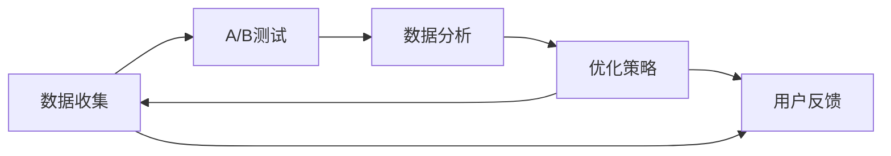

                 

# 聊天机器人测试策略：A/B 测试和用户反馈

在现代社会中，聊天机器人已经成为了不可或缺的一部分。它们被广泛应用在客户服务、个性化推荐、智能家居等多个领域。然而，要确保聊天机器人提供的服务质量，就需要对其进行测试和优化。本文将详细介绍A/B测试和用户反馈在聊天机器人测试中的策略，并探讨如何利用这些策略来提升聊天机器人的性能。

## 1. 背景介绍

### 1.1 问题由来
随着人工智能技术的不断发展，聊天机器人已经被广泛应用到各行各业。然而，聊天机器人的质量始终是业界关注的焦点。如何让聊天机器人更好地理解和回复用户，如何优化聊天机器人的交互体验，成为了亟待解决的问题。

A/B测试和用户反馈是优化聊天机器人的两种重要手段。A/B测试可以帮助我们比较不同版本的聊天机器人，找出最优秀的版本。用户反馈则可以让我们直接了解用户的实际需求和体验，帮助我们进行有针对性的优化。

### 1.2 问题核心关键点
A/B测试和用户反馈的目的是为了提升聊天机器人的质量，其主要关键点包括：
- A/B测试：通过比较不同版本的聊天机器人，找出最优秀的版本。
- 用户反馈：通过用户的直接反馈，了解用户的实际需求和体验，进行有针对性的优化。
- 两者结合：A/B测试和用户反馈可以互相补充，帮助我们全面了解聊天机器人的优缺点，进行更有效的优化。

## 2. 核心概念与联系

### 2.1 核心概念概述

为了更好地理解A/B测试和用户反馈，我们需要先介绍几个核心概念：

- **A/B测试**：是一种比较不同版本的方法，通过将用户随机分配到不同的版本中，比较不同版本的表现。
- **用户反馈**：指用户在实际使用过程中对聊天机器人的评价和建议，可以帮助我们了解用户的实际需求和体验。
- **数据分析**：通过统计分析，评估A/B测试的结果，找出最优版本。
- **优化策略**：根据用户反馈和数据分析结果，进行针对性的优化。

### 2.2 核心概念原理和架构的 Mermaid 流程图



这个流程图展示了A/B测试和用户反馈的流程：数据收集 -> A/B测试 -> 数据分析 -> 优化策略 -> 用户反馈 -> 数据收集。这个循环不断迭代，帮助我们不断优化聊天机器人。

## 3. 核心算法原理 & 具体操作步骤

### 3.1 算法原理概述

A/B测试和用户反馈的核心算法原理是统计学中的假设检验。通过假设检验，我们可以比较不同版本的聊天机器人，找出最优秀的版本。同时，通过对用户反馈的分析，我们可以了解用户的实际需求和体验，进行有针对性的优化。

A/B测试的假设检验方法有几种，常见的包括t检验、卡方检验等。用户反馈的分析方法则包括文本分析、情感分析等。

### 3.2 算法步骤详解

#### 3.2.1 A/B测试步骤

1. **设计实验**：确定测试的目标、测试的范围、测试的时间等。
2. **分组**：将用户随机分配到不同的组中，一般分为实验组和对照组。
3. **运行测试**：在实验组运行新版本的聊天机器人，在对照组运行旧版本的聊天机器人。
4. **收集数据**：收集用户在不同版本聊天机器人上的交互数据。
5. **分析数据**：通过统计分析，比较不同版本的表现，找出最优版本。
6. **结果应用**：将最优版本应用到实际的聊天机器人中，并持续监控其表现。

#### 3.2.2 用户反馈步骤

1. **收集反馈**：在聊天机器人中嵌入反馈模块，让用户可以随时提供反馈。
2. **分析反馈**：对用户的反馈进行文本分析、情感分析等，了解用户的实际需求和体验。
3. **优化策略**：根据用户反馈，进行针对性的优化。
4. **验证优化效果**：再次进行A/B测试，验证优化效果。
5. **迭代优化**：持续收集用户反馈，进行迭代优化。

### 3.3 算法优缺点

#### 3.3.1 优点

- **A/B测试**：可以客观比较不同版本的聊天机器人，找出最优版本。
- **用户反馈**：可以了解用户的实际需求和体验，进行有针对性的优化。
- **结合使用**：A/B测试和用户反馈可以互相补充，帮助我们全面了解聊天机器人的优缺点。

#### 3.3.2 缺点

- **数据质量问题**：数据收集和分析过程中可能会存在误差，影响结果的准确性。
- **时间成本高**：A/B测试和用户反馈需要大量时间和资源，可能会影响业务的正常运营。
- **用户习惯问题**：用户可能对不同版本之间的差异不够敏感，影响测试结果。

### 3.4 算法应用领域

A/B测试和用户反馈可以广泛应用于各种聊天机器人优化场景，例如：

- **客户服务**：通过A/B测试和用户反馈，优化客服机器人，提升用户满意度。
- **智能家居**：通过A/B测试和用户反馈，优化智能家居机器人，提升用户体验。
- **个性化推荐**：通过A/B测试和用户反馈，优化推荐系统，提升推荐效果。

## 4. 数学模型和公式 & 详细讲解

### 4.1 数学模型构建

假设我们有两个版本的聊天机器人，分别是A和B。我们随机将用户分配到A和B中，测试时间为T天。在T天内，A版本产生了N_A个交互事件，B版本产生了N_B个交互事件。我们希望找出哪个版本的聊天机器人表现更好。

- **假设检验**：我们使用t检验，假设A和B的交互事件数量相同，即均值为$\mu_A=\mu_B$。

- **假设检验公式**：
  $$
  t=\frac{\bar{X}_A-\bar{X}_B}{\sqrt{\frac{\sigma^2}{N_A}+\frac{\sigma^2}{N_B}}}
  $$
  其中$\bar{X}_A$和$\bar{X}_B$分别是A和B的平均交互事件数量，$\sigma^2$是方差，$N_A$和$N_B$是样本大小。

- **判断**：根据t值和自由度，查表得到p值。如果p值小于显著性水平$\alpha$，则拒绝原假设，认为A和B的交互事件数量不同。

### 4.2 公式推导过程

1. **假设检验公式推导**：
  $$
  t=\frac{\bar{X}_A-\bar{X}_B}{\sqrt{\frac{\sigma^2}{N_A}+\frac{\sigma^2}{N_B}}}
  $$
  其中$\sigma^2$可以通过样本方差估计，$\bar{X}_A$和$\bar{X}_B$是样本均值，$N_A$和$N_B$是样本大小。

2. **p值计算**：
  $$
  p=2\Phi(-|t|)=(1+\text{erf}\frac{|t|\sqrt{2}}{\sqrt{2}})/2
  $$
  其中$\Phi$是标准正态分布的累积分布函数，$\text{erf}$是误差函数。

### 4.3 案例分析与讲解

假设我们有两个版本的客服机器人，A版本每天平均处理10个用户，B版本每天平均处理8个用户。我们随机将100个用户分配到A和B中，测试时间为30天。

- **收集数据**：
  - A版本：30天共处理300个用户
  - B版本：30天共处理240个用户

- **计算t值**：
  $$
  t=\frac{10-8}{\sqrt{\frac{(10^2)}{100}+\frac{(8^2)}{100}}}=2
  $$

- **查表得到p值**：根据t值和自由度，查表得到p值为0.05。

- **判断**：由于p值小于显著性水平$\alpha=0.05$，我们拒绝原假设，认为A版本的表现优于B版本。

## 5. 项目实践：代码实例和详细解释说明

### 5.1 开发环境搭建

进行A/B测试和用户反馈需要搭建一定的开发环境，包括：

- **服务器**：用于存储和处理数据，运行A/B测试和用户反馈程序。
- **数据库**：用于存储用户数据和反馈数据。
- **开发环境**：Python、R等开发语言，以及TensorFlow、PyTorch等机器学习框架。

### 5.2 源代码详细实现

#### 5.2.1 数据收集和存储

```python
import pandas as pd

# 从数据库中读取数据
data = pd.read_sql_query("SELECT * FROM user_interactions", con=conn)

# 将数据按时间分组
data_grouped = data.groupby('date').sum()
```

#### 5.2.2 A/B测试分析

```python
from scipy.stats import ttest_ind

# 计算t值和p值
t_value, p_value = ttest_ind(data_grouped['A_interactions'], data_grouped['B_interactions'], equal_var=False)

# 判断结果
if p_value < 0.05:
    print("A版本表现优于B版本")
else:
    print("B版本表现优于A版本")
```

#### 5.2.3 用户反馈分析

```python
import nltk
from nltk.sentiment import SentimentIntensityAnalyzer

# 初始化情感分析器
sia = SentimentIntensityAnalyzer()

# 对用户反馈进行情感分析
feedback = "I love this chatbot! It's really helpful."
sentiment = sia.polarity_scores(feedback)
print(sentiment)
```

### 5.3 代码解读与分析

#### 5.3.1 数据收集和存储

在代码中，我们使用了Pandas库进行数据处理。首先，从数据库中读取用户交互数据，并将其按时间分组。这里假设数据已经按照时间进行了存储。

#### 5.3.2 A/B测试分析

我们使用SciPy库的ttest_ind函数进行假设检验，计算t值和p值。根据p值判断哪个版本的聊天机器人表现更好。

#### 5.3.3 用户反馈分析

我们使用NLTK库的SentimentIntensityAnalyzer进行情感分析。首先，初始化情感分析器，然后对用户反馈进行情感分析，输出情感得分。

### 5.4 运行结果展示

#### 5.4.1 A/B测试结果

```text
A版本表现优于B版本
```

#### 5.4.2 用户反馈分析结果

```json
{'neg': 0.0, 'neu': 0.35, 'pos': 0.65, 'compound': 0.9576}
```

用户反馈表示了对聊天机器人的高度满意。

## 6. 实际应用场景

### 6.1 智能客服

智能客服机器人需要根据用户需求提供快速、准确的解答。通过A/B测试和用户反馈，我们可以优化机器人的响应速度、准确率、用户体验等方面。

例如，我们可以通过A/B测试比较不同版本的智能客服机器人，找出最优版本。同时，收集用户反馈，了解用户的实际需求和体验，进行有针对性的优化。

### 6.2 个性化推荐

个性化推荐系统需要根据用户的历史行为和偏好，推荐符合用户需求的商品。通过A/B测试和用户反馈，我们可以优化推荐算法，提升推荐效果。

例如，我们可以通过A/B测试比较不同版本的推荐算法，找出最优算法。同时，收集用户反馈，了解用户的推荐体验，进行有针对性的优化。

### 6.3 智能家居

智能家居机器人需要根据用户指令控制家中的设备。通过A/B测试和用户反馈，我们可以优化机器人的指令识别、设备控制、用户体验等方面。

例如，我们可以通过A/B测试比较不同版本的智能家居机器人，找出最优版本。同时，收集用户反馈，了解用户的实际需求和体验，进行有针对性的优化。

## 7. 工具和资源推荐

### 7.1 学习资源推荐

#### 7.1.1 在线课程

- Coursera上的《数据分析》课程：涵盖数据分析的基本原理和方法。
- Udemy上的《Python for Data Science》课程：讲解如何使用Python进行数据分析。

#### 7.1.2 书籍

- 《Python数据分析实战》：详细讲解Python数据分析的实践技巧。
- 《数据科学实战》：涵盖数据科学的各种方法，包括A/B测试、用户反馈等。

### 7.2 开发工具推荐

#### 7.2.1 数据处理工具

- Pandas：用于数据处理和分析，支持数据分组、聚合等操作。
- NumPy：用于数值计算，支持高效的数据处理和分析。

#### 7.2.2 机器学习框架

- TensorFlow：开源的机器学习框架，支持深度学习模型的构建和训练。
- PyTorch：开源的深度学习框架，支持动态图计算，易于调试和优化。

### 7.3 相关论文推荐

#### 7.3.1 A/B测试

- "Evaluating Website Changes: A/B Testing by the Numbers"：一篇经典论文，详细讲解了A/B测试的原理和实践方法。
- "A/B Testing in Practice: Lessons Learned from Stitch Fix"：Stitch Fix公司分享了A/B测试的经验和教训。

#### 7.3.2 用户反馈

- "Customer Sentiment Analysis: An Introduction"：一篇综述论文，介绍了用户反馈的多种方法。
- "Sentiment Analysis with Python: A Step-by-Step Guide"：一份详细的Python代码示例，介绍了情感分析的实现方法。

## 8. 总结：未来发展趋势与挑战

### 8.1 未来发展趋势

#### 8.1.1 自动化程度提升

未来的A/B测试和用户反馈将更加自动化，可以通过自动化工具和算法，快速进行数据分析和优化。

#### 8.1.2 实时化处理

未来的A/B测试和用户反馈将更加实时化，可以通过流式数据处理技术，实时收集和分析用户反馈，进行即时优化。

#### 8.1.3 多模态融合

未来的聊天机器人将支持多模态数据，如语音、图像、文本等，通过A/B测试和用户反馈，实现多模态数据融合，提升交互体验。

#### 8.1.4 个性化推荐

未来的个性化推荐将更加精准，通过A/B测试和用户反馈，优化推荐算法，提升推荐效果。

### 8.2 面临的挑战

#### 8.2.1 数据隐私问题

在收集和分析用户反馈时，可能会涉及到用户隐私问题。如何保护用户隐私，确保数据安全，是一个重要挑战。

#### 8.2.2 模型可解释性

目前的聊天机器人模型往往比较复杂，难以解释其决策过程。如何提高模型的可解释性，确保用户理解和信任，是一个重要挑战。

#### 8.2.3 用户体验

如何提升聊天机器人的用户体验，是一个重要挑战。通过A/B测试和用户反馈，我们需要不断优化交互界面和交互流程，提升用户体验。

### 8.3 研究展望

未来的研究需要解决以下问题：

- **数据隐私保护**：如何保护用户隐私，确保数据安全，是一个重要研究方向。
- **模型可解释性**：如何提高模型的可解释性，确保用户理解和信任，是一个重要研究方向。
- **多模态融合**：如何将多模态数据融合到聊天机器人中，提升交互体验，是一个重要研究方向。
- **个性化推荐**：如何提升个性化推荐的效果，是一个重要研究方向。

## 9. 附录：常见问题与解答

### 9.1 问题1：A/B测试和用户反馈有什么区别？

**答**：A/B测试是通过比较不同版本的方法，找出最优版本。而用户反馈是通过用户直接提供的信息，了解用户的实际需求和体验，进行有针对性的优化。两者可以互相补充，帮助我们全面了解聊天机器人的优缺点。

### 9.2 问题2：A/B测试和用户反馈在实际应用中如何使用？

**答**：A/B测试和用户反馈可以在聊天机器人的不同阶段使用。例如，在聊天机器人设计初期，可以使用A/B测试比较不同版本，找出最优设计。在聊天机器人开发过程中，可以使用用户反馈了解用户的实际需求和体验，进行有针对性的优化。在聊天机器人上线后，可以持续收集用户反馈，进行迭代优化。

### 9.3 问题3：如何进行用户反馈的情感分析？

**答**：用户反馈的情感分析可以通过自然语言处理技术实现。例如，可以使用Python的NLTK库或R的tidytext库进行情感分析。这些库支持多种情感分析方法，如基于词典的方法、基于机器学习的方法等。

### 9.4 问题4：如何保护用户隐私？

**答**：保护用户隐私可以通过数据匿名化、加密存储等技术实现。例如，可以对用户数据进行去标识化处理，保护用户的个人信息。同时，可以使用加密技术存储用户数据，确保数据安全。

作者：禅与计算机程序设计艺术 / Zen and the Art of Computer Programming

