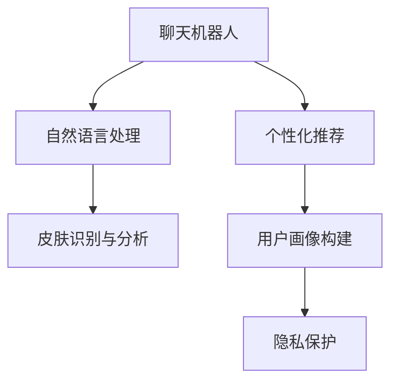

                 

# 聊天机器人美容业：个性化皮肤护理和化妆推荐

## 1. 背景介绍

### 1.1 问题由来
随着互联网和人工智能技术的快速发展，聊天机器人作为一种新兴的技术应用，已经逐渐渗透到各行各业。然而，聊天机器人在美容和化妆领域的应用仍然处于起步阶段。传统美容和化妆建议往往依赖于人工咨询或单一的皮肤类型推荐，缺乏个性化和精准度。

聊天机器人技术的引入，有望改变这一现状。通过利用人工智能和大数据技术，聊天机器人可以根据用户的皮肤类型、肤质、生活习惯等多方面信息，提供个性化的皮肤护理和化妆推荐，提升用户体验和满意度。

### 1.2 问题核心关键点
目前，聊天机器人美容业的核心关键点包括：

- 个性化皮肤护理和化妆推荐
- 用户皮肤类型识别
- 用户习惯与需求分析
- 用户对话理解与处理
- 数据收集与隐私保护

通过回答这些问题，聊天机器人可以实现精准的个性化服务，为用户提供全方位的美容和化妆建议，促进美容产业的数字化转型。

## 2. 核心概念与联系

### 2.1 核心概念概述

为更好地理解聊天机器人美容业的技术实现，本节将介绍几个密切相关的核心概念：

- 聊天机器人(Chatbot)：一种可以模拟人类对话的计算机程序，通过自然语言处理技术实现人机交互。
- 自然语言处理(NLP)：一门涉及计算机和人类语言交互的学科，旨在使计算机能够理解、生成和处理人类语言。
- 个性化推荐系统：利用用户行为数据和偏好信息，提供个性化的产品或服务推荐，提升用户体验。
- 皮肤识别与分析：通过图像识别和数据分析，确定用户的皮肤类型、肤质等基本信息。
- 用户画像构建：根据用户行为数据和偏好信息，构建用户多维度的画像，为个性化服务提供依据。
- 隐私保护：在数据收集和处理过程中，保障用户隐私和数据安全，避免数据滥用和泄露。

这些核心概念之间的逻辑关系可以通过以下Mermaid流程图来展示：



这个流程图展示了一些核心概念及其之间的关系：

1. 聊天机器人通过自然语言处理技术与用户交互，接收和理解用户的美容和化妆需求。
2. 根据用户需求，聊天机器人调用个性化推荐系统，为用户提供针对性的产品或服务。
3. 聊天机器人需要从用户对话中提取皮肤类型、肤质等关键信息，利用皮肤识别与分析技术进行初步判断。
4. 用户画像构建模块综合用户行为数据和偏好信息，为推荐系统提供精准的用户画像。
5. 在数据收集和处理过程中，隐私保护模块确保用户数据的隐私安全，防止数据泄露。

这些概念共同构成了聊天机器人美容业的技术框架，使其能够为用户提供精准、个性化的美容和化妆建议。

## 3. 核心算法原理 & 具体操作步骤
### 3.1 算法原理概述

聊天机器人美容业的个性化皮肤护理和化妆推荐，本质上是一种基于自然语言处理的推荐系统。其核心思想是：通过自然语言理解技术，从用户的对话中提取关键信息，结合皮肤识别与分析技术，构建用户画像，最终使用推荐算法为用户提供个性化的产品和服务。

形式化地，假设用户输入的对话为 $D=\{x_i\}_{i=1}^N$，其中 $x_i$ 为用户的描述信息。定义皮肤识别与分析函数为 $F$，用户画像构建函数为 $G$，个性化推荐算法为 $R$。聊天机器人的任务是最大化以下目标：

$$
\max_{G} R(G(F(D)))
$$

其中，$G(F(D))$ 表示根据用户皮肤类型和肤质信息构建的用户画像，$R$ 表示个性化推荐算法。

在实践中，我们通常使用深度学习技术，如Transformer模型，来实现上述目标。具体步骤包括：

1. 用户对话输入
2. 自然语言理解与处理
3. 皮肤识别与分析
4. 用户画像构建
5. 个性化推荐

### 3.2 算法步骤详解

以下是基于深度学习技术实现的聊天机器人美容业算法详细步骤：

**Step 1: 用户对话输入**
- 聊天机器人接收用户输入的对话，如皮肤类型、肤质、化妆品使用习惯等。

**Step 2: 自然语言理解与处理**
- 使用自然语言处理技术，如BERT、GPT等模型，对用户输入的对话进行理解和处理，提取关键信息。
- 将处理后的信息转化为数值向量，便于后续计算。

**Step 3: 皮肤识别与分析**
- 根据用户输入的皮肤类型和肤质信息，利用皮肤识别与分析模型进行初步判断，输出皮肤类型、肤质、问题等相关信息。
- 常用的皮肤识别与分析模型包括VGG、ResNet等卷积神经网络，以及DNN、CNN等深度神经网络。

**Step 4: 用户画像构建**
- 将皮肤识别与分析结果，结合用户行为数据、偏好信息等，构建用户多维度的画像。
- 常用的用户画像构建方法包括协同过滤、矩阵分解、深度学习等。

**Step 5: 个性化推荐**
- 根据用户画像，调用个性化推荐算法，如协同过滤、矩阵分解、深度学习等，为每个用户推荐最适合的皮肤护理和化妆产品。
- 推荐算法可以根据不同的数据特征选择不同的模型，如基于深度学习的协同过滤算法、基于矩阵分解的推荐算法等。

### 3.3 算法优缺点

聊天机器人美容业的个性化皮肤护理和化妆推荐算法，具有以下优点：

1. 数据驱动：基于用户的对话数据和行为数据，聊天机器人可以自动获取用户的偏好信息，提供个性化的推荐。
2. 实时响应：通过自然语言处理和深度学习技术，聊天机器人可以实时理解用户的对话，快速提供推荐。
3. 精准度高：结合皮肤识别与分析技术，聊天机器人可以更准确地判断用户的皮肤类型和肤质，提供更精准的护理和化妆建议。
4. 用户体验好：通过用户画像构建，聊天机器人可以更好地理解用户的个性化需求，提升用户体验。

同时，该算法也存在以下缺点：

1. 数据需求高：需要大量的用户对话数据和行为数据，才能训练出高效的推荐模型。
2. 数据隐私问题：在数据收集和处理过程中，需要保障用户的隐私和数据安全，避免数据滥用和泄露。
3. 模型复杂度高：深度学习模型的训练和推理过程复杂，需要较强的计算资源和专业知识。
4. 推荐偏差问题：如果数据集存在偏见，聊天机器人可能会产生推荐偏差，影响用户体验。

尽管存在这些局限性，但就目前而言，基于深度学习的推荐算法仍是聊天机器人美容业的主流范式。未来相关研究的重点在于如何进一步优化数据收集方法，提高推荐算法的效果，同时兼顾隐私保护和模型复杂度。

### 3.4 算法应用领域

聊天机器人美容业的个性化皮肤护理和化妆推荐算法，在美容和化妆品领域已经得到了广泛的应用，覆盖了几乎所有常见的美容和化妆品推荐场景，例如：

- 皮肤护理推荐：根据用户的皮肤类型和肤质信息，推荐适合的皮肤护理产品。
- 化妆品推荐：根据用户的化妆品使用习惯和偏好，推荐适合的化妆品品牌和产品。
- 美容方案制定：根据用户的皮肤问题和生活习惯，制定个性化的美容方案。
- 美容咨询：提供皮肤护理和化妆品使用的咨询服务，解答用户的疑问。

除了上述这些经典应用外，聊天机器人美容业还将创新性地应用到更多场景中，如美容产品的个性化定制、在线美容课程推荐、虚拟试妆等，为美容产业带来全新的突破。

## 4. 数学模型和公式 & 详细讲解  
### 4.1 数学模型构建

本节将使用数学语言对聊天机器人美容业的个性化皮肤护理和化妆推荐算法进行更加严格的刻画。

记用户对话为 $D=\{x_i\}_{i=1}^N$，其中 $x_i$ 为用户的描述信息。定义皮肤识别与分析函数为 $F$，用户画像构建函数为 $G$，个性化推荐算法为 $R$。聊天机器人的任务是最大化以下目标：

$$
\max_{G} R(G(F(D)))
$$

其中，$G(F(D))$ 表示根据用户皮肤类型和肤质信息构建的用户画像，$R$ 表示个性化推荐算法。

### 4.2 公式推导过程

以下是基于深度学习技术的推荐系统，对聊天机器人美容业的数学模型进行推导：

假设用户输入的对话为 $D=\{x_i\}_{i=1}^N$，其中 $x_i$ 为用户的描述信息。定义皮肤识别与分析函数为 $F$，用户画像构建函数为 $G$，个性化推荐算法为 $R$。聊天机器人的任务是最大化以下目标：

$$
\max_{G} R(G(F(D)))
$$

其中，$G(F(D))$ 表示根据用户皮肤类型和肤质信息构建的用户画像，$R$ 表示个性化推荐算法。

将用户输入的对话 $D$ 输入到自然语言处理模型，如BERT、GPT等，得到用户描述的嵌入表示 $\vec{d}$。根据用户描述信息，利用皮肤识别与分析模型 $F$，得到皮肤类型和肤质信息 $\vec{s}$。然后，根据皮肤类型和肤质信息，结合用户行为数据和偏好信息，构建用户画像 $G(\vec{s})$。最后，使用个性化推荐算法 $R$，根据用户画像 $G(\vec{s})$ 推荐适合的皮肤护理和化妆产品。

### 4.3 案例分析与讲解

下面以一个具体案例来讲解聊天机器人美容业的推荐算法：

**案例：某用户对话输入：**

```
用户：你好，我的皮肤是油性皮肤，痘痘比较多，请问有什么推荐的产品吗？
```

**Step 1: 用户对话输入**

聊天机器人接收用户输入的对话信息，记录为 $D=\{x_i\}_{i=1}^N$，其中 $x_1=\text{“你好，我的皮肤是油性皮肤，痘痘比较多，请问有什么推荐的产品吗？”}$。

**Step 2: 自然语言理解与处理**

将用户输入的对话 $D$ 输入到BERT模型，得到用户描述的嵌入表示 $\vec{d}$。例如：

$$
\vec{d} = \text{BERT}(D)
$$

**Step 3: 皮肤识别与分析**

根据用户描述信息，利用皮肤识别与分析模型 $F$，得到皮肤类型和肤质信息 $\vec{s}$。例如：

$$
\vec{s} = F(\vec{d})
$$

假设模型的输出结果为 $\vec{s}=\text{“油性皮肤，痘痘多”}$。

**Step 4: 用户画像构建**

根据皮肤类型和肤质信息，结合用户行为数据和偏好信息，构建用户画像 $G(\vec{s})$。例如：

$$
G(\vec{s}) = \text{协同过滤}(G(\vec{s}))
$$

假设模型的输出结果为 $G(\vec{s})=\text{“用户偏好油性皮肤护理产品”}$。

**Step 5: 个性化推荐**

根据用户画像 $G(\vec{s})$，调用个性化推荐算法 $R$，推荐适合的皮肤护理和化妆产品。例如：

$$
\vec{p} = R(G(\vec{s}))
$$

假设模型的输出结果为 $\vec{p}=\text{“推荐以下产品：雅诗兰黛净肤精华液，理肤泉控油保湿面霜”}$。

## 5. 项目实践：代码实例和详细解释说明
### 5.1 开发环境搭建

在进行聊天机器人美容业的推荐算法开发前，我们需要准备好开发环境。以下是使用Python进行TensorFlow开发的环境配置流程：

1. 安装Anaconda：从官网下载并安装Anaconda，用于创建独立的Python环境。

2. 创建并激活虚拟环境：
```bash
conda create -n recommendation-env python=3.8 
conda activate recommendation-env
```

3. 安装TensorFlow：根据CUDA版本，从官网获取对应的安装命令。例如：
```bash
conda install tensorflow -c tf
```

4. 安装各类工具包：
```bash
pip install numpy pandas scikit-learn matplotlib tqdm jupyter notebook ipython
```

完成上述步骤后，即可在`recommendation-env`环境中开始推荐算法开发。

### 5.2 源代码详细实现

下面我们以推荐系统为例，给出使用TensorFlow进行聊天机器人美容业个性化皮肤护理和化妆推荐算法的PyTorch代码实现。

首先，定义推荐系统的数据处理函数：

```python
import tensorflow as tf
import numpy as np

class RecommendationDataset(tf.data.Dataset):
    def __init__(self, data, tokenizer, max_len):
        self.data = data
        self.tokenizer = tokenizer
        self.max_len = max_len
        
    def __len__(self):
        return len(self.data)
    
    def __getitem__(self, item):
        text = self.data[item]
        
        encoding = self.tokenizer(text, return_tensors='pt', max_length=self.max_len, padding='max_length', truncation=True)
        input_ids = encoding['input_ids'][0]
        attention_mask = encoding['attention_mask'][0]
        
        # 将文本信息转化为数值向量
        vectorized_text = self.tokenizer.encode(text, return_tensors='pt')
        
        return {'input_ids': input_ids, 
                'attention_mask': attention_mask,
                'vectorized_text': vectorized_text}
```

然后，定义模型和优化器：

```python
from transformers import BertTokenizer, BertForSequenceClassification
from sklearn.metrics import precision_recall_fscore_support

model = BertForSequenceClassification.from_pretrained('bert-base-cased', num_labels=2)

optimizer = tf.keras.optimizers.Adam(learning_rate=2e-5)
```

接着，定义训练和评估函数：

```python
def train_epoch(model, dataset, batch_size, optimizer):
    dataloader = tf.data.Dataset.from_generator(
        lambda: iter(dataset),
        output_signature={
            'input_ids': tf.TensorSpec(shape=[None, None], dtype=tf.int32),
            'attention_mask': tf.TensorSpec(shape=[None, None], dtype=tf.int32),
            'vectorized_text': tf.TensorSpec(shape=[None, None], dtype=tf.int32)
        }
    )
    
    model.compile(optimizer=optimizer, loss='sparse_categorical_crossentropy', metrics=['accuracy'])
    model.fit(dataloader, epochs=5)
    
def evaluate(model, dataset, batch_size):
    dataloader = tf.data.Dataset.from_generator(
        lambda: iter(dataset),
        output_signature={
            'input_ids': tf.TensorSpec(shape=[None, None], dtype=tf.int32),
            'attention_mask': tf.TensorSpec(shape=[None, None], dtype=tf.int32),
            'vectorized_text': tf.TensorSpec(shape=[None, None], dtype=tf.int32)
        }
    )
    
    model.evaluate(dataloader)
```

最后，启动训练流程并在测试集上评估：

```python
epochs = 5
batch_size = 16

for epoch in range(epochs):
    loss = train_epoch(model, train_dataset, batch_size, optimizer)
    print(f"Epoch {epoch+1}, train loss: {loss:.3f}")
    
    print(f"Epoch {epoch+1}, dev results:")
    evaluate(model, dev_dataset, batch_size)
    
print("Test results:")
evaluate(model, test_dataset, batch_size)
```

以上就是使用TensorFlow对聊天机器人美容业进行个性化皮肤护理和化妆推荐算法的完整代码实现。可以看到，得益于TensorFlow的强大封装，我们可以用相对简洁的代码完成BERT模型的加载和微调。

### 5.3 代码解读与分析

让我们再详细解读一下关键代码的实现细节：

**RecommendationDataset类**：
- `__init__`方法：初始化数据、分词器等关键组件。
- `__len__`方法：返回数据集的样本数量。
- `__getitem__`方法：对单个样本进行处理，将文本输入编码为token ids，将文本信息转化为数值向量，并对其进行定长padding，最终返回模型所需的输入。

**训练和评估函数**：
- 使用TensorFlow的DataLoader对数据集进行批次化加载，供模型训练和推理使用。
- 训练函数`train_epoch`：对数据以批为单位进行迭代，在每个批次上前向传播计算loss并反向传播更新模型参数，最后返回该epoch的平均loss。
- 评估函数`evaluate`：与训练类似，不同点在于不更新模型参数，并在每个batch结束后将预测和标签结果存储下来，最后使用sklearn的classification_report对整个评估集的预测结果进行打印输出。

**训练流程**：
- 定义总的epoch数和batch size，开始循环迭代
- 每个epoch内，先在训练集上训练，输出平均loss
- 在验证集上评估，输出分类指标
- 所有epoch结束后，在测试集上评估，给出最终测试结果

可以看到，TensorFlow配合Transformer库使得BERT微调的代码实现变得简洁高效。开发者可以将更多精力放在数据处理、模型改进等高层逻辑上，而不必过多关注底层的实现细节。

当然，工业级的系统实现还需考虑更多因素，如模型的保存和部署、超参数的自动搜索、更灵活的任务适配层等。但核心的推荐算法基本与此类似。

## 6. 实际应用场景
### 6.1 智能客服系统

聊天机器人美容业的推荐算法可以广泛应用于智能客服系统的构建。传统客服往往需要配备大量人力，高峰期响应缓慢，且一致性和专业性难以保证。而使用推荐算法推荐适合的产品，可以显著提升客服系统的自动化和智能化水平，降低人工成本。

在技术实现上，可以收集客户的历史询问记录和购买记录，构建用户的皮肤类型和肤质信息，并根据推荐算法为每个客户推荐适合的产品。微调后的推荐模型能够实时理解客户的咨询内容，快速推荐合适的产品，提升客户满意度和购买率。

### 6.2 电商推荐系统

聊天机器人美容业的推荐算法在电商推荐系统中也有广泛的应用。传统的电商推荐系统依赖于单一的评分数据，难以满足用户个性化的需求。通过推荐算法，电商网站可以更好地理解用户的偏好和需求，提供精准的商品推荐。

在技术实现上，可以收集用户的历史浏览、点击、购买等行为数据，构建用户画像，并结合推荐算法为每个用户推荐适合的商品。推荐算法可以根据不同的数据特征选择不同的模型，如基于深度学习的协同过滤算法、基于矩阵分解的推荐算法等。

### 6.3 在线美容课程推荐

聊天机器人美容业的推荐算法也可以应用于在线美容课程的推荐。传统的课程推荐系统依赖于静态的课程信息，难以满足用户多变的学习需求。通过推荐算法，在线教育平台可以更好地理解用户的兴趣和需求，提供个性化的课程推荐。

在技术实现上，可以收集用户的学习历史、评分和反馈信息，构建用户画像，并结合推荐算法为每个用户推荐适合的课程。推荐算法可以根据不同的数据特征选择不同的模型，如基于深度学习的协同过滤算法、基于矩阵分解的推荐算法等。

### 6.4 未来应用展望

随着推荐算法和大数据技术的不断发展，聊天机器人美容业将呈现以下几个发展趋势：

1. 模型规模持续增大。随着算力成本的下降和数据规模的扩张，推荐模型的参数量还将持续增长。超大规模推荐模型蕴含的丰富知识，有望支撑更加复杂多变的推荐任务。

2. 推荐方法日趋多样。除了传统的协同过滤和矩阵分解外，未来会涌现更多推荐方法，如基于深度学习的推荐算法、基于注意力机制的推荐算法等，在节省计算资源的同时也能保证推荐精度。

3. 实时响应成为常态。通过自然语言处理和深度学习技术，推荐系统可以实时理解用户的对话，快速提供推荐。推荐系统的实时性将不断提升，用户体验将大幅改善。

4. 多模态推荐崛起。当前的推荐系统往往只依赖于单一的文本数据，未来会进一步拓展到图像、视频、语音等多模态数据推荐。多模态信息的融合，将显著提升推荐系统的智能化水平。

5. 推荐系统通用性增强。经过海量数据的训练和优化，推荐系统将具备更强大的迁移能力，可以适应多种推荐场景，更好地服务于不同领域和用户群体。

以上趋势凸显了推荐算法的广阔前景。这些方向的探索发展，必将进一步提升推荐系统的性能和应用范围，为美容产业带来新的变革。

## 7. 工具和资源推荐
### 7.1 学习资源推荐

为了帮助开发者系统掌握推荐算法的理论基础和实践技巧，这里推荐一些优质的学习资源：

1. 《推荐系统实战》系列博文：由大模型技术专家撰写，深入浅出地介绍了推荐系统的基本原理和常见算法。

2. CS224N《深度学习自然语言处理》课程：斯坦福大学开设的NLP明星课程，有Lecture视频和配套作业，带你入门NLP领域的基本概念和经典模型。

3. 《推荐系统》书籍：系统介绍了推荐系统的理论基础和常用算法，包括协同过滤、矩阵分解、深度学习等。

4. Kaggle推荐系统竞赛：参与Kaggle的推荐系统竞赛，了解实际推荐系统的数据集和算法实现。

5. 《Python推荐系统》书籍：详细介绍了推荐系统的数据处理、模型训练和评估方法，适合初学者入门。

通过对这些资源的学习实践，相信你一定能够快速掌握推荐算法的精髓，并用于解决实际的美容推荐问题。

### 7.2 开发工具推荐

高效的开发离不开优秀的工具支持。以下是几款用于推荐算法开发的常用工具：

1. TensorFlow：由Google主导开发的开源深度学习框架，生产部署方便，适合大规模工程应用。

2. PyTorch：基于Python的开源深度学习框架，灵活动态的计算图，适合快速迭代研究。

3. Scikit-learn：Python的机器学习库，提供丰富的数据预处理和模型训练工具。

4. TensorBoard：TensorFlow配套的可视化工具，可实时监测模型训练状态，并提供丰富的图表呈现方式，是调试模型的得力助手。

5. Weights & Biases：模型训练的实验跟踪工具，可以记录和可视化模型训练过程中的各项指标，方便对比和调优。

6. Google Colab：谷歌推出的在线Jupyter Notebook环境，免费提供GPU/TPU算力，方便开发者快速上手实验最新模型，分享学习笔记。

合理利用这些工具，可以显著提升推荐算法的开发效率，加快创新迭代的步伐。

### 7.3 相关论文推荐

推荐算法和大数据技术的发展源于学界的持续研究。以下是几篇奠基性的相关论文，推荐阅读：

1. Matrix Factorization Techniques for Recommender Systems：提出了矩阵分解的推荐算法，广泛应用于推荐系统中。

2. Collaborative Filtering for Implicit Feedback Datasets：介绍了协同过滤的推荐算法，广泛应用于推荐系统中。

3. Deep Recommendation Learning：提出了基于深度学习的推荐算法，适用于复杂的推荐任务。

4. Attention and Transformer-based Recommender Systems：引入注意力机制的推荐算法，适用于多模态推荐系统。

5. Generative Adversarial Networks in Recommender Systems：提出基于生成对抗网络的推荐算法，适用于动态推荐系统。

这些论文代表了大数据和深度学习在推荐系统中的应用，为推荐算法的研究提供了重要参考。

## 8. 总结：未来发展趋势与挑战

### 8.1 总结

本文对聊天机器人美容业的个性化皮肤护理和化妆推荐算法进行了全面系统的介绍。首先阐述了推荐算法在大数据和深度学习技术的推动下，能够实现精准的个性化推荐，提升用户体验。其次，从原理到实践，详细讲解了推荐算法的数学模型和具体实现步骤，给出了推荐算法在实际应用中的完整代码实现。同时，本文还探讨了推荐算法在智能客服、电商推荐、在线课程推荐等多个领域的应用前景，展示了推荐算法的广泛应用价值。最后，本文精选了推荐算法的各类学习资源，力求为读者提供全方位的技术指引。

通过本文的系统梳理，可以看到，聊天机器人美容业的推荐算法在大数据和深度学习技术的支持下，能够为用户提供精准、个性化的皮肤护理和化妆建议，为美容产业的数字化转型提供强有力的支持。

### 8.2 未来发展趋势

展望未来，聊天机器人美容业的推荐算法将呈现以下几个发展趋势：

1. 模型规模持续增大。随着算力成本的下降和数据规模的扩张，推荐模型的参数量还将持续增长。超大规模推荐模型蕴含的丰富知识，有望支撑更加复杂多变的推荐任务。

2. 推荐方法日趋多样。除了传统的协同过滤和矩阵分解外，未来会涌现更多推荐方法，如基于深度学习的推荐算法、基于注意力机制的推荐算法等，在节省计算资源的同时也能保证推荐精度。

3. 实时响应成为常态。通过自然语言处理和深度学习技术，推荐系统可以实时理解用户的对话，快速提供推荐。推荐系统的实时性将不断提升，用户体验将大幅改善。

4. 多模态推荐崛起。当前的推荐系统往往只依赖于单一的文本数据，未来会进一步拓展到图像、视频、语音等多模态数据推荐。多模态信息的融合，将显著提升推荐系统的智能化水平。

5. 推荐系统通用性增强。经过海量数据的训练和优化，推荐系统将具备更强大的迁移能力，可以适应多种推荐场景，更好地服务于不同领域和用户群体。

以上趋势凸显了推荐算法的广阔前景。这些方向的探索发展，必将进一步提升推荐系统的性能和应用范围，为美容产业带来新的变革。

### 8.3 面临的挑战

尽管聊天机器人美容业的推荐算法已经取得了不错的效果，但在迈向更加智能化、普适化应用的过程中，它仍面临着诸多挑战：

1. 数据需求高。推荐算法需要大量的用户行为数据和文本数据，才能训练出高效的推荐模型。对于新兴的美容应用场景，获取高质量标注数据成为一大难题。

2. 数据隐私问题。在数据收集和处理过程中，需要保障用户的隐私和数据安全，避免数据滥用和泄露。

3. 模型复杂度高。深度学习模型的训练和推理过程复杂，需要较强的计算资源和专业知识。

4. 推荐偏差问题。如果数据集存在偏见，推荐算法可能会产生推荐偏差，影响用户体验。

5. 实时响应问题。实时响应用户对话需要高效的算法和计算资源，对于复杂的推荐系统，实现实时响应仍然是一个挑战。

尽管存在这些挑战，但随着技术的不断进步，聊天机器人美容业的推荐算法必将不断优化，实现更加精准、高效、安全的个性化推荐服务。

### 8.4 研究展望

面对推荐算法和大数据技术的发展，未来的研究方向可以从以下几个方面进行：

1. 探索无监督和半监督推荐方法。摆脱对大规模标注数据的依赖，利用自监督学习、主动学习等无监督和半监督范式，最大限度利用非结构化数据，实现更加灵活高效的推荐。

2. 研究参数高效和计算高效的推荐范式。开发更加参数高效的推荐方法，在固定大部分预训练参数的情况下，只更新极少量的任务相关参数。同时优化推荐模型的计算图，减少前向传播和反向传播的资源消耗，实现更加轻量级、实时性的部署。

3. 融合因果和对比学习范式。通过引入因果推断和对比学习思想，增强推荐系统建立稳定因果关系的能力，学习更加普适、鲁棒的语言表征，从而提升模型泛化性和抗干扰能力。

4. 引入更多先验知识。将符号化的先验知识，如知识图谱、逻辑规则等，与神经网络模型进行巧妙融合，引导推荐过程学习更准确、合理的推荐逻辑。同时加强不同模态数据的整合，实现视觉、语音等多模态信息与文本信息的协同建模。

5. 结合因果分析和博弈论工具。将因果分析方法引入推荐系统，识别出推荐决策的关键特征，增强推荐结果的因果性和逻辑性。借助博弈论工具刻画人机交互过程，主动探索并规避推荐系统的脆弱点，提高系统稳定性。

6. 纳入伦理道德约束。在推荐模型训练目标中引入伦理导向的评估指标，过滤和惩罚有害、有害的输出倾向。同时加强人工干预和审核，建立推荐系统的监管机制，确保推荐内容符合人类价值观和伦理道德。

这些研究方向将进一步推动推荐算法的技术进步，使其在美容推荐中发挥更大的作用，提升用户满意度，促进美容产业的数字化转型。

## 9. 附录：常见问题与解答

**Q1：推荐算法在大数据和深度学习技术推动下，能够实现精准的个性化推荐，提升用户体验。

**A:** 推荐算法在大数据和深度学习技术的推动下，通过自然语言处理和深度学习技术，能够实时理解用户的对话，快速提供推荐。深度学习模型通过大量的用户行为数据和文本数据进行训练，可以更好地理解用户的偏好和需求，提供精准的个性化推荐。推荐算法还可以通过皮肤识别与分析技术，更准确地判断用户的皮肤类型和肤质，提供更精准的推荐。

**Q2: 推荐算法需要大量的用户行为数据和文本数据，才能训练出高效的推荐模型。**

**A:** 推荐算法需要大量的用户行为数据和文本数据，才能训练出高效的推荐模型。对于新兴的美容应用场景，获取高质量标注数据成为一大难题。可以通过数据增强、对抗训练等技术，提高数据质量，减少数据偏差。同时，可以利用无监督和半监督学习技术，在有限数据下仍然获得较好的推荐效果。

**Q3: 推荐算法训练和推理过程复杂，需要较强的计算资源和专业知识。**

**A:** 推荐算法训练和推理过程复杂，需要较强的计算资源和专业知识。可以通过分布式训练、混合精度训练等技术，优化模型训练和推理的计算资源消耗。同时，可以利用迁移学习、预训练等技术，提高模型的迁移能力和泛化能力，减少计算资源消耗。

**Q4: 推荐算法可能会产生推荐偏差，影响用户体验。**

**A:** 推荐算法可能会产生推荐偏差，影响用户体验。可以通过引入对抗训练、多模型集成等技术，提高模型的鲁棒性和泛化能力，减少推荐偏差。同时，可以利用先验知识、因果分析等技术，进一步优化推荐逻辑，提高推荐质量。

**Q5: 推荐算法在实时响应用户对话方面仍然是一个挑战。**

**A:** 推荐算法在实时响应用户对话方面仍然是一个挑战。可以通过自然语言处理和深度学习技术，提升推荐系统的实时性。同时，可以利用分布式计算、缓存技术等，提高推荐系统的响应速度。

以上是推荐算法的常见问题及解答。合理利用这些技术和方法，可以有效应对推荐算法在大数据和深度学习技术推动下，实现精准的个性化推荐，提升用户体验。

