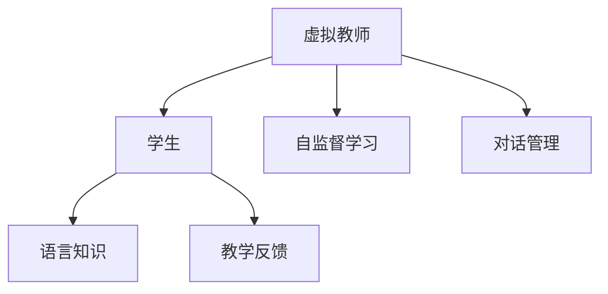

                 

# 聊天机器人语言学习：虚拟教师

## 1. 背景介绍

### 1.1 问题由来

随着人工智能技术的快速发展，聊天机器人(Robotics)已经成为智能服务领域的重要工具。传统的聊天机器人依赖规则或模板进行文本生成，面对复杂场景时表现不佳，难以应对用户个性化需求。而基于语言模型的聊天机器人，通过学习海量的文本数据，能够自然流畅地生成对话，提升了用户体验和交互质量。

### 1.2 问题核心关键点

现代聊天机器人基于预训练语言模型进行对话生成。以GPT-3为代表的预训练大模型，具备强大的自然语言理解和生成能力，能够通过微调适应各种具体任务。但由于预训练模型参数量巨大，微调成本高，且需要大量标注数据，限制了其在实际场景中的应用。

为降低微调成本，提升微调效果，近年来研究人员探索了以虚拟教师为框架的语言学习范式。虚拟教师通过引导学生（聊天机器人）进行自监督学习，不断提升对话生成能力。具体来说，虚拟教师通过设计复杂的语言任务，对聊天机器人进行细粒度训练，使其逐步掌握语言知识，提升对话的流畅性和准确性。

### 1.3 问题研究意义

虚拟教师范式通过虚拟教师和学生之间的交互式对话，使学生（聊天机器人）能够快速、高效地学习语言知识。这种范式具有以下优点：
- 学习效率高：虚拟教师能够自适应地设计任务，引导学生逐步掌握新知识。
- 个性化学习：通过不断对话反馈，虚拟教师能针对学生的学习情况进行个性化指导。
- 通用性强：虚拟教师可以广泛应用于多种NLP任务，如问答、对话、摘要等，适应性强。
- 可扩展性好：随着虚拟教师设计的任务和难度不断提高，学生的知识储备和技能水平也会不断提升。

虚拟教师范式为聊天机器人语言学习开辟了新的道路，极大地提升了NLP技术在实际应用中的落地性和可操作性。

## 2. 核心概念与联系

### 2.1 核心概念概述

为更好地理解虚拟教师语言学习范式，本节将介绍几个密切相关的核心概念：

- 虚拟教师（Virtual Teacher）：一个基于语言模型设计的教学AI，能够通过对话引导学生学习语言知识。
- 学生（Student）：代表对话生成模型的聊天机器人，通过与虚拟教师的对话，逐步提升对话生成能力。
- 自监督学习（Self-Supervised Learning）：指无需标注数据，通过模型自身的输出和预测来指导模型学习的过程。
- 语言知识（Language Knowledge）：指学生通过学习获得的语言表征、语言规则、对话策略等知识。
- 教学反馈（Teaching Feedback）：虚拟教师根据学生的输出，给出有针对性的指导和纠正，以帮助学生学习新知识。
- 对话管理（Dialogue Management）：指虚拟教师设计和管理与学生之间的对话过程，确保对话的有序进行和知识传递。

这些核心概念之间的逻辑关系可以通过以下Mermaid流程图来展示：



这个流程图展示了一系列概念之间的联系：

1. 虚拟教师通过对话管理与学生交互，进行自监督学习。
2. 学生通过对话生成输出，虚拟教师根据其输出提供教学反馈，引导学生学习语言知识。
3. 学生逐步掌握语言知识，提升对话生成能力。
4. 通过不断循环，学生语言知识不断丰富，对话质量不断提高。

## 3. 核心算法原理 & 具体操作步骤
### 3.1 算法原理概述

虚拟教师语言学习范式本质上是一个基于自监督学习的迭代过程。其核心思想是：通过虚拟教师与学生之间的对话，虚拟教师引导学生进行自监督学习，逐步掌握语言知识，提升对话生成能力。

形式化地，假设虚拟教师为 $T_{\theta}$，学生为 $S_{\theta}$。虚拟教师的目标是通过对话设计，对学生进行语言学习训练，使其输出 $y$ 满足：

$$
\theta^* = \mathop{\arg\min}_{\theta} \mathcal{L}(T_{\theta}, S_{\theta}, y)
$$

其中 $\mathcal{L}$ 为虚拟教师的损失函数，用于衡量虚拟教师的输出和学生的输出之间的差异。常见的损失函数包括交叉熵损失、均方误差损失等。

通过梯度下降等优化算法，虚拟教师不断更新参数 $\theta$，最小化损失函数 $\mathcal{L}$，使得学生的对话生成能力不断提高，最终达到理想的目标。

### 3.2 算法步骤详解

虚拟教师语言学习范式一般包括以下几个关键步骤：

**Step 1: 准备教学任务**
- 设计复杂语言任务，如问答、对话生成、文本摘要等，作为虚拟教师与学生之间的对话内容。
- 将任务分解为多个子任务，设计合适的学习目标，确保学生逐步掌握新知识。

**Step 2: 设置虚拟教师**
- 选择一个预训练语言模型作为虚拟教师，如GPT-3、BERT等。
- 根据任务设计虚拟教师的任务适配层，并设定合适的初始参数。

**Step 3: 学生初始化**
- 初始化一个基于语言模型的聊天机器人作为学生，如GPT-2、RoBERTa等。
- 设置学生的初始对话生成策略，如随机选择模板、基于上下文生成等。

**Step 4: 执行教学循环**
- 虚拟教师设计对话内容，生成引导学生学习的问题或任务。
- 学生接收虚拟教师的任务，根据自身知识生成回答或执行任务。
- 虚拟教师根据学生的输出，提供有针对性的教学反馈，指出错误或给出指导。
- 学生根据虚拟教师的反馈，不断调整对话生成策略，逐步提升对话能力。

**Step 5: 循环迭代**
- 重复执行步骤4，直至虚拟教师认为学生已经掌握了相应的语言知识。
- 通过不断的教学循环，学生不断积累语言知识，提升对话生成能力。

### 3.3 算法优缺点

虚拟教师语言学习范式具有以下优点：
1. 学习效率高：虚拟教师能够自适应地设计任务，引导学生逐步掌握新知识。
2. 个性化学习：虚拟教师能够根据学生的输出，提供个性化的指导和纠正，提升学习效果。
3. 通用性强：虚拟教师可以应用于各种NLP任务，如问答、对话、摘要等，适应性强。
4. 可扩展性好：随着虚拟教师设计的任务和难度不断提高，学生的知识储备和技能水平也会不断提升。

同时，该方法也存在一定的局限性：
1. 依赖高质量教学任务：虚拟教师需要设计高质量的教学任务，才能提升学生的学习效果。
2. 对教师知识要求高：虚拟教师需要具备丰富的语言知识和教学经验，才能有效地引导学生学习。
3. 技术难度大：虚拟教师的设计和训练需要复杂的算法和大量的计算资源。
4. 教学过程复杂：虚拟教师需要根据学生的反馈不断调整对话内容，教学过程复杂且耗时。

尽管存在这些局限性，但就目前而言，虚拟教师语言学习范式仍是大语言模型应用的重要方向。未来相关研究的重点在于如何进一步降低教师设计任务的难度，提升教学过程的自动化水平，同时兼顾可解释性和教学效果等因素。

### 3.4 算法应用领域

虚拟教师语言学习范式已经在多种NLP任务上得到了应用，例如：

- 问答系统：虚拟教师设计问答任务，引导学生生成准确的回答。
- 对话系统：虚拟教师与学生进行对话，提升学生对话生成能力和对话策略。
- 摘要生成：虚拟教师设计摘要任务，引导学生学习如何提取关键信息并生成精炼的摘要。
- 情感分析：虚拟教师设计情感分类任务，指导学生学习情感识别的语言模型。
- 机器翻译：虚拟教师设计翻译任务，引导学生学习语言的语义对应关系。

除了上述这些经典任务外，虚拟教师语言学习范式也被创新性地应用到更多场景中，如可控文本生成、常识推理、代码生成、数据增强等，为NLP技术带来了全新的突破。

## 4. 数学模型和公式 & 详细讲解  
### 4.1 数学模型构建

本节将使用数学语言对虚拟教师语言学习过程进行更加严格的刻画。

记虚拟教师为 $T_{\theta}$，学生为 $S_{\theta}$。假设教学任务为 $T=\{t_i\}_{i=1}^N$，每个任务 $t_i$ 对应一个语言目标 $\tau_i$。虚拟教师的目标是通过对话设计，对学生进行语言学习训练，使得学生输出 $y$ 满足：

$$
\theta^* = \mathop{\arg\min}_{\theta} \mathcal{L}(T_{\theta}, S_{\theta}, \tau)
$$

其中 $\mathcal{L}$ 为虚拟教师的损失函数，用于衡量虚拟教师的输出和学生的输出之间的差异。常见的损失函数包括交叉熵损失、均方误差损失等。

在具体实践中，虚拟教师与学生之间的对话可以表示为：

$$
y = T_{\theta}(s) + \epsilon
$$

其中 $s$ 为学生根据对话上下文生成的回答，$\epsilon$ 为噪声项。

### 4.2 公式推导过程

以下我们以问答系统为例，推导虚拟教师的损失函数及其梯度的计算公式。

假设虚拟教师的任务为给定问题和答案对，判断答案的正确性。设问题为 $q_i$，答案为 $a_i$。虚拟教师生成的引导问题为 $t_i$，学生的回答为 $s$。虚拟教师根据学生回答输出 $y$ 的正确性，并定义交叉熵损失函数为：

$$
\ell(T_{\theta}(q_i), s) = -[y\log T_{\theta}(q_i) + (1-y)\log(1-T_{\theta}(q_i))]
$$

将其代入经验风险公式，得：

$$
\mathcal{L}(\theta) = -\frac{1}{N}\sum_{i=1}^N \ell(T_{\theta}(q_i), s)
$$

根据链式法则，损失函数对参数 $\theta$ 的梯度为：

$$
\frac{\partial \mathcal{L}(\theta)}{\partial \theta} = -\frac{1}{N}\sum_{i=1}^N (\frac{y_i}{T_{\theta}(q_i)}-\frac{1-y_i}{1-T_{\theta}(q_i)}) \frac{\partial T_{\theta}(q_i)}{\partial \theta}
$$

其中 $\frac{\partial T_{\theta}(q_i)}{\partial \theta}$ 可进一步递归展开，利用自动微分技术完成计算。

在得到损失函数的梯度后，即可带入参数更新公式，完成虚拟教师的迭代优化。重复上述过程直至收敛，最终得到适应教学任务的最优参数 $\theta^*$。

## 5. 项目实践：代码实例和详细解释说明
### 5.1 开发环境搭建

在进行虚拟教师语言学习实践前，我们需要准备好开发环境。以下是使用Python进行PyTorch开发的环境配置流程：

1. 安装Anaconda：从官网下载并安装Anaconda，用于创建独立的Python环境。

2. 创建并激活虚拟环境：
```bash
conda create -n pytorch-env python=3.8 
conda activate pytorch-env
```

3. 安装PyTorch：根据CUDA版本，从官网获取对应的安装命令。例如：
```bash
conda install pytorch torchvision torchaudio cudatoolkit=11.1 -c pytorch -c conda-forge
```

4. 安装Transformers库：
```bash
pip install transformers
```

5. 安装各类工具包：
```bash
pip install numpy pandas scikit-learn matplotlib tqdm jupyter notebook ipython
```

完成上述步骤后，即可在`pytorch-env`环境中开始虚拟教师语言学习实践。

### 5.2 源代码详细实现

下面我以虚拟教师设计问答系统为例，给出使用Transformers库进行训练的PyTorch代码实现。

首先，定义问答系统的数据处理函数：

```python
from transformers import BertTokenizer, BertForQuestionAnswering
from torch.utils.data import Dataset
import torch

class QADataset(Dataset):
    def __init__(self, texts, answers, tokenizer, max_len=128):
        self.texts = texts
        self.answers = answers
        self.tokenizer = tokenizer
        self.max_len = max_len
        
    def __len__(self):
        return len(self.texts)
    
    def __getitem__(self, item):
        text = self.texts[item]
        answer = self.answers[item]
        
        encoding = self.tokenizer(text, return_tensors='pt', max_length=self.max_len, padding='max_length', truncation=True)
        input_ids = encoding['input_ids'][0]
        attention_mask = encoding['attention_mask'][0]
        start_pos = torch.tensor([self.tokenizer.convert_tokens_to_ids(answer)])[0]
        end_pos = start_pos + len(answer) - 1
        
        return {'input_ids': input_ids, 
                'attention_mask': attention_mask,
                'start_pos': start_pos,
                'end_pos': end_pos}
```

然后，定义虚拟教师和学生模型：

```python
from transformers import BertForQuestionAnswering, BertTokenizer

teacher = BertForQuestionAnswering.from_pretrained('bert-base-cased')
student = BertForQuestionAnswering.from_pretrained('bert-base-cased')

tokenizer = BertTokenizer.from_pretrained('bert-base-cased')

```

接着，定义虚拟教师的优化器和训练函数：

```python
from transformers import AdamW
import torch.nn.functional as F

optimizer = AdamW(teacher.parameters(), lr=2e-5)

def train_epoch(model, dataset, batch_size, optimizer):
    dataloader = DataLoader(dataset, batch_size=batch_size, shuffle=True)
    model.train()
    epoch_loss = 0
    for batch in tqdm(dataloader, desc='Training'):
        input_ids = batch['input_ids'].to(device)
        attention_mask = batch['attention_mask'].to(device)
        start_pos = batch['start_pos'].to(device)
        end_pos = batch['end_pos'].to(device)
        logits = model(input_ids, attention_mask=attention_mask, start_position=start_pos, end_position=end_pos)
        loss = F.cross_entropy(logits.view(-1, logits.size(-1)), start_pos)
        epoch_loss += loss.item()
        loss.backward()
        optimizer.step()
    return epoch_loss / len(dataloader)
```

最后，启动训练流程：

```python
epochs = 5
batch_size = 16

for epoch in range(epochs):
    loss = train_epoch(teacher, train_dataset, batch_size, optimizer)
    print(f"Epoch {epoch+1}, train loss: {loss:.3f}")
```

以上就是使用PyTorch对虚拟教师进行问答系统微调的完整代码实现。可以看到，得益于Transformers库的强大封装，我们可以用相对简洁的代码完成虚拟教师的训练。

### 5.3 代码解读与分析

让我们再详细解读一下关键代码的实现细节：

**QADataset类**：
- `__init__`方法：初始化文本、答案、分词器等关键组件。
- `__len__`方法：返回数据集的样本数量。
- `__getitem__`方法：对单个样本进行处理，将文本输入编码为token ids，将答案转换为开始和结束位置，并对其进行定长padding，最终返回模型所需的输入。

**teacher和student模型**：
- 定义虚拟教师和学生的BERT模型，并使用相同的分词器进行初始化。

**train_epoch函数**：
- 使用PyTorch的DataLoader对数据集进行批次化加载，供虚拟教师训练使用。
- 虚拟教师在训练过程中，每次前向传播计算loss并反向传播更新模型参数，最后返回该epoch的平均loss。

**训练流程**：
- 定义总的epoch数和batch size，开始循环迭代
- 每个epoch内，先在训练集上训练，输出平均loss
- 重复上述过程直至收敛

可以看到，PyTorch配合Transformers库使得虚拟教师训练的代码实现变得简洁高效。开发者可以将更多精力放在数据处理、模型改进等高层逻辑上，而不必过多关注底层的实现细节。

当然，工业级的系统实现还需考虑更多因素，如模型的保存和部署、超参数的自动搜索、更灵活的任务适配层等。但核心的微调范式基本与此类似。

## 6. 实际应用场景
### 6.1 智能客服系统

虚拟教师范式可以广泛应用于智能客服系统的构建。传统的客服系统依赖人工客服，效率低、成本高，无法提供全天候服务。而基于虚拟教师的智能客服系统，可以7x24小时不间断服务，快速响应客户咨询，提升用户体验和满意度。

在技术实现上，可以收集企业内部的历史客服对话记录，将问题和最佳答复构建成监督数据，在此基础上对虚拟教师进行训练。训练后的虚拟教师能够自动理解用户意图，匹配最合适的答案模板进行回复。对于客户提出的新问题，还可以接入检索系统实时搜索相关内容，动态组织生成回答。如此构建的智能客服系统，能大幅提升客户咨询体验和问题解决效率。

### 6.2 教育培训系统

虚拟教师范式可以为教育培训系统提供个性化的学习体验。传统的教育培训依赖老师的讲授，无法满足学生个性化的学习需求。而基于虚拟教师的培训系统，可以根据学生的学习情况和反馈，自适应地调整教学内容和难度，提供个性化的学习建议和辅导。

在技术实现上，可以收集学生的学习数据，设计复杂的语言任务，训练虚拟教师。虚拟教师通过对话引导学生学习新知识，提供即时反馈和指导。学生可以根据虚拟教师的建议，调整学习策略和计划，逐步提升学习效果。如此构建的教育培训系统，能大幅提高学习效率和学习质量，为学生的全面发展提供有力支持。

### 6.3 医疗咨询系统

虚拟教师范式可以应用于医疗咨询系统的构建。传统的医疗咨询依赖医生的经验，无法提供全方位的健康指导。而基于虚拟教师的医疗咨询系统，可以实时获取患者健康数据，进行初步的健康分析和诊断，提供个性化的健康建议和治疗方案。

在技术实现上，可以收集患者的健康数据，设计复杂的语言任务，训练虚拟教师。虚拟教师通过对话引导患者进行健康自查和健康管理，提供即时反馈和指导。患者可以根据虚拟教师的建议，调整生活习惯和饮食结构，逐步提升健康水平。如此构建的医疗咨询系统，能大幅提升患者的健康水平和医疗服务质量。

### 6.4 未来应用展望

随着虚拟教师语言学习范式的不断发展，其在更多领域的应用前景将逐步显现。

在智慧医疗领域，虚拟教师范式可以为医生提供实时健康数据分析和健康管理建议，辅助医生进行诊断和治疗，提升医疗服务效率和质量。

在智能教育领域，虚拟教师范式可以提供个性化学习指导和反馈，帮助学生高效学习，提升学习效果和自主学习能力。

在智能客服领域，虚拟教师范式可以提供7x24小时不间断服务，提升客户咨询体验和问题解决效率。

在智慧城市治理中，虚拟教师范式可以实时监测舆情动态，提供公共服务问答和决策支持，提升城市管理水平。

此外，在企业生产、金融理财、安全监控等领域，虚拟教师范式也具有广泛的应用前景，为各行各业带来创新和变革。

## 7. 工具和资源推荐
### 7.1 学习资源推荐

为了帮助开发者系统掌握虚拟教师语言学习范式的理论基础和实践技巧，这里推荐一些优质的学习资源：

1. 《Transformer from Beginner to Expert》系列博文：由大模型技术专家撰写，详细讲解了Transformer模型的原理、应用和优化技巧。
2. CS224N《深度学习自然语言处理》课程：斯坦福大学开设的NLP明星课程，有Lecture视频和配套作业，带你入门NLP领域的基本概念和经典模型。
3. 《Natural Language Processing with Transformers》书籍：Transformers库的作者所著，全面介绍了如何使用Transformers库进行NLP任务开发，包括虚拟教师在内的诸多范式。
4. HuggingFace官方文档：Transformers库的官方文档，提供了海量预训练模型和完整的虚拟教师语言学习范式样例代码，是上手实践的必备资料。
5. CLUE开源项目：中文语言理解测评基准，涵盖大量不同类型的中文NLP数据集，并提供了基于虚拟教师的baseline模型，助力中文NLP技术发展。

通过对这些资源的学习实践，相信你一定能够快速掌握虚拟教师语言学习范式的精髓，并用于解决实际的NLP问题。

### 7.2 开发工具推荐

高效的开发离不开优秀的工具支持。以下是几款用于虚拟教师语言学习范式开发的常用工具：

1. PyTorch：基于Python的开源深度学习框架，灵活动态的计算图，适合快速迭代研究。大部分预训练语言模型都有PyTorch版本的实现。
2. TensorFlow：由Google主导开发的开源深度学习框架，生产部署方便，适合大规模工程应用。同样有丰富的预训练语言模型资源。
3. Transformers库：HuggingFace开发的NLP工具库，集成了众多SOTA语言模型，支持PyTorch和TensorFlow，是进行虚拟教师语言学习范式开发的利器。
4. Weights & Biases：模型训练的实验跟踪工具，可以记录和可视化模型训练过程中的各项指标，方便对比和调优。与主流深度学习框架无缝集成。
5. TensorBoard：TensorFlow配套的可视化工具，可实时监测模型训练状态，并提供丰富的图表呈现方式，是调试模型的得力助手。
6. Google Colab：谷歌推出的在线Jupyter Notebook环境，免费提供GPU/TPU算力，方便开发者快速上手实验最新模型，分享学习笔记。

合理利用这些工具，可以显著提升虚拟教师语言学习范式开发的效率，加快创新迭代的步伐。

### 7.3 相关论文推荐

虚拟教师语言学习范式的快速发展，得益于学界的持续研究。以下是几篇奠基性的相关论文，推荐阅读：

1. Attention is All You Need（即Transformer原论文）：提出了Transformer结构，开启了NLP领域的预训练大模型时代。
2. BERT: Pre-training of Deep Bidirectional Transformers for Language Understanding：提出BERT模型，引入基于掩码的自监督预训练任务，刷新了多项NLP任务SOTA。
3. Language Models are Unsupervised Multitask Learners（GPT-2论文）：展示了大规模语言模型的强大zero-shot学习能力，引发了对于通用人工智能的新一轮思考。
4. Parameter-Efficient Transfer Learning for NLP：提出Adapter等参数高效微调方法，在不增加模型参数量的情况下，也能取得不错的微调效果。
5. Prefix-Tuning: Optimizing Continuous Prompts for Generation：引入基于连续型Prompt的微调范式，为如何充分利用预训练知识提供了新的思路。
6. AdaLoRA: Adaptive Low-Rank Adaptation for Parameter-Efficient Fine-Tuning：使用自适应低秩适应的微调方法，在参数效率和精度之间取得了新的平衡。
7. Importance Weighted Language Model Fine-Tuning: An Effective Alternative to Prompt Engineering：提出重要性加权语言模型微调方法，通过优化输入数据的权重，提升微调效果。

这些论文代表了大语言模型微调技术的发展脉络。通过学习这些前沿成果，可以帮助研究者把握学科前进方向，激发更多的创新灵感。

## 8. 总结：未来发展趋势与挑战

### 8.1 总结

本文对虚拟教师语言学习范式进行了全面系统的介绍。首先阐述了虚拟教师语言学习范式的研究背景和意义，明确了虚拟教师范式在提升对话生成能力方面的独特价值。其次，从原理到实践，详细讲解了虚拟教师语言学习的过程，给出了虚拟教师训练的完整代码实例。同时，本文还广泛探讨了虚拟教师在智能客服、教育培训、医疗咨询等多个领域的应用前景，展示了虚拟教师范式的广阔前景。

通过本文的系统梳理，可以看到，虚拟教师语言学习范式通过虚拟教师和学生之间的交互式对话，使学生逐步掌握语言知识，提升对话生成能力。这种范式不仅能够提升NLP任务的性能，还为人工智能应用提供了新的思路。

### 8.2 未来发展趋势

展望未来，虚拟教师语言学习范式将呈现以下几个发展趋势：

1. 自适应任务设计：虚拟教师能够根据学生的学习情况和反馈，动态调整任务难度和类型，实现更加个性化的教学。
2. 多模态融合：虚拟教师可以与视觉、听觉等多种模态进行结合，提供更加全面和多样的学习体验。
3. 知识图谱应用：虚拟教师可以与知识图谱结合，引导学生学习领域知识，提升知识深度和广度。
4. 多智能体协作：虚拟教师可以与其他智能体进行协作，如多教师教学、教师-教师协作等，提升教学效果。
5. 生成对抗训练：虚拟教师与学生之间可以进行生成对抗训练，提升双方的对话生成能力。
6. 元学习应用：虚拟教师可以通过元学习算法，快速适应新任务和新学生，提升教学效率。

以上趋势凸显了虚拟教师语言学习范式的广阔前景。这些方向的探索发展，必将进一步提升NLP技术在实际应用中的落地性和可操作性，为人工智能技术的普及和应用提供新的动力。

### 8.3 面临的挑战

尽管虚拟教师语言学习范式已经取得了显著成效，但在其应用过程中仍面临诸多挑战：

1. 教学任务设计复杂：虚拟教师需要设计高质量的教学任务，才能提升学生的学习效果。任务设计需要大量时间和精力。
2. 对教师知识要求高：虚拟教师需要具备丰富的语言知识和教学经验，才能有效地引导学生学习。教师的知识储备直接影响教学效果。
3. 技术难度大：虚拟教师的设计和训练需要复杂的算法和大量的计算资源，对开发者和研究者提出了较高的要求。
4. 教学过程复杂：虚拟教师需要根据学生的反馈不断调整对话内容，教学过程复杂且耗时。
5. 教学效果不稳定：虚拟教师的教学效果受多种因素影响，如学生状态、任务难度等，难以保证稳定性和一致性。

尽管存在这些挑战，但随着技术的发展和研究的深入，虚拟教师语言学习范式必将在更多领域得到应用，为人工智能技术的落地和普及提供新的思路。

### 8.4 研究展望

面对虚拟教师语言学习范式所面临的挑战，未来的研究需要在以下几个方面寻求新的突破：

1. 引入智能体协作：多智能体协作能够提升虚拟教师的教学效果，减少单个教师的负担。需要开发智能体协作的算法和模型。
2. 融合多模态数据：多模态数据的融合能够提升虚拟教师的语言理解和生成能力，需要开发多模态融合的算法和模型。
3. 引入元学习：元学习能够使虚拟教师快速适应新任务和新学生，需要开发元学习算法和模型。
4. 引入知识图谱：知识图谱能够提升虚拟教师的知识深度和广度，需要开发知识图谱应用的算法和模型。
5. 引入生成对抗训练：生成对抗训练能够提升虚拟教师和学生的对话生成能力，需要开发生成对抗训练的算法和模型。
6. 引入自适应任务设计：自适应任务设计能够提升虚拟教师的教学效果，需要开发自适应任务设计的算法和模型。

这些研究方向的发展，必将引领虚拟教师语言学习范式进入新的阶段，为人工智能技术的普及和应用提供新的动力。

## 9. 附录：常见问题与解答

**Q1：虚拟教师语言学习范式是否适用于所有NLP任务？**

A: 虚拟教师语言学习范式在大多数NLP任务上都能取得不错的效果，特别是对于数据量较小的任务。但对于一些特定领域的任务，如医学、法律等，仅仅依靠通用语料预训练的模型可能难以很好地适应。此时需要在特定领域语料上进一步预训练，再进行微调，才能获得理想效果。此外，对于一些需要时效性、个性化很强的任务，如对话、推荐等，虚拟教师语言学习范式也需要针对性的改进优化。

**Q2：虚拟教师如何设计高质量的教学任务？**

A: 虚拟教师设计高质量的教学任务，需要考虑以下几个因素：
1. 任务难度适中：任务难度需要根据学生的学习水平进行调整，既不能过于简单，也不能过于困难，以确保学生在不断学习中逐步提升能力。
2. 任务类型多样：任务类型需要涵盖不同的语言知识和技能，如语法、词汇、语义理解、推理等，以全面提升学生的语言能力。
3. 任务设计合理：任务设计需要考虑到学生的认知负荷和学习效果，避免过于复杂和繁琐的任务，以减少学生的学习压力。
4. 任务反馈及时：任务反馈需要及时且具体，帮助学生快速了解自己的学习情况和改进方向，以促进学习效果的提升。

虚拟教师可以结合学生的学习情况和反馈，动态调整任务难度和类型，实现更加个性化的教学。

**Q3：虚拟教师如何与学生进行互动？**

A: 虚拟教师与学生的互动可以通过以下方式实现：
1. 多轮对话：虚拟教师通过多轮对话逐步引导学生学习，了解学生的语言水平和知识储备，并根据情况提供指导和反馈。
2. 问答交互：虚拟教师通过问答交互形式，检测学生的理解情况，帮助学生巩固知识。
3. 提示引导：虚拟教师通过提示引导，帮助学生理解和应用新知识，提升学习效果。
4. 反思总结：虚拟教师通过反思总结，帮助学生回顾学习过程和效果，发现问题并加以改进。

虚拟教师与学生的互动需要充分考虑到学生的认知负荷和学习效果，避免过于复杂和繁琐的互动形式，以确保教学效果。

**Q4：虚拟教师如何提升教学效果？**

A: 虚拟教师可以通过以下方式提升教学效果：
1. 个性化教学：虚拟教师根据学生的学习情况和反馈，动态调整教学内容和难度，实现更加个性化的教学。
2. 实时反馈：虚拟教师通过实时反馈，帮助学生快速了解自己的学习情况和改进方向，以促进学习效果的提升。
3. 多模态融合：虚拟教师可以与视觉、听觉等多种模态进行结合，提供更加全面和多样的学习体验。
4. 知识图谱应用：虚拟教师可以与知识图谱结合，引导学生学习领域知识，提升知识深度和广度。
5. 多智能体协作：虚拟教师可以与其他智能体进行协作，如多教师教学、教师-教师协作等，提升教学效果。

虚拟教师需要根据具体情况不断优化教学策略和内容，以提升教学效果和学生的学习效果。

---

作者：禅与计算机程序设计艺术 / Zen and the Art of Computer Programming

