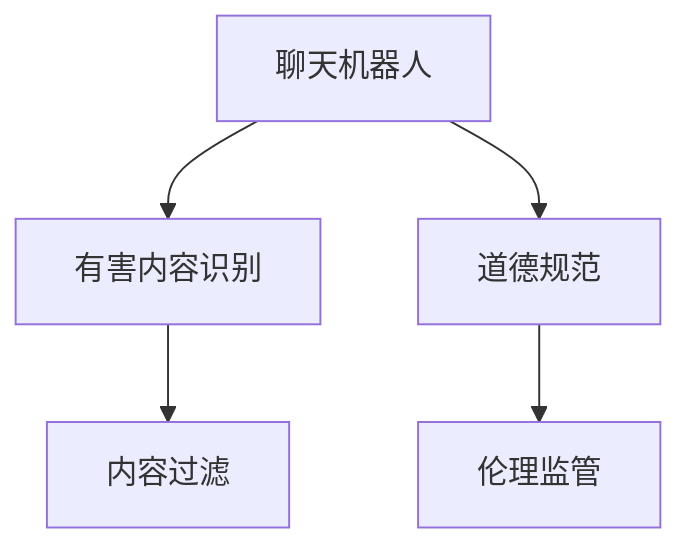

                 

# 聊天机器人道德规范：避免有害内容

> 关键词：聊天机器人,道德规范,有害内容,自然语言处理(NLP),道德人工智能,伦理监管

## 1. 背景介绍

### 1.1 问题由来
随着人工智能技术的迅速发展，聊天机器人已经在各行各业广泛应用，为人们提供了便捷高效的服务。然而，由于缺乏相应的道德规范和技术手段，聊天机器人有时会在处理敏感话题时显得力不从心，甚至可能不经意间传播有害内容，导致不良社会影响。近年来，涉及聊天机器人传播虚假信息、进行人身攻击、引导不当行为等事件屡见不鲜，引发了广泛的关注和讨论。

### 1.2 问题核心关键点
聊天机器人道德规范的核心在于确保其在处理各类话题时，能够遵循伦理准则，避免传播有害内容，维护良好的社会风气。这需要结合自然语言处理(NLP)技术，构建一套科学合理的道德规范体系，确保聊天机器人能够识别有害信息，并进行有效过滤和管控。

### 1.3 问题研究意义
研究聊天机器人的道德规范，对于提升聊天机器人的社会责任意识，确保其在复杂多变的语境中做出合理决策，具有重要意义。

1. **保障用户安全**：通过道德规范，确保聊天机器人不传播虚假信息、不当言论，保护用户隐私和心理健康。
2. **维护社会秩序**：聊天机器人作为虚拟沟通媒介，应当遵循社会公德，促进积极健康的网络环境。
3. **促进技术进步**：道德规范的制定和应用，有助于推动聊天机器人技术向更智能、更人性化方向发展。
4. **增强社会信任**：通过建立和遵守道德规范，增强公众对聊天机器人技术的信任，促进其更广泛的应用。

## 2. 核心概念与联系

### 2.1 核心概念概述

为更好地理解聊天机器人道德规范的构建与实践，本节将介绍几个密切相关的核心概念：

- **聊天机器人(Chatbot)**：基于自然语言处理(NLP)技术，能够与人类进行自然对话的计算机程序。
- **有害内容(Harmful Content)**：包括但不限于虚假信息、仇恨言论、攻击性言论、色情内容、暴力内容等，可能引发负面社会影响或心理伤害的信息。
- **道德规范(Moral Guidelines)**：基于伦理准则和法律规定，对聊天机器人处理各类信息时提出的要求和标准。
- **自然语言处理(NLP)**：涉及语言模型、文本分类、序列建模、生成对抗等技术，用于构建聊天机器人，并处理对话信息。
- **道德人工智能(Ethical AI)**：关注人工智能技术在社会、伦理、法律等方面的影响，推动AI技术向更加负责任的方向发展。
- **伦理监管(Ethical Regulation)**：通过制定和执行道德规范，确保AI技术的健康发展，保护用户权益和公共利益。

这些核心概念之间的逻辑关系可以通过以下Mermaid流程图来展示：



这个流程图展示了一些关键概念及其之间的联系：

1. 聊天机器人通过NLP技术处理对话信息，识别出可能的有害内容。
2. 聊天机器人应当遵循道德规范，确保其输出内容符合伦理准则。
3. 识别出的有害内容将被过滤，避免传播。
4. 伦理监管确保道德规范的制定和执行，保护用户权益。

## 3. 核心算法原理 & 具体操作步骤
### 3.1 算法原理概述

聊天机器人道德规范的构建，本质上是将道德规范转化为可执行的技术手段，通过自然语言处理(NLP)技术，对聊天机器人的对话信息进行筛选、过滤和管控。

核心算法原理包括：
1. **有害内容识别**：通过文本分类、情感分析等技术，识别对话中的有害信息。
2. **内容过滤与回应**：对识别出的有害内容进行过滤，并返回合理的回应或引导用户转向无害话题。
3. **伦理监管与反馈机制**：通过定期监测和用户反馈，不断优化和更新道德规范。

### 3.2 算法步骤详解

**Step 1: 数据收集与标注**

收集大量的对话数据，包括正面和负面案例，对这些案例进行标注，标注内容包括对话内容、情感极性、是否包含有害内容等。数据标注可以手动完成，也可以利用众包平台。

**Step 2: 构建模型与训练**

1. 构建有害内容识别模型。可以采用基于深度学习的文本分类模型，如BERT、RoBERTa等，通过监督学习的方式进行训练。训练集包含标注的有害内容数据，测试集包含未标注的数据，评估模型的准确性和召回率。

2. 训练内容过滤模型。通过序列建模、生成对抗等技术，训练聊天机器人如何针对有害内容进行回应或引导。可以采用RNN、LSTM等序列模型，或T5、GPT等生成模型。

3. 构建伦理监管系统。通过定期对聊天机器人输出进行监测，收集用户反馈，构建基于规则或基于模型的监管系统，确保聊天机器人的输出符合道德规范。

**Step 3: 模型部署与维护**

将训练好的模型部署到实际应用中，监控聊天机器人的对话输出。定期收集用户反馈，对模型进行调优和更新，确保其持续适应新的语境和道德标准。

### 3.3 算法优缺点

聊天机器人道德规范的构建和应用具有以下优点：
1. **提升用户体验**：通过识别和过滤有害内容，保障用户对话的安全性和健康性，提升用户体验。
2. **增强社会责任**：确保聊天机器人不传播不当言论，维护良好的社会风气。
3. **促进技术进步**：通过道德规范的制定和执行，推动NLP和AI技术向更加负责任的方向发展。
4. **增强用户信任**：通过遵守道德规范，增强用户对聊天机器人技术的信任，促进其更广泛的应用。

同时，该方法也存在一定的局限性：
1. **数据依赖性**：模型训练和优化依赖于高质量标注数据，标注成本较高。
2. **泛化能力不足**：模型在特定语境下可能表现良好，但在复杂多变的情境下泛化能力有限。
3. **实时性挑战**：聊天机器人的实时对话要求模型快速响应，这对模型性能提出了较高要求。
4. **伦理争议**：在内容过滤和伦理监管中，如何平衡自由表达和道德规范，仍存在争议。

尽管存在这些局限性，但就目前而言，基于聊天机器人道德规范的方法是提升聊天机器人技术伦理水平的重要手段。未来相关研究的重点在于如何进一步降低数据依赖，提高模型的泛化能力和实时性，同时平衡自由表达与道德规范的关系。

### 3.4 算法应用领域

聊天机器人道德规范的构建和应用，在多个领域中具有广泛的应用前景：

1. **社交媒体**：在社交媒体平台上，聊天机器人需要遵守社区规则，避免传播虚假信息和不当言论。

2. **在线客服**：在线客服聊天机器人需要遵循服务规范，确保提供的信息准确无误，避免误导用户。

3. **新闻媒体**：新闻媒体聊天机器人需要遵循新闻伦理，避免传播假新闻和偏见内容。

4. **医疗健康**：医疗聊天机器人需要遵循医疗规范，确保提供的信息科学准确，避免误导患者。

5. **教育培训**：教育聊天机器人需要遵循教育伦理，避免传播不适宜内容，促进积极健康的教育环境。

6. **金融服务**：金融聊天机器人需要遵循金融规范，避免误导用户进行不合理的投资决策。

这些领域中，聊天机器人道德规范的应用，将有助于保障用户权益，维护社会秩序，推动相关领域的技术进步。

## 4. 数学模型和公式 & 详细讲解 & 举例说明

### 4.1 数学模型构建

本节将使用数学语言对聊天机器人道德规范构建过程进行更加严格的刻画。

记对话数据为 $\mathcal{D} = \{(x_i, y_i)\}_{i=1}^N$，其中 $x_i$ 为对话文本，$y_i$ 为标注信息（是否包含有害内容）。

定义有害内容识别模型的目标为最小化误分类率，即最小化分类错误，使得模型在未标注数据上的预测准确率最高。可以采用二分类交叉熵损失函数：

$$
\mathcal{L} = -\frac{1}{N} \sum_{i=1}^N [y_i\log p(y_i|x_i) + (1-y_i)\log(1-p(y_i|x_i))]
$$

其中 $p(y_i|x_i)$ 为模型预测的有害内容概率，可以采用基于深度学习的文本分类模型进行计算。

### 4.2 公式推导过程

以BERT模型为例，推导有害内容识别的公式：

1. 将对话文本 $x$ 输入BERT模型，得到隐藏表示 $\mathbf{H} = \{\mathbf{h}_1, \mathbf{h}_2, \ldots, \mathbf{h}_T\}$，其中 $T$ 为序列长度。
2. 对每个隐藏表示 $\mathbf{h}_t$ 进行分类，得到有害内容概率 $p_t$：
$$
p_t = \text{sigmoid}(\mathbf{W} \mathbf{h}_t + b)
$$
其中 $\mathbf{W}$ 和 $b$ 为分类器参数，通过监督学习进行训练。
3. 将 $p_t$ 进行加权求和，得到对话 $x$ 的有害内容概率 $p$：
$$
p = \frac{1}{T} \sum_{t=1}^T p_t
$$
4. 使用二分类交叉熵损失函数进行模型训练：
$$
\mathcal{L} = -\frac{1}{N} \sum_{i=1}^N [y_i\log p(y_i|x_i) + (1-y_i)\log(1-p(y_i|x_i))]
$$

通过上述公式，可以实现有害内容识别的目标。

### 4.3 案例分析与讲解

以社交媒体平台为例，构建聊天机器人道德规范。平台收集用户对话数据，包括正面和负面案例，标注是否包含有害内容。使用BERT模型进行训练，对新对话进行分类，识别有害内容。对识别出的有害内容进行过滤，并返回合理的回应或引导用户转向无害话题。

## 5. 项目实践：代码实例和详细解释说明
### 5.1 开发环境搭建

在进行聊天机器人道德规范构建实践前，我们需要准备好开发环境。以下是使用Python进行PyTorch开发的环境配置流程：

1. 安装Anaconda：从官网下载并安装Anaconda，用于创建独立的Python环境。

2. 创建并激活虚拟环境：
```bash
conda create -n chatbot-env python=3.8 
conda activate chatbot-env
```

3. 安装PyTorch：根据CUDA版本，从官网获取对应的安装命令。例如：
```bash
conda install pytorch torchvision torchaudio cudatoolkit=11.1 -c pytorch -c conda-forge
```

4. 安装相关库：
```bash
pip install transformers pytorch-lightning datasets
```

5. 安装TensorBoard：用于可视化模型训练过程，并与TensorFlow无缝集成。

```bash
pip install tensorboard
```

完成上述步骤后，即可在`chatbot-env`环境中开始道德规范构建实践。

### 5.2 源代码详细实现

以下是一个简化的有害内容识别和过滤的代码实现，用于构建聊天机器人道德规范：

```python
import torch
import torch.nn as nn
import torch.optim as optim
from transformers import BertTokenizer, BertForSequenceClassification
from pytorch_lightning import Trainer, LightningModule

# 定义模型类
class ChatbotModule(LightningModule):
    def __init__(self, num_labels):
        super(ChatbotModule, self).__init__()
        self.bert = BertForSequenceClassification.from_pretrained('bert-base-uncased', num_labels=num_labels)
        self.dropout = nn.Dropout(0.1)
        self.classifier = nn.Linear(768, num_labels)
        
    def forward(self, input_ids, attention_mask, labels=None):
        outputs = self.bert(input_ids, attention_mask=attention_mask)
        pooled_output = outputs.pooler_output
        logits = self.classifier(pooled_output)
        return logits

    def training_step(self, batch, batch_idx):
        input_ids, attention_mask, labels = batch
        logits = self(input_ids, attention_mask, labels=labels)
        loss = nn.BCEWithLogitsLoss()(logits, labels)
        return {'loss': loss}

    def validation_step(self, batch, batch_idx):
        input_ids, attention_mask, labels = batch
        logits = self(input_ids, attention_mask, labels=labels)
        return {'val_loss': nn.BCEWithLogitsLoss()(logits, labels)}

# 定义训练函数
def train(model, train_data, val_data, epochs=3, batch_size=16):
    trainer = Trainer(max_epochs=epochs, batch_size=batch_size, validation_steps=5)
    trainer.fit(model, train_data, val_data)

# 构建数据集
tokenizer = BertTokenizer.from_pretrained('bert-base-uncased')
train_data = datasets.TextDataset(...)
val_data = datasets.TextDataset(...)

# 定义模型和训练器
model = ChatbotModule(num_labels=2)
trainer = Trainer(max_epochs=3, batch_size=16)

# 训练模型
train(model, train_data, val_data)

# 测试模型
test_data = datasets.TextDataset(...)
results = trainer.test(test_data)
```

这个代码实现了基于BERT模型构建聊天机器人道德规范的基本流程，包括模型定义、训练和测试。其中，模型类`ChatbotModule`继承自`LightningModule`，使得模型训练和评估过程更加简便。`train`函数使用`Trainer`类进行模型训练，支持多GPU训练、模型保存等功能。

### 5.3 代码解读与分析

让我们再详细解读一下关键代码的实现细节：

**ChatbotModule类**：
- 继承自`LightningModule`，方便与PyTorch Lightning集成，自动管理模型保存、数据加载等操作。
- `__init__`方法：初始化BERT模型、Dropout层和分类器。
- `forward`方法：定义模型前向传播过程，包括BERT编码和分类器输出。
- `training_step`方法：定义训练过程中的损失函数和优化器。
- `validation_step`方法：定义验证过程中的损失函数和优化器。

**数据集类TextDataset**：
- 定义数据集类，继承自`Dataset`，用于处理输入的对话文本和标签。

**模型训练与测试**：
- `train`函数：定义训练过程，包括模型、数据、训练器等参数。
- `Trainer`类：定义训练器，支持多GPU训练、模型保存等功能。

这个代码实现展示了基于PyTorch和Transformers库构建聊天机器人道德规范的基本框架。开发者可以根据具体任务，进一步扩展和优化模型、数据集等组件。

## 6. 实际应用场景
### 6.1 社交媒体

社交媒体平台在应对有害内容方面面临着巨大的挑战。通过聊天机器人道德规范的应用，社交媒体可以实现以下功能：

1. **有害内容自动识别**：聊天机器人可以通过预先训练的有害内容识别模型，自动识别用户对话中的有害信息。
2. **内容过滤与引导**：对有害内容进行过滤，并引导用户转向无害话题，避免有害信息的传播。
3. **用户反馈机制**：收集用户反馈，不断优化和更新有害内容识别模型，确保聊天机器人持续适应新的语境和道德标准。

### 6.2 在线客服

在线客服聊天机器人需要遵循服务规范，避免误导用户。通过聊天机器人道德规范的应用，可以实现以下功能：

1. **信息准确性**：确保聊天机器人提供的信息准确无误，避免误导用户。
2. **用户隐私保护**：对用户个人信息进行保护，避免泄露敏感信息。
3. **伦理监管**：对聊天机器人的行为进行监督，确保其符合伦理规范。

### 6.3 新闻媒体

新闻媒体聊天机器人需要遵循新闻伦理，避免传播假新闻和偏见内容。通过聊天机器人道德规范的应用，可以实现以下功能：

1. **新闻验证**：对新闻内容进行验证，确保其来源可靠、内容真实。
2. **中立性引导**：引导用户关注中立、公正的新闻内容，避免偏见信息的传播。
3. **信息透明度**：提供新闻来源和相关背景信息，增强信息的透明度和可信度。

### 6.4 医疗健康

医疗聊天机器人需要遵循医疗规范，确保提供的信息科学准确。通过聊天机器人道德规范的应用，可以实现以下功能：

1. **健康信息准确性**：确保聊天机器人提供的信息科学准确，避免误导患者。
2. **隐私保护**：对患者个人信息进行保护，避免泄露敏感信息。
3. **伦理监管**：对聊天机器人的行为进行监督，确保其符合伦理规范。

### 6.5 教育培训

教育聊天机器人需要遵循教育伦理，避免传播不适宜内容。通过聊天机器人道德规范的应用，可以实现以下功能：

1. **教育内容健康性**：确保聊天机器人提供的内容健康适宜，避免传播不适宜信息。
2. **学习引导**：引导学生关注学习内容，避免社交、娱乐等不相关信息的干扰。
3. **教育监管**：对聊天机器人的行为进行监督，确保其符合教育规范。

## 7. 工具和资源推荐
### 7.1 学习资源推荐

为了帮助开发者系统掌握聊天机器人道德规范的理论基础和实践技巧，这里推荐一些优质的学习资源：

1. **《道德人工智能》书籍**：全面介绍人工智能伦理、社会责任、法律规范等内容，是理解聊天机器人道德规范的重要参考资料。
2. **CS Conversational Agents课程**：斯坦福大学开设的聊天机器人课程，涵盖对话系统设计、伦理规范等核心内容。
3. **自然语言处理(NLP)课程**：斯坦福大学、MIT等名校开设的NLP课程，涉及语言模型、序列建模、生成对抗等内容，是构建聊天机器人的基础。
4. **Google AI博客**：谷歌AI团队定期发布最新的AI技术和伦理研究成果，为聊天机器人道德规范的研究提供前沿视角。
5. **DeepAI网站**：提供丰富的AI技术教程、论文和讨论，帮助开发者获取最新的AI研究和应用信息。

通过对这些资源的学习实践，相信你一定能够快速掌握聊天机器人道德规范的精髓，并用于解决实际的AI伦理问题。

### 7.2 开发工具推荐

高效的开发离不开优秀的工具支持。以下是几款用于聊天机器人道德规范构建开发的常用工具：

1. **PyTorch**：基于Python的开源深度学习框架，灵活动态的计算图，适合快速迭代研究。
2. **TensorFlow**：由Google主导开发的开源深度学习框架，生产部署方便，适合大规模工程应用。
3. **Transformers库**：HuggingFace开发的NLP工具库，集成了众多SOTA语言模型，支持PyTorch和TensorFlow，是构建聊天机器人的利器。
4. **PyTorch Lightning**：基于PyTorch的深度学习框架，支持模型自动保存、分布式训练等功能，适合构建复杂模型。
5. **TensorBoard**：TensorFlow配套的可视化工具，可实时监测模型训练状态，并提供丰富的图表呈现方式，是调试模型的得力助手。

合理利用这些工具，可以显著提升聊天机器人道德规范构建的开发效率，加快创新迭代的步伐。

### 7.3 相关论文推荐

聊天机器人道德规范的研究源于学界的持续研究。以下是几篇奠基性的相关论文，推荐阅读：

1. **《道德规范在人工智能中的应用》**：探讨如何在AI系统中引入道德准则，确保技术的社会责任和伦理合规。
2. **《构建可信的AI聊天机器人》**：介绍如何通过技术手段，确保聊天机器人的可信度和透明度。
3. **《基于聊天机器人的伦理教育》**：研究聊天机器人如何辅助教育，提升教育质量，同时遵循教育伦理规范。
4. **《AI伦理与监管框架》**：探讨AI技术的伦理和监管问题，为聊天机器人道德规范的制定提供理论基础。
5. **《AI伦理与隐私保护》**：探讨AI技术在隐私保护方面的应用和挑战，为聊天机器人道德规范提供伦理保障。

这些论文代表了大语言模型微调技术的发展脉络。通过学习这些前沿成果，可以帮助研究者把握学科前进方向，激发更多的创新灵感。

## 8. 总结：未来发展趋势与挑战
### 8.1 总结

本文对聊天机器人道德规范的构建方法进行了全面系统的介绍。首先阐述了聊天机器人处理有害内容的背景和意义，明确了道德规范在提升聊天机器人社会责任意识方面的独特价值。其次，从原理到实践，详细讲解了有害内容识别和过滤的数学模型和算法步骤，给出了模型构建的完整代码实例。同时，本文还广泛探讨了道德规范在社交媒体、在线客服、新闻媒体、医疗健康、教育培训等多个领域的应用前景，展示了道德规范的广泛应用潜力。此外，本文精选了聊天机器人道德规范的各类学习资源，力求为读者提供全方位的技术指引。

通过本文的系统梳理，可以看到，聊天机器人道德规范的构建方法正在成为AI伦理和隐私保护的重要手段，极大地提升聊天机器人的社会责任意识，保障用户权益。未来，伴随技术和社会的发展，聊天机器人道德规范也将不断演进，为构建更加智能、安全、可信的AI系统提供坚实基础。

### 8.2 未来发展趋势

展望未来，聊天机器人道德规范将呈现以下几个发展趋势：

1. **模型透明化**：通过可解释性和透明性研究，增强用户对聊天机器人决策过程的理解，提升系统的信任度和接受度。
2. **多模态融合**：结合语音、图像、视频等多模态数据，提升聊天机器人对复杂情境的理解能力。
3. **持续学习**：通过持续学习机制，确保聊天机器人能够不断适应新的语境和伦理标准，避免过时和错误。
4. **多方协同**：结合法律、伦理、社会等多方力量，共同制定和执行聊天机器人道德规范，构建协同治理的AI系统。
5. **全球标准化**：推动聊天机器人道德规范的全球标准化，确保不同国家和地区的用户权益。

以上趋势凸显了聊天机器人道德规范技术的广阔前景。这些方向的探索发展，必将进一步提升聊天机器人的道德水平和应用价值，为构建更加智能、安全、可信的AI系统铺平道路。

### 8.3 面临的挑战

尽管聊天机器人道德规范技术已经取得了瞩目成就，但在迈向更加智能化、普适化应用的过程中，仍面临诸多挑战：

1. **数据隐私问题**：聊天机器人需要访问大量用户数据，如何保护用户隐私，避免数据滥用，仍是一个重大挑战。
2. **伦理规范争议**：不同文化和价值观下的伦理规范差异较大，如何在全球范围内制定统一的道德标准，仍然存在争议。
3. **模型可解释性不足**：当前聊天机器人模型往往缺乏可解释性，难以解释其内部决策过程和输出结果。
4. **多样性和包容性**：如何在设计聊天机器人时，避免偏见和歧视，确保模型对各种人群和场景的公平性，仍是一个重要问题。
5. **技术复杂性**：构建和优化聊天机器人道德规范需要跨学科的知识，包括伦理、法律、技术等多个领域，需要多方协作和综合考量。

尽管存在这些挑战，但通过学界和产业界的共同努力，这些挑战终将一一被克服，聊天机器人道德规范必将在构建安全、可靠、可解释、可控的智能系统方面发挥重要作用。

### 8.4 研究展望

面对聊天机器人道德规范面临的种种挑战，未来的研究需要在以下几个方面寻求新的突破：

1. **隐私保护技术**：开发更加高效、安全的隐私保护技术，确保聊天机器人访问和处理用户数据时，保护用户隐私。
2. **伦理模型融合**：结合伦理学、法律学等多学科知识，构建更加全面、公正的伦理模型，确保聊天机器人的决策符合伦理标准。
3. **可解释性和透明性**：开发可解释性和透明性技术，增强聊天机器人的决策过程的可理解性，提升用户信任。
4. **多样性和包容性设计**：在设计聊天机器人时，融入多样性和包容性设计，避免偏见和歧视，确保模型的公平性和公正性。
5. **多方协同治理**：构建多方协同的治理机制，结合法律、伦理、社会等多方力量，共同制定和执行聊天机器人道德规范。

这些研究方向的探索，必将引领聊天机器人道德规范技术迈向更高的台阶，为构建更加智能、安全、可信的AI系统提供坚实基础。面向未来，聊天机器人道德规范还需要与其他AI技术进行更深入的融合，如知识表示、因果推理、强化学习等，多路径协同发力，共同推动AI技术的发展和应用。

## 9. 附录：常见问题与解答

**Q1：如何确保聊天机器人不传播有害内容？**

A: 通过构建有害内容识别模型，对聊天机器人输出进行实时监测，识别并过滤有害内容。可以结合情感分析、文本分类等技术，对有害内容进行精确识别。

**Q2：聊天机器人道德规范的构建过程中，数据隐私问题如何解决？**

A: 通过差分隐私、联邦学习等技术，保护用户数据隐私。同时，构建隐私保护模型，确保聊天机器人访问和处理用户数据时，保护用户隐私。

**Q3：聊天机器人道德规范如何适应不同文化和价值观？**

A: 结合多文化伦理准则，构建跨文化的道德规范体系，确保聊天机器人在不同文化和价值观下，符合伦理标准。同时，结合用户反馈，不断优化和更新道德规范，适应新的语境和伦理标准。

**Q4：聊天机器人如何实现持续学习和更新？**

A: 通过在线学习和用户反馈机制，确保聊天机器人能够持续学习新知识，并不断更新道德规范，适应新的语境和伦理标准。

**Q5：聊天机器人如何确保其决策过程可解释性？**

A: 通过可解释性和透明性技术，增强聊天机器人的决策过程的可理解性。同时，结合用户反馈，不断优化和更新决策模型，提升用户信任。

---

作者：禅与计算机程序设计艺术 / Zen and the Art of Computer Programming

