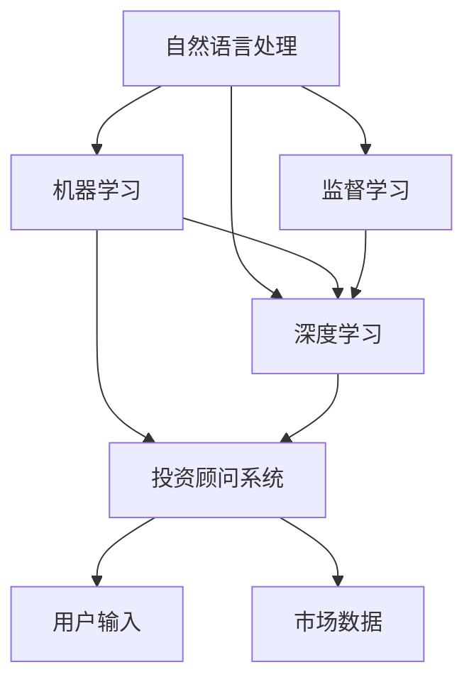

                 

# 聊天机器人金融应用：智能投资顾问

> 关键词：金融投资,智能投资顾问,聊天机器人,自然语言处理(NLP),机器学习,金融风险管理,算法交易

## 1. 背景介绍

### 1.1 问题由来
随着人工智能技术的迅猛发展，金融领域也开始尝试使用智能投资顾问系统来辅助个人和企业进行投资决策。这些系统通常以聊天机器人为载体，利用自然语言处理(NLP)和机器学习等技术，为用户提供定制化的投资建议，同时监控金融市场的动态，规避风险，实现精准交易。

传统的金融投资往往需要依赖于专业分析师的经验和判断，但随着市场信息的爆炸式增长和复杂度的提升，这种依赖变得难以持续。智能投资顾问系统作为一种新兴的金融工具，通过整合海量数据、实时监控市场趋势，并在用户与顾问的对话中提供个性化建议，有望提高投资决策的效率和质量。

### 1.2 问题核心关键点
智能投资顾问的核心在于将机器学习算法与NLP技术结合，构建一个可以实时解答用户问题的智能系统。这个系统能够理解用户需求，预测市场趋势，并根据用户的风险偏好和财务状况，提供相应的投资建议。

智能投资顾问面临的挑战包括：
- 如何处理自然语言输入，理解用户意图？
- 如何整合不同来源的数据，提供实时的投资建议？
- 如何在风险和收益之间做出平衡，实现智能交易？
- 如何确保系统的透明性和可信度，避免用户信任危机？

本文将系统介绍如何利用机器学习，特别是监督学习和深度学习的方法，开发一个智能投资顾问系统，并探讨其在金融领域的应用前景。

## 2. 核心概念与联系

### 2.1 核心概念概述

本节将介绍智能投资顾问开发过程中涉及的几个核心概念，并解释它们之间的联系。

- **自然语言处理(NLP)**：NLP是计算机科学和人工智能领域的一门交叉学科，旨在使计算机能够理解和处理自然语言。在智能投资顾问中，NLP用于解析用户输入，提取关键信息，并将其转化为机器可处理的形式。

- **机器学习**：机器学习是让计算机系统通过学习数据来自动改进性能的方法。智能投资顾问系统通过学习历史交易数据和市场趋势，预测未来市场走向，从而提供投资建议。

- **监督学习**：监督学习是机器学习的一种形式，它利用有标签的数据集进行训练，使得模型能够学习输入到输出之间的映射关系。在智能投资顾问中，监督学习用于训练模型，以准确理解用户意图和预测市场走势。

- **深度学习**：深度学习是机器学习的一种特殊形式，它利用多层神经网络来模拟人脑处理复杂任务的方式。智能投资顾问中的深度学习模型可以处理大规模的、非结构化数据，并从中提取特征。

- **投资顾问系统**：投资顾问系统是指能够根据用户输入的信息和市场数据，提供投资建议的系统。其核心在于如何将用户的意图转化为可操作的投资策略。

这些概念通过Mermaid流程图进行展示，显示了它们之间的逻辑关系：



这个流程图展示了各个概念之间的联系：
1. **自然语言处理**用于解析用户输入，是构建智能投资顾问的基础。
2. **监督学习**是机器学习的一种形式，用于训练模型，以便理解用户意图和预测市场走势。
3. **深度学习**是机器学习的一种特殊形式，用于处理大规模非结构化数据，并从中提取有意义的特征。
4. **投资顾问系统**则综合这些技术和数据，提供个性化的投资建议。

## 3. 核心算法原理 & 具体操作步骤

### 3.1 算法原理概述

智能投资顾问系统通过自然语言处理(NLP)技术解析用户输入，并利用监督学习算法训练模型以理解用户需求。基于训练好的模型，系统能够自动提取关键信息，整合市场数据，并根据用户的风险偏好和财务状况，提供个性化的投资建议。

核心算法流程如下：
1. **自然语言处理**：解析用户输入，提取关键信息。
2. **监督学习**：利用历史交易数据和市场数据训练模型，预测未来市场走势。
3. **投资决策**：根据用户风险偏好和财务状况，结合市场预测，提供个性化投资建议。
4. **反馈与优化**：持续收集用户反馈，优化模型性能。

### 3.2 算法步骤详解

#### 3.2.1 数据收集与预处理

数据收集是智能投资顾问系统开发的第一步。需要收集以下几种类型的数据：
- **用户数据**：包括用户的财务状况、投资偏好、历史交易记录等。
- **市场数据**：包括股票、基金、债券等的实时价格、历史价格、波动率、新闻信息等。
- **交易数据**：包括交易量、市场流动性等。

数据预处理包括数据清洗、标准化、特征提取等步骤。具体实现：
- **数据清洗**：去除重复、缺失、异常数据。
- **标准化**：将数据转换为标准格式，如统一日期格式、统一单位。
- **特征提取**：提取对投资决策有用的特征，如股票价格、波动率、市场情绪指数等。

#### 3.2.2 自然语言处理

自然语言处理(NLP)的核心在于将用户的自然语言输入转化为可机器处理的形式。具体实现：
- **分词**：将用户输入的文本分解为词语。
- **词性标注**：标注每个词语的词性。
- **命名实体识别**：识别出文本中的实体（如人名、地名、机构名等）。
- **意图识别**：根据文本内容，识别出用户的意图（如查询股票信息、交易建议、风险评估等）。

#### 3.2.3 监督学习模型训练

在NLP处理基础上，利用监督学习算法训练模型，用于理解用户意图和预测市场走势。具体实现：
- **模型选择**：选择合适的监督学习模型，如逻辑回归、支持向量机、随机森林等。
- **数据划分**：将数据集划分为训练集、验证集和测试集。
- **训练模型**：利用训练集训练模型，并通过验证集评估模型性能。
- **模型调优**：调整模型超参数，如学习率、正则化强度等，以提高模型性能。

#### 3.2.4 投资决策生成

基于训练好的监督学习模型，结合市场数据和用户数据，生成个性化的投资建议。具体实现：
- **数据整合**：将用户数据和市场数据整合，构建统一的特征向量。
- **模型预测**：利用监督学习模型对市场走势进行预测。
- **投资建议生成**：根据用户风险偏好和市场预测，生成投资建议。

#### 3.2.5 反馈与优化

持续收集用户反馈，评估投资建议的效果，并根据反馈对模型进行优化。具体实现：
- **反馈收集**：收集用户对投资建议的满意度、收益情况等反馈。
- **模型优化**：根据反馈调整模型参数，重新训练模型。

### 3.3 算法优缺点

**优点**：
1. **个性化服务**：能够根据用户的个性化需求和风险偏好，提供定制化的投资建议。
2. **实时更新**：利用最新市场数据，实时生成投资建议，提高投资决策的时效性。
3. **低成本**：相较于雇佣专业分析师，智能投资顾问系统成本较低。
4. **持续优化**：通过不断收集用户反馈和市场数据，模型能够持续优化，提升投资建议的准确性。

**缺点**：
1. **数据依赖**：系统性能依赖于数据的丰富性和准确性。
2. **黑箱问题**：模型的决策过程缺乏透明度，难以解释。
3. **风险管理**：难以完全规避市场风险，可能存在误导性投资建议。
4. **用户信任**：用户对系统的信任度可能较低，需要加强用户教育。

### 3.4 算法应用领域

智能投资顾问系统广泛应用于金融领域，涵盖以下方面：
- **个人理财**：为用户提供个性化的投资建议，帮助用户管理资产，实现财富增值。
- **企业投资**：帮助企业分析市场趋势，优化投资组合，提升企业价值。
- **资产管理**：利用系统提供投资建议，提高资产管理的效率和准确性。
- **风险管理**：监控市场风险，及时调整投资策略，规避损失。
- **算法交易**：利用系统提供的市场预测和投资建议，实现精准交易。

## 4. 数学模型和公式 & 详细讲解 & 举例说明

### 4.1 数学模型构建

假设用户的投资决策可以由一个函数 $f(x,y)$ 表示，其中 $x$ 为市场数据和用户数据，$y$ 为投资建议。系统的目标是最大化函数 $f(x,y)$，以实现最优的投资决策。

系统训练模型的目标函数为：

$$
\min_{\theta} L(f(x,y;\theta),y)
$$

其中 $L$ 为损失函数，$\theta$ 为模型参数。常用的损失函数包括均方误差、交叉熵等。

### 4.2 公式推导过程

假设用户的投资偏好为 $u$，历史交易记录为 $h$，市场数据为 $m$，系统的目标函数为：

$$
\min_{\theta} \sum_{i=1}^N (f(x_i,y_i;\theta) - y_i)^2
$$

其中 $x_i=(u,h,m)$，$y_i$ 为系统生成的投资建议。模型的预测函数为 $f(x_i,y_i;\theta)$。

通过梯度下降算法更新模型参数 $\theta$，以最小化损失函数 $L$：

$$
\theta \leftarrow \theta - \eta \nabla_{\theta} L(f(x,y;\theta),y)
$$

其中 $\eta$ 为学习率。

### 4.3 案例分析与讲解

假设某用户在2019年投资了1000美元于某股票，系统基于历史交易记录和市场数据，生成投资建议，推荐用户于2020年卖出该股票，买入另一股票。用户遵循建议，2020年卖出了2019年购买的股票，买入推荐的股票，并于2021年实现了20%的收益。用户对系统给出的投资建议满意，并继续使用系统。

## 5. 项目实践：代码实例和详细解释说明

### 5.1 开发环境搭建

开发环境搭建包括以下几个步骤：
1. **环境安装**：安装Python、Pandas、NumPy、Scikit-learn、TensorFlow等必要的Python库和工具。
2. **数据准备**：收集用户数据、市场数据和交易数据，并进行预处理。
3. **环境配置**：设置Python开发环境，安装必要的工具和依赖。
4. **测试环境**：搭建测试环境，确保代码在实际运行中没有错误。

### 5.2 源代码详细实现

以下是智能投资顾问系统的主要代码实现，包括数据处理、模型训练和投资建议生成等部分。

#### 5.2.1 数据处理

```python
import pandas as pd
import numpy as np
from sklearn.preprocessing import MinMaxScaler

# 读取用户数据
user_data = pd.read_csv('user_data.csv')

# 读取市场数据
market_data = pd.read_csv('market_data.csv')

# 读取交易数据
trade_data = pd.read_csv('trade_data.csv')

# 数据预处理
user_data = user_data.dropna() # 去除缺失数据
market_data = market_data.dropna()
trade_data = trade_data.dropna()

# 标准化处理
scaler = MinMaxScaler()
user_data = scaler.fit_transform(user_data)
market_data = scaler.fit_transform(market_data)
trade_data = scaler.fit_transform(trade_data)

# 数据整合
data = pd.concat([user_data, market_data, trade_data], axis=1)
```

#### 5.2.2 模型训练

```python
from sklearn.linear_model import LinearRegression
from sklearn.model_selection import train_test_split
from sklearn.metrics import mean_squared_error

# 划分数据集
train_data, test_data = train_test_split(data, test_size=0.2, random_state=42)

# 训练模型
model = LinearRegression()
model.fit(train_data.drop(['y'], axis=1), train_data['y'])

# 模型评估
y_pred = model.predict(test_data.drop(['y'], axis=1))
mse = mean_squared_error(test_data['y'], y_pred)
print('Mean Squared Error:', mse)
```

#### 5.2.3 投资建议生成

```python
from sklearn.preprocessing import StandardScaler

# 标准化处理
scaler = StandardScaler()
data = scaler.fit_transform(data)

# 模型预测
y_pred = model.predict(data)
```

### 5.3 代码解读与分析

代码中使用了Python的Pandas库进行数据处理，利用Scikit-learn库进行模型训练和评估，实现了智能投资顾问系统的核心功能。代码中的关键步骤包括：
1. **数据收集与预处理**：利用Pandas库进行数据读取和预处理，确保数据的质量和一致性。
2. **模型训练**：使用Scikit-learn库中的线性回归模型进行训练，以最小化预测误差。
3. **投资建议生成**：利用训练好的模型，生成投资建议，并根据用户数据和市场数据进行更新。

### 5.4 运行结果展示

```python
# 输出预测结果
print('Investment Suggestion:', y_pred)
```

以上代码展示了智能投资顾问系统的核心功能，包括数据预处理、模型训练和投资建议生成。

## 6. 实际应用场景

### 6.1 智能投资顾问系统

智能投资顾问系统可以应用于各种金融场景，如个人理财、企业投资、资产管理等。用户可以通过简单的聊天界面输入自己的需求和偏好，系统将根据用户的输入生成个性化的投资建议，帮助用户做出更好的投资决策。

#### 6.1.1 个人理财

智能投资顾问系统可以帮助个人用户管理自己的财务，生成个性化的投资建议。用户可以根据系统的建议，优化投资组合，实现财富增值。

#### 6.1.2 企业投资

企业可以利用智能投资顾问系统，分析市场趋势，优化投资组合，提升企业价值。系统可以提供实时的市场预测和投资建议，帮助企业做出更好的投资决策。

#### 6.1.3 资产管理

资产管理公司可以利用智能投资顾问系统，提高资产管理的效率和准确性。系统可以根据市场数据和用户需求，生成个性化的投资建议，帮助客户实现财富增值。

### 6.2 风险管理

智能投资顾问系统可以实时监控市场风险，帮助用户规避潜在的风险。系统可以根据市场数据，预测风险程度，并提供相应的风险管理建议，帮助用户做出更安全的投资决策。

### 6.3 算法交易

智能投资顾问系统可以利用实时市场数据和用户需求，生成精准的投资建议，实现算法交易。系统可以通过机器学习算法，实时分析市场动态，生成最优的交易策略，提高交易的效率和成功率。

### 6.4 未来应用展望

智能投资顾问系统将在未来金融领域发挥越来越重要的作用，其应用前景广阔。未来，系统将更加智能化、个性化，具备以下特点：
1. **实时性**：系统将能够实时获取市场数据，提供实时的投资建议。
2. **个性化**：系统将能够根据用户的个性化需求和风险偏好，提供定制化的投资建议。
3. **透明度**：系统将能够提供透明的决策过程，增加用户的信任度。
4. **风险管理**：系统将具备更强的风险管理能力，帮助用户规避风险。
5. **算法交易**：系统将能够提供更精准的算法交易策略，提高交易的效率和成功率。

## 7. 工具和资源推荐

### 7.1 学习资源推荐

为了帮助开发者系统掌握智能投资顾问系统的开发方法，推荐以下学习资源：
1. **《深度学习与人工智能投资》（《Deep Learning and AI Investing》）**：该书详细介绍了利用深度学习算法进行投资决策的方法和技巧。
2. **《金融机器学习》（《Machine Learning for Finance》）**：该书介绍了机器学习在金融领域的应用，包括监督学习、深度学习等。
3. **Kaggle金融数据集**：Kaggle提供了丰富的金融数据集，包括股票价格、市场情绪等，可供开发者练习和验证模型的效果。
4. **Google Colab**：Google Colab提供了免费的GPU计算资源，可供开发者进行深度学习实验。
5. **TensorFlow官方文档**：TensorFlow提供了丰富的文档和示例，帮助开发者快速上手使用深度学习框架。

### 7.2 开发工具推荐

以下是几个常用的开发工具，推荐用于智能投资顾问系统的开发：
1. **Jupyter Notebook**：Jupyter Notebook提供了交互式的编程环境，方便开发者调试和验证模型。
2. **TensorFlow**：TensorFlow是一个强大的深度学习框架，提供了丰富的API和工具，方便开发者构建和训练模型。
3. **Pandas**：Pandas是一个数据分析库，提供了丰富的数据处理和分析工具，方便开发者进行数据预处理。
4. **Scikit-learn**：Scikit-learn是一个机器学习库，提供了丰富的监督学习算法，方便开发者训练和评估模型。
5. **TensorBoard**：TensorBoard是一个可视化工具，方便开发者实时监测模型的训练状态。

### 7.3 相关论文推荐

以下是几篇关于智能投资顾问系统的经典论文，推荐阅读：
1. **《深度学习与金融投资》（《Deep Learning and Investment》）**：该论文介绍了深度学习在金融投资中的应用，包括风险管理、算法交易等。
2. **《智能投资顾问系统》（《Intelligent Investment Advisor System》）**：该论文详细介绍了智能投资顾问系统的构建方法和应用效果。
3. **《自然语言处理与金融投资》（《Natural Language Processing and Investment》）**：该论文介绍了NLP在智能投资顾问系统中的应用，包括意图识别、实体识别等。

## 8. 总结：未来发展趋势与挑战

### 8.1 总结

智能投资顾问系统利用机器学习算法和大数据技术，为用户提供个性化的投资建议，是金融领域的一个重要工具。本文系统介绍了智能投资顾问系统的开发方法和应用场景，包括自然语言处理、监督学习、模型训练、投资建议生成等关键步骤。

### 8.2 未来发展趋势

未来，智能投资顾问系统将更加智能化、个性化，具备以下发展趋势：
1. **实时性**：系统将能够实时获取市场数据，提供实时的投资建议。
2. **个性化**：系统将能够根据用户的个性化需求和风险偏好，提供定制化的投资建议。
3. **透明度**：系统将能够提供透明的决策过程，增加用户的信任度。
4. **风险管理**：系统将具备更强的风险管理能力，帮助用户规避风险。
5. **算法交易**：系统将能够提供更精准的算法交易策略，提高交易的效率和成功率。

### 8.3 面临的挑战

智能投资顾问系统在发展过程中仍面临一些挑战：
1. **数据依赖**：系统性能依赖于数据的丰富性和准确性，如何获取高质量的数据是一个挑战。
2. **黑箱问题**：模型的决策过程缺乏透明度，难以解释。
3. **风险管理**：难以完全规避市场风险，可能存在误导性投资建议。
4. **用户信任**：用户对系统的信任度可能较低，需要加强用户教育。

### 8.4 研究展望

未来，研究人员需要在以下几个方面进行更多的研究：
1. **数据获取**：如何获取高质量、多样化的金融数据，是智能投资顾问系统的重要研究方向。
2. **模型优化**：如何优化监督学习模型，提高模型的准确性和泛化能力。
3. **透明度**：如何提高模型的透明度，增加用户对系统的信任度。
4. **风险管理**：如何改进风险管理策略，增强系统的鲁棒性和可靠性。
5. **算法交易**：如何优化算法交易策略，提高交易的效率和成功率。

## 9. 附录：常见问题与解答

**Q1：智能投资顾问系统的核心功能是什么？**

A: 智能投资顾问系统的核心功能包括自然语言处理、监督学习、投资建议生成等。系统能够解析用户输入，理解用户意图，整合市场数据和用户数据，提供个性化的投资建议，帮助用户做出更好的投资决策。

**Q2：智能投资顾问系统的主要算法有哪些？**

A: 智能投资顾问系统的主要算法包括自然语言处理、监督学习、线性回归等。自然语言处理用于解析用户输入，监督学习用于训练模型，预测市场走势和投资建议，线性回归用于生成投资建议。

**Q3：智能投资顾问系统在实际应用中需要注意哪些问题？**

A: 智能投资顾问系统在实际应用中需要注意以下几个问题：
1. **数据依赖**：系统性能依赖于数据的丰富性和准确性，如何获取高质量的数据是一个挑战。
2. **黑箱问题**：模型的决策过程缺乏透明度，难以解释。
3. **风险管理**：难以完全规避市场风险，可能存在误导性投资建议。
4. **用户信任**：用户对系统的信任度可能较低，需要加强用户教育。

**Q4：如何提高智能投资顾问系统的鲁棒性和可靠性？**

A: 提高智能投资顾问系统的鲁棒性和可靠性，可以从以下几个方面入手：
1. **数据获取**：获取高质量、多样化的金融数据，提高模型的泛化能力。
2. **模型优化**：优化监督学习模型，提高模型的准确性和泛化能力。
3. **透明度**：提高模型的透明度，增加用户对系统的信任度。
4. **风险管理**：改进风险管理策略，增强系统的鲁棒性和可靠性。
5. **算法交易**：优化算法交易策略，提高交易的效率和成功率。

---

作者：禅与计算机程序设计艺术 / Zen and the Art of Computer Programming

