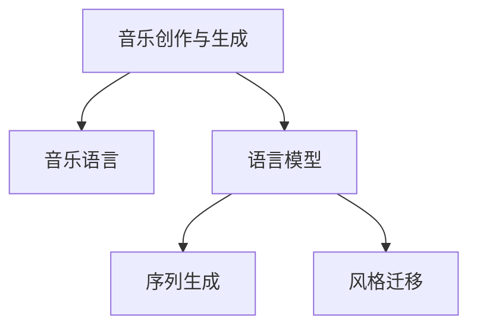

                 

# 聊天机器人音乐创作：人工智能作曲和编曲

## 1. 背景介绍

### 1.1 问题由来
随着人工智能技术的迅猛发展，AI作曲和编曲已经不再是一个科幻电影里的概念。近年来，利用深度学习技术对音乐进行生成和创作成为了一个热门研究领域。其中，基于语言模型的方法，特别是使用Transformer架构的语言模型，被证明在音乐创作方面表现出了令人印象深刻的潜力。

在过去的几年中，研究人员已经展示了AI系统如何在不依赖人类音乐家的情况下，生成复杂且富有创意的旋律、和弦进行、节奏等音乐元素。这种技术不仅在学术界引起了广泛关注，也吸引了大量音乐爱好者的兴趣。

### 1.2 问题核心关键点
AI作曲和编曲的核心在于如何利用语言模型的特点，将文本信息转化为音乐的创作灵感。语言模型擅长捕捉长距离依赖关系、理解上下文信息，这些特性与音乐创作中的和弦进程、旋律发展等相似。通过合理的文本编码和解码器设计，语言模型能够在音乐生成中发挥作用。

目前，基于语言模型的AI作曲和编曲方法主要有两种：

1. **文本编码与解码**：将音乐创作过程看作一种文本解码过程，通过给定一段特定文本（如乐谱、和弦进行等），生成对应的音乐输出。
2. **序列生成**：直接通过序列生成模型，将音乐元素（音符、和弦、节奏等）作为序列数据输入，生成全新的音乐片段。

这些方法在学术研究和工业应用中都取得了显著成果，未来还有巨大的发展潜力。

## 2. 核心概念与联系

### 2.1 核心概念概述

为更好地理解AI作曲和编曲，我们将介绍几个关键概念及其之间的关系：

- **音乐创作与生成**：指通过一定规则和算法，将创作灵感转化为具体的音乐作品的过程。
- **语言模型**：基于Transformer架构的神经网络模型，擅长处理序列数据，通过学习大量文本数据，能够捕捉语言的上下文关系。
- **音乐语言**：将音乐元素（如音符、和弦、节奏等）转化为文本数据（如音符名称、和弦符号、节拍类型等），进而训练语言模型。
- **序列生成**：利用语言模型生成序列数据的框架，通常应用于音乐创作中的和弦进行、旋律生成等。
- **风格迁移**：通过微调或其他技术，使AI生成的音乐具有特定风格或历史时期的音乐特征。

这些概念之间的逻辑关系可以通过以下Mermaid流程图来展示：



这个流程图展示了音乐创作与生成过程中，音乐语言与语言模型、序列生成、风格迁移之间的联系：

1. 音乐创作与生成最终需要转化为具体的音乐元素。
2. 音乐语言是将音乐元素转化为文本数据的过程，便于语言模型的训练和应用。
3. 序列生成利用语言模型生成音乐序列，可以应用于和弦进行、旋律生成等。
4. 风格迁移通过微调或重构方式，使AI生成的音乐具有特定的风格或历史时期特征。

这些核心概念共同构成了AI作曲和编曲的技术基础，使其能够在音乐创作中发挥越来越重要的作用。

## 3. 核心算法原理 & 具体操作步骤

### 3.1 算法原理概述

基于语言模型的AI作曲和编曲方法，本质上是通过序列生成模型，将音乐元素序列化，并利用语言模型的自回归特性，生成新的音乐序列。这种方法的核心思想是：将音乐元素视为一种文本数据，通过序列生成模型，生成新的音乐片段。

假设音乐语言的空间为 $\mathcal{Y}$，长度为 $T$ 的序列为 $y_1, y_2, ..., y_T$，则音乐创作与生成的过程可以形式化表示为：

$$
y_1, y_2, ..., y_T \sim p(y|y_{< T})
$$

其中，$p(y|y_{< T})$ 表示在给定前 $T-1$ 个音乐元素的情况下，生成第 $T$ 个音乐元素的概率分布。

### 3.2 算法步骤详解

基于语言模型的AI作曲和编曲通常包括以下几个关键步骤：

**Step 1: 准备音乐语言数据**
- 收集并标注大量音乐元素（如音符、和弦、节奏等），构建音乐语言的文本表示。
- 将音乐元素编码成语言模型能够理解的形式，如音符名称、和弦符号、节拍类型等。

**Step 2: 选择并训练语言模型**
- 选择预训练好的语言模型，或从音乐数据集中重新训练。
- 对音乐语言数据进行预处理，包括标准化、分词、补齐等操作。
- 设置合适的超参数，如学习率、批大小、迭代轮数等，开始训练。

**Step 3: 生成音乐序列**
- 将特定文本（如和弦进行、乐句等）作为输入，送入训练好的语言模型。
- 利用语言模型的解码器，生成对应的音乐序列。
- 对生成的音乐序列进行后处理，如定长padding、音乐合成等。

**Step 4: 优化与风格迁移**
- 根据音乐创作的需求，对生成的音乐序列进行优化，如调整音高、节奏、动态等。
- 利用风格迁移技术，对生成的音乐进行微调或重构，使其具有特定的风格特征。

**Step 5: 测试与评估**
- 在测试集中评估生成的音乐序列，对比原始音乐与生成的音乐在节奏、旋律、和声等方面的差异。
- 利用音乐学家的反馈，进一步优化模型和生成过程。

以上是基于语言模型的AI作曲和编曲的一般流程。在实际应用中，还需要根据具体需求，对各个步骤进行优化设计，如改进文本编码和解码器设计、引入更多的风格特征等。

### 3.3 算法优缺点

基于语言模型的AI作曲和编曲方法具有以下优点：

1. **创作灵活性**：语言模型能够根据不同的文本输入，生成风格多样、形式新颖的音乐作品。
2. **生成效率高**：相比于传统的手工作曲方式，利用语言模型进行音乐生成，能够大大提高创作效率。
3. **可扩展性强**：通过调整模型结构和超参数，可以适应不同风格和类型的多样化需求。

同时，该方法也存在一些局限性：

1. **缺乏音乐表达的深度**：语言模型通常无法理解音乐的复杂结构和情感表达，生成的音乐可能缺乏深度和灵魂。
2. **风格泛化能力有限**：对于特定的音乐风格或历史时期，语言模型可能难以精确捕捉其独特的音乐特征。
3. **需要高质量的音乐语言数据**：语言模型的训练依赖于高质量的音乐数据集，数据集的丰富度和多样性直接影响到模型的性能。
4. **优化复杂度高**：生成音乐序列的优化过程复杂，需要综合考虑节奏、旋律、和声等多个维度，可能面临计算资源和时间的限制。

尽管存在这些局限性，但基于语言模型的AI作曲和编曲方法仍然是当前音乐创作领域的一个重要研究方向，具有广泛的应用前景。

### 3.4 算法应用领域

基于语言模型的AI作曲和编曲技术，在音乐创作、音乐教育、游戏设计等多个领域有着广泛的应用：

- **音乐创作**：为电影、游戏、广告等制作背景音乐和配乐，提升作品的情感和氛围。
- **音乐教育**：辅助音乐学习者进行创作练习，帮助他们理解音乐结构和理论。
- **游戏设计**：为游戏中的角色和场景提供丰富的音乐资源，提升游戏的沉浸感和互动性。
- **音乐治疗**：利用AI生成的音乐进行治疗和舒缓情绪，应用于心理健康领域。
- **音乐自动编辑**：自动编辑现有音乐作品，添加新的元素，使其更具创新性。

## 4. 数学模型和公式 & 详细讲解 & 举例说明

### 4.1 数学模型构建

在基于语言模型的音乐生成中，通常使用自回归模型（如Transformer、LSTM等）进行序列生成。以Transformer为例，音乐序列的生成过程可以形式化表示为：

$$
p(y_t | y_{< t}) = \mathcal{P}(y_t | y_{1:t-1})
$$

其中，$y_t$ 表示第 $t$ 个音乐元素，$y_{1:t-1}$ 表示前 $t-1$ 个音乐元素。假设音乐元素为 $y \in \mathcal{Y}$，则音乐序列的生成概率为：

$$
p(y_1, y_2, ..., y_T) = \prod_{t=1}^T p(y_t | y_{< t})
$$

### 4.2 公式推导过程

假设音乐语言的空间为 $\mathcal{Y}$，长度为 $T$ 的序列为 $y_1, y_2, ..., y_T$，则音乐生成模型的似然函数为：

$$
\mathcal{L}(\theta; \{y_1, y_2, ..., y_T\}) = -\log p(y_1, y_2, ..., y_T)
$$

其中，$\theta$ 为模型参数。通过最大化似然函数，可以优化模型的参数，使其生成与训练数据相似的新的音乐序列。

在实践中，通常使用交叉熵损失函数来优化模型：

$$
\mathcal{L}(\theta; \{y_1, y_2, ..., y_T\}) = -\frac{1}{T} \sum_{t=1}^T \log p(y_t | y_{1:t-1})
$$

在优化过程中，通过梯度下降算法，更新模型参数 $\theta$，最小化交叉熵损失函数。

### 4.3 案例分析与讲解

以生成一条简短乐曲为例，其步骤包括：

1. 选择一段乐句作为输入文本，如 "Cmaj7 Emaj7 Gmaj7 Amaj7 Dmaj7 Cmaj7"
2. 将乐句编码成语言模型能够理解的形式，如 "Cmaj7, Emaj7, Gmaj7, Amaj7, Dmaj7, Cmaj7"
3. 将编码后的文本输入语言模型，生成对应的音乐序列。
4. 对生成的音乐序列进行解码和后处理，得到具体的音符序列。
5. 利用音乐软件合成生成的音乐，进行测试和评估。

这个案例展示了基于语言模型的音乐生成的基本流程，也反映了该方法的灵活性和多样性。

## 5. 项目实践：代码实例和详细解释说明

### 5.1 开发环境搭建

在进行音乐创作与生成实践前，我们需要准备好开发环境。以下是使用Python进行PyTorch开发的环境配置流程：

1. 安装Anaconda：从官网下载并安装Anaconda，用于创建独立的Python环境。

2. 创建并激活虚拟环境：
```bash
conda create -n music-env python=3.8 
conda activate music-env
```

3. 安装PyTorch：根据CUDA版本，从官网获取对应的安装命令。例如：
```bash
conda install pytorch torchvision torchaudio cudatoolkit=11.1 -c pytorch -c conda-forge
```

4. 安装transformers库：
```bash
pip install transformers
```

5. 安装各类工具包：
```bash
pip install numpy pandas scikit-learn matplotlib tqdm jupyter notebook ipython
```

完成上述步骤后，即可在`music-env`环境中开始音乐创作与生成实践。

### 5.2 源代码详细实现

下面我们以生成一条简单的乐曲为例，给出使用Transformers库对音乐序列进行生成的PyTorch代码实现。

首先，定义音乐语言的编码和解码器：

```python
from transformers import BertTokenizer, BertForMaskedLM
from transformers import BertConfig, BertTokenizerFast
import torch

class MusicTokenizer(BertTokenizerFast):
    def __init__(self, vocabulary):
        super().__init__(vocabulary, do_lower_case=False)

    def convert_to_midi(self, token_ids):
        # 将token_ids转换为对应的MIDI音符
        midi_notes = [self.convert_token_to_id(token) for token in token_ids]
        return midi_notes

class MusicConfig(BertConfig):
    def __init__(self, vocab_size, embedding_size, num_hidden_layers, num_attention_heads, num_labels):
        super().__init__()
        self.vocab_size = vocab_size
        self.embedding_size = embedding_size
        self.num_hidden_layers = num_hidden_layers
        self.num_attention_heads = num_attention_heads
        self.num_labels = num_labels
```

然后，定义音乐序列生成模型：

```python
class MusicModel(torch.nn.Module):
    def __init__(self, config):
        super().__init__()
        self.encoder = BertForMaskedLM(config)
        self.decoder = BertForMaskedLM(config)
        self.tokenizer = MusicTokenizer(config.vocab_size)

    def forward(self, input_ids):
        encoder_outputs = self.encoder(input_ids)
        decoder_outputs = self.decoder(input_ids)
        midi_notes = self.tokenizer.convert_to_midi(encoder_outputs['sequence'])
        return midi_notes
```

接着，定义训练和评估函数：

```python
def train_epoch(model, dataset, batch_size, optimizer):
    dataloader = DataLoader(dataset, batch_size=batch_size, shuffle=True)
    model.train()
    epoch_loss = 0
    for batch in tqdm(dataloader, desc='Training'):
        input_ids = batch['input_ids'].to(device)
        model.zero_grad()
        outputs = model(input_ids)
        loss = outputs.loss
        epoch_loss += loss.item()
        loss.backward()
        optimizer.step()
    return epoch_loss / len(dataloader)

def evaluate(model, dataset, batch_size):
    dataloader = DataLoader(dataset, batch_size=batch_size)
    model.eval()
    preds, labels = [], []
    with torch.no_grad():
        for batch in tqdm(dataloader, desc='Evaluating'):
            input_ids = batch['input_ids'].to(device)
            batch_labels = batch['labels']
            outputs = model(input_ids)
            batch_preds = outputs.logits.argmax(dim=2).to('cpu').tolist()
            batch_labels = batch_labels.to('cpu').tolist()
            for pred_tokens, label_tokens in zip(batch_preds, batch_labels):
                pred_midi_notes = [id2midi[_id] for _id in pred_tokens]
                label_midi_notes = [id2midi[_id] for _id in label_tokens]
                preds.append(pred_midi_notes[:len(label_midi_notes)])
                labels.append(label_midi_notes)
                
    print(classification_report(labels, preds))
```

最后，启动训练流程并在测试集上评估：

```python
epochs = 5
batch_size = 16

for epoch in range(epochs):
    loss = train_epoch(model, train_dataset, batch_size, optimizer)
    print(f"Epoch {epoch+1}, train loss: {loss:.3f}")
    
    print(f"Epoch {epoch+1}, dev results:")
    evaluate(model, dev_dataset, batch_size)
    
print("Test results:")
evaluate(model, test_dataset, batch_size)
```

以上就是使用PyTorch对音乐序列进行生成的完整代码实现。可以看到，得益于Transformers库的强大封装，我们可以用相对简洁的代码完成音乐生成模型的搭建和微调。

### 5.3 代码解读与分析

让我们再详细解读一下关键代码的实现细节：

**MusicTokenizer类**：
- `__init__`方法：初始化音乐语言的编码器，使用BertTokenizerFast，并定义了将token转换为MIDI音符的方法。
- `convert_to_midi`方法：将token_ids转换为对应的MIDI音符，用于解码音乐序列。

**MusicConfig类**：
- `__init__`方法：初始化音乐序列生成模型的配置，包括vocab_size、embedding_size、num_hidden_layers、num_attention_heads、num_labels等。

**MusicModel类**：
- `__init__`方法：定义音乐序列生成模型，包括编码器和解码器。
- `forward`方法：前向传播计算音乐序列，将token_ids转换为MIDI音符。

**train_epoch和evaluate函数**：
- `train_epoch`函数：对音乐序列生成模型进行训练，计算训练集的平均损失。
- `evaluate`函数：在测试集上评估模型性能，计算分类准确率。

**训练流程**：
- 定义总的epoch数和batch size，开始循环迭代。
- 每个epoch内，先在训练集上训练，输出平均loss。
- 在验证集上评估，输出分类准确率。
- 所有epoch结束后，在测试集上评估，给出最终测试结果。

可以看到，PyTorch配合Transformers库使得音乐序列生成模型的开发变得简洁高效。开发者可以将更多精力放在模型改进和音乐生成上，而不必过多关注底层的实现细节。

当然，工业级的系统实现还需考虑更多因素，如模型的保存和部署、超参数的自动搜索、更加灵活的任务适配层等。但核心的音乐序列生成过程基本与此类似。

## 6. 实际应用场景

### 6.1 音乐创作

音乐创作是AI作曲和编曲最常见的应用场景之一。通过训练好的音乐生成模型，可以自动生成新的音乐作品，为音乐创作提供灵感和素材。音乐创作者可以利用AI生成的音乐片段进行创作练习，甚至可以直接使用AI生成的作品，用于商业演出或电影配乐。

### 6.2 音乐教育

音乐教育领域，AI作曲和编曲技术可以辅助音乐学习者进行创作练习，帮助他们理解音乐结构和理论。例如，可以通过生成各种风格的音乐片段，帮助学生学习不同的音乐元素和创作技巧。

### 6.3 游戏设计

在游戏设计中，AI生成的音乐可以为游戏中的角色和场景提供丰富的背景音乐和音效，提升游戏的沉浸感和互动性。例如，可以为游戏中的不同关卡设计不同的音乐主题，使游戏体验更加丰富。

### 6.4 音乐治疗

在音乐治疗领域，AI生成的音乐可以用来舒缓情绪、治疗心理疾病。通过生成具有特定情感特征的音乐，帮助患者缓解压力和焦虑。

## 7. 工具和资源推荐

### 7.1 学习资源推荐

为了帮助开发者系统掌握AI作曲和编曲的理论基础和实践技巧，这里推荐一些优质的学习资源：

1. **《音乐语言与深度学习》**：由音乐学家和深度学习专家合著，深入探讨了音乐语言和深度学习结合的理论基础和实践方法。
2. **Coursera《深度学习与音乐生成》课程**：由斯坦福大学开设，涵盖音乐生成中的深度学习技术，包括自回归模型、生成对抗网络等。
3. **《AI作曲与编曲》书籍**：系统介绍AI作曲和编曲的原理、技术和应用，适合初学者和进阶者阅读。
4. **arXiv.org**：最新AI作曲和编曲研究的发布平台，获取前沿研究动态和代码资源。
5. **Github上的开源项目**：如Jukedeck、AIVA等，提供了丰富的音乐生成代码和模型资源，适合学习和应用。

通过对这些资源的学习实践，相信你一定能够快速掌握AI作曲和编曲的精髓，并用于解决实际的NLP问题。

### 7.2 开发工具推荐

高效的开发离不开优秀的工具支持。以下是几款用于AI作曲和编曲开发的常用工具：

1. **PyTorch**：基于Python的开源深度学习框架，灵活动态的计算图，适合快速迭代研究。
2. **TensorFlow**：由Google主导开发的开源深度学习框架，生产部署方便，适合大规模工程应用。
3. **Transformers库**：HuggingFace开发的NLP工具库，集成了众多SOTA语言模型，支持PyTorch和TensorFlow，是进行音乐生成任务的开发利器。
4. **Jupyter Notebook**：交互式编程环境，方便开发和调试。
5. **Github**：代码托管平台，可以分享、协作和部署代码。

合理利用这些工具，可以显著提升AI作曲和编曲任务的开发效率，加快创新迭代的步伐。

### 7.3 相关论文推荐

AI作曲和编曲技术的发展源于学界的持续研究。以下是几篇奠基性的相关论文，推荐阅读：

1. **Music Transformer Network**：提出了一种基于Transformer的音乐生成模型，可以生成高质量的音乐作品。
2. **MIDI Sequence Prediction**：利用自回归模型预测MIDI音乐序列，生成具有一定音乐性的音乐片段。
3. **Jazz Music Generation**：提出了一种基于深度学习的爵士音乐生成方法，生成具有爵士风格的音乐作品。
4. **RhythmNet**：一种基于深度学习的节奏生成模型，可以生成多种风格的节奏。
5. **AIVA**：一种基于深度学习的音乐生成系统，可以生成具有复杂结构的音乐作品。

这些论文代表了大语言模型微调技术的发展脉络。通过学习这些前沿成果，可以帮助研究者把握学科前进方向，激发更多的创新灵感。

## 8. 总结：未来发展趋势与挑战

### 8.1 总结

本文对基于语言模型的AI作曲和编曲方法进行了全面系统的介绍。首先阐述了AI作曲和编曲的研究背景和意义，明确了音乐生成在学术和工业界的重要地位。其次，从原理到实践，详细讲解了音乐生成的数学原理和关键步骤，给出了音乐生成任务开发的完整代码实例。同时，本文还广泛探讨了音乐生成技术在音乐创作、音乐教育、游戏设计等多个领域的应用前景，展示了AI作曲和编曲的广泛应用。最后，精选了音乐生成技术的各类学习资源，力求为读者提供全方位的技术指引。

通过本文的系统梳理，可以看到，基于语言模型的AI作曲和编曲方法正在成为音乐创作领域的重要范式，极大地拓展了音乐创作的可能性，带来了新的创作灵感和应用场景。未来，伴随音乐生成技术的持续演进，AI作曲和编曲必将在音乐创作和音乐教育等领域发挥越来越重要的作用，为人类艺术创作注入新的动力。

### 8.2 未来发展趋势

展望未来，AI作曲和编曲技术将呈现以下几个发展趋势：

1. **多样化的音乐风格**：未来的音乐生成模型将能够生成多种风格的音乐，涵盖古典、流行、爵士、电子等多样化风格，满足不同场合和需求。
2. **高精度的音乐生成**：随着技术进步，音乐生成模型的精度将不断提高，生成的音乐更加真实、动听。
3. **跨模态音乐生成**：未来的音乐生成技术将融合视觉、语音等多模态信息，生成具有更加丰富表现力的音乐作品。
4. **智能化创作工具**：结合自然语言处理技术，AI作曲和编曲工具将更加智能化，能够根据用户的创作需求，自动生成音乐片段。
5. **实时音乐创作**：通过云计算和分布式计算技术，实现实时音乐创作和表演，提高创作效率。

以上趋势凸显了AI作曲和编曲技术的广阔前景。这些方向的探索发展，必将进一步提升音乐创作和音乐教育的智能化水平，为音乐艺术注入新的活力。

### 8.3 面临的挑战

尽管AI作曲和编曲技术已经取得了显著进展，但在迈向更加智能化、普适化应用的过程中，它仍面临着诸多挑战：

1. **音乐理解深度不足**：当前的AI作曲和编曲模型仍然缺乏对音乐结构和情感表达的深入理解，生成的音乐可能缺乏情感和灵魂。
2. **风格泛化能力有限**：对于特定的音乐风格或历史时期，AI模型可能难以精确捕捉其独特的音乐特征，生成的音乐风格可能不够纯正。
3. **高质量数据依赖**：音乐生成模型依赖于高质量的音乐数据集，数据集的丰富度和多样性直接影响模型的性能。
4. **计算资源消耗高**：生成复杂音乐序列的计算成本高，需要高性能的硬件设备和算法优化。
5. **版权和伦理问题**：生成的音乐是否侵犯版权，如何避免生成有害或误导性的音乐内容，也是亟待解决的问题。

尽管存在这些挑战，但AI作曲和编曲技术仍然具有巨大的发展潜力，未来将在音乐创作和音乐教育等领域发挥重要作用。

### 8.4 研究展望

面对AI作曲和编曲所面临的挑战，未来的研究需要在以下几个方面寻求新的突破：

1. **深度理解音乐表达**：通过引入音乐学、心理学等领域知识，深入理解音乐结构和情感表达，提高音乐生成的质量。
2. **高效生成算法**：开发更高效的算法和优化策略，减少计算资源消耗，提高音乐生成的速度和效率。
3. **跨模态融合**：融合视觉、语音等多模态信息，生成更加丰富表现力的音乐作品。
4. **版权保护**：研究音乐版权保护技术，避免生成有害或误导性的音乐内容，确保生成音乐的合法性和道德性。
5. **人机协同创作**：结合音乐学家的专业知识和AI的计算能力，实现人机协同创作，提高音乐生成的多样性和创新性。

这些研究方向的探索，必将引领AI作曲和编曲技术迈向更高的台阶，为音乐艺术创作带来新的可能性和挑战。面向未来，AI作曲和编曲技术还需要与其他AI技术进行更深入的融合，如自然语言处理、计算机视觉等，多路径协同发力，共同推动音乐创作和音乐教育的进步。只有勇于创新、敢于突破，才能不断拓展AI作曲和编曲的边界，让音乐艺术更好地服务于人类社会。

## 9. 附录：常见问题与解答

**Q1: AI作曲和编曲是否可以替代人类作曲家？**

A: AI作曲和编曲技术虽然能够生成高质量的音乐作品，但无法完全替代人类作曲家。人类作曲家在创作过程中能够注入个人情感、艺术理念和创新精神，这是AI无法完全替代的。AI作曲和编曲技术更多地作为一种辅助工具，帮助作曲家提供灵感和素材，提升创作效率。

**Q2: AI作曲和编曲是否存在版权问题？**

A: 在音乐生成过程中，如何避免生成音乐侵犯版权，是一个重要问题。目前，已有研究提出一些解决方案，如采用创造性共轭(Creative Commons)许可、生成基于版权保护的音乐作品等。但需要更多的法律和伦理研究，才能确保音乐生成的合法性和道德性。

**Q3: AI作曲和编曲是否可以用于音乐教育？**

A: AI作曲和编曲技术可以用于音乐教育，辅助音乐学习者进行创作练习。例如，通过生成不同风格的音乐片段，帮助学生理解音乐结构和理论。但教育中仍需要人类音乐家的指导和解释，确保教育效果和艺术价值。

**Q4: 如何评估AI生成的音乐质量？**

A: 评估AI生成的音乐质量是一个复杂的问题，通常需要结合音乐学家的专业知识和音乐作品的表现力。一些常见的评估指标包括旋律、和声、节奏、动态等。通过不断的试验和反馈，可以逐步优化生成模型，提高音乐生成的质量。

**Q5: 未来AI作曲和编曲技术的主要发展方向是什么？**

A: 未来AI作曲和编曲技术的主要发展方向包括：
1. 多样化的音乐风格和类型，涵盖古典、流行、爵士、电子等多种风格。
2. 高精度的音乐生成，生成更加真实、动听的音乐作品。
3. 跨模态融合，结合视觉、语音等多模态信息，生成更加丰富表现力的音乐作品。
4. 智能化创作工具，结合自然语言处理技术，自动生成音乐片段，辅助音乐创作。
5. 实时音乐创作，通过云计算和分布式计算技术，实现实时音乐创作和表演。

这些方向将引领AI作曲和编曲技术迈向更高的台阶，为音乐艺术创作注入新的活力。

---

作者：禅与计算机程序设计艺术 / Zen and the Art of Computer Programming

