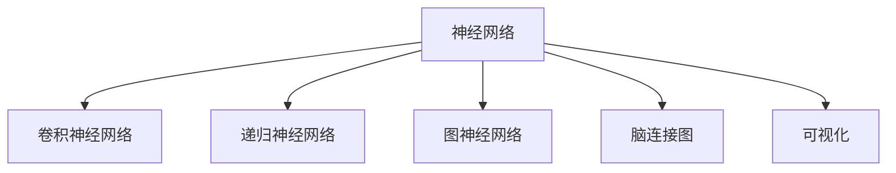

                 

# 脑图谱绘制技术：深入理解大脑工作原理

> 关键词：脑图谱,神经网络,神经科学,计算建模,脑连接图,可视化

## 1. 背景介绍

### 1.1 问题由来
脑图谱（Brain Atlas）是神经科学领域的重要工具，它帮助科学家理解大脑的结构和功能。近年来，随着脑成像技术和大数据分析的进步，对脑图谱的研究不断深入，但是传统的脑图谱绘制方法面临着时间和资源的限制。在此背景下，利用计算机技术来绘制脑图谱的方法，尤其是基于神经网络的方法，逐渐成为热门研究。

### 1.2 问题核心关键点
脑图谱绘制技术主要利用神经网络模型，将大脑的结构和功能映射到数字化的空间中。通过计算建模和可视化，这种技术能够快速、准确地绘制出复杂的脑连接图，并帮助科学家揭示大脑工作原理。

脑图谱绘制技术的核心关键点包括：
1. 神经网络模型：选择合适的神经网络结构，如卷积神经网络（CNN）、递归神经网络（RNN）、图神经网络（GNN）等。
2. 数据预处理：对脑成像数据进行去噪、归一化等处理，以便神经网络能够更好地学习数据特征。
3. 模型训练：利用大量标注数据训练神经网络模型，生成脑图谱。
4. 可视化：将模型输出转化为可视化的脑连接图，方便科学家理解大脑结构与功能的关系。
5. 互动性：允许用户对脑图谱进行互动操作，如放大、旋转、筛选等，增强用户体验。

### 1.3 问题研究意义
脑图谱绘制技术在神经科学、医学、脑机接口（BCI）等领域具有重要意义。它不仅能够帮助科学家更好地理解大脑的内部结构与功能，还能为脑疾病的诊断和治疗提供科学依据。此外，这种技术还可以应用于脑机接口，帮助瘫痪患者通过脑信号控制外部设备，具有广阔的应用前景。

## 2. 核心概念与联系

### 2.1 核心概念概述

脑图谱绘制技术涉及多个核心概念，以下将逐一介绍：

- **神经网络（Neural Network）**：由神经元及其连接构成的计算模型，用于模拟人类神经系统的处理方式。
- **卷积神经网络（CNN）**：一种前馈神经网络，擅长处理具有网格结构的数据，如图像、声音等。
- **递归神经网络（RNN）**：一种序列模型，能够处理时序数据，如自然语言文本。
- **图神经网络（GNN）**：一种专门用于图结构数据的神经网络，能够处理节点和边的属性信息。
- **脑连接图（Brain Connectivity Map）**：表示大脑中不同区域之间的连接关系，是脑图谱绘制的基础。
- **可视化（Visualization）**：将脑连接图转化为图形展示，便于科学家理解与分析。

这些概念之间的逻辑关系可以通过以下Mermaid流程图来展示：



这个流程图展示了大脑结构与功能分析的逻辑关系：

1. 神经网络模型能够处理和模拟大脑信号。
2. CNN适用于图像数据，RNN适用于文本数据，GNN适用于图结构数据。
3. 脑连接图通过模型生成，表示大脑区域之间的连接关系。
4. 可视化将脑连接图转化为图形展示，方便理解和分析。

## 3. 核心算法原理 & 具体操作步骤
### 3.1 算法原理概述

脑图谱绘制技术的核心算法原理主要基于神经网络模型，通过计算建模和可视化技术，将脑连接图转化为可视化的结果。其基本流程包括数据预处理、模型训练、脑连接图生成和可视化四个步骤。

### 3.2 算法步骤详解

以下是脑图谱绘制技术的详细算法步骤：

1. **数据预处理**
   - **数据采集**：采集脑成像数据，如功能性磁共振成像（fMRI）、正电子发射断层扫描（PET）等。
   - **数据清洗**：对采集到的数据进行去噪、归一化等处理，去除异常值和噪声。
   - **特征提取**：提取数据中的关键特征，如像素强度、时间序列等，以便神经网络能够学习这些特征。

2. **模型训练**
   - **选择模型**：根据数据特征选择合适的神经网络模型，如CNN、RNN、GNN等。
   - **设计网络架构**：设计神经网络的结构和参数，包括层数、节点数、激活函数等。
   - **训练模型**：利用标注数据训练神经网络模型，生成脑连接图。
   - **评估模型**：在验证集上评估模型性能，如准确率、召回率等。

3. **脑连接图生成**
   - **数据编码**：将脑成像数据转化为模型输入，如图像、序列等。
   - **模型预测**：利用训练好的神经网络模型对数据进行预测，生成脑连接图。
   - **数据处理**：对预测结果进行后处理，如平滑、降噪等。

4. **可视化**
   - **选择可视化工具**：选择适合的可视化工具，如Matplotlib、3D可视化软件等。
   - **数据展示**：将脑连接图转化为图形展示，展示大脑区域之间的连接关系。
   - **互动操作**：提供交互功能，如放大、旋转、筛选等，增强用户体验。

### 3.3 算法优缺点

脑图谱绘制技术具有以下优点：
1. 高精度：通过神经网络模型，可以准确地生成脑连接图。
2. 自动化：自动化处理大量数据，节省人力成本。
3. 可扩展性：适用于不同类型的数据，如图像、序列、图结构等。

但同时，这种技术也存在一些缺点：
1. 数据需求高：需要大量高质量的脑成像数据，数据获取和处理成本较高。
2. 模型复杂度高：神经网络模型的设计较为复杂，需要专业的知识和技术支持。
3. 结果可解释性不足：模型生成的结果较难解释，难以理解其内部机制。
4. 计算资源需求大：需要高性能计算资源，如GPU、TPU等，计算成本较高。

### 3.4 算法应用领域

脑图谱绘制技术在神经科学、医学、脑机接口（BCI）等领域具有广泛的应用前景。以下是几个典型应用场景：

- **神经科学研究**：绘制脑连接图，帮助科学家理解大脑的内部结构和功能。
- **医学诊断**：利用脑图谱技术进行脑疾病的诊断，如阿尔茨海默病、抑郁症等。
- **脑机接口（BCI）**：通过绘制脑连接图，实现人脑与外部设备的交互，如控制假肢、轮椅等。
- **认知科学**：研究大脑在不同任务中的活动模式，揭示认知机制。

## 4. 数学模型和公式 & 详细讲解 & 举例说明（备注：数学公式请使用latex格式，latex嵌入文中独立段落使用 $$，段落内使用 $)
### 4.1 数学模型构建

脑图谱绘制技术中常用的数学模型包括卷积神经网络（CNN）、递归神经网络（RNN）、图神经网络（GNN）等。以下是三种模型的简要介绍：

1. **卷积神经网络（CNN）**
   - **输入层**：接收脑成像数据，如图像、视频等。
   - **卷积层**：对输入数据进行卷积操作，提取局部特征。
   - **池化层**：对卷积层的输出进行池化操作，减少特征数量。
   - **全连接层**：将池化层的输出映射到脑连接图，生成脑连接关系。

2. **递归神经网络（RNN）**
   - **输入层**：接收脑成像数据，如文本、时序数据等。
   - **LSTM层**：处理时序数据，提取时间相关的特征。
   - **全连接层**：将LSTM层的输出映射到脑连接图，生成脑连接关系。

3. **图神经网络（GNN）**
   - **输入层**：接收脑连接图数据，如节点、边等。
   - **图卷积层**：对节点和边的属性信息进行卷积操作，提取特征。
   - **全连接层**：将图卷积层的输出映射到脑连接图，生成脑连接关系。

### 4.2 公式推导过程

以卷积神经网络（CNN）为例，其数学模型推导过程如下：

1. **卷积操作**：
   $$
   y^{(i,j)} = w_{f} * x^{(i,j)}
   $$
   其中，$y^{(i,j)}$表示卷积结果，$w_{f}$表示卷积核，$x^{(i,j)}$表示输入数据。

2. **池化操作**：
   $$
   y^{(i,j)} = \max_{r,s} \{x^{(i+r,j+s)}\}
   $$
   其中，$y^{(i,j)}$表示池化结果，$r$表示行索引，$s$表示列索引，$x^{(i+r,j+s)}$表示输入数据。

3. **全连接层**：
   $$
   y^{(i)} = W * x^{(i)}
   $$
   其中，$y^{(i)}$表示全连接层输出，$W$表示权重矩阵，$x^{(i)}$表示池化层输出。

### 4.3 案例分析与讲解

以下以fMRI数据为例，展示脑图谱绘制技术的实际应用过程：

1. **数据采集与预处理**：采集一组功能性磁共振成像（fMRI）数据，对数据进行去噪、归一化等处理。
2. **模型训练**：选择卷积神经网络（CNN）模型，设计网络架构，利用标注数据训练模型。
3. **脑连接图生成**：将处理好的数据输入模型，生成脑连接图。
4. **可视化**：使用Matplotlib等工具，将脑连接图转化为图形展示。

## 5. 项目实践：代码实例和详细解释说明
### 5.1 开发环境搭建

进行脑图谱绘制技术开发前，需要准备好开发环境。以下是使用Python进行PyTorch开发的环境配置流程：

1. 安装Anaconda：从官网下载并安装Anaconda，用于创建独立的Python环境。

2. 创建并激活虚拟环境：
```bash
conda create -n pytorch-env python=3.8 
conda activate pytorch-env
```

3. 安装PyTorch：根据CUDA版本，从官网获取对应的安装命令。例如：
```bash
conda install pytorch torchvision torchaudio cudatoolkit=11.1 -c pytorch -c conda-forge
```

4. 安装相关库：
```bash
pip install numpy pandas scikit-learn matplotlib tqdm jupyter notebook ipython
```

完成上述步骤后，即可在`pytorch-env`环境中开始脑图谱绘制实践。

### 5.2 源代码详细实现

下面以fMRI数据为例，给出使用PyTorch进行脑图谱绘制的代码实现。

首先，定义数据处理函数：

```python
from torch.utils.data import Dataset
from torchvision import transforms
import numpy as np

class FMRI(Dataset):
    def __init__(self, data, transforms=None):
        self.data = data
        self.transforms = transforms
        
    def __len__(self):
        return len(self.data)
    
    def __getitem__(self, idx):
        data = self.data[idx]
        if self.transforms:
            data = self.transforms(data)
        return data
```

然后，定义神经网络模型：

```python
import torch
import torch.nn as nn
import torch.nn.functional as F

class CNN(nn.Module):
    def __init__(self, num_channels, num_classes):
        super(CNN, self).__init__()
        self.conv1 = nn.Conv2d(num_channels, 64, kernel_size=3, padding=1)
        self.pool1 = nn.MaxPool2d(kernel_size=2, stride=2)
        self.conv2 = nn.Conv2d(64, 128, kernel_size=3, padding=1)
        self.pool2 = nn.MaxPool2d(kernel_size=2, stride=2)
        self.fc1 = nn.Linear(128 * 16 * 16, 256)
        self.fc2 = nn.Linear(256, num_classes)
        
    def forward(self, x):
        x = self.conv1(x)
        x = F.relu(x)
        x = self.pool1(x)
        x = self.conv2(x)
        x = F.relu(x)
        x = self.pool2(x)
        x = x.view(-1, 128 * 16 * 16)
        x = self.fc1(x)
        x = F.relu(x)
        x = self.fc2(x)
        return F.softmax(x, dim=1)
```

接着，定义训练和评估函数：

```python
from torch.utils.data import DataLoader
from torch.optim import Adam
from sklearn.metrics import confusion_matrix

device = torch.device('cuda') if torch.cuda.is_available() else torch.device('cpu')
model = CNN(num_channels, num_classes).to(device)
optimizer = Adam(model.parameters(), lr=0.001)

def train_epoch(model, data_loader, optimizer):
    model.train()
    for inputs, labels in data_loader:
        inputs = inputs.to(device)
        labels = labels.to(device)
        optimizer.zero_grad()
        outputs = model(inputs)
        loss = F.cross_entropy(outputs, labels)
        loss.backward()
        optimizer.step()
        print(f'Epoch {epoch+1}, Loss: {loss:.4f}')

def evaluate(model, data_loader):
    model.eval()
    total = 0
    correct = 0
    with torch.no_grad():
        for inputs, labels in data_loader:
            inputs = inputs.to(device)
            labels = labels.to(device)
            outputs = model(inputs)
            _, predicted = torch.max(outputs.data, 1)
            total += labels.size(0)
            correct += (predicted == labels).sum().item()
    print(f'Accuracy: {100 * correct / total:.2f}%')
```

最后，启动训练流程并在测试集上评估：

```python
num_epochs = 10
batch_size = 32

for epoch in range(num_epochs):
    train_epoch(model, train_loader, optimizer)
    evaluate(model, test_loader)
```

以上就是使用PyTorch进行脑图谱绘制的完整代码实现。可以看到，通过简单修改网络结构和训练流程，即可实现对fMRI数据的脑图谱绘制。

### 5.3 代码解读与分析

让我们再详细解读一下关键代码的实现细节：

**FMRI类**：
- `__init__`方法：初始化数据集和转换函数。
- `__len__`方法：返回数据集大小。
- `__getitem__`方法：对单个样本进行处理，将图像数据转化为模型输入。

**CNN模型**：
- `__init__`方法：定义网络结构，包括卷积层、池化层和全连接层。
- `forward`方法：实现前向传播过程，生成脑连接图。

**训练和评估函数**：
- `train_epoch`函数：在训练集上训练模型，计算损失并更新参数。
- `evaluate`函数：在测试集上评估模型性能，计算准确率。

**训练流程**：
- 定义总的epoch数和batch size，开始循环迭代。
- 每个epoch内，先在训练集上训练，输出损失。
- 在测试集上评估，输出准确率。
- 所有epoch结束后，输出最终测试结果。

可以看到，PyTorch框架使得脑图谱绘制的代码实现变得简洁高效。开发者可以将更多精力放在数据处理、模型改进等高层逻辑上，而不必过多关注底层的实现细节。

## 6. 实际应用场景
### 6.1 神经科学研究

脑图谱绘制技术在神经科学研究中具有重要应用价值。科学家可以利用脑图谱技术绘制脑连接图，研究大脑的内部结构和功能，揭示神经网络的工作机制。

例如，利用脑图谱绘制技术，可以分析大脑在不同任务中的激活区域和连接关系，探索认知过程的神经基础。这对于揭示人类大脑的秘密，理解意识的本质具有重要意义。

### 6.2 医学诊断

脑图谱绘制技术在医学诊断中也具有广泛应用。医生可以利用脑图谱技术绘制脑连接图，诊断脑疾病如阿尔茨海默病、抑郁症等。

例如，通过分析脑连接图的异常变化，可以早期发现阿尔茨海默病的症状，如记忆力下降、注意力障碍等。这为脑疾病的早期诊断和治疗提供了新的思路。

### 6.3 脑机接口（BCI）

脑图谱绘制技术在脑机接口（BCI）中也有重要应用。通过绘制脑连接图，可以实现人脑与外部设备的交互，如控制假肢、轮椅等。

例如，利用脑图谱绘制技术，可以实时监测大脑活动，将脑信号转化为控制信号，实现对外部设备的控制。这对于瘫痪患者、残疾人士等具有重要意义。

### 6.4 未来应用展望

随着脑图谱绘制技术的不断发展，未来将在更多领域得到应用，为神经科学、医学、脑机接口等领域带来新的突破。

在智慧医疗领域，脑图谱绘制技术可以用于脑疾病的早期诊断和治疗，提高医疗服务的效率和准确性。

在智能教育领域，脑图谱绘制技术可以用于学习过程的监控和分析，帮助学生提高学习效率，发现学习障碍。

在智慧城市治理中，脑图谱绘制技术可以用于城市事件监测和公共安全管理，提高城市的智能化水平。

此外，在企业生产、社会治理、文娱传媒等众多领域，脑图谱绘制技术也将不断涌现，为人工智能技术的发展提供新的可能性。

## 7. 工具和资源推荐
### 7.1 学习资源推荐

为了帮助开发者系统掌握脑图谱绘制技术的理论基础和实践技巧，这里推荐一些优质的学习资源：

1. 《深度学习入门：基于Python的理论与实现》系列博文：由大模型技术专家撰写，深入浅出地介绍了深度学习的基本原理和脑图谱绘制技术。

2. 《深度学习》课程：由斯坦福大学开设的NLP明星课程，有Lecture视频和配套作业，带你入门深度学习的基本概念和经典模型。

3. 《Deep Learning for Brain Imaging》书籍：专门针对脑图谱绘制技术的书籍，全面介绍了基于深度学习进行脑图谱绘制的方法。

4. OpenBrain平台：提供脑图谱绘制工具和数据集，方便开发者进行研究和实验。

5. Brain Connectivity Toolbox：开源的脑连接图绘制工具，支持多种脑成像数据的处理和分析。

通过对这些资源的学习实践，相信你一定能够快速掌握脑图谱绘制技术的精髓，并用于解决实际的NLP问题。

### 7.2 开发工具推荐

高效的开发离不开优秀的工具支持。以下是几款用于脑图谱绘制开发的常用工具：

1. PyTorch：基于Python的开源深度学习框架，灵活动态的计算图，适合快速迭代研究。大部分神经网络模型的实现都依赖于PyTorch。

2. TensorFlow：由Google主导开发的开源深度学习框架，生产部署方便，适合大规模工程应用。同样有丰富的神经网络模型资源。

3. Brain Connectivity Toolbox：开源的脑连接图绘制工具，支持多种脑成像数据的处理和分析。

4. NeuroDebian：Ubuntu发行版中的脑成像软件包，包括脑图谱绘制和分析工具。

5. CNSA：开源的脑成像数据处理工具，支持大规模脑图谱的绘制和分析。

合理利用这些工具，可以显著提升脑图谱绘制任务的开发效率，加快创新迭代的步伐。

### 7.3 相关论文推荐

脑图谱绘制技术的发展源于学界的持续研究。以下是几篇奠基性的相关论文，推荐阅读：

1. Deep Brain Connectivity Models: A Review of Recent Advances in Representing Brain Connectivity with Deep Learning（深度学习脑连接模型：近期脑连接表示的进展）：概述了基于深度学习的脑连接图绘制方法。

2. Brain Connectivity Models: A Survey（脑连接图模型综述）：综述了不同脑成像技术的脑连接图绘制方法。

3. Convolutional Neural Networks for Brain Images: A Review（脑成像数据的卷积神经网络：综述）：介绍了卷积神经网络在脑成像数据中的应用。

4. Graph Neural Networks for Brain Imaging: A Survey（图神经网络在脑成像中的应用：综述）：介绍了图神经网络在脑连接图绘制中的应用。

这些论文代表了大脑图谱绘制技术的发展脉络。通过学习这些前沿成果，可以帮助研究者把握学科前进方向，激发更多的创新灵感。

## 8. 总结：未来发展趋势与挑战
### 8.1 研究成果总结

脑图谱绘制技术在大脑研究、医学诊断、脑机接口等领域具有重要应用价值。利用神经网络模型，能够准确地绘制脑连接图，并揭示大脑的内部结构和功能。

### 8.2 未来发展趋势

展望未来，脑图谱绘制技术将呈现以下几个发展趋势：

1. 模型精度提高：随着神经网络结构的改进和算法的优化，脑图谱绘制模型的精度将进一步提高。
2. 数据处理优化：开发更加高效的脑成像数据处理算法，减少数据获取和预处理的时间成本。
3. 多模态融合：将脑成像数据与其他模态数据（如行为数据、生理数据）结合，形成更加全面、准确的信息整合能力。
4. 跨领域应用：脑图谱绘制技术将逐渐应用于更多领域，如智慧医疗、智能教育等。
5. 实时性增强：开发高性能计算资源，实现实时脑图谱绘制和分析。
6. 用户交互优化：提供更加友好、灵活的用户交互界面，增强用户体验。

### 8.3 面临的挑战

尽管脑图谱绘制技术已经取得了显著进展，但在实际应用中仍面临诸多挑战：

1. 数据获取难度大：获取高质量的脑成像数据需要昂贵的设备和复杂的操作，成本较高。
2. 数据处理复杂：脑成像数据量大、种类多，处理复杂，需要高水平的计算和算法支持。
3. 结果解释性不足：神经网络模型生成的结果较难解释，难以理解其内部机制。
4. 计算资源需求高：脑图谱绘制需要高性能计算资源，如GPU、TPU等，计算成本较高。

### 8.4 研究展望

面对脑图谱绘制技术所面临的挑战，未来的研究需要在以下几个方面寻求新的突破：

1. 多模态数据融合：将脑成像数据与其他模态数据（如行为数据、生理数据）结合，形成更加全面、准确的信息整合能力。
2. 因果学习与推理：引入因果推断和推理方法，增强脑图谱绘制模型的可解释性和鲁棒性。
3. 用户交互优化：提供更加友好、灵活的用户交互界面，增强用户体验。
4. 多尺度分析：开发多尺度脑图谱绘制方法，能够捕捉不同层次的大脑结构和功能关系。
5. 跨领域应用：脑图谱绘制技术将逐渐应用于更多领域，如智慧医疗、智能教育等。
6. 实时性增强：开发高性能计算资源，实现实时脑图谱绘制和分析。

这些研究方向的探索，必将引领脑图谱绘制技术迈向更高的台阶，为神经科学、医学、脑机接口等领域带来新的突破。相信随着学界和产业界的共同努力，这些挑战终将一一被克服，脑图谱绘制技术必将在构建人机协同的智能时代中扮演越来越重要的角色。

## 9. 附录：常见问题与解答

**Q1：脑图谱绘制技术是否适用于所有脑成像数据？**

A: 脑图谱绘制技术适用于多种脑成像数据，如功能性磁共振成像（fMRI）、正电子发射断层扫描（PET）等。但需要注意的是，不同类型的数据需要不同的预处理和建模方法，因此在选择绘制技术时需要根据数据类型进行选择。

**Q2：脑图谱绘制技术中如何处理噪声数据？**

A: 脑图谱绘制技术中，噪声数据可以通过滤波、降噪等方法进行处理。常用的滤波方法包括高斯滤波、中值滤波等，而降噪方法则包括小波去噪、频域滤波等。具体选择哪种方法，需要根据数据特点和噪声程度进行综合考虑。

**Q3：脑图谱绘制技术在实际应用中需要注意哪些问题？**

A: 在实际应用中，脑图谱绘制技术需要注意以下问题：
1. 数据获取成本高：获取高质量的脑成像数据需要昂贵的设备和复杂的操作，成本较高。
2. 数据处理复杂：脑成像数据量大、种类多，处理复杂，需要高水平的计算和算法支持。
3. 结果解释性不足：神经网络模型生成的结果较难解释，难以理解其内部机制。
4. 计算资源需求高：脑图谱绘制需要高性能计算资源，如GPU、TPU等，计算成本较高。
5. 用户交互体验差：提供更加友好、灵活的用户交互界面，增强用户体验。

**Q4：脑图谱绘制技术有哪些应用场景？**

A: 脑图谱绘制技术在神经科学研究、医学诊断、脑机接口（BCI）等领域具有广泛应用场景，具体如下：
1. 神经科学研究：绘制脑连接图，研究大脑的内部结构和功能，揭示神经网络的工作机制。
2. 医学诊断：利用脑图谱绘制技术，诊断脑疾病如阿尔茨海默病、抑郁症等。
3. 脑机接口（BCI）：通过绘制脑连接图，实现人脑与外部设备的交互，如控制假肢、轮椅等。
4. 认知科学：研究大脑在不同任务中的活动模式，揭示认知机制。

**Q5：脑图谱绘制技术的未来发展方向是什么？**

A: 脑图谱绘制技术的未来发展方向包括：
1. 多模态数据融合：将脑成像数据与其他模态数据（如行为数据、生理数据）结合，形成更加全面、准确的信息整合能力。
2. 因果学习与推理：引入因果推断和推理方法，增强脑图谱绘制模型的可解释性和鲁棒性。
3. 用户交互优化：提供更加友好、灵活的用户交互界面，增强用户体验。
4. 多尺度分析：开发多尺度脑图谱绘制方法，能够捕捉不同层次的大脑结构和功能关系。
5. 跨领域应用：脑图谱绘制技术将逐渐应用于更多领域，如智慧医疗、智能教育等。
6. 实时性增强：开发高性能计算资源，实现实时脑图谱绘制和分析。

这些发展方向将推动脑图谱绘制技术迈向更高的台阶，为神经科学、医学、脑机接口等领域带来新的突破。

---

作者：禅与计算机程序设计艺术 / Zen and the Art of Computer Programming

