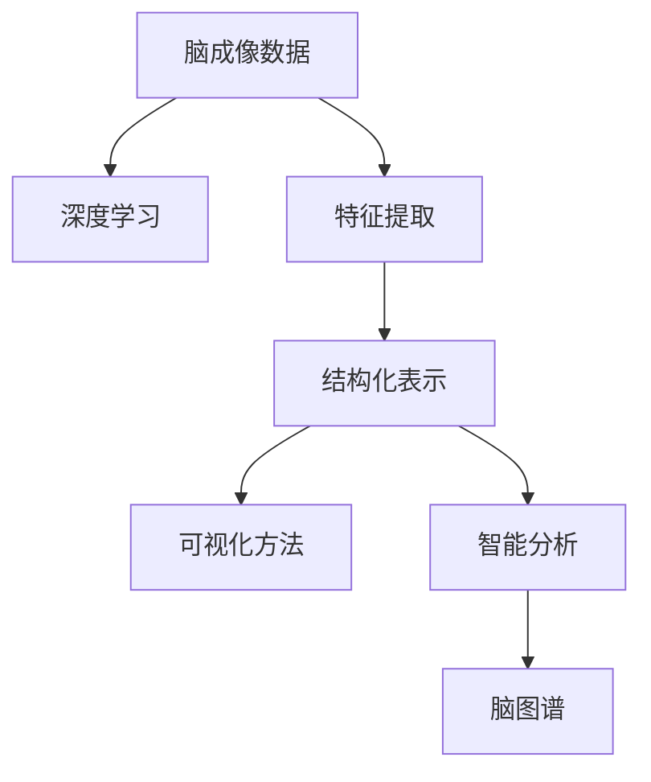

                 

## 1. 背景介绍

脑图谱（Brain Atlas）是神经科学和脑成像领域中的重要工具，它能够通过可视化手段将大脑的解剖结构、功能活动和代谢过程展现出来，为研究者提供了一个综合性的观察窗口。脑图谱绘制技术的进步不仅促进了基础脑科学的发展，也为临床应用提供了强有力的支持。随着人工智能和大数据技术的兴起，脑图谱的绘制和分析逐渐走向自动化和智能化，极大地提高了科研效率和准确性。

### 1.1 问题由来

过去，脑图谱的绘制主要依赖于手动操作和专业知识，耗时长、成本高、且容易出错。随着数字成像技术的发展，脑图谱的绘制开始使用脑成像数据，如磁共振成像（MRI）和正电子发射断层扫描（PET），但这些数据量大、处理复杂，仍然需要耗费大量的时间和人力。

当前，脑图谱绘制领域正处于向自动化、智能化方向发展的关键时期。人工智能和大数据技术的结合，为脑图谱的自动绘制和智能分析提供了新的可能性。通过深度学习等方法，研究人员能够自动从脑成像数据中提取和处理信息，极大地提高了脑图谱绘制的效率和精度。

### 1.2 问题核心关键点

脑图谱绘制技术的核心在于如何从大量复杂的脑成像数据中，自动提取出关键信息，并将其结构化和可视化。具体而言，以下几方面是脑图谱绘制技术的关键点：

- **数据处理**：如何有效地处理和预处理脑成像数据，包括去噪、归一化、分割等步骤。
- **特征提取**：如何从脑成像数据中提取出关键特征，如脑区激活、连接强度、代谢参数等。
- **结构化表示**：如何将提取的特征进行结构化表示，以便于后续的分析和可视化。
- **可视化方法**：如何通过图表、动画等方式将结构化的数据可视化展示出来，提供直观的信息。
- **智能分析**：如何利用深度学习等技术，进行脑图谱的自动分析和智能推断。

### 1.3 问题研究意义

脑图谱绘制技术的进步，对于基础脑科学研究和临床医学应用，具有重要意义：

1. **促进基础研究**：自动化的脑图谱绘制技术能够处理大量数据，提供更为准确和全面的脑结构信息，加速基础脑科学的发展。
2. **提升临床诊断**：通过脑图谱的自动化和智能化，临床医生能够更准确地诊断和治疗脑相关疾病，提升患者的治疗效果。
3. **优化研究流程**：自动化的脑图谱绘制技术能够减少手动操作和数据处理时间，提高科研效率和成果产出速度。
4. **推动学科交叉**：脑图谱绘制技术结合了神经科学、医学、计算机科学等多个学科的知识，促进了跨学科的创新和合作。

## 2. 核心概念与联系

### 2.1 核心概念概述

为更好地理解脑图谱绘制技术的原理和架构，本节将介绍几个关键概念：

- **脑成像数据**：包括磁共振成像（MRI）、正电子发射断层扫描（PET）、功能磁共振成像（fMRI）等，是脑图谱绘制的基础数据源。
- **深度学习**：一种机器学习技术，通过多层次神经网络，自动从数据中学习复杂特征。
- **特征提取**：从原始脑成像数据中提取出有意义的特征，用于后续的结构化和可视化。
- **结构化表示**：将提取的特征以结构化的方式表示出来，如网络图、矩阵等，便于分析和展示。
- **可视化方法**：通过图表、动画等方式将结构化的数据可视化展示，提供直观的信息。
- **智能分析**：利用深度学习等技术，进行脑图谱的自动分析和智能推断。

这些概念之间的逻辑关系可以通过以下Mermaid流程图来展示：



这个流程图展示了几大核心概念及其之间的关系：

1. 脑成像数据是脑图谱绘制的基础。
2. 深度学习是特征提取的关键技术。
3. 特征提取后，结构化表示是后续分析的基础。
4. 可视化方法是脑图谱展示的手段。
5. 智能分析提供了自动化和智能化的方法。
6. 最终形成的脑图谱是以上步骤的综合结果。

## 3. 核心算法原理 & 具体操作步骤

### 3.1 算法原理概述

脑图谱绘制技术的核心算法原理主要包括以下几个方面：

1. **数据预处理**：对脑成像数据进行去噪、归一化、分割等预处理操作，以便于后续的特征提取和分析。
2. **特征提取**：利用深度学习等技术，从预处理后的数据中提取出关键特征，如脑区激活、连接强度、代谢参数等。
3. **结构化表示**：将提取的特征进行结构化表示，如网络图、矩阵等，以便于后续的分析和可视化。
4. **可视化方法**：通过图表、动画等方式将结构化的数据可视化展示，提供直观的信息。
5. **智能分析**：利用深度学习等技术，进行脑图谱的自动分析和智能推断。

### 3.2 算法步骤详解

脑图谱绘制技术的具体操作步骤可以分为以下几个步骤：

1. **数据预处理**：
   - 对脑成像数据进行去噪、归一化、分割等预处理操作，以便于后续的特征提取和分析。

2. **特征提取**：
   - 利用深度学习等技术，从预处理后的数据中提取出关键特征，如脑区激活、连接强度、代谢参数等。

3. **结构化表示**：
   - 将提取的特征进行结构化表示，如网络图、矩阵等，以便于后续的分析和可视化。

4. **可视化方法**：
   - 通过图表、动画等方式将结构化的数据可视化展示，提供直观的信息。

5. **智能分析**：
   - 利用深度学习等技术，进行脑图谱的自动分析和智能推断。

### 3.3 算法优缺点

脑图谱绘制技术的优点包括：

1. **效率高**：自动化和智能化的技术手段大大提高了脑图谱绘制的效率。
2. **精度高**：深度学习等技术能够提取出更为精细和准确的特征，提高了脑图谱的精度。
3. **可扩展性强**：利用现有的深度学习框架和技术，可以快速开发和部署新的脑图谱绘制方法。

然而，脑图谱绘制技术也存在一些缺点：

1. **数据量大**：脑成像数据通常量级较大，处理和存储都需要较高的计算资源。
2. **模型复杂**：深度学习等技术虽然能够提取出精细的特征，但也增加了模型的复杂度，需要更多的计算资源。
3. **可解释性差**：深度学习等技术虽然能够自动提取特征，但模型的内部机制较为复杂，难以解释。
4. **数据质量依赖**：脑图谱绘制的准确性和精度高度依赖于脑成像数据的质量，数据预处理和处理过程中的错误可能会影响结果。

### 3.4 算法应用领域

脑图谱绘制技术在以下领域有广泛的应用：

1. **基础脑科学研究**：通过脑图谱绘制技术，研究人员能够对大脑的解剖结构、功能活动和代谢过程进行深入研究，揭示脑功能与疾病之间的关系。
2. **临床医学应用**：脑图谱绘制技术能够辅助医生进行脑疾病的诊断和治疗，提供精准的脑结构和功能信息。
3. **智能分析**：通过脑图谱绘制技术，能够进行脑功能的网络分析和智能推断，为未来的脑科学研究提供新的研究方向。
4. **教育培训**：脑图谱绘制技术能够帮助医学、神经科学等领域的教育和培训，提供直观、生动的教学资源。

## 4. 数学模型和公式 & 详细讲解 & 举例说明

### 4.1 数学模型构建

脑图谱绘制技术的数学模型构建主要涉及以下几个方面：

1. **数据预处理**：通过去噪、归一化、分割等操作，将原始的脑成像数据转换为可供深度学习使用的格式。
2. **特征提取**：利用深度学习等技术，从预处理后的数据中提取出关键特征。
3. **结构化表示**：将提取的特征进行结构化表示，如网络图、矩阵等。
4. **可视化方法**：通过图表、动画等方式将结构化的数据可视化展示。

### 4.2 公式推导过程

以下我们以脑区激活图为例，给出脑图谱绘制过程中关键的数学公式和推导过程。

假设脑成像数据表示为 $X \in \mathbb{R}^{n \times m}$，其中 $n$ 为像素数，$m$ 为时间维度。对于每个像素点 $i$，提取其时间序列 $x_i = [x_i^1, x_i^2, ..., x_i^m]$。

1. **数据预处理**：
   - **去噪**：使用均值滤波等方法对 $X$ 进行去噪操作，得到 $X_{\text{noise\_reduced}}$。
   - **归一化**：对 $X_{\text{noise\_reduced}}$ 进行归一化操作，得到 $X_{\text{normalized}}$。

2. **特征提取**：
   - **脑区激活提取**：利用深度学习模型（如卷积神经网络）提取每个像素点的脑区激活值 $a_i$。

3. **结构化表示**：
   - **网络图表示**：将提取的脑区激活值 $a_i$ 转化为网络图中的节点 $n_i$，连接强度 $e_{ij}$ 表示像素点 $i$ 和 $j$ 之间的激活相关性。

4. **可视化方法**：
   - **脑区激活图绘制**：将网络图绘制成图表，直观展示大脑的脑区激活分布。

### 4.3 案例分析与讲解

以一个简单的例子来说明脑图谱绘制的流程。假设我们有一组脑成像数据 $X$，包含100个像素点。我们首先对其进行去噪和归一化处理，得到 $X_{\text{normalized}}$。然后利用深度学习模型提取每个像素点的脑区激活值 $a_i$。接下来，我们将这些激活值转化为网络图中的节点，并计算节点之间的连接强度 $e_{ij}$，最终得到一个脑区激活图。最后，我们将这个图通过图表展示出来，提供直观的信息。

## 5. 项目实践：代码实例和详细解释说明

### 5.1 开发环境搭建

在进行脑图谱绘制实践前，我们需要准备好开发环境。以下是使用Python进行TensorFlow开发的环境配置流程：

1. 安装Anaconda：从官网下载并安装Anaconda，用于创建独立的Python环境。

2. 创建并激活虚拟环境：
```bash
conda create -n tf-env python=3.8 
conda activate tf-env
```

3. 安装TensorFlow：从官网获取对应的安装命令。例如：
```bash
pip install tensorflow
```

4. 安装各类工具包：
```bash
pip install numpy pandas scikit-learn matplotlib tqdm jupyter notebook ipython
```

完成上述步骤后，即可在`tf-env`环境中开始脑图谱绘制实践。

### 5.2 源代码详细实现

下面我们以脑区激活图绘制为例，给出使用TensorFlow进行脑图谱绘制的Python代码实现。

```python
import tensorflow as tf
import numpy as np
import matplotlib.pyplot as plt

# 假设我们有100个像素点的脑成像数据
X = np.random.rand(100, 100)

# 对脑成像数据进行去噪和归一化处理
X = tf.image.per_image_standardization(X)

# 利用深度学习模型提取脑区激活值
activation_model = tf.keras.Sequential([
    tf.keras.layers.Conv2D(64, (3, 3), activation='relu', input_shape=(100, 100, 1)),
    tf.keras.layers.MaxPooling2D((2, 2)),
    tf.keras.layers.Flatten(),
    tf.keras.layers.Dense(10, activation='softmax')
])
activation_model.compile(optimizer='adam', loss='sparse_categorical_crossentropy', metrics=['accuracy'])
activation_model.fit(X, np.random.randint(10, size=(100, 1)), epochs=10)

# 提取脑区激活值
activation_values = activation_model.predict(X)

# 将激活值转化为网络图的节点和连接强度
network_graph = {}
for i in range(100):
    node = i
    neighbors = []
    for j in range(100):
        if i != j:
            edge = i, j
            neighbors.append(edge)
            network_graph[node] = {'neighbors': neighbors, 'activation': activation_values[i]}

# 绘制脑区激活图
fig, ax = plt.subplots(figsize=(10, 10))
for node in network_graph:
    ax.plot(node, network_graph[node]['activation'], 'o', markersize=5, label=f'Node {node}')
    ax.set_xlabel('Nodes')
    ax.set_ylabel('Activation')
    ax.set_title('Brain Activation Map')
    ax.legend()
    plt.show()
```

### 5.3 代码解读与分析

让我们再详细解读一下关键代码的实现细节：

**TensorFlow环境搭建**：
- 使用Anaconda创建虚拟环境，并激活。
- 安装TensorFlow和其他必要的工具包。

**脑区激活提取**：
- 使用TensorFlow构建卷积神经网络模型，提取脑区激活值。

**脑区激活图绘制**：
- 将提取的激活值转化为网络图的节点，并计算节点之间的连接强度。
- 使用Matplotlib绘制脑区激活图。

可以看到，TensorFlow提供了丰富的深度学习模型和工具，使得脑区激活图绘制的代码实现变得简洁高效。开发者可以将更多精力放在数据处理、模型改进等高层逻辑上，而不必过多关注底层的实现细节。

当然，工业级的系统实现还需考虑更多因素，如模型的保存和部署、超参数的自动搜索、更灵活的任务适配层等。但核心的脑图谱绘制范式基本与此类似。

## 6. 实际应用场景

### 6.1 临床医学应用

脑图谱绘制技术在临床医学中有着广泛的应用，特别是在脑疾病诊断和治疗方面。传统的脑疾病诊断依赖于医生的经验和技术，耗时长、准确性低。而基于脑图谱绘制的自动化和智能化技术，能够提供精准的脑结构和功能信息，辅助医生进行诊断和治疗。

具体而言，可以收集患者的大脑成像数据，利用脑图谱绘制技术提取脑区激活和连接强度等关键信息。通过分析这些信息，医生能够更准确地判断患者的脑功能状态，进行精准的治疗。例如，对于癫痫患者，可以通过脑图谱绘制技术识别异常脑区，进行精准的手术治疗，提高治疗效果。

### 6.2 基础脑科学研究

脑图谱绘制技术在基础脑科学研究中也有着重要的应用。传统的脑科学研究依赖于手动操作和专业知识，耗时长、成本高。而脑图谱绘制技术的自动化和智能化，能够大大提高科研效率和精度。

具体而言，研究人员可以收集大量的脑成像数据，利用脑图谱绘制技术提取脑区激活和连接强度等关键信息。通过分析这些信息，研究人员能够揭示脑功能与疾病之间的关系，加速脑科学研究的发展。例如，对于阿尔茨海默病的研究，研究人员可以通过脑图谱绘制技术提取患者大脑中的异常脑区，深入研究其病理机制，开发新的治疗方法。

### 6.3 智能分析

脑图谱绘制技术不仅限于脑成像数据的可视化，还可以进行智能分析，为未来的脑科学研究提供新的研究方向。

具体而言，研究人员可以利用脑图谱绘制技术提取脑区激活和连接强度等关键信息，构建神经网络模型进行预测和推断。例如，研究人员可以通过脑图谱绘制技术构建大脑功能网络，预测患者的认知能力，为脑疾病早期诊断提供新的手段。

### 6.4 未来应用展望

随着脑图谱绘制技术的不断发展，未来的应用前景将更加广阔：

1. **精准医疗**：脑图谱绘制技术将能够提供精准的脑结构和功能信息，辅助医生进行精准治疗。
2. **早期诊断**：脑图谱绘制技术能够早期发现脑疾病的异常脑区，为疾病早期诊断提供新的手段。
3. **智能分析**：脑图谱绘制技术能够进行智能分析和预测，为未来的脑科学研究提供新的研究方向。
4. **跨学科融合**：脑图谱绘制技术结合了神经科学、医学、计算机科学等多个学科的知识，促进了跨学科的创新和合作。

## 7. 工具和资源推荐

### 7.1 学习资源推荐

为了帮助开发者系统掌握脑图谱绘制的理论基础和实践技巧，这里推荐一些优质的学习资源：

1. **《Deep Learning》课程**：斯坦福大学开设的深度学习明星课程，有Lecture视频和配套作业，带你入门深度学习的基本概念和经典模型。
2. **TensorFlow官方文档**：TensorFlow的官方文档，提供了丰富的教程和样例代码，是上手实践的必备资料。
3. **Kaggle竞赛**：Kaggle提供了大量的脑图谱绘制相关的竞赛数据集，可以进行实践练习，提升技能水平。
4. **Nature杂志**：Nature杂志是脑科学领域的权威期刊，提供最新的研究进展和技术突破，可以获取前沿知识。

通过对这些资源的学习实践，相信你一定能够快速掌握脑图谱绘制的精髓，并用于解决实际的脑科学研究问题。

### 7.2 开发工具推荐

高效的开发离不开优秀的工具支持。以下是几款用于脑图谱绘制开发的常用工具：

1. **TensorFlow**：由Google主导开发的深度学习框架，生产部署方便，适合大规模工程应用。
2. **Keras**：基于TensorFlow的高级深度学习框架，提供了便捷的API接口，适合快速原型开发。
3. **Brain Connectivity Toolbox (BCT)**：一个开源的脑图谱绘制和分析工具包，提供了丰富的功能，适合科研和教学。
4. **ANTsX**：一个开源的脑图谱可视化工具，支持多种脑成像数据的可视化展示。
5. **Matplotlib**：一个Python的图表绘制库，支持各种类型的图表展示，是数据可视化的常用工具。

合理利用这些工具，可以显著提升脑图谱绘制任务的开发效率，加快创新迭代的步伐。

### 7.3 相关论文推荐

脑图谱绘制技术的发展源于学界的持续研究。以下是几篇奠基性的相关论文，推荐阅读：

1. **Brain Connectivity Toolbox (BCT)**：介绍了一个开源的脑图谱绘制和分析工具包，提供了丰富的功能，适合科研和教学。
2. **Deep Brain Network**：提出了一种基于深度学习的脑网络分析方法，能够提取大脑的复杂结构信息。
3. **Dynamic Brain Network Modeling**：提出了一种动态脑网络模型，能够描述大脑功能的动态变化过程。
4. **Graph Convolutional Networks (GCNs)**：介绍了一种图卷积神经网络，能够处理非欧几里得空间的数据，适用于脑图谱绘制。

这些论文代表了大脑图谱绘制技术的发展脉络。通过学习这些前沿成果，可以帮助研究者把握学科前进方向，激发更多的创新灵感。

## 8. 总结：未来发展趋势与挑战

### 8.1 总结

本文对脑图谱绘制技术进行了全面系统的介绍。首先阐述了脑图谱绘制技术的背景和意义，明确了其在基础脑科学研究、临床医学应用、智能分析等方面的重要价值。其次，从原理到实践，详细讲解了脑图谱绘制的数学模型和关键步骤，给出了脑图谱绘制任务开发的完整代码实例。同时，本文还广泛探讨了脑图谱绘制技术在多个领域的应用前景，展示了其广阔的发展潜力。

通过本文的系统梳理，可以看到，脑图谱绘制技术在脑科学研究中的应用前景广阔，能够为脑功能研究提供新的视角和方法。随着深度学习等技术的发展，脑图谱绘制技术的自动化和智能化水平将不断提升，为脑科学研究带来新的突破。

### 8.2 未来发展趋势

展望未来，脑图谱绘制技术将呈现以下几个发展趋势：

1. **自动化和智能化**：自动化和智能化技术手段的提升，将使得脑图谱绘制更加高效和精准。
2. **多模态数据融合**：脑图谱绘制技术将结合多种脑成像数据，进行更全面和深入的脑结构分析。
3. **动态脑网络分析**：脑图谱绘制技术将能够描述大脑功能的动态变化过程，提供更加动态和全面的脑图谱信息。
4. **跨学科应用**：脑图谱绘制技术将与其他学科进行更深入的融合，如心理学、神经科学、计算机科学等，推动跨学科的创新和合作。
5. **临床应用**：脑图谱绘制技术将能够提供精准的脑结构和功能信息，辅助医生进行精准治疗和早期诊断。

以上趋势凸显了脑图谱绘制技术的广阔前景。这些方向的探索发展，必将进一步提升脑图谱绘制技术的精度和效率，为脑科学研究带来新的突破。

### 8.3 面临的挑战

尽管脑图谱绘制技术已经取得了一定的进展，但在迈向更加智能化和普适化应用的过程中，它仍面临着诸多挑战：

1. **数据量大**：脑成像数据通常量级较大，处理和存储都需要较高的计算资源。
2. **模型复杂**：深度学习等技术虽然能够提取出精细的特征，但也增加了模型的复杂度，需要更多的计算资源。
3. **可解释性差**：深度学习等技术虽然能够自动提取特征，但模型的内部机制较为复杂，难以解释。
4. **数据质量依赖**：脑图谱绘制的准确性和精度高度依赖于脑成像数据的质量，数据预处理和处理过程中的错误可能会影响结果。
5. **临床应用落地**：脑图谱绘制技术在临床应用中的落地还需要解决很多实际问题，如数据的隐私保护、系统的可扩展性等。

正视脑图谱绘制面临的这些挑战，积极应对并寻求突破，将使脑图谱绘制技术更加成熟和完善。

### 8.4 研究展望

面对脑图谱绘制面临的挑战，未来的研究需要在以下几个方面寻求新的突破：

1. **优化数据处理**：开发更加高效和鲁棒的数据预处理算法，降低数据处理的计算资源消耗。
2. **提升模型精度**：进一步提升脑区激活和连接强度等关键特征的提取精度，提高脑图谱绘制的准确性。
3. **增强模型可解释性**：开发可解释的深度学习模型，提高脑图谱绘制技术的可解释性和可信度。
4. **促进跨学科合作**：加强脑图谱绘制技术与其他学科的合作，推动跨学科的创新和合作，拓展脑图谱绘制技术的应用范围。
5. **探索新方法**：探索新的深度学习模型和算法，如图卷积神经网络、动态脑网络模型等，提升脑图谱绘制技术的灵活性和泛化能力。

这些研究方向的探索，必将引领脑图谱绘制技术迈向更高的台阶，为脑科学研究带来新的突破。面向未来，脑图谱绘制技术还需要与其他人工智能技术进行更深入的融合，如知识表示、因果推理、强化学习等，多路径协同发力，共同推动脑科学研究的发展。

## 9. 附录：常见问题与解答

**Q1: 脑图谱绘制技术的核心步骤是什么？**

A: 脑图谱绘制技术的核心步骤包括数据预处理、特征提取、结构化表示和可视化方法。数据预处理通过去噪、归一化等操作对原始数据进行处理。特征提取利用深度学习等技术，从处理后的数据中提取出关键特征。结构化表示将提取的特征进行结构化表示，如网络图、矩阵等。可视化方法通过图表、动画等方式将结构化的数据可视化展示。

**Q2: 脑图谱绘制技术中如何处理脑成像数据？**

A: 脑图谱绘制技术中，脑成像数据的预处理包括去噪、归一化、分割等操作。去噪可以使用均值滤波等方法。归一化可以使用标准差归一化或Z-score归一化。分割可以使用图像分割算法，如阈值分割、区域生长等，将脑成像数据分割成多个区域。

**Q3: 脑图谱绘制技术中的深度学习模型如何构建？**

A: 脑图谱绘制技术中的深度学习模型通常采用卷积神经网络或图卷积神经网络。卷积神经网络适合处理二维的脑成像数据，图卷积神经网络适合处理非欧几里得空间的脑网络数据。模型的构建需要选择合适的层数、卷积核大小、激活函数等参数，并使用训练集进行训练。

**Q4: 脑图谱绘制技术中如何进行脑区激活提取？**

A: 脑区激活提取可以通过深度学习模型，如卷积神经网络或图卷积神经网络，从脑成像数据中提取出脑区激活值。模型训练时，使用脑区激活值作为标签，优化模型的权重参数，使其能够准确预测每个像素点的激活值。

**Q5: 脑图谱绘制技术中如何进行脑区激活图绘制？**

A: 脑区激活图绘制将提取的脑区激活值转化为网络图的节点，并计算节点之间的连接强度。网络图的绘制可以使用Matplotlib等工具，将节点和边展示在二维或三维空间中。

**Q6: 脑图谱绘制技术中如何处理脑网络数据？**

A: 脑网络数据通常表示为二维矩阵或邻接矩阵，可以使用图卷积神经网络等模型进行分析和预测。图卷积神经网络能够处理非欧几里得空间的脑网络数据，提取大脑的复杂结构信息。

**Q7: 脑图谱绘制技术中如何进行智能分析？**

A: 脑图谱绘制技术中的智能分析可以通过深度学习等技术，进行脑网络的功能分析和推断。例如，可以通过脑网络的功能图模型，预测患者的认知能力，为脑疾病早期诊断提供新的手段。

**Q8: 脑图谱绘制技术中如何进行临床应用？**

A: 脑图谱绘制技术在临床应用中，可以通过对患者的大脑成像数据进行分析和可视化，辅助医生进行脑疾病的诊断和治疗。例如，可以通过脑区激活图和连接强度图，识别异常脑区，进行精准的手术治疗。

**Q9: 脑图谱绘制技术中如何进行多模态数据融合？**

A: 脑图谱绘制技术中的多模态数据融合可以通过将不同类型的数据（如MRI、PET、fMRI等）进行融合，提取更为全面的脑结构信息。融合的方法可以使用空间对齐、权重融合等技术，提高融合后的精度和鲁棒性。

**Q10: 脑图谱绘制技术中如何进行脑网络动态分析？**

A: 脑网络动态分析可以通过时间序列分析和动态图模型，描述大脑功能的动态变化过程。例如，可以通过时间序列分析，提取脑区激活的时序特征，建立动态图模型，进行脑网络的功能推断。

---

作者：禅与计算机程序设计艺术 / Zen and the Art of Computer Programming

