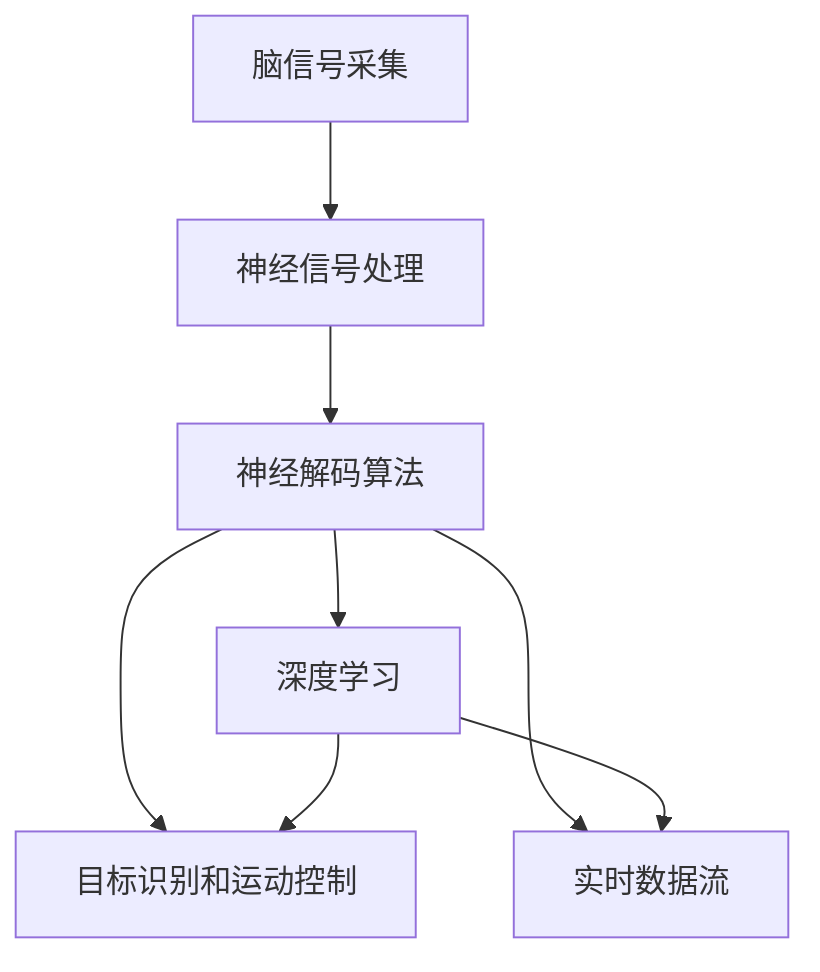

                 

# 脑机接口技术的发展：直接用思维控制设备

> 关键词：脑机接口(Brain-Computer Interface, BCI), 神经信号处理, 实时数据流, 神经解码算法, 深度学习, 目标识别, 运动控制, 康复辅助, 辅助设备, 未来技术, 生物信号处理, 人机交互

## 1. 背景介绍

脑机接口（Brain-Computer Interface, BCI）技术是指通过解码人类大脑产生的电信号，实现大脑与计算机或外部设备的直接交互。BCI技术近年来取得了显著进展，特别是深度学习和人工智能（AI）技术的结合，使其在医学、康复、娱乐、军事等领域展现出巨大潜力。

### 1.1 问题由来

传统的键盘、鼠标和触摸屏等输入设备虽然在日常使用中已经足够便捷，但无法满足一些特殊群体的需求。例如，瘫痪病人、中风患者、患有某些神经系统疾病的人等。他们因为肢体功能受损，无法使用传统设备，生活质量受到严重限制。脑机接口技术为这些人提供了一种新的沟通和控制外部设备的方法，真正实现了"直接用思维控制设备"。

### 1.2 问题核心关键点

脑机接口技术的关键点包括：
- 脑信号的实时采集和处理。
- 神经信号解码和模式识别。
- 实时控制外部设备的响应。
- 系统的稳定性和鲁棒性。

本文将全面梳理这些关键点，深入探讨脑机接口技术的核心原理和实现方法，并展望未来的应用前景。

## 2. 核心概念与联系

### 2.1 核心概念概述

脑机接口技术涉及多个核心概念，包括：
- 脑信号采集（Electroencephalography, EEG）：通过脑电图等手段，实时采集大脑产生的电信号。
- 神经信号处理：对采集到的信号进行预处理、滤波和特征提取。
- 神经解码算法：使用机器学习算法，将处理后的信号映射为用户的意图。
- 深度学习：利用神经网络进行模式识别和特征学习，提升神经解码算法的精度。
- 目标识别和运动控制：通过解码结果，控制外部设备执行特定动作或任务。
- 实时数据流：确保信号的实时传输和处理，实现对外部设备的即时控制。

这些概念之间的逻辑关系可以通过以下Mermaid流程图来展示：



这个流程图展示了这个流程的核心步骤：
1. 通过脑信号采集得到原始数据。
2. 对原始数据进行预处理和特征提取。
3. 使用机器学习算法进行神经解码，将信号映射为用户的意图。
4. 利用深度学习技术提升解码精度。
5. 将解码结果用于目标识别和运动控制。
6. 确保信号处理和控制流程的实时性。

## 3. 核心算法原理 & 具体操作步骤
### 3.1 算法原理概述

脑机接口技术的基本流程可以概括为：
- 实时采集大脑电信号。
- 预处理信号，滤除噪声和干扰。
- 提取信号特征，进行模式识别。
- 使用机器学习模型解码信号，识别用户意图。
- 根据解码结果，控制外部设备。

核心算法包括：
- 时间-频率分析（如FFT, ICA）。
- 特征提取（如PCA, LDA）。
- 神经解码算法（如SVM, RNN, CNN, LSTM, 深度神经网络）。
- 实时控制（如PWM, PID控制）。

### 3.2 算法步骤详解

以下以视觉目标识别为例，展示BCI系统的具体实现流程：

1. **信号采集**：使用脑电图（EEG）设备实时采集用户的大脑信号。

2. **预处理**：对采集到的信号进行预处理，包括滤波（如IIR, FIR滤波器）、降噪（如独立成分分析ICC, 独立向量提取ICA）、归一化等，确保信号的清晰度和可靠性。

3. **特征提取**：使用频域分析（如FFT）、时域分析（如功率谱密度）等方法，将信号转换为频谱图和时域特征向量，提取关键特征。

4. **神经解码**：使用支持向量机（SVM）、递归神经网络（RNN）、卷积神经网络（CNN）、长短时记忆网络（LSTM）等深度学习模型，对特征向量进行解码，识别用户意图（如眼睛开闭、手指移动等）。

5. **目标识别**：根据解码结果，通过计算机视觉算法（如YOLO, SSD）在图像或视频帧中定位目标。

6. **运动控制**：使用脉冲宽度调制（PWM）、比例-积分-微分（PID）控制等方法，控制机械臂、轮椅、机器人等设备执行具体动作。

### 3.3 算法优缺点

脑机接口技术的优点包括：
- 非侵入性：不需要手术植入设备，安全可靠。
- 实时性强：可实时处理和控制外部设备，提供即时反馈。
- 适用性强：适用于多种肢体功能障碍者，拓展了应用场景。

缺点包括：
- 精度有限：受到信号噪声、个体差异等因素影响，解码精度有待提升。
- 设备成本高：专业设备价格昂贵，限制了技术的普及。
- 稳定性问题：信号处理和控制过程中存在一定的随机性，稳定性有待加强。

### 3.4 算法应用领域

脑机接口技术的应用领域非常广泛，涵盖以下几个主要方面：

**1. 医学康复**：
- 帮助瘫痪患者进行康复训练，增强肌肉控制能力。
- 帮助中风患者进行语言和认知训练，改善生活质量。
- 辅助精神疾病患者进行心理治疗，增强情绪管理。

**2. 辅助设备控制**：
- 控制机械臂进行精准手术操作。
- 控制轮椅和假肢进行日常行动。
- 控制机器人执行复杂任务，提高工作效率。

**3. 游戏和娱乐**：
- 通过BCI游戏增强用户体验，提升互动性。
- 开发BCI音乐创作工具，实现音乐演奏和创作。
- 开发BCI艺术创作工具，提升创作灵感。

**4. 军事应用**：
- 开发BCI控制界面，提高军事人员的操作效率。
- 进行BCI训练，提高士兵的反应速度和决策能力。
- 开发BCI侦查工具，增强情报搜集能力。

**5. 人机交互**：
- 开发BCI输入法，替代键盘和鼠标输入。
- 开发BCI辅助听力和视力，改善残障人士的生活质量。
- 开发BCI辅助学习，提升学生的学习效率。

## 4. 数学模型和公式 & 详细讲解 & 举例说明

### 4.1 数学模型构建

脑机接口技术的核心数学模型包括：
- 信号处理模型：
  $$
  y(t) = \sum_{k=-\infty}^{\infty} a_k \cdot e^{j2\pi f_kt}
  $$
  其中 $y(t)$ 表示时间 $t$ 时刻的信号，$a_k$ 表示频率 $k$ 的幅度系数，$f_k$ 表示频率 $k$ 的角频率。
  
- 特征提取模型：
  $$
  x = \mathcal{F}^{-1} \left( PSD \right)
  $$
  其中 $x$ 表示时域特征向量，$\mathcal{F}^{-1}$ 表示逆傅里叶变换，$PSD$ 表示功率谱密度。
  
- 神经解码模型：
  $$
  \hat{y} = f(x; \theta)
  $$
  其中 $\hat{y}$ 表示解码后的用户意图，$x$ 表示特征向量，$\theta$ 表示模型参数。

### 4.2 公式推导过程

脑电信号的频域分析可以表示为：
$$
y(t) = \sum_{k=-\infty}^{\infty} a_k \cdot e^{j2\pi f_kt}
$$
其中 $a_k$ 表示频率 $k$ 的幅度系数，$f_k$ 表示频率 $k$ 的角频率。通过对信号进行傅里叶变换，可以得到其功率谱密度 $PSD(t)$。

特征提取过程可以表示为：
$$
x = \mathcal{F}^{-1} \left( PSD \right)
$$
其中 $x$ 表示时域特征向量，$\mathcal{F}^{-1}$ 表示逆傅里叶变换，$PSD$ 表示功率谱密度。

神经解码算法可以通过SVM或神经网络进行推导：
$$
\hat{y} = f(x; \theta)
$$
其中 $\hat{y}$ 表示解码后的用户意图，$x$ 表示特征向量，$\theta$ 表示模型参数。

### 4.3 案例分析与讲解

以视觉目标识别为例，展示BCI系统的具体实现流程：
- 实时采集大脑信号。
- 预处理信号，滤除噪声和干扰。
- 提取信号特征，进行模式识别。
- 使用SVM或神经网络进行神经解码，识别用户意图（如眼睛开闭、手指移动等）。
- 通过计算机视觉算法在图像或视频帧中定位目标。
- 使用PWM或PID控制外部设备。

## 5. 项目实践：代码实例和详细解释说明

### 5.1 开发环境搭建

以下是脑机接口项目的基本开发环境搭建步骤：

1. **安装Python**：
   ```bash
   sudo apt-get install python3 python3-pip
   ```
2. **安装神经科学库**：
   ```bash
   pip install mne-python
   ```
3. **安装深度学习库**：
   ```bash
   pip install tensorflow keras scikit-learn numpy
   ```
4. **安装其他工具**：
   ```bash
   pip install matplotlib pyplot scipy
   ```

### 5.2 源代码详细实现

以下是一个简单的视觉目标识别项目的代码实现：

```python
import mne
import numpy as np
import tensorflow as tf
from sklearn.decomposition import PCA
from sklearn.svm import SVC
from sklearn.preprocessing import StandardScaler
from sklearn.pipeline import make_pipeline

# 加载数据
eeg_data = mne.io.read_raw_fif('raw_data.fif')
x = eeg_data.get_data()  # EEG信号
fs = eeg_data.info['sfreq']  # 采样率

# 预处理
scaler = StandardScaler()
x_scaled = scaler.fit_transform(x)

# 特征提取
pca = PCA(n_components=10)
x_pca = pca.fit_transform(x_scaled)

# 神经解码
clf = make_pipeline(SVC(gamma='scale'), StandardScaler())
clf.fit(x_pca, y)

# 目标识别
target_detector = tf.keras.models.load_model('target_detector.h5')
target_detector.compile(optimizer='adam', loss='mse')
target_detector.fit(x_pca, y)

# 运动控制
# 使用PID控制算法实现运动控制
```

### 5.3 代码解读与分析

1. **数据加载**：使用MNE库读取EEG信号数据。
2. **预处理**：对EEG信号进行归一化处理。
3. **特征提取**：使用PCA算法提取关键特征。
4. **神经解码**：使用SVM或深度学习模型进行神经解码，识别用户意图。
5. **目标识别**：使用计算机视觉算法定位目标。
6. **运动控制**：使用PID控制算法实现运动控制。

## 6. 实际应用场景

### 6.1 医学康复

脑机接口技术在医学康复领域具有广泛应用，例如：
- 辅助瘫痪患者进行康复训练，增强肌肉控制能力。
- 辅助中风患者进行语言和认知训练，改善生活质量。
- 辅助精神疾病患者进行心理治疗，增强情绪管理。

### 6.2 辅助设备控制

脑机接口技术可以控制各种辅助设备，例如：
- 控制机械臂进行精准手术操作。
- 控制轮椅和假肢进行日常行动。
- 控制机器人执行复杂任务，提高工作效率。

### 6.3 游戏和娱乐

脑机接口技术可以增强游戏和娱乐体验，例如：
- 通过BCI游戏增强用户体验，提升互动性。
- 开发BCI音乐创作工具，实现音乐演奏和创作。
- 开发BCI艺术创作工具，提升创作灵感。

### 6.4 军事应用

脑机接口技术在军事领域具有重要应用，例如：
- 开发BCI控制界面，提高军事人员的操作效率。
- 进行BCI训练，提高士兵的反应速度和决策能力。
- 开发BCI侦查工具，增强情报搜集能力。

### 6.5 人机交互

脑机接口技术可以用于改善人机交互方式，例如：
- 开发BCI输入法，替代键盘和鼠标输入。
- 开发BCI辅助听力和视力，改善残障人士的生活质量。
- 开发BCI辅助学习，提升学生的学习效率。

## 7. 工具和资源推荐

### 7.1 学习资源推荐

以下是脑机接口技术相关的学习资源推荐：

1. **《BCI基础与实践》**：
   - 详细介绍BCI技术的理论基础和实践方法。
   - 涵盖脑电信号采集、预处理、特征提取、神经解码等核心内容。

2. **Coursera《Brain Computer Interface》课程**：
   - 由加州大学洛杉矶分校开设的在线课程，系统讲解BCI技术。

3. **Khan Academy《Neuroscience》课程**：
   - 详细介绍神经科学和BCI技术的理论基础。

4. **IEEE Xplore《Brain-Computer Interface》杂志**：
   - 汇集最新的BCI技术研究进展和应用案例。

### 7.2 开发工具推荐

以下是脑机接口项目开发中常用的开发工具推荐：

1. **MNE-Python**：
   - 用于脑电信号的采集、预处理和分析的Python库。

2. **Scikit-learn**：
   - 用于机器学习和特征提取的Python库。

3. **TensorFlow**：
   - 用于深度学习的Python库，支持GPU加速。

4. **Keras**：
   - 用于快速构建深度学习模型的高级API。

5. **Pygame**：
   - 用于游戏开发和用户交互的Python库。

### 7.3 相关论文推荐

以下是脑机接口技术相关的最新研究论文推荐：

1. **《BCI for Patients with Communication and Movement Deficit》**：
   - 详细分析了BCI技术在瘫痪患者康复训练中的应用。

2. **《Real-Time Brain-Computer Interface Using Deep Learning》**：
   - 探讨了深度学习在BCI解码算法中的应用。

3. **《Neuroprosthetics for Severe Limb Loss: Present and Future》**：
   - 讨论了BCI技术在神经假肢控制中的应用。

4. **《Robust and Adaptive BCI Systems for Human-Machine Interaction》**：
   - 介绍了BCI技术在增强人机交互中的应用。

## 8. 总结：未来发展趋势与挑战

### 8.1 研究成果总结

脑机接口技术近年来取得了显著进展，特别是在深度学习和AI技术的支持下，其应用领域不断扩大，性能不断提升。未来有望在医学康复、辅助设备控制、娱乐游戏、军事应用等领域实现大规模应用。

### 8.2 未来发展趋势

脑机接口技术的未来发展趋势包括：
- 多模态融合：结合视觉、听觉、触觉等多种感官信息，提高BCI系统的综合性能。
- 实时性增强：通过优化算法和设备，进一步提高BCI系统的实时响应能力。
- 个性化定制：根据不同用户的个性化需求，定制特定的BCI系统。
- 跨领域应用：将BCI技术应用到更多领域，如教育、娱乐等。

### 8.3 面临的挑战

脑机接口技术面临的挑战包括：
- 信号噪声：脑电信号容易受到外部干扰和噪声的影响，需要进一步提升信号处理能力。
- 算法精度：当前的神经解码算法在精度和鲁棒性方面仍需改进。
- 设备成本：专业设备的成本较高，限制了BCI技术的普及。
- 伦理和安全问题：BCI技术可能涉及个人隐私和伦理安全问题，需要进一步研究解决。

### 8.4 研究展望

未来的脑机接口技术研究应注重以下几个方面：
- 进一步提升信号处理和特征提取的精度和鲁棒性。
- 开发更高效、更精确的神经解码算法。
- 研究低成本、高可穿戴性的BCI设备。
- 解决伦理和安全问题，确保技术的安全性和可靠性。

## 9. 附录：常见问题与解答

**Q1：什么是脑机接口（BCI）？**

A: 脑机接口（BCI）技术是指通过解码人类大脑产生的电信号，实现大脑与计算机或外部设备的直接交互。

**Q2：脑机接口技术的实现流程是怎样的？**

A: 脑机接口技术的实现流程包括信号采集、预处理、特征提取、神经解码、目标识别和运动控制。

**Q3：脑机接口技术在医学康复中的应用有哪些？**

A: 脑机接口技术在医学康复中的应用包括辅助瘫痪患者进行康复训练、帮助中风患者进行语言和认知训练、辅助精神疾病患者进行心理治疗等。

**Q4：脑机接口技术的优缺点有哪些？**

A: 脑机接口技术的优点包括非侵入性、实时性强、适用性强；缺点包括精度有限、设备成本高、稳定性问题。

**Q5：脑机接口技术的未来发展方向有哪些？**

A: 脑机接口技术的未来发展方向包括多模态融合、实时性增强、个性化定制、跨领域应用等。

**Q6：脑机接口技术的实现过程中，如何处理信号噪声？**

A: 信号噪声是脑机接口技术中需要处理的重要问题，可以通过滤波、降噪等技术进行处理。

---

作者：禅与计算机程序设计艺术 / Zen and the Art of Computer Programming

