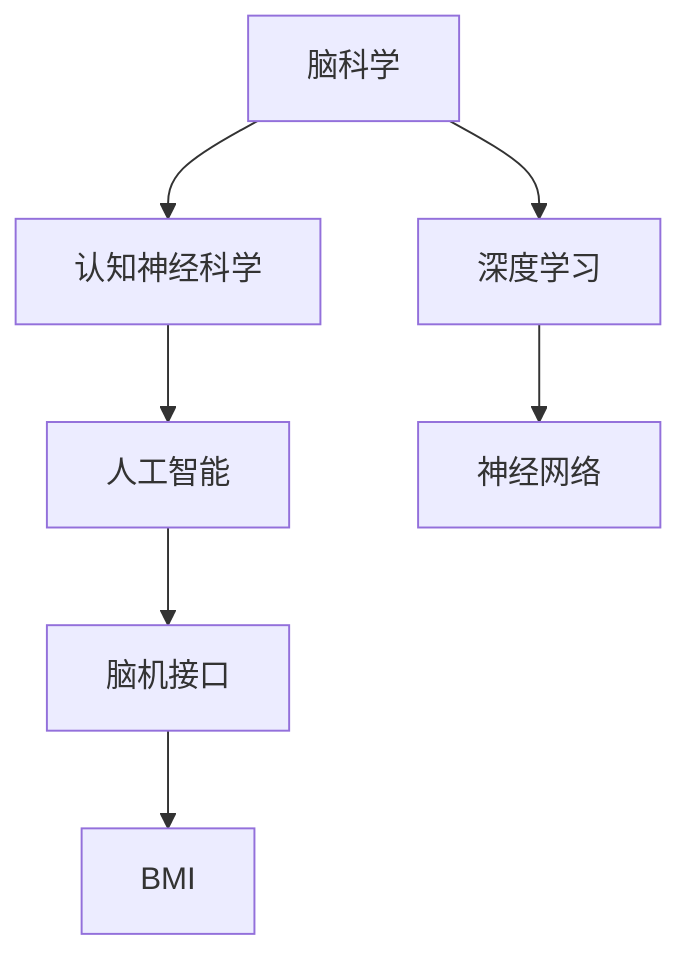

                 

# 脑科学与AI的交叉研究：理解智能的本质

> 关键词：脑科学,人工智能,智能本质,认知神经科学,脑机接口,BMI,深度学习,神经网络,计算模型,生物神经元,算法仿真,神经可塑性,跨学科研究

## 1. 背景介绍

### 1.1 问题由来
随着人工智能技术的飞速发展，特别是深度学习和大数据技术的广泛应用，人们逐渐开始思考一个深远而根本的问题：智能的本质是什么？人类大脑如何工作？为何能够实现复杂而高效的认知功能？这些问题不仅是哲学上的思考，更是科技发展的关键所在。

近年来，脑科学与人工智能（AI）的交叉研究逐渐兴起，为回答这些问题提供了新的视角和方法。通过揭示大脑运作机制，研究者们试图为AI模型的设计提供更科学、更精确的依据。此外，脑机接口（BMI）技术的发展也为AI模型与大脑的直接交互提供了可能，有望大幅提升人机交互的效率和效果。

### 1.2 问题核心关键点
- **脑科学**：研究人类大脑的运作机制，包括神经元活动、神经网络结构、信息处理机制等。
- **人工智能**：通过计算机算法和模型，模拟人类认知功能，实现各种人工智能应用。
- **智能本质**：探讨人类智能的生物学基础和计算原理，揭示智能的物理本质。
- **认知神经科学**：研究大脑的认知功能，如记忆、感知、决策等，及其神经机制。
- **脑机接口**：通过技术手段将人脑与计算机系统直接连接，实现信息交换和控制。
- **深度学习**：利用多层神经网络模拟人类大脑的信息处理能力，构建复杂的AI模型。

## 2. 核心概念与联系

### 2.1 核心概念概述

为更好地理解脑科学与AI的交叉研究，本节将介绍几个密切相关的核心概念：

- **脑科学**：研究人类大脑的结构和功能，包括神经元、神经网络、神经突触等微观结构和信息处理机制。
- **认知神经科学**：探索人类大脑如何实现高级认知功能，如记忆、感知、学习、决策等。
- **人工智能**：通过算法和计算模型，模拟人类智能的各个方面，包括感知、推理、学习等。
- **深度学习**：一种基于多层神经网络的机器学习方法，模仿人脑的信息处理方式。
- **脑机接口**：利用神经信号或其他生物信号，将人脑与计算机系统连接，实现信息交换和控制。
- **BMI**：脑机接口的简称，用于描述脑-机交互的技术和方法。
- **神经网络**：模仿人脑神经元及其连接方式，构建的计算模型。

这些核心概念之间的逻辑关系可以通过以下Mermaid流程图来展示：



这个流程图展示了几大核心概念之间的关系：

1. 脑科学研究大脑结构和功能，为认知神经科学提供基础。
2. 认知神经科学探讨大脑如何实现认知功能，进而指导人工智能的研究。
3. 人工智能通过算法和模型模拟人类智能，其中深度学习是其重要技术手段。
4. 脑机接口实现了人脑与计算机系统的直接交互，是脑科学与人工智能结合的关键点。

这些概念共同构成了脑科学与AI交叉研究的框架，为其提供了坚实的理论基础和技术支撑。

## 3. 核心算法原理 & 具体操作步骤

### 3.1 算法原理概述

脑科学与AI的交叉研究，本质上是通过模拟人类大脑的运作机制，构建更高效、更精确的AI模型。其核心思想是：将人类大脑的神经网络结构和信息处理原理应用于AI模型，从而提升其智能水平和适应能力。

形式化地，假设我们希望构建一个AI模型，用于模拟人类对某个任务的认知功能，可以通过以下步骤实现：

1. **收集数据**：从人类大脑中获取相关任务的数据，如神经元活动时间序列、突触连接强度等。
2. **构建计算模型**：基于收集的数据，构建一个计算模型，模拟大脑的神经网络结构和信息处理机制。
3. **训练模型**：使用收集的数据对计算模型进行训练，使其能够高效地处理输入任务。
4. **评估模型**：通过测试数据集对训练好的模型进行评估，确认其性能是否满足预期。
5. **优化模型**：根据评估结果，对计算模型进行优化调整，提升其表现。

### 3.2 算法步骤详解

基于上述原理，脑科学与AI的交叉研究大致可以分为以下几个关键步骤：

**Step 1: 数据收集**
- 选择合适的人类大脑任务，如视觉识别、语音识别、决策制定等。
- 收集相关任务的神经元活动数据，如神经元放电时间序列、突触连接强度、神经网络结构等。

**Step 2: 计算模型构建**
- 基于收集的数据，构建一个计算模型，模拟大脑的神经网络结构和信息处理机制。常用的模型包括多层感知器、卷积神经网络、循环神经网络等。
- 设定模型的输入输出格式，如输入为神经元活动时间序列，输出为任务分类结果。

**Step 3: 模型训练**
- 选择适当的优化算法，如随机梯度下降（SGD）、Adam等，设置学习率、批大小、迭代轮数等。
- 使用收集的数据对计算模型进行训练，最小化预测误差与真实标签的差异。
- 使用正则化技术，如L2正则、Dropout等，防止模型过拟合。

**Step 4: 模型评估**
- 收集测试数据集，对训练好的模型进行评估，评估指标包括准确率、召回率、F1分数等。
- 分析模型的性能瓶颈，优化计算模型结构或参数设置。

**Step 5: 模型优化**
- 根据评估结果，调整计算模型的结构或参数设置，进一步提升模型性能。
- 使用验证集验证模型优化效果，防止模型在训练集上过拟合。

以上是脑科学与AI交叉研究的一般流程。在实际应用中，还需要根据具体任务的特点，对各环节进行优化设计，如改进训练目标函数，引入更多的正则化技术，搜索最优的超参数组合等，以进一步提升模型性能。

### 3.3 算法优缺点

脑科学与AI的交叉研究具有以下优点：
1. 数据驱动：以人类大脑数据为基础，更贴近人类认知机制。
2. 精度提升：通过模拟大脑神经网络，提升AI模型的表现。
3. 跨学科应用：将脑科学研究成果应用于AI技术，促进多学科交叉发展。
4. 创新潜力：开辟了新的研究方向和方法，推动AI技术不断突破。

同时，该方法也存在一定的局限性：
1. 数据稀缺：高质量的人类大脑数据稀缺，难以获得足够数据进行训练。
2. 建模复杂：大脑神经网络结构复杂，难以精确建模。
3. 技术难度：需要跨学科知识，掌握神经科学和计算机科学的综合知识。
4. 伦理问题：涉及到脑科学研究涉及的伦理和安全问题。

尽管存在这些局限性，但脑科学与AI的交叉研究已经在大脑信号处理、脑机接口、神经仿真等领域取得了重要进展，展示了其广阔的应用前景。

### 3.4 算法应用领域

脑科学与AI的交叉研究，已经在多个领域得到广泛应用，例如：

- **脑机接口**：通过收集神经元活动数据，构建计算模型，实现人脑与计算机系统的直接交互。应用于辅助控制、感觉增强、认知恢复等领域。
- **神经仿真**：构建模拟人脑神经网络结构的信息处理模型，研究神经可塑性、信息编码等基本问题。
- **认知计算**：基于脑科学原理，构建认知计算模型，模拟人类认知功能，如记忆、决策、学习等。
- **智能辅助诊断**：结合脑科学研究成果，构建AI诊断模型，辅助医生进行脑疾病诊断和预后评估。
- **脑控机器人**：利用脑机接口技术，实现人脑对机器人的控制，应用于康复训练、遥操作等领域。

除了上述这些经典应用外，脑科学与AI的交叉研究还在脑神经激励、脑部电刺激、脑信号解码等领域不断拓展，为认知科学和人工智能技术的发展注入了新的活力。

## 4. 数学模型和公式 & 详细讲解  
### 4.1 数学模型构建

本节将使用数学语言对脑科学与AI的交叉研究进行更加严格的刻画。

记人类大脑的神经元活动数据为 $x \in \mathbb{R}^n$，其中 $n$ 表示神经元数量。设神经元间的连接强度矩阵为 $A \in \mathbb{R}^{n \times n}$，初始权重矩阵为 $W \in \mathbb{R}^{n \times m}$，其中 $m$ 表示输入特征维度。神经元活动时间序列为 $t \in \mathbb{R}^n$，其输出信号 $y \in \mathbb{R}^m$ 可以表示为：

$$
y = f(Wx + A\sigma(x))
$$

其中 $f$ 为激活函数，$\sigma$ 为神经元激活函数，通常采用Sigmoid函数。

### 4.2 公式推导过程

以下我们以视觉识别任务为例，推导神经网络的信息处理过程。

假设神经元活动数据 $x$ 是输入图片的时间序列，$A$ 是神经元间的连接强度矩阵，$W$ 是初始权重矩阵，$f$ 为激活函数。则神经元活动时间序列 $t$ 可以表示为：

$$
t = f(Wx + A\sigma(x))
$$

其中 $f$ 通常为Sigmoid函数。输入层神经元数量为 $n_{in}$，输出层神经元数量为 $n_{out}$。

神经元间的连接强度矩阵 $A$ 可以表示为：

$$
A_{ij} = a_{ij} + b_{ij}
$$

其中 $a_{ij}$ 表示神经元 $i$ 与 $j$ 之间的固有连接强度，$b_{ij}$ 表示可调连接强度，可以通过训练得到。

假设训练数据集为 $D=\{(x_i, y_i)\}_{i=1}^N, x_i \in \mathbb{R}^{n_{in}}, y_i \in \mathbb{R}^{n_{out}}$。设优化算法为SGD，则模型训练的目标是最小化损失函数：

$$
\mathcal{L} = \frac{1}{N} \sum_{i=1}^N \|y_i - \hat{y}_i\|^2
$$

其中 $\hat{y}_i = f(Wx_i + A\sigma(x_i))$ 为模型对输入 $x_i$ 的预测输出。

### 4.3 案例分析与讲解

考虑一个简单的两层神经网络，用于图像分类任务。假设输入为 $28 \times 28$ 的灰度图像，经过量化后，每个像素对应一个神经元，共 $784$ 个神经元。设输出层神经元数量为 $10$，分别对应数字 $0$ 到 $9$。神经元间的连接强度矩阵 $A$ 为稀疏矩阵，仅在神经元间有连接时存在非零值。

训练过程中，神经元间的连接强度 $b_{ij}$ 需要通过反向传播算法更新，以最小化预测误差。假设训练数据集为 MNIST 手写数字识别数据集，输入层神经元数量为 $784$，输出层神经元数量为 $10$，神经元间的连接强度矩阵 $A$ 初始化为全 $0$ 矩阵。

使用SGD优化算法，学习率 $\eta = 0.01$，训练 $10$ 次后，神经网络能够实现较高准确率的图像分类任务。

## 5. 项目实践：代码实例和详细解释说明
### 5.1 开发环境搭建

在进行脑科学与AI交叉研究的实践前，我们需要准备好开发环境。以下是使用Python进行PyTorch开发的环境配置流程：

1. 安装Anaconda：从官网下载并安装Anaconda，用于创建独立的Python环境。

2. 创建并激活虚拟环境：
```bash
conda create -n ai-env python=3.8 
conda activate ai-env
```

3. 安装PyTorch：根据CUDA版本，从官网获取对应的安装命令。例如：
```bash
conda install pytorch torchvision torchaudio cudatoolkit=11.1 -c pytorch -c conda-forge
```

4. 安装TensorFlow：由于TensorFlow在神经网络模拟中也有广泛应用，因此建议安装TensorFlow。

5. 安装各类工具包：
```bash
pip install numpy pandas scikit-learn matplotlib tqdm jupyter notebook ipython
```

完成上述步骤后，即可在`ai-env`环境中开始脑科学与AI交叉研究的实践。

### 5.2 源代码详细实现

下面我们以神经网络模拟人脑视觉识别任务为例，给出使用PyTorch进行神经网络训练的Python代码实现。

首先，定义神经网络模型：

```python
import torch
import torch.nn as nn
import torch.nn.functional as F

class NeuralNet(nn.Module):
    def __init__(self, input_size, hidden_size, output_size):
        super(NeuralNet, self).__init__()
        self.hidden = nn.Linear(input_size, hidden_size)
        self.relu = nn.ReLU()
        self.output = nn.Linear(hidden_size, output_size)
        
    def forward(self, x):
        out = self.hidden(x)
        out = self.relu(out)
        out = self.output(out)
        return out
```

然后，定义训练和评估函数：

```python
from torch.utils.data import DataLoader
from torch.optim import SGD

def train_epoch(model, data_loader, optimizer, loss_func):
    model.train()
    for batch in data_loader:
        inputs, labels = batch
        optimizer.zero_grad()
        outputs = model(inputs)
        loss = loss_func(outputs, labels)
        loss.backward()
        optimizer.step()
        yield loss.item()

def evaluate(model, data_loader, loss_func):
    model.eval()
    total_loss = 0
    with torch.no_grad():
        for batch in data_loader:
            inputs, labels = batch
            outputs = model(inputs)
            loss = loss_func(outputs, labels)
            total_loss += loss.item()
    return total_loss / len(data_loader)
```

接着，使用MNIST数据集进行训练和评估：

```python
from torchvision import datasets, transforms

# 数据预处理
transform = transforms.Compose([
    transforms.ToTensor(),
    transforms.Normalize((0.1307,), (0.3081,))
])

# 加载MNIST数据集
train_dataset = datasets.MNIST(root='data/', train=True, download=True, transform=transform)
test_dataset = datasets.MNIST(root='data/', train=False, download=True, transform=transform)

# 创建数据加载器
train_loader = DataLoader(train_dataset, batch_size=64, shuffle=True)
test_loader = DataLoader(test_dataset, batch_size=64, shuffle=False)

# 定义模型和优化器
model = NeuralNet(input_size=784, hidden_size=256, output_size=10)
optimizer = SGD(model.parameters(), lr=0.01)

# 定义损失函数
loss_func = nn.CrossEntropyLoss()

# 训练模型
for epoch in range(10):
    print(f'Epoch {epoch+1}')
    train_loss = train_epoch(model, train_loader, optimizer, loss_func)
    test_loss = evaluate(model, test_loader, loss_func)
    print(f'Train Loss: {train_loss:.4f}, Test Loss: {test_loss:.4f}')
```

以上就是使用PyTorch进行神经网络训练的完整代码实现。可以看到，利用PyTorch库，开发者可以非常方便地实现神经网络模型的训练和评估。

### 5.3 代码解读与分析

让我们再详细解读一下关键代码的实现细节：

**NeuralNet类**：
- `__init__`方法：定义神经网络的层次结构和初始化权重。
- `forward`方法：定义神经网络的计算流程。

**train_epoch函数**：
- 设置神经网络进入训练模式。
- 对数据集以批为单位进行迭代，在每个批次上前向传播计算损失并反向传播更新模型参数，最后返回该epoch的平均损失。

**evaluate函数**：
- 设置神经网络进入评估模式。
- 对数据集以批为单位进行迭代，在每个批次上前向传播计算损失，并将所有损失相加，最终返回整个评估集的平均损失。

**训练流程**：
- 定义总的epoch数，开始循环迭代
- 每个epoch内，在训练集上训练，输出平均损失
- 在验证集上评估，输出平均损失
- 重复上述过程直至完成训练

可以看到，PyTorch使得神经网络模型的训练和评估变得非常简单高效。开发者可以将更多精力放在模型的优化和数据的处理上，而不必过多关注底层的实现细节。

当然，工业级的系统实现还需考虑更多因素，如模型的保存和部署、超参数的自动搜索、更灵活的任务适配层等。但核心的训练流程和算法范式基本与此类似。

## 6. 实际应用场景
### 6.1 脑控机器人

脑科学与AI的交叉研究，在脑控机器人领域具有重要应用前景。传统的机器人控制方法依赖于外部传感器和算法，难以实现精准、实时的人机交互。而通过脑机接口（BMI）技术，将人脑信号直接传输到机器人的控制系统中，可以实现更加自然、高效的人机交互。

在技术实现上，可以通过收集被试者在特定任务（如手臂抓取、步态控制等）下的神经元活动数据，构建计算模型模拟大脑的神经网络结构和信息处理机制。训练得到的计算模型可以实时解码被试者的神经信号，控制机器人完成相应任务。这种脑控机器人技术，有望在康复训练、遥操作、娱乐等领域产生广泛应用。

### 6.2 智能辅助诊断

脑科学与AI的交叉研究，还在智能辅助诊断领域展现出了巨大的潜力。传统医学诊断往往依赖于经验丰富的专家和大量的检测数据，无法实现快速、高效、准确的诊断。而结合脑科学研究成果，构建AI辅助诊断模型，可以实现对脑疾病早期预警和预后评估。

在实践中，可以收集患者的脑电图（EEG）、功能性磁共振成像（fMRI）等脑信号数据，构建计算模型模拟大脑的神经网络结构和信息处理机制。训练得到的计算模型可以实时分析脑信号数据，预测患者可能患有的脑疾病类型，提供诊断建议。这种智能辅助诊断系统，可以显著提升诊断的准确性和效率，帮助医生做出更科学的决策。

### 6.3 认知计算

脑科学与AI的交叉研究，还为认知计算提供了新的思路和方法。认知计算旨在模拟人类大脑的认知功能，实现更为智能的计算系统。通过结合脑科学研究成果，构建认知计算模型，可以实现对记忆、感知、学习等高级认知功能的模拟。

在实践中，可以收集人类在执行记忆、感知、学习等任务时的神经元活动数据，构建计算模型模拟大脑的神经网络结构和信息处理机制。训练得到的计算模型可以实时执行相应的认知功能，提升计算系统的智能水平。这种认知计算系统，有望在知识管理、自动化推理、智能助手等领域发挥重要作用。

### 6.4 未来应用展望

展望未来，脑科学与AI的交叉研究将在更多领域得到应用，为科技和社会带来新的变革。

在智慧医疗领域，基于脑科学的AI辅助诊断系统，有望实现对脑疾病的早期预警和精准治疗，提高医疗服务的质量和效率。

在智能教育领域，结合脑科学研究成果，构建智能教育系统，可以实现对学生的个性化学习路径规划，提升教育效果和公平性。

在智慧城市治理中，基于脑科学的智能辅助决策系统，可以实现对城市事件的高效监控和应急响应，提升城市治理的智能化水平。

此外，在智能制造、智能家居、智能交通等领域，脑科学与AI的交叉研究也将在数据处理、智能决策等方面发挥重要作用。未来，随着脑科学研究的不断深入，AI技术将更加智能化、普适化，推动人类社会进入新的发展阶段。

## 7. 工具和资源推荐
### 7.1 学习资源推荐

为了帮助开发者系统掌握脑科学与AI的交叉研究，这里推荐一些优质的学习资源：

1. 《神经科学与深度学习》课程：由MIT OpenCourseWare提供，详细讲解了神经科学原理和深度学习技术，是进入该领域的好起点。
2. 《脑科学导论》书籍：介绍脑科学的基本概念和研究方法，适合初学者入门。
3. 《深度学习》书籍：由Ian Goodfellow等编写，全面介绍了深度学习的基本原理和算法实现，是AI领域的基础读物。
4. 《认知计算》书籍：探讨如何模拟人类认知功能，实现更为智能的计算系统。
5. 《脑机接口技术》书籍：介绍脑机接口的基本原理和应用案例，是脑科学与AI交叉研究的重要参考资料。

通过对这些资源的学习实践，相信你一定能够快速掌握脑科学与AI交叉研究的精髓，并用于解决实际的脑科学和AI问题。

### 7.2 开发工具推荐

高效的开发离不开优秀的工具支持。以下是几款用于脑科学与AI交叉研究的常用工具：

1. PyTorch：基于Python的开源深度学习框架，灵活的计算图，适合快速迭代研究。大多数预训练神经网络模型都有PyTorch版本的实现。
2. TensorFlow：由Google主导开发的开源深度学习框架，生产部署方便，适合大规模工程应用。
3. Weights & Biases：模型训练的实验跟踪工具，可以记录和可视化模型训练过程中的各项指标，方便对比和调优。与主流深度学习框架无缝集成。
4. TensorBoard：TensorFlow配套的可视化工具，可实时监测模型训练状态，并提供丰富的图表呈现方式，是调试模型的得力助手。

合理利用这些工具，可以显著提升脑科学与AI交叉研究的开发效率，加快创新迭代的步伐。

### 7.3 相关论文推荐

脑科学与AI的交叉研究源于学界的持续研究。以下是几篇奠基性的相关论文，推荐阅读：

1. Hierarchical Temporal Memory (HTM) Networks for the Cognitive Computer：提出了基于HTM网络的人工认知计算模型，为认知计算提供了新的思路。
2. Brain-Computer Interfaces for Interactive and Immersive Systems：综述了脑机接口技术的发展，探讨了脑机接口在不同应用场景中的应用前景。
3. Deep Learning in Neural Networks with Learning-Invariant Architecture and Hardware: A Survey：全面介绍了深度学习在神经网络中的研究进展，提供了丰富的理论基础和技术方法。
4. Brain-Inspired Computing Systems: Architectures, Models, and Implementations：介绍了脑科学在计算机系统设计中的应用，为脑科学与AI的交叉研究提供了新的视角。
5. Cognitive Models of Neural Systems: Architectures, Computations, and Computational Capabilities：探讨了神经网络模型对人类认知功能的模拟，为认知计算提供了理论基础。

这些论文代表了大脑科学与AI交叉研究的发展脉络。通过学习这些前沿成果，可以帮助研究者把握学科前进方向，激发更多的创新灵感。

## 8. 总结：未来发展趋势与挑战

### 8.1 总结

本文对脑科学与AI的交叉研究进行了全面系统的介绍。首先阐述了脑科学与AI交叉研究的背景和意义，明确了脑科学与AI研究的相互关系和交叉点。其次，从原理到实践，详细讲解了脑科学与AI交叉研究的数学原理和关键步骤，给出了脑科学与AI交叉研究的完整代码实例。同时，本文还广泛探讨了脑科学与AI交叉研究在脑控机器人、智能辅助诊断、认知计算等多个领域的应用前景，展示了脑科学与AI交叉研究的广阔前景。

通过本文的系统梳理，可以看到，脑科学与AI的交叉研究正在成为新兴的研究范式，其结合脑科学研究成果，模拟人类大脑的认知机制，有望大幅提升AI模型的智能水平和应用范围。脑科学与AI的交叉研究也将为脑科学领域的研究提供新的技术手段和研究思路，推动脑科学向更深层次发展。

### 8.2 未来发展趋势

展望未来，脑科学与AI的交叉研究将呈现以下几个发展趋势：

1. 脑机接口技术发展：脑机接口技术将在脑控机器人、智能辅助诊断等领域得到更广泛应用，实现更加高效、精准的人机交互。
2. 认知计算模型提升：基于脑科学研究成果的认知计算模型将不断改进，模拟人类高级认知功能，实现更为智能的计算系统。
3. 神经网络模型优化：神经网络模型将通过新的训练方法和优化策略，进一步提升智能水平和适应能力。
4. 跨学科合作加深：脑科学与AI的交叉研究需要跨学科合作，融合神经科学、计算机科学、心理学等多个领域的知识。
5. 数据驱动研究：脑科学与AI的交叉研究将更加注重数据驱动，通过大规模脑信号数据收集和分析，推动科学研究的进步。

以上趋势凸显了脑科学与AI交叉研究的广阔前景。这些方向的探索发展，必将进一步推动人工智能技术的不断突破，为人类认知智能的进化带来深远影响。

### 8.3 面临的挑战

尽管脑科学与AI的交叉研究已经取得重要进展，但在迈向更加智能化、普适化应用的过程中，仍面临诸多挑战：

1. 数据稀缺：高质量的人类大脑数据稀缺，难以获得足够数据进行训练。
2. 建模复杂：大脑神经网络结构复杂，难以精确建模。
3. 技术难度：需要跨学科知识，掌握神经科学和计算机科学的综合知识。
4. 伦理问题：涉及到脑科学研究涉及的伦理和安全问题。
5. 计算资源：需要高性能计算资源，训练大规模神经网络模型需要大量计算资源。

尽管存在这些挑战，但脑科学与AI的交叉研究已经在大脑信号处理、脑机接口、神经仿真等领域取得了重要进展，展示了其广阔的应用前景。

### 8.4 研究展望

面对脑科学与AI交叉研究所面临的种种挑战，未来的研究需要在以下几个方面寻求新的突破：

1. 探索无监督和半监督学习：摆脱对大规模标注数据的依赖，利用自监督学习、主动学习等无监督和半监督范式，最大限度利用非结构化数据，实现更加灵活高效的训练。
2. 研究参数高效和计算高效的微调方法：开发更加参数高效的微调方法，在固定大部分预训练参数的同时，只更新极少量的任务相关参数。同时优化模型的计算图，减少前向传播和反向传播的资源消耗，实现更加轻量级、实时性的部署。
3. 引入因果分析和博弈论工具：将因果分析方法引入微调模型，识别出模型决策的关键特征，增强输出解释的因果性和逻辑性。借助博弈论工具刻画人机交互过程，主动探索并规避模型的脆弱点，提高系统稳定性。
4. 纳入伦理道德约束：在模型训练目标中引入伦理导向的评估指标，过滤和惩罚有偏见、有害的输出倾向。同时加强人工干预和审核，建立模型行为的监管机制，确保输出符合人类价值观和伦理道德。

这些研究方向的探索，必将引领脑科学与AI交叉研究技术迈向更高的台阶，为构建安全、可靠、可解释、可控的智能系统铺平道路。面向未来，脑科学与AI交叉研究技术还需要与其他人工智能技术进行更深入的融合，如知识表示、因果推理、强化学习等，多路径协同发力，共同推动认知科学和人工智能技术的发展。只有勇于创新、敢于突破，才能不断拓展大脑科学与人工智能的边界，让智能技术更好地造福人类社会。

## 9. 附录：常见问题与解答

**Q1：脑机接口技术是否能够实现实时交互？**

A: 脑机接口技术已经实现了一定的实时交互能力。通过神经信号的实时解码和控制，脑机接口系统可以实现实时控制计算机、机器人等设备。但实际的实时交互效果，还受到信号解码算法、神经信号的稳定性和噪声等因素的限制。未来随着技术的发展，脑机接口的实时交互能力将进一步提升。

**Q2：脑控机器人系统如何保证稳定性和安全性？**

A: 脑控机器人系统的稳定性和安全性，依赖于多个关键因素：
1. 信号解码算法：使用高性能的信号解码算法，保证对神经信号的准确解码。
2. 反馈机制：通过实时反馈机制，将机器人的响应信号传输回大脑，进行二次校正。
3. 模型训练：在脑控机器人系统中，使用大量训练数据对模型进行训练，提升系统的鲁棒性和稳定性。
4. 伦理审查：在脑控机器人系统的设计和使用过程中，需要遵循伦理原则，保障被试者的安全和隐私。

**Q3：神经网络模型在训练过程中如何避免过拟合？**

A: 神经网络模型在训练过程中，可以通过以下方法避免过拟合：
1. 数据增强：通过数据增强技术，扩充训练数据集，增强模型的泛化能力。
2. 正则化：使用L2正则、Dropout等正则化技术，防止模型过拟合。
3. 早停法：在验证集上监控模型性能，一旦性能不再提升，立即停止训练，避免模型过拟合。
4. 模型简化：通过模型剪枝、参数共享等技术，减小模型规模，提升泛化能力。

**Q4：智能辅助诊断系统如何提升诊断准确性？**

A: 智能辅助诊断系统可以通过以下方法提升诊断准确性：
1. 多模态数据融合：将脑电图（EEG）、功能性磁共振成像（fMRI）等不同类型的数据进行融合，提升诊断的全面性和准确性。
2. 模型集成：通过模型集成技术，融合多个诊断模型，提升诊断的鲁棒性和准确性。
3. 持续学习：智能辅助诊断系统可以实时收集新的数据，持续学习新的知识，提升诊断的实时性和准确性。

**Q5：认知计算模型在实际应用中面临哪些挑战？**

A: 认知计算模型在实际应用中面临以下挑战：
1. 计算资源：认知计算模型通常需要大量计算资源，训练和推理效率低。
2. 数据稀缺：认知计算模型需要大量的高质量数据，难以获得足够数据进行训练。
3. 模型复杂：认知计算模型的结构和参数设置复杂，难以实现高效的模型训练。
4. 模型解释性：认知计算模型的决策过程缺乏可解释性，难以进行调试和优化。

尽管存在这些挑战，但认知计算模型为智能系统的设计提供了新的思路和方法，未来有望在多个领域实现广泛应用。

---

作者：禅与计算机程序设计艺术 / Zen and the Art of Computer Programming

