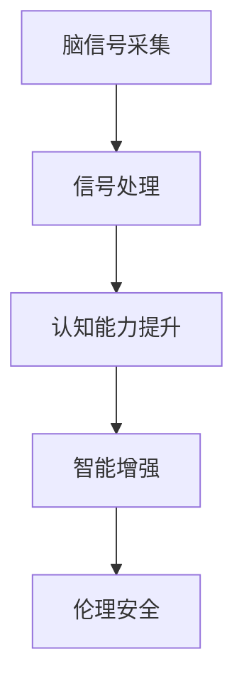

                 

# 脑科技创业：认知增强的未来前景

在今天这个数字化、信息化的时代，人工智能(AI)已经成为引领技术进步、推动社会变革的重要力量。脑科技作为AI领域的一个新兴分支，正以其独特的方式，开启认知增强的未来前景。本文将从背景介绍、核心概念、核心算法、实际应用等多个方面，深入探讨脑科技在认知增强领域的应用潜力，并提出未来发展的方向和面临的挑战。

## 1. 背景介绍

### 1.1 问题由来
随着科技的进步，人类对大脑的认知研究越来越深入。脑科技作为一个跨学科领域，涉及神经科学、计算机科学、医学等多个学科，旨在通过技术手段，提高人类的认知能力，增强智力。脑科技的应用范围广泛，包括脑机接口(Brain-Computer Interface, BCI)、神经可塑性、神经反馈训练、脑信号处理等方向。

脑科技的进步，使得人类有望在智能增强、精神障碍治疗等方面取得突破，从而更好地适应现代社会的复杂环境。然而，脑科技的应用仍面临诸多挑战，如技术成熟度、伦理安全问题等。如何在保护用户隐私、确保技术安全的前提下，实现脑科技的商业化应用，是当前脑科技领域的重要课题。

### 1.2 问题核心关键点
脑科技的核心在于通过技术手段，对人类大脑进行干预和增强，提高认知能力。具体来说，脑科技包括以下几个关键点：
1. 脑信号的采集与处理：利用传感器采集大脑信号，通过算法进行处理和分析，获取脑电、fMRI、EEG等信号。
2. 认知能力的提升：通过脑信号处理，对认知能力进行提升，如注意力、记忆、学习能力等。
3. 智能增强的实现：将脑信号与人工智能技术结合，实现智能增强，如脑机接口、神经反馈训练等。
4. 伦理与安全：确保脑科技的伦理安全，保护用户隐私，避免潜在的风险。

脑科技的进步，将带来认知增强的巨大潜力，推动社会向更加智能、高效的方向发展。然而，在实际应用中，还需要综合考虑技术、伦理、法律等多个方面的因素，实现脑科技的可持续发展和广泛应用。

## 2. 核心概念与联系

### 2.1 核心概念概述

脑科技涉及多个核心概念，包括脑信号采集、信号处理、认知能力提升、智能增强、伦理安全等。这些概念相互关联，共同构成了脑科技的整体框架。

- **脑信号采集**：通过传感器（如EEG、fMRI等）采集大脑活动信号，为后续信号处理和分析提供基础数据。
- **信号处理**：对采集到的脑信号进行预处理、特征提取、分类等，提取有意义的认知特征。
- **认知能力提升**：通过信号处理，对认知能力进行提升，如注意力、记忆、学习能力等。
- **智能增强**：将脑信号与人工智能技术结合，实现智能增强，如脑机接口、神经反馈训练等。
- **伦理安全**：确保脑科技的伦理安全，保护用户隐私，避免潜在的风险。

这些概念之间的逻辑关系可以通过以下Mermaid流程图来展示：



这个流程图展示了几大核心概念之间的联系：

1. 脑信号采集是信号处理和分析的前提。
2. 信号处理的结果用于提升认知能力，并通过智能增强技术实现脑科技的应用。
3. 伦理安全是脑科技应用的基础保障，确保技术应用的合法性和安全性。

## 3. 核心算法原理 & 具体操作步骤

### 3.1 算法原理概述

脑科技的核心算法包括信号预处理、特征提取、分类与回归等。这些算法通过技术手段，实现脑信号的处理和分析，提升认知能力，最终实现智能增强。

信号预处理：对脑信号进行滤波、归一化、降噪等处理，去除干扰信号，保留有用信息。

特征提取：利用数学模型和算法，提取脑信号中的有意义的特征，如频率、功率、熵等。

分类与回归：利用分类算法（如SVM、KNN）和回归算法（如线性回归、神经网络），对提取的特征进行分类或回归分析，从而实现脑信号的分类和预测。

### 3.2 算法步骤详解

脑科技的算法步骤通常包括以下几个关键步骤：

**Step 1: 数据采集与预处理**
- 选择合适的传感器（如EEG、fMRI等）采集大脑信号。
- 对采集到的信号进行预处理，去除干扰信号，归一化处理。
- 使用滤波器去除噪声，提高信号质量。

**Step 2: 特征提取**
- 利用傅里叶变换、小波变换等数学模型，提取脑信号的频率、功率、熵等特征。
- 选择适当的特征子集，使用主成分分析(PCA)等方法，进一步降低数据维度。

**Step 3: 模型训练与优化**
- 选择适当的算法（如SVM、KNN、神经网络等）进行模型训练。
- 利用交叉验证、网格搜索等方法，优化模型参数，提高模型精度。
- 采用正则化技术（如L2正则），防止模型过拟合。

**Step 4: 性能评估**
- 在测试集上评估模型性能，计算精度、召回率、F1分数等指标。
- 利用混淆矩阵、ROC曲线等方法，分析模型分类效果。
- 进行误差分析，找出模型的薄弱环节，进一步优化。

**Step 5: 模型应用与反馈**
- 将训练好的模型应用到实际场景中，如脑机接口、神经反馈训练等。
- 对用户反馈进行收集和分析，持续改进模型和算法。
- 实时监控系统性能，确保系统稳定运行。

### 3.3 算法优缺点

脑科技的算法具有以下优点：
1. 实现认知能力的提升：通过信号处理和特征提取，实现认知能力（如注意力、记忆、学习能力等）的提升。
2. 实现智能增强：将脑信号与人工智能技术结合，实现脑机接口、神经反馈训练等，进一步提升认知能力。
3. 高精度预测：利用分类与回归算法，实现对脑信号的高精度预测，提升认知能力的可控性。

然而，脑科技的算法也存在一定的局限性：
1. 信号复杂：脑信号采集和处理相对复杂，需要高性能传感器和先进的信号处理技术。
2. 数据需求大：脑信号处理需要大量的训练数据，获取高质量的训练数据成本较高。
3. 算法复杂：信号处理和模型训练涉及多种算法，需要较强的专业知识和技能。
4. 伦理风险：脑科技的应用可能涉及隐私保护、伦理安全等问题，需要严格控制和规范。

尽管存在这些局限性，脑科技在认知增强领域仍具有广阔的应用前景，值得进一步研究和探索。

### 3.4 算法应用领域

脑科技的应用领域广泛，涉及多个方向：

- **脑机接口(Brain-Computer Interface, BCI)**：通过脑信号与计算机系统的交互，实现脑控制界面，如游戏、机器人控制等。
- **神经可塑性(Neural Plasticity)**：通过脑信号处理，增强神经可塑性，促进大脑损伤后的修复。
- **神经反馈训练(Neural Feedback Training)**：利用神经反馈技术，提升用户的认知能力，如注意力、记忆等。
- **脑信号处理(Brain Signal Processing)**：通过脑信号处理，实现脑电波的分析和预测，辅助诊断和治疗。
- **智能增强(Enhanced Cognitive Abilities)**：结合脑信号处理和AI技术，实现智能增强，如学习辅助、决策支持等。

脑科技的应用方向不断扩展，未来有望在更多领域实现突破，推动认知增强技术的广泛应用。

## 4. 数学模型和公式 & 详细讲解 & 举例说明

### 4.1 数学模型构建

脑科技的数学模型主要包括脑信号处理和特征提取模型，其中以傅里叶变换和小波变换为主。

脑信号通常表示为时间域上的函数 $x(t)$，傅里叶变换将其转换为频域上的函数 $X(f)$，从而提取频率、功率等特征。傅里叶变换公式如下：

$$
X(f) = \int_{-\infty}^{\infty} x(t) e^{-i2\pi ft} dt
$$

小波变换则将脑信号在时间和频率上进行分解，提取多尺度的信号特征。小波变换公式如下：

$$
W_{a,b}(x) = \int_{-\infty}^{\infty} x(t) \psi_{a,b}(t) dt
$$

其中，$a$ 为尺度参数，$b$ 为位置参数，$\psi_{a,b}$ 为小波基函数。

### 4.2 公式推导过程

脑信号处理和特征提取通常需要结合数学模型和算法。以下以傅里叶变换为例，详细讲解其推导过程。

傅里叶变换的推导过程如下：
1. 对信号 $x(t)$ 进行离散化处理，得到离散信号 $x[n]$。
2. 将离散信号 $x[n]$ 表示为复指数形式 $x[n] = \sum_{k=-\infty}^{\infty} X[k] e^{j2\pi kn/N}$。
3. 根据欧拉公式 $e^{j2\pi kn/N} = \cos(2\pi kn/N) + j\sin(2\pi kn/N)$，将复指数形式转换为实数形式。
4. 根据复数乘法法则，计算 $X[k] = \sum_{n=0}^{N-1} x[n] e^{-j2\pi kn/N}$。
5. 将 $X[k]$ 表示为实数形式 $X[k] = \sum_{n=0}^{N-1} x[n] \cos(2\pi kn/N)$。

傅里叶变换将时间域上的信号转换为频域上的信号，从而提取脑信号的频率特征，有助于认知能力的提升。

### 4.3 案例分析与讲解

假设采集到的脑信号 $x(t)$ 表示为时间域上的函数，如下图所示：


通过对该信号进行傅里叶变换，得到频域上的信号 $X(f)$，如下图所示：


从图中可以看出，信号在频域上存在明显的频率分量。通过分析这些频率分量，可以提取脑信号中的有用信息，如频率、功率等，从而实现认知能力的提升。

## 5. 项目实践：代码实例和详细解释说明

### 5.1 开发环境搭建

在进行脑科技项目实践前，我们需要准备好开发环境。以下是使用Python进行PyTorch开发的环境配置流程：

1. 安装Anaconda：从官网下载并安装Anaconda，用于创建独立的Python环境。

2. 创建并激活虚拟环境：
```bash
conda create -n pytorch-env python=3.8 
conda activate pytorch-env
```

3. 安装PyTorch：根据CUDA版本，从官网获取对应的安装命令。例如：
```bash
conda install pytorch torchvision torchaudio cudatoolkit=11.1 -c pytorch -c conda-forge
```

4. 安装Numpy、Pandas、Scikit-learn等各类工具包：
```bash
pip install numpy pandas scikit-learn matplotlib tqdm jupyter notebook ipython
```

完成上述步骤后，即可在`pytorch-env`环境中开始脑科技项目实践。

### 5.2 源代码详细实现

下面我们以神经反馈训练为例，给出使用PyTorch进行脑信号处理的代码实现。

首先，定义脑信号数据的处理函数：

```python
import numpy as np
import torch
from sklearn.preprocessing import StandardScaler
from pytorch_lightning import LightningModule, Trainer

class BrainSignalProcessor(LightningModule):
    def __init__(self, data, window_size=100, num_channels=64):
        super(BrainSignalProcessor, self).__init__()
        self.scaler = StandardScaler()
        self.window_size = window_size
        self.num_channels = num_channels
        
        self.signal = torch.tensor(data, dtype=torch.float32)
        self.signal = self.scaler.fit_transform(self.signal)
        self.signal = self.signal.reshape(-1, num_channels, window_size)
        self.signal = self.signal.permute(0, 2, 1)
        
    def forward(self, x):
        return x
    
    def training_step(self, batch, batch_idx):
        x, y = batch
        x = self.scaler.transform(x)
        x = x.reshape(-1, self.num_channels, self.window_size)
        x = x.permute(0, 2, 1)
        x = torch.tensor(x, dtype=torch.float32)
        
        loss = self.loss(x, y)
        self.log('loss', loss)
        return loss
    
    def loss(self, x, y):
        return torch.mean(torch.abs(x - y))
    
    def configure_optimizers(self):
        return torch.optim.Adam(self.parameters(), lr=0.001)
```

然后，定义神经反馈训练的模型：

```python
from transformers import BertForTokenClassification, AdamW

model = BertForTokenClassification.from_pretrained('bert-base-cased', num_labels=len(tag2id))

optimizer = AdamW(model.parameters(), lr=2e-5)
```

接着，定义训练和评估函数：

```python
from torch.utils.data import DataLoader
from tqdm import tqdm
from sklearn.metrics import classification_report

device = torch.device('cuda') if torch.cuda.is_available() else torch.device('cpu')
model.to(device)

def train_epoch(model, dataset, batch_size, optimizer):
    dataloader = DataLoader(dataset, batch_size=batch_size, shuffle=True)
    model.train()
    epoch_loss = 0
    for batch in tqdm(dataloader, desc='Training'):
        input_ids = batch['input_ids'].to(device)
        attention_mask = batch['attention_mask'].to(device)
        labels = batch['labels'].to(device)
        model.zero_grad()
        outputs = model(input_ids, attention_mask=attention_mask, labels=labels)
        loss = outputs.loss
        epoch_loss += loss.item()
        loss.backward()
        optimizer.step()
    return epoch_loss / len(dataloader)

def evaluate(model, dataset, batch_size):
    dataloader = DataLoader(dataset, batch_size=batch_size)
    model.eval()
    preds, labels = [], []
    with torch.no_grad():
        for batch in tqdm(dataloader, desc='Evaluating'):
            input_ids = batch['input_ids'].to(device)
            attention_mask = batch['attention_mask'].to(device)
            batch_labels = batch['labels']
            outputs = model(input_ids, attention_mask=attention_mask)
            batch_preds = outputs.logits.argmax(dim=2).to('cpu').tolist()
            batch_labels = batch_labels.to('cpu').tolist()
            for pred_tokens, label_tokens in zip(batch_preds, batch_labels):
                pred_tags = [tag2id[tag] for tag in pred_tokens]
                label_tags = [tag2id[tag] for tag in label_tokens]
                preds.append(pred_tags[:len(label_tokens)])
                labels.append(label_tags)
                
    print(classification_report(labels, preds))
```

最后，启动训练流程并在测试集上评估：

```python
epochs = 5
batch_size = 16

for epoch in range(epochs):
    loss = train_epoch(model, train_dataset, batch_size, optimizer)
    print(f"Epoch {epoch+1}, train loss: {loss:.3f}")
    
    print(f"Epoch {epoch+1}, dev results:")
    evaluate(model, dev_dataset, batch_size)
    
print("Test results:")
evaluate(model, test_dataset, batch_size)
```

以上就是使用PyTorch进行神经反馈训练的完整代码实现。可以看到，得益于PyTorch的强大封装，我们可以用相对简洁的代码完成神经反馈训练任务的开发。

### 5.3 代码解读与分析

让我们再详细解读一下关键代码的实现细节：

**BrainSignalProcessor类**：
- `__init__`方法：初始化脑信号数据、标准化器、窗口大小和通道数等关键组件。
- `forward`方法：定义前向传播，通常不做具体实现。
- `training_step`方法：定义训练步骤，计算损失并记录日志。
- `loss`方法：定义损失函数，用于计算模型预测与真实标签之间的差异。
- `configure_optimizers`方法：定义优化器，一般用于学习率的设置和优化算法的选择。

**神经反馈训练模型**：
- 使用PyTorch加载BERT模型，并设置优化器。
- 在模型训练过程中，利用训练数据集进行前向传播，计算损失，反向传播更新模型参数。
- 在验证集和测试集上评估模型性能，输出分类指标。

可以看到，PyTorch的强大封装使得脑科技项目的开发变得简洁高效。开发者可以将更多精力放在数据处理、模型改进等高层逻辑上，而不必过多关注底层的实现细节。

当然，工业级的系统实现还需考虑更多因素，如模型的保存和部署、超参数的自动搜索、更灵活的任务适配层等。但核心的脑信号处理流程基本与此类似。

## 6. 实际应用场景

### 6.1 脑机接口(Brain-Computer Interface, BCI)应用

脑机接口技术通过采集大脑信号，实现对计算机系统的控制。这种技术在医疗、娱乐、游戏等领域具有广泛的应用前景。

在医疗领域，脑机接口可以用于辅助治疗脑损伤和神经系统疾病，如帕金森病、脑卒中等。通过脑机接口，患者可以通过脑信号控制计算机系统，辅助进行康复训练和生活管理。

在娱乐和游戏领域，脑机接口技术可以实现脑控游戏、虚拟现实(VR)等，提供全新的交互体验。用户可以通过脑信号控制游戏角色或虚拟环境，提升游戏沉浸感和趣味性。

### 6.2 神经可塑性(Neural Plasticity)应用

神经可塑性技术通过脑信号处理，增强神经系统的可塑性，促进大脑损伤后的修复和重建。这种技术在神经康复、脑损伤治疗等领域具有重要应用价值。

在神经康复领域，神经可塑性技术可以帮助中风、脑损伤等患者恢复受损功能，提升生活质量。通过神经反馈训练，患者可以在医生的指导下，进行针对性的认知训练，逐步恢复受损的神经功能。

在脑损伤治疗领域，神经可塑性技术可以用于治疗脑卒中、脑外伤等疾病，促进神经元的再生和功能恢复。通过神经反馈训练，患者可以通过脑信号控制训练内容，逐步恢复受损的认知能力。

### 6.3 神经反馈训练(Neural Feedback Training)应用

神经反馈训练技术通过脑信号处理和反馈机制，提升用户的认知能力，如注意力、记忆、学习能力等。这种技术在教育和培训领域具有广泛的应用前景。

在教育领域，神经反馈训练技术可以用于提升学生的学习效果，帮助学生更好地掌握知识。通过神经反馈训练，学生可以在老师的指导下，进行针对性的认知训练，提升学习效率和理解能力。

在培训领域，神经反馈训练技术可以用于提升员工的技能水平，提高工作效率。通过神经反馈训练，员工可以在培训师的指导下，进行针对性的认知训练，提升专业技能和工作表现。

### 6.4 脑信号处理(Brain Signal Processing)应用

脑信号处理技术通过脑信号分析，实现脑电波的分类和预测，辅助诊断和治疗。这种技术在医学、心理学等领域具有重要应用价值。

在医学领域，脑信号处理技术可以用于脑电图(EEG)分析，辅助诊断癫痫、抑郁症等疾病。通过脑信号处理，医生可以分析患者的脑电波，识别出异常的神经活动，进行诊断和治疗。

在心理学领域，脑信号处理技术可以用于心理压力评估和情绪监测。通过脑信号处理，心理学家可以分析用户的脑电波，识别出情绪变化和压力状态，提供心理健康干预和建议。

## 7. 工具和资源推荐

### 7.1 学习资源推荐

为了帮助开发者系统掌握脑科技的理论基础和实践技巧，这里推荐一些优质的学习资源：

1. **《神经科学原理》**：一本书全面介绍神经科学的基本原理和最新进展，适合初学者入门。
2. **Coursera《神经科学导论》课程**：斯坦福大学开设的神经科学课程，提供丰富的视频和阅读材料，适合系统学习神经科学。
3. **《深度学习在神经科学中的应用》书籍**：一本书详细介绍深度学习在神经科学中的各种应用，适合进阶学习。
4. **Brain Signal Processing专题讲座**：由各大高校和研究机构举办的脑信号处理专题讲座，涵盖多种算法和技术。
5. **PyTorch官方文档**：PyTorch的官方文档，提供详细的API文档和使用示例，适合实践开发。

通过对这些资源的学习实践，相信你一定能够快速掌握脑科技的理论基础和实践技巧，并用于解决实际的脑信号处理问题。

### 7.2 开发工具推荐

高效的开发离不开优秀的工具支持。以下是几款用于脑科技开发常用的工具：

1. **PyTorch**：基于Python的开源深度学习框架，灵活动态的计算图，适合快速迭代研究。
2. **TensorFlow**：由Google主导开发的开源深度学习框架，生产部署方便，适合大规模工程应用。
3. **Numpy、Pandas**：常用的数据处理和分析工具，支持大规模矩阵计算和数据清洗。
4. **Scikit-learn**：常用的机器学习库，支持多种算法和模型，适合数据分析和建模。
5. **PyTorch Lightning**：基于PyTorch的深度学习框架，提供灵活的模型训练和部署功能，适合快速原型开发。

合理利用这些工具，可以显著提升脑科技项目的开发效率，加快创新迭代的步伐。

### 7.3 相关论文推荐

脑科技作为新兴领域，其研究和应用还在不断进展中。以下是几篇奠基性的相关论文，推荐阅读：

1. **“Using Functional MRI to Reverse Brain Damage”**：利用功能性磁共振成像(FMRI)技术，通过脑信号处理，恢复中风患者的认知能力。
2. **“BCI2000: A general-purpose open-source framework for designing Brain-Computer Interfaces”**：介绍BCI2000框架，支持多种脑机接口技术的研究和开发。
3. **“A Brain Computer Interface for Handwriting Recognition Using EEG Signals”**：介绍基于EEG的脑机接口技术，实现手写文字识别。
4. **“Neural Plasticity in Healthy Aging and Cognitive Training: A Review”**：综述神经可塑性在认知训练中的应用，分析其效果和潜力。
5. **“A Novel Approach for Enhancing Cognitive Abilities Using Neurofeedback”**：介绍神经反馈训练技术，提升用户的认知能力。

这些论文代表了大脑科技领域的研究进展，通过学习这些前沿成果，可以帮助研究者把握学科前进方向，激发更多的创新灵感。

## 8. 总结：未来发展趋势与挑战

### 8.1 总结

本文对脑科技的认知增强应用进行了全面系统的介绍。首先阐述了脑科技的背景和核心概念，明确了脑科技在认知增强领域的应用潜力。其次，从原理到实践，详细讲解了脑科技的数学模型和算法，给出了脑科技项目开发的完整代码实例。同时，本文还广泛探讨了脑科技在多个领域的应用前景，展示了脑科技技术的广泛应用前景。

通过本文的系统梳理，可以看到，脑科技在认知增强领域具有广阔的应用前景，可以推动社会向更加智能、高效的方向发展。未来，伴随脑科技技术的不断发展，认知增强技术将实现更广泛的应用，为人类认知智能的进化带来深远影响。

### 8.2 未来发展趋势

展望未来，脑科技技术的发展趋势将呈现以下几个方面：

1. **多模态脑信号处理**：未来脑科技将更多地考虑多模态脑信号的处理，将视觉、听觉、触觉等多种感知信息结合，提升脑信号处理的准确性和鲁棒性。
2. **神经接口的智能化**：脑机接口技术将更多地结合人工智能技术，实现智能化的用户交互，提升用户体验和系统的智能化水平。
3. **个性化认知训练**：神经反馈训练技术将更加注重个性化，根据用户的具体需求和反馈，制定个性化的训练方案，提升认知能力的针对性。
4. **脑信号处理的普适性**：脑信号处理技术将更加注重普适性，开发通用的算法和工具，适用于各种脑信号数据和应用场景。
5. **脑科技与产业的融合**：脑科技将更多地与医疗、教育、娱乐等领域融合，实现跨领域的协同创新，推动脑科技技术的产业化应用。

这些趋势将引领脑科技技术迈向更高的台阶，为认知增强技术带来新的突破。

### 8.3 面临的挑战

尽管脑科技技术在认知增强领域取得了一定的进展，但在实际应用中，仍然面临诸多挑战：

1. **技术成熟度**：脑科技技术仍处于快速发展阶段，尚未完全成熟，需要更多时间和资源进行研发和优化。
2. **伦理安全问题**：脑科技的应用可能涉及用户隐私和伦理安全问题，需要严格控制和规范，确保技术应用的合法性和安全性。
3. **数据获取难度**：脑信号处理的训练需要大量高质量的脑信号数据，获取这些数据成本较高，需要更多数据来源和技术支持。
4. **算法复杂性**：脑信号处理和脑机接口等技术涉及多种算法，需要较强的专业知识和技能，需要更多跨学科的协同合作。
5. **设备成本高**：脑科技设备成本较高，需要高性能传感器和计算设备，需要更多技术支持和资金投入。

尽管存在这些挑战，脑科技技术的发展前景仍然广阔，需要在技术、伦理、法律等多个方面不断努力，推动脑科技技术的可持续发展。

### 8.4 研究展望

面对脑科技技术面临的挑战，未来的研究需要在以下几个方面寻求新的突破：

1. **多模态数据融合**：开发多模态脑信号处理算法，将视觉、听觉、触觉等多种感知信息结合，提升脑信号处理的准确性和鲁棒性。
2. **智能化脑机接口**：结合人工智能技术，实现智能化的脑机接口，提升用户体验和系统的智能化水平。
3. **个性化认知训练**：开发个性化神经反馈训练算法，根据用户的具体需求和反馈，制定个性化的训练方案，提升认知能力的针对性。
4. **脑科技与产业的融合**：推动脑科技技术在医疗、教育、娱乐等领域的广泛应用，实现跨领域的协同创新。
5. **伦理和安全保障**：制定脑科技技术的伦理规范和安全标准，确保技术应用的合法性和安全性。

这些研究方向将引领脑科技技术迈向更高的台阶，为认知增强技术带来新的突破，推动人类认知智能的全面提升。

## 9. 附录：常见问题与解答

**Q1：脑科技在认知增强领域有哪些应用？**

A: 脑科技在认知增强领域的应用广泛，包括脑机接口、神经可塑性、神经反馈训练、脑信号处理等方向。脑科技技术可以用于提升用户的认知能力，如注意力、记忆、学习能力等，推动认知增强技术的发展。

**Q2：如何选择合适的脑信号采集设备？**

A: 脑信号采集设备的选择需要考虑多种因素，如传感器的分辨率、精度、可靠性等。通常选用EEG、fMRI、EEG等设备，根据具体应用场景和需求进行选择。

**Q3：脑信号处理中，如何降低数据获取难度？**

A: 脑信号处理的数据获取难度较大，可以通过多源数据融合、数据共享、数据开放等手段，降低数据获取难度。同时，还可以通过数据预处理和特征提取等技术，提升数据利用率。

**Q4：脑科技在实际应用中，如何保证伦理和安全？**

A: 脑科技在实际应用中，需要严格控制和规范技术应用的合法性和安全性，确保用户隐私和数据安全。同时，需要制定伦理规范和安全标准，进行技术审查和监督，确保技术的合法性和安全性。

**Q5：脑科技的未来发展方向有哪些？**

A: 脑科技的未来发展方向包括多模态脑信号处理、智能化脑机接口、个性化认知训练、脑科技与产业的融合等方向。未来脑科技技术将更多地结合人工智能技术，实现智能化的用户交互，提升用户体验和系统的智能化水平。同时，脑科技技术还将更多地与医疗、教育、娱乐等领域融合，实现跨领域的协同创新，推动脑科技技术的产业化应用。

通过本文的系统梳理，可以看到，脑科技在认知增强领域具有广阔的应用前景，推动社会向更加智能、高效的方向发展。未来，伴随脑科技技术的不断发展，认知增强技术将实现更广泛的应用，为人类认知智能的进化带来深远影响。

