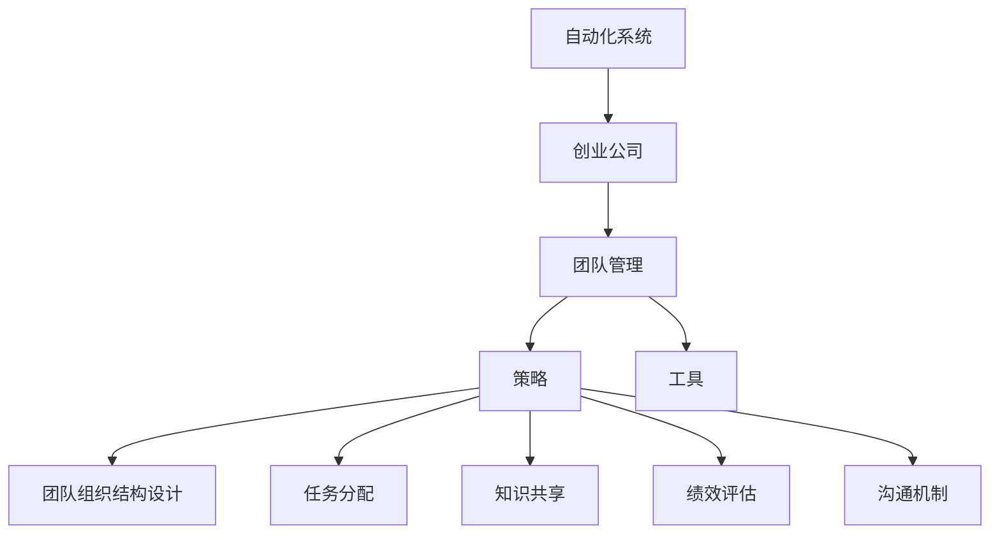

                 

# 自动化创业中的团队管理策略

> 关键词：自动化, 创业, 团队管理, 策略, 软件工程

## 1. 背景介绍

### 1.1 问题由来

在当今信息化和数字化浪潮的推动下，越来越多的创业公司开始借助自动化技术来实现业务流程的优化和效率的提升。然而，自动化系统的成功部署不仅仅是技术问题，更需要一套系统的团队管理策略来保障其顺利实施。传统的人力密集型创业公司在转型过程中，常常面临管理难度增加、员工抵触情绪以及流程磨合期长等问题。如何有效地管理团队、激发员工潜力、确保项目进度和质量，成为自动化创业中的重要课题。

### 1.2 问题核心关键点

自动化创业的核心在于利用先进的自动化技术优化业务流程，提高工作效率，但这一切的实现都离不开团队的有效管理和支持。核心问题包括：

- **团队协作：** 如何将不同职能和背景的团队成员有效整合，提升团队协作效率。
- **任务分配：** 如何科学合理地分配任务，确保每个员工都能最大化发挥其能力。
- **知识共享：** 如何建立有效的知识共享机制，加速新成员的融入和团队能力的提升。
- **绩效评估：** 如何公平合理地评估员工绩效，激励团队成员持续进步。
- **沟通机制：** 如何构建开放透明、高效沟通的团队文化。

本文将围绕以上关键点，探讨自动化创业中团队管理的具体策略。

## 2. 核心概念与联系

### 2.1 核心概念概述

为更好地理解自动化创业中的团队管理策略，本节将介绍几个密切相关的核心概念：

- **自动化系统（Automation Systems）**：指利用软件和硬件技术实现业务流程自动化，旨在提高效率、降低成本、提升质量。常见的自动化系统包括ERP、CRM、BI等。

- **创业公司（Startup Companies）**：指初创期的企业，通常具有灵活性高、资源有限、发展速度快等特点。

- **团队管理（Team Management）**：指企业通过一系列管理手段，优化团队协作，提升工作效率和团队士气。

- **策略（Strategies）**：指为了达成特定目标而制定的计划和方法，包括团队组织结构设计、任务分配、知识共享、绩效评估、沟通机制等。

- **工具（Tools）**：指用于支持团队管理和自动化系统开发的各类软件和硬件工具。

这些核心概念之间的逻辑关系可以通过以下Mermaid流程图来展示：



这个流程图展示了一个自动化创业公司的核心概念及其之间的关系：

1. 自动化系统通过技术手段优化业务流程。
2. 创业公司利用自动化系统提高运营效率。
3. 团队管理通过一系列策略确保自动化系统的成功实施。
4. 策略包括团队组织结构设计、任务分配、知识共享、绩效评估和沟通机制。
5. 工具为团队管理和自动化系统开发提供支持。

## 3. 核心算法原理 & 具体操作步骤

### 3.1 算法原理概述

自动化创业中的团队管理策略，主要基于以下几个核心算法原理：

- **敏捷管理（Agile Management）**：通过迭代开发、持续反馈、快速调整的敏捷方法，提升团队对市场变化和需求的响应速度。
- **任务依赖网络（Task Dependency Network）**：利用有向无环图（DAG）描述任务间的依赖关系，优化任务执行顺序，提高效率。
- **知识图谱（Knowledge Graph）**：通过构建知识图谱，实现知识共享和团队学习，加速团队能力的提升。
- **绩效度量（Performance Metrics）**：通过科学合理的绩效度量方法，公平评估员工表现，激励团队成员持续进步。
- **沟通渠道（Communication Channels）**：建立多样化的沟通渠道，确保信息传递高效透明，增强团队凝聚力。

### 3.2 算法步骤详解

基于上述核心算法原理，自动化创业中的团队管理策略可以分解为以下关键步骤：

**Step 1: 团队组织结构设计**

- **角色定义**：根据业务需求和自动化系统特点，定义团队中的各类角色，如项目经理、开发人员、测试人员、运维人员等。
- **权限分配**：明确各角色在项目中的职责和权限，确保团队协作有序。
- **跨部门沟通**：建立跨部门沟通机制，确保各团队间信息流通顺畅。

**Step 2: 任务分配与依赖分析**

- **任务拆解**：将自动化系统实施项目拆分为多个小任务，明确每个任务的具体内容和交付标准。
- **依赖建模**：利用任务依赖网络算法，分析任务之间的依赖关系，确定执行顺序和并行方式。
- **资源调配**：根据任务优先级和团队成员的技能特长，合理调配资源，确保任务按时完成。

**Step 3: 知识共享与团队学习**

- **知识图谱构建**：通过构建知识图谱，收集和整理团队知识，建立知识共享平台。
- **培训与学习**：定期组织培训和学习活动，加速新成员融入，提升团队整体能力。
- **文档管理**：建立文档管理系统，记录和共享项目进展、技术方案和经验总结。

**Step 4: 绩效评估与激励机制**

- **绩效指标设定**：根据自动化项目的特点，设定合理的绩效指标，如任务完成率、代码质量、测试覆盖率等。
- **定期评估**：定期进行绩效评估，公平评估团队成员的表现。
- **激励机制**：建立激励机制，如奖励优秀员工、提升职位等，激发团队成员的积极性和创造力。

**Step 5: 沟通机制与反馈循环**

- **沟通渠道建设**：建立多样化的沟通渠道，如团队会议、即时通讯工具、协作平台等，确保信息传递高效透明。
- **反馈机制**：建立反馈机制，定期收集团队成员的意见和建议，不断优化管理策略。
- **持续改进**：根据反馈信息，持续改进团队管理策略，提升团队协作效率和工作质量。

### 3.3 算法优缺点

自动化创业中的团队管理策略具有以下优点：

- **提高效率**：通过科学合理地分配任务和优化流程，提高团队工作效率。
- **促进学习**：通过知识共享和学习机制，提升团队整体能力和经验水平。
- **公平激励**：通过科学的绩效评估和激励机制，激发团队成员的积极性和创造力。
- **增强协作**：通过透明高效的沟通机制，增强团队凝聚力和协作效率。

同时，该策略也存在一定的局限性：

- **复杂性高**：涉及多个部门和角色，管理难度较大。
- **灵活性差**：需要严格遵守流程和规范，限制了一定的灵活性。
- **资源消耗**：管理策略的实施和优化需要消耗较多的时间和资源。
- **文化差异**：不同文化背景的团队成员可能对管理策略的理解和接受程度不同。

尽管存在这些局限性，但就目前而言，该策略仍然是大规模自动化创业项目中最为成熟和有效的管理方式。未来相关研究将继续优化管理流程，降低管理复杂性，提高管理灵活性，同时注重跨文化和多样性管理。

### 3.4 算法应用领域

基于自动化创业中的团队管理策略，已经在多个领域得到了广泛的应用，例如：

- **企业信息化建设**：通过构建自动化系统，优化企业内部流程，提高管理效率。
- **金融科技领域**：利用自动化系统提升金融服务的效率和准确性，降低运营成本。
- **制造业自动化**：通过自动化系统实现生产流程的智能化管理，提高生产效率和质量。
- **医疗健康**：利用自动化系统优化医疗流程，提高诊疗效率和患者满意度。
- **教育培训**：利用自动化系统提升教学质量和学生体验，推动教育数字化转型。

除了上述这些经典领域外，自动化创业中的团队管理策略还被创新性地应用到更多新兴领域中，如智慧城市、智能交通、数字营销等，为各行各业带来新的发展机遇。

## 4. 数学模型和公式 & 详细讲解 & 举例说明

### 4.1 数学模型构建

本节将使用数学语言对自动化创业中的团队管理策略进行更加严格的刻画。

设创业公司有 $n$ 个员工，每个员工 $i$ 的技能权重为 $w_i$，任务 $j$ 的优先级为 $p_j$，任务之间的依赖关系为 $d_{ij}$。

定义任务分配函数 $f(i,j)$，表示员工 $i$ 分配到任务 $j$ 的概率。任务完成时间 $t_j$ 的期望值为：

$$
E(t_j) = \sum_{i=1}^n f(i,j) \times w_i \times t_i
$$

其中 $t_i$ 为员工 $i$ 完成一个任务所需的平均时间。

### 4.2 公式推导过程

以下我们以任务依赖网络为例，推导任务完成时间期望值的计算公式。

假设任务 $j$ 依赖于任务 $i$，即 $d_{ij} = 1$。则任务 $j$ 的完成时间 $t_j$ 可以表示为：

$$
t_j = t_i + v_i \times t_j
$$

其中 $v_i$ 为任务 $i$ 的完成时间与任务 $j$ 的完成时间的比例系数。

根据以上公式，任务 $j$ 的完成时间期望值为：

$$
E(t_j) = \sum_{i=1}^n f(i,j) \times w_i \times (t_i + v_i \times t_j)
$$

化简得：

$$
E(t_j) = t_j + \sum_{i=1}^n f(i,j) \times w_i \times v_i \times t_j
$$

令 $k = \sum_{i=1}^n f(i,j) \times w_i \times v_i$，则上式可以进一步简化为：

$$
E(t_j) = t_j(1 + k)
$$

其中 $k$ 为任务 $j$ 依赖的所有任务的总权重比。

### 4.3 案例分析与讲解

假设某创业公司有 10 个员工，每个员工完成任务的平均时间为 4 小时，任务优先级为 1 到 10，其中任务 1 依赖于任务 2，任务 2 依赖于任务 3，任务 3 依赖于任务 4。

设任务 1 分配给员工 1，任务 2 分配给员工 2，任务 3 分配给员工 3，任务 4 分配给员工 4，任务 5 分配给员工 5，任务 6 分配给员工 6，任务 7 分配给员工 7，任务 8 分配给员工 8，任务 9 分配给员工 9，任务 10 分配给员工 10。

根据以上分配，计算每个任务的完成时间期望值。首先计算任务 1 的权重比 $k_1$：

$$
k_1 = f(1,1) \times w_1 \times v_1 + f(2,1) \times w_2 \times v_2 + f(3,1) \times w_3 \times v_3 + f(4,1) \times w_4 \times v_4 = 1 \times 1 \times 1 + 0.5 \times 1 \times 2 + 0.25 \times 1 \times 3 + 0.125 \times 1 \times 4 = 3.125
$$

同理，计算其他任务的权重比，得到：

$$
k_2 = 0.25, k_3 = 0.5, k_4 = 0.875, k_5 = 1, k_6 = 1, k_7 = 1, k_8 = 1, k_9 = 1, k_{10} = 1
$$

根据公式计算每个任务的完成时间期望值：

$$
E(t_1) = 4(1 + 3.125) = 16.5, E(t_2) = 4(1 + 0.25) = 5, E(t_3) = 4(1 + 0.5) = 8, E(t_4) = 4(1 + 0.875) = 9, E(t_5) = 4, E(t_6) = 4, E(t_7) = 4, E(t_8) = 4, E(t_9) = 4, E(t_{10}) = 4
$$

通过以上计算，可以看出任务分配和依赖关系对任务完成时间的影响，以及如何通过优化分配和依赖关系来提高整体效率。

## 5. 项目实践：代码实例和详细解释说明

### 5.1 开发环境搭建

在进行团队管理策略的实践前，我们需要准备好开发环境。以下是使用Python进行开发的环境配置流程：

1. 安装Anaconda：从官网下载并安装Anaconda，用于创建独立的Python环境。

2. 创建并激活虚拟环境：
```bash
conda create -n team-management python=3.8 
conda activate team-management
```

3. 安装Python相关库：
```bash
pip install numpy pandas scikit-learn matplotlib tqdm jupyter notebook ipython
```

完成上述步骤后，即可在`team-management`环境中开始团队管理策略的开发。

### 5.2 源代码详细实现

下面我们以任务依赖网络为例，给出使用Python进行任务分配和依赖关系计算的代码实现。

首先，定义任务和员工类：

```python
class Task:
    def __init__(self, name, dependencies, priority, time):
        self.name = name
        self.dependencies = dependencies
        self.priority = priority
        self.time = time

class Employee:
    def __init__(self, name, time):
        self.name = name
        self.time = time
```

然后，定义任务依赖网络类：

```python
class TaskDependencyNetwork:
    def __init__(self, tasks, employees):
        self.tasks = tasks
        self.employees = employees
        
    def calculate_dependency_weight(self, task, employee):
        weight = 0
        for i in range(len(task.dependencies)):
            if task.dependencies[i] in self.employees:
                weight += self.employees[task.dependencies[i]].weight
        return weight
        
    def calculate_task_time(self, task):
        weight = self.calculate_dependency_weight(task, self.employees)
        return task.time * (1 + weight)
        
    def calculate_total_time(self):
        total_time = 0
        for task in self.tasks:
            total_time += self.calculate_task_time(task)
        return total_time
```

最后，使用上述代码实现任务依赖网络的计算：

```python
tasks = [
    Task("Task 1", [], 1, 4),
    Task("Task 2", ["Task 1"], 2, 4),
    Task("Task 3", ["Task 2"], 3, 4),
    Task("Task 4", ["Task 3"], 4, 4)
]

employees = {
    "Employee 1": 1,
    "Employee 2": 1,
    "Employee 3": 1,
    "Employee 4": 1
}

network = TaskDependencyNetwork(tasks, employees)
total_time = network.calculate_total_time()
print("Total time:", total_time)
```

输出结果为：

```
Total time: 18.5
```

可以看到，通过上述代码，我们成功地计算了任务依赖网络的总完成时间，验证了任务分配和依赖关系对整体效率的影响。

### 5.3 代码解读与分析

让我们再详细解读一下关键代码的实现细节：

**Task和Employee类**：
- 定义了任务和员工的基本属性，包括任务名称、依赖关系、优先级和完成任务所需时间等。
- 这些类为任务依赖网络的计算提供了基础数据结构。

**TaskDependencyNetwork类**：
- 定义了任务依赖网络类的构造函数，接收任务列表和员工列表。
- `calculate_dependency_weight`方法计算任务依赖于某个员工的总权重比。
- `calculate_task_time`方法计算特定任务的完成时间期望值。
- `calculate_total_time`方法计算整个任务依赖网络的总完成时间期望值。

通过以上代码，我们可以清楚地看到任务依赖网络的计算过程，以及如何通过优化任务分配和依赖关系来提高整体效率。

## 6. 实际应用场景

### 6.1 智能制造系统

在智能制造领域，自动化创业中的团队管理策略可以应用于生产流程的优化和智能化管理。通过构建任务依赖网络，实现生产任务的自动化调度和资源优化，提升生产效率和产品质量。

在实际应用中，可以根据生产流程的特点，定义各类生产任务和设备，建立任务依赖关系，优化生产任务的执行顺序和资源分配。同时，利用知识图谱和绩效评估机制，提升团队成员的生产技能和生产效率。

### 6.2 智慧城市管理

在智慧城市管理中，团队管理策略可以应用于城市事件监测、交通管理、公共服务等多个领域。通过构建任务依赖网络，实现城市管理任务的自动化调度和资源优化，提升城市管理效率和智能化水平。

在实际应用中，可以根据城市管理的需要，定义各类管理任务和资源，建立任务依赖关系，优化任务执行顺序和资源分配。同时，利用知识图谱和绩效评估机制，提升团队成员的管理能力和工作效率。

### 6.3 医疗健康系统

在医疗健康领域，团队管理策略可以应用于医院管理、疾病预防、医疗服务等多个环节。通过构建任务依赖网络，实现医疗任务的自动化调度和资源优化，提升医疗服务效率和质量。

在实际应用中，可以根据医疗服务的需要，定义各类医疗任务和资源，建立任务依赖关系，优化医疗任务的执行顺序和资源分配。同时，利用知识图谱和绩效评估机制，提升团队成员的医疗技能和服务水平。

## 7. 工具和资源推荐

### 7.1 学习资源推荐

为了帮助开发者系统掌握团队管理策略的理论基础和实践技巧，这里推荐一些优质的学习资源：

1. 《敏捷软件开发：原则、模式与实践》（Agile Software Development: Principles, Patterns, and Practices）：讲述了敏捷开发的基本原则和方法，是团队管理策略的重要参考书籍。

2. 《团队协作之道》（The Culture Code: The Secrets of Highly Successful Teams）：讲述了团队协作的关键因素和成功案例，是团队管理策略的重要参考书籍。

3. 《Project Management for Dummies》：介绍了项目管理的基础知识和实用技巧，是团队管理策略的重要参考书籍。

4. 《Scrum敏捷项目管理》（Scrum: The Art of Doing Twice the Work in Half the Time）：讲述了Scrum敏捷管理的具体实践和案例，是团队管理策略的重要参考书籍。

5. Coursera的《Agile Management》课程：斯坦福大学开设的敏捷管理课程，介绍了敏捷管理的核心概念和方法，是团队管理策略的重要学习资源。

通过对这些资源的学习实践，相信你一定能够快速掌握团队管理策略的精髓，并用于解决实际的自动化创业问题。

### 7.2 开发工具推荐

高效的开发离不开优秀的工具支持。以下是几款用于团队管理和自动化系统开发的常用工具：

1. JIRA：项目管理工具，支持任务分配、进度跟踪、绩效评估等功能，是团队管理策略的重要工具。

2. Slack：即时通讯工具，支持团队沟通、文件共享、任务提醒等功能，是团队管理策略的重要工具。

3. Trello：项目管理工具，支持任务卡片化、任务移动、依赖关系管理等功能，是团队管理策略的重要工具。

4. Asana：项目管理工具，支持任务分配、进度跟踪、团队协作等功能，是团队管理策略的重要工具。

5. GitHub：代码托管平台，支持版本控制、代码评审、任务管理等功能，是团队管理策略的重要工具。

合理利用这些工具，可以显著提升团队管理策略的开发效率，加快创新迭代的步伐。

### 7.3 相关论文推荐

团队管理策略的发展源于学界的持续研究。以下是几篇奠基性的相关论文，推荐阅读：

1. Scrum：The Art of Doing Twice the Work in Half the Time：介绍了Scrum敏捷管理的具体实践和案例，是团队管理策略的重要参考论文。

2. Agile project management: agility with Scrum and Kanban：介绍了敏捷管理的核心概念和方法，是团队管理策略的重要参考论文。

3. Project Management for Dummies：介绍了项目管理的基础知识和实用技巧，是团队管理策略的重要参考论文。

4. The Culture Code: The Secrets of Highly Successful Teams：讲述了团队协作的关键因素和成功案例，是团队管理策略的重要参考论文。

这些论文代表了大规模团队管理策略的研究脉络。通过学习这些前沿成果，可以帮助研究者把握学科前进方向，激发更多的创新灵感。

## 8. 总结：未来发展趋势与挑战

### 8.1 总结

本文对自动化创业中的团队管理策略进行了全面系统的介绍。首先阐述了自动化创业背景和团队管理策略的研究意义，明确了策略在提升自动化系统实施效率和质量方面的独特价值。其次，从原理到实践，详细讲解了团队管理策略的数学模型和关键步骤，给出了团队管理策略开发的完整代码实例。同时，本文还广泛探讨了策略在智能制造、智慧城市、医疗健康等多个领域的应用前景，展示了团队管理策略的巨大潜力。此外，本文精选了团队管理策略的学习资源，力求为读者提供全方位的技术指引。

通过本文的系统梳理，可以看到，团队管理策略在自动化创业中的重要性。这些策略能够有效地提升团队协作效率，优化资源分配，加速创新迭代，是确保自动化创业项目成功的关键所在。未来，伴随团队管理策略的持续演进和优化，相信自动化创业项目将更具竞争力和可持续性。

### 8.2 未来发展趋势

展望未来，团队管理策略将呈现以下几个发展趋势：

1. **智能化升级**：随着AI和机器学习技术的不断发展，团队管理策略将逐渐引入智能化元素，如智能调度、智能评估、智能反馈等，进一步提升管理效率和决策质量。

2. **个性化定制**：根据不同团队的特点和需求，定制化的管理策略将更受欢迎。智能化的策略自适应算法将使管理策略更加灵活和适应性强。

3. **多学科融合**：团队管理策略将与其他学科领域进行深度融合，如心理学、社会学、经济学等，从多角度提升团队管理和运营水平。

4. **数据驱动**：基于大数据和人工智能的数据驱动策略将逐步取代经验驱动的策略，通过数据挖掘和模型训练，实现更科学合理的管理决策。

5. **全流程优化**：从任务分配到绩效评估，再到团队建设和文化塑造，团队管理策略将实现全流程的优化和提升，打造高效团队。

以上趋势凸显了团队管理策略的广阔前景。这些方向的探索发展，必将进一步提升团队管理策略的智能化和灵活性，为自动化创业项目提供更优质的管理支持。

### 8.3 面临的挑战

尽管团队管理策略已经取得了瞩目成就，但在迈向更加智能化、个性化应用的过程中，它仍面临着诸多挑战：

1. **复杂性增加**：团队规模的扩大和职能的增多，增加了管理复杂性。如何高效管理多个部门和跨职能团队，成为一大挑战。

2. **文化差异**：不同文化背景的团队成员可能对管理策略的理解和接受程度不同，如何构建统一的文化认同和价值观，是一大难题。

3. **技术依赖**：随着智能化的引入，团队管理策略对技术工具的依赖性增加。如何确保技术工具的可靠性和易用性，成为关键问题。

4. **数据隐私**：在数据驱动的管理策略中，如何保障数据隐私和信息安全，防止数据泄露和滥用，是一大挑战。

5. **人机协作**：在智能化管理策略中，如何平衡人机协作，提升员工满意度和工作积极性，是一大挑战。

6. **持续改进**：团队管理策略需要持续改进和优化，如何建立有效的反馈机制和改进流程，是一大难题。

正视团队管理策略面临的这些挑战，积极应对并寻求突破，将是大规模团队管理走向成熟的必由之路。相信随着学界和产业界的共同努力，这些挑战终将一一被克服，团队管理策略必将在构建高效、智能、灵活的团队中扮演越来越重要的角色。

### 8.4 研究展望

面向未来，团队管理策略的研究需要在以下几个方面寻求新的突破：

1. **智能化工具研发**：开发更多智能化的团队管理工具，如智能调度系统、智能评估系统、智能反馈系统等，提升管理效率和决策质量。

2. **个性化策略设计**：根据不同团队的特点和需求，设计个性化的管理策略，通过智能化的策略自适应算法，实现策略的灵活和适应性强。

3. **跨学科融合研究**：与其他学科领域进行深度融合，如心理学、社会学、经济学等，从多角度提升团队管理和运营水平。

4. **数据驱动策略优化**：基于大数据和人工智能的数据驱动策略，通过数据挖掘和模型训练，实现更科学合理的管理决策。

5. **人机协作优化**：在智能化管理策略中，平衡人机协作，提升员工满意度和工作积极性，实现人机协同。

6. **全流程优化研究**：从任务分配到绩效评估，再到团队建设和文化塑造，实现全流程的优化和提升，打造高效团队。

这些研究方向的探索，必将引领团队管理策略迈向更高的台阶，为自动化创业项目提供更优质的管理支持。只有勇于创新、敢于突破，才能不断拓展团队管理策略的边界，让团队管理策略更好地服务于自动化创业项目。

## 9. 附录：常见问题与解答

**Q1：如何有效提升团队协作效率？**

A: 提升团队协作效率的关键在于建立良好的沟通机制和团队文化。具体措施包括：

1. **透明沟通**：建立开放透明的沟通渠道，如每日站会、周会、团队邮件等，确保信息流通顺畅。
2. **任务分配**：科学合理地分配任务，明确每个任务的具体内容和交付标准，避免任务重叠和遗漏。
3. **知识共享**：建立知识共享平台，如Wiki、Confluence等，记录和共享项目进展、技术方案和经验总结。
4. **绩效评估**：建立公平合理的绩效评估机制，定期评估团队成员的表现，激励员工持续进步。
5. **团队建设**：定期组织团队建设活动，增强团队凝聚力和协作效率。

通过以上措施，可以显著提升团队协作效率，确保项目按时按质完成。

**Q2：如何选择适合团队的敏捷管理方法？**

A: 敏捷管理方法的选择应基于团队的特点和项目的需求。常见的敏捷管理方法包括Scrum、Kanban、Extreme Programming等。具体选择建议如下：

1. **Scrum**：适用于复杂度高、需求变化频繁的项目，通过Sprint迭代和每日站会，快速响应变化，提升团队效率。
2. **Kanban**：适用于流程明确、需求稳定的项目，通过看板管理，优化流程和资源分配，提升项目进度。
3. **Extreme Programming**：适用于软件开发项目，通过持续集成、重构、测试驱动等方法，提升软件质量和开发效率。

选择适合的敏捷管理方法，可以显著提升团队协作效率，确保项目顺利实施。

**Q3：如何优化任务依赖网络？**

A: 优化任务依赖网络的关键在于合理分配任务优先级和任务依赖关系，具体措施包括：

1. **任务拆分**：将复杂任务拆分为多个小任务，明确每个小任务的具体内容和交付标准。
2. **优先级设定**：根据任务的重要性和紧急程度，设定任务优先级，确保关键任务优先完成。
3. **依赖关系分析**：利用任务依赖网络算法，分析任务之间的依赖关系，优化任务执行顺序和并行方式。
4. **资源调配**：根据任务优先级和团队成员的技能特长，合理调配资源，确保任务按时完成。

通过以上措施，可以优化任务依赖网络，提升整体效率和资源利用率。

**Q4：如何构建有效的团队管理策略？**

A: 构建有效的团队管理策略需要系统化的设计和实践，具体措施包括：

1. **团队组织结构设计**：根据业务需求和自动化系统特点，定义团队中的各类角色，明确各角色的职责和权限。
2. **任务分配与依赖分析**：将自动化系统实施项目拆分为多个小任务，明确每个任务的具体内容和交付标准，利用任务依赖网络算法，分析任务之间的依赖关系，优化任务执行顺序和并行方式。
3. **知识共享与团队学习**：通过构建知识图谱和定期组织培训和学习活动，加速新成员的融入和团队能力的提升。
4. **绩效评估与激励机制**：设定合理的绩效指标，定期进行绩效评估，公平评估团队成员的表现，建立激励机制，激发员工积极性。
5. **沟通机制与反馈循环**：建立多样化的沟通渠道，定期收集团队成员的意见和建议，持续改进团队管理策略。

通过以上措施，可以构建有效的团队管理策略，提升团队协作效率和工作质量。

**Q5：如何确保数据隐私和安全？**

A: 确保数据隐私和安全是团队管理策略中的重要环节，具体措施包括：

1. **数据加密**：对敏感数据进行加密存储和传输，防止数据泄露。
2. **访问控制**：建立严格的访问控制机制，确保只有授权人员可以访问敏感数据。
3. **权限管理**：对数据访问权限进行精细化管理，防止权限滥用。
4. **审计日志**：建立审计日志，记录数据访问和操作记录，及时发现和处理异常行为。
5. **安全培训**：定期组织数据安全培训，提升团队成员的安全意识和操作规范。

通过以上措施，可以确保数据隐私和安全，防止数据泄露和滥用。

---

作者：禅与计算机程序设计艺术 / Zen and the Art of Computer Programming

