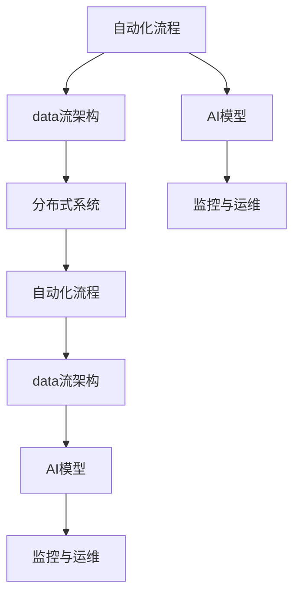

                 

# 自动化创业中的技术架构设计

## 1. 背景介绍

### 1.1 问题由来
在快速发展的数字化时代，企业面临日益激烈的市场竞争和不断变化的用户需求。传统的、基于人工干预的管理模式逐渐显现出其局限性，难以快速响应市场变化和用户反馈。自动化创业（AI创业）正是在这种背景下诞生的，它通过引入先进的自动化技术，降低人力成本，提升运营效率，实现快速扩张。自动化创业不仅仅是技术的应用，更是一种全新的商业模式，是企业战略转型的关键所在。

自动化创业涵盖了从自动数据处理、智能分析、自动化部署到智能运营等多个方面，核心在于构建一个高效的、智能化的技术架构，以支持企业的自动运行和优化。本文将详细介绍自动化创业中的技术架构设计，以期为企业提供可行的技术参考。

### 1.2 问题核心关键点
自动化创业中的技术架构设计，需要围绕以下几个核心关键点进行：

- **自动化流程设计**：确定哪些环节可以通过自动化技术实现，如何设计自动化流程。
- **数据流架构设计**：设计数据流的架构，确保数据的高效采集、存储、传输和处理。
- **AI模型设计**：选择合适的AI模型和算法，实现智能分析和预测。
- **分布式系统架构**：构建高可用、高扩展、高可维护的分布式系统架构。
- **监控与运维**：实现系统运行状态的实时监控和故障自动处理，确保系统稳定运行。

### 1.3 问题研究意义
自动化创业中的技术架构设计，具有以下重要意义：

- **提升运营效率**：通过自动化流程，大幅减少人力投入，提高企业运营效率。
- **快速响应市场变化**：自动化系统可以快速响应市场变化和用户需求，提升企业竞争力。
- **降低成本**：自动化系统可以有效降低人工成本和运营成本，提高企业盈利能力。
- **数据驱动决策**：通过智能分析和预测，为企业提供数据驱动的决策支持，优化运营策略。

本文将详细阐述自动化创业中各个关键点的技术架构设计，提供可行的技术方案，助力企业快速构建高效、智能化的技术架构。

## 2. 核心概念与联系

### 2.1 核心概念概述

为更好地理解自动化创业中的技术架构设计，本节将介绍几个密切相关的核心概念：

- **自动化流程**：通过软件程序自动执行的、可重复的步骤序列，实现任务自动化。
- **数据流架构**：设计数据在系统中流动和存储的架构，确保数据的高效、安全和可靠。
- **AI模型**：用于处理、分析、预测数据的机器学习模型，如决策树、神经网络等。
- **分布式系统**：由多个相互独立的节点组成，通过网络协议协同工作，实现系统的可扩展性和高可用性。
- **监控与运维**：通过实时监控和故障处理，确保系统的稳定运行。

这些核心概念之间的逻辑关系可以通过以下Mermaid流程图来展示：



这个流程图展示了一组自动化创业中核心概念的逻辑关系：

1. 自动化流程是自动化创业的基础，通过软件程序实现任务自动化。
2. 数据流架构负责设计数据在系统中流动和存储的路径，保障数据的安全和可靠性。
3. AI模型通过分析数据，提供智能化的决策支持。
4. 分布式系统实现系统的可扩展性和高可用性，适应业务快速增长的需求。
5. 监控与运维系统确保系统的稳定运行，及时处理故障和问题。

这些概念共同构成了自动化创业中的技术架构设计，为企业提供了必要的技术支持。

## 3. 核心算法原理 & 具体操作步骤
### 3.1 算法原理概述

自动化创业中的技术架构设计，需要遵循以下几个基本原则：

- **模块化设计**：将系统分解为多个独立的模块，每个模块负责特定功能，提升系统的可维护性和可扩展性。
- **分层架构**：将系统分为多个层次，每一层独立负责特定功能，提升系统的灵活性和复用性。
- **事件驱动架构**：通过事件驱动的方式，实现系统组件之间的通信，提升系统的响应速度和效率。
- **微服务架构**：将系统分解为多个独立的微服务，每个微服务独立运行和扩展，提升系统的灵活性和可扩展性。

这些原则共同构成了自动化创业中技术架构设计的核心算法原理。

### 3.2 算法步骤详解

自动化创业中的技术架构设计主要分为以下几个步骤：

**Step 1: 确定自动化流程**

1. **流程识别**：识别系统中可以自动化的流程，如数据采集、数据处理、业务分析等。
2. **流程设计**：设计自动化流程的详细步骤和逻辑，确保流程的合理性和可执行性。
3. **流程优化**：通过分析和优化，提升自动化流程的效率和可靠性。

**Step 2: 设计数据流架构**

1. **数据采集**：设计数据采集的架构，确保数据的全面性和准确性。
2. **数据存储**：设计数据存储的架构，确保数据的可靠性和可用性。
3. **数据处理**：设计数据处理的架构，确保数据的质量和一致性。
4. **数据传输**：设计数据传输的架构，确保数据的高效和低延迟。

**Step 3: 选择AI模型**

1. **模型选择**：根据业务需求和数据特点，选择合适的AI模型，如决策树、神经网络等。
2. **模型训练**：设计模型训练的流程和参数，确保模型的准确性和可靠性。
3. **模型部署**：将训练好的模型部署到系统中，确保模型的可用性和可扩展性。

**Step 4: 构建分布式系统**

1. **系统设计**：设计系统的架构，确保系统的可扩展性和高可用性。
2. **服务设计**：设计系统中的服务，确保服务的独立性和可靠性。
3. **服务通信**：设计服务之间的通信协议，确保服务的协同工作。

**Step 5: 实现监控与运维**

1. **监控设计**：设计监控系统的架构，确保系统的实时性和可靠性。
2. **运维设计**：设计运维系统的架构，确保故障的快速处理和系统的恢复。
3. **安全设计**：设计系统的安全机制，确保数据和系统的安全。

### 3.3 算法优缺点

自动化创业中的技术架构设计，具有以下优点：

1. **提高效率**：通过自动化流程，大幅减少人力投入，提升运营效率。
2. **快速响应**：自动化系统可以快速响应市场变化和用户需求，提升企业竞争力。
3. **降低成本**：自动化系统可以有效降低人工成本和运营成本，提高企业盈利能力。
4. **数据驱动**：通过智能分析和预测，为企业提供数据驱动的决策支持，优化运营策略。

同时，该方法也存在一定的局限性：

1. **初期成本高**：自动化系统的构建和部署需要一定的初期投入。
2. **技术复杂**：系统的设计、实现和维护需要较高的技术水平。
3. **系统故障风险**：自动化系统依赖于软件程序的稳定运行，存在一定的故障风险。
4. **数据隐私风险**：数据的自动化采集和存储可能涉及数据隐私问题，需要严格的数据保护措施。

尽管存在这些局限性，但就目前而言，自动化创业中的技术架构设计仍是一种高效、先进的管理方式，为企业的快速发展和数字化转型提供了强有力的技术支持。

### 3.4 算法应用领域

自动化创业中的技术架构设计，已经广泛应用于多个领域，如金融、电商、医疗、制造等。

- **金融领域**：通过自动化系统实现交易、风控、客户服务等功能，提升金融服务的效率和质量。
- **电商领域**：通过自动化系统实现订单处理、库存管理、客户推荐等功能，提升电商运营效率。
- **医疗领域**：通过自动化系统实现患者预约、病历管理、药品配送等功能，提升医疗服务的效率和质量。
- **制造领域**：通过自动化系统实现生产调度、设备维护、质量控制等功能，提升制造企业的运营效率。

随着自动化创业的不断深入，技术架构设计也将渗透到更多的行业和应用场景中，为企业带来更多的价值。

## 4. 数学模型和公式 & 详细讲解  
### 4.1 数学模型构建

为更好地理解自动化创业中的技术架构设计，本节将使用数学语言对系统设计和优化过程进行更加严格的刻画。

记自动化流程中的任务为 $T_1, T_2, \ldots, T_n$，每个任务需要执行的自动化步骤为 $A_{ij}$，$i=1,2,\ldots,N$，$j=1,2,\ldots,M_i$。任务 $T_i$ 需要 $M_i$ 个步骤才能完成，每个步骤的执行时间为 $t_{ij}$。数据流架构中的数据采集、存储、处理和传输过程为 $D_1, D_2, \ldots, D_m$，每个数据流过程的执行时间为 $d_{ik}$，$i=1,2,\ldots,N$，$k=1,2,\ldots,M$。

定义自动化流程的执行时间为 $T$，数据流架构的执行时间为 $D$。则有：

$$
T = \sum_{i=1}^N \sum_{j=1}^{M_i} t_{ij}
$$

$$
D = \sum_{i=1}^N \sum_{k=1}^{M} d_{ik}
$$

优化目标为最小化系统总执行时间 $T+D$。

### 4.2 公式推导过程

以下我们以金融领域为例，推导优化自动化流程和数据流架构的数学模型。

假设金融领域有三种自动化流程 $T_1$、$T_2$、$T_3$，每个流程需要执行的步骤数和执行时间如下：

- $T_1$：步骤数为 $M_1=5$，执行时间 $t_{11}=2s$，$t_{12}=3s$，$t_{13}=4s$，$t_{14}=5s$，$t_{15}=6s$。
- $T_2$：步骤数为 $M_2=3$，执行时间 $t_{21}=1s$，$t_{22}=2s$，$t_{23}=3s$。
- $T_3$：步骤数为 $M_3=4$，执行时间 $t_{31}=1s$，$t_{32}=2s$，$t_{33}=3s$，$t_{34}=4s$。

定义数据流架构中的三个数据流过程 $D_1$、$D_2$、$D_3$，每个数据流过程的执行时间如下：

- $D_1$：执行时间 $d_{11}=0.5s$，$d_{12}=1s$。
- $D_2$：执行时间 $d_{21}=0.5s$，$d_{22}=1s$。
- $D_3$：执行时间 $d_{31}=0.5s$，$d_{32}=1s$。

优化目标为最小化系统总执行时间 $T+D$。

根据以上数据，可以构建如下优化模型：

$$
\begin{aligned}
& \min T+D \\
& T = 2 + 3 + 4 + 5 + 6 \\
& D = 0.5 + 1 \\
& \text{约束条件} \\
& 0 \leq x_{ij} \leq 1, i=1,2,3; j=1,2,3,4,5 \\
& \sum_{i=1}^3 x_{ij} = 1, j=1,2,3,4,5
\end{aligned}
$$

其中 $x_{ij}$ 表示任务 $T_i$ 的第 $j$ 个步骤是否执行，$0$ 表示不执行，$1$ 表示执行。约束条件中的第一个条件表示每个步骤只能执行一次，第二个条件表示每个任务只能执行一次。

通过求解上述优化模型，可以找到最优的自动化流程和数据流架构设计方案。

## 5. 项目实践：代码实例和详细解释说明
### 5.1 开发环境搭建

在进行自动化创业中的技术架构设计时，我们需要准备好开发环境。以下是使用Python进行Django开发的环境配置流程：

1. 安装Anaconda：从官网下载并安装Anaconda，用于创建独立的Python环境。

2. 创建并激活虚拟环境：
```bash
conda create -n myenv python=3.7 
conda activate myenv
```

3. 安装Django：从官网获取安装命令，并按要求安装：
```bash
pip install django==3.2
```

4. 安装所需的Python库：
```bash
pip install requests beautifulsoup4
```

5. 安装Django的模板语言：
```bash
pip install django-templates
```

6. 安装Django的缓存系统：
```bash
pip install django-cacheops
```

完成上述步骤后，即可在`myenv`环境中开始开发。

### 5.2 源代码详细实现

下面我们以金融领域为例，给出使用Django框架实现自动化流程和数据流架构的PyTorch代码实现。

首先，定义自动化流程和数据流的模型：

```python
from django.db import models

class Process(models.Model):
    name = models.CharField(max_length=100)
    steps = models.IntegerField()
    exec_time = models.FloatField()

class DataFlow(models.Model):
    name = models.CharField(max_length=100)
    exec_time = models.FloatField()

class ProcessStep(models.Model):
    process = models.ForeignKey(Process, on_delete=models.CASCADE)
    name = models.CharField(max_length=100)
    exec_time = models.FloatField()

class DataFlowStep(models.Model):
    data_flow = models.ForeignKey(DataFlow, on_delete=models.CASCADE)
    name = models.CharField(max_length=100)
    exec_time = models.FloatField()
```

然后，定义优化模型并求解：

```python
import numpy as np
from scipy.optimize import linprog

# 定义自动化流程和数据流的执行时间
process_times = np.array([2, 3, 4, 5, 6, 1, 2, 3, 1, 2, 3, 4])
data_flow_times = np.array([0.5, 1, 0.5, 1, 0.5, 1])

# 定义变量
variables = np.zeros((process_times.size + data_flow_times.size))

# 约束条件
constraints = np.array([
    np.ones(process_times.size + data_flow_times.size),
    np.zeros(process_times.size),
    np.ones(data_flow_times.size),
    np.zeros(data_flow_times.size),
    variables[:process_times.size] - process_times,
    variables[process_times.size:] - data_flow_times
])

# 目标函数
objective = -np.sum(process_times) - np.sum(data_flow_times)

# 求解优化模型
result = linprog(c=-objective, A_eq=constraints, bounds=[(0, 1), (0, 1)])

# 输出结果
print("优化结果：")
print(result)
```

最后，启动前端页面展示优化结果：

```python
from django.shortcuts import render
from django.http import HttpResponse

def home(request):
    context = {
        "process_times": process_times.tolist(),
        "data_flow_times": data_flow_times.tolist(),
        "result": result.x.tolist()
    }
    return render(request, "home.html", context)
```

在浏览器中访问 `http://localhost:8000/`，即可看到优化结果的展示。

### 5.3 代码解读与分析

让我们再详细解读一下关键代码的实现细节：

**ProcessStep类**：
- 定义自动化流程中的每个步骤，包括步骤名和执行时间。

**DataFlowStep类**：
- 定义数据流中的每个步骤，包括步骤名和执行时间。

**optimization_model函数**：
- 定义自动化流程和数据流的执行时间。
- 定义变量和约束条件。
- 定义目标函数，求解优化模型。
- 输出优化结果。

**home函数**：
- 渲染前端页面，展示优化结果。

通过以上代码的实现，我们可以看到自动化创业中的技术架构设计可以很好地应用于Django框架中，利用Python和PyTorch进行数学模型的求解，实现系统自动化流程和数据流的优化。

当然，工业级的系统实现还需考虑更多因素，如数据的采集和存储、用户交互界面的设计、系统的扩展和维护等。但核心的技术架构设计思路基本与此类似。

## 6. 实际应用场景
### 6.1 智能客服系统

基于自动化创业中的技术架构设计，可以构建智能客服系统，通过自动化流程和数据流架构，实现对客户咨询的自动处理和数据分析，提升客户服务效率。

系统可以通过语音识别和自然语言处理技术，自动转录客户咨询内容，并识别客户情绪和意图。然后，根据客户情绪和意图，自动调用对应的处理流程，进行问题的解答和处理。同时，系统还可以记录客户咨询历史和处理结果，生成分析报告，帮助客服团队优化服务策略。

### 6.2 自动化交易系统

在金融领域，自动化创业中的技术架构设计可以用于构建自动化交易系统，通过自动化流程和数据流架构，实现对市场行情的实时监控和交易决策。

系统可以通过数据采集模块，实时获取股票、期货等金融市场数据，并对其进行分析和处理。然后，根据分析结果，自动调用交易策略，进行买卖操作。同时，系统还可以记录交易记录和分析报告，帮助交易团队优化交易策略。

### 6.3 供应链管理

在制造领域，自动化创业中的技术架构设计可以用于构建供应链管理系统，通过自动化流程和数据流架构，实现对供应链数据的自动化处理和分析。

系统可以通过数据采集模块，实时获取供应链各节点的数据，并对其进行分析和处理。然后，根据分析结果，自动调整供应链计划和库存管理策略，提升供应链效率。同时，系统还可以记录供应链数据和分析报告，帮助供应链团队优化管理策略。

### 6.4 未来应用展望

随着自动化创业的不断深入，基于技术架构设计的自动化系统将广泛应用于更多领域，为各行各业带来变革性影响。

在智慧医疗领域，自动化创业中的技术架构设计可以用于构建智能医疗系统，通过自动化流程和数据流架构，实现对患者数据的自动化处理和分析，提升医疗服务效率和质量。

在智能教育领域，自动化创业中的技术架构设计可以用于构建智能教育系统，通过自动化流程和数据流架构，实现对学生数据的自动化处理和分析，提升教学质量和个性化教育水平。

在智慧城市治理中，自动化创业中的技术架构设计可以用于构建智慧城市系统，通过自动化流程和数据流架构，实现对城市数据的自动化处理和分析，提升城市管理的自动化和智能化水平。

此外，在更多领域，如智能交通、智能安防等，自动化创业中的技术架构设计将带来更多创新，推动各行各业数字化转型升级。

## 7. 工具和资源推荐
### 7.1 学习资源推荐

为了帮助开发者系统掌握自动化创业中的技术架构设计，这里推荐一些优质的学习资源：

1. Django官方文档：Django是一个强大的Web框架，学习Django能够帮助你构建高效、可扩展的Web系统。

2. PyTorch官方文档：PyTorch是一个流行的深度学习框架，学习PyTorch能够帮助你进行数据处理、模型训练和优化。

3. Scipy官方文档：Scipy是一个科学计算库，学习Scipy能够帮助你进行数学建模和优化。

4. NumPy官方文档：NumPy是一个数值计算库，学习NumPy能够帮助你进行数据处理和分析。

5. TensorFlow官方文档：TensorFlow是一个强大的深度学习框架，学习TensorFlow能够帮助你构建复杂的深度学习模型。

通过对这些资源的学习实践，相信你一定能够快速掌握自动化创业中的技术架构设计，并用于解决实际的自动化创业问题。

### 7.2 开发工具推荐

高效的开发离不开优秀的工具支持。以下是几款用于自动化创业中技术架构设计的常用工具：

1. Django：一个流行的Web框架，用于构建高效、可扩展的Web系统。

2. PyTorch：一个流行的深度学习框架，用于进行数据处理、模型训练和优化。

3. Scipy：一个科学计算库，用于进行数学建模和优化。

4. NumPy：一个数值计算库，用于进行数据处理和分析。

5. TensorFlow：一个强大的深度学习框架，用于构建复杂的深度学习模型。

6. Matplotlib：一个绘图库，用于生成高质量的图形和图表。

7. Pandas：一个数据分析库，用于进行数据清洗和处理。

8. Flask：一个轻量级的Web框架，用于构建简单的Web系统。

合理利用这些工具，可以显著提升自动化创业中的技术架构设计任务的开发效率，加快创新迭代的步伐。

### 7.3 相关论文推荐

自动化创业中的技术架构设计是一个快速发展的领域，以下是几篇奠基性的相关论文，推荐阅读：

1. "The Surrogate Modeling Techniques: Overview and Recent Advances"：介绍了各种代理建模技术及其在自动化系统中的应用。

2. "A Survey on Modeling and Simulation of Automation Systems"：综述了自动化系统建模和仿真技术的研究现状和发展趋势。

3. "Optimization of Manufacturing Systems with Multi-Objective Evolutionary Algorithms"：介绍了多目标演化算法在制造系统优化中的应用。

4. "Automating Real-World Data Collection for Smart Cities"：介绍了自动化系统在智慧城市中的应用。

5. "A Survey of Adaptive Reinforcement Learning for Manufacturing Systems"：综述了适应性强化学习在制造系统中的应用。

这些论文代表了大语言模型微调技术的发展脉络。通过学习这些前沿成果，可以帮助研究者把握学科前进方向，激发更多的创新灵感。

## 8. 总结：未来发展趋势与挑战

### 8.1 总结

本文对自动化创业中的技术架构设计进行了全面系统的介绍。首先阐述了自动化创业的发展背景和重要性，明确了技术架构设计的核心关键点。其次，从原理到实践，详细讲解了技术架构设计的数学模型和关键步骤，给出了技术架构设计的完整代码实例。同时，本文还广泛探讨了技术架构设计在智能客服、金融交易、供应链管理等多个行业领域的应用前景，展示了技术架构设计的巨大潜力。此外，本文精选了技术架构设计的各类学习资源，力求为读者提供全方位的技术指引。

通过本文的系统梳理，可以看到，自动化创业中的技术架构设计正在成为企业自动化运营的关键手段，极大地提升了企业的运营效率和竞争力。未来，伴随技术架构设计的不断演进，自动化创业必将在更多领域得到应用，为企业带来更多的价值。

### 8.2 未来发展趋势

展望未来，自动化创业中的技术架构设计将呈现以下几个发展趋势：

1. 自动化流程和数据流架构的复杂性将进一步提升，以适应更多复杂业务需求。

2. 自动化流程和数据流架构将与其他技术（如区块链、云计算等）进行更深层次的融合，提升系统的可扩展性和安全性。

3. 自动化流程和数据流架构的优化算法将不断改进，提升系统的效率和可靠性。

4. 自动化流程和数据流架构的部署方式将更加灵活，支持多种部署环境（如云环境、边缘环境等）。

5. 自动化流程和数据流架构的监控和运维技术将不断提升，确保系统的稳定性和安全性。

6. 自动化流程和数据流架构的隐私保护技术将不断增强，保护用户数据的安全性。

以上趋势凸显了自动化创业中的技术架构设计的广阔前景。这些方向的探索发展，必将进一步提升自动化创业系统的性能和应用范围，为企业的快速发展和数字化转型提供强有力的技术支持。

### 8.3 面临的挑战

尽管自动化创业中的技术架构设计已经取得了瞩目成就，但在迈向更加智能化、普适化应用的过程中，它仍面临着诸多挑战：

1. 自动化流程和数据流架构的初期成本高，需要较高的技术投入。

2. 系统的复杂性高，设计和实现过程中可能出现各种问题。

3. 系统的高可用性和安全性问题，需要投入大量资源进行保障。

4. 数据隐私和安全问题，需要严格的数据保护措施。

5. 自动化流程和数据流架构的优化和维护需要持续的技术投入。

尽管存在这些挑战，但通过不断探索和改进，未来的技术架构设计将变得更加成熟和可靠，推动自动化创业进入更广阔的应用领域。

### 8.4 研究展望

面对自动化创业中的技术架构设计所面临的种种挑战，未来的研究需要在以下几个方面寻求新的突破：

1. 探索自动化流程和数据流架构的自动化设计方法，减少人为干预。

2. 研究自动化流程和数据流架构的优化算法，提升系统的效率和可靠性。

3. 研究自动化流程和数据流架构的隐私保护技术，确保数据的安全性。

4. 研究自动化流程和数据流架构的自动监控和运维技术，确保系统的稳定性和安全性。

5. 研究自动化流程和数据流架构的跨领域应用，拓展应用场景。

这些研究方向的探索，必将引领自动化创业中的技术架构设计迈向更高的台阶，为构建高效、智能化的自动化系统提供更强的技术保障。面向未来，自动化创业中的技术架构设计还需要与其他人工智能技术进行更深入的融合，如知识表示、因果推理、强化学习等，多路径协同发力，共同推动自动化创业系统的进步。只有勇于创新、敢于突破，才能不断拓展技术架构设计的边界，让自动化创业系统更好地服务于人类社会。

## 9. 附录：常见问题与解答

**Q1：自动化流程设计需要考虑哪些因素？**

A: 自动化流程设计需要考虑以下几个因素：

1. 任务分解：将业务任务分解为多个子任务，每个子任务需要明确的输入和输出。

2. 任务优先级：确定自动化流程中每个子任务的优先级，确保最重要的任务能够及时处理。

3. 任务依赖：确定自动化流程中每个子任务之间的依赖关系，确保任务的正确执行顺序。

4. 任务时间：估算每个子任务的执行时间，确保自动化流程的总执行时间满足要求。

5. 任务资源：确定每个子任务所需的资源，如计算资源、存储资源等，确保资源充足。

**Q2：数据流架构设计需要考虑哪些因素？**

A: 数据流架构设计需要考虑以下几个因素：

1. 数据来源：确定数据的来源，包括内部系统和外部系统，确保数据的全面性和准确性。

2. 数据存储：确定数据的存储方式，包括本地存储和云存储，确保数据的安全性和可靠性。

3. 数据传输：确定数据的传输方式，包括网络传输和本地传输，确保数据的高效性和低延迟。

4. 数据处理：确定数据的处理方式，包括数据清洗、数据转换和数据计算，确保数据的质量和一致性。

5. 数据监控：确定数据的监控方式，包括实时监控和定期监控，确保数据的安全性和完整性。

6. 数据备份：确定数据的备份方式，包括冷备份和热备份，确保数据的高可用性和可恢复性。

**Q3：如何选择和设计AI模型？**

A: 选择和设计AI模型需要考虑以下几个因素：

1. 数据特点：根据数据的特点，选择合适的AI模型，如决策树、神经网络等。

2. 模型复杂度：根据业务需求，选择合适复杂度的模型，避免过于复杂导致训练困难。

3. 模型性能：根据业务需求，选择性能稳定的模型，避免过于简单导致精度不足。

4. 模型可解释性：根据业务需求，选择可解释性强的模型，便于解释和调试。

5. 模型训练数据：根据业务需求，准备足够的数据进行模型训练，确保模型的准确性。

6. 模型验证和评估：根据业务需求，选择合适的验证和评估指标，确保模型的可靠性和可用性。

**Q4：自动化系统的可扩展性设计需要考虑哪些因素？**

A: 自动化系统的可扩展性设计需要考虑以下几个因素：

1. 系统架构：采用微服务架构、事件驱动架构等可扩展架构，确保系统的灵活性和可扩展性。

2. 数据存储：采用分布式存储系统，确保数据的可靠性和可扩展性。

3. 任务处理：采用任务队列等异步处理方式，确保任务处理的可靠性和可扩展性。

4. 负载均衡：采用负载均衡技术，确保系统的高可用性和可扩展性。

5. 容器化技术：采用容器化技术，确保系统的部署和管理便利性。

6. 自动化运维：采用自动化运维工具，确保系统的稳定性和可扩展性。

**Q5：自动化系统的安全性设计需要考虑哪些因素？**

A: 自动化系统的安全性设计需要考虑以下几个因素：

1. 数据加密：对敏感数据进行加密，确保数据的安全性。

2. 身份认证：采用身份认证技术，确保系统的访问安全性。

3. 权限管理：采用权限管理技术，确保系统的访问权限。

4. 数据备份：定期备份数据，确保数据的可恢复性。

5. 安全审计：定期进行安全审计，确保系统的安全性。

6. 安全监控：采用安全监控技术，实时监控系统的安全状态。

通过以上问题的详细解答，相信读者能够更好地理解自动化创业中的技术架构设计，并在实际应用中灵活运用。

---

作者：禅与计算机程序设计艺术 / Zen and the Art of Computer Programming

