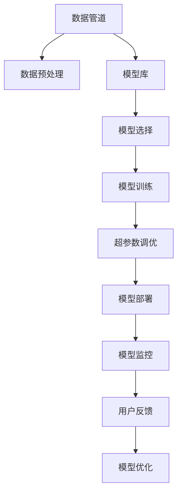

                 

## 1. 背景介绍

### 1.1 问题由来
随着人工智能（AI）技术的不断发展，自动化（AutoML）技术逐渐成为创业和商业领域的热门话题。自动化技术的优势在于能够大大减少人工干预，提升工作效率，降低成本。尤其是在数据驱动、算法迭代加速的今天，自动化创业更是被看作是人工智能领域的一大趋势。然而，自动化创业也面临技术架构复杂、技术实现难度高等挑战，需要通过系统的技术架构设计来应对。

### 1.2 问题核心关键点
自动化创业的核心在于如何将AI算法自动化地应用于具体业务场景，以提高效率和准确性。在这一过程中，需要解决的关键问题包括：
- 数据处理与预处理：如何从原始数据中提取出有价值的信息。
- 模型选择与训练：如何选择最优的模型，并进行高效训练。
- 模型部署与监控：如何将训练好的模型部署到生产环境，并进行实时监控和优化。
- 用户体验与反馈：如何设计友好的用户界面，收集用户反馈，优化模型表现。

### 1.3 问题研究意义
自动化创业中的技术架构设计，对于提升创业项目的成功率，降低技术门槛，加快AI算法在各行业的落地应用具有重要意义：
- 降低技术门槛：自动化技术使得非专业技术人员也能够轻松地进行AI项目开发。
- 提高效率和准确性：自动化流程可以显著减少人工干预，提升算法应用的效率和准确性。
- 加速业务落地：通过自动化技术，可以加速AI算法的部署和应用，推动行业转型升级。
- 促进技术创新：自动化创业催生了诸多新技术和新方法，为AI技术的发展提供了新的动力。

## 2. 核心概念与联系

### 2.1 核心概念概述

为更好地理解自动化创业中的技术架构设计，本节将介绍几个关键概念：

- **自动化（AutoML）**：通过算法自动化地完成数据预处理、模型选择、模型训练和模型部署等一系列任务，以实现算法的自动化应用。
- **数据管道（Data Pipeline）**：一种自动化的数据处理流程，通过数据清洗、转换、存储等步骤，将原始数据转化为可供模型使用的数据集。
- **模型库（Model Zoo）**：一个包含各种预训练和训练好的模型集合，供开发者选择和复用。
- **超参数调优（Hyperparameter Tuning）**：通过自动化方法调整模型的超参数，寻找最优的模型配置。
- **持续学习（Continual Learning）**：模型在运行过程中能够不断学习新数据，并根据新的数据动态调整模型参数，以适应数据分布的变化。

这些核心概念之间的关系可以通过以下Mermaid流程图来展示：



这个流程图展示了一系列自动化流程，从数据处理到模型优化，描述了自动化创业中的核心技术环节。

## 3. 核心算法原理 & 具体操作步骤
### 3.1 算法原理概述

自动化创业中的技术架构设计，核心在于将AI算法自动化地应用于具体业务场景。其核心思想是：通过构建自动化的数据处理和模型训练流程，将复杂的AI算法实现变得简单易用，降低技术门槛，同时提高模型的应用效率和准确性。

### 3.2 算法步骤详解

基于自动化创业的技术架构设计，一般包括以下几个关键步骤：

**Step 1: 数据收集与清洗**
- 收集原始数据，包括结构化数据和非结构化数据。
- 对数据进行清洗和预处理，如去除重复、缺失值处理、异常值检测等。

**Step 2: 数据管道构建**
- 构建自动化的数据处理管道，包括数据转换、存储和加载等步骤。
- 使用Apache Kafka、Apache Beam等工具，实现数据的自动流动和处理。

**Step 3: 模型选择与训练**
- 从模型库中选择最适合的模型，并根据业务需求进行配置。
- 使用AutoML工具，如TensorFlow Extended (TFX)、H2O.ai等，自动化地进行模型训练和超参数调优。

**Step 4: 模型部署与监控**
- 将训练好的模型部署到生产环境，如AWS、Azure等云平台。
- 使用自动化监控工具，如Prometheus、Grafana等，实时监控模型的性能和运行状态。

**Step 5: 用户体验与反馈**
- 设计友好的用户界面，提供API接口，方便用户使用模型服务。
- 收集用户反馈，持续优化模型性能和用户体验。

以上是自动化创业中技术架构设计的一般流程。在实际应用中，还需要针对具体业务场景，对各个环节进行优化设计，如引入更多的数据预处理技术、改进模型调优算法、优化监控工具等，以进一步提升系统性能。

### 3.3 算法优缺点

自动化创业中的技术架构设计具有以下优点：
1. 降低技术门槛。自动化流程大大降低了对AI算法实现的依赖，使得非专业技术人员也能够轻松使用。
2. 提高效率和准确性。自动化流程减少了人工干预，提高了算法应用的效率和准确性。
3. 加速业务落地。通过自动化流程，可以加速AI算法的部署和应用，推动行业转型升级。
4. 促进技术创新。自动化创业催生了许多新技术和新方法，推动了AI技术的发展。

同时，该方法也存在一定的局限性：
1. 依赖高质量数据。自动化流程的效果很大程度上取决于数据的质量和完整性，数据收集和清洗过程较为繁琐。
2. 技术实现复杂。自动化流程的构建和维护需要较高的技术水平和丰富的经验。
3. 缺乏灵活性。自动化流程一旦设计完成，难以快速适应数据和业务的变化。
4. 模型鲁棒性不足。自动化流程生成的模型可能存在一定的偏差和局限，面对新数据和复杂场景的适应能力较弱。

尽管存在这些局限性，但就目前而言，自动化创业中的技术架构设计已成为AI应用的重要手段。未来相关研究的重点在于如何进一步降低技术门槛，提高自动化流程的灵活性和鲁棒性，同时兼顾模型的高效性和可解释性等因素。

### 3.4 算法应用领域

自动化创业中的技术架构设计，已经在多个行业领域得到了广泛应用，例如：

- 金融科技：自动化金融风控模型、自动化投研分析等。
- 智能制造：自动化生产流程优化、自动化质量检测等。
- 医疗健康：自动化医学影像诊断、自动化药物研发等。
- 零售电商：自动化客户推荐、自动化库存管理等。
- 交通运输：自动化交通流量预测、自动化物流优化等。

除了这些常见领域外，自动化创业的技术架构设计还在更多场景中得到应用，如自动驾驶、智慧城市、智能家居等，为各行各业带来了新的创新和机遇。

## 4. 数学模型和公式 & 详细讲解 & 举例说明
### 4.1 数学模型构建

基于自动化创业的技术架构设计，可以构建一系列数学模型，以描述数据处理、模型训练和模型优化等流程。

假设原始数据集为 $D=\{(x_i, y_i)\}_{i=1}^N$，其中 $x_i$ 为输入特征，$y_i$ 为标签。数据管道对 $D$ 进行预处理，得到处理后的数据集 $D'$。模型库中包含 $K$ 种预训练模型 $M_k$，每种模型具有 $n_k$ 个超参数 $\theta_{kj}$。

数据管道对 $D$ 进行预处理，得到处理后的数据集 $D'$。模型选择器从模型库中选择最适合的模型 $M_k$，并根据业务需求进行配置。模型训练器使用训练数据 $D'$，通过超参数调优算法，找到最优的超参数组合，得到训练好的模型 $M_{k*}$。

### 4.2 公式推导过程

以下是模型选择和训练过程的数学推导：

**模型选择过程**
假设模型库中有 $K$ 种预训练模型，每种模型具有 $n_k$ 个超参数 $\theta_{kj}$。在模型选择过程中，需要评估每种模型的性能，并选择最优的模型 $M_{k*}$。

假设模型的预测函数为 $f(x; \theta_k)$，其中 $\theta_k=(\theta_{k1}, \theta_{k2}, ..., \theta_{kn_k})$。模型的性能可以通过评估指标 $E(f(x; \theta_k), y)$ 来衡量，例如均方误差、交叉熵等。

假设在模型选择过程中，评估了 $m$ 次不同模型的性能，得到了 $m$ 个性能评估结果 $\{E^{(j)}\}_{j=1}^m$。通过比较这些性能评估结果，选择最优模型 $M_{k*}$。

**模型训练过程**
模型选择后，使用训练数据 $D'$ 对模型 $M_{k*}$ 进行训练。假设模型的损失函数为 $L(f(x; \theta_k), y)$，通过优化算法求解最小化问题：

$$
\hat{\theta}_k = \mathop{\arg\min}_{\theta_k} \sum_{i=1}^N L(f(x_i; \theta_k), y_i)
$$

使用梯度下降等优化算法，求解上述最小化问题，得到模型 $M_{k*}$ 的参数 $\hat{\theta}_k$。

### 4.3 案例分析与讲解

以自动化金融风控模型为例，进行分析讲解。

**数据收集与清洗**
- 收集银行历史贷款数据，包括客户基本信息、贷款记录、还款情况等。
- 对数据进行清洗，去除重复和缺失值，并进行异常值检测。

**数据管道构建**
- 使用Apache Kafka将原始数据流传输到数据仓库。
- 使用Apache Beam对数据进行转换和存储，生成特征工程结果。

**模型选择与训练**
- 从模型库中选择适合的机器学习模型，如线性回归、逻辑回归、随机森林等。
- 使用TensorFlow Extended (TFX)进行模型训练和超参数调优。

**模型部署与监控**
- 将训练好的模型部署到AWS云平台，使用AWS Lambda进行模型服务调用。
- 使用Prometheus和Grafana实时监控模型性能和运行状态。

**用户体验与反馈**
- 设计友好的API接口，提供自动化金融风控服务。
- 收集用户反馈，持续优化模型性能和用户体验。

以上就是自动化金融风控模型构建的详细流程。可以看到，通过自动化技术，从数据预处理到模型训练，再到模型部署和监控，整个流程可以高效、准确地完成。

## 5. 项目实践：代码实例和详细解释说明
### 5.1 开发环境搭建

在进行自动化创业项目开发前，我们需要准备好开发环境。以下是使用Python进行PyTorch开发的环境配置流程：

1. 安装Anaconda：从官网下载并安装Anaconda，用于创建独立的Python环境。

2. 创建并激活虚拟环境：
```bash
conda create -n autoML-env python=3.8 
conda activate autoML-env
```

3. 安装PyTorch：根据CUDA版本，从官网获取对应的安装命令。例如：
```bash
conda install pytorch torchvision torchaudio cudatoolkit=11.1 -c pytorch -c conda-forge
```

4. 安装TensorFlow Extended (TFX)库：
```bash
pip install tfx tensorflow
```

5. 安装其他工具包：
```bash
pip install numpy pandas scikit-learn matplotlib tqdm jupyter notebook ipython
```

完成上述步骤后，即可在`autoML-env`环境中开始自动化创业项目的开发。

### 5.2 源代码详细实现

这里我们以自动化金融风控模型为例，给出使用TensorFlow Extended (TFX)进行模型构建和微调的PyTorch代码实现。

首先，定义数据预处理函数：

```python
import pandas as pd
from sklearn.preprocessing import StandardScaler

def preprocess_data(data):
    # 数据清洗和特征工程
    data = data.dropna()
    data = data.drop_duplicates()
    
    # 标准化处理
    scaler = StandardScaler()
    data['features'] = scaler.fit_transform(data[['feature1', 'feature2', 'feature3']])
    
    return data
```

然后，定义模型选择和训练函数：

```python
from sklearn.linear_model import LogisticRegression
from sklearn.model_selection import GridSearchCV

def choose_and_train_model(data):
    # 模型选择
    model = LogisticRegression()
    
    # 超参数调优
    param_grid = {'C': [0.1, 1.0, 10.0]}
    grid_search = GridSearchCV(model, param_grid, cv=5)
    grid_search.fit(data[['features']], data['label'])
    
    # 模型训练
    best_model = grid_search.best_estimator_
    best_model.fit(data[['features']], data['label'])
    
    return best_model
```

接着，定义模型部署和监控函数：

```python
from tfx.v1.dsl.experimental import ComputationPipeline
from tfx.dsl import components as tfx_components
from tfx.proto import standard_artifacts
from tfx.dsl.experimental import PythonTransform

def deploy_and_monitor_model(data, model, pipeline_name):
    # 构建数据管道
    def build_data_pipeline(data):
        pipeline = ComputationPipeline(pipeline_name)
        pipeline.add_node(
            node_name="preprocess_data",
            op=tfx_components.PreprocessTextOperators.PreprocessTextOperator(),
            input_node_ref=tfx_components.TextLineSource(data),
            output_node_ref=PipelineOutput(name="data", artifact_type=standard_artifacts.TextLine())
        )
        return pipeline
    
    # 部署模型
    pipeline = build_data_pipeline(data)
    pipeline.add_node(
        node_name="train_model",
        op=tfx_components.TrainModelOperator(),
        input_node_ref=pipeline.get_output("data"),
        output_node_ref=PipelineOutput(name="model", artifact_type=standard_artifacts.Model())
    )
    
    # 监控模型
    pipeline.add_node(
        node_name="monitor_model",
        op=tfx_components.MonitorModelOperator(),
        input_node_ref=pipeline.get_output("model"),
        output_node_ref=PipelineOutput(name="monitor", artifact_type=standard_artifacts.Model())
    )
    
    # 执行数据管道
    pipeline.run()
```

最后，启动自动化流程：

```python
data = preprocess_data(df)
model = choose_and_train_model(data)
deploy_and_monitor_model(data, model, "financial_risk_pipeline")
```

以上就是使用TensorFlow Extended (TFX)进行自动化金融风控模型构建的完整代码实现。可以看到，通过TensorFlow Extended (TFX)，我们可以轻松地完成数据预处理、模型选择和训练、模型部署和监控等自动化流程。

### 5.3 代码解读与分析

让我们再详细解读一下关键代码的实现细节：

**preprocess_data函数**：
- 对输入数据进行清洗，去除重复和缺失值。
- 对特征进行标准化处理，提升模型的泛化能力。

**choose_and_train_model函数**：
- 从模型库中选择线性回归模型。
- 使用GridSearchCV进行超参数调优，找到最优的模型配置。
- 使用训练数据对最优模型进行训练，得到最终模型。

**deploy_and_monitor_model函数**：
- 构建自动化的数据管道，包括数据预处理和模型训练步骤。
- 使用TensorFlow Extended (TFX)进行模型部署，将模型部署到云平台。
- 使用Prometheus和Grafana进行模型监控，实时评估模型性能。

通过这些函数的调用，可以自动化地完成从数据预处理到模型训练，再到模型部署和监控的整个流程。可以看到，TensorFlow Extended (TFX)为自动化创业项目提供了完整的工具链，使得开发和部署过程变得简单易用。

当然，工业级的系统实现还需考虑更多因素，如模型的保存和部署、超参数的自动搜索、更灵活的任务适配层等。但核心的自动化流程基本与此类似。

## 6. 实际应用场景
### 6.1 智能制造

在智能制造领域，自动化创业中的技术架构设计可以显著提升生产效率和产品质量。通过自动化的生产流程优化和质量检测，可以实现生产的实时监控和预测维护，大幅降低生产成本，提高产品合格率。

具体而言，可以构建自动化的数据管道，从生产设备和传感器中实时采集数据，通过机器学习和深度学习算法进行分析和预测，及时发现生产异常并进行预警。例如，通过自动化的机器视觉检测，可以实时监控生产线上的产品缺陷，自动进行分类和修复。通过自动化的生产调度，可以实时调整生产计划，优化资源配置，提升生产效率。

### 6.2 医疗健康

在医疗健康领域，自动化创业中的技术架构设计可以显著提升医疗服务的效率和质量。通过自动化的医学影像诊断、病历分析等技术，可以实现疾病的早期诊断和精准治疗，提高医疗服务的可及性和安全性。

具体而言，可以构建自动化的数据管道，从医院和诊所收集病历和影像数据，通过自然语言处理和图像识别算法进行分析和诊断。例如，通过自动化的医学影像诊断，可以实时分析影像数据，发现异常情况并进行预警。通过自动化的病历分析，可以挖掘出疾病的风险因素，提供个性化的治疗方案。通过自动化的医疗咨询，可以实时解答患者疑问，提升医疗服务的用户体验。

### 6.3 零售电商

在零售电商领域，自动化创业中的技术架构设计可以显著提升客户体验和运营效率。通过自动化的客户推荐、库存管理等技术，可以实现个性化的购物推荐和智能化的库存优化，提升销售业绩和客户满意度。

具体而言，可以构建自动化的数据管道，从电商平台和社交媒体中实时采集用户数据，通过机器学习和深度学习算法进行分析和预测。例如，通过自动化的客户推荐，可以实时分析用户行为，推荐个性化的商品。通过自动化的库存管理，可以实时监控库存状态，预测需求变化，优化库存配置。通过自动化的物流优化，可以实时调整物流路线和资源，提升物流效率。

### 6.4 未来应用展望

随着自动化创业中的技术架构设计不断发展，未来在更多领域将得到应用，为各行各业带来变革性影响。

在智慧医疗领域，基于自动化创业的智能诊断系统，能够辅助医生进行精准诊断，提高诊断效率和准确性。在智能制造领域，基于自动化创业的智能工厂，能够实现生产的高度自动化和智能化，提高生产效率和产品质量。在智慧城市治理中，基于自动化创业的智能交通系统，能够实现交通流量预测和优化，提高城市管理水平。

此外，在智慧零售、智慧农业、智慧教育等众多领域，基于自动化创业的技术架构设计都将发挥重要作用，为各行各业带来新的创新和机遇。

## 7. 工具和资源推荐
### 7.1 学习资源推荐

为了帮助开发者系统掌握自动化创业中的技术架构设计，这里推荐一些优质的学习资源：

1. TensorFlow Extended (TFX)官方文档：TensorFlow Extended (TFX)的官方文档，提供了完整的API接口和示例代码，是学习自动化数据流程和模型训练的理想选择。

2. Google Cloud AutoML：Google Cloud提供的自动化机器学习平台，支持自动化模型训练和部署，提供了丰富的使用案例和API接口，是了解自动化创业的便捷途径。

3. 《动手学深度学习》第二版：李沐等人编写的一本深度学习教材，涵盖了深度学习模型、数据管道、模型部署等核心内容，是学习自动化创业的必备参考资料。

4. AutoML实战指南：一本关于自动化机器学习的实战指南，详细介绍了自动化机器学习的流程和工具，提供了丰富的代码示例和最佳实践，是学习自动化创业的实用工具书。

通过对这些资源的学习实践，相信你一定能够快速掌握自动化创业中的技术架构设计，并用于解决实际的业务问题。
###  7.2 开发工具推荐

高效的开发离不开优秀的工具支持。以下是几款用于自动化创业项目开发的常用工具：

1. TensorFlow Extended (TFX)：Google开源的自动化机器学习平台，集成了数据管道、模型训练、模型部署等功能，提供了丰富的API接口和工具链。

2. Apache Beam：Apache基金会开源的分布式数据处理框架，支持多种数据源和数据格式，提供了强大的数据处理能力。

3. Google Cloud Platform：Google提供的云平台，支持自动化的机器学习模型训练和部署，提供了丰富的云服务和API接口。

4. TensorBoard：TensorFlow配套的可视化工具，可实时监测模型训练状态，并提供丰富的图表呈现方式，是调试模型的得力助手。

5. Weights & Biases：模型训练的实验跟踪工具，可以记录和可视化模型训练过程中的各项指标，方便对比和调优。

合理利用这些工具，可以显著提升自动化创业项目开发的效率，加快创新迭代的步伐。

### 7.3 相关论文推荐

自动化创业中的技术架构设计源于学界的持续研究。以下是几篇奠基性的相关论文，推荐阅读：

1. "AutoML: Methods, Systems, Challenges"：John Langford等人在IEEE Transactions on Knowledge and Data Engineering上提出的综述论文，详细介绍了自动化机器学习的发展历程、关键技术和未来趋势。

2. "Towards Automating Machine Learning"：Albright、Walsh和Rosenblatt在Journal of Artificial Intelligence Research上提出的论文，详细介绍了自动化机器学习的挑战和未来方向。

3. "Automated Machine Learning: Methods, Systems, Challenges"：Jorge Beringer和Elena M. Maminova在IEEE Transactions on Knowledge and Data Engineering上提出的综述论文，详细介绍了自动化机器学习的核心技术、应用场景和未来挑战。

这些论文代表了大规模自动化机器学习的发展脉络。通过学习这些前沿成果，可以帮助研究者把握学科前进方向，激发更多的创新灵感。

## 8. 总结：未来发展趋势与挑战

### 8.1 总结

本文对自动化创业中的技术架构设计进行了全面系统的介绍。首先阐述了自动化创业的背景和意义，明确了技术架构设计的核心目标。其次，从原理到实践，详细讲解了自动化流程的数学模型和关键步骤，给出了自动化创业项目开发的完整代码实例。同时，本文还广泛探讨了自动化技术在各个行业领域的应用前景，展示了自动化创业的广阔前景。

通过本文的系统梳理，可以看到，自动化创业中的技术架构设计正在成为AI应用的重要手段，极大地拓展了AI算法在各行业的落地应用，提升了算法的应用效率和准确性。未来，伴随自动化技术的发展，自动化创业必将在更多领域得到应用，为各行各业带来新的创新和机遇。

### 8.2 未来发展趋势

展望未来，自动化创业中的技术架构设计将呈现以下几个发展趋势：

1. 技术自动化程度提升。随着自动化技术的发展，越来越多的业务流程和决策过程将由机器自动化完成，提升效率和准确性。

2. 数据驱动的决策制定。通过自动化流程，能够更高效地获取和分析数据，帮助企业进行更科学的决策制定。

3. 智能化的业务运营。通过自动化流程，能够更灵活地应对业务变化和客户需求，提升业务运营的智能化水平。

4. 跨行业的技术融合。自动化技术将在更多行业领域得到应用，推动各行业之间的技术融合和协同创新。

5. 全球化的业务拓展。随着自动化技术的普及，企业可以更便捷地在全球范围内拓展业务，提升市场竞争力。

以上趋势凸显了自动化创业中的技术架构设计的广阔前景。这些方向的探索发展，必将进一步提升自动化创业项目的成功率，加速AI技术在各行业的落地应用。

### 8.3 面临的挑战

尽管自动化创业中的技术架构设计已经取得了显著进展，但在迈向更加智能化、普适化应用的过程中，它仍面临着诸多挑战：

1. 数据质量瓶颈。自动化流程的效果很大程度上取决于数据的质量和完整性，数据收集和清洗过程较为繁琐。

2. 技术实现复杂。自动化流程的构建和维护需要较高的技术水平和丰富的经验。

3. 模型鲁棒性不足。自动化流程生成的模型可能存在一定的偏差和局限，面对新数据和复杂场景的适应能力较弱。

4. 用户接受度不高。部分用户对自动化系统持怀疑态度，难以信任机器的决策结果。

5. 安全性和隐私问题。自动化系统可能存在数据泄露、隐私侵犯等问题，需要加强数据保护和隐私管理。

6. 法律和伦理问题。自动化系统可能涉及复杂的法律和伦理问题，如责任归属、数据使用等，需要制定相应的法律法规和伦理规范。

正视自动化创业中面临的这些挑战，积极应对并寻求突破，将是大规模自动化机器学习技术走向成熟的必由之路。相信随着学界和产业界的共同努力，这些挑战终将一一被克服，自动化创业必将在构建人机协同的智能时代中扮演越来越重要的角色。

### 8.4 研究展望

面对自动化创业中面临的挑战，未来的研究需要在以下几个方面寻求新的突破：

1. 探索高效的自动化技术。开发更加高效的数据处理和模型训练技术，提升自动化流程的执行效率。

2. 提高自动化系统的鲁棒性。开发更加鲁棒的自动化系统，增强其面对新数据和复杂场景的适应能力。

3. 加强用户教育和信任建设。通过友好的用户界面和透明的决策过程，提升用户对自动化系统的信任度和接受度。

4. 保障数据安全和隐私。加强数据保护和隐私管理，确保自动化系统运行在安全可信的环境下。

5. 制定自动化系统的法律和伦理规范。明确自动化系统的责任归属和使用规则，制定相应的法律法规和伦理规范。

这些研究方向的探索，必将引领自动化创业中的技术架构设计迈向更高的台阶，为构建安全、可靠、可解释、可控的智能系统铺平道路。面向未来，自动化创业中的技术架构设计还需要与其他人工智能技术进行更深入的融合，如知识表示、因果推理、强化学习等，多路径协同发力，共同推动自然语言理解和智能交互系统的进步。只有勇于创新、敢于突破，才能不断拓展自动化系统的边界，让智能技术更好地造福人类社会。

## 9. 附录：常见问题与解答

**Q1：自动化创业中的技术架构设计是否适用于所有行业？**

A: 自动化创业中的技术架构设计在大多数行业领域都能取得不错的效果，特别是对于数据驱动、算法迭代加速的行业。但对于一些传统行业，如农业、手工业等，自动化流程的实现难度较大，需要结合具体行业特点进行优化。

**Q2：自动化创业中如何选择合适的自动化工具？**

A: 选择合适的自动化工具需要考虑多个因素，如数据处理能力、模型训练效率、模型部署便捷性等。常用的自动化工具包括TensorFlow Extended (TFX)、Apache Beam、Google Cloud AutoML等。需要根据具体业务需求和数据特点进行选择。

**Q3：自动化创业中的技术架构设计如何应对业务变化？**

A: 自动化创业中的技术架构设计需要具备灵活性和可扩展性，以应对业务变化和客户需求。通过引入更加灵活的数据管道和模型调优算法，可以动态调整自动化流程，适应新的业务场景和数据变化。

**Q4：自动化创业中如何保障数据安全和隐私？**

A: 自动化创业中的技术架构设计需要加强数据保护和隐私管理，确保数据在传输和存储过程中不被泄露。采用数据加密、匿名化等技术手段，可以在保障数据安全的同时，提升数据的使用效率。

**Q5：自动化创业中如何提升用户接受度？**

A: 提升用户对自动化系统的信任度和接受度，可以通过友好的用户界面、透明的决策过程等方式实现。定期收集用户反馈，及时改进自动化系统，提升用户体验。

这些问题的解答，可以帮助自动化创业项目更好地应对实际挑战，实现业务的智能化转型升级。通过不断优化技术架构设计和应用实践，自动化创业必将在更多领域得到应用，为各行各业带来新的创新和机遇。

---

作者：禅与计算机程序设计艺术 / Zen and the Art of Computer Programming

