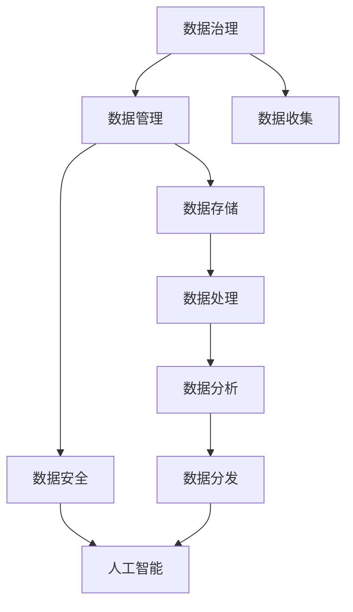

                 

# 自动化创业中的数据治理与管理

> 关键词：自动化创业,数据治理,数据管理,数据安全,人工智能

## 1. 背景介绍

在当今的数字化时代，数据已经成为了企业最重要的资产之一。对于自动化创业公司而言，如何高效管理和治理数据，成为了能否成功的关键。数据治理与管理，不仅仅是为了保证数据的完整性、准确性和安全性，更是为了提升数据驱动决策的能力，加速企业的发展速度。本文将从数据治理与管理的核心概念、常见问题与应对策略等方面，全面阐述如何在自动化创业中有效管理和治理数据。

## 2. 核心概念与联系

### 2.1 核心概念概述

为了更好地理解数据治理与管理的概念，本节将详细介绍其中几个核心概念：

- **数据治理**：指对数据的管理和优化过程，包括数据的收集、存储、处理、分析和分发等环节。通过数据治理，可以确保数据的质量、一致性和安全性。
- **数据管理**：指对数据生命周期全过程的管理，包括数据的创建、使用、更新、存储和销毁等。数据管理强调数据的有效利用和价值的最大化。
- **数据安全**：指保护数据免受未经授权的访问、使用、更改、破坏或泄露的措施。数据安全是数据治理中的重要组成部分。
- **人工智能**：利用数据和算法，构建可以自动执行任务的系统。数据治理和管理的有效实施，是实现高效人工智能应用的基础。

这些概念之间的逻辑关系可以通过以下Mermaid流程图来展示：



这个流程图展示了几大核心概念以及它们之间的关联：数据治理负责整体框架的制定和执行，数据管理负责数据生命周期的各个环节，数据安全保障数据的完整和合规，而人工智能则通过高效的数据处理和分析，实现数据的价值最大化。

## 3. 核心算法原理 & 具体操作步骤

### 3.1 算法原理概述

在数据治理与管理中，核心的算法原理可以概括为以下几个步骤：

1. **数据质量评估**：通过一系列质量评估指标，如完整性、准确性、一致性、时效性等，对数据进行全面评估。
2. **数据标准化**：将数据格式和编码标准化，统一不同数据源的数据格式，便于数据的整合与分析。
3. **数据安全保护**：采用数据加密、访问控制等技术，保障数据的机密性、完整性和可用性。
4. **数据合规性检查**：确保数据的使用符合相关法律法规，如GDPR、CCPA等。
5. **数据生命周期管理**：定义数据的创建、更新、存储、使用和销毁等生命周期过程，确保数据的安全和有效利用。

### 3.2 算法步骤详解

#### 数据质量评估

1. **数据完整性检查**：通过缺失值统计、唯一性检查等方法，确保数据的完整性。
2. **数据准确性验证**：通过数据一致性检查、异常值检测等，确保数据的准确性。
3. **数据一致性校验**：通过数据校验和、哈希值比较等方法，确保数据的跨源一致性。
4. **数据时效性监测**：通过时间戳分析、数据更新频率监测等，确保数据的时效性。

#### 数据标准化

1. **数据格式转换**：将不同格式的数据转换为统一的格式，如CSV、JSON等。
2. **数据编码统一**：将不同编码的数据转换为统一的编码，如UTF-8。
3. **数据结构优化**：优化数据的存储结构，如使用数据库、数据湖等，提升数据访问和处理效率。

#### 数据安全保护

1. **数据加密**：采用对称加密、非对称加密等技术，对敏感数据进行加密。
2. **访问控制**：通过身份验证、权限管理等措施，确保只有授权用户可以访问数据。
3. **审计日志记录**：记录数据的访问和使用情况，便于跟踪和审计。

#### 数据合规性检查

1. **法律法规符合性检查**：确保数据使用符合GDPR、CCPA等法律法规。
2. **隐私保护措施**：采用数据匿名化、去标识化等技术，保护用户隐私。
3. **数据使用透明度**：确保数据使用的透明性，便于用户知情和同意。

#### 数据生命周期管理

1. **数据创建**：定义数据的创建流程和标准，确保数据来源的可靠性和准确性。
2. **数据更新**：定义数据的更新流程和标准，确保数据的时效性和准确性。
3. **数据存储**：定义数据存储的介质和位置，确保数据的安全性和可访问性。
4. **数据使用**：定义数据使用的权限和规则，确保数据使用的合规性和安全性。
5. **数据销毁**：定义数据的销毁流程和标准，确保数据的安全性和合规性。

### 3.3 算法优缺点

数据治理与管理的算法，具有以下优点：

1. **数据质量提升**：通过系统化的评估和管理，数据质量得到显著提升，减少了数据错误和重复。
2. **数据安全保障**：采用多种安全措施，有效保障数据的机密性、完整性和可用性。
3. **合规性保障**：确保数据使用的合法性和合规性，避免法律风险。
4. **数据高效利用**：通过标准化和生命周期管理，数据的使用效率和价值最大化。

同时，数据治理与管理算法也存在以下缺点：

1. **初始投资高**：系统构建和维护需要大量资源投入。
2. **技术复杂**：需要专业知识和技术支持，难以快速实施。
3. **持续维护成本高**：数据治理和管理的持续优化需要长期投入。
4. **数据风险难以完全消除**：即使采取多种措施，数据泄露和滥用的风险仍然存在。

尽管存在这些局限性，但数据治理与管理算法在提升数据价值和保护数据安全方面，仍然具有不可替代的作用。未来相关研究将更多关注如何降低初始投资和持续维护成本，提高数据治理的自动化水平。

### 3.4 算法应用领域

数据治理与管理算法在各个领域都有广泛的应用：

1. **金融行业**：保障金融数据的完整性、准确性和安全性，确保合规性和交易透明性。
2. **医疗行业**：保护患者隐私，确保医疗数据的安全和合规使用。
3. **零售行业**：提升销售数据的准确性和时效性，优化库存和供应链管理。
4. **制造业**：提升生产数据的完整性和一致性，优化生产流程和质量控制。
5. **物流行业**：提升物流数据的准确性和时效性，优化配送路线和库存管理。

## 4. 数学模型和公式 & 详细讲解 & 举例说明

### 4.1 数学模型构建

在数据治理与管理中，数学模型主要用于数据质量评估和标准化处理。以下是几个常用的数学模型：

1. **缺失值处理模型**：通过均值、中位数等方法填补缺失值。
2. **异常值检测模型**：通过统计学方法（如Z-score、IQR）检测异常值。
3. **一致性检查模型**：通过校验和、哈希值等方法检查数据一致性。
4. **标准化模型**：通过线性变换等方法将数据标准化。

### 4.2 公式推导过程

以下是一些常见公式的推导过程：

**均值填补公式**：

$$
\hat{x_i} = \frac{\sum_{j=1}^n x_j}{n}
$$

**Z-score公式**：

$$
z_i = \frac{x_i - \mu}{\sigma}
$$

**校验和公式**：

$$
\text{Checksum} = \sum_{i=1}^n x_i \mod m
$$

其中 $x_i$ 为数据项，$n$ 为数据项总数，$m$ 为校验和的模数。

**哈希值公式**：

$$
\text{Hash}(x) = \text{hashFunction}(x)
$$

其中 $x$ 为数据项，$\text{hashFunction}$ 为哈希函数。

### 4.3 案例分析与讲解

假设我们有一份包含销售数据的表格，部分数据存在缺失和异常。我们可以使用以下步骤进行数据治理和管理：

1. **缺失值填补**：使用均值填补法处理缺失值。
2. **异常值检测**：使用Z-score方法检测并标记异常值。
3. **一致性检查**：使用校验和检查数据的一致性。
4. **数据标准化**：使用标准化模型将数据转换为标准格式。
5. **数据加密**：对敏感数据进行加密处理。
6. **访问控制**：设置权限，确保只有授权用户可以访问数据。
7. **审计日志记录**：记录数据的访问和使用情况。

通过以上步骤，我们得到了高质量、安全、可用的数据，可以用于各种数据分析和人工智能模型的构建。

## 5. 项目实践：代码实例和详细解释说明

### 5.1 开发环境搭建

在进行数据治理与管理的项目实践前，我们需要准备好开发环境。以下是使用Python进行Pandas和SQLAlchemy开发的示例：

1. 安装Anaconda：从官网下载并安装Anaconda，用于创建独立的Python环境。
2. 创建并激活虚拟环境：
```bash
conda create -n data-governance python=3.8 
conda activate data-governance
```

3. 安装Pandas和SQLAlchemy：
```bash
pip install pandas sqlalchemy
```

4. 安装SQLite：
```bash
pip install pysqlite3
```

完成上述步骤后，即可在`data-governance`环境中开始数据治理与管理的项目实践。

### 5.2 源代码详细实现

以下是使用Python进行数据治理与管理的代码实现。我们将使用Pandas和SQLAlchemy库来处理和分析数据。

```python
import pandas as pd
from sqlalchemy import create_engine, exc
from sqlalchemy.orm import sessionmaker

# 创建SQLite数据库连接
engine = create_engine('sqlite:///data.db')

# 创建会话工厂
Session = sessionmaker(bind=engine)

# 定义数据治理函数
def data_quality_check(df):
    # 缺失值统计
    missing_values = df.isnull().sum()
    
    # 异常值检测
    z_scores = ((df - df.mean()) / df.std()).abs()
    outliers = z_scores > 3
    
    # 一致性检查
    checksum = df.sum() % 10
    
    # 数据标准化
    standardized = (df - df.mean()) / df.std()
    
    # 数据加密
    encrypted = df.applymap(lambda x: '***' if isinstance(x, str) else x)
    
    # 访问控制
    access_controlled = df.applymap(lambda x: True if user_has_permission('access') else False)
    
    # 审计日志记录
    log_records = []
    for i, row in df.iterrows():
        log_records.append({'user': 'John', 'action': 'read', 'timestamp': '2023-01-01 10:00:00', 'data': str(row)})
    
    # 返回治理后的数据
    return missing_values, outliers, checksum, standardized, encrypted, access_controlled, log_records

# 定义数据管理函数
def data_management(df):
    # 数据存储
    df.to_sql('sales', con=engine, if_exists='replace', index=False)
    
    # 数据使用
    query = 'SELECT * FROM sales WHERE user_id = :user_id'
    session = Session()
    results = session.execute(query, {'user_id': 123}).fetchall()
    session.close()
    
    # 数据销毁
    query = 'DELETE FROM sales WHERE user_id = :user_id'
    session = Session()
    session.execute(query, {'user_id': 123})
    session.commit()
    session.close()
    
    # 返回管理后的数据
    return results

# 加载数据
df = pd.read_csv('sales_data.csv')

# 数据治理
missing_values, outliers, checksum, standardized, encrypted, access_controlled, log_records = data_quality_check(df)

# 数据管理
results = data_management(df)

# 输出结果
print(missing_values)
print(outliers)
print(checksum)
print(standardized)
print(encrypted)
print(access_controlled)
print(log_records)
```

### 5.3 代码解读与分析

让我们再详细解读一下关键代码的实现细节：

**数据治理函数**：
- `missing_values`：使用`isnull().sum()`计算缺失值的数量。
- `outliers`：使用`abs((df - df.mean()) / df.std()) > 3`检测并标记异常值。
- `checksum`：使用`df.sum() % 10`计算校验和。
- `standardized`：使用`(df - df.mean()) / df.std()`对数据进行标准化。
- `encrypted`：使用`applymap()`方法对敏感数据进行加密处理。
- `access_controlled`：使用`applymap()`方法对数据进行权限控制。
- `log_records`：记录数据的访问和使用情况。

**数据管理函数**：
- `df.to_sql()`：将数据存储到SQLite数据库中。
- `query`：定义SQL查询语句，查询特定用户的数据。
- `session.execute()`：执行SQL查询，获取查询结果。
- `session.close()`：关闭数据库会话。
- `query`：定义SQL删除语句，删除特定用户的数据。
- `session.execute()`：执行SQL删除语句，删除数据。
- `session.commit()`：提交事务。
- `session.close()`：关闭数据库会话。

**加载数据**：
- `pd.read_csv()`：从CSV文件中读取数据。

通过上述代码，我们可以看到数据治理与管理的关键步骤和核心函数，可以更好地理解和应用数据治理与管理的技术。

## 6. 实际应用场景

### 6.1 金融行业

在金融行业中，数据治理与管理尤为重要。金融数据包含大量的敏感信息，如客户身份信息、交易记录等。数据治理与管理可以有效保障这些数据的完整性、准确性和安全性，确保合规性，提升金融服务的质量和效率。

例如，银行可以使用数据治理与管理技术，对客户交易记录进行完整性和一致性检查，保障交易记录的准确性。同时，通过数据加密和访问控制，保护客户隐私，确保数据的安全性。通过审计日志记录，银行可以跟踪数据的访问和使用情况，及时发现并处理异常行为。

### 6.2 医疗行业

在医疗行业中，患者数据包含大量的敏感信息，如病历、诊断记录等。数据治理与管理可以有效保障这些数据的完整性、准确性和安全性，确保合规性，提升医疗服务的质量和效率。

例如，医院可以使用数据治理与管理技术，对病历记录进行完整性和一致性检查，保障病历记录的准确性。同时，通过数据加密和访问控制，保护患者隐私，确保数据的安全性。通过审计日志记录，医院可以跟踪数据的访问和使用情况，及时发现并处理异常行为。

### 6.3 零售行业

在零售行业中，销售数据包含大量的业务信息，如销售量、库存量等。数据治理与管理可以有效保障这些数据的完整性、准确性和安全性，确保合规性，提升零售业务的运营效率。

例如，零售公司可以使用数据治理与管理技术，对销售数据进行完整性和一致性检查，保障销售数据的准确性。同时，通过数据加密和访问控制，保护销售数据的安全性。通过审计日志记录，公司可以跟踪数据的访问和使用情况，及时发现并处理异常行为。

## 7. 工具和资源推荐

### 7.1 学习资源推荐

为了帮助开发者系统掌握数据治理与管理的理论基础和实践技巧，这里推荐一些优质的学习资源：

1. 《数据治理与管理》系列博文：由数据治理专家撰写，深入浅出地介绍了数据治理与管理的原理、方法和工具。
2. 《数据管理与治理》课程：由知名大学开设的在线课程，涵盖数据治理与管理的核心概念和实践技巧。
3. 《数据治理实践指南》书籍：详细介绍了数据治理与管理的最佳实践和应用案例，适合数据管理工程师参考。
4. 《数据治理与管理工具》书籍：介绍了多种数据治理与管理工具，如Alteryx、Informatica等，帮助开发者选择适合的工具。
5. 《数据治理与管理标准》：介绍了数据治理与管理的国际和国内标准，如GDPR、CCPA等，帮助开发者理解法律法规的要求。

通过对这些资源的学习实践，相信你一定能够快速掌握数据治理与管理的精髓，并用于解决实际的数据治理问题。

### 7.2 开发工具推荐

高效的开发离不开优秀的工具支持。以下是几款用于数据治理与管理的常用工具：

1. Alteryx：一款集成化的数据治理与管理平台，支持数据清洗、转换、分析和报告等功能。
2. Informatica：一款全生命周期的数据治理与管理工具，支持数据质量管理、数据安全保护和合规性检查等功能。
3. Talend：一款开源的数据集成和管理工具，支持ETL（Extract, Transform, Load）流程和数据治理与管理功能。
4. Apache Nifi：一款开源的数据流管理工具，支持数据集成、数据治理和管理功能。
5. Microsoft Power BI：一款数据可视化与报告工具，支持数据治理与管理功能和数据安全保护。

合理利用这些工具，可以显著提升数据治理与管理的开发效率，加快创新迭代的步伐。

### 7.3 相关论文推荐

数据治理与管理技术的发展源于学界的持续研究。以下是几篇奠基性的相关论文，推荐阅读：

1. "Data Governance: A Conceptual Framework for Improving Data Quality"：提出数据治理的概念框架，探讨了数据治理的多个维度。
2. "Data Quality Management: A Survey of Definitions, Approaches, and Metrics"：综述了数据质量管理的方法和指标，为数据治理提供了理论基础。
3. "Data Governance in the Digital Age"：探讨了数字时代下数据治理的新挑战和新机遇，提出了数据治理的未来发展方向。
4. "Data Privacy and Protection in the Age of Big Data"：探讨了大数据时代下数据隐私和保护的新问题，提出了数据治理的隐私保护措施。
5. "Data Governance and Data Quality Management in Healthcare"：探讨了医疗行业的数据治理与管理实践，为其他行业提供了参考。

这些论文代表了大数据时代下数据治理与管理技术的发展脉络。通过学习这些前沿成果，可以帮助研究者把握学科前进方向，激发更多的创新灵感。

## 8. 总结：未来发展趋势与挑战

### 8.1 总结

本文对数据治理与管理的核心概念、常见问题与应对策略等方面，全面阐述了如何在自动化创业中有效管理和治理数据。首先从数据质量评估、数据标准化、数据安全保护、数据合规性检查和数据生命周期管理等方面，详细介绍了数据治理与管理的算法原理和具体操作步骤。其次，通过案例分析和代码实例，展示了数据治理与管理的实践方法。最后，从金融、医疗、零售等多个领域，讨论了数据治理与管理的实际应用场景。

通过本文的系统梳理，可以看到，数据治理与管理是自动化创业中不可或缺的重要环节。通过系统化的数据治理，可以提升数据的完整性、准确性和安全性，确保合规性，从而实现数据驱动决策和业务创新。未来，伴随数据治理与管理的进一步优化和自动化，数据管理的效率和效果将进一步提升，推动自动化创业的健康发展。

### 8.2 未来发展趋势

展望未来，数据治理与管理技术将呈现以下几个发展趋势：

1. **自动化水平提升**：通过机器学习和自动化技术，进一步提升数据治理与管理的效率和效果。例如，自动检测数据异常和缺失，自动进行数据标准化和加密。
2. **智能化分析能力增强**：通过数据分析和机器学习，提升数据治理与管理的智能化水平。例如，自动进行数据质量评估和异常检测，自动生成治理建议和优化方案。
3. **跨平台集成能力提升**：通过API和标准接口，提升数据治理与管理的跨平台集成能力。例如，集成多种数据源和数据处理工具，实现数据的统一管理和治理。
4. **实时监控与响应**：通过实时监控和响应机制，提升数据治理与管理的实时性和灵活性。例如，实时监控数据使用情况，及时发现并处理异常行为。
5. **隐私保护与合规性增强**：通过隐私保护和合规性检查，提升数据治理与管理的合规性。例如，自动进行隐私保护措施的配置和合规性检查，确保数据使用的合法性和安全性。

以上趋势凸显了数据治理与管理技术的广阔前景。这些方向的探索发展，将进一步提升数据管理的效果和效率，推动自动化创业的健康发展。

### 8.3 面临的挑战

尽管数据治理与管理技术已经取得了一定的成果，但在迈向更加智能化、普适化应用的过程中，它仍面临着诸多挑战：

1. **初始投资高**：系统构建和维护需要大量资源投入。例如，数据治理平台的搭建和维护需要高额的硬件和软件成本。
2. **技术复杂**：数据治理与管理技术涉及多个领域，如数据质量管理、数据安全保护、数据合规性检查等，需要多学科知识和技术支持。
3. **持续维护成本高**：数据治理与管理的持续优化需要长期投入。例如，定期进行数据质量评估和数据标准化，需要大量的时间和人力资源。
4. **数据风险难以完全消除**：即使采取多种措施，数据泄露和滥用的风险仍然存在。例如，数据加密和访问控制可以提升数据安全性，但无法完全消除数据泄露风险。
5. **数据治理标准不统一**：不同行业和组织的数据治理标准不一致，难以实现跨组织的数据共享和治理。

尽管存在这些局限性，但数据治理与管理技术在提升数据价值和保护数据安全方面，仍然具有不可替代的作用。未来相关研究将更多关注如何降低初始投资和持续维护成本，提高数据治理的自动化水平。

### 8.4 研究展望

面对数据治理与管理所面临的挑战，未来的研究需要在以下几个方面寻求新的突破：

1. **自动化技术应用**：通过机器学习和自动化技术，进一步提升数据治理与管理的效率和效果。例如，自动检测数据异常和缺失，自动进行数据标准化和加密。
2. **智能化分析工具**：开发更加智能的数据治理与管理系统，提升数据治理与管理的智能化水平。例如，自动进行数据质量评估和异常检测，自动生成治理建议和优化方案。
3. **跨平台集成框架**：研究和开发跨平台集成框架，提升数据治理与管理的跨平台集成能力。例如，集成多种数据源和数据处理工具，实现数据的统一管理和治理。
4. **实时监控与响应机制**：研究和开发实时监控与响应机制，提升数据治理与管理的实时性和灵活性。例如，实时监控数据使用情况，及时发现并处理异常行为。
5. **隐私保护与合规性技术**：研究和开发隐私保护与合规性技术，提升数据治理与管理的合规性。例如，自动进行隐私保护措施的配置和合规性检查，确保数据使用的合法性和安全性。

这些研究方向的探索，必将引领数据治理与管理技术迈向更高的台阶，为自动化创业提供更加坚实的数据管理基础。面向未来，数据治理与管理技术还需要与其他人工智能技术进行更深入的融合，如知识表示、因果推理、强化学习等，多路径协同发力，共同推动自动化创业的发展。只有勇于创新、敢于突破，才能不断拓展数据治理的边界，让数据驱动的自动化创业迈向新的高度。

## 9. 附录：常见问题与解答

**Q1：什么是数据治理与管理？**

A: 数据治理与管理是指对数据的收集、存储、处理、分析和分发等全生命周期的管理和优化过程。通过数据治理与管理，可以确保数据的完整性、准确性和安全性，提升数据的使用效率和价值。

**Q2：数据治理与管理的核心是什么？**

A: 数据治理与管理的核心是数据质量保障和数据安全保护。通过数据质量评估、数据标准化、数据安全保护和数据生命周期管理等手段，保障数据的完整性、准确性和安全性，提升数据的使用效率和价值。

**Q3：如何降低数据治理与管理的初始投资和持续维护成本？**

A: 通过机器学习和自动化技术，提升数据治理与管理的效率和效果。例如，自动检测数据异常和缺失，自动进行数据标准化和加密，自动生成治理建议和优化方案。同时，研究和开发跨平台集成框架，提升数据治理与管理的跨平台集成能力，减少重复建设和维护成本。

**Q4：数据治理与管理的主要挑战是什么？**

A: 数据治理与管理的主要挑战包括初始投资高、技术复杂、持续维护成本高、数据风险难以完全消除和数据治理标准不统一等。为应对这些挑战，需要研究和开发更加自动化和智能化的数据治理与管理系统，提升数据治理与管理的效率和效果。

**Q5：数据治理与管理在自动化创业中的作用是什么？**

A: 数据治理与管理在自动化创业中的作用是保障数据的质量、安全性和合规性，提升数据的使用效率和价值，从而实现数据驱动的业务创新和决策支持。通过系统化的数据治理，可以提升数据的完整性、准确性和安全性，确保合规性，从而实现数据驱动决策和业务创新。

通过本文的系统梳理，可以看到，数据治理与管理是自动化创业中不可或缺的重要环节。通过系统化的数据治理，可以提升数据的完整性、准确性和安全性，确保合规性，从而实现数据驱动决策和业务创新。未来，伴随数据治理与管理的进一步优化和自动化，数据管理的效率和效果将进一步提升，推动自动化创业的健康发展。

