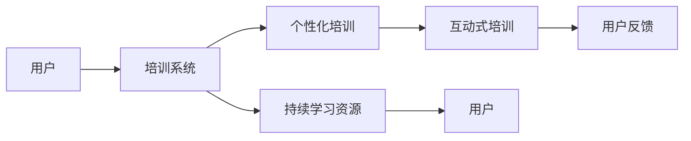

                 

## 1. 背景介绍

在当下快速变化的技术环境中，自动化技术的应用已经渗透到了各行各业。从制造业的智能制造到服务业的客户支持，从金融业的交易分析到医疗业的病患诊断，自动化创业逐渐成为一种新的商业形态。然而，自动化技术的广泛应用也带来了新的挑战——如何让用户理解、接受并有效使用这些技术？用户教育与培训成为了自动化创业中不可或缺的一环。

### 1.1 问题由来
随着自动化技术的发展，越来越多的产品和服务开始集成高级自动化功能，例如机器学习、人工智能、机器人流程自动化等。这些技术通常具有复杂的操作界面和独特的用户体验。对于很多用户而言，尤其是非技术人员，直接上手这些系统可能会遇到以下挑战：

- **操作复杂性**：用户需要了解如何操作新系统，这可能包括不同的用户界面、控制面板和命令。
- **技术壁垒**：自动化系统通常涉及复杂的算法和数据处理逻辑，用户需要理解这些技术背后的基本原理。
- **错误与故障**：用户可能对系统的响应和结果产生误解，或者在操作过程中遇到技术故障。

因此，自动化创业不仅需要创新性的技术，也需要高效的用户教育和培训，以确保用户能够充分利用这些先进技术，提高工作效率并从中获得价值。

### 1.2 问题核心关键点
自动化创业中的用户教育与培训核心关键点包括以下几个方面：

- **用户界面设计**：简单直观的界面设计能够降低用户的学习成本。
- **互动式培训**：通过互动式培训，用户可以更快地掌握操作技巧和系统功能。
- **个性化培训内容**：根据不同用户的需求和技能水平，提供定制化的培训内容。
- **持续学习与支持**：提供持续的学习资源和支持服务，帮助用户随时解决问题。

## 2. 核心概念与联系

### 2.1 核心概念概述

在进行自动化创业中的用户教育与培训时，以下几个关键概念非常重要：

- **用户界面(UI)**：自动化系统的操作界面，是用户与系统交互的主要媒介。良好的UI设计能够降低用户的学习曲线。
- **互动式培训**：通过模拟用户操作，让用户在实际操作中学习和掌握系统功能。
- **个性化培训**：根据不同用户的需求和技能水平，定制个性化的培训内容，提高学习效率。
- **持续学习与支持**：提供持续的学习资源和支持服务，帮助用户随时解决问题。

### 2.2 核心概念原理和架构的 Mermaid 流程图



这个流程图展示了用户教育与培训的基本流程。用户通过培训系统接受个性化和互动式培训，同时提供反馈以便系统不断优化培训内容。同时，用户也能通过持续学习资源获取更多支持。

## 3. 核心算法原理 & 具体操作步骤
### 3.1 算法原理概述

自动化创业中的用户教育与培训主要遵循以下原理：

- **个性化学习理论**：根据用户的学习风格和需求，定制个性化的学习路径和内容，以提高学习效率。
- **互动式学习理论**：通过模拟真实操作，让用户在互动中学习和掌握新技能。
- **反馈循环理论**：通过持续收集用户反馈，不断优化和更新培训内容。

### 3.2 算法步骤详解

以下是一个完整的用户教育与培训算法步骤：

1. **需求分析**：
   - 收集目标用户群体的需求信息，包括技能水平、学习风格和常见问题等。
   - 根据需求分析结果，设计个性化培训方案。

2. **内容设计**：
   - 设计互动式培训模块，模拟实际操作流程。
   - 开发支持个性化培训的算法，根据用户学习进度和反馈动态调整培训内容。

3. **交互学习**：
   - 用户进入培训系统，开始接受个性化和互动式培训。
   - 系统通过用户的操作和反馈，不断调整培训内容和难度。

4. **评估与反馈**：
   - 收集用户培训后的反馈和成绩，评估培训效果。
   - 根据反馈调整培训内容和策略，优化用户体验。

### 3.3 算法优缺点

#### 优点

- **提高学习效率**：个性化和互动式培训能够更有效地帮助用户掌握新技能。
- **降低用户压力**：通过互动式学习，用户能够在低压力的环境下学习，减少了技术焦虑。
- **用户满意度提升**：个性化的培训内容和服务能够提高用户对产品的满意度。

#### 缺点

- **开发成本高**：个性化和互动式培训需要较高的开发成本，包括内容设计、算法实现等。
- **更新维护复杂**：培训内容需要持续更新和优化，以适应不同用户群体的需求变化。

### 3.4 算法应用领域

自动化创业中的用户教育与培训应用领域广泛，例如：

- **智能制造**：为操作工人提供设备和系统的培训，提高生产效率和产品质量。
- **客户支持**：通过自动化客服系统，为客户提供常见问题的互动式培训。
- **金融交易**：为交易员提供自动化交易系统的培训，提高交易效率和准确性。
- **医疗诊断**：为医生和护士提供先进的医疗诊断工具的培训，提高诊断准确性和治疗效果。

## 4. 数学模型和公式 & 详细讲解 & 举例说明

### 4.1 数学模型构建

在自动化创业中，用户教育与培训可以构建以下数学模型：

- **用户需求模型**：描述用户技能水平、学习风格和常见问题的数学模型。
- **培训效果模型**：根据用户反馈，评估培训效果的数学模型。
- **学习进度模型**：根据用户操作和反馈，调整培训内容难度的数学模型。

### 4.2 公式推导过程

以学习进度模型为例，我们可以使用以下公式来描述用户学习进度：

$$
P_{t+1} = f(P_t, F_t, A_t)
$$

其中，$P_t$ 表示用户在时间$t$的学习进度，$F_t$ 表示用户在时间$t$的反馈信息，$A_t$ 表示用户在时间$t$的操作动作。

函数$f$表示学习进度的动态调整函数，可能包括时间衰减、反馈调整和操作动作影响等因子。

### 4.3 案例分析与讲解

假设一个自动化制造系统，通过互动式培训模块为工人提供培训。工人可以在模拟环境中练习操作，系统会实时记录工人的操作和反馈。根据工人的操作和反馈，系统会调整培训内容的难度和顺序。

## 5. 项目实践：代码实例和详细解释说明
### 5.1 开发环境搭建

以下是一个基于Python的自动化培训系统的开发环境搭建步骤：

1. **安装Python**：
   ```bash
   sudo apt-get update
   sudo apt-get install python3-pip
   ```

2. **安装依赖包**：
   ```bash
   pip install django numpy pandas scikit-learn Flask
   ```

3. **设置开发环境**：
   ```bash
   python manage.py runserver
   ```

### 5.2 源代码详细实现

```python
from django.views.decorators.csrf import csrf_exempt
from django.http import JsonResponse
import numpy as np

@csrf_exempt
def training(request):
    if request.method == 'POST':
        data = request.POST
        # 处理用户操作和反馈，更新学习进度
        progress = update_progress(data)
        return JsonResponse({'progress': progress})
    else:
        return JsonResponse({'error': 'Method not allowed'})

def update_progress(data):
    # 解析用户操作和反馈
    # 更新学习进度模型，并返回新的学习进度
    # ...
    return new_progress
```

### 5.3 代码解读与分析

以上代码实现了一个简单的培训系统，用户可以通过POST请求发送操作和反馈数据，系统根据这些数据更新用户的学习进度。

## 6. 实际应用场景

### 6.1 智能制造中的用户教育与培训

在智能制造中，自动化系统通常需要操作工人具备特定的技能。通过提供个性化的互动式培训，可以减少操作失误和设备故障。例如，通过模拟操作，工人可以学习如何操作自动化设备，系统根据工人的操作和反馈调整培训内容和难度。

### 6.2 客户支持中的用户教育与培训

自动化客服系统可以通过互动式培训模块，为客户提供常见问题的解答。客户可以在模拟器中尝试操作，系统根据客户的反馈，不断优化和更新培训内容，确保客户能正确使用系统。

### 6.3 金融交易中的用户教育与培训

在金融交易中，交易员需要熟悉自动化交易系统的操作。通过互动式培训，交易员可以在安全的环境下学习和练习，系统根据交易员的操作和反馈，调整培训内容和难度，提升交易效率和准确性。

### 6.4 未来应用展望

未来，随着自动化技术的发展，用户教育与培训将变得更加智能化和个性化。例如：

- **智能推荐**：根据用户的学习历史和行为，智能推荐个性化的培训内容。
- **自然语言交互**：通过自然语言处理技术，用户可以通过语音或文字与培训系统进行互动。
- **多模态学习**：结合视觉、听觉和触觉等多模态信息，提高用户学习体验。

## 7. 工具和资源推荐
### 7.1 学习资源推荐

以下是一些推荐的自动化创业中的用户教育与培训学习资源：

1. **Coursera**：提供大量在线课程，涵盖自动化技术、机器学习和用户体验设计等主题。
2. **edX**：提供丰富的在线学习资源，包括个性化学习和互动式培训等内容。
3. **Kaggle**：提供大量数据集和竞赛，让用户实践并提升数据分析和机器学习技能。
4. **Udacity**：提供项目导向的课程，包括自动化系统和用户体验设计的实战培训。

### 7.2 开发工具推荐

以下推荐的工具能够帮助开发者实现自动化创业中的用户教育与培训系统：

1. **Django**：一个流行的Python web框架，支持动态生成网站和应用程序。
2. **Flask**：一个轻量级的Python web框架，易于学习和使用。
3. **TensorFlow**：一个开源的机器学习框架，支持深度学习模型的构建和训练。
4. **PyTorch**：另一个流行的机器学习框架，支持动态计算图和高效的模型训练。

### 7.3 相关论文推荐

以下推荐的论文提供了关于自动化创业中的用户教育与培训的深入研究：

1. **"Designing Effective User Education Programs for Industry 4.0 Technologies"**：探讨了智能制造中用户教育与培训的设计和实施。
2. **"Personalized Learning through Interaction and Feedback"**：讨论了互动式学习在个性化培训中的应用。
3. **"The Impact of Machine Learning on User Education and Training"**：分析了机器学习在用户教育与培训中的潜力和挑战。

## 8. 总结：未来发展趋势与挑战

### 8.1 研究成果总结

自动化创业中的用户教育与培训已经取得了显著的进展，尤其在提升用户技能、提高操作效率和降低错误率等方面。个性化和互动式培训方法被广泛应用，并逐步成为自动化创业中的标准配置。

### 8.2 未来发展趋势

未来的用户教育与培训将进一步向智能化、个性化和多媒体方向发展：

- **智能化**：通过人工智能技术，提供更加智能化的培训内容和互动体验。
- **个性化**：根据用户的学习进度和需求，提供定制化的培训方案。
- **多媒体**：结合视觉、听觉和触觉等多模态信息，提高用户学习体验。

### 8.3 面临的挑战

尽管自动化创业中的用户教育与培训已经取得了一定的成就，但仍面临以下挑战：

- **成本高**：个性化和互动式培训需要较高的开发和维护成本。
- **用户接受度**：用户对新技术的接受度和适应能力不同，培训效果可能受到个体差异的影响。
- **数据隐私**：在收集和分析用户数据时，需要严格遵守数据隐私法规。

### 8.4 研究展望

未来的研究需要关注以下方向：

- **新技术融合**：将新兴技术（如增强现实、虚拟现实等）与培训系统结合，提升用户体验。
- **数据驱动优化**：通过大数据分析，优化培训内容和策略，提高培训效果。
- **社会责任**：在培训系统中引入社会责任，确保用户教育与培训的公平性和包容性。

## 9. 附录：常见问题与解答

### Q1：用户教育与培训的目的是什么？

**A**：用户教育与培训的目的是帮助用户理解、接受并有效使用自动化技术。通过培训，用户可以掌握操作技能、理解技术原理，从而提高工作效率和满意度。

### Q2：如何设计有效的个性化培训方案？

**A**：设计个性化培训方案需要考虑以下几点：
- **用户需求分析**：了解用户的基本技能水平和常见问题。
- **互动式学习设计**：设计模拟操作和反馈机制，让用户在学习过程中得到即时反馈。
- **动态调整内容**：根据用户的学习进度和反馈，动态调整培训内容的难度和顺序。

### Q3：自动化创业中的用户教育与培训需要哪些资源？

**A**：自动化创业中的用户教育与培训需要以下资源：
- **技术资源**：包括编程语言、框架和算法库等。
- **学习资源**：包括在线课程、书籍和文档等。
- **人力资源**：包括培训师、产品经理和开发人员等。

### Q4：自动化培训系统如何保证数据隐私？

**A**：自动化培训系统需要遵循数据隐私法规，采取以下措施保护用户数据：
- **匿名化处理**：对用户数据进行匿名化处理，避免泄露个人隐私。
- **权限控制**：严格控制数据访问权限，确保只有授权人员能够访问用户数据。
- **加密存储**：对用户数据进行加密存储，防止数据泄露和篡改。

**作者：禅与计算机程序设计艺术 / Zen and the Art of Computer Programming**

