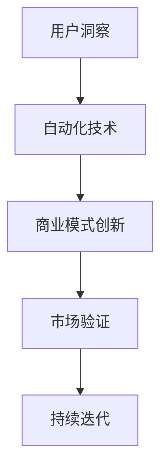

                 

# 自动化创业中的用户洞察与创新

## 1. 背景介绍

### 1.1 问题由来
在数字化转型的浪潮中，自动化创业成为越来越多企业寻求突破的重要方向。然而，如何在自动化领域中洞察用户需求、创新商业模式，构建有竞争力的产品，是每一个创业者和企业高管必须面对的挑战。通过对用户行为、市场趋势和创新技术的深刻理解，并快速将这些洞察转化为实际应用，是自动化创业成功的关键。本文将探讨自动化创业中的用户洞察与创新，帮助读者更好地应对这一挑战。

### 1.2 问题核心关键点
自动化创业的核心关键点在于以下几个方面：
- **用户洞察**：深入理解用户需求、行为和痛点，是创新和商业模式构建的基石。
- **技术应用**：选择合适的技术方案和工具，提高自动化系统的效率和效果。
- **市场验证**：通过小规模试点和用户反馈，验证和优化产品功能，确保市场接受度。
- **持续创新**：保持技术、产品和服务的更新迭代，满足用户不断变化的需求。

## 2. 核心概念与联系

### 2.1 核心概念概述

为了更好地理解自动化创业中的用户洞察与创新，本节将介绍几个密切相关的核心概念：

- **用户洞察**：通过数据收集、用户调研、行为分析等方法，深入理解用户需求、行为和痛点。
- **自动化技术**：利用AI、机器学习、机器人流程自动化(RPA)等技术，提高工作效率和流程自动化水平。
- **商业模式创新**：结合用户洞察和技术应用，创新产品和服务，开拓新的商业模式和收入渠道。
- **市场验证**：通过试点项目、MVP（最小可行产品）等手段，验证商业模式的市场反应，快速调整和优化产品功能。
- **持续迭代**：在市场验证的基础上，不断收集用户反馈，持续优化产品功能和用户体验，实现快速迭代和市场适应。

这些核心概念之间的逻辑关系可以通过以下Mermaid流程图来展示：



这个流程图展示了我文的核心概念及其之间的关系：

1. 通过用户洞察获取用户需求和痛点。
2. 选择合适的自动化技术，提高工作效率和流程自动化水平。
3. 基于用户洞察和技术应用，创新商业模式。
4. 通过市场验证，验证和优化产品功能，确保市场接受度。
5. 根据市场验证结果，不断收集用户反馈，持续迭代和优化产品。

## 3. 核心算法原理 & 具体操作步骤
### 3.1 算法原理概述

自动化创业中的用户洞察与创新，本质上是利用数据分析和人工智能技术，结合用户行为和市场趋势，进行产品设计和商业模式的创新。其核心算法原理包括：

- **用户行为分析**：通过分析用户行为数据，识别用户需求、行为模式和痛点。
- **机器学习模型**：利用机器学习模型，从大规模数据中提取有价值的洞察，预测用户行为和市场趋势。
- **自动化流程优化**：通过自动化技术，提高流程效率和准确性，减少人为错误和重复劳动。
- **持续迭代与优化**：通过不断的用户反馈和市场验证，持续优化产品功能和用户体验。

### 3.2 算法步骤详解

自动化创业中的用户洞察与创新，通常包括以下几个关键步骤：

**Step 1: 数据收集与用户调研**
- 通过调查问卷、用户访谈、行为追踪等方式，收集用户数据和反馈。
- 利用数据挖掘和文本分析技术，分析用户需求和痛点。

**Step 2: 数据分析与洞察提取**
- 应用机器学习模型（如分类、聚类、回归等），对用户数据进行分析，提取有价值的洞察。
- 利用数据可视化工具，呈现用户行为模式和趋势。

**Step 3: 自动化技术应用**
- 选择合适的自动化工具和平台，如RPA、低代码开发平台等，构建自动化系统。
- 设计自动化流程，提高工作效率和流程自动化水平。

**Step 4: 商业模式创新**
- 结合用户洞察和技术应用，创新产品和服务，开拓新的商业模式和收入渠道。
- 设计MVP（最小可行产品），进行小规模试点。

**Step 5: 市场验证与持续迭代**
- 通过试点项目和用户反馈，验证商业模式的市场反应，快速调整和优化产品功能。
- 不断收集用户反馈，进行产品迭代和优化。

### 3.3 算法优缺点

自动化创业中的用户洞察与创新方法具有以下优点：
1. **效率提升**：自动化技术显著提高工作效率和流程自动化水平，减少人工错误和重复劳动。
2. **数据驱动**：通过数据分析和机器学习模型，提取用户需求和市场趋势，提供决策支持。
3. **创新加速**：快速收集用户反馈和市场验证结果，持续优化产品功能和商业模式。

同时，该方法也存在一定的局限性：
1. **数据质量依赖**：分析结果的准确性和可靠性，高度依赖于数据质量和数据处理技术。
2. **技术门槛较高**：需要具备一定的数据科学和编程技能，初期投入成本较高。
3. **用户隐私问题**：在数据收集和分析过程中，需要确保用户隐私和数据安全。

尽管存在这些局限性，但就目前而言，数据驱动的自动化创业方法仍是最主流范式。未来相关研究的重点在于如何进一步降低技术门槛，提升数据质量和隐私保护水平，同时兼顾用户隐私和数据安全。

### 3.4 算法应用领域

自动化创业中的用户洞察与创新方法，已经在诸多领域得到广泛应用，例如：

- **智能客服系统**：利用自动化技术和大数据分析，提升客户服务效率和质量。
- **金融科技**：通过自动化流程优化和机器学习模型，提高风险控制和投资决策的准确性。
- **零售电商**：通过自动化库存管理和推荐系统，优化供应链和用户体验。
- **智能制造**：通过自动化技术和大数据分析，提高生产效率和质量，降低成本。
- **医疗健康**：通过自动化病历分析和推荐系统，提高医疗服务的智能化水平，辅助医生诊疗。

除了上述这些经典应用外，自动化创业还将创新性地应用到更多场景中，如智慧城市、智能物流、个性化教育等，为各行各业带来新的突破。随着技术的不断发展，自动化创业的应用领域将进一步拓宽，为数字化转型提供新的动力。

## 4. 数学模型和公式 & 详细讲解 & 举例说明
### 4.1 数学模型构建

本节将使用数学语言对自动化创业中的用户洞察与创新过程进行更加严格的刻画。

记用户行为数据为 $D=\{(x_i,y_i)\}_{i=1}^N, x_i \in \mathbb{R}^d, y_i \in \{0,1\}$，其中 $x_i$ 表示用户行为特征，$y_i$ 表示是否发生某事件（如购买、流失等）。

定义用户行为分析的目标函数为：

$$
\min_{\theta} \sum_{i=1}^N L(y_i, \hat{y}_i)
$$

其中 $L$ 为损失函数，$\hat{y}_i$ 为模型预测结果。

在实际应用中，我们通常使用以下几种损失函数：
- 逻辑回归损失（Logistic Loss）：适用于二分类任务。
- 交叉熵损失（Cross-Entropy Loss）：适用于多分类任务。
- 均方误差损失（Mean Squared Error）：适用于回归任务。

### 4.2 公式推导过程

以逻辑回归损失为例，公式推导如下：

假设模型 $M_{\theta}(x)$ 为线性回归模型，输出为 $\hat{y}_i = \theta^T x_i$，其中 $\theta$ 为模型参数。则逻辑回归损失函数为：

$$
L(y_i, \hat{y}_i) = -(y_i \log \hat{y}_i + (1-y_i) \log (1-\hat{y}_i))
$$

最小化目标函数即为：

$$
\min_{\theta} \sum_{i=1}^N L(y_i, \hat{y}_i) = \min_{\theta} -\sum_{i=1}^N [y_i \log \hat{y}_i + (1-y_i) \log (1-\hat{y}_i)]
$$

根据链式法则，损失函数对参数 $\theta_k$ 的梯度为：

$$
\frac{\partial L(y_i, \hat{y}_i)}{\partial \theta_k} = \frac{\partial (-\sum_{i=1}^N [y_i \log \hat{y}_i + (1-y_i) \log (1-\hat{y}_i)])}{\partial \theta_k} = -\frac{1}{N} \sum_{i=1}^N \frac{\partial (-y_i \log \hat{y}_i - (1-y_i) \log (1-\hat{y}_i))}{\partial \hat{y}_i} \frac{\partial \hat{y}_i}{\partial \theta_k}
$$

其中：

$$
\frac{\partial \hat{y}_i}{\partial \theta_k} = x_{ik}
$$

$$
\frac{\partial (-y_i \log \hat{y}_i - (1-y_i) \log (1-\hat{y}_i))}{\partial \hat{y}_i} = \frac{-y_i}{\hat{y}_i} + \frac{1-y_i}{1-\hat{y}_i}
$$

代入公式，得：

$$
\frac{\partial L(y_i, \hat{y}_i)}{\partial \theta_k} = -\frac{1}{N} \sum_{i=1}^N (y_i - \hat{y}_i) x_{ik}
$$

在实际计算中，通常采用随机梯度下降（SGD）算法进行优化：

$$
\theta_k \leftarrow \theta_k - \eta \frac{\partial L(y_i, \hat{y}_i)}{\partial \theta_k}
$$

其中 $\eta$ 为学习率，通常设置为一个较小的值，如0.01。

### 4.3 案例分析与讲解

以智能客服系统为例，进行详细案例分析：

假设某智能客服系统收集了大量的用户通话记录，记录了用户的语音、文本以及处理时间等数据。为了提升客服系统的智能化水平，我们希望通过数据分析和机器学习模型，洞察用户需求和行为模式，优化客服流程和用户体验。

**Step 1: 数据收集与用户调研**
- 收集用户通话记录数据，包括用户的语音、文本以及客服处理时间。
- 通过用户调查问卷，获取用户对客服服务的主观评价和期望。

**Step 2: 数据分析与洞察提取**
- 利用文本分析工具，对用户的语音和文本数据进行自然语言处理（NLP），提取关键词和情感倾向。
- 应用机器学习模型（如分类、聚类、回归等），分析用户的通话记录，识别出常见问题和用户行为模式。

**Step 3: 自动化技术应用**
- 选择合适的自动化工具和平台，如RPA、低代码开发平台等，构建自动化系统。
- 设计自动化流程，如自动回音搜索、情感分析等，提高客服处理的效率和准确性。

**Step 4: 商业模式创新**
- 结合用户洞察和技术应用，创新产品和服务，如智能语音助手、情感分析机器人等。
- 设计MVP（最小可行产品），进行小规模试点，如在客服热线中引入智能语音助手。

**Step 5: 市场验证与持续迭代**
- 通过试点项目和用户反馈，验证智能语音助手的效果和市场接受度。
- 根据用户反馈和市场验证结果，不断优化和改进产品功能，如增加情感识别、语义理解等功能。

## 5. 项目实践：代码实例和详细解释说明
### 5.1 开发环境搭建

在进行用户洞察与创新项目实践前，我们需要准备好开发环境。以下是使用Python进行Pandas和Scikit-learn开发的简单环境配置流程：

1. 安装Anaconda：从官网下载并安装Anaconda，用于创建独立的Python环境。

2. 创建并激活虚拟环境：
```bash
conda create -n user_insight_env python=3.8 
conda activate user_insight_env
```

3. 安装Pandas：
```bash
pip install pandas
```

4. 安装Scikit-learn：
```bash
pip install scikit-learn
```

5. 安装各类工具包：
```bash
pip install numpy matplotlib jupyter notebook ipython
```

完成上述步骤后，即可在`user_insight_env`环境中开始项目实践。

### 5.2 源代码详细实现

这里我们以用户行为分析的逻辑回归模型为例，给出Pandas和Scikit-learn的代码实现。

首先，定义用户行为数据：

```python
import pandas as pd

# 创建样本数据
data = pd.DataFrame({
    'features': [0.1, 0.2, 0.3, 0.4],
    'target': [1, 0, 1, 0]
})

# 分割数据集
X = data['features']
y = data['target']
X_train, X_test, y_train, y_test = train_test_split(X, y, test_size=0.2, random_state=42)
```

然后，定义逻辑回归模型并进行训练：

```python
from sklearn.linear_model import LogisticRegression
from sklearn.metrics import accuracy_score

# 定义模型
model = LogisticRegression()

# 训练模型
model.fit(X_train, y_train)

# 评估模型
accuracy = accuracy_score(y_test, model.predict(X_test))
print(f"Accuracy: {accuracy:.2f}")
```

以上就是使用Pandas和Scikit-learn进行用户行为分析的逻辑回归模型的代码实现。可以看到，利用Python的科学计算库，我们能够快速搭建和训练逻辑回归模型，进行用户行为分析。

### 5.3 代码解读与分析

让我们再详细解读一下关键代码的实现细节：

**样本数据创建**：
- 利用Pandas库创建样本数据，其中`features`表示用户行为特征，`target`表示用户是否发生某事件。

**数据集分割**：
- 使用Scikit-learn库的`train_test_split`函数将数据集分为训练集和测试集。

**逻辑回归模型定义与训练**：
- 定义逻辑回归模型，并使用`fit`函数进行训练。

**模型评估**：
- 使用`accuracy_score`函数计算模型在测试集上的准确率。

可以看到，利用Python的科学计算库，我们可以轻松实现逻辑回归模型的训练和评估，提取用户需求和行为模式。

## 6. 实际应用场景
### 6.1 智能客服系统

基于用户洞察与创新方法的智能客服系统，可以广泛应用于各行各业。传统客服系统依赖人工客服，成本高、效率低，用户体验差。智能客服系统通过数据分析和机器学习模型，洞察用户需求和行为模式，构建自动化客服流程，提供24小时不间断的智能客服服务。

在技术实现上，可以收集用户通话记录，利用自然语言处理（NLP）技术和逻辑回归模型，提取用户情感和意图，设计自动化客服流程，如自动回音搜索、情感分析、智能答复等。智能客服系统能够快速响应用户需求，提供高效、准确的客服服务，大幅提升客户满意度。

### 6.2 金融科技

在金融科技领域，用户洞察与创新方法同样具有重要应用价值。通过分析用户行为数据和市场趋势，金融机构可以洞察用户需求和行为模式，优化金融产品和营销策略。例如，通过分析用户交易记录和行为数据，金融机构可以预测用户流失风险，优化客户留存策略；通过分析市场舆情数据，金融机构可以洞察投资趋势，调整投资组合。

在技术实现上，可以应用机器学习模型（如决策树、随机森林、深度学习等），对用户行为数据和市场数据进行分析，提取有价值的洞察，构建自动化金融系统。例如，通过自动化风险评估和投资推荐系统，金融机构可以提高风险控制和投资决策的准确性。

### 6.3 零售电商

在零售电商领域，用户洞察与创新方法可以应用于库存管理、用户推荐、营销策略等方面。通过分析用户行为数据和交易记录，电商平台可以洞察用户需求和行为模式，优化库存管理策略，提高运营效率。例如，通过分析用户购买历史和行为数据，电商平台可以预测用户购买意向，优化库存管理，避免商品积压或缺货；通过分析用户行为数据，电商平台可以设计个性化推荐算法，提高用户购买率和销售额。

在技术实现上，可以应用机器学习模型（如协同过滤、深度学习等），对用户行为数据和交易数据进行分析，提取有价值的洞察，构建自动化推荐系统。例如，通过自动化推荐系统，电商平台可以提供个性化的商品推荐，提升用户体验和购买率。

### 6.4 未来应用展望

随着用户洞察与创新方法的不断成熟，未来在自动化创业中，将有更多创新应用出现，为各行各业带来新的突破。

在智慧城市治理中，通过数据分析和机器学习模型，城市管理者可以洞察市民需求和行为模式，优化城市管理和公共服务。例如，通过分析市民出行数据和行为数据，城市管理者可以优化交通信号灯和公交线路，提升市民出行效率；通过分析市民投诉数据，城市管理者可以优化公共服务，提升市民满意度。

在医疗健康领域，用户洞察与创新方法可以应用于病历分析、医疗咨询、健康管理等方面。通过分析患者病历数据和行为数据，医疗机构可以洞察患者需求和行为模式，优化医疗服务流程。例如，通过分析患者病历数据，医疗机构可以提高诊断准确性和治疗效果；通过分析患者行为数据，医疗机构可以提供个性化的健康管理服务，提升患者健康水平。

除了上述这些经典应用外，用户洞察与创新方法还将创新性地应用到更多场景中，如智能制造、智能物流、个性化教育等，为各行各业带来新的突破。随着技术的不断发展，用户洞察与创新方法将在自动化创业中扮演越来越重要的角色，推动数字化转型的深入发展。

## 7. 工具和资源推荐
### 7.1 学习资源推荐

为了帮助开发者系统掌握用户洞察与创新的理论基础和实践技巧，这里推荐一些优质的学习资源：

1. 《机器学习实战》系列书籍：由机器学习专家撰写，涵盖了从基础到高级的机器学习算法和实践，适合初学者和进阶开发者。

2. Coursera《机器学习》课程：斯坦福大学开设的机器学习课程，由Andrew Ng教授主讲，深入浅出地讲解了机器学习算法和应用。

3. Kaggle竞赛平台：一个数据科学和机器学习的竞赛平台，提供丰富的数据集和挑战，适合实战练习和技能提升。

4. GitHub开源项目：开源社区中提供了大量的用户洞察与创新应用项目，可以学习他人的实践经验，启发自己的创新思路。

通过对这些资源的学习实践，相信你一定能够快速掌握用户洞察与创新的精髓，并用于解决实际的自动化问题。

### 7.2 开发工具推荐

高效的开发离不开优秀的工具支持。以下是几款用于用户洞察与创新开发的常用工具：

1. Python：作为数据分析和机器学习的编程语言，Python生态系统丰富，支持众多的科学计算库和机器学习库。

2. Jupyter Notebook：一个交互式的笔记本环境，适合快速迭代和展示代码。

3. TensorBoard：一个可视化工具，可以实时监测模型训练状态，并提供丰富的图表呈现方式，是调试模型的得力助手。

4. Weights & Biases：一个实验跟踪工具，可以记录和可视化模型训练过程中的各项指标，方便对比和调优。

5. H2O.ai：一个快速、易用的机器学习平台，支持自动化的数据处理、模型训练和部署，适合初学者和团队协作。

合理利用这些工具，可以显著提升用户洞察与创新的开发效率，加快创新迭代的步伐。

### 7.3 相关论文推荐

用户洞察与创新方法的研究源于学界的持续研究。以下是几篇奠基性的相关论文，推荐阅读：

1. "Deep Learning for Recommender Systems"：深度学习在推荐系统中的应用，介绍了深度学习模型在用户行为预测和推荐系统中的应用。

2. "Adaptive Computation of Fixed-Point Formulas"：论文介绍了固定点公式的计算方法，为高效实现用户行为分析模型提供了理论基础。

3. "Machine Learning: A Probabilistic Perspective"：机器学习的概率视角，介绍了机器学习算法的理论基础和实际应用。

4. "A New Method for Adaptive Online Learning"：在线学习方法的介绍，介绍了在线学习算法在用户洞察与创新中的实际应用。

这些论文代表了大数据和机器学习的研究前沿，阅读这些论文可以深入理解用户洞察与创新的理论基础和实践应用。

## 8. 总结：未来发展趋势与挑战
### 8.1 研究成果总结

本文对用户洞察与创新方法进行了全面系统的介绍。首先阐述了用户洞察与创新的研究背景和意义，明确了洞察与创新在自动化创业中的独特价值。其次，从原理到实践，详细讲解了用户洞察与创新的数学原理和关键步骤，给出了用户洞察与创新任务开发的完整代码实例。同时，本文还广泛探讨了用户洞察与创新方法在智能客服、金融科技、零售电商等多个行业领域的应用前景，展示了用户洞察与创新的巨大潜力。此外，本文精选了用户洞察与创新的各类学习资源，力求为读者提供全方位的技术指引。

通过本文的系统梳理，可以看到，用户洞察与创新方法正在成为自动化创业中的重要范式，极大地拓展了自动化系统的应用边界，催生了更多的落地场景。受益于大数据和机器学习技术的快速发展，用户洞察与创新方法将在自动化创业中扮演越来越重要的角色，推动人工智能技术在各行各业的规模化落地。

### 8.2 未来发展趋势

展望未来，用户洞察与创新方法将呈现以下几个发展趋势：

1. 数据驱动的用户洞察：随着数据量的增加和数据处理技术的进步，用户洞察的深度和广度将进一步提升，提供更加精准和全面的用户需求和行为模式。

2. 自动化流程优化：自动化流程将更加智能和高效，实现实时动态优化，提高自动化系统的效率和准确性。

3. 模型与数据融合：机器学习模型将更好地与外部数据源（如知识图谱、规则库等）融合，提供更加全面和准确的用户洞察。

4. 跨领域应用：用户洞察与创新方法将应用于更多领域，如医疗健康、智慧城市、智能制造等，为各行各业带来新的突破。

5. 智能决策支持：基于用户洞察的智能决策支持系统将更加普及，辅助企业和用户做出更加明智的决策。

以上趋势凸显了用户洞察与创新方法的广阔前景。这些方向的探索发展，必将进一步提升自动化系统的性能和应用范围，为数字化转型提供新的动力。

### 8.3 面临的挑战

尽管用户洞察与创新方法已经取得了瞩目成就，但在迈向更加智能化、普适化应用的过程中，它仍面临诸多挑战：

1. 数据质量和隐私保护：用户洞察的准确性和可靠性，高度依赖于数据质量和数据处理技术。同时，用户隐私和数据安全问题也需要得到充分保障。

2. 技术门槛较高：用户洞察与创新方法需要具备一定的数据科学和编程技能，初期投入成本较高。

3. 模型鲁棒性和泛化能力：用户洞察与创新方法需要在不同的数据集和应用场景中表现出良好的鲁棒性和泛化能力。

4. 用户反馈的获取和分析：用户反馈的获取和分析是用户洞察的重要组成部分，但不同用户的反馈可能存在较大差异，如何有效整合和分析这些反馈，仍是一大挑战。

尽管存在这些挑战，但用户洞察与创新方法正在快速发展和成熟，未来将有更多创新应用出现，为各行各业带来新的突破。

### 8.4 研究展望

面对用户洞察与创新方法所面临的挑战，未来的研究需要在以下几个方面寻求新的突破：

1. 降低技术门槛：开发更加易用的数据处理和分析工具，降低用户洞察与创新的技术门槛，让更多开发者能够快速上手实践。

2. 提高数据质量和隐私保护：开发更加高效的数据处理和隐私保护技术，提升数据质量和用户隐私保护水平。

3. 提升模型鲁棒性和泛化能力：开发更加鲁棒的机器学习模型，在跨领域应用中表现良好。

4. 优化用户反馈获取和分析：开发更加智能的用户反馈获取和分析工具，提升用户反馈的有效性和应用价值。

这些研究方向的探索，必将引领用户洞察与创新方法迈向更高的台阶，为构建安全、可靠、可解释、可控的智能系统铺平道路。面向未来，用户洞察与创新方法还需要与其他人工智能技术进行更深入的融合，如知识表示、因果推理、强化学习等，多路径协同发力，共同推动自然语言理解和智能交互系统的进步。只有勇于创新、敢于突破，才能不断拓展用户洞察与创新的边界，让智能技术更好地造福人类社会。

## 9. 附录：常见问题与解答

**Q1：用户洞察与创新方法适用于所有行业吗？**

A: 用户洞察与创新方法在大多数行业中都有广泛应用，特别是在那些以数据驱动和自动化为核心的行业，如金融科技、智能客服、电商零售等。但对于一些传统行业，如制造业、农业等，需要结合行业特性进行定制化应用。

**Q2：如何进行有效的用户洞察？**

A: 进行有效的用户洞察，需要以下步骤：
1. 收集全面的用户数据：包括行为数据、交易数据、反馈数据等。
2. 清洗和预处理数据：去除噪声和异常值，进行特征工程和数据处理。
3. 应用机器学习模型：选择适合的机器学习模型，对用户数据进行分析，提取洞察。
4. 验证和迭代：通过市场验证和用户反馈，不断优化和调整洞察。

**Q3：用户洞察与创新方法是否需要大量标注数据？**

A: 用户洞察与创新方法通常依赖于大规模数据，但并不一定需要大量标注数据。无监督学习和半监督学习等方法可以在标注数据较少的情况下，提取有价值的洞察。

**Q4：如何提高用户洞察与创新方法的鲁棒性？**

A: 提高用户洞察与创新方法的鲁棒性，可以从以下几个方面入手：
1. 多样化的数据源：从不同的数据源获取用户数据，提升数据多样性和代表性。
2. 多模型的融合：使用多种机器学习模型进行数据分析，提升模型的鲁棒性和泛化能力。
3. 实时动态优化：根据用户行为和市场趋势，实时动态优化模型，提高模型的适应性。

这些措施可以帮助用户洞察与创新方法更好地应对不同数据集和应用场景，提升模型的鲁棒性和泛化能力。

**Q5：用户洞察与创新方法需要哪些技术支撑？**

A: 用户洞察与创新方法需要以下技术支撑：
1. 数据收集和处理技术：如数据清洗、数据预处理、特征工程等。
2. 机器学习算法：如逻辑回归、随机森林、深度学习等。
3. 自动化工具和平台：如Python、Pandas、Scikit-learn、TensorBoard等。

合理利用这些技术，可以显著提升用户洞察与创新的开发效率和应用效果。

---

作者：禅与计算机程序设计艺术 / Zen and the Art of Computer Programming

