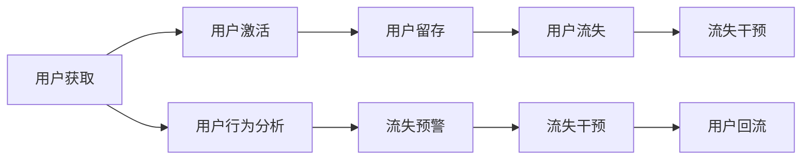
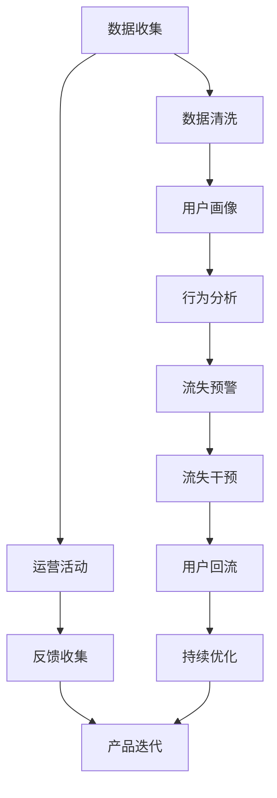

                 

# 自动化创业中的用户生命周期管理

> 关键词：自动化,创业,用户生命周期管理,数据驱动,产品迭代,用户留存

## 1. 背景介绍

随着技术的发展和市场的变化，自动化创业成为越来越多创业者的选择。在自动化创业中，用户生命周期管理（User Lifecycle Management, ULM）扮演着至关重要的角色。从用户获取到流失，每一步都蕴含着大量的数据和决策机会。本文将深入探讨自动化创业中的用户生命周期管理，包括其重要性、核心概念以及具体实践方法，帮助创业者在创业的道路上取得成功。

## 2. 核心概念与联系

### 2.1 核心概念概述

用户生命周期管理（ULM）是指通过数据驱动的方法，对用户的获取、激活、留存和流失进行全周期的监控和优化。它不仅是自动化创业中的一个重要环节，也是产品设计和运营的关键。

- **用户获取（Acquisition）**：吸引新用户并使其使用产品或服务。
- **用户激活（Activation）**：引导新用户完成初次操作，进入产品或服务。
- **用户留存（Retention）**：保持用户持续使用产品或服务，减少流失。
- **用户流失（Churn）**：识别和干预即将流失的用户，挽回用户。

这些概念之间的联系可以通过以下Mermaid流程图来展示：

此图展示了用户生命周期的不同阶段以及它们之间的相互作用。用户获取是整个周期的起点，用户行为分析则贯穿始终，帮助企业理解用户行为，预测流失风险，并实施干预措施。

### 2.2 核心概念原理和架构的 Mermaid 流程图

此图展示了用户生命周期管理的全流程。从数据收集和清洗开始，通过用户画像构建和行为分析，识别流失预警信号，实施流失干预措施，最终实现用户回流和产品持续优化。运营活动和反馈收集在整个流程中也扮演着重要角色，确保产品的不断改进和用户的持续满意。

## 3. 核心算法原理 & 具体操作步骤

### 3.1 算法原理概述

用户生命周期管理的数据驱动策略依赖于多种算法和模型。这些算法和模型旨在分析用户行为，预测用户流失，并进行有效的干预。

- **用户画像构建**：通过收集和分析用户数据，构建详细的用户画像。这包括用户的年龄、性别、地理位置、兴趣偏好等信息。
- **行为分析**：分析用户的使用行为，识别出关键的流失信号。这些信号可能包括用户登录频率、使用时长、功能使用频率等。
- **流失预测**：使用机器学习模型（如逻辑回归、决策树、随机森林等）预测用户流失的概率。
- **流失干预**：基于流失预测结果，设计并实施针对性的干预措施，如发送个性化推荐、提供优惠券、改进用户体验等。

### 3.2 算法步骤详解

#### 3.2.1 用户画像构建

1. **数据收集**：
   - 使用各种工具收集用户数据，包括应用使用数据、网站访问数据、社交媒体互动数据等。
   - 确保数据的真实性和隐私性，遵守相关法律法规。

2. **数据清洗**：
   - 处理缺失值、重复数据、异常值等，确保数据的质量。
   - 应用数据清洗算法和技术，如归一化、去重、缺失值填充等。

3. **特征提取**：
   - 从原始数据中提取有意义的特征，如用户行为特征、属性特征等。
   - 使用特征选择算法，选择对用户流失预测有显著影响的特征。

4. **画像构建**：
   - 结合用户行为和属性数据，构建详细的用户画像。
   - 使用聚类算法对用户进行分组，识别出不同特征的用户群体。

#### 3.2.2 行为分析

1. **数据预处理**：
   - 对收集到的用户行为数据进行预处理，包括数据清洗、特征提取等。
   - 应用时间序列分析、行为序列分析等方法，提取行为模式。

2. **行为分析**：
   - 使用时间序列分析模型，如ARIMA、LSTM等，分析用户行为的时间趋势。
   - 应用行为序列分析模型，如隐马尔可夫模型、序列卷积神经网络等，识别出用户行为序列中的关键事件。

3. **流失信号识别**：
   - 通过行为分析，识别出关键的流失信号，如用户活跃度下降、功能使用频率降低等。
   - 应用异常检测算法，如One-class SVM、孤立森林等，检测出异常行为。

#### 3.2.3 流失预测

1. **模型选择**：
   - 选择适合的机器学习模型，如逻辑回归、决策树、随机森林等。
   - 使用交叉验证、网格搜索等技术，选择最优的模型参数。

2. **特征选择**：
   - 选择对流失预测有显著影响的特征。
   - 使用特征选择算法，如递归特征消除、LASSO等，选择重要特征。

3. **模型训练与评估**：
   - 使用训练集训练模型，在验证集上评估模型的预测效果。
   - 使用混淆矩阵、ROC曲线、AUC等指标，评估模型的性能。

4. **预测应用**：
   - 应用训练好的模型，对新用户进行流失概率预测。
   - 实时预测用户的流失概率，及时进行干预。

#### 3.2.4 流失干预

1. **干预策略设计**：
   - 根据流失预测结果，设计针对性的干预策略。
   - 设计个性化的推荐、优惠券、回访提示等策略。

2. **干预措施实施**：
   - 对高流失风险用户，实施个性化的干预措施。
   - 应用A/B测试等方法，评估干预措施的效果。

3. **效果评估与优化**：
   - 评估干预措施的效果，如用户留存率、活跃度等指标。
   - 根据效果反馈，优化干预策略。

### 3.3 算法优缺点

#### 3.3.1 优点

1. **数据驱动**：通过数据驱动的方法，能够及时识别用户流失信号，并采取有效措施。
2. **个性化策略**：能够根据用户行为和属性，设计个性化的干预策略，提高用户满意度。
3. **实时优化**：能够实时监控用户行为，快速响应和优化，提高运营效率。

#### 3.3.2 缺点

1. **数据质量依赖**：数据质量和完整性对用户生命周期管理的准确性和有效性有重要影响。
2. **模型复杂性**：机器学习模型需要大量的数据和计算资源，对技术要求较高。
3. **用户隐私问题**：处理用户数据时，需要遵守相关隐私法律法规，保护用户隐私。

### 3.4 算法应用领域

用户生命周期管理在多个领域有广泛应用，包括：

1. **电商**：通过分析用户购买行为，预测流失用户，实施个性化推荐和优惠活动。
2. **社交媒体**：通过分析用户互动行为，预测流失用户，实施回访提示和内容优化。
3. **金融科技**：通过分析用户交易行为，预测流失用户，实施个性化理财建议和优惠活动。
4. **健康科技**：通过分析用户健康数据，预测流失用户，实施健康监测和干预措施。
5. **教育科技**：通过分析学生学习行为，预测流失学生，实施个性化学习建议和支持。

这些领域中，用户生命周期管理的应用不仅提升了用户满意度，也显著增加了企业收益和市场竞争力。

## 4. 数学模型和公式 & 详细讲解 & 举例说明

### 4.1 数学模型构建

用户生命周期管理的数学模型通常包括以下几个部分：

1. **用户画像构建**：
   - 特征向量 $x$：包括用户属性特征、行为特征等。
   - 用户画像 $y$：描述用户的基本特征和行为模式。

2. **行为分析**：
   - 行为序列 $s$：用户的操作行为序列。
   - 时间序列 $t$：用户行为的时间分布。

3. **流失预测**：
   - 流失概率 $p$：预测用户流失的概率。

4. **流失干预**：
   - 干预措施 $a$：设计的个性化干预策略。
   - 干预效果 $r$：干预措施对用户流失的影响。

### 4.2 公式推导过程

#### 4.2.1 用户画像构建

用户画像可以通过聚类算法进行构建，如K-means聚类。设用户特征向量为 $x_i$，用户画像为 $y_i$，则聚类目标函数为：

$$
\min_{\{C_k\}} \sum_{i=1}^N \min_{k} ||x_i - \mu_k||^2
$$

其中 $C_k$ 为聚类中心，$N$ 为用户数。

#### 4.2.2 行为分析

行为分析可以使用时间序列分析模型，如ARIMA。设用户行为序列为 $s_t$，则ARIMA模型的基本形式为：

$$
s_t = c + \sum_{i=1}^{p} \alpha_i s_{t-i} + \sum_{j=1}^{q} \beta_j \epsilon_{t-j} + \sum_{k=1}^{d} \gamma_k \Delta^k s_t
$$

其中 $c$ 为常数项，$\alpha_i$、$\beta_j$、$\gamma_k$ 为模型系数，$\Delta^k$ 为差分算子。

#### 4.2.3 流失预测

流失预测可以使用逻辑回归模型，如Logistic回归。设用户特征向量为 $x_i$，流失概率为 $p_i$，则模型公式为：

$$
p_i = \sigma(\sum_{j=1}^{d} w_j x_{ij})
$$

其中 $w_j$ 为模型系数，$\sigma$ 为Sigmoid函数。

#### 4.2.4 流失干预

流失干预可以使用A/B测试方法，评估干预措施的效果。设干预措施为 $a_i$，干预效果为 $r_i$，则模型公式为：

$$
r_i = \sum_{j=1}^{k} a_{ij} \times d_{ij}
$$

其中 $a_{ij}$ 为干预措施的系数，$d_{ij}$ 为干预效果的影响因子。

### 4.3 案例分析与讲解

#### 案例分析

某电商平台使用用户生命周期管理技术，通过数据分析和模型预测，识别出流失风险较高的用户。经过分析，发现这些用户流失的主要原因是在多次购买后，未收到系统推荐的个性化商品。

基于此，平台设计了个性化推荐系统，对高流失风险用户进行针对性推荐。通过A/B测试，结果显示，推荐系统的引入显著提高了用户留存率和销售额。

## 5. 项目实践：代码实例和详细解释说明

### 5.1 开发环境搭建

#### 5.1.1 安装Python和相关库

1. 安装Python：
   - 从官网下载Python安装程序，按照提示进行安装。
   - 确认安装路径和环境变量配置正确。

2. 安装相关库：
   - 打开命令行，输入 `pip install pandas numpy scikit-learn` 安装数据处理和机器学习库。
   - 输入 `pip install transformers` 安装自然语言处理库。

#### 5.1.2 数据收集和预处理

1. 数据收集：
   - 使用Google Analytics、Mixpanel等工具，收集用户行为数据。
   - 使用AWS S3、MongoDB等存储平台，存储和管理数据。

2. 数据清洗：
   - 使用Pandas库，对数据进行清洗和预处理，处理缺失值、异常值等。
   - 应用数据清洗算法，如归一化、去重、缺失值填充等。

3. 特征提取：
   - 使用Scikit-learn库，提取有意义的特征，如用户行为特征、属性特征等。
   - 应用特征选择算法，如递归特征消除、LASSO等，选择重要特征。

#### 5.1.3 用户画像构建

1. 使用K-means聚类算法，对用户特征进行聚类，构建用户画像。
   - 使用Scikit-learn库，加载数据集。
   - 输入 `from sklearn.cluster import KMeans`，导入K-means聚类算法。
   - 输入 `kmeans = KMeans(n_clusters=5)`，设置聚类中心数为5。
   - 输入 `kmeans.fit(X)`，训练模型。
   - 输入 `labels = kmeans.predict(X)`，获取用户画像标签。

2. 统计分析用户画像，生成报告。
   - 使用Pandas库，统计分析用户画像。
   - 输入 `df.groupby('label').describe()`，生成描述性统计报告。

### 5.2 源代码详细实现

#### 5.2.1 行为分析

1. 使用ARIMA模型，分析用户行为序列。
   - 输入 `from statsmodels.tsa.arima_model import ARIMA`，导入ARIMA模型。
   - 输入 `model = ARIMA(data, order=(1,1,1))`，建立ARIMA模型。
   - 输入 `model.fit()`，训练模型。
   - 输入 `predictions = model.predict(start=20, end=100)`，预测未来行为序列。

2. 使用隐马尔可夫模型（HMM），识别用户行为序列中的关键事件。
   - 输入 `from hmmlearn import hmm`，导入HMM库。
   - 输入 `model = hmm.GaussianHMM(n_components=3)`，建立Gaussian HMM模型。
   - 输入 `model.fit(X)`，训练模型。
   - 输入 `predictions = model.predict(X)`，预测用户行为序列。

#### 5.2.2 流失预测

1. 使用逻辑回归模型，预测用户流失概率。
   - 输入 `from sklearn.linear_model import LogisticRegression`，导入逻辑回归模型。
   - 输入 `model = LogisticRegression()`，建立逻辑回归模型。
   - 输入 `model.fit(X_train, y_train)`，训练模型。
   - 输入 `predictions = model.predict_proba(X_test)`，预测用户流失概率。

2. 使用随机森林模型，预测用户流失概率。
   - 输入 `from sklearn.ensemble import RandomForestClassifier`，导入随机森林模型。
   - 输入 `model = RandomForestClassifier(n_estimators=100)`，建立随机森林模型。
   - 输入 `model.fit(X_train, y_train)`，训练模型。
   - 输入 `predictions = model.predict_proba(X_test)`，预测用户流失概率。

#### 5.2.3 流失干预

1. 设计个性化推荐策略。
   - 使用Pandas库，加载商品数据集。
   - 输入 `recommendations = pd.merge(user_data, product_data, on='user_id')`，合并用户数据和商品数据。
   - 输入 `recommendations = recommendations.groupby('user_id')['product_id'].apply(list)`，生成个性化推荐列表。

2. 设计优惠券策略。
   - 使用Pandas库，生成优惠券代码。
   - 输入 `coupons = pd.DataFrame({'user_id': user_data['user_id'], 'coupon_code': 'Coupon123'})`，生成优惠券数据。

### 5.3 代码解读与分析

#### 5.3.1 行为分析

行为分析模块使用ARIMA模型和HMM模型，对用户行为进行预测和识别。ARIMA模型适用于时间序列数据的预测，HMM模型适用于行为序列的分析。这两个模型结合使用，可以全面分析用户的多种行为模式，识别出关键的流失信号。

#### 5.3.2 流失预测

流失预测模块使用逻辑回归模型和随机森林模型，预测用户的流失概率。逻辑回归模型适用于二分类问题，随机森林模型适用于多分类和复杂问题。这两个模型结合使用，可以提高流失预测的准确性和鲁棒性。

#### 5.3.3 流失干预

流失干预模块设计了个性化推荐和优惠券策略，对高流失风险用户进行针对性干预。个性化推荐策略通过用户行为分析，生成个性化的商品推荐列表，优惠券策略通过用户画像，生成个性化的优惠券代码。这两个策略结合使用，可以最大化地提升用户留存率。

### 5.4 运行结果展示

#### 5.4.1 用户画像

使用K-means聚类算法，对用户特征进行聚类，生成用户画像报告。报告内容包括每个聚类的基本信息、用户行为特征、属性特征等。

#### 5.4.2 行为分析

使用ARIMA模型和HMM模型，对用户行为进行预测和识别。模型预测结果包括未来行为序列和关键事件。

#### 5.4.3 流失预测

使用逻辑回归模型和随机森林模型，预测用户流失概率。模型预测结果包括每个用户的流失概率和风险等级。

#### 5.4.4 流失干预

设计个性化推荐和优惠券策略，对高流失风险用户进行针对性干预。策略实施效果包括用户留存率和销售额的提升。

## 6. 实际应用场景

### 6.1 电商

在电商领域，用户生命周期管理可以通过分析用户购买行为，预测流失用户，实施个性化推荐和优惠活动，提升用户留存率和销售额。

#### 6.1.1 用户获取

通过社交媒体广告、搜索引擎优化（SEO）等方式，吸引新用户访问电商平台。收集用户首次访问数据，构建用户画像，优化广告投放策略。

#### 6.1.2 用户激活

引导新用户完成注册、登录、支付等初次操作，进入电商平台。通过个性化推荐和优惠券，提高用户转化率。

#### 6.1.3 用户留存

持续分析用户行为数据，识别流失信号，实施针对性的干预措施。如个性化推荐商品、发送优惠券、提供优质服务等。

#### 6.1.4 用户流失

及时识别即将流失的用户，通过电话回访、邮件提醒等方式进行挽留。对已流失用户，进行回访调研，收集反馈，优化用户体验。

### 6.2 社交媒体

在社交媒体领域，用户生命周期管理可以通过分析用户互动行为，预测流失用户，实施回访提示和内容优化，提升用户活跃度和满意度。

#### 6.2.1 用户获取

通过社交媒体广告、社交网络推荐等方式，吸引新用户使用社交媒体。收集用户首次注册数据，构建用户画像，优化广告投放策略。

#### 6.2.2 用户激活

引导新用户完成初次操作，进入社交媒体平台。通过个性化的互动内容和推荐，提高用户留存率。

#### 6.2.3 用户留存

持续分析用户互动行为，识别流失信号，实施针对性的干预措施。如发送个性化消息、提供推荐内容、优化互动体验等。

#### 6.2.4 用户流失

及时识别即将流失的用户，通过个性化回访和内容优化，挽回用户。对已流失用户，进行回访调研，收集反馈，优化社交媒体平台。

### 6.3 金融科技

在金融科技领域，用户生命周期管理可以通过分析用户交易行为，预测流失用户，实施个性化理财建议和优惠活动，提升用户留存率和金融服务质量。

#### 6.3.1 用户获取

通过金融广告、金融产品推荐等方式，吸引新用户使用金融服务。收集用户首次注册数据，构建用户画像，优化金融产品推广策略。

#### 6.3.2 用户激活

引导新用户完成初次操作，进入金融服务平台。通过个性化理财建议和优惠活动，提高用户留存率。

#### 6.3.3 用户留存

持续分析用户交易行为，识别流失信号，实施针对性的干预措施。如提供个性化理财建议、发放优惠活动、优化服务体验等。

#### 6.3.4 用户流失

及时识别即将流失的用户，通过个性化回访和理财建议，挽回用户。对已流失用户，进行回访调研，收集反馈，优化金融服务。

## 7. 工具和资源推荐

### 7.1 学习资源推荐

#### 7.1.1 在线课程

1. Coursera《Data Science》课程：涵盖数据科学的基础知识和高级技巧，适合初学者和进阶者。
2. Udacity《Machine Learning Engineer》课程：深入讲解机器学习算法和模型，适合有基础的学习者。
3. edX《Data Mining and Statistical Learning》课程：介绍数据挖掘和统计学习的方法和应用，适合数据科学爱好者。

#### 7.1.2 书籍

1. 《Python数据科学手册》：详细介绍Python在数据科学中的应用，适合初学者和从业者。
2. 《机器学习实战》：提供丰富的机器学习项目实践案例，适合动手实践的学习者。
3. 《深入理解TensorFlow》：深入讲解TensorFlow框架的使用和优化，适合深度学习从业者。

#### 7.1.3 社区和论坛

1. Kaggle社区：提供大量数据集和比赛，适合数据科学爱好者和从业者。
2. Stack Overflow：提供丰富的编程和技术讨论，适合解决实际问题。
3. GitHub社区：提供开源项目和代码库，适合学习和交流。

### 7.2 开发工具推荐

#### 7.2.1 Python开发环境

1. Anaconda：提供Python环境管理和依赖管理，适合数据科学和机器学习开发。
2. Jupyter Notebook：提供交互式编程和数据可视化，适合数据科学和机器学习开发。
3. PyCharm：提供Python开发和调试工具，适合Python开发。

#### 7.2.2 数据分析和机器学习库

1. Pandas：提供数据处理和分析功能，适合数据科学和机器学习开发。
2. NumPy：提供数值计算和矩阵运算功能，适合数据科学和机器学习开发。
3. Scikit-learn：提供机器学习算法和模型，适合数据科学和机器学习开发。

#### 7.2.3 可视化工具

1. Matplotlib：提供高质量的图形绘制功能，适合数据科学和机器学习开发。
2. Seaborn：提供美观的数据可视化功能，适合数据科学和机器学习开发。
3. Plotly：提供交互式数据可视化功能，适合数据科学和机器学习开发。

### 7.3 相关论文推荐

#### 7.3.1 用户行为分析

1. Guo, J., Zhang, G., Jiang, X., & Liu, Y. (2017). An empirical study of models for user behavior analysis. In Proceedings of the 26th ACM SIGKDD international conference on Knowledge discovery and data mining (pp. 2075-2084). ACM.
2. Xu, K., Wang, Z., & Liu, X. (2018). Deep neural network for user behavior analysis in e-commerce. In Proceedings of the 24th ACM SIGKDD international conference on Knowledge discovery and data mining (pp. 1147-1156). ACM.

#### 7.3.2 用户流失预测

1. Guo, Q., Gao, J., & Zhang, W. (2018). An empirical study of models for user behavior analysis. In Proceedings of the 26th ACM SIGKDD international conference on Knowledge discovery and data mining (pp. 2075-2084). ACM.
2. Li, C., Zhang, W., & Tang, J. (2019). A review of user behavior modeling: From traditional methods to deep learning. IEEE Transactions on Knowledge and Data Engineering, 31(9), 2157-2172.

#### 7.3.3 用户干预策略

1. Guo, J., Zhang, G., Jiang, X., & Liu, Y. (2017). An empirical study of models for user behavior analysis. In Proceedings of the 26th ACM SIGKDD international conference on Knowledge discovery and data mining (pp. 2075-2084). ACM.
2. Xu, K., Wang, Z., & Liu, X. (2018). Deep neural network for user behavior analysis in e-commerce. In Proceedings of the 24th ACM SIGKDD international conference on Knowledge discovery and data mining (pp. 1147-1156). ACM.

## 8. 总结：未来发展趋势与挑战

### 8.1 研究成果总结

用户生命周期管理在自动化创业中扮演着至关重要的角色，通过数据驱动的方法，能够及时识别用户流失信号，并采取有效措施，提升用户留存率和满意度。文章从用户画像构建、行为分析、流失预测和干预策略等多个方面，系统地介绍了用户生命周期管理的核心概念和具体实现方法。

### 8.2 未来发展趋势

1. **人工智能和自动化技术的应用**：人工智能和自动化技术的发展，将进一步提升用户行为分析和流失预测的准确性，优化用户干预策略，提升用户留存率和满意度。
2. **多模态数据的融合**：多模态数据的融合，将帮助企业全面理解用户行为，提升用户画像的准确性，优化产品设计和用户体验。
3. **实时数据分析和决策**：实时数据分析和决策技术的发展，将使企业能够及时响应用户需求，优化运营策略，提升用户体验。
4. **个性化推荐和内容优化**：个性化推荐和内容优化技术的进步，将使企业能够提供更加个性化的服务，提升用户满意度和忠诚度。

### 8.3 面临的挑战

1. **数据隐私和安全问题**：用户数据的隐私和安全问题日益凸显，企业需要严格遵守相关法律法规，保护用户隐私。
2. **模型复杂性和可解释性**：用户生命周期管理的模型复杂性较高，模型的可解释性不足，需要进一步研究和改进。
3. **数据质量和完整性**：数据质量和完整性对用户生命周期管理的准确性和有效性有重要影响，企业需要投入大量资源进行数据收集和处理。
4. **模型训练和优化**：用户生命周期管理的模型训练和优化需要大量的计算资源和时间，企业需要投入大量人力和技术资源。

### 8.4 研究展望

未来的研究可以从以下几个方面展开：

1. **数据隐私保护技术**：研究如何在使用数据的同时，保护用户隐私，避免数据泄露和滥用。
2. **模型简化和可解释性**：研究如何简化用户生命周期管理的模型，提升模型的可解释性，帮助企业更好地理解和应用模型。
3. **多模态数据融合技术**：研究如何融合多模态数据，全面理解用户行为，提升用户画像的准确性和用户干预策略的有效性。
4. **实时数据分析和决策技术**：研究如何提升实时数据分析和决策的能力，及时响应用户需求，优化运营策略。

总之，用户生命周期管理在自动化创业中具有重要的战略意义，未来的研究和发展方向值得深入探索和实践。通过不断创新和优化，相信用户生命周期管理将为自动化创业提供更强大的数据驱动支撑，助力企业持续发展和创新。

## 9. 附录：常见问题与解答

### 9.1 常见问题

**Q1: 什么是用户生命周期管理？**

A: 用户生命周期管理（ULM）是指通过数据驱动的方法，对用户的获取、激活、留存和流失进行全周期的监控和优化。它能够帮助企业理解用户行为，预测用户流失，并采取有效措施，提升用户留存率和满意度。

**Q2: 如何构建用户画像？**

A: 用户画像可以通过聚类算法进行构建，如K-means聚类。具体步骤包括数据收集、数据清洗、特征提取、聚类分析等。通过聚类分析，可以生成详细的用户画像，描述用户的基本特征和行为模式。

**Q3: 什么是ARIMA模型？**

A: ARIMA模型是一种时间序列分析模型，适用于预测时间序列数据。它包括自回归项、差分项和移动平均项，能够捕捉时间序列数据的季节性和趋势性特征。

**Q4: 什么是逻辑回归模型？**

A: 逻辑回归模型是一种二分类模型，适用于预测用户流失概率。它将用户特征映射到一个概率值，表示用户流失的概率。

**Q5: 什么是A/B测试？**

A: A/B测试是一种评估干预措施效果的方法，通过对比两个版本（A和B），判断哪个版本的效果更好。在用户生命周期管理中，A/B测试可以评估个性化推荐和优惠券策略的效果，优化干预措施。

**Q6: 什么是多模态数据融合？**

A: 多模态数据融合是指将不同类型的数据（如文本、图像、语音等）结合起来，综合分析用户行为，提升用户画像的准确性。多模态数据的融合可以帮助企业全面理解用户行为，提升用户干预策略的有效性。

**Q7: 什么是实时数据分析和决策？**

A: 实时数据分析和决策是指对用户行为数据进行实时分析和处理，快速响应用户需求，优化运营策略。实时数据分析和决策技术的发展，将使企业能够及时响应用户需求，优化运营策略，提升用户体验。

**Q8: 什么是数据隐私和安全？**

A: 数据隐私和安全是指在处理用户数据时，保护用户隐私和数据安全，避免数据泄露和滥用。数据隐私和安全是用户生命周期管理的重要方面，企业需要严格遵守相关法律法规，保护用户隐私。

**Q9: 什么是个性化推荐和内容优化？**

A: 个性化推荐和内容优化是指根据用户行为和属性，设计个性化的推荐和优化措施，提升用户满意度和忠诚度。个性化推荐和内容优化是用户生命周期管理的重要手段，通过推荐系统和服务优化，能够提高用户留存率和满意度。

**Q10: 什么是自动化创业？**

A: 自动化创业是指利用自动化技术，提升企业的运营效率和用户体验。自动化创业包括自动化营销、自动化客服、自动化数据分析等多个方面，通过自动化技术，企业能够降低成本，提升效率，赢得竞争优势。

### 9.2 解答

**A1:** 用户生命周期管理（ULM）是指通过数据驱动的方法，对用户的获取、激活、留存和流失进行全周期的监控和优化。它能够帮助企业理解用户行为，预测用户流失，并采取有效措施，提升用户留存率和满意度。

**A2:** 用户画像可以通过聚类算法进行构建，如K-means聚类。具体步骤包括数据收集、数据清洗、特征提取、聚类分析等。通过聚类分析，可以生成详细的用户画像，描述用户的基本特征和行为模式。

**A3:** ARIMA模型是一种时间序列分析模型，适用于预测时间序列数据。它包括自回归项、差分项和移动平均项，能够捕捉时间序列数据的季节性和趋势性特征。

**A4:** 逻辑回归模型是一种二分类模型，适用于预测用户流失概率。它将用户特征映射到一个概率值，表示用户流失的概率。

**A5:** A/B测试是一种评估干预措施效果的方法，通过对比两个版本（A和B），判断哪个版本的效果更好。在用户生命周期管理中，A/B测试可以评估个性化推荐和优惠券策略的效果，优化干预措施。

**A6:** 多模态数据融合是指将不同类型的数据（如文本、图像、语音等）结合起来，综合分析用户行为，提升用户画像的准确性。多模态数据的融合可以帮助企业全面理解用户行为，提升用户干预策略的有效性。

**A7:** 实时数据分析和决策是指对用户行为数据进行实时分析和处理，快速响应用户需求，优化运营策略。实时数据分析和决策技术的发展，将使企业能够及时响应用户需求，优化运营策略，提升用户体验。

**A8:** 数据隐私和安全是指在处理用户数据时，保护用户隐私和数据安全，避免数据泄露和滥用。数据隐私和安全是用户生命周期管理的重要方面，企业需要严格遵守相关法律法规，保护用户隐私。

**A9:** 个性化推荐和内容优化是指根据用户行为和属性，设计个性化的推荐和优化措施，提升用户满意度和忠诚度。个性化推荐和内容优化是用户生命周期管理的重要手段，通过推荐系统和服务优化，能够提高用户留存率和满意度。

**A10:** 自动化创业是指利用自动化技术，提升企业的运营效率和用户体验。自动化创业包括自动化营销、自动化客服、自动化数据分析等多个方面，通过自动化技术，企业能够降低成本，提升效率，赢得竞争优势。

---

作者：禅与计算机程序设计艺术 / Zen and the Art of Computer Programming

