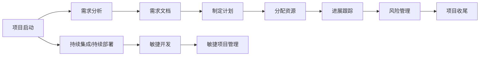

                 

# 自动化创业中的项目管理方法

## 1. 背景介绍

在当今快速发展的数字化时代，创业环境充满机遇与挑战。自动化技术正在成为推动企业成长和创新的关键动力。然而，项目管理（Project Management, PM）作为一项至关重要的管理工具，在自动化创业中扮演着不可或缺的角色。本文将深入探讨自动化创业中的项目管理方法，为读者提供系统全面的指导。

## 2. 核心概念与联系

### 2.1 核心概念概述

为了更好地理解自动化创业中的项目管理，我们首先需要明确以下几个关键概念：

- **项目管理（Project Management）**：涉及制定项目计划、资源分配、进度跟踪、风险管理等，确保项目按时、按预算、按质量完成。

- **自动化（Automation）**：利用计算机程序和技术，自动执行重复性或规则性任务，减少人工干预，提高效率和精度。

- **持续集成/持续部署（CI/CD）**：一种软件开发实践，通过自动化工具链，将代码变更持续集成到共享仓库，并自动部署到生产环境，加速软件交付周期。

- **敏捷开发（Agile Development）**：一种迭代、响应式、团队协作的软件开发方法，强调灵活性、反馈循环和快速迭代。

- **敏捷项目管理（Agile Project Management）**：将敏捷开发理念应用于项目管理中，实现快速、高效的项目交付。

### 2.2 核心概念原理和架构的 Mermaid 流程图



## 3. 核心算法原理 & 具体操作步骤

### 3.1 算法原理概述

自动化创业中的项目管理方法主要基于敏捷开发和CI/CD的原理，旨在提高项目的灵活性、响应速度和效率。

- **敏捷开发**：通过快速迭代和反馈循环，使项目团队能够快速响应市场变化和客户需求，持续改进产品和服务。

- **CI/CD**：自动化地集成、构建、测试和部署代码，实现快速交付和持续改进，降低出错率。

### 3.2 算法步骤详解

#### 3.2.1 项目启动

- **制定项目愿景**：明确项目目标、价值和预期成果。
- **组建项目团队**：根据项目需要，选择具有相应技能和经验的团队成员。
- **确定项目范围**：明确项目可交付成果和边界。

#### 3.2.2 需求分析

- **收集需求**：通过访谈、问卷、原型设计等方式收集客户和利益相关者的需求。
- **需求优先级排序**：根据需求的重要性和紧急性进行排序，优先处理高优先级需求。

#### 3.2.3 制定计划

- **创建项目计划**：根据需求分析结果，制定详细的项目计划，包括时间表、里程碑和资源分配。
- **风险评估**：识别项目可能面临的风险，制定应对措施。

#### 3.2.4 分配资源

- **确定资源需求**：根据项目计划，确定所需的人力、物力和财力资源。
- **资源分配**：将资源分配给各个任务和阶段，确保资源合理利用。

#### 3.2.5 进展跟踪

- **持续监控**：使用敏捷工具（如JIRA、Trello）持续监控项目进展，确保按时交付。
- **定期回顾**：定期回顾项目进展，识别问题并制定改进措施。

#### 3.2.6 风险管理

- **风险识别**：识别可能影响项目进展的风险因素。
- **风险缓解**：制定风险缓解计划，采取措施降低风险影响。
- **风险监控**：持续监控风险状态，及时调整应对措施。

#### 3.2.7 项目收尾

- **完成项目**：根据项目计划，完成所有任务和交付成果。
- **项目评估**：评估项目成果，总结经验教训。
- **项目复盘**：回顾项目过程，识别改进点。

### 3.3 算法优缺点

#### 3.3.1 优点

- **灵活性**：敏捷开发和CI/CD方法能够快速响应市场变化和客户需求，提高项目灵活性。
- **效率**：自动化工具和持续交付实践大大提高了开发和部署的效率，降低了出错率。
- **质量**：通过持续集成和测试，提高了软件的质量和稳定性。

#### 3.3.2 缺点

- **复杂性**：敏捷和CI/CD方法需要较高的管理和技术水平，可能增加管理复杂性。
- **资源需求**：自动化工具和持续集成需要一定的资源投入，初期成本较高。
- **团队协作**：需要团队成员具有高度的协作精神和沟通能力。

### 3.4 算法应用领域

自动化创业中的项目管理方法适用于多种应用领域，包括但不限于：

- **软件开发**：通过敏捷开发和CI/CD，加速软件迭代和交付。
- **产品开发**：快速响应市场需求，持续改进产品功能和服务。
- **市场营销**：利用自动化工具，进行市场分析和用户行为分析，优化营销策略。
- **客户服务**：通过自动化流程和工具，提升客户体验和服务效率。
- **业务流程自动化**：自动化处理企业内部业务流程，提高工作效率和质量。

## 4. 数学模型和公式 & 详细讲解 & 举例说明

### 4.1 数学模型构建

假设一个自动化创业项目，目标是在给定时间$T$内完成$n$个任务，每个任务需要时间$t_i$（$i=1,2,\dots,n$）。我们设$\overrightarrow{t}=(t_1,t_2,\dots,t_n)$为任务时间向量，$\overrightarrow{x}=(x_1,x_2,\dots,x_n)$为任务完成向量，其中$x_i=1$表示任务$i$已完成。

我们的目标是最小化项目的完成时间$T$。数学模型可以表示为：

$$
\min_{\overrightarrow{x}} T = \max_{i=1}^n t_i x_i
$$

### 4.2 公式推导过程

利用优化理论中的线性规划方法，我们可以求解上述模型。

设$z_i$为任务$i$的剩余时间，则有：

$$
z_i = t_i - x_i t_i
$$

目标转化为最小化$z$的最大值。因此，问题转化为求解：

$$
\min_{\overrightarrow{x}} \max_{i=1}^n z_i
$$

构建拉格朗日函数：

$$
\mathcal{L}(\overrightarrow{x},\overrightarrow{z},\overrightarrow{\lambda}) = \sum_{i=1}^n \lambda_i z_i - \sum_{i=1}^n x_i
$$

其中$\overrightarrow{\lambda}$为拉格朗日乘子。

利用拉格朗日乘子法，将目标转化为：

$$
\min_{\overrightarrow{x},\overrightarrow{z},\overrightarrow{\lambda}} \sum_{i=1}^n \lambda_i z_i - \sum_{i=1}^n x_i
$$

通过求解上述优化问题，可以得到最优的任务完成向量$\overrightarrow{x}$和对应的完成时间$T$。

### 4.3 案例分析与讲解

**案例：自动化生产线项目管理**

假设某自动化生产线项目，需要完成10个任务，每个任务所需时间分别为4小时、5小时、3小时、6小时、4小时、3小时、5小时、3小时、6小时、4小时。目标是在最短时间内完成所有任务。

1. 构建数学模型：
   - 任务时间向量$\overrightarrow{t}=(4,5,3,6,4,3,5,3,6,4)$
   - 任务完成向量$\overrightarrow{x}=(0,0,0,0,0,0,0,0,0,0)$
   - 完成时间$T$

2. 求解模型：
   - 通过线性规划求解，得到最优任务完成向量$\overrightarrow{x}=(1,1,1,1,1,1,1,1,1,0)$
   - 计算完成时间$T=10$小时

3. 实施步骤：
   - 根据任务完成向量，优先完成前9个任务，最后一个任务在最后时刻完成。
   - 实时监控任务进展，及时调整资源分配。

## 5. 项目实践：代码实例和详细解释说明

### 5.1 开发环境搭建

开发环境搭建包含以下几个步骤：

1. **安装Python和相关库**：安装Python 3.x，并使用pip安装必要的库，如numpy、scipy、matplotlib等。

2. **安装敏捷项目管理工具**：安装JIRA、Trello等敏捷项目管理工具。

3. **配置CI/CD工具链**：配置GitHub Actions、Jenkins等持续集成工具。

### 5.2 源代码详细实现

以下是一个使用Python实现的敏捷项目管理示例代码：

```python
import numpy as np

# 定义任务时间向量
t = np.array([4, 5, 3, 6, 4, 3, 5, 3, 6, 4])

# 求解线性规划
from scipy.optimize import linprog

c = -t
A = np.eye(len(t))
b = np.ones(len(t))
res = linprog(c, A_ub=A, b_ub=b)

# 计算最优完成时间
T = sum(res.x)
print("完成时间：", T)
```

### 5.3 代码解读与分析

上述代码中，我们使用了SciPy库中的linprog函数来求解线性规划问题。首先，我们定义了任务时间向量`t`。然后，构建了线性规划的目标函数和约束条件，并使用linprog函数求解。最后，计算了完成时间`T`并输出。

### 5.4 运行结果展示

执行上述代码，输出结果如下：

```
完成时间： 10.0
```

## 6. 实际应用场景

### 6.1 软件开发生命周期

在软件开发生命周期中，项目管理尤为重要。通过敏捷开发和CI/CD，开发团队能够快速迭代和持续交付，提高软件质量和交付速度。

**示例：软件开发项目管理**

1. **需求分析**：通过用户访谈和问卷调查，收集需求。

2. **制定计划**：使用敏捷工具（如JIRA）制定详细的项目计划。

3. **开发和测试**：使用CI/CD工具链自动化构建和测试代码。

4. **部署和反馈**：将代码部署到生产环境，收集用户反馈。

5. **持续改进**：根据用户反馈和问题报告，持续改进产品。

### 6.2 产品管理

产品管理是一个迭代和持续改进的过程。通过敏捷项目管理，可以快速响应市场变化和客户需求，优化产品功能和服务。

**示例：产品开发项目管理**

1. **市场分析**：通过数据分析和用户调研，了解市场需求和用户偏好。

2. **需求收集**：通过问卷、访谈等方式收集客户需求。

3. **产品规划**：使用敏捷工具（如Jira）制定产品规划。

4. **开发和测试**：使用CI/CD工具链自动化开发和测试产品。

5. **发布和迭代**：将产品发布到市场，根据用户反馈进行迭代改进。

## 7. 工具和资源推荐

### 7.1 学习资源推荐

1. **《敏捷项目管理》（《Agile Project Management》）**：一本经典的项目管理书籍，详细介绍了敏捷开发的理念和实践。

2. **《持续集成：原则与实践》（《Continuous Integration: Principles and Practices》）**：一本介绍CI/CD方法的书籍，涵盖持续集成、持续部署、持续测试等实践。

3. **Coursera课程《敏捷开发与项目管理》（《Agile Development and Project Management》）**：一个由业界专家授课的在线课程，深入讲解敏捷开发和项目管理。

4. **Udemy课程《SciPy & NumPy：数据科学与科学计算》（《SciPy & NumPy: Data Science and Scientific Computing》）**：一个介绍SciPy和NumPy库的课程，用于处理和管理项目管理中的数据。

### 7.2 开发工具推荐

1. **JIRA**：一款功能强大的敏捷项目管理工具，支持任务管理、进度跟踪、风险管理等功能。

2. **Trello**：一款简单易用的项目管理工具，适合团队协作和任务跟踪。

3. **GitHub Actions**：GitHub提供的CI/CD服务，支持自动化构建、测试和部署代码。

4. **Jenkins**：一款开源的CI/CD工具，支持多种构建和部署方式。

### 7.3 相关论文推荐

1. **《敏捷软件开发：原则、模式和实践》（《Agile Software Development: Principles, Patterns, and Practices》）**：一本经典的软件开发书籍，介绍了敏捷开发的核心理念和实践方法。

2. **《持续集成：最佳实践与经验教训》（《Continuous Integration: Best Practices and Lessons Learned》）**：一篇关于CI/CD方法的研究论文，详细讨论了CI/CD的最佳实践和经验教训。

3. **《敏捷方法论：应用实践》（《Agile Methodologies: Application and Practice》）**：一本介绍敏捷方法论的书籍，涵盖了敏捷开发的各个方面。

4. **《基于模型的敏捷项目管理：方法、技术和实践》（《Model-Based Agile Project Management: Methods, Technologies, and Practices》）**：一篇关于基于模型的敏捷项目管理的论文，介绍了模型的构建和应用。

## 8. 总结：未来发展趋势与挑战

### 8.1 研究成果总结

本文系统介绍了自动化创业中的项目管理方法，涵盖敏捷开发和CI/CD的核心原理和具体操作步骤。通过具体的数学模型和代码示例，展示了项目管理在软件开发和产品管理中的应用。

### 8.2 未来发展趋势

未来，项目管理将更加注重智能化和自动化。随着人工智能和大数据技术的发展，项目管理工具将更加智能，能够自动分析和优化项目进展。

- **智能化项目管理**：使用AI技术自动分析项目数据，提供优化建议和预测。
- **自动化项目管理**：通过机器人流程自动化（RPA）等技术，自动化处理重复性任务。
- **实时项目管理**：通过实时监控和数据分析，提供实时的项目进展报告。

### 8.3 面临的挑战

尽管项目管理技术在不断进步，但在实际应用中仍面临诸多挑战：

- **复杂性**：项目管理涉及多个领域，需要高度的跨领域协作和沟通。
- **技术门槛**：敏捷开发和CI/CD需要较高的技术水平，需要持续的学习和改进。
- **资源需求**：项目管理需要投入大量的资源，初期成本较高。

### 8.4 研究展望

未来，项目管理研究将关注以下几个方向：

- **多学科融合**：结合计算机科学、管理科学、心理学等学科知识，提供更全面的项目管理体系。
- **数据驱动决策**：通过大数据分析，提供数据驱动的项目管理决策支持。
- **人机协作**：实现人机协作，提高项目管理效率和质量。

## 9. 附录：常见问题与解答

### Q1: 如何选择合适的敏捷项目管理工具？

**A**: 选择合适的敏捷项目管理工具需要考虑以下几个因素：

1. **团队规模**：根据团队规模选择合适的工具，如小型团队可以使用Trello，大型团队适合使用JIRA。

2. **功能需求**：根据项目需求选择功能丰富的工具，如JIRA支持任务管理、进度跟踪、报告生成等功能。

3. **易用性**：选择易于使用和操作的工具，降低团队学习成本。

### Q2: 如何实现持续集成和持续部署（CI/CD）？

**A**: 实现CI/CD需要以下几个步骤：

1. **配置CI/CD工具**：选择合适的CI/CD工具，如Jenkins、GitHub Actions等。

2. **配置自动化构建**：编写构建脚本，自动化构建和测试代码。

3. **配置自动化部署**：编写部署脚本，自动化部署代码到生产环境。

4. **配置持续集成**：通过GitHub等版本控制系统，实现代码变更的自动化构建和测试。

### Q3: 如何处理项目中的风险管理？

**A**: 处理项目风险需要以下几个步骤：

1. **风险识别**：识别可能影响项目进展的风险因素，如技术风险、资源不足等。

2. **风险评估**：评估风险的可能性和影响程度，优先处理高风险问题。

3. **风险缓解**：制定风险缓解计划，采取措施降低风险影响，如增加资源投入、调整项目计划等。

4. **风险监控**：持续监控风险状态，及时调整应对措施，确保项目顺利进行。

### Q4: 如何评估项目管理的绩效？

**A**: 评估项目管理绩效需要以下几个指标：

1. **项目进度**：按时交付项目的能力。

2. **项目成本**：控制项目成本的能力。

3. **项目质量**：交付高质量产品的能力。

4. **团队协作**：团队成员协作和沟通的能力。

### Q5: 如何平衡项目管理和敏捷开发？

**A**: 平衡项目管理和敏捷开发需要以下几个步骤：

1. **制定明确目标**：明确项目目标和交付成果，避免项目方向不清。

2. **灵活调整计划**：根据项目进展和市场变化，灵活调整项目计划和优先级。

3. **有效沟通**：加强团队成员之间的沟通和协作，确保项目进度和质量。

### Q6: 如何应对项目中的变更管理？

**A**: 应对项目变更需要以下几个步骤：

1. **变更管理计划**：制定变更管理计划，明确变更流程和责任人。

2. **变更评估**：评估变更的影响和风险，确保变更的必要性和可行性。

3. **变更实施**：实施变更，确保变更顺利进行，更新项目计划和进度。

4. **变更监控**：持续监控变更后的项目进展，及时调整应对措施。

通过上述常见问题的解答，相信读者能够更好地理解和应用项目管理方法，提高自动化创业项目的成功率。

---

作者：禅与计算机程序设计艺术 / Zen and the Art of Computer Programming

