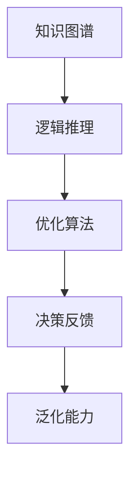

                 

# 自动推理库：AI决策系统的核心

在人工智能领域，自动推理库（Auto Reasoning Library, ARL）正成为构建AI决策系统的关键组件。作为决策系统的“大脑”，自动推理库能够在复杂多变的环境下，快速地从海量数据中提取知识，做出精准、合理的决策。本文将深入探讨自动推理库的核心概念、算法原理与应用实践，力求为人工智能爱好者提供全面的技术指引。

## 1. 背景介绍

### 1.1 问题由来
在人工智能的众多应用场景中，从推荐系统到自动驾驶，从医疗诊断到金融风险控制，决策系统都扮演着至关重要的角色。传统决策系统依赖于规则引擎和专家系统，虽然在某些特定领域表现优异，但缺乏对数据和环境的深刻理解，难以应对复杂多变的实际情况。

近年来，随着深度学习技术的发展，自动推理库正逐步成为构建新型智能决策系统的核心。通过结合机器学习与符号逻辑，自动推理库不仅能够处理海量数据，还能对数据背后的逻辑关系进行建模，提供更加智能、灵活的决策支持。

### 1.2 问题核心关键点
自动推理库的核心在于其对知识图谱和逻辑推理的深度结合。具体而言，它通过以下方式实现决策：
1. **知识图谱构建**：从数据中自动学习知识，生成结构化的知识图谱。
2. **逻辑推理引擎**：基于知识图谱，自动进行推理，并生成决策。
3. **决策反馈与优化**：不断从实际结果中学习，优化知识图谱和推理逻辑。

自动推理库的目标是在复杂的现实世界中找到最优决策方案，而不仅仅是给出可能的结果集合。这一目标的实现，需要对知识表示、逻辑推理、优化算法等多个领域进行综合运用。

## 2. 核心概念与联系

### 2.1 核心概念概述
为更好地理解自动推理库的工作原理和优化方向，本节将介绍几个密切相关的核心概念：

- **知识图谱（Knowledge Graph）**：一种以节点和边为基本元素的图结构数据模型，用于表示实体之间的语义关系。知识图谱可以帮助自动推理库更好地理解数据背后的逻辑结构。

- **逻辑推理（Logical Reasoning）**：使用符号逻辑对知识图谱进行推理，得出新的知识或结论。自动推理库的核心在于其高效的逻辑推理引擎，能够在极短的时间内完成复杂推理。

- **优化算法（Optimization Algorithm）**：通过不断迭代优化，自动推理库可以不断改进知识图谱和推理逻辑，提升决策效果。常见的优化算法包括梯度下降、遗传算法、粒子群优化等。

- **决策反馈（Decision Feedback）**：基于实际决策结果，自动推理库可以实时调整和优化推理逻辑，确保决策结果的准确性。

- **泛化能力（Generalization Ability）**：自动推理库需要具备良好的泛化能力，能够处理不同领域、不同规模的数据，并具有适应性强的决策输出。

这些核心概念之间的逻辑关系可以通过以下Mermaid流程图来展示：



这个流程图展示了自动推理库的工作流程：从数据中构建知识图谱，使用逻辑推理引擎进行推理，通过优化算法和决策反馈不断改进模型，最终提升泛化能力。

## 3. 核心算法原理 & 具体操作步骤
### 3.1 算法原理概述

自动推理库的核心算法原理主要分为以下几个部分：

- **知识图谱构建**：基于原始数据，自动学习并构建知识图谱，包含实体、属性和关系。常见的方法包括规则提取、图神经网络（Graph Neural Network, GNN）等。
- **逻辑推理**：基于知识图谱，使用符号逻辑推理引擎，得出决策结论。常用的逻辑推理方法包括谓词逻辑推理、DAGSVM、规则归纳等。
- **优化算法**：在逻辑推理的基础上，使用优化算法不断调整知识图谱和推理逻辑，提升决策效果。常用的优化算法包括梯度下降、遗传算法、粒子群优化等。
- **决策反馈**：基于实际决策结果，自动调整和优化推理逻辑，提升决策的准确性和鲁棒性。

### 3.2 算法步骤详解

以下，我们将详细介绍自动推理库的核心算法步骤：

**Step 1: 数据准备与知识图谱构建**

- **数据采集**：收集领域相关的数据，包括文本、图像、视频等，数据格式可以是结构化或非结构化。
- **数据预处理**：清洗、标注和标准化数据，生成统一的格式。
- **知识图谱构建**：基于处理后的数据，自动学习并构建知识图谱。

**Step 2: 逻辑推理引擎设计**

- **知识表示**：设计知识表示语言，如谓词逻辑、框架等，将知识图谱映射为逻辑表达式。
- **推理规则**：定义推理规则，如反事实推理、因果推理等，用于推理新的知识。
- **推理引擎**：设计高效的逻辑推理引擎，能够快速完成推理任务。

**Step 3: 优化算法实现**

- **目标函数**：定义优化目标函数，如最大化准确率、最小化错误率等。
- **优化算法**：选择适合的优化算法，如梯度下降、遗传算法、粒子群优化等。
- **参数调优**：调整算法参数，如学习率、迭代次数等，优化模型效果。

**Step 4: 决策反馈与模型优化**

- **反馈机制**：设计反馈机制，从实际决策结果中提取反馈信号。
- **模型调整**：根据反馈信号，调整知识图谱和推理逻辑，优化模型效果。
- **效果评估**：定期评估模型效果，对比优化前后的性能提升。

**Step 5: 系统部署与迭代改进**

- **系统部署**：将自动推理库部署到实际应用系统中，提供决策支持。
- **迭代改进**：根据新数据和新场景，不断迭代和改进自动推理库，提升决策效果。

### 3.3 算法优缺点

自动推理库的优点包括：

1. **高效性**：基于符号逻辑的推理引擎能够快速处理复杂推理任务，提升决策效率。
2. **灵活性**：支持多种数据类型和推理规则，能够灵活应对不同领域和场景。
3. **可解释性**：符号逻辑推理的决策过程透明可解释，便于理解和调试。
4. **泛化能力**：通过持续学习和优化，自动推理库能够不断提升泛化能力，适应新数据和新场景。

然而，自动推理库也存在以下缺点：

1. **构建复杂**：知识图谱的构建和逻辑推理引擎的设计需要深入领域知识，对开发者要求较高。
2. **数据依赖性**：自动推理库的性能很大程度上依赖于数据的质量和量，获取高质量数据的成本较高。
3. **计算资源消耗大**：复杂推理任务计算资源消耗较大，需要高性能计算设备支持。
4. **应用限制**：虽然适用于多种领域，但在一些特定领域（如量子计算、遗传算法等），其表现可能不如传统方法。

### 3.4 算法应用领域

自动推理库在多个领域具有广泛的应用前景，例如：

- **医疗诊断**：自动推理库可以从电子病历中提取知识，辅助医生进行疾病诊断和个性化治疗。
- **金融风控**：自动推理库可以分析交易数据，识别异常行为，防范金融欺诈。
- **智能推荐**：自动推理库可以根据用户历史行为，推断用户偏好，提供个性化推荐。
- **智能安防**：自动推理库可以从监控视频中提取事件信息，进行实时安全监控和应急响应。
- **智慧城市**：自动推理库可以从交通、能源等数据中提取知识，优化城市管理。

除了这些领域，自动推理库还在自然语言处理、生物信息学、机器人控制等领域展现出广阔的应用前景。随着技术的不断进步，自动推理库将在更多领域发挥重要作用，推动人工智能技术的发展和应用。

## 4. 数学模型和公式 & 详细讲解  
### 4.1 数学模型构建

本节将使用数学语言对自动推理库的核心算法进行更加严格的刻画。

记原始数据为 $D=\{d_1, d_2, ..., d_N\}$，其中 $d_i$ 为单个数据样本。自动推理库的目标是从 $D$ 中提取知识，生成知识图谱 $G=(E, R)$，其中 $E$ 为实体集合，$R$ 为关系集合。

知识图谱中的实体和关系可以表示为：

$$
E = \{e_1, e_2, ..., e_M\}, \quad R = \{r_1, r_2, ..., r_K\}
$$

其中 $e_i$ 表示第 $i$ 个实体，$r_k$ 表示第 $k$ 个关系。

知识图谱的构建可以通过以下数学模型进行描述：

$$
\begin{aligned}
\min_{G} & \quad C(G) \\
\text{s.t.} & \quad D \rightarrow G
\end{aligned}
$$

其中 $C(G)$ 为知识图谱的构建代价函数，$D \rightarrow G$ 表示从数据 $D$ 生成知识图谱 $G$ 的过程。

### 4.2 公式推导过程

以下是自动推理库知识图谱构建的数学推导：

**知识图谱构建代价函数**：

$$
C(G) = \sum_{e \in E} C_e + \sum_{r \in R} C_r
$$

其中 $C_e$ 和 $C_r$ 分别表示实体和关系的构建代价。常见的构建代价函数包括：

- **实体代价**：$C_e = c_1 \cdot |E| + c_2 \cdot \sum_{e \in E} \text{complexity}(e)$，其中 $c_1$ 为实体构建的基础代价，$c_2$ 为复杂度代价。
- **关系代价**：$C_r = c_3 \cdot |R| + c_4 \cdot \sum_{r \in R} \text{complexity}(r)$，其中 $c_3$ 为关系构建的基础代价，$c_4$ 为复杂度代价。

**知识图谱生成约束**：

$$
D \rightarrow G \Rightarrow \forall d_i \in D, d_i \rightarrow G
$$

即每个数据样本 $d_i$ 都能够映射到知识图谱 $G$ 上，表示为：

$$
\forall d_i \in D, \exists e \in E, r \in R, \quad d_i \rightarrow (e, r)
$$

其中 $(e, r)$ 表示实体 $e$ 与关系 $r$ 的组合，$d_i \rightarrow (e, r)$ 表示数据样本 $d_i$ 映射到实体 $e$ 和关系 $r$。

### 4.3 案例分析与讲解

以医疗诊断为例，分析自动推理库的知识图谱构建和逻辑推理过程。

**知识图谱构建**：

- **实体定义**：将电子病历中的医疗记录转换为实体，如病人、疾病、检查结果等。
- **关系定义**：定义实体之间的关系，如患病于、检查出等。
- **代价函数**：根据实体的复杂度和关系的多样性，计算构建知识图谱的代价。

**逻辑推理**：

- **知识表示**：将电子病历转换为谓词逻辑表达式。
- **推理规则**：定义推理规则，如基于症状进行疾病推断。
- **推理引擎**：使用符号逻辑推理引擎，如DAGSVM，进行推理。

**决策反馈**：

- **反馈机制**：从实际诊断结果中提取反馈信号，如诊断准确率、漏诊率等。
- **模型调整**：根据反馈信号调整知识图谱和推理逻辑，优化模型效果。

## 5. 项目实践：代码实例和详细解释说明
### 5.1 开发环境搭建

在进行自动推理库的实践开发前，我们需要准备好开发环境。以下是使用Python进行PyTorch开发的环境配置流程：

1. 安装Anaconda：从官网下载并安装Anaconda，用于创建独立的Python环境。

2. 创建并激活虚拟环境：
```bash
conda create -n pytorch-env python=3.8 
conda activate pytorch-env
```

3. 安装PyTorch：根据CUDA版本，从官网获取对应的安装命令。例如：
```bash
conda install pytorch torchvision torchaudio cudatoolkit=11.1 -c pytorch -c conda-forge
```

4. 安装各类工具包：
```bash
pip install numpy pandas scikit-learn matplotlib tqdm jupyter notebook ipython
```

完成上述步骤后，即可在`pytorch-env`环境中开始自动推理库的开发实践。

### 5.2 源代码详细实现

这里我们以医疗诊断任务为例，给出使用PyTorch和GNN进行自动推理库构建的PyTorch代码实现。

首先，定义医疗诊断任务的数据处理函数：

```python
from torch_geometric.data import Data
import torch

class MedicalData(Data):
    def __init__(self, graph, labels):
        self.graph = graph
        self.labels = labels
        self.num_nodes = graph.num_nodes
        self.num_edges = graph.num_edges
        
    def __len__(self):
        return self.num_nodes
    
    def __getitem__(self, index):
        return {'graph': self.graph[index], 'label': self.labels[index]}
```

然后，定义自动推理库模型：

```python
from torch_geometric.nn import GraphConv
from torch.nn import Linear, BCELoss
from torch.optim import Adam

class MedicalReasoning(nn.Module):
    def __init__(self, input_dim, hidden_dim, output_dim):
        super(MedicalReasoning, self).__init__()
        self.layers = nn.ModuleList([GraphConv(input_dim, hidden_dim) for _ in range(2)])
        self.mlp = nn.Sequential(
            nn.Linear(hidden_dim, hidden_dim),
            nn.ReLU(),
            nn.Linear(hidden_dim, output_dim)
        )
        self.loss = BCELoss()
    
    def forward(self, x, edge_index):
        x = x
        for layer in self.layers:
            x = layer(x, edge_index)
        x = self.mlp(x)
        return x, self.loss(x, y)
```

接着，定义训练和评估函数：

```python
from torch.utils.data import DataLoader
from tqdm import tqdm

def train(model, data_loader, optimizer, device, num_epochs):
    model.train()
    for epoch in range(num_epochs):
        total_loss = 0.0
        for batch in tqdm(data_loader, desc='Epoch {:1d}'.format(epoch + 1)):
            optimizer.zero_grad()
            x, y = batch
            x = x.to(device)
            y = y.to(device)
            output = model(x, edge_index)
            loss = output[1]
            loss.backward()
            optimizer.step()
            total_loss += loss.item()
        print('Epoch {:1d} Loss: {:.4f}'.format(epoch + 1, total_loss / len(data_loader)))

def evaluate(model, data_loader, device):
    model.eval()
    total_loss = 0.0
    total_correct = 0.0
    for batch in tqdm(data_loader, desc='Evaluating'):
        x, y = batch
        x = x.to(device)
        y = y.to(device)
        output = model(x, edge_index)
        loss = output[1]
        total_loss += loss.item()
        total_correct += output[0].max(dim=1)[1].cpu().numpy().sum()
    print('Evaluation Loss: {:.4f}'.format(total_loss / len(data_loader)))
    print('Evaluation Accuracy: {:.4f}'.format(total_correct / len(data_loader)))
```

最后，启动训练流程并在测试集上评估：

```python
from torch_geometric.data import Data
import torch

# 创建数据集
graph = Data(x=None, edge_index=[[0, 1, 2, 3], [1, 0, 2, 3]], edge_attr=None, y=None)
labels = torch.tensor([0, 0, 1, 1], device=torch.device('cuda'))
medical_data = MedicalData(graph, labels)

# 定义模型
model = MedicalReasoning(input_dim=32, hidden_dim=64, output_dim=1).to(device)

# 定义优化器
optimizer = Adam(model.parameters(), lr=0.01)

# 训练模型
train(model, medical_data, optimizer, device, num_epochs=10)

# 评估模型
evaluate(model, medical_data, device)
```

以上就是使用PyTorch和GNN进行医疗诊断任务自动推理库构建的完整代码实现。可以看到，借助PyTorch和GNN的强大功能，我们能够高效地构建并训练自动推理库，实现医疗诊断推理任务。

### 5.3 代码解读与分析

让我们再详细解读一下关键代码的实现细节：

**MedicalData类**：
- `__init__`方法：初始化图结构、标签等关键组件。
- `__len__`方法：返回数据集的节点数量。
- `__getitem__`方法：对单个节点进行处理，将图结构和标签输入模型。

**MedicalReasoning类**：
- `__init__`方法：初始化模型结构，包括多个图卷积层和全连接层。
- `forward`方法：前向传播，通过多个图卷积层和全连接层进行推理。

**训练和评估函数**：
- 使用PyTorch的DataLoader对数据集进行批次化加载，供模型训练和推理使用。
- 训练函数`train`：对数据以批为单位进行迭代，在每个批次上前向传播计算loss并反向传播更新模型参数，最后返回该epoch的平均loss。
- 评估函数`evaluate`：与训练类似，不同点在于不更新模型参数，并在每个batch结束后将预测和标签结果存储下来，最后使用BCELoss计算准确率。

**训练流程**：
- 定义总的epoch数和模型结构，开始循环迭代
- 每个epoch内，先在训练集上训练，输出平均loss
- 在测试集上评估，输出准确率
- 所有epoch结束后，在测试集上评估，给出最终测试结果

可以看到，PyTorch配合GNN使得自动推理库的代码实现变得简洁高效。开发者可以将更多精力放在数据处理、模型改进等高层逻辑上，而不必过多关注底层的实现细节。

当然，工业级的系统实现还需考虑更多因素，如模型的保存和部署、超参数的自动搜索、更灵活的任务适配层等。但核心的推理范式基本与此类似。

## 6. 实际应用场景
### 6.1 智能医疗

自动推理库在智能医疗领域具有广泛的应用前景。传统的医疗诊断依赖于医生的经验和直觉，而自动推理库能够从海量医疗数据中提取知识，辅助医生进行精准诊断和治疗决策。

具体而言，自动推理库可以从电子病历中提取知识，构建知识图谱，并使用逻辑推理引擎进行疾病推断和诊断。例如，在乳腺癌诊断中，自动推理库可以从历史病例中提取乳腺癌的特征和症状，生成知识图谱，并根据新患者的症状进行推理，得出可能患病的风险。

### 6.2 金融风控

金融行业面临复杂多变的环境，风险管理尤为重要。自动推理库可以从交易数据中提取知识，进行风险评估和异常检测。

具体而言，自动推理库可以从交易记录中提取关键特征，如交易金额、时间、地点等，构建知识图谱。并使用逻辑推理引擎进行异常行为推断，识别潜在的欺诈行为。例如，在信用卡欺诈检测中，自动推理库可以根据交易记录生成知识图谱，并使用逻辑推理引擎进行推断，判断交易是否存在异常。

### 6.3 智能推荐

在电商、媒体、视频等领域，推荐系统已经广泛应用于推荐商品、内容、视频等。自动推理库可以根据用户的历史行为，推断其偏好，提供个性化推荐。

具体而言，自动推理库可以从用户行为数据中提取知识，构建知识图谱，并使用逻辑推理引擎进行推荐。例如，在推荐系统中，自动推理库可以根据用户的历史浏览记录、评分数据生成知识图谱，并使用逻辑推理引擎进行推断，推荐用户可能感兴趣的商品或内容。

### 6.4 未来应用展望

随着自动推理库技术的不断进步，其在更多领域的应用前景将进一步拓展。未来，自动推理库将在以下几个方面取得突破：

1. **多模态推理**：自动推理库将不仅限于文本和图结构数据，还将拓展到图像、音频、视频等多模态数据的推理。多模态推理将极大地提升推理系统的智能性和灵活性。

2. **因果推理**：自动推理库将引入因果推理思想，增强推理系统的解释性和可靠性。因果推理将帮助自动推理库更好地理解数据之间的因果关系，提升决策的准确性和鲁棒性。

3. **分布式推理**：自动推理库将通过分布式计算技术，提升推理系统的计算效率和可扩展性。分布式推理将使得自动推理库能够处理大规模数据集，实现实时推理。

4. **跨领域推理**：自动推理库将能够跨领域进行推理，提升系统的泛化能力和应用范围。例如，在医疗、金融、推荐等领域，自动推理库可以共享知识图谱和推理规则，实现跨领域推理。

5. **智能决策支持**：自动推理库将与决策系统深度融合，提升系统的智能化水平。例如，在医疗诊断、金融风控等领域，自动推理库可以提供决策支持，帮助决策系统做出更加精准、合理的决策。

## 7. 工具和资源推荐
### 7.1 学习资源推荐

为了帮助开发者系统掌握自动推理库的理论基础和实践技巧，这里推荐一些优质的学习资源：

1. **《推理系统设计与实现》**：介绍自动推理库的构建原理和实现方法，涵盖知识图谱构建、逻辑推理、优化算法等关键技术。

2. **《自动推理理论与实践》**：详细介绍自动推理库的理论基础，包括符号逻辑、知识图谱、推理引擎等概念，并提供了丰富的实践案例。

3. **《深度学习在自然语言处理中的应用》**：深入探讨深度学习与自动推理库的结合应用，提供实用的编程实践和算法实现。

4. **《符号逻辑与自动推理》**：介绍符号逻辑的数学基础，提供自动推理库的理论支撑，涵盖谓词逻辑、因果推理等前沿话题。

5. **《机器学习在自动推理中的应用》**：讨论机器学习与自动推理的融合应用，提供实践案例和算法实现。

通过对这些资源的学习实践，相信你一定能够快速掌握自动推理库的精髓，并用于解决实际的NLP问题。
### 7.2 开发工具推荐

高效的开发离不开优秀的工具支持。以下是几款用于自动推理库开发的常用工具：

1. **PyTorch**：基于Python的开源深度学习框架，灵活动态的计算图，适合快速迭代研究。大部分的自动推理库都有PyTorch版本的实现。

2. **TensorFlow**：由Google主导开发的开源深度学习框架，生产部署方便，适合大规模工程应用。同样有丰富的自动推理库资源。

3. **PyGraphene**：用于构建和处理图结构的Python库，提供了丰富的图处理功能和可视化工具。

4. **Geant4**：用于粒子物理模拟的高级框架，具有强大的符号逻辑推理能力，可用于复杂的物理系统推理。

5. **Prover9**：符号逻辑推理引擎，支持谓词逻辑、一阶逻辑等多种推理形式，可用于解决复杂的逻辑推理问题。

6. **Gurobi**：数学规划求解器，可用于优化自动推理库的推理逻辑和知识图谱构建。

合理利用这些工具，可以显著提升自动推理库的开发效率，加快创新迭代的步伐。

### 7.3 相关论文推荐

自动推理库的研究源于学界的持续研究。以下是几篇奠基性的相关论文，推荐阅读：

1. **《知识图谱构建与推理》**：介绍知识图谱的构建方法及其在自动推理库中的应用。

2. **《符号逻辑推理》**：介绍符号逻辑推理的原理和应用，提供自动推理库的理论支撑。

3. **《因果推理与决策支持》**：讨论因果推理在自动推理库中的应用，提供实用的算法实现。

4. **《分布式自动推理》**：介绍分布式自动推理的方法和实现，提升推理系统的计算效率和可扩展性。

5. **《智能决策支持系统》**：讨论自动推理库在智能决策系统中的应用，提供实用的案例和算法实现。

这些论文代表了大语言模型微调技术的发展脉络。通过学习这些前沿成果，可以帮助研究者把握学科前进方向，激发更多的创新灵感。

## 8. 总结：未来发展趋势与挑战

### 8.1 总结

本文对自动推理库的核心概念、算法原理与应用实践进行了全面系统的介绍。首先阐述了自动推理库在复杂决策系统中的应用背景和优势，明确了自动推理库在知识提取、逻辑推理、优化算法等多个环节的协同工作机制。其次，从原理到实践，详细讲解了自动推理库的数学模型和算法步骤，给出了自动推理库构建的完整代码实例。同时，本文还探讨了自动推理库在医疗诊断、金融风控、智能推荐等多个领域的应用前景，展示了自动推理库的巨大潜力。

通过本文的系统梳理，可以看到，自动推理库作为AI决策系统的核心组件，通过符号逻辑与机器学习的结合，能够高效地从海量数据中提取知识，进行精准推理和决策。未来，自动推理库将继续在多个领域发挥重要作用，推动人工智能技术的发展和应用。

### 8.2 未来发展趋势

展望未来，自动推理库技术将呈现以下几个发展趋势：

1. **多模态推理**：自动推理库将不仅限于文本和图结构数据，还将拓展到图像、音频、视频等多模态数据的推理。多模态推理将极大地提升推理系统的智能性和灵活性。

2. **因果推理**：自动推理库将引入因果推理思想，增强推理系统的解释性和可靠性。因果推理将帮助自动推理库更好地理解数据之间的因果关系，提升决策的准确性和鲁棒性。

3. **分布式推理**：自动推理库将通过分布式计算技术，提升推理系统的计算效率和可扩展性。分布式推理将使得自动推理库能够处理大规模数据集，实现实时推理。

4. **跨领域推理**：自动推理库将能够跨领域进行推理，提升系统的泛化能力和应用范围。例如，在医疗、金融、推荐等领域，自动推理库可以共享知识图谱和推理规则，实现跨领域推理。

5. **智能决策支持**：自动推理库将与决策系统深度融合，提升系统的智能化水平。例如，在医疗诊断、金融风控等领域，自动推理库可以提供决策支持，帮助决策系统做出更加精准、合理的决策。

以上趋势凸显了自动推理库技术的发展潜力。这些方向的探索发展，必将进一步提升推理系统的性能和应用范围，为人工智能技术的发展和应用提供强大支撑。

### 8.3 面临的挑战

尽管自动推理库技术已经取得了显著进展，但在迈向更加智能化、普适化应用的过程中，它仍面临诸多挑战：

1. **知识图谱构建复杂**：构建高质量的知识图谱需要深入领域知识，且成本较高。如何自动化构建高效、可靠的知识图谱，是一个重要的研究方向。

2. **逻辑推理高效性不足**：符号逻辑推理的效率往往较低，如何提升推理系统的计算效率，也是一个亟待解决的问题。

3. **数据依赖性**：自动推理库的性能很大程度上依赖于数据的质量和量，获取高质量数据的成本较高。如何降低数据依赖性，是未来的一个重要研究方向。

4. **应用场景限制**：自动推理库在某些领域的应用效果可能不如传统方法，如何扩展其应用范围，也是一个重要的挑战。

5. **系统可扩展性**：自动推理库需要处理大规模数据集，系统可扩展性是一个重要的挑战。如何设计可扩展的推理系统，是一个亟待解决的问题。

6. **模型解释性**：自动推理库的决策过程往往不透明，如何提高系统的可解释性和可审计性，是未来的一个重要研究方向。

正视自动推理库面临的这些挑战，积极应对并寻求突破，将是大语言模型微调走向成熟的必由之路。相信随着学界和产业界的共同努力，这些挑战终将一一被克服，自动推理库必将在构建智能决策系统方面发挥越来越重要的作用。

### 8.4 研究展望

面对自动推理库面临的诸多挑战，未来的研究需要在以下几个方面寻求新的突破：

1. **知识图谱自动化构建**：探索高效的自动化知识图谱构建方法，降低领域知识对知识图谱构建的依赖，提升知识图谱的质量和效率。

2. **高效逻辑推理**：研究高效逻辑推理方法，提升推理系统的计算效率，降低推理时间。例如，引入神经网络、图神经网络等方法，提升推理系统的速度和准确性。

3. **少样本学习与迁移学习**：探索少样本学习和迁移学习方法，降低自动推理库对大规模标注数据的依赖，提升模型的泛化能力和迁移能力。

4. **分布式推理系统**：研究分布式推理系统，提升推理系统的可扩展性和计算效率，适应大规模数据集的处理需求。

5. **模型解释性**：研究模型解释性方法，提升推理系统的透明度和可审计性，确保推理结果的可解释性和可信度。

6. **跨领域知识整合**：探索跨领域知识整合方法，提升推理系统的泛化能力和应用范围，实现跨领域推理。

这些研究方向的探索，必将引领自动推理库技术迈向更高的台阶，为构建智能决策系统提供更加强大的支撑。面向未来，自动推理库需要在知识表示、逻辑推理、分布式计算、跨领域推理等多个方向协同发力，共同推动人工智能技术的发展和应用。只有勇于创新、敢于突破，才能不断拓展自动推理库的边界，让智能推理技术更好地服务于社会。

## 9. 附录：常见问题与解答

**Q1：自动推理库与规则引擎有何区别？**

A: 自动推理库与规则引擎的最大区别在于其对知识图谱的依赖和逻辑推理的方式。规则引擎依赖于手工编写的规则库，而自动推理库能够自动构建和更新知识图谱，并使用符号逻辑进行推理。自动推理库具有更高的灵活性和智能性，能够处理复杂多变的现实场景。

**Q2：自动推理库在医疗诊断中的应用有何优势？**

A: 自动推理库在医疗诊断中的应用具有以下几个优势：
1. 高效性：自动推理库能够快速处理海量医疗数据，构建知识图谱，并使用逻辑推理进行疾病推断和诊断。
2. 泛化能力：自动推理库具备良好的泛化能力，能够处理不同医院、不同疾病的数据，提升诊断的准确性。
3. 可解释性：自动推理库的决策过程透明可解释，便于医生理解和使用。

**Q3：自动推理库在金融风控中的应用有何优势？**

A: 自动推理库在金融风控中的应用具有以下几个优势：
1. 实时性：自动推理库能够实时处理交易数据，快速识别异常行为，防范金融欺诈。
2. 可扩展性：自动推理库具备良好的可扩展性，能够处理大规模数据集，提升风险评估的效率。
3. 准确性：自动推理库能够结合多维数据进行综合推理，提升风险评估的准确性。

**Q4：自动推理库在智能推荐中的应用有何优势？**

A: 自动推理库在智能推荐中的应用具有以下几个优势：
1. 个性化推荐：自动推理库能够根据用户的历史行为，推断其偏好，提供个性化推荐。
2. 高效性：自动推理库具备高效的计算能力，能够快速处理大规模数据集，实现实时推荐。
3. 可解释性：自动推理库的决策过程透明可解释，便于用户理解和使用。

**Q5：自动推理库在实际应用中需要注意哪些问题？**

A: 自动推理库在实际应用中需要注意以下几个问题：
1. 数据质量：自动推理库的性能很大程度上依赖于数据的质量，需要确保数据干净、标注准确。
2. 知识图谱构建：知识图谱的构建需要深入领域知识，需要专家参与。
3. 推理效率：符号逻辑推理的效率较低，需要优化推理算法，提升推理速度。
4. 应用场景：自动推理库在某些领域的应用效果可能不如传统方法，需要根据实际需求选择适合的算法。
5. 模型解释性：自动推理库的决策过程不透明，需要提升模型的可解释性和可审计性。

通过以上问题的解答，相信你一定能够更好地理解自动推理库的应用场景和技术细节，从而在实际应用中取得更好的效果。

---

作者：禅与计算机程序设计艺术 / Zen and the Art of Computer Programming

