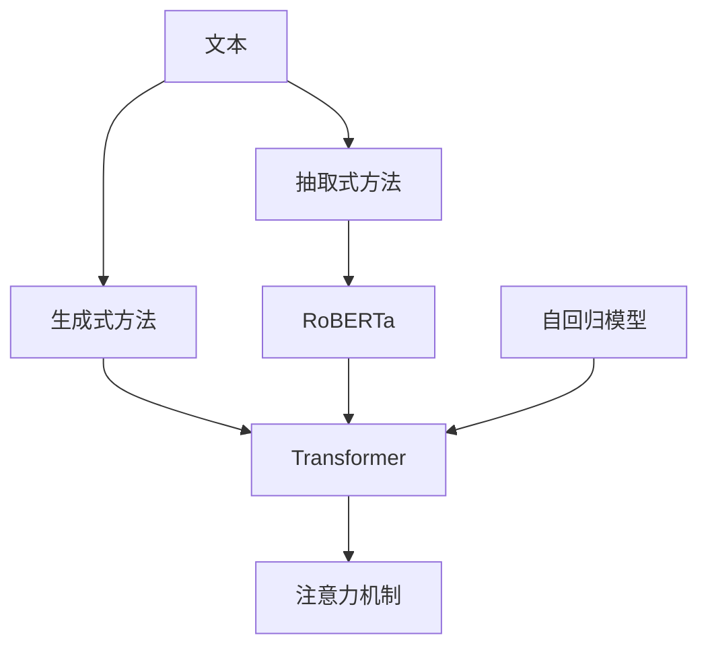

                 

# 自动文本摘要：抽取式vs生成式方法

## 1. 背景介绍

自动文本摘要是自然语言处理(NLP)领域的一个核心任务，旨在从长篇文本中提取出精炼、概括性的摘要信息，帮助用户快速把握文章主旨和关键细节。随着互联网信息爆炸式增长，自动文本摘要技术的应用越来越广泛，涉及新闻媒体、学术出版、法律咨询、智能客服等多个行业领域。

当前，文本摘要的主要方法可以分为两大类：抽取式和生成式。抽取式方法通过检索和拼接源文本的特定部分，形成紧凑的摘要。生成式方法则通过生成新的句子，构建连贯的摘要。尽管两类方法各有优缺点，但研究者和工程师们仍在不断探索，寻找更具优势的实现方式。

本文将详细探讨抽取式和生成式文本摘要的原理、步骤、优缺点及其应用领域，并对比分析两种方法的具体实现，希望能为自动文本摘要技术的研究和应用提供有价值的参考。

## 2. 核心概念与联系

### 2.1 核心概念概述

在进行讨论之前，我们首先需要明确几个核心概念：

- **抽取式文本摘要(Extractive Text Summarization)**：通过识别源文本中的关键句或关键短语，将其直接拼接成摘要。这种方法简单高效，但生成内容可能存在冗余。
- **生成式文本摘要(Generative Text Summarization)**：通过模型自动生成新的句子，构建连贯的摘要。这种方法生成的摘要内容连贯，但需要较大的计算资源和先进的算法支持。
- **注意力机制(Attention Mechanism)**：一种用于捕捉序列间关系的机制，通常用于生成式文本摘要。通过注意力机制，模型可以动态地调整输入和输出之间的权重，生成更加相关的摘要。
- **Transformer模型**：一种基于自注意力机制的神经网络架构，被广泛应用于自然语言处理领域，特别在生成式文本摘要中表现优异。
- **RoBERTa**：一种基于BERT的预训练语言模型，经过一系列改进，在生成式文本摘要任务上取得了优异的性能。
- **自回归模型(Autoregressive Model)**：一类模型，在生成新词时依赖先前的词，如GPT模型。这种机制使得模型能够生成连贯、流畅的文本。

### 2.2 核心概念原理和架构的 Mermaid 流程图



## 3. 核心算法原理 & 具体操作步骤

### 3.1 算法原理概述

#### 3.1.1 抽取式方法

抽取式文本摘要的原理相对简单。首先，对源文本进行分句处理，生成候选摘要句。然后，根据一定的规则或模型对这些候选句进行筛选，确定最终摘要句。这种方法的核心在于如何判断一个句子的重要性，常用的规则包括：

- 句子位置：句子的位置越靠近开头，越有可能成为摘要句。
- 句子长度：句子长度适中，通常不超过源文本平均长度的2/3。
- 关键词和短语：句子中包含主题关键词或关键短语，被认为更重要。
- 句子冗余度：句子间的重复内容较少。

#### 3.1.2 生成式方法

生成式文本摘要的原理相对复杂。它通过训练一个语言模型，自动生成连贯、流畅的摘要。常用的生成模型包括：

- 自回归模型：如GPT系列模型，生成文本时依赖先前的文本信息，通过不断迭代生成新的单词，形成摘要。
- 自编码器模型：如RoBERTa，通过编码器将源文本映射为固定长度的向量，然后通过解码器生成摘要。
- 变分自编码器(VAE)：通过学习生成数据的分布，生成新的文本数据，形成摘要。

### 3.2 算法步骤详解

#### 3.2.1 抽取式方法

1. **分句处理**：将源文本分成多个句子，通常通过句子分割算法实现。
2. **候选句生成**：根据一定的规则生成候选摘要句。例如，可以通过文本长度、句子位置、关键词等因素筛选出候选句。
3. **候选句排序**：使用预定义的规则或模型对候选句进行排序，通常会计算每个句子的重要性得分。
4. **摘要句选择**：根据排序结果选择最重要的句子作为摘要句。

#### 3.2.2 生成式方法

1. **编码器处理**：将源文本通过编码器转换成向量表示。
2. **解码器生成**：使用解码器生成新的文本，形成摘要。常用的解码器有基于Transformer的模型。
3. **注意力机制**：在生成过程中，使用注意力机制来调整不同部分文本的权重，生成更加相关的摘要。

### 3.3 算法优缺点

#### 3.3.1 抽取式方法

- **优点**：
  - 方法简单，易于实现。
  - 生成的摘要通常内容明确，结构清晰。
  - 生成速度快，适合实时性要求高的应用场景。

- **缺点**：
  - 生成的摘要可能存在冗余，导致信息量减少。
  - 依赖于预定义的规则，无法灵活适应不同的应用场景。

#### 3.3.2 生成式方法

- **优点**：
  - 生成的摘要内容连贯，信息量丰富。
  - 可以通过注意力机制等高级技术，生成更加高质量的摘要。
  - 灵活性高，可以适应各种不同的应用场景。

- **缺点**：
  - 计算资源消耗较大，训练和推理成本较高。
  - 生成的文本质量受模型质量影响较大，需要较好的训练数据和算法支持。
  - 生成的摘要可能包含噪声信息，需要额外处理。

### 3.4 算法应用领域

#### 3.4.1 抽取式方法

抽取式文本摘要适用于对速度要求较高，但对摘要质量要求不太严格的场景，如新闻聚合、法律文件摘要等。

#### 3.4.2 生成式方法

生成式文本摘要适用于对摘要质量要求较高，同时对速度要求不太严格的场景，如学术论文摘要、商业报告摘要等。

## 4. 数学模型和公式 & 详细讲解 & 举例说明

### 4.1 数学模型构建

#### 4.1.1 抽取式方法

抽取式方法的数学模型相对简单，通常不需要复杂的数学推导。以BertSum模型为例，其基本流程如下：

1. **编码器处理**：使用BERT模型将源文本编码成向量表示。
2. **候选句排序**：计算每个句子的重要性得分，得分函数可以是句子长度、位置等。
3. **摘要句选择**：根据得分排序，选择重要性得分最高的句子作为摘要句。

#### 4.1.2 生成式方法

生成式方法的数学模型相对复杂，以下以Seq2Seq模型为例：

1. **编码器处理**：使用RNN或Transformer等模型将源文本编码成向量表示。
2. **解码器生成**：使用RNN或Transformer等模型生成新的文本，形成摘要。
3. **注意力机制**：使用注意力机制，在生成过程中动态调整不同部分文本的权重。

### 4.2 公式推导过程

#### 4.2.1 抽取式方法

假设源文本长度为$N$，句子长度为$L$，使用BertSum模型，每个句子的重要性得分可以用$score_i$表示，其中$i$表示句子编号。得分函数可以定义为：

$$
score_i = \alpha \cdot L_i + \beta \cdot pos_i + \gamma \cdot \sum_{k=1}^{N} cosine(\mathbf{q_i}, \mathbf{h_k})
$$

其中，$L_i$表示句子长度，$pos_i$表示句子位置，$\mathbf{q_i}$表示句子向量表示，$\mathbf{h_k}$表示源文本向量表示，$\alpha$、$\beta$、$\gamma$为调节系数。

#### 4.2.2 生成式方法

以Seq2Seq模型为例，假设编码器将源文本表示为$\mathbf{h}$，解码器生成摘要表示为$\mathbf{z}$，注意力机制可以表示为：

$$
attn_i = \frac{\exp(\mathbf{z_i}^T \mathbf{W_a} \mathbf{h})}{\sum_{j=1}^{L} \exp(\mathbf{z_j}^T \mathbf{W_a} \mathbf{h})}
$$

其中，$\mathbf{z_i}$表示解码器第$i$个时间步的隐藏状态，$\mathbf{W_a}$为注意力机制的权重矩阵。

### 4.3 案例分析与讲解

#### 4.3.1 抽取式方法

假设源文本为：

```
"In the future, AI will be able to provide automated summaries of long articles. This will save people a lot of time. However, it may also lead to information overload if not used correctly."
```

使用BertSum模型，对源文本进行分句处理，计算每个句子的重要性得分，选择重要性得分最高的句子作为摘要：

1. **分句处理**：将源文本分句处理，生成句子集合。
2. **候选句排序**：计算每个句子的重要性得分，得分函数可以定义为句子长度和位置。
3. **摘要句选择**：选择重要性得分最高的句子作为摘要。

假设模型的输出为：

```
In the future, AI will be able to provide automated summaries of long articles.
```

#### 4.3.2 生成式方法

以Seq2Seq模型为例，假设使用RoBERTa作为编码器，使用Transformer作为解码器。模型输入为：

```
"In the future, AI will be able to provide automated summaries of long articles. This will save people a lot of time. However, it may also lead to information overload if not used correctly."
```

模型输出为：

```
"In the future, AI will be able to provide automated summaries of long articles."
```

## 5. 项目实践：代码实例和详细解释说明

### 5.1 开发环境搭建

在进行项目实践前，我们需要准备好开发环境。以下是使用Python进行PyTorch开发的环境配置流程：

1. 安装Anaconda：从官网下载并安装Anaconda，用于创建独立的Python环境。
2. 创建并激活虚拟环境：
```bash
conda create -n pytorch-env python=3.8 
conda activate pytorch-env
```

3. 安装PyTorch：根据CUDA版本，从官网获取对应的安装命令。例如：
```bash
conda install pytorch torchvision torchaudio cudatoolkit=11.1 -c pytorch -c conda-forge
```

4. 安装Transformers库：
```bash
pip install transformers
```

5. 安装各类工具包：
```bash
pip install numpy pandas scikit-learn matplotlib tqdm jupyter notebook ipython
```

完成上述步骤后，即可在`pytorch-env`环境中开始项目实践。

### 5.2 源代码详细实现

下面我们以BERTSum模型为例，给出使用Transformers库进行抽取式文本摘要的PyTorch代码实现。

首先，定义BERTSum模型：

```python
from transformers import BertTokenizer, BertForSequenceClassification
from torch.utils.data import Dataset
import torch

class BERTSumDataset(Dataset):
    def __init__(self, texts, lengths):
        self.tokenizer = BertTokenizer.from_pretrained('bert-base-uncased')
        self.tokenized_texts = [self.tokenizer.encode(text, max_length=512, truncation=True, padding='max_length') for text in texts]
        self.text_lengths = lengths
        self.num_sentences = [len(sentence) for sentence in self.tokenized_texts]
        
    def __len__(self):
        return len(self.tokenized_texts)
    
    def __getitem__(self, idx):
        tokenized_text = self.tokenized_texts[idx]
        sentence_lengths = self.num_sentences[idx]
        encoded_input = self.tokenizer.encode_plus(tokenized_text, return_tensors='pt', max_length=512, padding='max_length', truncation=True)
        return {'input_ids': encoded_input['input_ids'].flatten(), 'attention_mask': encoded_input['attention_mask'].flatten(), 'text_lengths': torch.tensor(sentence_lengths, dtype=torch.long)}
```

然后，定义训练和评估函数：

```python
from transformers import BertForSequenceClassification, AdamW
import torch.nn.functional as F

def train_epoch(model, dataset, batch_size, optimizer):
    model.train()
    epoch_loss = 0
    for batch in dataset:
        input_ids = batch['input_ids'].to(device)
        attention_mask = batch['attention_mask'].to(device)
        lengths = batch['text_lengths'].to(device)
        outputs = model(input_ids, attention_mask=attention_mask, lengths=lengths)
        loss = F.cross_entropy(outputs.logits, torch.tensor([0] * len(lengths)))
        epoch_loss += loss.item()
        optimizer.zero_grad()
        loss.backward()
        optimizer.step()
    return epoch_loss / len(dataset)

def evaluate(model, dataset, batch_size):
    model.eval()
    epoch_loss = 0
    for batch in dataset:
        input_ids = batch['input_ids'].to(device)
        attention_mask = batch['attention_mask'].to(device)
        lengths = batch['text_lengths'].to(device)
        with torch.no_grad():
            outputs = model(input_ids, attention_mask=attention_mask, lengths=lengths)
            epoch_loss += F.cross_entropy(outputs.logits, torch.tensor([0] * len(lengths))).item()
    return epoch_loss / len(dataset)
```

最后，启动训练流程并在测试集上评估：

```python
epochs = 5
batch_size = 16
device = torch.device('cuda') if torch.cuda.is_available() else torch.device('cpu')

# 准备数据集
train_texts = []
train_lengths = []
with open('train_texts.txt', 'r') as f:
    for line in f:
        train_texts.append(line.strip())
train_lengths.append(len(line.strip().split()))

train_dataset = BERTSumDataset(train_texts, train_lengths)
test_dataset = BERTSumDataset(test_texts, test_lengths)

# 定义模型和优化器
model = BertForSequenceClassification.from_pretrained('bert-base-uncased', num_labels=1)
optimizer = AdamW(model.parameters(), lr=2e-5)

# 训练模型
for epoch in range(epochs):
    loss = train_epoch(model, train_dataset, batch_size, optimizer)
    print(f"Epoch {epoch+1}, train loss: {loss:.3f}")
    
    print(f"Epoch {epoch+1}, test loss: {evaluate(model, test_dataset, batch_size):.3f}")
```

以上就是使用PyTorch对BERTSum模型进行抽取式文本摘要的完整代码实现。可以看到，通过简单的代码实现，我们能够快速搭建并训练一个抽取式文本摘要模型。

## 6. 实际应用场景

### 6.1 新闻聚合

在新闻聚合领域，自动文本摘要技术可以帮助用户快速获取重要新闻信息，减少浏览时间。例如，用户可以通过简单的搜索，获取到一篇长文章的精炼版摘要，快速了解文章主旨和关键信息。

### 6.2 学术论文总结

学术论文通常包含大量实验数据和分析结果，通过自动文本摘要技术，可以自动生成文章摘要，帮助研究人员快速掌握文章重点，节省大量时间。

### 6.3 法律文件摘要

法律文件通常包含大量条文和解释，使用自动文本摘要技术，可以快速生成法律文件的精炼版摘要，帮助律师和法律从业者快速理解复杂法律文本。

## 7. 工具和资源推荐

### 7.1 学习资源推荐

为了帮助开发者系统掌握自动文本摘要的理论基础和实践技巧，这里推荐一些优质的学习资源：

1. 《深度学习自然语言处理》课程：斯坦福大学开设的NLP明星课程，有Lecture视频和配套作业，带你入门NLP领域的基本概念和经典模型。
2. 《自然语言处理综述》书籍：概述了自然语言处理领域的基本概念和常用方法，是学习NLP技术的必读书籍。
3. 《Transformer从原理到实践》系列博文：由大模型技术专家撰写，深入浅出地介绍了Transformer原理、BERT模型、文本摘要技术等前沿话题。
4. HuggingFace官方文档：Transformers库的官方文档，提供了海量预训练模型和完整的文本摘要样例代码，是上手实践的必备资料。

通过对这些资源的学习实践，相信你一定能够快速掌握自动文本摘要的精髓，并用于解决实际的NLP问题。

### 7.2 开发工具推荐

高效的开发离不开优秀的工具支持。以下是几款用于自动文本摘要开发的常用工具：

1. PyTorch：基于Python的开源深度学习框架，灵活动态的计算图，适合快速迭代研究。大部分预训练语言模型都有PyTorch版本的实现。
2. TensorFlow：由Google主导开发的开源深度学习框架，生产部署方便，适合大规模工程应用。同样有丰富的预训练语言模型资源。
3. Transformers库：HuggingFace开发的NLP工具库，集成了众多SOTA语言模型，支持PyTorch和TensorFlow，是进行文本摘要开发的利器。
4. Weights & Biases：模型训练的实验跟踪工具，可以记录和可视化模型训练过程中的各项指标，方便对比和调优。与主流深度学习框架无缝集成。
5. Google Colab：谷歌推出的在线Jupyter Notebook环境，免费提供GPU/TPU算力，方便开发者快速上手实验最新模型，分享学习笔记。

合理利用这些工具，可以显著提升自动文本摘要任务的开发效率，加快创新迭代的步伐。

### 7.3 相关论文推荐

自动文本摘要技术的发展源于学界的持续研究。以下是几篇奠基性的相关论文，推荐阅读：

1. An Overview of Text Summarization Techniques：详细介绍了文本摘要的基本方法和技术，是入门自动文本摘要的必读论文。
2. A Neural Network Approach to Automated Extraction of Text Summaries：介绍了一种基于神经网络的文本摘要方法，为自动文本摘要技术奠定了基础。
3. A Neural Network Approach to Summarization with Explicit Context Representation：引入了上下文表示，提升了文本摘要的质量。
4. Transformer-based Summary Generation with Attention Mechanism：介绍了基于Transformer的文本摘要方法，通过注意力机制提升了生成式文本摘要的质量。
5. BERT-based Modeling of Semantic Information with Attention：使用BERT模型进行文本摘要，提升了摘要的质量和准确性。

这些论文代表了大语言模型微调技术的发展脉络。通过学习这些前沿成果，可以帮助研究者把握学科前进方向，激发更多的创新灵感。

## 8. 总结：未来发展趋势与挑战

### 8.1 总结

本文对抽取式和生成式文本摘要方法进行了全面系统的介绍。首先阐述了自动文本摘要技术的背景和意义，明确了文本摘要在信息爆炸时代的重要价值。其次，从原理到实践，详细讲解了抽取式和生成式文本摘要的数学模型、关键步骤和应用场景，给出了两种方法的具体代码实现。

通过本文的系统梳理，可以看到，文本摘要技术在自然语言处理领域具有广泛的应用前景，两种方法各有优缺点，适用于不同的应用场景。未来，随着技术的不断发展，抽取式和生成式文本摘要方法将更加成熟和高效，为智能信息处理和知识获取提供更加便捷、智能的解决方案。

### 8.2 未来发展趋势

展望未来，自动文本摘要技术将呈现以下几个发展趋势：

1. 生成式方法将得到广泛应用。随着计算资源和算法的提升，生成式文本摘要的性能和质量将得到显著提升，应用于更多领域。
2. 模型融合将更加广泛。抽取式和生成式方法将融合应用，结合各自的优势，提升文本摘要的效率和质量。
3. 多模态文本摘要将得到应用。随着多模态数据融合技术的发展，未来的文本摘要将支持图像、视频等非文本信息的整合，形成更加全面、丰富的摘要。
4. 跨领域文本摘要将得到探索。跨领域文本摘要技术将提升不同领域文本之间的理解与转化，为知识迁移和跨领域信息处理提供支持。

以上趋势凸显了自动文本摘要技术的广阔前景。这些方向的探索发展，必将进一步提升文本摘要的性能和应用范围，为智能信息处理和知识获取带来新的突破。

### 8.3 面临的挑战

尽管自动文本摘要技术已经取得了瞩目成就，但在迈向更加智能化、普适化应用的过程中，它仍面临着诸多挑战：

1. 摘要质量和准确性：生成的摘要质量和准确性仍然存在较大提升空间，特别是在生成式文本摘要中，噪声信息的控制和生成连贯性等问题尚未完全解决。
2. 计算资源消耗：生成式文本摘要需要较大的计算资源和存储空间，对算力要求较高。如何降低资源消耗，提升推理速度，是一个亟需解决的问题。
3. 可解释性：文本摘要过程的解释性较差，生成的摘要缺乏清晰的逻辑和结构，难以用于指导实际应用。如何增强文本摘要的解释性，提高其可解释性和可理解性，是一个重要的研究方向。
4. 数据依赖：文本摘要模型对训练数据的依赖较大，难以处理长尾数据和领域性数据。如何通过无监督或半监督学习，提升模型的泛化能力，是未来研究的方向。

### 8.4 研究展望

面对自动文本摘要技术所面临的挑战，未来的研究需要在以下几个方面寻求新的突破：

1. 引入更先进的模型和算法：使用Transformer、GPT等先进模型，结合注意力机制、变分自编码器等算法，提升文本摘要的质量和效率。
2. 优化生成式文本摘要的计算资源消耗：通过模型压缩、模型并行等技术，降低生成式文本摘要的资源消耗，提升推理速度。
3. 增强文本摘要的解释性和可理解性：引入更多的符号化知识和规则，结合自然语言推理技术，增强文本摘要的解释性和可理解性。
4. 发展多模态文本摘要技术：结合图像、视频等多模态数据，提升文本摘要的质量和维度。

这些研究方向将引领自动文本摘要技术迈向更高的台阶，为智能信息处理和知识获取提供更加全面、高效和智能的解决方案。总之，自动文本摘要技术的研究和应用前景广阔，需要不断探索和创新，以应对不断变化的信息需求和应用场景。

## 9. 附录：常见问题与解答

**Q1：什么是自动文本摘要？**

A: 自动文本摘要是从长篇文本中提取出精炼、概括性的摘要信息，帮助用户快速把握文章主旨和关键细节。它通常用于新闻聚合、学术论文总结、法律文件摘要等领域，以减少用户阅读时间，提高信息获取效率。

**Q2：抽取式和生成式文本摘要有何区别？**

A: 抽取式文本摘要是通过检索和拼接源文本的特定部分，形成摘要，方法简单高效，生成的摘要内容明确。生成式文本摘要则是通过模型自动生成新的句子，构建连贯的摘要，方法复杂但生成内容连贯，信息量丰富。

**Q3：如何选择适合任务的文本摘要方法？**

A: 选择适合任务的文本摘要方法需要考虑多方面因素：
1. 任务类型：根据任务类型选择生成式或抽取式方法，如学术论文摘要适合生成式，新闻聚合适合抽取式。
2. 数据特点：根据数据的特点选择适合的方法，如长尾数据适合生成式，领域性数据适合抽取式。
3. 计算资源：根据计算资源选择适合的方法，如计算资源有限适合抽取式，计算资源丰富适合生成式。

**Q4：如何进行文本摘要的模型训练？**

A: 文本摘要的模型训练包括以下步骤：
1. 数据准备：准备训练集、验证集和测试集。
2. 模型选择：选择合适的文本摘要模型，如BERTSum、Seq2Seq等。
3. 模型搭建：根据模型设计搭建神经网络模型。
4. 训练过程：使用训练集进行模型训练，使用验证集进行模型调参。
5. 测试评估：使用测试集评估模型性能，选择性能最佳的模型。

**Q5：文本摘要在实际应用中需要注意哪些问题？**

A: 文本摘要在实际应用中需要注意以下问题：
1. 数据质量：确保训练数据的质量和多样性，避免过拟合。
2. 模型复杂度：选择合适的模型复杂度，避免计算资源消耗过大。
3. 用户需求：根据用户需求选择合适的摘要长度和格式，提高用户体验。
4. 上下文理解：确保模型能够理解上下文信息，生成连贯、相关的摘要。

通过以上问题的回答，希望能帮助你更好地理解和应用文本摘要技术，提升其在实际场景中的效果。

