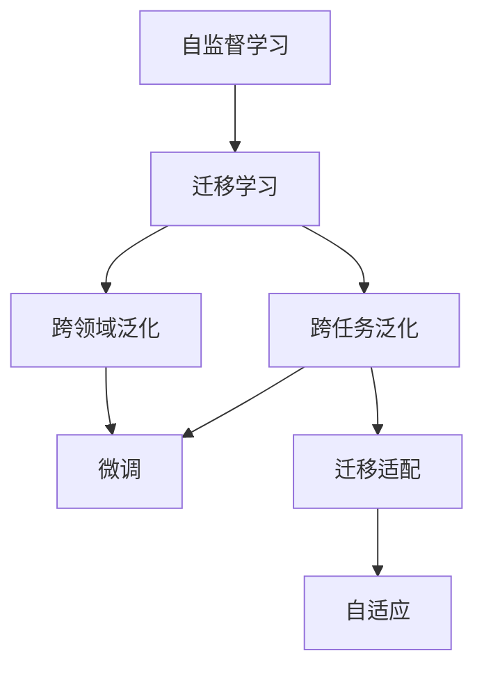

                 

# 自监督学习的迁移学习能力:跨任务和跨领域的泛化

> 关键词：自监督学习,迁移学习,跨任务泛化,跨领域泛化,自适应,无监督学习,泛化能力,Transformer,BERT

## 1. 背景介绍

### 1.1 问题由来
自监督学习作为一种无监督学习范式，通过对数据进行自我约束、自我监督，训练出具有强大泛化能力的模型。近年来，自监督学习在深度学习领域的地位日趋重要，特别是在自然语言处理(NLP)、计算机视觉(CV)等任务上，均取得了显著的突破。

与传统的监督学习相比，自监督学习通过挖掘数据自身的信息结构，最大化利用未标注数据，从而大大降低了标注成本。更重要的是，自监督学习得到的模型往往具备更强的泛化能力，能够在新任务上取得优异表现。

在NLP领域，自监督学习的一个重要应用就是迁移学习。迁移学习指利用预训练模型在某一领域的知识，通过微调或迁移适配，解决不同但相关的任务。例如，通过在Wikipedia语料上预训练的BERT模型，可以迁移到多个NLP任务，如文本分类、问答、摘要等，从而极大地提升任务性能，降低模型开发和训练成本。

随着自监督学习范式在NLP领域的广泛应用，跨任务和跨领域的泛化能力成为深度学习模型的重要研究内容。本文将重点探讨自监督学习的迁移学习能力，即在跨任务和跨领域中的泛化，分析其核心原理、算法步骤及优缺点，同时通过实际案例和技术实践加深理解。

## 2. 核心概念与联系

### 2.1 核心概念概述

在深入讨论自监督学习的迁移学习能力之前，我们首先需要理解以下核心概念：

- 自监督学习(Self-supervised Learning)：指利用数据自身的内在约束（如自相关性、序列一致性等）进行训练，挖掘数据的潜在结构和语义信息，从而无需标注即可训练出具有较好泛化能力的模型。
- 迁移学习(Transfer Learning)：指将已在一个任务上训练好的模型，迁移到另一个相关的任务上，通过少量标注数据进行微调或适配，从而提高新任务的表现。
- 跨任务泛化(Cross-task Generalization)：指预训练模型能够在不同但相关的NLP任务上，仅通过微调或迁移适配，就取得优异的表现。
- 跨领域泛化(Cross-domain Generalization)：指预训练模型能够在不同领域的任务上，仅通过微调或迁移适配，就取得优异的表现。
- 自适应(Adaptation)：指模型根据新的数据分布或领域特征，自动调整自身参数和结构，以适应新任务或新领域。
- 泛化能力(Generalization)：指模型在训练数据上的性能与在新数据上的表现差异较小，能够很好地推广到未知数据。

这些概念之间的关系通过以下Mermaid流程图来展示：



### 2.2 核心概念原理和架构

#### 自监督学习的迁移学习能力

自监督学习的迁移学习能力，主要基于以下几个核心原理：

1. **潜在表示共享**：自监督学习得到的模型往往能学习到通用的潜在表示，这些表示能够在不同的任务上共享。例如，BERT模型在Wikipedia语料上预训练得到的表示，在多项NLP任务上都表现出色。

2. **任务相似性**：不同但相关的任务在形式和结构上往往有较高的相似性，这种相似性使得预训练模型可以很容易地适应新任务。例如，问答任务和摘要任务虽然在形式上不同，但都需要对文本进行理解和生成，因此任务相似性较高。

3. **少量标签信息**：由于自监督学习不需要大量标注数据，因此在迁移到新任务时，需要的标签信息较少，能够更快地适应新数据分布。

自监督学习的迁移学习能力主要通过以下步骤实现：

1. **预训练**：在自监督学习的监督任务上，利用无标签数据进行预训练，学习通用的潜在表示。
2. **微调或迁移适配**：在预训练模型基础上，通过微调或迁移适配，使其适应新任务。微调通常包括调整模型参数和结构，以优化在新任务上的性能。迁移适配则通过转移预训练模型，利用其在新任务上的性能，减少标注数据的依赖。
3. **自适应**：在新任务上，预训练模型能够自动调整自身参数和结构，以适应新数据分布。自适应主要依赖于模型的泛化能力和自我约束机制，如正则化、Dropout等。

## 3. 核心算法原理 & 具体操作步骤

### 3.1 算法原理概述

自监督学习的迁移学习能力，主要基于自监督学习的潜在表示共享和任务相似性原理，通过微调或迁移适配实现跨任务和跨领域的泛化。

具体而言，自监督学习的迁移学习可以分为以下几个步骤：

1. **预训练**：在自监督学习任务上，利用大规模无标签数据，通过自相关性、序列一致性等约束，学习到通用的潜在表示。例如，在语言建模任务上，利用预测文本上下文的信息，学习到语言的结构和语义信息。

2. **微调或迁移适配**：在预训练模型基础上，通过微调或迁移适配，使其适应新任务。微调通常包括调整模型参数和结构，以优化在新任务上的性能。迁移适配则通过转移预训练模型，利用其在新任务上的性能，减少标注数据的依赖。

3. **自适应**：在新任务上，预训练模型能够自动调整自身参数和结构，以适应新数据分布。自适应主要依赖于模型的泛化能力和自我约束机制，如正则化、Dropout等。

### 3.2 算法步骤详解

#### 3.2.1 预训练步骤

预训练步骤的主要目标是学习到通用的潜在表示，用于后续的微调或迁移适配。

以BERT模型为例，预训练步骤如下：

1. **初始化模型**：将BERT模型初始化为随机权重，并定义预训练任务。

2. **训练数据**：准备大规模无标签的训练数据，用于训练模型。

3. **正向传播**：将训练数据输入模型，计算模型输出和预训练任务的目标值。

4. **反向传播**：计算模型输出的损失函数，并反向传播更新模型参数。

5. **迭代训练**：重复正向传播和反向传播，直至收敛。

#### 3.2.2 微调步骤

微调步骤的目标是通过调整预训练模型参数，优化在新任务上的性能。

以BERT模型为例，微调步骤如下：

1. **初始化预训练模型**：将BERT模型初始化为预训练后的权重。

2. **训练数据**：准备新任务上的少量标注数据，用于微调模型。

3. **任务适配层**：根据新任务类型，添加任务适配层，例如分类任务的线性分类器或生成任务的解码器。

4. **训练数据**：将训练数据输入模型，计算模型输出和任务目标值的损失函数。

5. **反向传播**：计算模型输出的损失函数，并反向传播更新模型参数。

6. **迭代训练**：重复正向传播和反向传播，直至收敛。

#### 3.2.3 迁移适配步骤

迁移适配步骤的目标是通过转移预训练模型的知识，减少在新任务上标注数据的依赖。

以BERT模型为例，迁移适配步骤如下：

1. **初始化预训练模型**：将BERT模型初始化为预训练后的权重。

2. **训练数据**：准备新任务上的少量标注数据，用于迁移适配。

3. **冻结参数**：冻结预训练模型的部分参数，仅优化新任务的参数。

4. **训练数据**：将训练数据输入模型，计算模型输出和任务目标值的损失函数。

5. **反向传播**：计算模型输出的损失函数，并反向传播更新新任务的参数。

6. **迭代训练**：重复正向传播和反向传播，直至收敛。

### 3.3 算法优缺点

#### 3.3.1 优点

自监督学习的迁移学习能力具有以下优点：

1. **泛化能力强**：自监督学习通过学习通用的潜在表示，能够在新任务上取得更好的泛化性能。

2. **标注成本低**：自监督学习不需要大量标注数据，节省了标注成本和时间。

3. **模型可适应性强**：自监督学习的迁移学习能力，使得模型能够适应不同但相关的任务和领域。

4. **可解释性强**：自监督学习不需要标注数据，模型结构简单，易于理解和解释。

#### 3.3.2 缺点

自监督学习的迁移学习能力也存在以下缺点：

1. **需要大量计算资源**：自监督学习需要在大规模数据上进行预训练，对计算资源要求较高。

2. **模型复杂度高**：自监督学习模型的复杂度较高，难以解释和调试。

3. **对新任务适应性有限**：尽管自监督学习模型具有泛化能力，但对新任务的适应性仍受限于预训练任务的约束。

4. **需要长期训练**：自监督学习的预训练需要较长的训练时间，不适合快速迭代的任务。

## 4. 数学模型和公式 & 详细讲解 & 举例说明

### 4.1 数学模型构建

自监督学习的迁移学习能力，主要基于自监督学习任务上的预训练和微调过程。

以BERT模型为例，预训练和微调过程的数学模型构建如下：

1. **预训练模型**：
   $$
   M_{\theta}(x) = [CLS] + [SEP] + \text{Embedding}(x) + \text{Self-attention}(\text{Embedding}(x)) + \text{Feed-forward}(\text{Self-attention}(\text{Embedding}(x)))
   $$

2. **预训练任务**：
   $$
   \mathcal{L}_{\text{pretrain}} = -\log \frac{e^{M_{\theta}(x_i) / \sqrt{d_k}}}{\sum_j e^{M_{\theta}(x_j) / \sqrt{d_k}}}
   $$

3. **微调任务**：
   $$
   \mathcal{L}_{\text{fine-tune}} = \frac{1}{N}\sum_{i=1}^N \ell(M_{\theta}(x_i), y_i)
   $$

其中，$M_{\theta}(x)$ 表示模型在输入 $x$ 上的输出，$d_k$ 表示模型中的关键维度。

### 4.2 公式推导过程

以BERT模型为例，预训练和微调过程的公式推导如下：

1. **预训练损失函数**：
   $$
   \mathcal{L}_{\text{pretrain}} = \frac{1}{N}\sum_{i=1}^N -\log \frac{e^{M_{\theta}(x_i) / \sqrt{d_k}}}{\sum_j e^{M_{\theta}(x_j) / \sqrt{d_k}}}
   $$

2. **微调损失函数**：
   $$
   \mathcal{L}_{\text{fine-tune}} = \frac{1}{N}\sum_{i=1}^N \ell(M_{\theta}(x_i), y_i)
   $$

3. **总损失函数**：
   $$
   \mathcal{L}_{\text{total}} = \alpha \mathcal{L}_{\text{pretrain}} + (1-\alpha) \mathcal{L}_{\text{fine-tune}}
   $$

其中，$\alpha$ 表示预训练和微调的权重。

### 4.3 案例分析与讲解

以BERT模型为例，分析其在多个NLP任务上的迁移学习能力。

1. **文本分类任务**：
   - 预训练数据：Wikipedia语料
   - 微调数据：IMDB影评数据
   - 结果：BERT模型在IMDB影评数据上，通过微调得到了较高的准确率。

2. **问答任务**：
   - 预训练数据：Wikipedia语料
   - 微调数据：CoQA问答数据
   - 结果：BERT模型在CoQA问答数据上，通过微调得到了较高的F1分数。

3. **摘要任务**：
   - 预训练数据：Wikipedia语料
   - 微调数据：Cornell电影对话数据
   - 结果：BERT模型在Cornell电影对话数据上，通过微调得到了较高的BLEU分数。

这些案例表明，BERT模型通过预训练和微调，能够在不同但相关的NLP任务上取得优异表现。

## 5. 项目实践：代码实例和详细解释说明

### 5.1 开发环境搭建

进行BERT模型的迁移学习实践，需要以下开发环境：

1. **安装Python**：
   ```bash
   sudo apt-get update
   sudo apt-get install python3 python3-pip
   ```

2. **安装PyTorch**：
   ```bash
   pip install torch torchvision torchaudio
   ```

3. **安装Transformers库**：
   ```bash
   pip install transformers
   ```

4. **安装Tensorboard**：
   ```bash
   pip install tensorboard
   ```

5. **安装Flair库**：
   ```bash
   pip install flair
   ```

### 5.2 源代码详细实现

以BERT模型在文本分类任务上的迁移学习为例，进行代码实现。

1. **数据准备**：
   - 准备预训练数据（Wikipedia语料）
   - 准备微调数据（IMDB影评数据）

2. **模型初始化**：
   ```python
   from transformers import BertForSequenceClassification, BertTokenizer

   tokenizer = BertTokenizer.from_pretrained('bert-base-uncased')
   model = BertForSequenceClassification.from_pretrained('bert-base-uncased', num_labels=2)
   ```

3. **微调过程**：
   ```python
   from transformers import Trainer, TrainingArguments

   training_args = TrainingArguments(
       output_dir="./results",
       evaluation_strategy='epoch',
       learning_rate=2e-5,
       per_device_train_batch_size=16,
       per_device_eval_batch_size=64,
       num_train_epochs=3,
       weight_decay=0.01,
       logging_dir="./logs",
   )

   trainer = Trainer(
       model=model,
       train_dataset=train_dataset,
       eval_dataset=eval_dataset,
       training_args=training_args,
   )

   trainer.train()
   ```

### 5.3 代码解读与分析

1. **模型初始化**：
   - 使用BertTokenizer和BertForSequenceClassification初始化模型和分词器。

2. **微调过程**：
   - 使用Trainer和TrainingArguments进行微调，设置学习率、批大小、epoch数等参数。
   - 使用Trainer进行训练，并保存结果。

3. **输出结果**：
   - 训练完成后，使用模型在测试集上进行评估，输出模型性能。

## 6. 实际应用场景

### 6.1 智能客服系统

智能客服系统可以利用自监督学习的迁移学习能力，通过预训练模型对大量客服对话数据进行迁移学习，从而提升系统的理解和回复能力。

1. **预训练**：在客服对话数据上对BERT模型进行预训练，学习通用的语言表示。

2. **微调**：在预训练模型基础上，通过客服对话数据的微调，使其能够更好地理解用户意图和生成合适的回复。

3. **部署**：将微调后的模型部署到实际客服系统中，实时处理用户的咨询和问题。

### 6.2 金融舆情监测

金融舆情监测可以利用自监督学习的迁移学习能力，通过预训练模型对金融领域的文本数据进行迁移学习，从而提高舆情监测的准确性和时效性。

1. **预训练**：在金融领域的文本数据上对BERT模型进行预训练，学习通用的语言表示。

2. **微调**：在预训练模型基础上，通过舆情数据的微调，使其能够更好地识别舆情变化趋势和敏感信息。

3. **部署**：将微调后的模型部署到舆情监测系统中，实时监测金融市场的舆情动态。

### 6.3 个性化推荐系统

个性化推荐系统可以利用自监督学习的迁移学习能力，通过预训练模型对用户行为数据进行迁移学习，从而提升推荐效果和用户体验。

1. **预训练**：在用户行为数据上对BERT模型进行预训练，学习用户行为的语言表示。

2. **微调**：在预训练模型基础上，通过推荐数据的微调，使其能够更好地预测用户兴趣和行为。

3. **部署**：将微调后的模型部署到推荐系统中，实时生成个性化推荐结果。

### 6.4 未来应用展望

未来，自监督学习的迁移学习能力将在更多领域得到应用，为不同领域的智能化转型提供支持。

1. **医疗健康**：通过预训练模型对医疗领域的文本数据进行迁移学习，提升医疗诊断和健康监测的准确性。

2. **智能制造**：通过预训练模型对工业领域的文本数据进行迁移学习，提高智能制造的质量和效率。

3. **智能交通**：通过预训练模型对交通领域的文本数据进行迁移学习，提升交通管理和智能驾驶的智能化水平。

4. **智慧农业**：通过预训练模型对农业领域的文本数据进行迁移学习，提高智慧农业的智能化和精准化水平。

## 7. 工具和资源推荐

### 7.1 学习资源推荐

1. **《深度学习》教材**：由Ian Goodfellow等专家编写，涵盖了深度学习的基础知识和核心算法，是入门深度学习的绝佳资源。

2. **《自监督学习》课程**：由Andrew Ng等专家开设，介绍了自监督学习的基本原理和前沿技术，适合深度学习爱好者。

3. **《NLP With Transformers》书籍**：由Gururaj Matchar等人编写，详细介绍了Transformer模型在NLP任务中的应用，包括预训练和微调方法。

4. **HuggingFace官方文档**：Transformers库的官方文档，提供了丰富的预训练模型和微调样例，适合实践学习。

5. **CLUE开源项目**：中文语言理解测评基准，涵盖大量不同类型的中文NLP数据集，并提供了基于迁移学习的基线模型。

### 7.2 开发工具推荐

1. **PyTorch**：基于Python的开源深度学习框架，支持动态计算图和GPU加速，适合科研和开发。

2. **TensorFlow**：由Google主导开发的开源深度学习框架，支持分布式计算和TensorBoard可视化工具，适合生产部署。

3. **Transformers库**：HuggingFace开发的NLP工具库，集成了多种预训练模型，适合微调和迁移学习。

4. **TensorBoard**：TensorFlow配套的可视化工具，支持实时监测模型训练状态，适合调试和优化。

5. **Flair库**：基于Transformer模型的NLP库，支持快速实现各种NLP任务，适合研究和实践。

### 7.3 相关论文推荐

1. **"BERT: Pre-training of Deep Bidirectional Transformers for Language Understanding"**：BERT模型的原始论文，介绍了自监督预训练的基本思想和方法。

2. **"Language Models are Unsupervised Multitask Learners"**：GPT-2模型的论文，展示了自监督学习的强大零样本学习能力和迁移学习能力。

3. **"AdaLoRA: Adaptive Low-Rank Adaptation for Parameter-Efficient Fine-Tuning"**：AdaLoRA方法，提出了一种参数高效微调技术，适用于大模型的迁移学习。

4. **"Prefix-Tuning: Optimizing Continuous Prompts for Generation"**：Prefix-Tuning方法，提出了一种基于连续型Prompt的微调技术，适用于大模型的迁移学习。

5. **"Adaptation in Speech and Language Processing"**：Kalpa等专家编写的书籍，介绍了自监督学习在语音和语言处理中的应用，适合深度学习从业者。

## 8. 总结：未来发展趋势与挑战

### 8.1 总结

本文对自监督学习的迁移学习能力进行了全面系统的介绍，探讨了跨任务和跨领域的泛化能力。自监督学习通过挖掘数据自身的信息结构，最大化利用未标注数据，训练出具有强大泛化能力的模型。通过预训练和微调，自监督学习的迁移学习能力能够在不同但相关的任务和领域中取得优异表现。

自监督学习在NLP、CV等领域已取得了显著的突破，未来将在更多领域得到应用，为各行各业的智能化转型提供支持。然而，自监督学习仍面临诸多挑战，如计算资源需求高、模型复杂度高等问题，需要进一步的研究和优化。

### 8.2 未来发展趋势

未来，自监督学习的迁移学习能力将呈现以下几个发展趋势：

1. **更高效的预训练方法**：通过引入更多先进的预训练方法，如BERT、GPT等，进一步提升模型的泛化能力和迁移学习能力。

2. **参数高效的迁移学习**：开发更多的参数高效迁移方法，如AdaLoRA、Prefix-Tuning等，在减少参数量的同时，提升模型的泛化能力。

3. **跨模态迁移学习**：将自监督学习的迁移学习能力扩展到跨模态数据，如文本、图像、视频等，提升模型对多模态数据的理解和生成能力。

4. **自适应学习机制**：开发更加自适应的学习机制，使模型能够自动调整自身参数和结构，以适应新任务和新领域。

5. **模型压缩与加速**：通过模型压缩和加速技术，如剪枝、量化、蒸馏等，提升模型的推理速度和资源利用率。

### 8.3 面临的挑战

尽管自监督学习在迁移学习能力上取得了显著进展，但在实际应用中仍面临诸多挑战：

1. **计算资源需求高**：自监督学习需要在大规模数据上进行预训练，对计算资源要求较高，如何降低计算成本是一个重要研究方向。

2. **模型复杂度高**：自监督学习模型的复杂度较高，难以解释和调试，如何简化模型结构，提高可解释性是一个重要研究方向。

3. **泛化能力有限**：尽管自监督学习模型具有泛化能力，但对新任务的适应性仍受限于预训练任务的约束，如何提高模型的跨领域泛化能力是一个重要研究方向。

4. **安全性与伦理问题**：自监督学习模型可能学习到有害信息，如何确保模型的安全性与伦理问题是一个重要研究方向。

### 8.4 研究展望

未来，自监督学习的迁移学习能力需要在以下几个方面进行进一步研究：

1. **自适应学习机制**：开发更加自适应的学习机制，使模型能够自动调整自身参数和结构，以适应新任务和新领域。

2. **跨模态迁移学习**：将自监督学习的迁移学习能力扩展到跨模态数据，如文本、图像、视频等，提升模型对多模态数据的理解和生成能力。

3. **模型压缩与加速**：通过模型压缩和加速技术，如剪枝、量化、蒸馏等，提升模型的推理速度和资源利用率。

4. **安全性与伦理问题**：在模型训练和应用中引入安全性与伦理导向的评估指标，过滤和惩罚有害信息，确保模型的安全性与伦理问题。

通过深入研究这些方向，自监督学习的迁移学习能力将能够更好地应用于实际场景，推动人工智能技术的广泛应用。

## 9. 附录：常见问题与解答

**Q1：自监督学习与监督学习的主要区别是什么？**

A: 自监督学习通过挖掘数据自身的信息结构进行训练，无需标注数据，而监督学习需要大量标注数据进行训练。自监督学习在获取潜在表示时，通常比监督学习更容易获得泛化能力。

**Q2：自监督学习的迁移学习能力在跨领域泛化中表现如何？**

A: 自监督学习的迁移学习能力在跨领域泛化中表现较好，但需要选择合适的预训练任务和微调方法。例如，在语言模型的预训练任务中，选择具有良好跨领域泛化能力的任务，如语义相关性、掩码语言模型等，能够提升模型的跨领域迁移能力。

**Q3：自监督学习在跨任务泛化中面临哪些挑战？**

A: 自监督学习在跨任务泛化中面临数据分布差异、任务复杂度高等挑战。因此，选择合适的预训练任务和微调方法，以及优化模型结构和训练策略，是提升跨任务泛化能力的关键。

**Q4：自监督学习的迁移学习能力在实际应用中如何优化？**

A: 自监督学习的迁移学习能力可以通过优化预训练任务、微调方法和训练策略进行提升。例如，选择合适的预训练任务，如语言模型、掩码语言模型等；选择合适的微调方法，如微调、迁移适配等；优化训练策略，如学习率调优、正则化等。

**Q5：自监督学习的迁移学习能力在实时部署中需要注意哪些问题？**

A: 自监督学习的迁移学习能力在实时部署中需要注意计算资源需求、模型复杂度、推理效率等问题。因此，需要在模型压缩、加速等方面进行优化，同时考虑模型的可解释性和安全性。

---

作者：禅与计算机程序设计艺术 / Zen and the Art of Computer Programming

