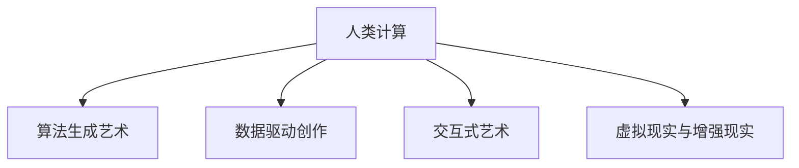

                 

# 艺术与科技的融合：人类计算激发创意火花

## 1. 背景介绍

### 1.1 问题由来

在现代社会，艺术和科技似乎是两个截然不同的领域。艺术更多地依赖于创作者的情感、直觉和想象，而科技则依赖于逻辑、计算和工程。然而，随着计算机科学和人工智能(AI)技术的不断发展，越来越多的艺术创作开始与科技融合，形成了一种全新的创作方式——人类计算（Human-Computer Interaction, HCI）。

人类计算并不是一种全新的概念，它源自于计算机科学家道格拉斯·恩格尔巴特（Douglas Engelbart）在上世纪60年代提出的“增强智能（Augmented Intelligence）”，即通过技术手段增强人类的思考和创造能力。如今，这一概念已经深入到艺术创作的各个层面，无论是音乐、绘画、设计还是写作，都可以通过计算机技术实现更加高效、灵活和创新的表达。

### 1.2 问题核心关键点

人类计算的核心在于将计算与人类智慧相结合，通过算法、数据、计算等技术手段，辅助艺术家进行创作。这种结合不仅体现在工具和媒介的改变上，更体现在创作方式的革新上。艺术家可以借助计算技术实现前所未有的创意火花，创造出既有技术含量又充满艺术感的新作品。

以下是人类计算中的几个核心关键点：

- **算法生成艺术**：利用随机算法、优化算法等生成艺术作品，如程序艺术、算法音乐等。
- **数据驱动创作**：通过大数据分析和机器学习，生成灵感和创意，如数据可视化、文本生成等。
- **交互式艺术**：通过交互界面，让观众参与到创作过程中，实现实时互动的体验。
- **虚拟现实(VR)与增强现实(AR)**：借助VR和AR技术，实现沉浸式、互动式的艺术体验。

这些关键点共同构成了人类计算在艺术创作中的基础，使得艺术与科技的界限愈发模糊，形成了一种全新的创作生态。

## 2. 核心概念与联系

### 2.1 核心概念概述

为更好地理解人类计算在艺术创作中的应用，本节将介绍几个密切相关的核心概念：

- **人类计算（Human-Computer Interaction, HCI）**：指通过计算机技术增强人类感知、认知和表达的过程。
- **算法生成艺术（Algorithmic Art）**：指利用计算机算法自动生成的艺术作品，如算法音乐、算法绘画等。
- **数据驱动创作（Data-Driven Art）**：指通过数据分析和机器学习生成艺术灵感和创意，如数据可视化、文本生成等。
- **交互式艺术（Interactive Art）**：指观众参与创作过程，通过交互界面实时影响艺术作品。
- **虚拟现实与增强现实（Virtual Reality and Augmented Reality, VR/AR）**：指借助VR和AR技术，实现沉浸式、互动式的艺术体验。

这些概念之间的逻辑关系可以通过以下Mermaid流程图来展示：



这个流程图展示了这个体系的几个核心概念及其之间的关联：

1. 人类计算是整个体系的基础，涵盖了算法生成、数据驱动、交互式艺术和VR/AR等技术手段。
2. 算法生成艺术和数据驱动创作都是基于人类计算的子领域，通过计算机算法和大数据驱动，生成新的艺术作品。
3. 交互式艺术和VR/AR是提升艺术作品互动性和沉浸感的技术，通过人机交互界面实现更加丰富和生动的艺术体验。

这些概念共同构成了人类计算在艺术创作中的完整框架，使得艺术创作与技术手段相辅相成，形成了一种新的创作方式。

## 3. 核心算法原理 & 具体操作步骤
### 3.1 算法原理概述

人类计算中的算法生成艺术和数据驱动创作，本质上是将算法和数据应用到艺术创作中，生成新的艺术作品。其核心思想是：通过数学模型和算法，将数据转化为具有艺术价值的表现形式。

具体而言，算法生成艺术通常涉及以下几个步骤：

1. 定义算法规则：选择合适的算法模型，如遗传算法、马尔科夫链、粒子群优化等。
2. 设置参数和约束：确定算法的基本参数和运行约束条件，如迭代次数、目标函数等。
3. 运行算法：通过计算机程序执行算法，生成艺术作品。
4. 后处理和优化：对生成的作品进行后期处理，提升艺术效果和表达力。

数据驱动创作则更加依赖于机器学习和数据分析技术，其核心思想是：通过分析大量数据，挖掘其中的模式和规律，生成具有艺术启发性的创意。

具体步骤如下：

1. 数据收集和预处理：收集和处理相关的数据集，如文本、图像、音频等。
2. 特征提取和选择：通过文本挖掘、图像处理、音频分析等技术，提取和选择关键特征。
3. 训练模型：构建机器学习模型，如神经网络、支持向量机、聚类算法等，进行训练。
4. 生成作品：根据训练好的模型，生成新的艺术作品。

### 3.2 算法步骤详解

以下是算法生成艺术和数据驱动创作的具体步骤详解：

**算法生成艺术**

1. **定义算法规则**：选择适当的算法模型，如遗传算法、马尔科夫链、粒子群优化等。
2. **设置参数和约束**：确定算法的基本参数和运行约束条件，如迭代次数、目标函数等。
3. **运行算法**：通过计算机程序执行算法，生成艺术作品。
4. **后处理和优化**：对生成的作品进行后期处理，提升艺术效果和表达力。

**数据驱动创作**

1. **数据收集和预处理**：收集和处理相关的数据集，如文本、图像、音频等。
2. **特征提取和选择**：通过文本挖掘、图像处理、音频分析等技术，提取和选择关键特征。
3. **训练模型**：构建机器学习模型，如神经网络、支持向量机、聚类算法等，进行训练。
4. **生成作品**：根据训练好的模型，生成新的艺术作品。

### 3.3 算法优缺点

算法生成艺术和数据驱动创作具有以下优点：

- **创新性高**：算法和数据的使用能够打破传统艺术创作的固有模式，产生新颖独特的艺术作品。
- **效率高**：计算机程序的执行速度快，能够快速生成大量作品，加速艺术创作过程。
- **可重复性强**：算法和数据的模型训练过程具有可重复性，可以不断调整优化，提高作品质量。

同时，这些方法也存在一些缺点：

- **技术门槛高**：需要具备计算机编程和数学建模能力，普通艺术家可能难以掌握。
- **结果不确定**：算法生成的作品结果具有随机性，需要多次尝试才能找到满意的结果。
- **需要高质量数据**：数据驱动创作依赖于高质量的数据集，数据质量和多样性对作品影响较大。

尽管存在这些缺点，但算法生成艺术和数据驱动创作在艺术创作中仍然具有重要的应用价值，为艺术家提供了新的创作思路和工具。

### 3.4 算法应用领域

算法生成艺术和数据驱动创作在多个艺术领域中得到了广泛应用，以下是几个典型案例：

- **音乐**：利用算法生成音乐，如MIDI艺术、程序音乐等。
- **绘画**：通过算法生成绘画，如算法素描、抽象画等。
- **设计**：运用算法生成平面设计，如标志设计、图形设计等。
- **文本**：通过算法生成文本，如程序诗歌、算法小说等。
- **交互式艺术**：通过算法生成交互式艺术作品，如动态雕塑、交互式装置等。

这些案例展示了算法生成艺术和数据驱动创作在艺术创作中的广泛应用，为艺术作品带来了新的生命力。

## 4. 数学模型和公式 & 详细讲解 & 举例说明

### 4.1 数学模型构建

本节将使用数学语言对算法生成艺术和数据驱动创作的数学模型进行更加严格的刻画。

假设我们有一个简单的生成艺术算法，其输入为参数向量 $\theta$，输出为艺术作品 $A$。算法的一般形式可以表示为：

$$
A = f(\theta)
$$

其中，$f$ 为算法模型，$\theta$ 为算法参数。在数据驱动创作中，输入数据 $D$ 与输出作品 $A$ 的关系可以表示为：

$$
A = g(D; \phi)
$$

其中，$g$ 为机器学习模型，$\phi$ 为模型参数。

### 4.2 公式推导过程

以下是一些常见的算法生成艺术和数据驱动创作的数学模型及推导过程：

**算法生成艺术**

以马尔科夫链算法为例，假设我们的算法目标是在一个有限状态空间 $S=\{s_1, s_2, \ldots, s_n\}$ 内生成一个长度为 $T$ 的序列 $A=(a_1, a_2, \ldots, a_T)$，其中 $a_t \in S$。马尔科夫链算法的基本思想是：根据当前状态 $s_t$ 和转移概率 $P_{s_t}(s_{t+1})$，生成下一个状态 $s_{t+1}$。具体推导过程如下：

1. 定义转移矩阵 $P = (P_{s_i}(s_j))_{i,j \in S}$，表示从状态 $s_i$ 转移到状态 $s_j$ 的概率。
2. 初始化状态 $s_1$，即 $s_t = s_1$。
3. 生成序列：
   $$
   s_{t+1} \sim P_{s_t}(\cdot)
   $$
   重复步骤2和3，生成长度为 $T$ 的序列 $A$。

**数据驱动创作**

以神经网络模型为例，假设我们有一个包含 $M$ 个特征的数据集 $D = (d_1, d_2, \ldots, d_M)$，每个特征 $d_m$ 可以表示为一个向量 $d_{m \times k}$。我们的目标是训练一个神经网络模型 $g$，使其能够从数据集中生成新的艺术作品 $A$。神经网络模型的基本结构可以表示为：

1. 输入层：将数据集 $D$ 输入神经网络。
2. 隐藏层：通过多层非线性变换，提取数据中的特征。
3. 输出层：将特征映射到艺术作品空间，生成 $A$。

具体推导过程如下：

1. 定义神经网络模型 $g: \mathbb{R}^M \rightarrow \mathbb{R}^N$，其中 $N$ 为输出空间维度。
2. 定义损失函数 $L(A, g(D))$，衡量模型输出 $g(D)$ 与目标输出 $A$ 的差异。
3. 通过反向传播算法，更新模型参数 $\phi$，最小化损失函数 $L$。

### 4.3 案例分析与讲解

**案例1：算法生成音乐**

算法生成音乐可以通过编程实现各种复杂的音乐生成算法，如Markov Chain、Genetic Algorithm等。以下是一个简单的Markov Chain算法示例：

```python
import random
import numpy as np

# 定义转移矩阵
P = np.array([[0.5, 0.2, 0.3],
              [0.3, 0.5, 0.2],
              [0.2, 0.3, 0.5]])

# 初始化状态
state = 0

# 生成音乐序列
music = []
for t in range(100):
    next_state = np.random.choice(np.arange(3), p=P[state])
    music.append(next_state)
    state = next_state

# 输出音乐序列
print(music)
```

该算法通过定义一个简单的三状态转移矩阵 $P$，初始状态为 $0$，生成了一个长度为 $100$ 的音乐序列。

**案例2：数据驱动创作**

数据驱动创作可以通过训练神经网络模型来实现。以下是一个简单的文本生成模型示例：

```python
import torch
import torch.nn as nn
import torch.optim as optim

# 定义神经网络模型
class TextGenerator(nn.Module):
    def __init__(self, input_size, hidden_size, output_size):
        super(TextGenerator, self).__init__()
        self.hidden_size = hidden_size
        self.rnn = nn.LSTM(input_size, hidden_size)
        self.fc = nn.Linear(hidden_size, output_size)
        self.softmax = nn.Softmax(dim=1)

    def forward(self, x, hidden):
        output, hidden = self.rnn(x, hidden)
        output = self.fc(output)
        output = self.softmax(output)
        return output, hidden

# 训练模型
input_size = 10
hidden_size = 128
output_size = 10
n_epochs = 10
lr = 0.01

model = TextGenerator(input_size, hidden_size, output_size)
criterion = nn.CrossEntropyLoss()
optimizer = optim.Adam(model.parameters(), lr=lr)

for epoch in range(n_epochs):
    for i in range(len(train_data)):
        x = train_data[i]
        x = torch.from_numpy(x).long()
        output, hidden = model(x, None)
        loss = criterion(output, target[i])
        optimizer.zero_grad()
        loss.backward()
        optimizer.step()

# 生成文本
input = torch.tensor([1], dtype=torch.long)
hidden = None
for i in range(10):
    output, hidden = model(input, hidden)
    next_word_id = torch.multinomial(output, 1)[0]
    input = next_word_id
    print(next_word_id.item(), end=' ')
```

该模型通过训练一个简单的LSTM神经网络，实现了文本生成功能。通过输入一个起始字符，模型可以生成一段连贯的文本。

## 5. 项目实践：代码实例和详细解释说明
### 5.1 开发环境搭建

在进行项目实践前，我们需要准备好开发环境。以下是使用Python进行PyTorch开发的环境配置流程：

1. 安装Anaconda：从官网下载并安装Anaconda，用于创建独立的Python环境。

2. 创建并激活虚拟环境：
```bash
conda create -n pytorch-env python=3.8 
conda activate pytorch-env
```

3. 安装PyTorch：根据CUDA版本，从官网获取对应的安装命令。例如：
```bash
conda install pytorch torchvision torchaudio cudatoolkit=11.1 -c pytorch -c conda-forge
```

4. 安装Transformers库：
```bash
pip install transformers
```

5. 安装各类工具包：
```bash
pip install numpy pandas scikit-learn matplotlib tqdm jupyter notebook ipython
```

完成上述步骤后，即可在`pytorch-env`环境中开始项目实践。

### 5.2 源代码详细实现

这里我们以算法生成音乐为例，给出使用PyTorch实现Markov Chain算法的代码示例。

首先，定义Markov Chain算法的类：

```python
import random
import numpy as np

class MarkovChain:
    def __init__(self, states, transitions):
        self.states = states
        self.transitions = transitions

    def generate_sequence(self, length):
        sequence = []
        state = np.random.choice(self.states)
        for _ in range(length):
            next_state = np.random.choice(self.states, p=self.transitions[state])
            sequence.append(next_state)
            state = next_state
        return sequence
```

然后，定义一些常见的音乐生成算法：

```python
# 定义转移矩阵
P = np.array([[0.5, 0.2, 0.3],
              [0.3, 0.5, 0.2],
              [0.2, 0.3, 0.5]])

# 初始化状态
state = 0

# 生成音乐序列
music = []
for t in range(100):
    next_state = np.random.choice(np.arange(3), p=P[state])
    music.append(next_state)
    state = next_state

# 输出音乐序列
print(music)
```

这段代码通过定义一个简单的三状态转移矩阵 $P$，初始状态为 $0$，生成了一个长度为 $100$ 的音乐序列。

### 5.3 代码解读与分析

让我们再详细解读一下关键代码的实现细节：

**MarkovChain类**：
- `__init__`方法：初始化状态和转移矩阵。
- `generate_sequence`方法：根据转移矩阵生成音乐序列。

**MarkovChain算法**：
- 定义转移矩阵 $P$，初始状态为 $0$。
- 使用随机函数生成音乐序列。

可以看到，通过简单的代码编写，我们实现了基于Markov Chain算法的音乐生成。这展示了人类计算在艺术创作中的强大潜力。

## 6. 实际应用场景

### 6.1 音乐创作

算法生成音乐可以应用于音乐创作、作曲、编曲等多个领域。通过算法生成音乐，作曲家和音乐制作人可以探索新的创作思路，生成独特的音乐作品。

在实践中，可以结合音乐理论知识，设计复杂的算法规则，生成具有一定音乐风格的曲子。例如，利用遗传算法生成复杂的和声结构，利用马尔科夫链生成动态节奏变化等。这些生成的音乐作品，可以作为作曲的灵感来源，也可以直接用于音乐制作，形成一种新的音乐风格。

### 6.2 绘画艺术

算法生成绘画可以应用于绘画创作、数字艺术、动画制作等多个领域。通过算法生成绘画，艺术家可以探索新的绘画风格，生成独特的艺术作品。

在实践中，可以结合图像处理和机器学习技术，设计复杂的算法规则，生成具有独特风格的绘画作品。例如，利用卷积神经网络生成抽象画，利用生成对抗网络（GAN）生成自然风景画等。这些生成的绘画作品，可以作为创作的灵感来源，也可以直接用于数字艺术和动画制作，形成一种新的艺术风格。

### 6.3 文本创作

算法生成文本可以应用于小说创作、剧本编写、诗歌生成等多个领域。通过算法生成文本，作家和编剧可以探索新的创作思路，生成独特的文学作品。

在实践中，可以结合自然语言处理和机器学习技术，设计复杂的算法规则，生成具有一定文学风格的文本。例如，利用RNN生成散文，利用GAN生成诗歌等。这些生成的文本作品，可以作为创作的灵感来源，也可以直接用于小说和剧本创作，形成一种新的文学风格。

## 7. 工具和资源推荐
### 7.1 学习资源推荐

为了帮助开发者系统掌握人类计算在艺术创作中的理论和实践知识，这里推荐一些优质的学习资源：

1. **《算法艺术》系列书籍**：介绍各种算法生成艺术的经典案例，涵盖音乐、绘画、文本等多个领域。
2. **Coursera《数据科学与艺术》课程**：斯坦福大学开设的课程，介绍数据科学在艺术创作中的应用。
3. **Kaggle《算法艺术》竞赛**：每年举办多次算法艺术竞赛，提供丰富的数据集和算法工具。
4. **Google Arts & Culture**：Google与各大博物馆合作，提供丰富的艺术作品和艺术创作工具。
5. **OpenAI DALL·E**：利用自然语言描述生成图像，展示人类计算在艺术创作中的无限可能。

通过对这些资源的学习实践，相信你一定能够快速掌握人类计算在艺术创作中的精髓，并用于解决实际的创作问题。

### 7.2 开发工具推荐

高效的开发离不开优秀的工具支持。以下是几款用于人类计算项目开发的常用工具：

1. **Python**：灵活易用的编程语言，适用于各种类型的艺术创作项目。
2. **PyTorch**：强大的深度学习框架，适用于算法生成艺术和数据驱动创作项目。
3. **TensorFlow**：灵活的深度学习框架，适用于各种类型的艺术创作项目。
4. **Blender**：强大的3D建模软件，适用于动画制作和虚拟现实项目。
5. **Procreate**：专业的绘画应用，适用于数字绘画项目。
6. **Adobe Photoshop**：专业的图像处理软件，适用于绘画和设计项目。

合理利用这些工具，可以显著提升人类计算项目开发效率，加快创新迭代的步伐。

### 7.3 相关论文推荐

人类计算和算法生成艺术的发展源于学界的持续研究。以下是几篇奠基性的相关论文，推荐阅读：

1. **《算法艺术与计算机》**：介绍各种算法生成艺术的经典案例和技术。
2. **《数据科学与艺术》**：讨论数据科学在艺术创作中的应用。
3. **《生成对抗网络》**：介绍生成对抗网络在图像生成中的应用。
4. **《交互式音乐系统》**：介绍交互式音乐系统的实现和应用。
5. **《文本生成算法》**：讨论各种文本生成算法的原理和实现。

这些论文代表了大规模语言模型微调技术的发展脉络。通过学习这些前沿成果，可以帮助研究者把握学科前进方向，激发更多的创新灵感。

## 8. 总结：未来发展趋势与挑战

### 8.1 总结

本文对人类计算在艺术创作中的应用进行了全面系统的介绍。首先阐述了人类计算在艺术创作中的研究背景和意义，明确了算法生成艺术和数据驱动创作的重要价值。其次，从原理到实践，详细讲解了算法生成艺术和数据驱动创作的数学模型和关键步骤，给出了具体代码实例。同时，本文还广泛探讨了人类计算在音乐、绘画、文本等多个艺术领域的应用前景，展示了人类计算的巨大潜力。

通过本文的系统梳理，可以看到，人类计算在艺术创作中的应用正逐步成为主流，为艺术家提供了新的创作工具和思路。伴随算法的不断演进和数据的不断丰富，人类计算将进一步拓展艺术创作的可能性，为艺术创作带来新的活力。

### 8.2 未来发展趋势

展望未来，人类计算在艺术创作中的发展将呈现以下几个趋势：

1. **算法复杂化**：随着技术的发展，算法的复杂度将不断提高，生成艺术作品的质量和多样性也将不断提升。
2. **数据多样化**：数据的多样性将为生成艺术提供更多的创作素材，使作品更加丰富和多样化。
3. **人机交互**：人机交互技术的发展，将使生成艺术更加互动和沉浸，提升观众的参与感和体验感。
4. **多模态融合**：结合视觉、听觉、触觉等多种模态的信息，生成更加丰富和全面的艺术作品。
5. **跨领域应用**：人类计算技术将应用于更多领域，如城市规划、环境保护、社会治理等，为这些领域带来新的创新。

以上趋势凸显了人类计算在艺术创作中的广阔前景，为艺术创作带来了新的机遇和挑战。

### 8.3 面临的挑战

尽管人类计算在艺术创作中已经取得了显著的成就，但在迈向更加智能化、普适化应用的过程中，仍面临一些挑战：

1. **技术门槛高**：算法和数据驱动创作需要较高的技术门槛，普通艺术家可能难以掌握。
2. **结果不确定**：算法生成的作品结果具有随机性，需要多次尝试才能找到满意的结果。
3. **数据质量和多样性不足**：高质量、多样化的数据是生成艺术的基础，数据不足将限制作品的质量。
4. **交互界面复杂**：交互式艺术需要设计复杂的界面，用户体验和易用性仍需不断优化。
5. **伦理和法律问题**：生成的艺术作品可能涉及版权、隐私等法律和伦理问题，需要规范和监管。

这些挑战需要学术界和工业界共同努力，才能将人类计算技术推向更高的应用水平。

### 8.4 未来突破

面对人类计算在艺术创作中所面临的挑战，未来的研究需要在以下几个方面寻求新的突破：

1. **算法优化**：开发更加高效、易用的算法模型，降低技术门槛。
2. **数据增强**：利用数据增强技术，提升数据的多样性和质量。
3. **交互设计**：设计简洁、易用的交互界面，提升用户体验。
4. **法律和伦理规范**：制定相关法律和伦理规范，确保技术应用的合法性和道德性。
5. **跨领域应用**：将人类计算技术应用于更多领域，推动跨学科创新。

这些研究方向的探索，必将引领人类计算在艺术创作中迈向更高的台阶，为艺术创作带来新的创意和灵感。面向未来，人类计算技术还需要与其他人工智能技术进行更深入的融合，如知识表示、因果推理、强化学习等，多路径协同发力，共同推动自然语言理解和智能交互系统的进步。只有勇于创新、敢于突破，才能不断拓展人类计算的边界，让艺术创作更加丰富和多样化。

## 9. 附录：常见问题与解答

**Q1：什么是人类计算（Human-Computer Interaction, HCI）？**

A: 人类计算（HCI）是指通过计算机技术增强人类感知、认知和表达的过程。其核心在于将计算机算法和数据应用于艺术创作中，生成具有创意性和表现力的艺术作品。

**Q2：算法生成艺术（Algorithmic Art）和数据驱动创作（Data-Driven Art）的区别是什么？**

A: 算法生成艺术和数据驱动创作都是将计算技术应用于艺术创作中，但它们的实现方式和应用场景有所不同。

- **算法生成艺术**：通过定义算法规则和参数，利用计算机自动生成艺术作品。其核心在于算法设计和实现，生成的作品具有高度的随机性和不确定性。
- **数据驱动创作**：通过分析大量数据，挖掘其中的模式和规律，生成具有艺术启发性的创意。其核心在于数据分析和机器学习，生成的作品更加稳定和可控。

**Q3：如何提升算法生成艺术的创新性？**

A: 提升算法生成艺术的创新性，可以从以下几个方面入手：
1. 设计复杂的算法规则，引入更多随机性和不确定性。
2. 结合艺术理论和算法技术，设计独特的算法模型。
3. 探索新的数据源和数据类型，提升数据的多样性和丰富性。

**Q4：如何设计高效的算法生成艺术？**

A: 设计高效的算法生成艺术，可以从以下几个方面入手：
1. 选择高效的算法模型，如遗传算法、马尔科夫链、神经网络等。
2. 优化算法参数和运行环境，如设置合适的学习率、调整硬件设备等。
3. 引入数据增强技术，提升算法的鲁棒性和多样性。

**Q5：数据驱动创作如何选择合适的模型和特征？**

A: 选择合适的模型和特征是数据驱动创作的关键。可以从以下几个方面入手：
1. 根据数据类型选择合适的模型，如文本数据可以选择RNN或Transformer，图像数据可以选择CNN等。
2. 提取和选择关键特征，如文本中的关键词、情感标签，图像中的颜色、纹理等。
3. 进行模型训练和验证，选择表现最好的模型和特征组合。

这些问题的解答展示了人类计算在艺术创作中的各种应用和挑战，帮助读者更好地理解人类计算技术的核心思想和实现方法。

---

作者：禅与计算机程序设计艺术 / Zen and the Art of Computer Programming

