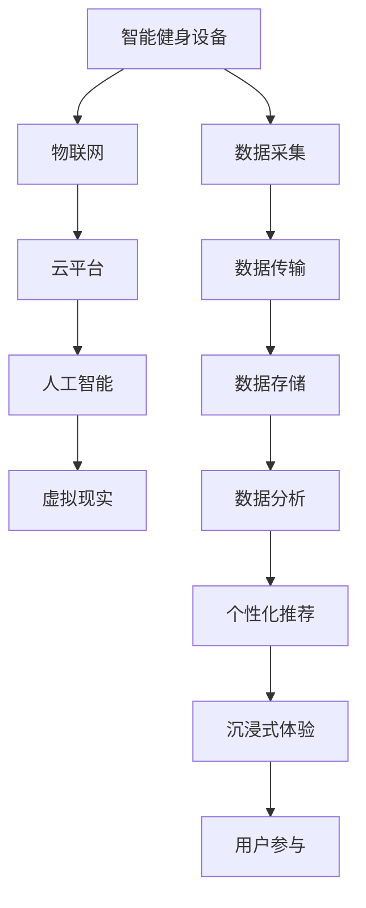

                 

## 1. 背景介绍

### 1.1 问题由来

在数字化时代，全球健康生活方式的推广面临新的挑战和机遇。传统基于线下的健身方式受地域、时间和环境等因素限制，难以达到全民覆盖和实时参与。而随着智能设备和互联网技术的快速发展，数字化健身已成为一种新的趋势，在提高参与度和持久性方面显示出巨大的潜力。

然而，数字化健身也存在一些问题，如设备兼容性、数据安全、用户隐私、个性化推荐等。如何在保证技术可扩展性的同时，最大化健身效果，提升用户满意度，已成为当前数字化健身领域需要解决的关键问题。

### 1.2 问题核心关键点

数字化健身的核心在于将传统的物理健身方式转化为数字化的虚拟体验，通过智能设备和网络平台，实现个性化、实时性和交互式的健身效果。为此，本文聚焦于以下几个关键问题：

- 如何设计高效、安全的数字化健身系统，确保数据隐私和用户安全。
- 如何通过智能算法，实现个性化健身计划和智能推荐，提高用户粘性。
- 如何利用虚拟现实技术，创造沉浸式健身体验，增强用户的参与感。
- 如何构建开放、协作的健身平台，促进社区建设和知识共享。

## 2. 核心概念与联系

### 2.1 核心概念概述

为了更好地理解数字化健身系统的核心概念，本节将介绍几个密切相关的关键概念：

- **智能健身设备**：包括智能手表、智能健身机、可穿戴设备等，能够实时采集用户的运动数据、心率、血压等生理参数，并通过网络上传到云端进行处理和分析。

- **物联网(IoT)**：通过各种传感器、设备和互联网连接，实现数据采集、传输、存储和分析的全方位监控和管理。

- **云平台**：提供强大的计算能力和数据存储服务，支持各类健身应用和数据的存储与共享。

- **人工智能(AI)**：通过机器学习、深度学习等技术，实现数据的分析和建模，从而为用户提供个性化健身建议和智能推荐。

- **虚拟现实(VR)**：通过虚拟环境和沉浸式体验，创造更为真实和互动的健身环境，增强用户的参与感和体验。

这些核心概念之间存在紧密的联系，共同构成了数字化健身系统的技术基础和功能实现。

### 2.2 核心概念原理和架构的 Mermaid 流程图



这个流程图展示了大语言模型微调的核心概念及其之间的关系：

1. 智能健身设备通过物联网采集用户的运动数据和生理参数，传输到云端。
2. 云端平台对采集的数据进行存储和管理，并利用人工智能技术进行分析和建模。
3. 人工智能技术根据用户的生理数据和运动历史，提供个性化的健身建议和智能推荐。
4. 虚拟现实技术将人工智能生成的建议和数据，转化为沉浸式的健身体验，增强用户的参与感和体验。

这些概念共同构成了数字化健身系统的实现框架，使得用户能够获得更为个性化、实时和互动的健身体验。

## 3. 核心算法原理 & 具体操作步骤

### 3.1 算法原理概述

数字化健身系统的核心算法主要包括以下几个方面：

- **数据采集与预处理**：通过传感器采集用户的生理参数和运动数据，进行格式转换和预处理，为后续分析和建模做准备。
- **数据建模与分析**：利用机器学习、深度学习等技术，对采集的数据进行建模和分析，得到用户的运动习惯、身体状况和健身效果等信息。
- **个性化推荐**：根据用户的历史数据和实时反馈，通过智能算法生成个性化的健身计划和推荐。
- **虚拟现实体验**：利用虚拟现实技术，将人工智能生成的建议和数据，转化为沉浸式的健身体验，增强用户的参与感和体验。

### 3.2 算法步骤详解

以下详细介绍数字化健身系统各个核心算法的详细步骤：

**Step 1: 数据采集与预处理**

- **传感器接入**：选择适宜的传感器，如加速度计、心率传感器、血氧仪等，连接至智能设备，确保数据的实时采集。
- **数据传输**：将采集到的数据通过WiFi、蓝牙等无线方式，实时传输至云端。
- **数据清洗**：对传输过来的原始数据进行格式转换、去噪、缺失值处理等预处理，确保数据的完整性和准确性。

**Step 2: 数据建模与分析**

- **特征提取**：从清洗后的数据中提取关键特征，如步数、心率、卡路里消耗等，用于后续的建模。
- **模型选择**：选择合适的机器学习或深度学习模型，如线性回归、随机森林、卷积神经网络等，用于数据建模。
- **模型训练**：利用历史健身数据对模型进行训练，得到用户运动与生理参数之间的映射关系。
- **模型评估**：在测试数据集上评估模型性能，调整模型参数，确保模型泛化能力。

**Step 3: 个性化推荐**

- **用户画像**：根据用户的历史数据和实时反馈，构建用户画像，包括运动偏好、身体状况、健身目标等。
- **推荐算法**：基于用户画像，利用协同过滤、内容推荐、混合推荐等算法，生成个性化的健身计划和推荐。
- **推荐反馈**：收集用户对推荐结果的反馈，持续优化推荐算法，提升用户体验。

**Step 4: 虚拟现实体验**

- **虚拟环境创建**：利用三维建模和渲染技术，创建虚拟健身场景，如跑步机、单车、游泳池等。
- **虚拟互动**：将人工智能生成的建议和数据，通过虚拟现实技术转化为互动体验，如智能教练引导、实时反馈等。
- **体验优化**：根据用户反馈，持续优化虚拟现实体验，提升用户参与度和满意度。

### 3.3 算法优缺点

数字化健身系统的核心算法具有以下优点：

- **实时性和互动性**：通过智能设备和虚拟现实技术，实现实时数据采集和互动体验，满足用户的即时需求。
- **个性化和精准化**：利用人工智能算法，根据用户的生理数据和运动历史，提供个性化的健身计划和推荐，提高用户粘性。
- **安全性和隐私保护**：通过加密技术和数据匿名化，确保用户数据的安全和隐私。

同时，这些算法也存在一些局限性：

- **设备兼容性**：不同品牌和型号的智能设备，其传感器数据格式和采集精度可能存在差异，影响数据的一致性和准确性。
- **模型复杂度**：机器学习或深度学习模型通常需要大量数据和计算资源，模型复杂度高，对硬件和算法的要求较高。
- **隐私和数据安全**：用户数据上传到云端后，如何确保数据的安全性和隐私保护，是数字化健身系统面临的重要挑战。
- **用户体验**：虚拟现实技术虽然能够增强用户体验，但过高的延迟和复杂的操作，也可能降低用户的参与度。

### 3.4 算法应用领域

数字化健身系统的核心算法在多个领域得到了广泛应用：

- **家庭健身**：通过智能设备采集用户的运动数据和生理参数，上传到云端进行分析和个性化推荐，指导家庭健身活动。
- **企业健康管理**：利用物联网设备和人工智能算法，监测员工健康状况，提供个性化的健身计划和健康建议。
- **在线健身课程**：结合虚拟现实技术，创建沉浸式的健身课程，吸引用户在线参与。
- **运动社交**：构建运动社区，利用数据共享和社交互动，提升用户参与感和粘性。
- **健康管理平台**：整合各类健康数据，如运动、饮食、睡眠等，为用户提供全面的健康管理服务。

## 4. 数学模型和公式 & 详细讲解 & 举例说明

### 4.1 数学模型构建

数字化健身系统的数学模型主要包括以下几个方面：

- **时间序列模型**：用于预测用户的运动趋势和生理变化，如线性回归、ARIMA等。
- **分类模型**：用于分类用户的运动类型和健身效果，如决策树、随机森林、神经网络等。
- **聚类模型**：用于分析用户的运动偏好和健身目标，如K-means、层次聚类等。
- **推荐模型**：用于生成个性化的健身计划和推荐，如协同过滤、基于矩阵分解的推荐算法等。

### 4.2 公式推导过程

以下分别介绍几个核心模型的公式推导过程：

**线性回归模型**：
$$
y = \beta_0 + \beta_1 x_1 + \beta_2 x_2 + ... + \beta_n x_n + \epsilon
$$
其中，$y$ 为因变量，$x_i$ 为自变量，$\beta_i$ 为回归系数，$\epsilon$ 为误差项。

**决策树模型**：
- **划分条件**：$x_i \leq t$
- **损失函数**：
$$
Loss = \sum_{i=1}^n L(y_i, \hat{y_i})
$$
其中，$L$ 为损失函数，如均方误差、交叉熵等。

**协同过滤推荐算法**：
- **用户-项目评分矩阵**：$R_{ui}$
- **相似度计算**：$sim_{ij} = cosine(\vec{u}, \vec{v})$
- **预测评分**：$P_{ui} = \sum_{j \in N} R_{uj} \times sim_{ij}$

### 4.3 案例分析与讲解

以**时间序列模型**为例，分析其应用场景和计算过程：

假设用户每天跑步的时间序列数据为：$t_1, t_2, ..., t_n$，其中 $t_i$ 为每天跑步的时间。目标是预测用户未来7天的跑步时间。

采用线性回归模型进行预测，模型为：
$$
t_{i+1} = \alpha + \beta t_i + \epsilon
$$
其中，$\alpha$ 为截距项，$\beta$ 为回归系数，$\epsilon$ 为误差项。

利用历史数据进行模型训练，得到参数 $\alpha = 5, \beta = 0.8$。则预测未来7天的跑步时间分别为：

$$
t_2 = 5 + 0.8 \times t_1
$$
$$
t_3 = 5 + 0.8 \times t_2
$$
...
$$
t_8 = 5 + 0.8 \times t_7
$$

利用模型进行预测时，用户只需输入前一天跑步时间 $t_1$，即可快速得到未来7天的预测值。

## 5. 项目实践：代码实例和详细解释说明

### 5.1 开发环境搭建

在进行数字化健身系统的开发前，我们需要准备好开发环境。以下是使用Python进行TensorFlow开发的环境配置流程：

1. 安装Anaconda：从官网下载并安装Anaconda，用于创建独立的Python环境。

2. 创建并激活虚拟环境：
```bash
conda create -n tf-env python=3.8 
conda activate tf-env
```

3. 安装TensorFlow：根据CUDA版本，从官网获取对应的安装命令。例如：
```bash
conda install tensorflow -c tf -c conda-forge
```

4. 安装各类工具包：
```bash
pip install numpy pandas scikit-learn matplotlib tqdm jupyter notebook ipython
```

完成上述步骤后，即可在`tf-env`环境中开始开发实践。

### 5.2 源代码详细实现

下面我们以家庭健身系统为例，给出使用TensorFlow进行智能健身应用开发的PyTorch代码实现。

首先，定义时间序列模型的输入输出：

```python
import tensorflow as tf

class TimeSeriesModel(tf.keras.Model):
    def __init__(self, input_dim=1, output_dim=1, hidden_dim=64):
        super(TimeSeriesModel, self).__init__()
        self.input_dim = input_dim
        self.output_dim = output_dim
        self.hidden_dim = hidden_dim
        
        self.lstm = tf.keras.layers.LSTM(hidden_dim, return_sequences=True, input_shape=(None, input_dim))
        self.dense = tf.keras.layers.Dense(output_dim)
    
    def call(self, x):
        x = self.lstm(x)
        x = self.dense(x)
        return x
```

然后，定义数据加载和处理函数：

```python
def load_data(file_path):
    with open(file_path, 'r') as f:
        data = f.readlines()
    data = [float(x) for x in data]
    return tf.data.Dataset.from_tensor_slices(data)
```

接着，定义训练和评估函数：

```python
def train_model(model, train_data, val_data, batch_size=32, epochs=100):
    model.compile(optimizer=tf.keras.optimizers.Adam(learning_rate=0.01),
                  loss=tf.keras.losses.MeanSquaredError(),
                  metrics=['mae'])
    
    history = model.fit(train_data, epochs=epochs, batch_size=batch_size, validation_data=val_data)
    return history
    
def evaluate_model(model, test_data, batch_size=32):
    loss, mae = model.evaluate(test_data, batch_size=batch_size)
    print(f'Test loss: {loss:.4f}, Test MAE: {mae:.4f}')
```

最后，启动训练流程并在测试集上评估：

```python
train_data = load_data('train.txt')
val_data = load_data('val.txt')
test_data = load_data('test.txt')

model = TimeSeriesModel()
history = train_model(model, train_data, val_data, epochs=100)
evaluate_model(model, test_data)
```

以上就是使用TensorFlow进行时间序列模型训练的完整代码实现。可以看到，TensorFlow的Keras API使得模型定义和训练变得简洁高效。

### 5.3 代码解读与分析

让我们再详细解读一下关键代码的实现细节：

**TimeSeriesModel类**：
- `__init__`方法：初始化模型参数，定义LSTM和Dense层。
- `call`方法：前向传播计算模型输出。

**load_data函数**：
- 从文件中加载数据，转换为浮点数列表，利用TensorFlow的数据集API进行数据流式处理。

**train_model和evaluate_model函数**：
- 利用Keras API定义模型编译、训练和评估流程。
- 使用Adam优化器进行模型训练，均方误差作为损失函数，平均绝对误差(MAE)作为评估指标。
- 训练过程中，利用验证集监控模型性能，避免过拟合。

**训练流程**：
- 定义模型结构，指定数据集文件路径。
- 创建TimeSeriesModel实例。
- 调用train_model函数进行模型训练，输出训练过程和最终结果。
- 调用evaluate_model函数在测试集上评估模型性能，给出损失和MAE指标。

可以看到，TensorFlow Keras API使得模型训练的代码实现非常简洁，但同时也能满足复杂的模型定义和训练需求。通过充分利用Keras的高层次API，开发者可以更专注于模型的算法和应用逻辑，而不必过多关注底层计算细节。

当然，在实际开发中，还需要考虑模型裁剪、量化加速、服务化封装等更多因素。但核心的模型训练流程基本与此类似。

## 6. 实际应用场景

### 6.1 家庭健身系统

基于时间序列模型和大数据技术的家庭健身系统，可以显著提升用户的健身效果和粘性。系统通过智能设备采集用户的运动数据和生理参数，利用TensorFlow进行数据建模和分析，生成个性化的健身计划和推荐。

具体而言，系统收集用户的跑步时间、步数、心率等数据，训练时间序列模型预测用户的运动趋势和生理变化，生成个性化的运动建议。用户只需通过手机App或智能设备获取推荐，即可在家庭环境中进行科学健身，大大提升了用户粘性和参与度。

### 6.2 企业健康管理

企业健康管理系统利用物联网设备和人工智能算法，监测员工健康状况，提供个性化的健身计划和健康建议。系统通过智能设备和传感器采集员工的运动数据和生理参数，上传到云端进行处理和分析，生成个性化的健康报告和建议。

例如，系统可以分析员工的心率、血压等生理指标，评估其健康状况，并提供科学的健身计划和饮食建议。利用虚拟现实技术，员工可以进行虚拟健身，提升健康水平和工作效率。

### 6.3 在线健身课程

结合虚拟现实技术的在线健身课程，能够吸引更多用户在线参与，提升用户体验和参与感。系统利用云平台和人工智能技术，构建虚拟健身场景，提供沉浸式的在线课程。

例如，用户可以在家中使用VR头盔，进入虚拟健身房，选择跑步机、单车等设备进行虚拟锻炼。系统实时采集用户的运动数据，通过人工智能分析用户的表现，提供个性化的健身建议和反馈。

### 6.4 运动社交

构建运动社区，利用数据共享和社交互动，提升用户参与度和粘性。系统利用人工智能技术分析用户的行为和偏好，推荐感兴趣的健身活动和社区成员，促进用户之间的互动和交流。

例如，系统可以分析用户的运动历史和社交关系，推荐类似的运动活动和社区成员，促进用户之间的交流和协作，提升社区活跃度和用户粘性。

## 7. 工具和资源推荐

### 7.1 学习资源推荐

为了帮助开发者系统掌握数字化健身系统的技术基础和实践技巧，这里推荐一些优质的学习资源：

1. **《深度学习》书籍**：Ian Goodfellow等著，详细介绍了深度学习的基本概念和应用，包括神经网络、卷积神经网络、循环神经网络等。

2. **Coursera《深度学习专项课程》**：由深度学习领域的权威教授讲授，系统介绍了深度学习的基本理论和实践，涵盖TensorFlow等主流框架的实用技巧。

3. **Kaggle数据科学竞赛**：通过参加各类数据科学竞赛，积累实践经验，提高算法实现和数据处理能力。

4. **Github开源项目**：搜索并学习各类数字化健身系统的开源实现，了解实际应用中的关键技术。

5. **AI Challenger数据集**：提供多种数字化健身相关数据集，包括运动轨迹、生理指标等，用于训练和测试模型。

通过对这些资源的学习实践，相信你一定能够快速掌握数字化健身系统的核心算法和实现细节，并用于解决实际的健身问题。

### 7.2 开发工具推荐

高效的开发离不开优秀的工具支持。以下是几款用于数字化健身系统开发的常用工具：

1. **Jupyter Notebook**：免费的交互式编程环境，支持多种编程语言，包括Python、R等，非常适合数据科学和机器学习开发。

2. **Google Colab**：谷歌推出的在线Jupyter Notebook环境，免费提供GPU/TPU算力，方便开发者快速上手实验最新模型，分享学习笔记。

3. **TensorFlow**：由Google主导开发的深度学习框架，生产部署方便，适合大规模工程应用。

4. **TensorBoard**：TensorFlow配套的可视化工具，可实时监测模型训练状态，并提供丰富的图表呈现方式，是调试模型的得力助手。

5. **Kaggle**：数据科学竞赛平台，提供丰富的数据集和算法库，支持大规模数据处理和模型训练。

合理利用这些工具，可以显著提升数字化健身系统的开发效率，加快创新迭代的步伐。

### 7.3 相关论文推荐

数字化健身系统的研究源于学界的持续研究。以下是几篇奠基性的相关论文，推荐阅读：

1. **DeepMind: Learning to run**：提出了一种基于深度强化学习的跑步策略优化方法，通过训练模型学习最优跑步方式。

2. **University of California, Berkeley: Explainable AI for Personalized Sports**：利用可解释的AI技术，为个性化运动提供更加透明和可控的决策支持。

3. **Stanford University: Sports Analytics**：通过数据分析和机器学习，帮助教练和运动员制定科学训练计划，提升运动表现。

4. **MIT Media Lab: Designing for Wellness**：结合人工智能和心理学，设计能够促进健康生活方式的技术产品。

这些论文代表了大语言模型微调技术的发展脉络。通过学习这些前沿成果，可以帮助研究者把握学科前进方向，激发更多的创新灵感。

## 8. 总结：未来发展趋势与挑战

### 8.1 总结

本文对数字化健身系统的核心算法和实现流程进行了全面系统的介绍。首先阐述了数字化健身在数字化时代的重要意义，明确了系统设计的关键问题和核心算法。其次，从原理到实践，详细讲解了时间序列模型、协同过滤推荐等关键算法的数学模型和计算过程，给出了完整的代码实例。同时，本文还广泛探讨了数字化健身系统在家庭健身、企业健康管理、在线健身课程、运动社交等多个行业领域的应用前景，展示了系统的巨大潜力和应用价值。

通过本文的系统梳理，可以看到，数字化健身系统不仅在技术上具有高度可扩展性，在应用上也能满足不同用户的需求和场景，具有广阔的发展前景。未来，伴随物联网、人工智能等技术的持续进步，数字化健身系统必将在全球健康生活方式的推广中发挥越来越重要的作用。

### 8.2 未来发展趋势

展望未来，数字化健身系统将呈现以下几个发展趋势：

1. **设备多样化和标准化**：随着智能设备的多样化和标准化，不同品牌和型号的设备将能够更好地协同工作，提升数据的兼容性和准确性。

2. **实时交互与反馈**：结合虚拟现实技术，创造更为沉浸式和互动的健身体验，增强用户的参与感和体验。

3. **个性化与自适应**：利用机器学习和大数据分析，根据用户的行为和反馈，不断优化个性化健身计划和推荐，提升用户满意度。

4. **健康数据的智能化处理**：利用深度学习和自然语言处理技术，从非结构化数据中提取健康信息，支持健康管理的智能化。

5. **社区与知识共享**：构建开放、协作的运动社区，利用数据共享和社交互动，提升用户的参与度和粘性。

6. **数据隐私与安全**：利用数据加密和匿名化技术，确保用户数据的安全和隐私，满足隐私保护法规要求。

以上趋势凸显了数字化健身系统的广阔前景。这些方向的探索发展，必将进一步提升系统的性能和应用范围，为全球健康生活方式的推广带来新的突破。

### 8.3 面临的挑战

尽管数字化健身系统已经取得了瞩目成就，但在迈向更加智能化、普适化应用的过程中，它仍面临着诸多挑战：

1. **设备兼容性和数据格式**：不同品牌和型号的智能设备，其传感器数据格式和采集精度可能存在差异，影响数据的一致性和准确性。
2. **模型复杂度与计算资源**：机器学习或深度学习模型通常需要大量数据和计算资源，模型复杂度高，对硬件和算法的要求较高。
3. **数据隐私与安全**：用户数据上传到云端后，如何确保数据的安全性和隐私，是系统面临的重要挑战。
4. **用户体验与操作复杂度**：虚拟现实技术虽然能够增强用户体验，但过高的延迟和复杂的操作，也可能降低用户的参与度。
5. **算法的可解释性与公平性**：用户数据和运动行为涉及隐私和安全，算法需要具备更高的可解释性和公平性，确保模型的透明性和可信度。

正视数字化健身系统面临的这些挑战，积极应对并寻求突破，将是大规模推广数字化健身系统的重要保障。相信随着学界和产业界的共同努力，这些挑战终将一一被克服，数字化健身系统必将在全球健康生活方式的推广中发挥更大的作用。

### 8.4 未来突破

面对数字化健身系统所面临的种种挑战，未来的研究需要在以下几个方面寻求新的突破：

1. **设备与云端的无缝衔接**：通过标准化和协议化，实现不同设备之间的数据无缝连接和交换，提升系统的兼容性和互操作性。
2. **多模态数据的融合与处理**：结合物联网、AI、VR等多模态数据，实现全面的健康监测和管理。
3. **用户反馈的智能化处理**：利用自然语言处理技术，从用户的反馈和评论中提取有价值的信息，优化推荐算法，提升用户体验。
4. **数据隐私保护的机制设计**：利用区块链和分布式计算技术，确保用户数据的安全性和隐私保护，满足隐私保护法规要求。
5. **健康知识的智能化整合**：结合专家知识库和规则库，利用知识图谱等技术，为健康管理提供更加全面和准确的决策支持。

这些研究方向的探索，必将引领数字化健身系统迈向更高的台阶，为全球健康生活方式的推广提供新的技术支撑。面向未来，数字化健身系统需要与其他健康技术进行更深入的融合，如可穿戴设备、运动医疗、智慧医院等，多路径协同发力，共同推动健康生活方式的普及和深化。只有勇于创新、敢于突破，才能真正实现数字化健身系统的可持续发展，为全球健康事业贡献新的力量。

## 9. 附录：常见问题与解答

**Q1: 如何选择合适的传感器设备？**

A: 选择合适的传感器设备，需要考虑设备的精度、采样频率、功耗等因素。一般来说，加速度计、心率传感器、血氧仪等设备能够全面采集用户的运动数据和生理参数，适合用于数字化健身系统。此外，设备的安装和使用应尽可能简单，减少对用户日常生活的干扰。

**Q2: 如何处理多源数据的同步和整合？**

A: 处理多源数据的同步和整合，需要设计高效的数据同步和融合算法。一般利用时间戳进行数据对齐，并通过Kafka、RabbitMQ等消息队列技术，实现数据流式处理和实时同步。同时，利用数据清洗和格式转换技术，确保不同设备数据的一致性和兼容性。

**Q3: 如何在数据隐私保护和用户体验之间找到平衡？**

A: 在数据隐私保护和用户体验之间找到平衡，需要采用数据加密和匿名化技术，确保用户数据的安全性和隐私保护。同时，利用交互式界面和用户反馈机制，提高用户体验和参与度，平衡隐私保护和用户体验之间的关系。

**Q4: 如何提高虚拟现实技术的互动性和沉浸感？**

A: 提高虚拟现实技术的互动性和沉浸感，需要优化虚拟环境的渲染质量和实时性，减少延迟和卡顿。同时，结合手势识别、语音交互等技术，增强虚拟环境的交互性和沉浸感，提升用户的参与度和体验。

**Q5: 如何评估模型的性能和优化算法？**

A: 评估模型的性能和优化算法，需要采用多种指标，如准确率、召回率、F1值等，结合实际应用场景进行综合评估。同时，利用超参数搜索和模型压缩技术，优化模型性能和资源占用，确保系统的可扩展性和高效性。

这些问题的解答，为数字化健身系统的开发和优化提供了重要的指导。通过不断探索和创新，相信数字化健身系统必将实现更加智能化和普适化的应用，推动全球健康生活方式的普及和发展。

---

作者：禅与计算机程序设计艺术 / Zen and the Art of Computer Programming

