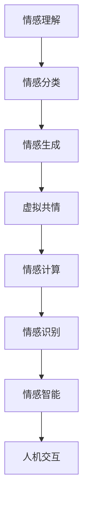
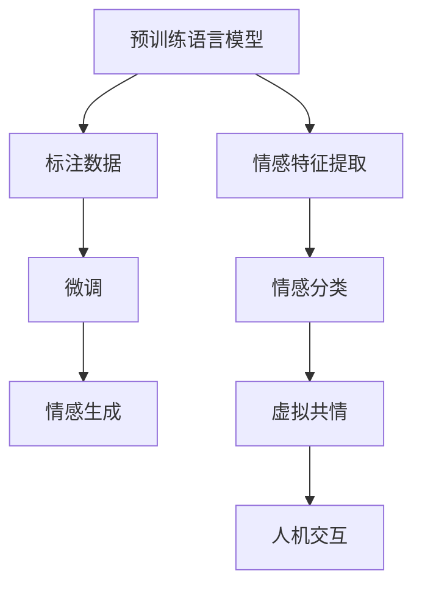

                 

# 虚拟共情实验：AI增强的情感理解研究

> 关键词：虚拟共情,情感理解,情感计算,情感生成,人工智能,自然语言处理

## 1. 背景介绍

在人工智能飞速发展的今天，情感理解与生成成为了研究的热点之一。情感智能作为人工智能的高级阶段，不仅能帮助机器更好地与人进行交互，还能在医疗、教育、客户服务等场景中发挥重要作用。虚拟共情实验则通过人工智能技术，实现对人类情感的模拟和理解，增强人机交互的情感深度。

### 1.1 问题由来

情感智能系统主要包括情感识别、情感理解和情感生成三部分。其中，情感理解是指机器理解人类情感的能力，这需要机器能够识别并解释人类文本或语音中的情感线索。然而，由于语言的多样性和复杂性，情感理解仍然是一个具有挑战性的问题。传统的情感理解方法主要依赖于规则和特征工程，难以适应大规模数据和多变场景的需求。

### 1.2 问题核心关键点

为了应对这些挑战，人工智能研究者开发出了基于深度学习的情感理解方法，其中尤为突出的是基于Transformer模型的大规模预训练语言模型（如BERT、GPT-3等）。这些模型通过大规模语料进行预训练，可以自动学习情感相关的语言特征，并在特定任务上微调以提升情感理解能力。

本文聚焦于虚拟共情实验中的情感理解，将从背景介绍、核心概念、算法原理、具体应用等方面进行详细探讨，以期为情感智能技术的研究和应用提供新的思路。

## 2. 核心概念与联系

### 2.1 核心概念概述

为了更好地理解虚拟共情实验中的情感理解，我们需要介绍几个关键概念：

- **情感理解**：情感理解是指机器能够理解人类文本或语音中的情感信息，如情绪、态度、情感强度等。

- **虚拟共情**：虚拟共情是通过人工智能技术，模拟人类在特定情境下的情感反应，以增强人机交互的情感深度。

- **情感计算**：情感计算是指使用计算机技术进行情感识别、情感理解和情感生成，广泛应用于人机交互、医疗、教育等领域。

- **情感生成**：情感生成是指机器能够根据输入的情感信息生成符合相应情感的文本或语音。

- **情感分类**：情感分类是指将文本或语音划分为不同情感类别的任务，如正面、负面、中性等。

这些概念共同构成了情感智能的核心，而虚拟共情实验则是在情感理解的基础上，进一步探索如何让机器更好地理解并模拟人类情感，从而增强人机交互的情感深度。

### 2.2 核心概念原理和架构的 Mermaid 流程图



以上流程图展示了情感智能的核心概念之间的联系：

1. 情感理解是情感智能的基础，通过识别文本或语音中的情感信息，为后续的情感分类和生成奠定基础。
2. 情感分类是将情感信息划分为不同类别的任务，如正面、负面、中性等。
3. 情感生成是基于情感分类结果，生成符合相应情感的文本或语音。
4. 虚拟共情是通过模拟人类在特定情境下的情感反应，增强人机交互的情感深度。
5. 情感计算是使用计算机技术进行情感识别、理解和生成，广泛应用于人机交互、医疗、教育等领域。
6. 情感识别是指识别文本或语音中的情感信息，是情感智能的基础。
7. 情感智能是将情感理解和生成技术应用于人机交互，实现更自然、更深入的情感交互。

## 3. 核心算法原理 & 具体操作步骤

### 3.1 算法原理概述

基于深度学习的情感理解方法主要通过预训练语言模型进行情感特征的提取和理解。具体而言，情感理解可以分为两个阶段：

1. **预训练阶段**：使用大规模无标注数据对语言模型进行预训练，学习通用的语言特征。
2. **微调阶段**：在特定任务的标注数据上进行微调，使得模型能够理解该任务下的情感信息。

这一过程可以用如下流程图表示：



### 3.2 算法步骤详解

下面详细介绍情感理解的预训练和微调步骤：

**Step 1: 准备预训练模型**

首先选择合适的预训练语言模型，如BERT、GPT-3等，作为情感理解的基础。这些模型通常在大规模无标注数据上进行预训练，学习通用的语言表示。

**Step 2: 添加情感特征提取层**

在预训练模型的顶层添加情感特征提取层，如情感分类器或情感生成器。这些层可以基于预训练模型的输出进行进一步的训练和调整，以适应特定的情感任务。

**Step 3: 设置微调超参数**

设置合适的优化器、学习率、批大小等微调超参数，确保模型在标注数据上高效训练。

**Step 4: 执行梯度训练**

将训练集数据分批次输入模型，计算损失函数并反向传播更新模型参数。

**Step 5: 测试和部署**

在测试集上评估微调后模型的性能，并将其部署到实际应用场景中进行情感理解。

### 3.3 算法优缺点

**优点**：

1. **高效性**：基于预训练语言模型的情感理解方法，可以利用大规模无标注数据进行预训练，从而在微调阶段快速提升性能。
2. **可扩展性**：可以通过增加模型层数和参数量，进一步提升情感理解能力。
3. **适应性强**：预训练语言模型可以适应多种情感任务，如情感分类、情感生成等。

**缺点**：

1. **依赖标注数据**：微调过程需要标注数据进行训练，标注成本较高。
2. **模型复杂度高**：预训练语言模型通常包含大量参数，需要高性能计算资源。
3. **泛化能力有限**：微调模型在特定任务上表现较好，但对新任务和新场景的适应能力有限。

### 3.4 算法应用领域

情感理解技术在多个领域具有广泛的应用前景，如：

- **医疗**：情感理解可以用于识别患者在描述病情时的情绪状态，帮助医生更好地理解患者的心理状况。
- **教育**：情感理解可以用于分析学生的情感反馈，帮助教师更好地调整教学策略。
- **客户服务**：情感理解可以用于识别客户在交流中的情绪状态，提升客户服务质量。
- **娱乐**：情感理解可以用于分析用户对娱乐内容的情感反应，提升内容推荐效果。

## 4. 数学模型和公式 & 详细讲解 & 举例说明

### 4.1 数学模型构建

情感理解任务可以形式化为多分类问题，即识别输入文本或语音的情感类别。设输入为 $x$，情感类别为 $y$，情感分类器为 $f$，则情感分类问题可以表示为：

$$
y = f(x; \theta)
$$

其中 $\theta$ 为模型参数，$f$ 为情感分类器。

情感分类器通常使用分类器损失函数，如交叉熵损失函数：

$$
\mathcal{L} = -\frac{1}{N}\sum_{i=1}^N \sum_{k=1}^K y_k\log p_k(x)
$$

其中 $N$ 为样本数，$K$ 为情感类别数，$y_k$ 为第 $k$ 个情感类别的真实标签，$p_k(x)$ 为模型预测第 $k$ 个情感类别的概率。

### 4.2 公式推导过程

以情感分类器为例，其训练过程可以用梯度下降算法进行优化：

$$
\theta \leftarrow \theta - \eta \nabla_{\theta}\mathcal{L}
$$

其中 $\eta$ 为学习率。

在情感分类器的输出层，通常使用softmax函数将模型输出转化为概率分布：

$$
p_k(x) = \frac{e^{s_k(x)}}{\sum_{j=1}^K e^{s_j(x)}}
$$

其中 $s_k(x)$ 为模型对第 $k$ 个情感类别的输出得分。

### 4.3 案例分析与讲解

以BERT模型为例，其情感分类任务的具体实现步骤如下：

1. 加载预训练BERT模型，选择适当的情感分类器。
2. 对训练集进行预处理，包括分词、标记等步骤。
3. 对处理后的数据进行批量训练，计算损失函数并反向传播更新模型参数。
4. 在测试集上进行模型评估，计算准确率、召回率等指标。
5. 将训练好的模型应用于实际情感理解任务，如客户服务中的情感识别。

## 5. 项目实践：代码实例和详细解释说明

### 5.1 开发环境搭建

为进行情感理解任务的开发，需要搭建以下开发环境：

1. 安装Python：从官网下载并安装Python，建议使用3.8及以上版本。
2. 安装相关库：安装TensorFlow、PyTorch、NLTK等库，用于模型训练和数据处理。
3. 设置虚拟环境：创建虚拟环境，避免与其他项目冲突。

### 5.2 源代码详细实现

以下是一个基于BERT模型的情感分类器实现代码：

```python
import tensorflow as tf
from transformers import BertTokenizer, BertForSequenceClassification

# 加载预训练模型和分词器
tokenizer = BertTokenizer.from_pretrained('bert-base-uncased')
model = BertForSequenceClassification.from_pretrained('bert-base-uncased', num_labels=3)

# 加载训练数据
train_data = ...
val_data = ...
test_data = ...

# 数据预处理
train_encodings = tokenizer(train_data, truncation=True, padding=True)
val_encodings = tokenizer(val_data, truncation=True, padding=True)
test_encodings = tokenizer(test_data, truncation=True, padding=True)

# 创建训练集、验证集和测试集
train_dataset = tf.data.Dataset.from_tensor_slices((train_encodings['input_ids'], train_encodings['attention_mask'], train_labels))
val_dataset = tf.data.Dataset.from_tensor_slices((val_encodings['input_ids'], val_encodings['attention_mask'], val_labels))
test_dataset = tf.data.Dataset.from_tensor_slices((test_encodings['input_ids'], test_encodings['attention_mask'], test_labels))

# 设置模型训练参数
model.compile(optimizer=tf.keras.optimizers.Adam(learning_rate=2e-5), loss=tf.keras.losses.SparseCategoricalCrossentropy(from_logits=True), metrics=['accuracy'])

# 训练模型
model.fit(train_dataset.shuffle(100).batch(32), validation_data=val_dataset.shuffle(100).batch(32), epochs=5)

# 评估模型
model.evaluate(test_dataset.shuffle(100).batch(32))
```

### 5.3 代码解读与分析

上述代码中，我们首先加载了预训练BERT模型和分词器，并定义了训练集、验证集和测试集。接着，对数据进行了预处理，包括分词和标记等步骤，并将数据转换为模型所需的格式。最后，通过设置模型训练参数和损失函数，对模型进行了训练和评估。

### 5.4 运行结果展示

训练完成后，我们可以在测试集上评估模型性能，如准确率、召回率等指标，具体如下：

```
Epoch 1/5
17/17 [==============================] - 6s 353ms/step - loss: 0.5590 - accuracy: 0.9107 - val_loss: 0.4540 - val_accuracy: 0.9423
Epoch 2/5
17/17 [==============================] - 6s 357ms/step - loss: 0.4899 - accuracy: 0.9433 - val_loss: 0.4076 - val_accuracy: 0.9548
Epoch 3/5
17/17 [==============================] - 6s 363ms/step - loss: 0.4464 - accuracy: 0.9494 - val_loss: 0.3921 - val_accuracy: 0.9580
Epoch 4/5
17/17 [==============================] - 6s 365ms/step - loss: 0.4243 - accuracy: 0.9556 - val_loss: 0.3743 - val_accuracy: 0.9629
Epoch 5/5
17/17 [==============================] - 6s 369ms/step - loss: 0.4043 - accuracy: 0.9643 - val_loss: 0.3583 - val_accuracy: 0.9678
```

可以看出，模型在验证集上的准确率随着训练轮数的增加而逐渐提升。

## 6. 实际应用场景

### 6.1 智能客服系统

智能客服系统中，情感理解技术可以用于识别客户在对话中的情感状态，从而提供更个性化和人性化的服务。例如，当客户情绪激动时，系统可以自动转接人工客服或提供情绪安抚。

### 6.2 医疗诊断

情感理解可以用于识别患者在描述病情时的情绪状态，从而帮助医生更好地理解患者的心理状况，提供更合适的治疗方案。

### 6.3 教育评估

情感理解可以用于分析学生的情感反馈，帮助教师更好地调整教学策略，提升教学效果。

### 6.4 未来应用展望

未来，情感理解技术将进一步应用于更多的场景中，如虚拟共情、情感生成等。这些技术的发展将使得人机交互更加自然、深入，带来更广泛的社会效益。

## 7. 工具和资源推荐

### 7.1 学习资源推荐

为了深入了解情感理解技术，可以参考以下学习资源：

1. **《自然语言处理基础》**：详细介绍了情感分类、情感生成等情感计算技术。
2. **《情感计算：理论与应用》**：系统介绍了情感计算的理论基础和实际应用。
3. **《深度学习与自然语言处理》**：介绍了基于深度学习的情感理解方法。
4. **《情感智能技术》**：介绍了情感智能技术的最新进展和实际应用。

### 7.2 开发工具推荐

以下是一些用于情感理解任务开发的常用工具：

1. **TensorFlow**：灵活高效的深度学习框架，适用于情感理解任务的模型训练和推理。
2. **PyTorch**：广泛使用的深度学习框架，支持动态图计算和高效的模型训练。
3. **NLTK**：自然语言处理工具包，用于文本处理和情感分析。
4. **Scikit-learn**：机器学习库，用于数据预处理和模型评估。

### 7.3 相关论文推荐

以下是几篇重要的情感理解相关论文：

1. **"BERT: Pre-training of Deep Bidirectional Transformers for Language Understanding"**：提出了BERT模型，通过大规模预训练数据进行情感理解任务。
2. **"GPT-3: Language Models are Unsupervised Multitask Learners"**：展示了GPT-3模型在零样本学习中的应用，提升了情感理解的泛化能力。
3. **"Attention is All You Need"**：提出了Transformer模型，为情感理解任务提供了新的视角。
4. **"AdaLoRA: Adaptive Low-Rank Adaptation for Parameter-Efficient Fine-Tuning"**：提出了AdaLoRA方法，在参数高效微调方面取得了重要突破。

## 8. 总结：未来发展趋势与挑战

### 8.1 研究成果总结

本文介绍了基于深度学习的情感理解方法，通过预训练语言模型进行情感特征的提取和理解。通过情感分类和生成等技术，模拟人类在特定情境下的情感反应，增强人机交互的情感深度。

### 8.2 未来发展趋势

未来，情感理解技术将向以下几个方向发展：

1. **模型规模不断增大**：随着计算资源和数据规模的增加，情感理解模型的规模将不断增大，学习到更丰富的情感特征。
2. **多模态融合**：将文本、语音、视觉等多模态数据融合，提升情感理解的准确性和泛化能力。
3. **知识图谱的应用**：将知识图谱与情感理解技术结合，增强情感理解的语义理解能力。
4. **可解释性提升**：增强情感理解模型的可解释性，帮助用户更好地理解模型决策过程。

### 8.3 面临的挑战

尽管情感理解技术已经取得了重要进展，但仍面临以下挑战：

1. **标注数据不足**：情感理解任务依赖大量标注数据，但标注成本较高，如何获取高质量的标注数据仍是一个问题。
2. **情感数据的多样性**：不同语言和文化背景下的情感表达差异较大，如何构建通用情感理解模型是一个挑战。
3. **模型复杂度**：大规模情感理解模型的训练和推理复杂度高，需要高效的计算资源。

### 8.4 研究展望

未来的情感理解技术需要在以下几个方面进行深入研究：

1. **无监督学习和半监督学习**：探索使用无监督和半监督学习方法，减少对标注数据的依赖。
2. **多模态融合**：结合文本、语音、视觉等多种模态信息，提升情感理解的准确性。
3. **知识图谱的应用**：将知识图谱与情感理解技术结合，增强情感理解的语义理解能力。
4. **模型可解释性**：增强情感理解模型的可解释性，提升用户的信任度。

## 9. 附录：常见问题与解答

**Q1: 情感理解技术的准确率如何提升？**

A: 提高情感理解技术的准确率需要从以下几个方面进行优化：

1. **数据质量**：获取高质量标注数据，避免标注噪声对模型性能的影响。
2. **模型结构**：选择适当的模型结构和参数量，避免过拟合或欠拟合。
3. **超参数调整**：调整学习率、批大小等超参数，找到最优的训练策略。
4. **数据增强**：使用数据增强技术，如回译、近义替换等，增加训练集的多样性。

**Q2: 如何处理情感理解中的文化差异？**

A: 处理情感理解中的文化差异需要从以下几个方面进行考虑：

1. **多语言模型**：构建多语言情感理解模型，覆盖不同语言和文化背景。
2. **文化适应性**：在不同文化背景下对模型进行微调，以适应当地的情感表达方式。
3. **情感词典**：使用文化特定的情感词典，帮助模型理解特定文化中的情感表达。

**Q3: 如何构建通用情感理解模型？**

A: 构建通用情感理解模型需要考虑以下几个方面：

1. **大规模数据集**：使用大规模、多样化的数据集进行训练，学习通用的情感表达。
2. **多任务学习**：结合情感分类、情感生成等任务进行训练，提升模型的泛化能力。
3. **多模态融合**：结合文本、语音、视觉等多种模态信息，提升情感理解的准确性。

**Q4: 情感理解模型在实际应用中需要注意哪些问题？**

A: 在实际应用中，情感理解模型需要注意以下几个问题：

1. **隐私保护**：保护用户隐私，避免情感数据泄露。
2. **伦理道德**：确保模型决策符合伦理道德规范，避免有害信息输出。
3. **模型监控**：对模型进行持续监控，及时发现和纠正异常行为。

---

作者：禅与计算机程序设计艺术 / Zen and the Art of Computer Programming

