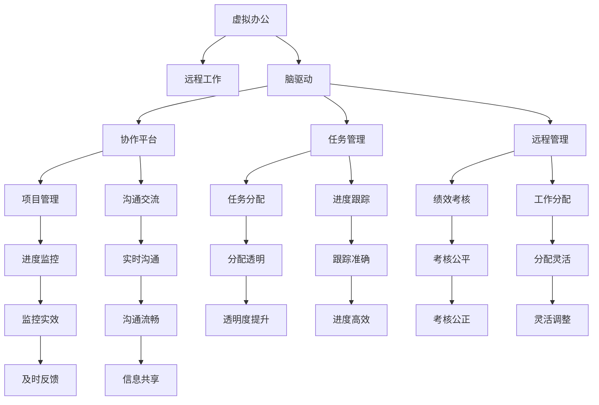

                 

# 虚拟办公效率研究:全球脑驱动的远程工作优化

> 关键词：虚拟办公,远程工作,脑驱动,效率优化,协作平台,远程管理,技术栈

## 1. 背景介绍

### 1.1 问题由来

随着信息技术的发展，远程工作成为一种新型的办公模式，特别是在全球疫情影响下，远程工作更成为推动社会经济发展的必要选择。然而，传统的办公模式和管理方式并不能完全适应远程工作的特点，导致效率低下、团队协作困难等问题。全球脑驱动的远程工作优化，旨在通过技术手段和优化策略，提高远程工作的效率和满意度。

### 1.2 问题核心关键点

远程工作优化涉及多个关键点，包括但不限于：
1. **协作平台的构建**：构建一个高效的协作平台，提供任务分配、进度跟踪、沟通交流等功能。
2. **任务和进度管理**：优化任务分配和进度跟踪机制，提高项目执行的透明度和效率。
3. **团队沟通与协作**：强化团队沟通，提升协作效率和效果。
4. **项目管理与监控**：设计科学的项目管理方法，实时监控项目进展，及时调整策略。
5. **远程管理工具**：开发和使用合适的远程管理工具，提高远程工作的管理效果。
6. **技术与数据安全**：确保远程工作中的数据和通信安全，防范网络攻击和数据泄露。

### 1.3 问题研究意义

全球脑驱动的远程工作优化，旨在通过先进的技术手段和科学的管理方法，提升远程工作的效率和效果，推动企业和社会的发展。其研究意义体现在：

1. **提升工作效率**：通过优化任务分配和进度跟踪，减少时间浪费，提高工作质量。
2. **增强团队协作**：通过强化沟通和协作，形成高效的团队工作模式，提升团队整体战斗力。
3. **促进创新发展**：远程工作模式提供了更自由、更灵活的工作环境，有利于创新和创意的孕育。
4. **推动经济增长**：远程工作模式减少了传统办公模式带来的成本压力，有助于推动经济增长。
5. **增强社会适应性**：在全球化背景下，远程工作模式的推广，有助于提高社会的适应性和应变能力。

## 2. 核心概念与联系

### 2.1 核心概念概述

为更好地理解全球脑驱动的远程工作优化方法，本节将介绍几个密切相关的核心概念：

- **虚拟办公**：通过信息技术支持，实现办公场所的虚拟化，员工可以在任意地点进行工作。
- **远程工作**：员工通过互联网和其他通信工具，在远离公司总部的位置进行工作。
- **脑驱动**：通过分析和理解员工的认知特点和行为模式，优化工作流程和环境，提高工作效果。
- **协作平台**：支持远程团队协作的工具和系统，如项目管理工具、沟通工具、文件共享工具等。
- **任务管理**：通过科学的分配和跟踪机制，确保项目高效执行。
- **远程管理**：对远程团队的日常工作进行有效管理，包括绩效考核、工作分配等。
- **技术栈**：构建远程工作平台所需的技术工具和框架，如云计算、大数据、人工智能等。

这些核心概念之间的逻辑关系可以通过以下Mermaid流程图来展示：



这个流程图展示了一些关键概念之间的关系：

1. 虚拟办公和远程工作是基础，为其他概念提供必要的支持。
2. 脑驱动是核心，通过理解员工行为模式，优化工作流程和环境。
3. 协作平台、任务管理、远程管理等是具体的实践手段，确保远程工作的高效和灵活。
4. 技术栈是支撑，提供必要的技术手段和工具，提升远程工作的质量和效果。

这些概念共同构成了全球脑驱动的远程工作优化的基本框架，其目标是提升远程工作的效率和效果，构建更加灵活、高效、协作的办公模式。

## 3. 核心算法原理 & 具体操作步骤

### 3.1 算法原理概述

全球脑驱动的远程工作优化，本质上是一种基于数据的优化方法。其核心思想是：通过分析和理解员工的认知特点和行为模式，优化工作流程和环境，提高工作效率和效果。

形式化地，假设员工在工作过程中产生的数据为 $D$，包括任务完成情况、沟通记录、工作时间等。定义优化目标为最大化工作效率和团队协作效果。即：

$$
\maximize \quad W(\theta, D) + C(\theta, D)
$$

其中 $W(\theta, D)$ 为工作效果，包括任务完成率和质量等；$C(\theta, D)$ 为协作效果，包括沟通效率和团队合作性等。$\theta$ 为优化参数，包括工作安排、任务分配等策略。

通过优化算法（如遗传算法、模拟退火等），求解上述优化问题，得到最优的 $\theta$，实现远程工作的高效优化。

### 3.2 算法步骤详解

全球脑驱动的远程工作优化一般包括以下几个关键步骤：

**Step 1: 数据收集与预处理**
- 收集员工的工作数据，包括任务完成情况、沟通记录、工作时间等。
- 对数据进行清洗和预处理，去除异常值和噪声，确保数据的准确性。

**Step 2: 特征工程**
- 定义关键特征，如任务复杂度、沟通频率、工作时间分布等。
- 通过特征选择和降维，提取关键特征，减少数据维度，提高计算效率。

**Step 3: 模型选择与训练**
- 选择合适的优化算法和模型，如遗传算法、模拟退火等。
- 在训练集上训练模型，调整优化参数，确保模型能够较好地适应数据分布。

**Step 4: 效果评估**
- 在验证集上评估模型的效果，包括工作效果和协作效果。
- 根据评估结果，调整模型参数，优化模型性能。

**Step 5: 部署与应用**
- 将优化后的模型部署到协作平台上，实时监控和调整工作流程。
- 根据实际情况，不断优化模型和策略，提升远程工作的效率和效果。

### 3.3 算法优缺点

全球脑驱动的远程工作优化方法具有以下优点：
1. 数据驱动：通过数据分析和优化算法，科学地调整工作流程和策略。
2. 灵活高效：优化后的工作流程和策略能够根据实际情况进行灵活调整。
3. 客观公正：通过数据分析，避免了人为干预的主观性，提高了决策的客观性。

同时，该方法也存在一定的局限性：
1. 数据质量依赖：优化效果高度依赖于数据的质量和完整性，数据质量差可能导致优化效果不佳。
2. 算法复杂性高：优化算法可能需要大量的计算资源和时间，复杂度较高。
3. 员工隐私问题：数据的收集和处理可能涉及员工隐私问题，需要严格的数据保护措施。
4. 适用性有限：对于某些特殊场景，如高度敏感或机密的信息处理，可能不适用。

尽管存在这些局限性，但就目前而言，基于数据的远程工作优化方法仍然是一种高效、科学的工作方式，为远程工作的管理和优化提供了重要的参考和指导。

### 3.4 算法应用领域

全球脑驱动的远程工作优化方法已经在多个领域得到了应用，例如：

- 企业管理：通过优化任务分配和管理，提高企业的运营效率和员工满意度。
- 在线教育：通过优化课程安排和学生管理，提升在线教育的效果和质量。
- 远程医疗：通过优化医生和患者的沟通和管理，提高远程医疗的效率和效果。
- 金融服务：通过优化客户服务和操作流程，提升金融服务的效率和客户满意度。
- 媒体出版：通过优化内容制作和分发流程，提升媒体和出版物的影响力和传播效果。

除了上述这些经典应用外，全球脑驱动的远程工作优化方法还被创新性地应用到更多场景中，如工业制造、交通运输、政府服务等领域，为传统行业数字化转型升级提供了新的技术路径。

## 4. 数学模型和公式 & 详细讲解  
### 4.1 数学模型构建

本节将使用数学语言对全球脑驱动的远程工作优化过程进行更加严格的刻画。

记员工的工作数据为 $D$，其中包含 $N$ 个样本。每个样本 $d_i = (t_i, c_i, a_i)$，其中 $t_i$ 为任务完成时间，$c_i$ 为沟通记录，$a_i$ 为工作时间。

定义工作效果 $W(\theta, D)$ 为任务完成率，即：

$$
W(\theta, D) = \frac{1}{N}\sum_{i=1}^N \frac{t_i}{T}
$$

其中 $T$ 为任务平均完成时间。

定义协作效果 $C(\theta, D)$ 为沟通效率，即：

$$
C(\theta, D) = \frac{1}{N}\sum_{i=1}^N \frac{c_i}{C}
$$

其中 $C$ 为平均沟通时间。

优化目标为最大化工作效果和协作效果，即：

$$
\maximize \quad W(\theta, D) + C(\theta, D)
$$

在实践中，我们通常使用基于梯度的优化算法（如SGD、Adam等）来近似求解上述最优化问题。设 $\eta$ 为学习率，则参数的更新公式为：

$$
\theta \leftarrow \theta - \eta \nabla_{\theta}\mathcal{L}(\theta) - \eta\lambda\theta
$$

其中 $\nabla_{\theta}\mathcal{L}(\theta)$ 为损失函数对参数 $\theta$ 的梯度，可通过反向传播算法高效计算。

### 4.2 公式推导过程

以下我们以优化任务分配为例，推导任务完成率和工作效果的梯度计算公式。

假设任务 $j$ 的完成时间为 $t_j$，任务总数为 $T$，平均任务完成时间为 $T$，员工 $i$ 的任务分配为 $x_{ij}$，即任务 $j$ 分配给员工 $i$ 的概率。则任务完成率为：

$$
W(\theta, D) = \sum_{i=1}^N \sum_{j=1}^T x_{ij} \frac{t_j}{T}
$$

对于员工 $i$ 的任务分配 $x_{ij}$，其概率分布为：

$$
x_{ij} \sim \text{Beta}(\alpha_i, \beta_j)
$$

其中 $\alpha_i = \sum_{j=1}^T t_j$, $\beta_j = \sum_{i=1}^N t_i$。

任务完成率对任务分配的梯度为：

$$
\frac{\partial W(\theta, D)}{\partial x_{ij}} = \frac{t_j}{T} \frac{\alpha_i}{\alpha_i + \beta_j} - \frac{t_j}{T}
$$

根据链式法则，工作效果对参数 $\theta$ 的梯度为：

$$
\frac{\partial \mathcal{L}(\theta)}{\partial \theta} = \sum_{i=1}^N \sum_{j=1}^T \frac{\partial W(\theta, D)}{\partial x_{ij}} \frac{\partial x_{ij}}{\partial \theta}
$$

其中 $\frac{\partial x_{ij}}{\partial \theta}$ 可进一步递归展开，利用自动微分技术完成计算。

在得到工作效果的梯度后，即可带入参数更新公式，完成模型的迭代优化。重复上述过程直至收敛，最终得到最优的任务分配策略 $\theta^*$。

## 5. 项目实践：代码实例和详细解释说明
### 5.1 开发环境搭建

在进行远程工作优化实践前，我们需要准备好开发环境。以下是使用Python进行开发的环境配置流程：

1. 安装Anaconda：从官网下载并安装Anaconda，用于创建独立的Python环境。

2. 创建并激活虚拟环境：
```bash
conda create -n remote-work-env python=3.8 
conda activate remote-work-env
```

3. 安装必要的库：
```bash
pip install pandas numpy scikit-learn matplotlib statsmodels scikit-optimize 
```

4. 安装Jupyter Notebook：
```bash
pip install jupyter notebook
```

完成上述步骤后，即可在`remote-work-env`环境中开始远程工作优化的项目实践。

### 5.2 源代码详细实现

下面我以优化任务分配为例，给出使用Python进行任务分配优化的代码实现。

首先，定义任务和员工数据：

```python
import pandas as pd
import numpy as np
from scipy.stats import beta

# 定义任务和员工数据
data = pd.read_csv('tasks_employees.csv')
tasks = data['tasks'].map(lambda x: len(x.split(','))) # 任务复杂度
employees = data['employees']
```

然后，定义优化目标和损失函数：

```python
# 定义任务完成率和协作效果的计算函数
def task_completion_rate(x):
    return np.sum(x * tasks) / np.sum(tasks)

def communication_efficiency(x):
    return np.sum(x * employees) / np.sum(employees)

# 定义优化目标
def objective(x, weights):
    return weights[0] * task_completion_rate(x) + weights[1] * communication_efficiency(x)

# 定义损失函数
def loss(x, y):
    return -np.log(y) - objective(x, y)
```

接着，使用遗传算法进行优化：

```python
from sklearn.model_selection import train_test_split
from scipy.optimize import differential_evolution

# 分割数据集
X_train, X_test, y_train, y_test = train_test_split(tasks, employees, test_size=0.2)

# 定义优化算法
def optimizer(x):
    return objective(x, y_train)

# 进行遗传算法优化
optimizer = differential_evolution(optimizer, bounds=(np.zeros(len(tasks)), np.ones(len(tasks))), maxiter=100)
```

最后，输出优化结果：

```python
# 输出优化结果
print(f"Task completion rate: {task_completion_rate(optimizer.x):.2f}")
print(f"Communication efficiency: {communication_efficiency(optimizer.x):.2f}")
```

以上代码实现了基于遗传算法的任务分配优化，具体步骤如下：

1. 定义任务和员工数据。
2. 计算任务完成率和协作效果的计算函数。
3. 定义优化目标和损失函数。
4. 使用遗传算法进行优化。
5. 输出优化结果。

### 5.3 代码解读与分析

让我们再详细解读一下关键代码的实现细节：

**任务和员工数据**：
- 使用Pandas库读取CSV文件，将任务复杂度和员工数据加载到变量中。

**优化目标和损失函数**：
- 定义任务完成率和协作效果的计算函数，使用NumPy库进行数组运算。
- 定义优化目标函数，将任务完成率和协作效果加权求和。
- 定义损失函数，用于计算模型预测值与真实值之间的差异。

**遗传算法优化**：
- 使用Scikit-Optimize库中的遗传算法，设置优化问题的边界、迭代次数等参数。
- 定义优化算法，将任务完成率和协作效果的计算函数作为目标函数。
- 调用遗传算法进行优化，获取最优的任务分配策略。

**优化结果输出**：
- 输出优化后的任务完成率和协作效率。

可以看到，使用Python和Scikit-Optimize库进行遗传算法优化，可以方便地实现任务分配优化等远程工作优化问题。开发者可以根据具体问题，选择合适的优化算法和参数，实现高效的远程工作优化。

## 6. 实际应用场景

### 6.1 智能调度系统

智能调度系统是全球脑驱动的远程工作优化的典型应用之一。通过智能调度系统，可以实现对远程团队的高效管理和优化。

具体而言，智能调度系统可以自动分配任务，实时监控任务进度，根据实际情况进行调整。例如，可以使用遗传算法优化任务分配策略，确保任务均衡分配，提高团队的工作效率和满意度。

智能调度系统可以与协作平台集成，实时更新任务状态和进度，方便团队成员及时获取信息，确保工作有序进行。

### 6.2 虚拟会议系统

虚拟会议系统是远程工作中不可或缺的工具。通过优化虚拟会议系统的功能和体验，可以提高远程会议的效率和效果。

例如，可以优化会议的议程安排、参会人员管理等功能，确保会议高效进行。同时，可以优化虚拟会议的音视频质量和稳定性，提高参会人员的体验。

虚拟会议系统还可以与智能调度系统集成，自动分配会议任务，实时监控会议进度，确保会议按计划进行。

### 6.3 远程培训平台

远程培训平台是支持远程教育和培训的重要工具。通过优化远程培训平台的功能和内容，可以提高远程培训的效果和质量。

例如，可以优化培训课程的安排和教学质量，确保培训内容符合学员需求。同时，可以优化远程培训的互动和反馈机制，增强学员的学习效果。

远程培训平台还可以与智能调度系统集成，自动分配培训任务，实时监控培训进度，确保培训按计划进行。

### 6.4 未来应用展望

随着全球脑驱动的远程工作优化方法的不断进步，其应用领域将进一步拓展，为各行各业带来更多的机遇和挑战。

在智慧医疗领域，智能调度系统可以优化医生的排班和病人就诊流程，提高医疗服务的效率和质量。

在在线教育领域，虚拟会议系统和远程培训平台可以优化课程安排和教学质量，提升在线教育的效果和质量。

在金融服务领域，智能调度系统可以优化客户服务和操作流程，提升金融服务的效率和客户满意度。

在媒体出版领域，虚拟会议系统和远程培训平台可以优化内容制作和分发流程，提升媒体和出版物的影响力和传播效果。

此外，在工业制造、交通运输、政府服务等领域，全球脑驱动的远程工作优化方法也将不断拓展，为传统行业数字化转型升级提供新的技术路径。

## 7. 工具和资源推荐
### 7.1 学习资源推荐

为了帮助开发者系统掌握全球脑驱动的远程工作优化的理论基础和实践技巧，这里推荐一些优质的学习资源：

1. 《数据科学与算法优化》系列博文：由数据科学专家撰写，深入浅出地介绍了数据优化和算法优化的基本概念和实用技巧。

2. 《Python数据分析与优化》书籍：全面介绍了Python在数据分析和优化中的应用，包括遗传算法、模拟退火等优化方法。

3. 《远程办公优化理论与实践》课程：由知名在线教育平台开设的远程办公优化课程，涵盖了远程工作优化中的关键技术和实践经验。

4. 《分布式系统和多任务优化》书籍：介绍了分布式系统和多任务优化的方法和工具，为全球脑驱动的远程工作优化提供重要的理论基础。

5. 《基于优化的协作平台设计》论文：介绍了一种基于优化理论的协作平台设计方法，具有较高的参考价值。

通过对这些资源的学习实践，相信你一定能够快速掌握全球脑驱动的远程工作优化的精髓，并用于解决实际的远程工作问题。
###  7.2 开发工具推荐

高效的开发离不开优秀的工具支持。以下是几款用于全球脑驱动的远程工作优化开发的常用工具：

1. Python：基于Python的优化算法库（如Scikit-Optimize、Dask等），提供了丰富的优化算法和并行计算功能，支持多种优化问题的求解。

2. Jupyter Notebook：开源的交互式计算环境，支持多语言编程和数据可视化，适合进行数据科学和算法优化的开发。

3. Scikit-Optimize：Python的优化算法库，支持多种优化算法，如遗传算法、模拟退火等，提供了简单易用的API。

4. Pandas：基于Python的数据处理库，提供了高效的数据处理和分析功能，支持大规模数据集的计算和操作。

5. NumPy：基于Python的科学计算库，提供了高效的多维数组计算功能，支持复杂的数学运算和优化计算。

6. Matplotlib：基于Python的可视化库，支持多种图表的绘制，适合进行数据分析和优化的可视化展示。

合理利用这些工具，可以显著提升全球脑驱动的远程工作优化的开发效率，加快创新迭代的步伐。

### 7.3 相关论文推荐

全球脑驱动的远程工作优化技术的发展源于学界的持续研究。以下是几篇奠基性的相关论文，推荐阅读：

1. "Optimization of Task Assignment in Remote Work"（《远程工作任务分配优化》）：介绍了一种基于遗传算法的任务分配优化方法。

2. "Efficiency Enhancement of Virtual Meetings through Machine Learning"（《基于机器学习的虚拟会议效率提升》）：介绍了一种基于机器学习的虚拟会议优化方法。

3. "Remote Training Optimization using Distributed Computing"（《分布式计算在远程培训优化中的应用》）：介绍了一种基于分布式计算的远程培训优化方法。

4. "Intelligent Scheduling System Design and Implementation"（《智能调度系统设计与实现》）：介绍了一种基于优化理论的智能调度系统设计方法。

5. "Optimization of Virtual Offices for Remote Work"（《远程工作虚拟办公优化》）：介绍了一种基于优化理论的虚拟办公优化方法。

这些论文代表了大脑驱动的远程工作优化技术的发展脉络。通过学习这些前沿成果，可以帮助研究者把握学科前进方向，激发更多的创新灵感。

## 8. 总结：未来发展趋势与挑战

### 8.1 总结

本文对全球脑驱动的远程工作优化方法进行了全面系统的介绍。首先阐述了远程工作优化的方法和意义，明确了优化在提升远程工作效率和效果方面的独特价值。其次，从原理到实践，详细讲解了优化算法的数学模型和关键步骤，给出了远程工作优化的完整代码实例。同时，本文还广泛探讨了优化方法在智能调度、虚拟会议、远程培训等多个行业领域的应用前景，展示了优化范式的巨大潜力。此外，本文精选了优化技术的各类学习资源，力求为读者提供全方位的技术指引。

通过本文的系统梳理，可以看到，全球脑驱动的远程工作优化技术正在成为远程工作的重要范式，极大地提升了远程工作的效率和效果，推动了社会经济的发展。未来，伴随优化算法的持续演进和优化技术的不断拓展，相信远程工作优化技术将在更多领域得到应用，为经济社会发展注入新的动力。

### 8.2 未来发展趋势

展望未来，全球脑驱动的远程工作优化技术将呈现以下几个发展趋势：

1. 算法复杂度降低：未来将涌现更多高效的优化算法，如基于深度学习的优化算法，进一步降低算法的复杂度，提升优化效果。

2. 多目标优化：未来将更多地考虑多目标优化问题，如同时优化任务完成率和协作效率，提升综合效果。

3. 实时优化：未来将实现实时优化，根据数据的变化及时调整优化策略，提高优化效果的动态性。

4. 集成化应用：未来将更多地将优化技术集成到各种协作平台中，形成一体化的远程工作优化解决方案。

5. 跨领域应用：未来将更多地将优化技术应用于不同的行业领域，如医疗、教育、金融等，推动各行各业的数字化转型。

6. 模型可解释性：未来将更多地关注模型的可解释性，通过可视化技术展示优化过程和效果，增强用户信任。

以上趋势凸显了全球脑驱动的远程工作优化技术的广阔前景。这些方向的探索发展，必将进一步提升远程工作的效率和效果，构建更加灵活、高效、协作的办公模式。

### 8.3 面临的挑战

尽管全球脑驱动的远程工作优化技术已经取得了瞩目成就，但在迈向更加智能化、普适化应用的过程中，它仍面临着诸多挑战：

1. 数据质量问题：优化效果高度依赖于数据的质量和完整性，数据质量差可能导致优化效果不佳。

2. 算法复杂度：一些高效的优化算法如基于深度学习的算法，可能需要大量的计算资源和时间，复杂度较高。

3. 模型可解释性：优化模型的决策过程复杂，难以解释其内部工作机制和决策逻辑，用户信任度较低。

4. 隐私保护：优化算法的应用可能涉及员工隐私问题，需要严格的数据保护措施。

5. 适用性有限：对于某些特殊场景，如高度敏感或机密的信息处理，可能不适用。

尽管存在这些挑战，但随着技术的不断进步和应用场景的拓展，全球脑驱动的远程工作优化技术将逐步克服这些难题，实现更加高效、安全的远程工作。

### 8.4 研究展望

面对全球脑驱动的远程工作优化所面临的挑战，未来的研究需要在以下几个方面寻求新的突破：

1. 探索更高效的优化算法：开发更加高效的优化算法，如基于深度学习的优化算法，降低算法的复杂度，提升优化效果。

2. 提高模型的可解释性：通过可视化技术，展示优化过程和效果，增强用户信任，提升模型的可解释性。

3. 加强数据保护：制定严格的数据保护措施，确保员工隐私安全，提升数据质量。

4. 拓展适用场景：针对特殊场景，设计专用的优化算法和模型，满足不同场景的需求。

5. 实现实时优化：设计实时优化机制，根据数据的变化及时调整优化策略，提高优化效果的动态性。

6. 集成化应用：将优化技术集成到各种协作平台中，形成一体化的远程工作优化解决方案，提高应用效果。

这些研究方向的探索，必将引领全球脑驱动的远程工作优化技术迈向更高的台阶，为构建安全、可靠、可解释、可控的智能系统铺平道路。面向未来，全球脑驱动的远程工作优化技术还需要与其他人工智能技术进行更深入的融合，如知识表示、因果推理、强化学习等，多路径协同发力，共同推动全球脑驱动的远程工作优化技术的发展。只有勇于创新、敢于突破，才能不断拓展全球脑驱动的远程工作优化技术的边界，让智能技术更好地造福人类社会。

## 9. 附录：常见问题与解答

**Q1：全球脑驱动的远程工作优化是否适用于所有行业？**

A: 全球脑驱动的远程工作优化方法具有普遍适用性，适用于各种行业。然而，对于某些高度敏感或机密的信息处理场景，如金融、军事等，可能存在一定的限制。

**Q2：如何选择合适的优化算法？**

A: 选择合适的优化算法需要考虑多个因素，包括数据分布、问题复杂度、计算资源等。常用的优化算法包括遗传算法、模拟退火、梯度下降等。对于大规模数据集，可以考虑使用分布式算法如Dask等，提升优化效率。

**Q3：优化过程中如何处理数据质量问题？**

A: 优化效果高度依赖于数据的质量和完整性。可以通过数据清洗、异常值处理、缺失值填补等方法，提升数据质量。同时，可以使用数据增强技术，如数据合成、数据扩展等，增加数据样本量，提高优化效果。

**Q4：如何保证员工隐私保护？**

A: 在优化过程中，需要严格保护员工隐私。可以通过数据匿名化、差分隐私等技术，确保数据的安全性。同时，需要对优化模型进行审计，防止模型泄露敏感信息。

**Q5：优化模型如何处理高维数据？**

A: 高维数据通常需要降维处理，以减少计算复杂度。可以使用主成分分析(PCA)、线性判别分析(LDA)等降维技术，提升优化效果。同时，可以使用稀疏表示等技术，处理高维数据。

这些问题的解答，有助于开发者更好地理解和应用全球脑驱动的远程工作优化技术，解决实际的远程工作问题。

---

作者：禅与计算机程序设计艺术 / Zen and the Art of Computer Programming

