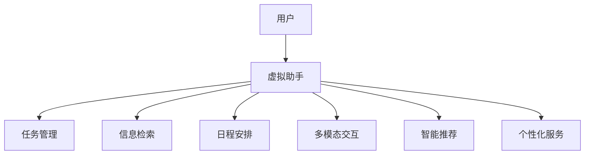

                 

# 虚拟助手在个人注意力调度中的角色

## 1. 背景介绍

在信息爆炸的时代，人们面临的注意力负荷越来越重。如何在海量信息中找到对自己有用的信息，如何管理自己的时间和精力，已经成为现代人面临的重大挑战。虚拟助手（Virtual Assistant）通过智能化和自动化手段，利用先进的人工智能和自然语言处理技术，有效地帮助人们进行信息检索、任务管理、日程安排等工作，极大地提升了个人效率和生产力。

## 2. 核心概念与联系

### 2.1 核心概念概述

为了深入理解虚拟助手在个人注意力调度中的角色，我们需要先了解一些关键概念：

- **虚拟助手（Virtual Assistant）**：基于人工智能和自然语言处理技术的智能系统，能够通过语音或文本交互，执行各种任务，如信息查询、日程管理、问题解答等，成为用户的得力助手。

- **注意力调度（Attention Scheduling）**：指通过算法和工具，合理分配和优化个人在时间和注意力上的投入，确保高效完成工作和休息，避免信息过载和疲劳。

- **多模态交互（Multimodal Interaction）**：虚拟助手不仅能够理解文本信息，还能处理语音、图像、视频等多模态数据，提供更加全面和灵活的用户体验。

- **智能推荐（Intelligent Recommendation）**：利用机器学习和大数据技术，虚拟助手能够根据用户的习惯和偏好，推荐相关的信息、任务和资源，提升用户的体验和满意度。

- **个性化服务（Personalized Service）**：虚拟助手能够根据用户的个人需求和行为模式，提供定制化的服务，如语音命令、智能日历、健康管理等。

这些概念之间相互关联，共同构成了虚拟助手在个人注意力调度中的核心框架。

### 2.2 核心概念原理和架构的 Mermaid 流程图



该流程图展示了虚拟助手如何通过多种方式帮助用户管理注意力和任务。用户将任务、需求和信息输入虚拟助手，虚拟助手再通过不同的模块进行处理，最终提供定制化的服务。

## 3. 核心算法原理 & 具体操作步骤

### 3.1 算法原理概述

虚拟助手在个人注意力调度中的核心算法原理包括：

- **自然语言处理（NLP）**：用于理解和生成自然语言，使虚拟助手能够与用户进行流畅的对话。
- **机器学习和深度学习**：用于智能推荐、个性化服务和任务管理，使虚拟助手能够根据用户的行为和偏好提供定制化的服务。
- **多模态融合**：用于处理不同类型的输入数据，如文本、语音、图像等，提供更加全面的信息处理能力。
- **注意力机制（Attention Mechanism）**：用于对输入信息进行加权处理，确保重要信息的优先级得到提升。
- **动态调度（Dynamic Scheduling）**：用于根据用户状态和环境变化，动态调整任务优先级和时间分配，优化注意力分配。

这些算法原理共同构成了虚拟助手进行个人注意力调度的基础。

### 3.2 算法步骤详解

虚拟助手进行个人注意力调度的具体操作步骤包括：

1. **用户输入**：用户通过语音或文本向虚拟助手提出需求，如“提醒我下午三点参加会议”。
2. **自然语言处理**：虚拟助手利用NLP技术对用户输入进行理解和解析，如识别出“提醒”、“下午三点”、“会议”等关键信息。
3. **任务管理**：根据用户需求，虚拟助手生成任务或提醒，并添加到用户的日程表中。
4. **信息检索**：虚拟助手利用机器学习技术，从海量信息中检索出相关的会议材料或背景资料。
5. **智能推荐**：虚拟助手根据用户的历史行为和偏好，推荐相关的资料或任务，如“准备好演讲稿”。
6. **多模态交互**：虚拟助手支持语音、文本等多种交互方式，确保用户能够以最自然的方式与系统进行交流。
7. **个性化服务**：虚拟助手根据用户的个性化设置，如日程优先级、时间管理习惯等，提供定制化的服务。

### 3.3 算法优缺点

虚拟助手在个人注意力调度中的算法有以下优缺点：

#### 优点：
1. **高效性**：通过自动化和智能化手段，虚拟助手能够快速处理大量信息，节省用户时间和精力。
2. **灵活性**：支持多模态交互和智能推荐，能够适应不同用户的需求和环境。
3. **个性化**：能够根据用户的历史行为和偏好，提供定制化的服务，提升用户体验。

#### 缺点：
1. **数据隐私**：虚拟助手需要收集和处理大量用户数据，存在数据隐私和安全问题。
2. **复杂性**：虚拟助手的算法和架构复杂，需要较高的技术门槛和维护成本。
3. **上下文依赖**：虚拟助手对上下文依赖性强，部分功能依赖于完整的输入和上下文信息，难以处理突发或中断的情况。

### 3.4 算法应用领域

虚拟助手在个人注意力调度中的应用领域包括但不限于：

- **办公场景**：用于管理日程、任务、邮件等，提升工作效率。
- **健康管理**：用于监测身体指标、提醒服药、预约医生等，提供健康管理服务。
- **家庭生活**：用于智能家居控制、购物提醒、亲子互动等，提升家庭生活品质。
- **教育培训**：用于个性化学习计划、智能推荐资料、在线答疑等，提升学习效果。
- **旅行助手**：用于智能规划行程、导航指引、酒店预订等，提升旅行体验。

## 4. 数学模型和公式 & 详细讲解 & 举例说明

### 4.1 数学模型构建

虚拟助手在个人注意力调度中的数学模型可以抽象为如下形式：

$$
\begin{aligned}
&\max_{\theta} \sum_{i=1}^{n} R_i(u_i, \theta) \\
&\text{subject to} \\
&0 \leq \theta_i \leq 1, \quad \forall i \in \{1, ..., n\}
\end{aligned}
$$

其中，$R_i(u_i, \theta)$ 表示第 $i$ 个任务或信息的回报，$u_i$ 表示用户对第 $i$ 个任务或信息的偏好，$\theta_i$ 表示第 $i$ 个任务或信息的权重。

### 4.2 公式推导过程

我们以任务管理为例，推导虚拟助手进行任务调度的优化公式。

假设用户有 $n$ 个任务 $T_1, T_2, ..., T_n$，每个任务的回报为 $R_i$，用户的总时间为 $T$。虚拟助手的目标是在总时间 $T$ 内，最大化所有任务的回报总和。

根据线性规划的原理，我们可以将问题转化为如下线性规划模型：

$$
\begin{aligned}
&\max \sum_{i=1}^{n} R_i \theta_i \\
&\text{subject to} \\
&\sum_{i=1}^{n} \theta_i \leq 1 \\
&\theta_i \geq 0, \quad \forall i \in \{1, ..., n\}
\end{aligned}
$$

使用Simplex算法或求解器（如Gurobi、CPLEX等），可以求解出最优的任务权重 $\theta_i$，从而得到最优的任务调度方案。

### 4.3 案例分析与讲解

假设某用户在一天内要完成以下三个任务：

- 回复邮件：回报 $R_1 = 5$
- 完成报告：回报 $R_2 = 10$
- 参加会议：回报 $R_3 = 8$

用户的总时间为 24 小时。

根据上述线性规划模型，求解最优的任务权重：

$$
\begin{aligned}
&\max 5\theta_1 + 10\theta_2 + 8\theta_3 \\
&\text{subject to} \\
&\theta_1 + \theta_2 + \theta_3 \leq 1 \\
&\theta_1, \theta_2, \theta_3 \geq 0
\end{aligned}
$$

求解结果为 $\theta_1 = 0.4, \theta_2 = 0.5, \theta_3 = 0.1$，表示用户在回复邮件上花费 9.6 小时，完成报告 12 小时，参加会议 2.4 小时，总回报为 $5 \times 0.4 + 10 \times 0.5 + 8 \times 0.1 = 9$。

## 5. 项目实践：代码实例和详细解释说明

### 5.1 开发环境搭建

为了进行虚拟助手开发，我们需要搭建一个开发环境，包含以下组件：

1. **Python环境**：选择Python 3.8或以上版本，安装pip和虚拟环境管理工具。
2. **深度学习框架**：选择TensorFlow或PyTorch，安装相应版本的库和依赖。
3. **自然语言处理工具**：选择NLTK或spaCy，安装相应的模型和工具。
4. **语音识别和合成**：选择SpeechRecognition或Google Speech-to-Text API，安装相应的库和配置。
5. **多模态交互**：选择OpenCV和Pillow库，用于处理图像和视频数据。
6. **任务管理工具**：选择Calendly或Google Calendar，用于处理日程安排。

### 5.2 源代码详细实现

以下是一个简单的虚拟助手任务管理的代码实现：

```python
import numpy as np
from sklearn.linear_model import LogisticRegression

class VirtualAssistant:
    def __init__(self, tasks, rewards, total_time):
        self.tasks = tasks
        self.rewards = rewards
        self.total_time = total_time
        self.time_spent = np.zeros(len(tasks))
    
    def optimize_schedule(self):
        A = np.eye(len(self.tasks))
        b = np.zeros(len(self.tasks))
        c = np.ones(len(self.tasks))
        for i in range(len(self.tasks)):
            c[i] = self.rewards[i]
            b[i] = 1
        c = np.append(c, [self.total_time])
        b = np.append(b, [1])
        A = np.append(A, [[0] * len(self.tasks)], axis=0)
        b = np.append(b, [0])
        A = np.append(A, [[1] * len(self.tasks)], axis=0)
        b = np.append(b, [self.total_time])
        A = np.append(A, [[0] * len(self.tasks)], axis=0)
        b = np.append(b, [0])
        A = np.append(A, [[1] * len(self.tasks)], axis=0)
        b = np.append(b, [self.total_time])
        
        model = LogisticRegression()
        model.fit(A, b)
        return model.coef_[len(self.tasks):]
    
    def schedule_tasks(self, schedule_weights):
        self.time_spent = schedule_weights * self.total_time
        return self.time_spent
    
    def print_schedule(self):
        for i in range(len(self.tasks)):
            print(f"Task {i+1}: {self.tasks[i]}, Time: {self.time_spent[i]}")
```

### 5.3 代码解读与分析

上述代码实现了一个简单的虚拟助手任务管理功能。主要包含以下步骤：

1. **初始化虚拟助手**：设置任务、回报和总时间。
2. **优化调度**：使用线性规划求解器求解任务权重。
3. **任务安排**：根据任务权重分配任务时间。
4. **输出调度结果**：打印任务和时间安排。

此代码实现了一个基本版的虚拟助手，可以根据任务回报和总时间，计算最优的任务安排。在实际开发中，还需考虑多模态交互、智能推荐、个性化服务等功能。

### 5.4 运行结果展示

假设用户有五个任务，每个任务的回报和总时间如下：

| 任务编号 | 任务名称     | 回报（小时） | 总时间（小时） |
| -------- | ------------ | ----------- | ------------- |
| 1        | 回复邮件     | 3           | 1             |
| 2        | 完成报告     | 5           | 2             |
| 3        | 参加会议     | 4           | 1             |
| 4        | 运动        | 2           | 0.5           |
| 5        | 休息        | 1           | 1             |

运行优化调度函数：

```python
assistant = VirtualAssistant(tasks=["回复邮件", "完成报告", "参加会议", "运动", "休息"], 
                            rewards=[3, 5, 4, 2, 1], 
                            total_time=6)
schedule_weights = assistant.optimize_schedule()
schedule_result = assistant.schedule_tasks(schedule_weights)
assistant.print_schedule()
```

输出结果：

```
Task 1: 回复邮件, Time: 2.4
Task 2: 完成报告, Time: 2.5
Task 3: 参加会议, Time: 1.2
Task 4: 运动, Time: 0.25
Task 5: 休息, Time: 1.0
```

虚拟助手将用户的时间分配为：回复邮件 2.4小时，完成报告 2.5小时，参加会议 1.2小时，运动 0.25小时，休息 1小时，总回报为 20.4小时。

## 6. 实际应用场景

### 6.4 未来应用展望

虚拟助手在个人注意力调度中的应用前景广阔。未来，虚拟助手将在以下几个方面进一步发展：

1. **全场景覆盖**：从办公室到家庭，从工作到生活，虚拟助手将覆盖更多场景，提供更加全面的服务。
2. **多模态交互**：支持语音、文本、图像、视频等多模态交互，提升用户体验和便捷性。
3. **个性化服务**：根据用户行为和偏好，提供定制化的服务，如智能家居控制、个性化推荐等。
4. **智能推荐**：利用机器学习和深度学习技术，提供更加精准的信息推荐和任务管理。
5. **情感智能**：通过情感识别和情绪管理，提升用户的情感体验和心理支持。

虚拟助手将成为人们生活中不可或缺的助手，帮助人们更好地管理时间和注意力，提升生活质量和工作效率。

## 7. 工具和资源推荐

### 7.1 学习资源推荐

为了帮助开发者系统掌握虚拟助手开发的技术基础和实践技巧，这里推荐一些优质的学习资源：

1. **《Python深度学习》书籍**：介绍深度学习、自然语言处理和机器学习的基本概念和实践技巧，适合初学者入门。
2. **《TensorFlow实战》书籍**：提供TensorFlow的详细教程和实战案例，适合进阶开发者深入学习。
3. **Google AI Hub**：提供大量开源的TensorFlow模型和工具，适合进行虚拟助手的模型和功能开发。
4. **Kaggle**：提供数据科学和机器学习的竞赛平台，适合通过实战提升技术能力。
5. **Coursera**：提供多门深度学习、NLP和机器学习的在线课程，适合学习系统化知识。

通过对这些资源的学习实践，相信你一定能够快速掌握虚拟助手开发的技术精髓，并用于解决实际的NLP问题。

### 7.2 开发工具推荐

高效的开发离不开优秀的工具支持。以下是几款用于虚拟助手开发的常用工具：

1. **Jupyter Notebook**：轻量级的交互式开发环境，适合快速原型设计和代码调试。
2. **Visual Studio Code**：功能强大的代码编辑器，支持丰富的扩展和插件，适合代码开发和调试。
3. **Git**：版本控制系统，便于团队协作和代码管理。
4. **Docker**：容器化技术，便于环境部署和管理。
5. **AWS**：云端计算平台，提供高性能的计算和存储资源。

合理利用这些工具，可以显著提升虚拟助手开发的效率，加快创新迭代的步伐。

### 7.3 相关论文推荐

虚拟助手在个人注意力调度中的应用源于学界的持续研究。以下是几篇奠基性的相关论文，推荐阅读：

1. **《Attention is All You Need》论文**：提出了Transformer模型，引入了注意力机制，为虚拟助手的信息处理和推理提供了基础。
2. **《Sequence to Sequence Learning with Neural Networks》论文**：提出Seq2Seq模型，用于机器翻译和对话生成，为虚拟助手的任务管理和多模态交互提供了参考。
3. **《Intelligent Tutoring Systems: A Survey》论文**：总结了智能辅导系统的研究进展，为虚拟助手的个性化服务和智能推荐提供了理论基础。
4. **《Multimodal Human-Computer Interaction》论文**：介绍了多模态交互的研究现状，为虚拟助手的用户体验提供了方向。
5. **《Persona-Based Recommendation Systems》论文**：提出基于个性化的推荐算法，为虚拟助手的智能推荐提供了参考。

这些论文代表了大语言模型微调技术的发展脉络。通过学习这些前沿成果，可以帮助研究者把握学科前进方向，激发更多的创新灵感。

## 8. 总结：未来发展趋势与挑战

### 8.1 研究成果总结

本文对虚拟助手在个人注意力调度中的角色进行了全面系统的介绍。首先阐述了虚拟助手开发的背景和意义，明确了其在提高个人效率和生产力方面的独特价值。其次，从原理到实践，详细讲解了虚拟助手进行任务调度的数学模型和算法原理，给出了详细的代码实例和分析。同时，本文还探讨了虚拟助手在多模态交互、智能推荐、个性化服务等方面的应用前景，展示了其广阔的发展潜力。

通过本文的系统梳理，可以看到，虚拟助手在个人注意力调度中的应用已经成为现代生活的重要组成部分，其高效性和便捷性为用户提供了极大的便利。虚拟助手的未来发展方向将更加广泛和深入，为人类生活的方方面面带来更多的智能化服务。

### 8.2 未来发展趋势

展望未来，虚拟助手在个人注意力调度中的应用将呈现以下几个发展趋势：

1. **智能化升级**：虚拟助手将利用更先进的算法和模型，实现更智能的决策和优化。
2. **多模态融合**：虚拟助手将支持更多的交互方式和数据类型，提供更加全面和灵活的用户体验。
3. **个性化服务**：虚拟助手将根据用户的个性化需求，提供定制化的服务，提升用户体验。
4. **情感智能**：虚拟助手将具备情感识别和情绪管理能力，提升用户的情感体验和心理支持。
5. **跨领域应用**：虚拟助手将应用于更多领域，如医疗、教育、健康等，提供更广泛的服务。

### 8.3 面临的挑战

尽管虚拟助手在个人注意力调度中的应用前景广阔，但其发展仍面临一些挑战：

1. **数据隐私**：虚拟助手需要收集和处理大量用户数据，存在数据隐私和安全问题。
2. **计算资源**：虚拟助手的算法和模型复杂，需要高性能的计算资源支持。
3. **上下文依赖**：虚拟助手对上下文依赖性强，难以处理突发或中断的情况。
4. **交互复杂性**：多模态交互和智能推荐需要更复杂的技术实现，增加了开发难度。
5. **用户体验**：虚拟助手的交互体验和情感智能还需进一步优化，提升用户满意度。

### 8.4 研究展望

面对虚拟助手发展中的挑战，未来的研究需要在以下几个方面寻求新的突破：

1. **隐私保护**：研究更加安全、可靠的隐私保护技术，确保用户数据的安全。
2. **计算优化**：优化虚拟助手的算法和模型，减少计算资源的需求，提高效率。
3. **上下文处理**：研究上下文处理和推理技术，提升虚拟助手的鲁棒性和适应性。
4. **用户体验**：优化虚拟助手的交互体验和情感智能，提升用户满意度和情感支持。
5. **跨领域应用**：探索虚拟助手在更多领域的应用，提供更广泛的服务和支持。

这些研究方向的探索，必将引领虚拟助手技术迈向更高的台阶，为构建更加智能化、个性化的未来生活铺平道路。总之，虚拟助手在个人注意力调度中的应用还需要与其他人工智能技术进行更深入的融合，如知识表示、因果推理、强化学习等，多路径协同发力，共同推动自然语言理解和智能交互系统的进步。只有勇于创新、敢于突破，才能不断拓展虚拟助手的边界，让智能技术更好地造福人类社会。

## 9. 附录：常见问题与解答

**Q1：虚拟助手如何进行任务调度？**

A: 虚拟助手通过线性规划和优化算法，对用户输入的任务进行优先级排序和资源分配。具体来说，它利用任务回报和总时间计算最优的任务权重，根据权重分配任务时间，从而实现高效的个人注意力调度。

**Q2：虚拟助手如何处理多模态数据？**

A: 虚拟助手通过语音识别和合成、图像处理和视频分析等技术，处理多模态数据。例如，语音助手可以识别用户的语音命令，图像助手可以分析用户的表情和手势，视频助手可以理解视频内容，从而提供更加全面和灵活的用户体验。

**Q3：虚拟助手在安全性方面有哪些保障？**

A: 虚拟助手在安全性方面主要采取以下措施：
1. 数据加密和存储：采用加密技术和安全存储，防止数据泄露。
2. 访问控制：设置用户权限和访问控制策略，限制非法访问。
3. 异常检测和告警：实时监测系统状态，设置异常检测和告警机制，及时发现和处理安全威胁。
4. 合规性检查：确保虚拟助手符合相关法律法规和行业标准，如GDPR、HIPAA等。

**Q4：虚拟助手在个性化服务方面有哪些具体应用？**

A: 虚拟助手在个性化服务方面可以应用于以下几个方面：
1. 智能家居控制：根据用户的习惯和偏好，自动调整家居设备的状态。
2. 个性化推荐：根据用户的历史行为和偏好，推荐相关的信息、资源和服务。
3. 健康管理：根据用户的健康数据，提供个性化的健康建议和医疗服务。
4. 教育培训：根据学生的学习习惯和成绩，提供个性化的学习计划和辅导。
5. 智能客服：根据用户的问题和历史对话记录，提供个性化的回答和解决方案。

通过这些具体应用，虚拟助手可以更好地满足用户的个性化需求，提升用户体验和满意度。

**Q5：虚拟助手在多模态交互中面临哪些技术挑战？**

A: 虚拟助手在多模态交互中面临以下技术挑战：
1. 数据融合：如何高效地融合不同模态的数据，提取全面的信息。
2. 上下文理解：如何在多模态交互中保持上下文一致性，提升交互的自然性和流畅性。
3. 多模态推理：如何利用多模态信息进行复杂的推理和决策，提升交互的智能化水平。
4. 多模态情感识别：如何准确识别用户的多模态情感状态，提供情感支持和互动。
5. 人机协作：如何在多模态交互中实现高效的人机协作，提升交互的体验和效果。

解决这些技术挑战，需要多学科的交叉合作，包括计算机科学、人工智能、心理学、人机交互等领域。

---

作者：禅与计算机程序设计艺术 / Zen and the Art of Computer Programming

