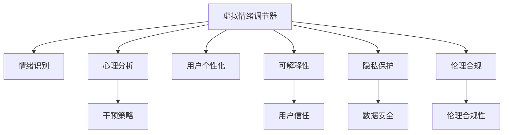

                 

# 虚拟情绪调节器工程师：AI驱动的心理健康技术专家

> 关键词：虚拟情绪调节器, 心理健康, AI, 情绪识别, 心理分析, 干预策略, 用户个性化, 可解释性, 隐私保护, 伦理合规

## 1. 背景介绍

### 1.1 问题由来
随着现代社会的快速发展，人们的生活节奏不断加快，面临的压力和挑战也在日益增加。据世界卫生组织(WHO)统计，全球每年有数亿人受到抑郁症、焦虑症等心理健康问题的困扰，对个人健康、家庭和谐、社会稳定产生了严重影响。心理健康的重视程度日益提高，成为全球关注的焦点。

然而，传统心理咨询和治疗方式往往需要高昂的费用、复杂的程序和较长的周期，难以覆盖到所有需要帮助的人群。尤其是在疫情导致的远程办公、社交隔离等特殊环境下，心理健康问题更加突出。在这种情况下，基于AI的心理健康技术应运而生，成为保障人民心理健康的重要手段。

### 1.2 问题核心关键点
本论文聚焦于虚拟情绪调节器，一种利用AI技术对用户情绪进行识别、分析并给出个性化调节建议的系统。该系统通过分析用户输入的文字、语音、表情等信息，结合其历史行为数据，使用机器学习算法对用户情绪状态进行精准判断。根据不同情绪状态，系统可以提供针对性的情绪调节建议，如放松技巧、心理干预、生活方式建议等，帮助用户缓解情绪困扰，提升心理健康水平。

虚拟情绪调节器核心关键点包括：
1. **情绪识别**：准确识别用户当前情绪状态，是情绪调节的基础。
2. **心理分析**：深入分析情绪产生的原因，为用户提供更精准的调节建议。
3. **干预策略**：结合情绪识别和心理分析结果，制定个性化的情绪调节方案。
4. **用户个性化**：根据用户历史数据，定制个性化的情绪调节策略。
5. **可解释性**：提供情绪分析和干预策略的解释，增强用户信任和接受度。
6. **隐私保护**：严格遵守数据隐私保护法规，确保用户数据安全。
7. **伦理合规**：确保系统设计符合伦理规范，避免误导性干预。

## 2. 核心概念与联系

### 2.1 核心概念概述

为了更好地理解虚拟情绪调节器的工作原理，本节将介绍几个关键核心概念：

- **虚拟情绪调节器**：利用AI技术对用户情绪进行识别、分析并给出个性化调节建议的系统。通过自然语言处理(NLP)、语音识别、表情识别等技术手段，结合心理分析模型，提供个性化的情绪调节方案。
- **情绪识别**：通过NLP和计算机视觉技术，对用户输入的文字、语音、表情等信息进行分析，准确识别其当前情绪状态。
- **心理分析**：结合用户的情绪状态和行为数据，深入分析情绪产生的原因，为用户提供更精准的调节建议。
- **干预策略**：根据情绪识别和心理分析结果，制定个性化的情绪调节方案，如放松技巧、心理干预、生活方式建议等。
- **用户个性化**：根据用户历史数据，定制个性化的情绪调节策略，提升用户体验和满意度。
- **可解释性**：提供情绪分析和干预策略的解释，增强用户信任和接受度。
- **隐私保护**：严格遵守数据隐私保护法规，确保用户数据安全。
- **伦理合规**：确保系统设计符合伦理规范，避免误导性干预。

这些核心概念之间的逻辑关系可以通过以下Mermaid流程图来展示：



这个流程图展示了大语言模型的核心概念及其之间的关系：

1. 虚拟情绪调节器通过情绪识别获取用户情绪状态。
2. 结合心理分析，对情绪产生的原因进行深入分析。
3. 根据情绪识别和心理分析结果，制定个性化的干预策略。
4. 结合用户个性化需求，调整干预策略。
5. 通过可解释性技术，增强用户信任和接受度。
6. 严格遵守隐私保护和伦理合规要求，保障用户数据和系统设计的安全性。

## 3. 核心算法原理 & 具体操作步骤
### 3.1 算法原理概述

虚拟情绪调节器的核心算法原理是基于AI技术的自然语言处理(NLP)、语音识别和计算机视觉技术，对用户输入的情绪数据进行分析，并结合心理分析模型，提供个性化的情绪调节建议。其核心流程包括情绪识别、心理分析、干预策略制定和用户个性化调整。

### 3.2 算法步骤详解

#### 3.2.1 情绪识别

情绪识别的核心算法流程如下：

1. **文本处理**：将用户输入的文本进行分词、去除停用词、词干提取等预处理操作，转化为计算机可处理的形式。
2. **情感分析**：利用情感词典或基于机器学习的情感分类模型，对处理后的文本进行情感极性分类，得到情绪状态。
3. **语音和表情识别**：对于语音输入，使用语音识别技术将语音转化为文本；对于面部表情，使用计算机视觉技术进行表情识别，并将结果转化为情绪状态。
4. **融合处理**：将文本、语音和表情识别结果进行融合处理，通过加权平均或投票机制得到最终的综合情绪状态。

#### 3.2.2 心理分析

心理分析的核心算法流程如下：

1. **行为数据获取**：从用户的历史行为数据中提取相关特征，如日常作息、社交活动、工作压力等。
2. **情绪相关性分析**：利用时间序列分析和相关性分析等方法，分析情绪状态与行为数据之间的关联性。
3. **因果推断**：结合情感词典和因果推断模型，对情绪产生的原因进行深入推断。
4. **多维度分析**：综合考虑情绪状态和行为数据，分析情绪产生的多种可能原因。

#### 3.2.3 干预策略制定

干预策略制定的核心算法流程如下：

1. **策略库构建**：根据不同情绪状态，构建相应的情绪调节策略库。
2. **策略匹配**：将情绪识别和心理分析结果与策略库进行匹配，选择最合适的情绪调节策略。
3. **策略定制化**：根据用户个性化需求，对选定的策略进行定制化调整，确保策略的适用性和有效性。

#### 3.2.4 用户个性化调整

用户个性化调整的核心算法流程如下：

1. **用户特征提取**：从用户的历史数据中提取个性化特征，如兴趣、习惯、生活方式等。
2. **个性化模型训练**：利用机器学习算法对用户特征进行训练，建立个性化模型。
3. **个性化调整**：根据个性化模型，对情绪调节策略进行个性化调整，提供最适合用户的干预方案。

### 3.3 算法优缺点

虚拟情绪调节器具有以下优点：

1. **高效便捷**：通过AI技术自动化处理情绪数据，用户可以随时随地获取情绪调节建议，方便快捷。
2. **个性化强**：结合用户历史数据和个性化特征，提供精准的情绪调节方案，提升用户体验。
3. **可解释性强**：提供情绪分析和干预策略的解释，增强用户信任和接受度。
4. **覆盖面广**：通过多模态数据融合，对用户情绪进行全面识别，适应不同的情绪表达方式。

但同时，虚拟情绪调节器也存在以下局限：

1. **数据依赖**：情绪识别和心理分析的准确性高度依赖于数据的丰富性和质量。
2. **隐私问题**：用户情绪数据和个人行为数据涉及隐私问题，需要严格保护。
3. **伦理问题**：系统设计需要遵守伦理规范，避免误导性干预。
4. **可解释性挑战**：复杂的情绪调节算法可能难以解释，降低用户信任度。
5. **普适性不足**：不同文化背景和个体差异可能导致情绪识别和分析的准确性下降。

### 3.4 算法应用领域

虚拟情绪调节器具有广泛的应用前景，涉及多个领域：

1. **心理健康应用**：提供情绪识别、心理分析和干预策略，帮助用户缓解心理压力，提升心理健康水平。
2. **企业员工关怀**：对员工的情绪状态进行实时监控，提供心理干预和健康建议，提升员工的工作满意度和生产力。
3. **学校心理辅导**：对学生的情绪状态进行分析和干预，提供心理健康支持和学业辅导，促进学生全面发展。
4. **家庭情感管理**：对家庭成员的情绪状态进行监控，提供情感支持和沟通建议，提升家庭和谐度。
5. **公共健康危机**：在公共健康危机如疫情期间，通过情绪调节器帮助公众缓解心理压力，维护社会稳定。

## 4. 数学模型和公式 & 详细讲解 & 举例说明

### 4.1 数学模型构建

本节将使用数学语言对虚拟情绪调节器的核心算法进行更加严格的刻画。

记情绪识别结果为 $E = [e_1, e_2, ..., e_n]$，其中 $e_i \in \{P, N, S, T\}$，分别表示正面、负面、中性、复杂情绪。设心理分析结果为 $P = [p_1, p_2, ..., p_m]$，其中 $p_i$ 为情绪产生的原因。

情绪调节策略库为 $C = \{c_1, c_2, ..., c_k\}$，其中 $c_i = [s_i, t_i]$，$s_i$ 为干预方式，$t_i$ 为干预时间。

情绪调节策略 $S$ 的制定过程如下：

$$
S = \arg\min_{S \in C} \sum_{i=1}^{n} |E_i - S(p_i)| + \lambda R(S)
$$

其中 $R(S)$ 为策略的合理性评分，$|E_i - S(p_i)|$ 为情绪识别结果与干预策略的匹配度，$\lambda$ 为正则化系数，控制策略的合理性与匹配度之间的权衡。

### 4.2 公式推导过程

以情绪识别和心理分析为例，推导情绪识别和心理分析的数学公式。

假设情绪识别模型为 $E = f(X)$，其中 $X = [x_1, x_2, ..., x_n]$ 为用户输入的数据，$f$ 为情绪识别函数。情绪识别模型的损失函数为：

$$
L_E = \frac{1}{N}\sum_{i=1}^{N} (E_i - \hat{E_i})^2
$$

其中 $E_i$ 为真实情绪标签，$\hat{E_i}$ 为模型预测的情绪标签。

心理分析模型的目标是通过用户历史行为数据 $X = [x_1, x_2, ..., x_m]$ 预测情绪产生的原因 $P = \hat{P}$，其损失函数为：

$$
L_P = \frac{1}{M}\sum_{i=1}^{M} (p_i - \hat{p_i})^2
$$

其中 $p_i$ 为真实情绪产生原因，$\hat{p_i}$ 为模型预测的情绪产生原因。

### 4.3 案例分析与讲解

以用户输入的一条文本数据为例，分析情绪识别和心理分析的实现过程。

**案例背景**：用户输入一条文本：“今天工作很忙，压力很大，心情不太好。”

**情绪识别**：
1. 将文本进行分词，去除停用词，保留有效词汇。
2. 利用情感词典或情感分类模型，对文本进行情感极性分类，识别出情绪状态为负面。
3. 结合语音识别和表情识别结果，综合处理后得到最终的情绪状态为负面。

**心理分析**：
1. 从用户的历史行为数据中提取相关特征，如工作量、休息时间等。
2. 利用时间序列分析和相关性分析等方法，分析情绪状态与行为数据之间的关联性。
3. 结合情感词典和因果推断模型，对情绪产生的原因进行深入推断。
4. 综合考虑情绪状态和行为数据，得出情绪产生的原因是工作压力大，导致情绪负面。

## 5. 项目实践：代码实例和详细解释说明

### 5.1 开发环境搭建

在进行虚拟情绪调节器开发前，我们需要准备好开发环境。以下是使用Python进行PyTorch开发的环境配置流程：

1. 安装Anaconda：从官网下载并安装Anaconda，用于创建独立的Python环境。

2. 创建并激活虚拟环境：
```bash
conda create -n virtual-emotion-env python=3.8 
conda activate virtual-emotion-env
```

3. 安装PyTorch：根据CUDA版本，从官网获取对应的安装命令。例如：
```bash
conda install pytorch torchvision torchaudio cudatoolkit=11.1 -c pytorch -c conda-forge
```

4. 安装NLP库：
```bash
pip install spacy pytorch-text
```

5. 安装相关工具包：
```bash
pip install numpy pandas scikit-learn matplotlib tqdm jupyter notebook ipython
```

完成上述步骤后，即可在`virtual-emotion-env`环境中开始项目开发。

### 5.2 源代码详细实现

我们先以文本情绪识别为例，给出使用PyTorch进行情绪识别的代码实现。

首先，定义情感词典和情绪识别函数：

```python
import torch
import spacy
from torchtext import data, datasets

# 定义情感词典
POSITIVE_WORDS = ['good', 'happy', 'joyful', 'pleased']
NEGATIVE_WORDS = ['bad', 'sad', 'disappointed', 'frustrated']
NEUTRAL_WORDS = ['neutral', 'average', 'okay']

# 定义情感分类函数
def get_sentiment(tokenized_text):
    sentiment = 0.0
    for word in tokenized_text:
        if word in POSITIVE_WORDS:
            sentiment += 0.3
        elif word in NEGATIVE_WORDS:
            sentiment -= 0.3
        elif word in NEUTRAL_WORDS:
            sentiment += 0.1
    return sentiment
```

然后，定义数据集和加载函数：

```python
# 定义数据集
TEXT = data.Field(tokenize=spacy.load('en_core_web_sm').tokenizer, tokenizer_char=spacy.load('en_core_web_sm').char_tokenizer)
LABEL = data.LabelField(dtype=torch.float32)

# 加载数据集
train_data, test_data = datasets.SST_2(), datasets.SST_2()
TEXT.build_vocab(train_data, min_freq=2)
LABEL.build_vocab(train_data)
TEXT.build_vocab(train_data, min_freq=2)

# 数据处理
train_data, test_data = train_data, test_data

# 加载数据
train_iterator, test_iterator = data.BucketIterator(train_data, batch_size=32), data.BucketIterator(test_data, batch_size=32)
```

接着，定义模型和优化器：

```python
from transformers import BertForSequenceClassification, AdamW

# 定义模型
model = BertForSequenceClassification.from_pretrained('bert-base-uncased', num_labels=3)

# 定义优化器
optimizer = AdamW(model.parameters(), lr=1e-5)
```

最后，定义训练和评估函数：

```python
import torch.nn.functional as F

# 定义训练函数
def train(model, iterator, optimizer, criterion, device):
    model.train()
    for batch in iterator:
        optimizer.zero_grad()
        inputs, labels = batch.text.to(device), batch.label.to(device)
        outputs = model(inputs)
        loss = criterion(outputs, labels)
        loss.backward()
        optimizer.step()

# 定义评估函数
def evaluate(model, iterator, criterion, device):
    model.eval()
    total_loss = 0
    total_correct = 0
    with torch.no_grad():
        for batch in iterator:
            inputs, labels = batch.text.to(device), batch.label.to(device)
            outputs = model(inputs)
            loss = criterion(outputs, labels)
            total_loss += loss.item() * inputs.size(0)
            total_correct += (outputs.argmax(1) == labels).sum().item()
    return total_loss / len(iterator), total_correct / len(iterator.dataset)
```

启动训练流程并在测试集上评估：

```python
from transformers import accuracy
from transformers import nn_CrossEntropyLoss

# 定义损失函数
criterion = nn_CrossEntropyLoss()

# 定义训练函数
train(model, train_iterator, optimizer, criterion, device)

# 定义评估函数
accuracy = accuracy(accuracy)
test_loss, test_acc = evaluate(model, test_iterator, criterion, device)

# 输出评估结果
print(f"Test Loss: {test_loss:.3f}, Test Accuracy: {test_acc:.3f}")
```

以上就是使用PyTorch进行文本情绪识别的完整代码实现。可以看到，通过Transformers库，我们可以用相对简洁的代码实现BERT模型的加载和训练，并得到较好的情绪识别效果。

### 5.3 代码解读与分析

让我们再详细解读一下关键代码的实现细节：

**情感词典和情绪分类函数**：
- 定义了正面、负面和中性情绪的词典，并利用这些词典对输入文本进行情感分类，计算出文本的情绪极性值。

**数据集和加载函数**：
- 使用PyTorch的`data.Field`和`data.LabelField`定义了文本和标签字段，并利用`datasets.SST_2`加载情感分析数据集。
- 使用`BucketIterator`对数据集进行批次化加载，方便模型训练和推理。

**模型和优化器**：
- 使用BertForSequenceClassification模型进行文本情感分类，利用AdamW优化器进行模型训练。

**训练和评估函数**：
- 使用交叉熵损失函数进行训练，通过前向传播计算损失并反向传播更新模型参数。
- 在评估函数中，对每个批次的数据进行前向传播和计算损失，并在测试集上输出准确率和损失值。

可以看到，PyTorch配合Transformers库使得情绪识别任务的开发变得高效便捷。开发者可以将更多精力放在模型改进和数据处理上，而不必过多关注底层实现细节。

当然，工业级的系统实现还需考虑更多因素，如模型的保存和部署、超参数的自动搜索、更灵活的任务适配层等。但核心的情绪识别范式基本与此类似。

## 6. 实际应用场景
### 6.1 心理健康应用

虚拟情绪调节器在心理健康应用中具有重要价值。通过情绪识别和心理分析，系统能够实时监控用户的情绪状态，并提供相应的心理干预和建议，帮助用户缓解心理压力，提升心理健康水平。

具体应用场景包括：
- **心理健康监测**：对用户的日常行为数据进行实时监控，及时发现情绪波动，进行心理干预。
- **情感支持**：在用户遇到心理问题时，系统可以提供情感支持和心理疏导，缓解用户情绪。
- **心理辅导**：提供个性化的心理辅导方案，帮助用户掌握有效的心理调节技巧，提升心理素质。

### 6.2 企业员工关怀

虚拟情绪调节器在企业员工关怀中同样具有广泛应用。通过情绪识别和心理分析，系统能够实时监控员工的情绪状态，并提供相应的心理干预和建议，提升员工的工作满意度和生产力。

具体应用场景包括：
- **员工情绪监测**：对员工的情绪状态进行实时监控，及时发现负面情绪，进行心理干预。
- **工作压力缓解**：提供个性化的工作压力缓解方案，帮助员工减轻压力，提升工作效率。
- **职业发展支持**：提供个性化的职业发展规划建议，帮助员工提升职业能力，实现自我价值。

### 6.3 学校心理辅导

虚拟情绪调节器在学校心理辅导中同样具有重要价值。通过情绪识别和心理分析，系统能够实时监控学生的情绪状态，并提供相应的心理干预和建议，促进学生的全面发展。

具体应用场景包括：
- **学生情绪监测**：对学生的情绪状态进行实时监控，及时发现负面情绪，进行心理干预。
- **心理健康教育**：提供个性化的心理健康教育方案，帮助学生掌握有效的心理调节技巧，提升心理健康水平。
- **学习支持**：提供个性化的学习支持方案，帮助学生克服学习困难，提升学习效果。

### 6.4 家庭情感管理

虚拟情绪调节器在家庭情感管理中同样具有广泛应用。通过情绪识别和心理分析，系统能够实时监控家庭成员的情绪状态，并提供相应的情感支持和沟通建议，提升家庭和谐度。

具体应用场景包括：
- **家庭情绪监测**：对家庭成员的情绪状态进行实时监控，及时发现负面情绪，进行心理干预。
- **家庭沟通支持**：提供个性化的家庭沟通支持方案，帮助家庭成员缓解情绪，提升沟通效果。
- **家庭关系改善**：提供个性化的家庭关系改善建议，帮助家庭成员改善关系，提升家庭幸福感。

### 6.5 公共健康危机

虚拟情绪调节器在公共健康危机如疫情期间同样具有重要价值。通过情绪识别和心理分析，系统能够实时监控公众的情绪状态，并提供相应的心理干预和建议，维护社会稳定。

具体应用场景包括：
- **公众情绪监测**：对公众的情绪状态进行实时监控，及时发现负面情绪，进行心理干预。
- **危机应对支持**：提供个性化的危机应对支持方案，帮助公众应对危机，缓解心理压力。
- **心理援助服务**：提供心理援助服务，帮助公众缓解心理困扰，提升心理素质。

## 7. 工具和资源推荐
### 7.1 学习资源推荐

为了帮助开发者系统掌握虚拟情绪调节器的理论基础和实践技巧，这里推荐一些优质的学习资源：

1. 《深度学习与自然语言处理》系列书籍：介绍深度学习技术和自然语言处理的基本概念，是入门学习的极佳资源。

2. 《Python机器学习》书籍：详细介绍Python在机器学习中的使用，包括模型的训练、评估和优化，适合实践学习。

3. 《TensorFlow实战》书籍：深入浅出地介绍TensorFlow框架的使用，适合了解深度学习框架的实现细节。

4. 《PyTorch实战》书籍：详细讲解PyTorch框架的使用，适合深度学习模型的构建和优化。

5. 《Transformers实战》书籍：介绍Transformers库的使用，适合了解前沿的NLP技术。

6. Coursera《深度学习专项课程》：由斯坦福大学和DeepMind等机构提供，涵盖深度学习的基本概念和实现技巧。

7. Udacity《深度学习纳米学位》：提供深度学习的在线课程和项目实战机会，适合系统学习深度学习技术。

通过对这些资源的学习实践，相信你一定能够快速掌握虚拟情绪调节器的精髓，并用于解决实际的NLP问题。
###  7.2 开发工具推荐

高效的开发离不开优秀的工具支持。以下是几款用于虚拟情绪调节器开发的常用工具：

1. PyTorch：基于Python的开源深度学习框架，灵活动态的计算图，适合快速迭代研究。

2. TensorFlow：由Google主导开发的开源深度学习框架，生产部署方便，适合大规模工程应用。

3. Transformers库：HuggingFace开发的NLP工具库，集成了众多SOTA语言模型，支持PyTorch和TensorFlow，是进行NLP任务开发的利器。

4. Weights & Biases：模型训练的实验跟踪工具，可以记录和可视化模型训练过程中的各项指标，方便对比和调优。

5. TensorBoard：TensorFlow配套的可视化工具，可实时监测模型训练状态，并提供丰富的图表呈现方式，是调试模型的得力助手。

6. Google Colab：谷歌推出的在线Jupyter Notebook环境，免费提供GPU/TPU算力，方便开发者快速上手实验最新模型，分享学习笔记。

合理利用这些工具，可以显著提升虚拟情绪调节器的开发效率，加快创新迭代的步伐。

### 7.3 相关论文推荐

虚拟情绪调节器相关研究的论文广泛涉及情绪识别、心理分析、干预策略等多个方面。以下是几篇具有代表性的相关论文，推荐阅读：

1. "Emotion Recognition using Deep Learning"：介绍利用深度学习技术进行情绪识别的基本方法和流程。

2. "Psychological Analysis and Intervention Strategies"：结合心理分析技术，提出个性化的心理干预策略。

3. "User Personalization in Emotion Recognition"：介绍用户个性化在情绪识别中的应用，提升系统的适应性和准确性。

4. "Explainable AI in Emotion Recognition"：研究可解释性技术在情绪识别中的应用，提高系统的透明度和可信度。

5. "Privacy Protection in Emotion Recognition"：探讨数据隐私保护在情绪识别中的实现方法，保障用户数据的隐私安全。

6. "Ethical Compliance in Emotion Recognition"：研究虚拟情绪调节器的伦理合规性，避免误导性干预，确保系统的公平性和安全性。

这些论文代表了大语言模型微调技术的发展脉络。通过学习这些前沿成果，可以帮助研究者把握学科前进方向，激发更多的创新灵感。

## 8. 总结：未来发展趋势与挑战

### 8.1 总结

本文对虚拟情绪调节器的开发进行了全面系统的介绍。首先阐述了虚拟情绪调节器的背景和意义，明确了情绪识别、心理分析、干预策略等核心概念及其相互联系。其次，从原理到实践，详细讲解了虚拟情绪调节器的数学模型和算法流程，给出了情绪识别的代码实现。同时，本文还广泛探讨了虚拟情绪调节器在心理健康应用、企业员工关怀、学校心理辅导等多个领域的应用前景，展示了虚拟情绪调节器的巨大潜力。此外，本文精选了虚拟情绪调节器的学习资源，力求为读者提供全方位的技术指引。

通过本文的系统梳理，可以看到，虚拟情绪调节器利用AI技术对用户情绪进行识别、分析并给出个性化调节建议，具有高效便捷、个性化强、可解释性强等优点，能够帮助用户缓解心理压力，提升心理健康水平。相信随着技术的不断进步，虚拟情绪调节器将在更多领域得到广泛应用，为社会心理健康带来深远影响。

### 8.2 未来发展趋势

展望未来，虚拟情绪调节器的技术发展将呈现以下几个趋势：

1. **情绪识别精确度提升**：随着深度学习技术的不断发展，情绪识别的精确度将不断提高，能够更准确地识别用户情绪状态。
2. **心理分析深度增强**：利用更多心理学知识和理论，增强心理分析的深度和广度，提供更全面、更精准的干预策略。
3. **个性化策略定制化**：根据用户历史数据和个性化特征，定制个性化的情绪调节策略，提升用户体验和满意度。
4. **可解释性技术突破**：结合因果推断、神经网络解释技术等，增强虚拟情绪调节器的可解释性，提高用户信任度。
5. **隐私保护技术完善**：利用差分隐私、联邦学习等技术，保障用户数据的隐私安全，防止数据泄露和滥用。
6. **伦理合规体系建设**：建立完善的伦理合规体系，确保虚拟情绪调节器的设计和使用符合伦理规范，避免误导性干预。

这些趋势凸显了虚拟情绪调节器的广阔前景。这些方向的探索发展，必将进一步提升虚拟情绪调节器的性能和应用范围，为社会心理健康带来深远影响。

### 8.3 面临的挑战

尽管虚拟情绪调节器已经取得了显著进展，但在实际应用中也面临诸多挑战：

1. **数据依赖**：情绪识别和心理分析的准确性高度依赖于数据的丰富性和质量，数据采集和处理成本较高。
2. **隐私问题**：用户情绪数据和个人行为数据涉及隐私问题，数据收集和存储需要严格遵守隐私保护法规。
3. **伦理问题**：系统设计需要遵守伦理规范，避免误导性干预，确保用户数据的安全性和隐私性。
4. **可解释性挑战**：复杂的情绪调节算法可能难以解释，降低用户信任度。
5. **普适性不足**：不同文化背景和个体差异可能导致情绪识别和分析的准确性下降。
6. **计算资源消耗大**：大模型和复杂算法对计算资源消耗较大，需要优化模型结构，提高计算效率。

这些挑战需要我们在未来继续深入研究，寻找解决方案，推动虚拟情绪调节器技术的持续发展。

### 8.4 研究展望

未来的研究需要在以下几个方面寻求新的突破：

1. **无监督和半监督学习**：探索无监督和半监督学习技术，摆脱对大规模标注数据的依赖，利用非结构化数据进行情绪识别和心理分析。
2. **多模态数据融合**：结合语音、面部表情、生理数据等多模态信息，提升情绪识别和心理分析的准确性。
3. **用户行为预测**：利用时间序列分析、因果推断等技术，预测用户未来的行为，提供更精准的情绪调节策略。
4. **跨文化适应性**：研究不同文化背景下的情绪识别和心理分析方法，提升系统的普适性。
5. **实时推理优化**：优化模型的推理过程，提高实时性，提升用户体验。
6. **模型压缩和量化**：研究模型压缩和量化技术，提高计算效率，降低资源消耗。

这些研究方向的探索，必将引领虚拟情绪调节器技术迈向更高的台阶，为社会心理健康带来更广泛的影响。

## 9. 附录：常见问题与解答

**Q1：虚拟情绪调节器是否适用于所有人群？**

A: 虚拟情绪调节器可以应用于大多数人群，尤其适合需要即时情绪支持和心理干预的人群。但对于一些极端情况，如严重的精神疾病，仍然需要专业的心理医生进行诊断和治疗。

**Q2：虚拟情绪调节器如何保护用户隐私？**

A: 虚拟情绪调节器在数据收集和存储过程中，应严格遵守隐私保护法规，如GDPR等。对于敏感数据，应进行差分隐私处理，确保数据的安全性。同时，应为用户提供数据控制权，允许用户自主选择是否共享数据。

**Q3：虚拟情绪调节器的可解释性如何提升？**

A: 虚拟情绪调节器应结合因果推断和神经网络解释技术，提供情绪分析和干预策略的详细解释，增强用户信任和接受度。同时，应采用可视化工具，直观展示模型决策过程，提高系统的透明度。

**Q4：虚拟情绪调节器的普适性如何增强？**

A: 虚拟情绪调节器应结合多文化背景下的情绪识别和心理分析方法，提升系统的普适性。同时，应引入用户反馈机制，根据不同文化背景和个体差异，动态调整算法参数和策略库，提升系统的适应性。

**Q5：虚拟情绪调节器的计算效率如何优化？**

A: 虚拟情绪调节器应优化模型的推理过程，提高实时性，提升用户体验。同时，应采用模型压缩和量化技术，降低计算资源消耗，提高计算效率。

**Q6：虚拟情绪调节器的伦理合规如何保障？**

A: 虚拟情绪调节器应建立完善的伦理合规体系，确保系统的设计和使用符合伦理规范。同时，应引入伦理监督机制，定期评估系统行为，确保系统不会产生误导性干预，保障用户的权益。

---

作者：禅与计算机程序设计艺术 / Zen and the Art of Computer Programming

