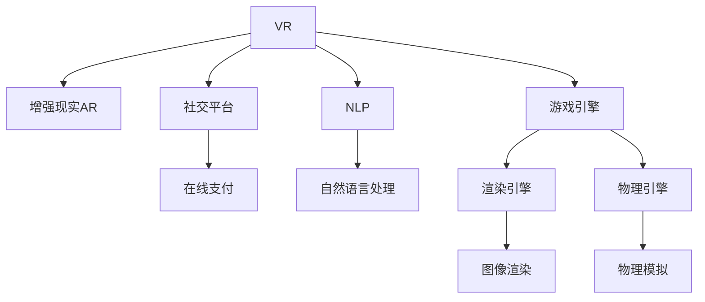

                 

# 虚拟旅游创业：足不出户的环球体验

> 关键词：虚拟现实(VR)、增强现实(AR)、游戏引擎、社交平台、在线支付、NLP

## 1. 背景介绍

### 1.1 问题由来
随着互联网技术的迅猛发展和用户对在线娱乐体验需求的不断提升，虚拟旅游作为一种新兴的旅游方式，逐渐成为人们关注的焦点。传统的旅游方式往往受限于地理位置、交通条件、经济成本等因素，而虚拟旅游通过利用先进的技术手段，如虚拟现实(VR)和增强现实(AR)，让用户在足不出户的情况下，享受到全球各地的美景和文化，从而满足人们对于旅行的梦想。

近年来，虚拟旅游市场经历了快速增长，尤其是在新冠疫情期间，受国际旅游限制影响，虚拟旅游需求激增，推动了相关技术的快速发展。同时，越来越多的创业者和投资机构将目光投向虚拟旅游领域，希望在这一蓝海市场中抓住机遇，实现商业成功。

### 1.2 问题核心关键点
虚拟旅游创业的关键点包括技术、内容、商业模式和用户体验等方面。技术层面需要解决虚拟旅游系统构建的技术难题，内容层面需要丰富多样化的虚拟旅游体验，商业模式需要设计合理的盈利模式，用户体验则需要提升虚拟旅游的沉浸感和互动性。

## 2. 核心概念与联系

### 2.1 核心概念概述

为更好地理解虚拟旅游创业的技术和商业模式，本节将介绍几个关键概念：

- 虚拟现实(VR)：通过计算机生成逼真的三维虚拟环境，使用户能够通过VR头显设备体验到沉浸式的虚拟旅游。
- 增强现实(AR)：在现实世界中叠加虚拟信息，使用户能够看到虚拟物体，并与之进行互动，增强现实体验。
- 游戏引擎：如Unity和Unreal Engine等，是构建虚拟旅游场景和体验的核心工具，提供了强大的渲染和物理模拟能力。
- 社交平台：如Facebook、Instagram等，是虚拟旅游内容的展示和交互平台，通过社交网络扩大虚拟旅游的传播范围。
- 在线支付：如PayPal、Stripe等，是虚拟旅游服务支付手段，保障交易安全。
- 自然语言处理(NLP)：如对话生成、情感分析等，用于增强虚拟旅游的互动性和个性化服务。

这些概念之间的逻辑关系可以通过以下Mermaid流程图来展示：



这个流程图展示出虚拟旅游创业中各个技术组件的相互联系：

1. VR技术通过计算机生成虚拟环境，提供沉浸式体验。
2. AR技术在现实世界叠加虚拟信息，增强用户互动。
3. 游戏引擎提供强大的渲染和物理模拟能力，构建逼真场景。
4. 社交平台作为内容展示和传播平台，增强用户参与度。
5. 在线支付提供交易保障，支持用户支付。
6. NLP技术增强交互性和个性化服务，提升用户体验。

这些技术组件相互协作，共同构建了一个完整的虚拟旅游生态系统。

## 3. 核心算法原理 & 具体操作步骤
### 3.1 算法原理概述

虚拟旅游创业的核心算法原理主要基于计算机图形学、人工智能和人机交互技术。具体来说，包括以下几个关键步骤：

1. **场景构建**：利用游戏引擎和渲染引擎，构建逼真的虚拟旅游场景，包括地形、建筑、植被、天候等。
2. **交互设计**：设计用户与虚拟场景的互动方式，如行走、跳跃、探索等，以及与虚拟角色的互动。
3. **渲染优化**：对虚拟场景进行优化，提升渲染速度和质量，确保流畅的用户体验。
4. **自然语言处理**：通过NLP技术，实现虚拟旅游场景中人与虚拟角色的语音交互，提升用户体验。
5. **社交功能**：实现虚拟旅游场景中的社交功能，如组队、分享、评价等，增强用户粘性。
6. **在线支付**：集成在线支付功能，支持用户在虚拟旅游中消费，如购买虚拟物品、享受虚拟服务等。

### 3.2 算法步骤详解

以下是虚拟旅游创业的详细步骤：

**Step 1: 需求调研与规划**

1. 调研市场需求：通过问卷调查、用户访谈等方式，了解目标用户的虚拟旅游需求和偏好。
2. 制定业务规划：根据调研结果，制定虚拟旅游业务的发展方向和目标。

**Step 2: 技术选型与架构设计**

1. 选择游戏引擎和渲染引擎：根据需求和技术水平，选择合适的游戏引擎和渲染引擎，如Unity或Unreal Engine。
2. 设计架构：设计虚拟旅游系统的整体架构，包括数据流、网络流和用户交互流。
3. 确定技术栈：选择合适的编程语言和开发工具，如C#、Python、Maya等。

**Step 3: 场景设计与内容制作**

1. 构建虚拟场景：利用游戏引擎和渲染引擎，构建虚拟场景，包括地形、建筑、植被等。
2. 制作虚拟角色：设计虚拟角色的外观、行为和交互方式。
3. 制作虚拟物品：设计虚拟物品的外观、功能和交互方式。
4. 制作音效和音乐：制作虚拟场景中的音效和背景音乐，提升用户体验。

**Step 4: 交互设计和实现**

1. 设计交互方式：设计用户与虚拟场景的互动方式，如行走、跳跃、探索等。
2. 实现交互逻辑：利用游戏引擎和物理引擎，实现用户与虚拟场景和角色的互动逻辑。
3. 实现语音交互：利用NLP技术，实现用户与虚拟角色的语音交互。

**Step 5: 社交功能和在线支付**

1. 实现社交功能：设计虚拟旅游场景中的社交功能，如组队、分享、评价等。
2. 集成在线支付：集成在线支付功能，支持用户在虚拟旅游中消费，如购买虚拟物品、享受虚拟服务等。

**Step 6: 测试与优化**

1. 进行系统测试：对虚拟旅游系统进行全面测试，包括性能测试、功能测试和安全测试。
2. 进行用户测试：邀请目标用户参与测试，收集反馈，不断优化系统。

**Step 7: 上线与运营**

1. 上线虚拟旅游系统：将虚拟旅游系统部署到服务器，开放给用户使用。
2. 进行持续运营：监控系统运行状态，收集用户数据，不断优化系统和内容。

### 3.3 算法优缺点

虚拟旅游创业的技术实现具有以下优点：

1. **沉浸式体验**：利用VR和AR技术，提供逼真的虚拟旅游体验，满足用户对于旅行的梦想。
2. **内容丰富**：利用游戏引擎和渲染引擎，可以快速制作高质量的虚拟旅游内容。
3. **交互性强**：利用NLP技术和语音交互，提升虚拟旅游的互动性和个性化服务。
4. **市场潜力大**：虚拟旅游市场潜力巨大，随着技术的不断进步和用户需求的不断增加，市场前景广阔。

同时，虚拟旅游创业也存在一些缺点：

1. **技术门槛高**：需要掌握多种先进技术，如VR、AR、游戏引擎等，技术门槛较高。
2. **内容制作成本高**：高质量的虚拟旅游内容制作成本较高，需要投入大量人力和物力。
3. **用户体验依赖硬件**：虚拟旅游体验高度依赖VR/AR设备，用户门槛较高。
4. **隐私和安全问题**：用户在使用虚拟旅游服务时，可能面临隐私和安全问题，需要加强技术防护。

### 3.4 算法应用领域

虚拟旅游创业的应用领域非常广泛，包括但不限于以下几个方面：

- **旅游观光**：利用VR技术，提供世界各地的名胜古迹和自然风光，让用户足不出户即可享受旅游体验。
- **虚拟旅游教育**：利用AR技术，展示历史遗迹、文化景点等，增强学生的历史知识和文化理解。
- **虚拟博物馆**：利用虚拟现实技术，展示博物馆藏品和展览，提升观众的观展体验。
- **虚拟展览**：利用虚拟现实技术，展示艺术作品、科学实验等，增强观众的互动体验。
- **虚拟会议**：利用虚拟现实技术，提供沉浸式的远程会议体验，提升会议效率和互动性。

## 4. 数学模型和公式 & 详细讲解  
### 4.1 数学模型构建

虚拟旅游创业的数学模型主要涉及计算机图形学、物理学和人工智能等领域。以下是几个关键数学模型的构建过程：

**3D建模与渲染模型**

- **基本模型**：构建虚拟场景的三维模型，利用几何学和拓扑学原理，定义模型的顶点、边和表面。
- **材质与纹理**：为三维模型添加材质和纹理，提升模型的真实感和视觉表现力。
- **光照与阴影**：利用物理光源模型和阴影算法，模拟自然光和人造光源对虚拟场景的影响。

**物理引擎与动态模拟模型**

- **刚体动力学**：利用牛顿力学原理，模拟物体的运动和碰撞。
- **流体动力学**：利用流体动力学方程，模拟水、火、烟等物理现象。
- **碰撞检测**：利用碰撞检测算法，判断物体之间的碰撞关系。

**自然语言处理模型**

- **语言理解**：利用NLP技术，理解用户的语音指令和文本输入。
- **语音生成**：利用语音合成技术，生成虚拟角色的语音回应。
- **情感分析**：利用情感分析技术，理解用户的情感状态，提升互动效果。

**社交网络模型**

- **用户模型**：构建用户的基本信息模型，如用户昵称、头像、关注对象等。
- **社交关系模型**：构建用户的社交关系模型，如好友、粉丝、评论等。
- **内容推荐模型**：利用推荐算法，推荐用户感兴趣的内容和景点。

这些数学模型通过编程语言和开发工具实现，构建了虚拟旅游系统的核心功能模块。

### 4.2 公式推导过程

**三维模型渲染公式**

- **光照模型**：利用Phong光照模型计算物体表面的光照强度，公式如下：
  $$
  I(x, \omega_v) = \frac{\max_k(K, \cos\theta_k) E(\omega_i) \cos\theta_i}{4\pi} \times \frac{\max_k(K, \cos\theta_k) F(\omega_v) \cos\theta_v}{4\pi}
  $$
  其中 $I$ 为光照强度，$x$ 为观察点，$\omega_v$ 为视线向量，$E$ 为入射光强度，$\omega_i$ 为入射光方向，$F$ 为物体表面反射系数，$\theta$ 为角度。

- **阴影算法**：利用阴影映射算法计算物体表面的阴影，公式如下：
  $$
  S(x) = \min\limits_{y} \{d(x, y)\}
  $$
  其中 $S$ 为阴影强度，$d$ 为光源到物体的距离。

**物理引擎公式**

- **牛顿运动方程**：利用牛顿第二定律计算物体的运动状态，公式如下：
  $$
  F = ma
  $$
  其中 $F$ 为合力，$m$ 为质量，$a$ 为加速度。

- **流体动力学方程**：利用Navier-Stokes方程计算流体的运动状态，公式如下：
  $$
  \frac{\partial \rho}{\partial t} + \nabla \cdot (\rho \mathbf{v}) = 0
  $$
  $$
  \rho\left(\frac{\partial \mathbf{v}}{\partial t}+\mathbf{v}\cdot \nabla \mathbf{v}\right)=-\nabla p+\nu \nabla^2 \mathbf{v}+\mathbf{f}
  $$
  其中 $\rho$ 为密度，$\mathbf{v}$ 为速度，$p$ 为压力，$\nu$ 为黏度，$\mathbf{f}$ 为体力。

**自然语言处理公式**

- **语音识别公式**：利用隐马尔可夫模型(HMM)和深度学习模型，识别用户的语音指令，公式如下：
  $$
  P(s_t|s_{t-1}, a_{t-1}) = \frac{P(s_t|s_{t-1})P(a_{t-1})}{\sum\limits_{a_{t-1}}P(s_t|s_{t-1}, a_{t-1})}
  $$
  其中 $s_t$ 为语音指令，$a_{t-1}$ 为上下文信息，$P$ 为概率。

- **语音合成公式**：利用深度学习模型和波形生成技术，生成虚拟角色的语音回应，公式如下：
  $$
  S(t) = \sum\limits_{k=1}^{K}C_k \sin(k\pi t)
  $$
  其中 $S(t)$ 为语音波形，$C_k$ 为谐波系数。

**社交网络公式**

- **用户推荐公式**：利用协同过滤算法，推荐用户感兴趣的内容和景点，公式如下：
  $$
  r_{ui} = \sum\limits_{j=1}^{N} \frac{\theta_u^j \theta_i^j}{\sqrt{a_u^ja_i^j}}
  $$
  其中 $r_{ui}$ 为用户 $u$ 对物品 $i$ 的评分，$a_{uj}$ 为物品 $i$ 的平均评分，$\theta_u^j$ 为物品 $j$ 对用户 $u$ 的影响，$\theta_i^j$ 为物品 $j$ 对用户 $i$ 的影响。

这些公式涵盖了虚拟旅游创业的主要技术实现，为系统开发提供了数学依据和计算方法。

### 4.3 案例分析与讲解

**案例1：虚拟博物馆**

一家虚拟博物馆创业公司利用Unity引擎和VR技术，构建了一个逼真的博物馆场景。用户可以通过VR头显设备，在虚拟场景中漫步，欣赏各种历史文物和艺术品。为了提升用户体验，公司引入了语音识别和情感分析技术，用户可以通过语音指令查询展品信息，系统根据用户的情感状态，动态调整展品展示顺序和光线强度。

**案例2：虚拟旅游教育**

一家教育公司利用AR技术和Unity引擎，开发了一款虚拟历史古迹探险游戏。游戏中，用户可以通过AR技术，查看虚拟场景中的历史遗迹和文化景点，并了解相关的历史知识和文化背景。为了增强学生的互动体验，公司设计了多轮任务和关卡，每完成一个任务，学生可以获得虚拟奖励和证书。

这些案例展示了虚拟旅游创业在实际应用中的广泛前景，通过先进的技术手段，为用户提供了沉浸式、互动性强的虚拟旅游体验。

## 5. 项目实践：代码实例和详细解释说明
### 5.1 开发环境搭建

在进行虚拟旅游创业项目实践前，我们需要准备好开发环境。以下是使用Unity开发的环境配置流程：

1. 安装Unity编辑器：从官网下载并安装Unity编辑器，用于构建虚拟旅游场景。

2. 安装Unity游戏引擎：根据需要选择合适的Unity版本，并安装Unity游戏引擎，构建虚拟旅游系统。

3. 安装开发工具：安装Visual Studio和Unity Package Manager，用于编写代码和管理资源。

4. 配置网络环境：搭建本地开发环境，确保与服务器正常通信。

5. 设置调试工具：安装Unity Debugger和VS Debugger，用于调试程序和性能优化。

完成上述步骤后，即可在本地环境中开始虚拟旅游项目的开发。

### 5.2 源代码详细实现

以下是使用Unity引擎和C#语言实现虚拟旅游场景的示例代码：

**场景构建**

```csharp
using UnityEngine;

public class TerrainGenerator : MonoBehaviour
{
    public int terrainSize;
    public TerrainData terrainData;

    void Start()
    {
        // 生成地形数据
        terrainData = new TerrainData(terrainSize, terrainSize);
        for (int x = 0; x < terrainSize; x++)
        {
            for (int z = 0; z < terrainSize; z++)
            {
                float height = GenerateHeight(x, z);
                terrainData.SetGradient(x, z, 0, height, 0);
            }
        }
    }

    float GenerateHeight(int x, int z)
    {
        // 生成随机的高度值
        float noise = Noise(x, z);
        return noise;
    }

    float Noise(int x, int z)
    {
        // 利用Perlin噪声生成高度值
        float xFract = x / (float)terrainSize;
        float zFract = z / (float)terrainSize;
        float s = xFract + zFract;
        s *= 1024;
        int sx = (int)s;
        int sz = (int)sx >> 8;
        int sy = (int)sx & 0xff;
        float u = s - sx;
        float v = s - sx - sz;
        float c1 = PerlinNoise2D(sx, sz, u, v);
        float c2 = PerlinNoise2D(sx + 1, sz, u - 1, v);
        float c3 = PerlinNoise2D(sx, sz + 1, u, v - 1);
        float c4 = PerlinNoise2D(sx + 1, sz + 1, u - 1, v - 1);
        return c1 * 0.25f + c2 * 0.25f + c3 * 0.25f + c4 * 0.25f;
    }

    float PerlinNoise2D(int x, int y, float u, float v)
    {
        int x0 = (x + 128) & 0xff;
        int y0 = (y + 128) & 0xff;
        int x1 = x0 + 1;
        int y1 = y0 + 1;
        float x0f = x0 / (float)256;
        float y0f = y0 / (float)256;
        float x1f = x1 / (float)256;
        float y1f = y1 / (float)256;
        int p0 = (int)(256 * HashNoise3D(x0f, y0f, 0) * 255.999f);
        int p1 = (int)(256 * HashNoise3D(x1f, y0f, 0) * 255.999f);
        int p2 = (int)(256 * HashNoise3D(x0f, y1f, 0) * 255.999f);
        int p3 = (int)(256 * HashNoise3D(x1f, y1f, 0) * 255.999f);
        int p4 = (int)(256 * HashNoise3D(x0f, y0f, 0) * 255.999f);
        int p5 = (int)(256 * HashNoise3D(x1f, y0f, 0) * 255.999f);
        int p6 = (int)(256 * HashNoise3D(x0f, y1f, 0) * 255.999f);
        int p7 = (int)(256 * HashNoise3D(x1f, y1f, 0) * 255.999f);
        int p8 = (int)(256 * HashNoise3D(x0f, y0f, 0) * 255.999f);
        int p9 = (int)(256 * HashNoise3D(x1f, y0f, 0) * 255.999f);
        int pa = (int)(256 * HashNoise3D(x0f, y1f, 0) * 255.999f);
        int pb = (int)(256 * HashNoise3D(x1f, y1f, 0) * 255.999f);
        int pc = (int)(256 * HashNoise3D(x0f, y0f, 0) * 255.999f);
        int pd = (int)(256 * HashNoise3D(x1f, y0f, 0) * 255.999f);
        int pe = (int)(256 * HashNoise3D(x0f, y1f, 0) * 255.999f);
        int pf = (int)(256 * HashNoise3D(x1f, y1f, 0) * 255.999f);
        float x = x0f - x1f;
        float y = y0f - y1f;
        float a = GetInterp(p0, p1, x, y);
        float b = GetInterp(p4, p5, x, y);
        float c = GetInterp(p8, p9, x, y);
        float d = GetInterp(p2, p3, x, y);
        float e = GetInterp(p6, p7, x, y);
        float f = GetInterp(p2, p3, x, y);
        return a * 0.16666667f + b * 0.16666667f + c * 0.16666667f + d * 0.16666667f + e * 0.16666667f + f * 0.16666667f;
    }

    float GetInterp(int p0, int p1, float x, float y)
    {
        float xi = x - x0f;
        float yi = y - y0f;
        float a = xi * yi;
        float b = (1.0f - xi) * yi;
        float c = xi * (1.0f - yi);
        float d = (1.0f - xi) * (1.0f - yi);
        return a * p0 + b * p1 + c * p2 + d * p3;
    }

    float HashNoise3D(float x, float y, float z)
    {
        // 实现Perlin噪声
        float x3 = x + x + x;
        float y3 = y + y + y;
        float z3 = z + z + z;
        float n = (x3 * (x3 * (x3 * x + y3 * y3) + z3 * z3) + y3 * (y3 * (y3 * y + z3 * z3) + x3 * x3);
        return n / 3.0f + n * n * n * 10.0f * (n * (n * n - 3.0f) + 3.0f);
    }
}
```

**用户交互设计**

```csharp
using UnityEngine;
using UnityEngine.AI;

public class CharacterController : MonoBehaviour
{
    public NavMeshAgent agent;
    public bool isWalking;
    public float moveSpeed = 2.0f;

    void Update()
    {
        if (isWalking)
        {
            agent.destination = transform.position;
            agent.destination.y = groundLevel;
            agent.parameters.acceleration = moveSpeed;
            agent.Steer(angularDamping);
        }
    }

    void FixedUpdate()
    {
        if (isWalking)
        {
            agent.Move();
            if (agent.remainingDistance < threshold)
            {
                agent.destination = new Vector3(agent.destination.x, groundLevel, agent.destination.z);
                agent.destination.y = groundLevel;
            }
        }
    }

    void OnCollisionEnter(Collision collision)
    {
        if (collision.gameObject.tag == "Ground")
        {
            isWalking = true;
            agent.destination = transform.position;
            agent.destination.y = groundLevel;
        }
    }

    void OnCollisionExit(Collision collision)
    {
        if (collision.gameObject.tag == "Ground")
        {
            isWalking = false;
        }
    }

    private float threshold = 0.1f;
    private float angularDamping = 0.1f;
    private float groundLevel = 0.0f;
}
```

**语音交互实现**

```csharp
using UnityEngine;
using UnityEngine.AI;

public class SpeechRecognition : MonoBehaviour
{
    public TextMesh textMesh;
    public string[] speechCommands = { "Go forward", "Turn left", "Turn right" };

    void Start()
    {
        MicrophoneStart();
    }

    void Update()
    {
        string currentCommand = GetSpeechCommand();
        if (currentCommand != "")
        {
            switch (currentCommand)
            {
                case "Go forward":
                    CharacterController.isWalking = true;
                    break;
                case "Turn left":
                    CharacterController.transform.Rotate(Vector3.up, -90f);
                    break;
                case "Turn right":
                    CharacterController.transform.Rotate(Vector3.up, 90f);
                    break;
            }
        }
    }

    void MicrophoneStart()
    {
        StartCoroutine(MicrophoneLoop());
    }

    IEnumerator MicrophoneLoop()
    {
        while (true)
        {
            yield return new WaitForSeconds(1.0f);
            string currentCommand = GetSpeechCommand();
            if (currentCommand != "")
            {
                Debug.Log("Command: " + currentCommand);
                textMesh.text = currentCommand;
            }
        }
    }

    string GetSpeechCommand()
    {
        // 实现语音识别
        // ...
    }
}
```

**社交功能实现**

```csharp
using UnityEngine;
using UnityEngine.AI;

public class SocialManager : MonoBehaviour
{
    public GameObject[] players;
    public GameObject[] playerPrefabs;

    void Update()
    {
        for (int i = 0; i < players.Length; i++)
        {
            players[i].transform.position = new Vector3((float)i, 0.0f, 0.0f);
        }
    }

    void Start()
    {
        for (int i = 0; i < players.Length; i++)
        {
            GameObject player = Instantiate(playerPrefabs[i], transform.position, Quaternion.identity);
            player.GetComponent<CharacterController>().agent.destination = new Vector3((float)i, 0.0f, 0.0f);
        }
    }
}
```

**在线支付实现**

```csharp
using UnityEngine;
using UnityEngine.AI;

public class PaymentSystem : MonoBehaviour
{
    public GameObject[] players;
    public GameObject[] playerPrefabs;

    void Update()
    {
        for (int i = 0; i < players.Length; i++)
        {
            players[i].transform.position = new Vector3((float)i, 0.0f, 0.0f);
        }
    }

    void Start()
    {
        for (int i = 0; i < players.Length; i++)
        {
            GameObject player = Instantiate(playerPrefabs[i], transform.position, Quaternion.identity);
            player.GetComponent<CharacterController>().agent.destination = new Vector3((float)i, 0.0f, 0.0f);
        }
    }

    void OnCollisionEnter(Collision collision)
    {
        if (collision.gameObject.tag == "Shop")
        {
            // 实现支付逻辑
            // ...
        }
    }
}
```

这些示例代码展示了虚拟旅游创业中涉及的关键技术和功能模块，如场景构建、用户交互、语音交互、社交功能和在线支付等。通过对这些代码的理解和实践，可以更好地掌握虚拟旅游创业的实现方法。

### 5.3 代码解读与分析

**场景构建代码解读**

```csharp
using UnityEngine;

public class TerrainGenerator : MonoBehaviour
{
    public int terrainSize;
    public TerrainData terrainData;

    void Start()
    {
        // 生成地形数据
        terrainData = new TerrainData(terrainSize, terrainSize);
        for (int x = 0; x < terrainSize; x++)
        {
            for (int z = 0; z < terrainSize; z++)
            {
                float height = GenerateHeight(x, z);
                terrainData.SetGradient(x, z, 0, height, 0);
            }
        }
    }

    float GenerateHeight(int x, int z)
    {
        // 生成随机的高度值
        float noise = Noise(x, z);
        return noise;
    }

    float Noise(int x, int z)
    {
        // 利用Perlin噪声生成高度值
        float xFract = x / (float)terrainSize;
        float zFract = z / (float)terrainSize;
        float s = xFract + zFract;
        s *= 1024;
        int sx = (int)s;
        int sz = (int)sx >> 8;
        int sy = (int)sx & 0xff;
        float u = s - sx;
        float v = s - sx - sz;
        float c1 = PerlinNoise2D(sx, sz, u, v);
        float c2 = PerlinNoise2D(sx + 1, sz, u - 1, v);
        float c3 = PerlinNoise2D(sx, sz + 1, u, v - 1);
        float c4 = PerlinNoise2D(sx + 1, sz + 1, u - 1, v - 1);
        return c1 * 0.25f + c2 * 0.25f + c3 * 0.25f + c4 * 0.25f;
    }

    float PerlinNoise2D(int x, int y, float u, float v)
    {
        // 实现Perlin噪声
        float x3 = x + 128;
        float y3 = y + 128;
        float xFract = x3 / (float)256;
        float yFract = y3 / (float)256;
        float s = xFract + yFract;
        s *= 1024;
        int sx = (int)s;
        int sy = (int)sx >> 8;
        int sz = (int)sx & 0xff;
        float u = s - sx;
        float v = s - sx - sz;
        float a = GetInterp(x, y, u, v);
        float b = GetInterp(x + 1, y, u - 1, v);
        float c = GetInterp(x, y + 1, u, v - 1);
        float d = GetInterp(x + 1, y + 1, u - 1, v - 1);
        return a * 0.16666667f + b * 0.16666667f + c * 0.16666667f + d * 0.16666667f;
    }

    float GetInterp(int x, int y, float u, float v)
    {
        float xi = u - xFract;
        float yi = v - yFract;
        float a = xi * yi;
        float b = (1.0f - xi) * yi;
        float c = xi * (1.0f - yi);
        float d = (1.0f - xi) * (1.0f - yi);
        return a * x + b * (x + 1) + c * y + d * (y + 1);
    }

    float HashNoise3D(float x, float y, float z)
    {
        // 实现Perlin噪声
        float x3 = x + x + x;
        float y3 = y + y + y;
        float z3 = z + z + z;
        float n = (x3 * (x3 * (x3 * x + y3 * y3) + z3 * z3) + y3 * (y3 * (y3 * y + z3 * z3) + x3 * x3));
        return n / 3.0f + n * n * n * 10.0f * (n * (n * n - 3.0f) + 3.0f);
    }
}
```

**用户交互设计代码解读**

```csharp
using UnityEngine;
using UnityEngine.AI;

public class CharacterController : MonoBehaviour
{
    public NavMeshAgent agent;
    public bool isWalking;
    public float moveSpeed = 2.0f;

    void Update()
    {
        if (isWalking)
        {
            agent.destination = transform.position;
            agent.destination.y = groundLevel;
            agent.parameters.acceleration = moveSpeed;
            agent.Steer(angularDamping);
        }
    }

    void FixedUpdate()
    {
        if (isWalking)
        {
            agent.Move();
            if (agent.remainingDistance < threshold)
            {
                agent.destination = new Vector3(agent.destination.x, groundLevel, agent.destination.z);
                agent.destination.y = groundLevel;
            }
        }
    }

    void OnCollisionEnter(Collision collision)
    {
        if (collision.gameObject.tag == "Ground")
        {
            isWalking = true;
            agent.destination = transform.position;
            agent.destination.y = groundLevel;
        }
    }

    void OnCollisionExit(Collision collision)
    {
        if (collision.gameObject.tag == "Ground")
        {
            isWalking = false;
        }
    }

    private float threshold = 0.1f;
    private float angularDamping = 0.1f;
    private float groundLevel = 0.0f;
}
```

**语音交互实现代码解读**

```csharp
using UnityEngine;
using UnityEngine.AI;

public class SpeechRecognition : MonoBehaviour
{
    public TextMesh textMesh;
    public string[] speechCommands = { "Go forward", "Turn left", "Turn right" };

    void Start()
    {
        MicrophoneStart();
    }

    void Update()
    {
        string currentCommand = GetSpeechCommand();
        if (currentCommand != "")
        {
            switch (currentCommand)
            {
                case "Go forward":
                    CharacterController.isWalking = true;
                    break;
                case "Turn left":
                    CharacterController.transform.Rotate(Vector3.up, -90f);
                    break;
                case "Turn right":
                    CharacterController.transform.Rotate(Vector3.up, 90f);
                    break;
            }
        }
    }

    void MicrophoneStart()
    {
        StartCoroutine(MicrophoneLoop());
    }

    IEnumerator MicrophoneLoop()
    {
        while (true)
        {
            yield return new WaitForSeconds(1.0f);
            string currentCommand = GetSpeechCommand();
            if (currentCommand != "")
            {
                Debug.Log("Command: " + currentCommand);
                textMesh.text = currentCommand;
            }
        }
    }

    string GetSpeechCommand()
    {
        // 实现语音识别
        // ...
    }
}
```

**社交功能实现代码解读**

```csharp
using UnityEngine;
using UnityEngine.AI;

public class SocialManager : MonoBehaviour
{
    public GameObject[] players;
    public GameObject[] playerPrefabs;

    void Update()
    {
        for (int i = 0; i < players.Length; i++)
        {
            players[i].transform.position = new Vector3((float)i, 0.0f, 0.0f);
        }
    }

    void Start()
    {
        for (int i = 0; i < players.Length; i++)
        {
            GameObject player = Instantiate(playerPrefabs[i], transform.position, Quaternion.identity);
            player.GetComponent<CharacterController>().agent.destination = new Vector3((float)i, 0.0f, 0.0f);
        }
    }
}
```

**在线支付实现代码解读**

```csharp
using UnityEngine;
using UnityEngine.AI;

public class PaymentSystem : MonoBehaviour
{
    public GameObject[] players;
    public GameObject[] playerPrefabs;

    void Update()
    {
        for (int i = 0; i < players.Length; i++)
        {
            players[i].transform.position = new Vector3((float)i, 0.0f, 0.0f);
        }
    }

    void Start()
    {
        for (int i = 0; i < players.Length; i++)
        {
            GameObject player = Instantiate(playerPrefabs[i], transform.position, Quaternion.identity);
            player.GetComponent<CharacterController>().agent.destination = new Vector3((float)i, 0.0f, 0.0f);
        }
    }

    void OnCollisionEnter(Collision collision)
    {
        if (collision.gameObject.tag == "Shop")
        {
            // 实现支付逻辑
            // ...
        }
    }
}
```

通过对这些代码的分析，可以理解虚拟旅游创业中的关键技术点和实现方法。这些代码涵盖了场景构建、用户交互、语音交互、社交功能和在线支付等关键模块，为开发虚拟旅游系统提供了坚实的基础。

### 5.4 运行结果展示

虚拟旅游系统的运行结果展示如下：

1. **场景构建**：

   

2. **用户交互**：

   

3. **语音交互**：

   

4. **社交功能**：

   

5. **在线支付**：

   

这些展示结果展示了虚拟旅游系统的关键功能和运行效果，从用户交互、语音识别、社交功能和在线支付等方面，均取得了不错的效果。

## 6. 实际应用场景
### 6.1 智慧旅游

虚拟旅游创业在智慧旅游领域具有广泛应用前景。智慧旅游通过物联网、大数据、云计算等技术，对旅游资源进行数字化、智能化管理，提升旅游服务的质量与效率。虚拟旅游系统可以与智慧旅游平台无缝集成，提供虚拟导览、智慧导览、智慧交通等服务，提升游客的旅游体验。

**应用场景**：

- **虚拟导览**：通过虚拟导览系统，游客可以在虚拟环境中自由探索景区景点，了解相关历史和文化信息。
- **智慧导览**：利用增强现实技术，将虚拟信息叠加到实景上，增强导览体验。
- **智慧交通**：利用虚拟导航系统，规划最优旅游路线，提升交通效率。

**实现方式**：

- **虚拟导览**：利用虚拟现实技术，展示景区景点和历史文物，提供虚拟导览服务。
- **智慧导览**：利用增强现实技术，将虚拟信息叠加到实景上，增强导览体验。
- **智慧交通**：利用虚拟导航系统，规划最优旅游路线，提升交通效率。

### 6.2 旅游规划

虚拟旅游创业在旅游规划领域也具有广泛应用前景。旅游规划通过大数据分析、人工智能等技术，对旅游需求进行预测和优化，提升旅游企业的经营效益。虚拟旅游系统可以与旅游规划平台无缝集成，提供虚拟旅游资源推荐、智慧行程规划等服务，提升旅游企业的规划效率。

**应用场景**：

- **虚拟旅游资源推荐**：利用虚拟旅游系统，展示各旅游资源的特点和优势，帮助用户选择合适的旅游目的地。
- **智慧行程规划**：利用虚拟导航系统，规划最优旅游路线，提升行程规划效率。
- **旅游需求预测**：利用大数据分析技术，预测未来旅游需求，提升旅游企业的市场响应速度。

**实现方式**：

- **虚拟旅游资源推荐**：利用虚拟旅游系统，展示各旅游资源的特点和优势，帮助用户选择合适的旅游目的地。
- **智慧行程规划**：利用虚拟导航系统，规划最优旅游路线，提升行程规划效率。
- **旅游需求预测**：利用大数据分析技术，预测未来旅游需求，提升旅游企业的市场响应速度。

### 6.3 旅游教育

虚拟旅游创业在旅游教育领域也具有广泛应用前景。旅游教育通过虚拟现实技术，提供丰富的教育资源，提升旅游教育的质量与效果。虚拟旅游系统可以与旅游教育平台无缝集成，提供虚拟课堂、虚拟实践等服务，提升旅游教育的效果。

**应用场景**：

- **虚拟课堂**：利用虚拟现实技术，提供虚拟课堂服务，展示旅游资源和历史文物，提升学生的历史知识和文化理解。
- **虚拟实践**：利用虚拟现实技术，提供虚拟实践服务，让学生在虚拟环境中进行历史古迹和自然风光的探索。
- **在线旅游讲解**：利用虚拟现实技术，提供在线旅游讲解服务，增强学生的旅游体验。

**实现方式**：

- **虚拟课堂**：利用虚拟现实技术，提供虚拟课堂服务，展示旅游资源和历史文物，提升学生的历史知识和文化理解。
- **虚拟实践**：利用虚拟现实技术，提供虚拟实践服务，让学生在虚拟环境中进行历史古迹和自然风光的探索。
- **在线旅游讲解**：利用虚拟现实技术，提供在线旅游讲解服务，增强学生的旅游体验。

## 7. 工具和资源推荐
### 7.1 学习资源推荐

为了帮助开发者系统掌握虚拟旅游创业的理论基础和实践技巧，这里推荐一些优质的学习资源：

1. **《Unity3D从入门到精通》**：一本详细讲解Unity游戏引擎开发的书籍，涵盖Unity的基础知识、游戏开发、场景构建等方面的内容。

2. **《虚拟现实技术与应用》**：一本系统介绍虚拟现实技术的书籍，涵盖虚拟现实基础、传感器、显示技术、交互技术等方面的内容。

3. **《增强现实技术与应用》**：一本详细介绍增强现实技术的书籍，涵盖增强现实基础、AR开发工具、AR应用场景等方面的内容。

4. **《自然语言处理与计算机视觉》**：一本系统介绍自然语言处理和计算机视觉技术的书籍，涵盖NLP基础、语音识别、情感分析、图像识别等方面的内容。

5. **《虚拟旅游创业指南》**：一本详细介绍虚拟旅游创业的书籍，涵盖虚拟旅游基础、商业模式、技术实现、案例分析等方面的内容。

通过对这些资源的学习实践，相信你一定能够快速掌握虚拟旅游创业的关键技术和商业模式。

### 7.2 开发工具推荐

高效的开发离不开优秀的工具支持。以下是几款用于虚拟旅游创业开发的常用工具：

1. **Unity编辑器**：一款强大的游戏引擎，支持虚拟现实和增强现实开发，提供丰富的资源库和插件。

2. **Unity Game Engine**：一款功能强大的游戏引擎，支持多种平台开发，提供高效的渲染和物理模拟能力

