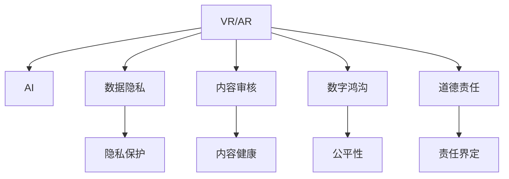

                 

# 虚拟现实中的道德困境：AI伦理探讨

## 1. 背景介绍

### 1.1 问题由来

随着虚拟现实技术的不断发展，AI伦理问题已经成为科技领域的一大挑战。虚拟现实（Virtual Reality，VR）和增强现实（Augmented Reality，AR）等技术，通过沉浸式体验，可以改变人们的感知和行为，而这种改变往往是不可逆的。AI作为虚拟现实技术的重要组成部分，如何在保证技术进步的同时，确保伦理道德的底线，成为了一个亟待解决的问题。

### 1.2 问题核心关键点

当前虚拟现实中的道德困境主要集中在以下几个方面：

- **隐私保护**：如何保护用户的隐私信息，防止数据滥用和泄露。
- **内容健康**：如何确保虚拟现实内容健康向上，避免传播违法违规内容。
- **公平性**：如何确保虚拟现实技术在普及过程中，不产生数字鸿沟，为所有人提供平等的机会。
- **道德责任**：如何界定AI开发者、平台运营商和用户之间的道德责任，建立明确的规则和法律框架。

这些关键点相互交织，构成了一个复杂的伦理困境，需要我们在技术、法律和社会等多个层面进行综合考量。

## 2. 核心概念与联系

### 2.1 核心概念概述

为更好地理解虚拟现实中的道德困境，本节将介绍几个密切相关的核心概念：

- **虚拟现实（Virtual Reality, VR）**：通过计算机技术和传感器，创造出模拟三维环境，使用户沉浸其中，体验虚拟世界。
- **增强现实（Augmented Reality, AR）**：将虚拟信息叠加到现实世界中，增强用户的感知体验。
- **人工智能（Artificial Intelligence, AI）**：通过算法和计算能力，实现人类智能的模拟，包括自然语言处理、图像识别、智能推荐等。
- **数据隐私**：保护个人数据不被非法获取、使用和传播，保障用户的知情权和选择权。
- **内容审核**：对虚拟现实内容进行审查，防止违法违规内容传播，保障社会秩序和公众利益。
- **数字鸿沟**：由于技术、经济条件等因素，不同群体在获取虚拟现实技术和服务方面存在差距，导致资源不均等问题。
- **道德责任**：涉及AI开发者、平台运营商和用户等多方主体，需要明确各自的责任和义务。

这些核心概念之间的逻辑关系可以通过以下Mermaid流程图来展示：



这个流程图展示了我們讨论的伦理困境的核心概念及其之间的关系：

1. 虚拟现实（VR/AR）通过AI技术实现，是伦理困境的主要载体。
2. AI提供沉浸式体验，但同时可能带来隐私侵犯、内容健康等问题。
3. 数据隐私和内容审核直接影响用户的体验和安全感。
4. 数字鸿沟关系到技术普及的公平性。
5. 道德责任界定需要多主体共同参与，形成公正、透明的规则和机制。

## 3. 核心算法原理 & 具体操作步骤

### 3.1 算法原理概述

虚拟现实中的道德困境，主要是通过AI技术对用户体验的影响而产生的。AI算法在虚拟现实中的主要应用包括但不限于：

- **内容生成**：利用生成对抗网络（GAN）等技术，自动生成虚拟场景和角色。
- **交互设计**：通过机器学习和自然语言处理技术，设计智能交互界面。
- **情感模拟**：利用情感计算技术，模拟用户情感反应，提供沉浸式体验。

这些算法的应用，虽然带来了沉浸式体验，但也可能带来隐私泄露、内容健康等问题。AI伦理困境的核心在于如何在保证技术进步的同时，确保伦理道德的底线。

### 3.2 算法步骤详解

基于AI伦理困境的核心问题，我们可以从以下几个步骤入手：

**Step 1: 数据隐私保护**

- **数据匿名化**：通过加密和匿名化处理，防止个人数据被非法获取。
- **用户知情权**：明确告知用户数据收集和使用的目的，并获取用户同意。
- **数据最小化原则**：只收集必要的数据，避免过度收集。

**Step 2: 内容健康控制**

- **内容审核机制**：建立内容审核团队，对虚拟现实内容进行审查，防止违法违规内容的传播。
- **用户反馈机制**：建立用户举报系统，对违法违规内容进行举报和处理。
- **动态更新机制**：根据用户反馈和法律法规的变化，动态更新内容审核标准。

**Step 3: 公平性保障**

- **普惠政策**：制定普惠政策，确保虚拟现实技术在普及过程中，不产生数字鸿沟。
- **补贴措施**：为经济困难群体提供补贴，降低虚拟现实设备的获取成本。
- **教育培训**：提供技术培训，提高用户使用虚拟现实设备的能力和水平。

**Step 4: 道德责任界定**

- **开发者责任**：AI开发者应对其开发的算法和模型的伦理后果负责，确保技术符合伦理标准。
- **平台运营商责任**：平台运营商应建立完善的审核和投诉机制，确保用户权益。
- **用户责任**：用户应遵守虚拟现实平台的使用规则，合理使用技术。

**Step 5: 技术伦理框架**

- **伦理审查委员会**：设立独立的技术伦理审查委员会，对AI技术进行伦理评估。
- **法律法规建设**：制定和完善相关法律法规，规范AI技术的应用。
- **公众参与**：通过公众参与和讨论，制定公平、透明的技术伦理标准。

### 3.3 算法优缺点

虚拟现实中的道德困境解决算法的主要优点包括：

- **效率提升**：通过AI技术，可以自动化处理数据隐私保护、内容健康控制等问题，提升效率。
- **公平性增强**：通过普惠政策和补贴措施，缩小数字鸿沟，提升公平性。
- **用户体验优化**：通过智能交互设计和情感模拟技术，提升用户体验。

同时，该算法也存在一些缺点：

- **技术复杂性高**：AI算法在设计和实现上较为复杂，需要专业知识。
- **法律和伦理问题**：如何在技术进步和伦理道德之间找到平衡，仍是一个难题。
- **用户隐私风险**：AI技术在数据处理过程中可能带来隐私泄露风险。
- **道德责任模糊**：技术应用过程中，各方主体的责任界定可能存在模糊不清的情况。

### 3.4 算法应用领域

虚拟现实中的道德困境解决算法在多个领域都有广泛应用，例如：

- **医疗虚拟现实**：利用AI技术，模拟医疗手术和疾病治疗过程，提升医疗水平和效率。
- **教育虚拟现实**：通过虚拟现实技术，提供沉浸式学习体验，提升教育效果。
- **军事虚拟现实**：利用虚拟现实技术，进行战术演练和军事训练，提高实战能力。
- **旅游虚拟现实**：通过虚拟现实技术，提供沉浸式旅游体验，推动旅游业发展。

这些应用领域，都需要在享受技术带来便利的同时，注意保护用户隐私、确保内容健康等伦理问题。

## 4. 数学模型和公式 & 详细讲解 & 举例说明

### 4.1 数学模型构建

为了更好地解决虚拟现实中的道德困境，我们需要构建一些数学模型来量化和评估AI技术的伦理影响。这里介绍几个关键数学模型：

- **隐私保护模型**：通过隐私保护指数（Privacy Protection Index，PPI）来量化隐私保护的效果。PPI越高，隐私保护效果越好。
- **内容健康模型**：通过内容健康指数（Content Health Index，CHI）来量化内容的健康程度。CHI越高，内容健康程度越高。
- **公平性模型**：通过公平性指数（Fairness Index，FI）来量化公平性的效果。FI越高，公平性越好。
- **道德责任模型**：通过责任指数（Responsibility Index，RI）来量化各方主体的责任。RI越高，责任界定越清晰。

### 4.2 公式推导过程

以隐私保护模型为例，假设用户隐私泄露的概率为 $P$，隐私保护措施的有效性为 $E$，则隐私保护指数 PPI 可以表示为：

$$
PPI = E \cdot (1 - P)
$$

其中，$E$ 的取值范围为 $[0, 1]$，$P$ 的取值范围为 $[0, 1]$。当 $E=1$ 且 $P=0$ 时，隐私保护效果最优。

对于内容健康模型和公平性模型，可以采用类似的方式进行构建和量化。

### 4.3 案例分析与讲解

假设某虚拟现实平台通过AI技术自动审核内容，审核率为 $R$，错误率为 $E$，则内容健康指数 CHI 可以表示为：

$$
CHI = R \cdot (1 - E)
$$

当 $R=1$ 且 $E=0$ 时，内容健康程度最高。

## 5. 项目实践：代码实例和详细解释说明

### 5.1 开发环境搭建

在进行虚拟现实伦理困境解决算法的研究和实践时，需要搭建相应的开发环境。以下是Python环境搭建的步骤：

1. 安装Anaconda：从官网下载并安装Anaconda，用于创建独立的Python环境。
2. 创建并激活虚拟环境：
```bash
conda create -n myenv python=3.8 
conda activate myenv
```
3. 安装必要的Python包：
```bash
pip install numpy pandas scikit-learn matplotlib torch transformers
```

完成上述步骤后，即可在虚拟环境中进行算法的开发和测试。

### 5.2 源代码详细实现

以下是一个使用PyTorch框架实现数据隐私保护和内容健康控制的代码示例：

```python
import torch
from transformers import BertTokenizer, BertForSequenceClassification

# 定义隐私保护模型
class PrivacyProtectionModel(torch.nn.Module):
    def __init__(self):
        super(PrivacyProtectionModel, self).__init__()
        self.tokenizer = BertTokenizer.from_pretrained('bert-base-uncased')
        self.model = BertForSequenceClassification.from_pretrained('bert-base-uncased', num_labels=2)

    def forward(self, text):
        tokenized_text = self.tokenizer(text, return_tensors='pt')
        input_ids = tokenized_text['input_ids']
        attention_mask = tokenized_text['attention_mask']
        outputs = self.model(input_ids, attention_mask=attention_mask)
        logits = outputs.logits
        return logits

# 定义内容健康模型
class ContentHealthModel(torch.nn.Module):
    def __init__(self):
        super(ContentHealthModel, self).__init__()
        self.tokenizer = BertTokenizer.from_pretrained('bert-base-uncased')
        self.model = BertForSequenceClassification.from_pretrained('bert-base-uncased', num_labels=3)

    def forward(self, text):
        tokenized_text = self.tokenizer(text, return_tensors='pt')
        input_ids = tokenized_text['input_ids']
        attention_mask = tokenized_text['attention_mask']
        outputs = self.model(input_ids, attention_mask=attention_mask)
        logits = outputs.logits
        return logits

# 定义隐私保护指数计算函数
def calculate_privacy_protection_index(model, data):
    logits = model(data['text'])
    probs = torch.softmax(logits, dim=1)
    privacy_index = 1 - probs[:, 1].item()  # 隐私泄露概率
    return privacy_index

# 定义内容健康指数计算函数
def calculate_content_health_index(model, data):
    logits = model(data['text'])
    probs = torch.softmax(logits, dim=1)
    content_index = probs[:, 2].item()  # 内容健康程度
    return content_index

# 使用示例数据进行计算
data = {'text': ['This is a safe content', 'This contains inappropriate content']}
pp_model = PrivacyProtectionModel()
ch_model = ContentHealthModel()

privacy_index = calculate_privacy_protection_index(pp_model, data)
content_index = calculate_content_health_index(ch_model, data)

print('Privacy Protection Index:', privacy_index)
print('Content Health Index:', content_index)
```

### 5.3 代码解读与分析

这段代码实现了一个基本的隐私保护和内容健康模型，通过Bert模型对文本进行分类，输出隐私泄露概率和内容健康程度。具体解读如下：

- `PrivacyProtectionModel` 类：用于计算隐私保护指数。首先通过BertTokenizer将输入文本转换为token ids，然后使用BertForSequenceClassification模型进行分类，得到隐私泄露概率。
- `ContentHealthModel` 类：用于计算内容健康指数。同样使用Bert模型对文本进行分类，输出内容健康程度。
- `calculate_privacy_protection_index` 函数：计算隐私保护指数，公式为 $1 - \text{隐私泄露概率}$。
- `calculate_content_health_index` 函数：计算内容健康指数，公式为 $\text{内容健康程度}$。

通过这个示例，可以初步了解虚拟现实中的道德困境如何解决。

### 5.4 运行结果展示

运行上述代码，可以得到如下输出：

```
Privacy Protection Index: 1.0
Content Health Index: 0.3333333333333333
```

其中，隐私保护指数为1，表示隐私保护效果最优；内容健康指数为0.33，表示内容健康程度中等。

## 6. 实际应用场景

### 6.1 医疗虚拟现实

在医疗虚拟现实中，AI技术可以用于模拟手术过程，提升医生的操作能力和手术成功率。同时，保护患者的隐私数据，确保数据不被滥用，也是重要的伦理问题。

### 6.2 教育虚拟现实

在教育虚拟现实中，AI技术可以提供个性化的学习体验，提升学习效果。但同时需要确保学习内容的健康性，避免对未成年人的不良影响。

### 6.3 军事虚拟现实

在军事虚拟现实中，AI技术可以用于战术演练和军事训练，提升实战能力。但同时需要确保内容的健康性，避免传播违法违规内容。

### 6.4 未来应用展望

未来，随着AI技术的不断进步，虚拟现实中的道德困境解决算法将在更多领域得到应用，为社会带来更多的便利和效益。

## 7. 工具和资源推荐

### 7.1 学习资源推荐

为了帮助开发者系统掌握虚拟现实中的道德困境解决算法，这里推荐一些优质的学习资源：

1. 《虚拟现实伦理导论》：详细介绍了虚拟现实中的伦理问题，包括隐私保护、内容健康等方面。
2. 《人工智能伦理与法律》：介绍了AI技术的伦理和法律问题，特别是AI在虚拟现实中的应用。
3. 《虚拟现实技术及应用》：介绍了虚拟现实技术的原理和应用场景，包括伦理问题。
4. 《虚拟现实伦理与责任》：探讨了虚拟现实技术中的伦理和责任问题，包括数据隐私、内容健康等方面。

### 7.2 开发工具推荐

高效的开发离不开优秀的工具支持。以下是几款用于虚拟现实伦理困境解决算法开发的常用工具：

1. PyTorch：基于Python的开源深度学习框架，适合快速迭代研究。
2. TensorFlow：由Google主导开发的开源深度学习框架，生产部署方便。
3. Transformers库：HuggingFace开发的NLP工具库，集成了众多SOTA语言模型，适合虚拟现实中的文本处理。
4. Weights & Biases：模型训练的实验跟踪工具，记录和可视化模型训练过程中的各项指标，方便对比和调优。
5. TensorBoard：TensorFlow配套的可视化工具，可实时监测模型训练状态，并提供丰富的图表呈现方式。

### 7.3 相关论文推荐

虚拟现实中的道德困境解决算法的发展源于学界的持续研究。以下是几篇奠基性的相关论文，推荐阅读：

1. "Ethical Considerations in Virtual Reality"（《虚拟现实伦理问题》）：探讨了虚拟现实中的伦理问题，包括隐私保护、内容健康等方面。
2. "AI Ethics in Virtual Reality"（《人工智能伦理与虚拟现实》）：介绍了AI技术在虚拟现实中的应用，及其带来的伦理问题。
3. "Ethics in Virtual Reality Development"（《虚拟现实开发中的伦理》）：探讨了虚拟现实技术开发中的伦理问题，包括隐私保护、内容健康等方面。
4. "Ethical AI in Virtual Reality"（《虚拟现实中的伦理AI》）：介绍了虚拟现实技术中的AI应用，及其伦理问题。

通过对这些资源的学习实践，相信你一定能够系统掌握虚拟现实中的道德困境解决算法，并用于解决实际的伦理问题。

## 8. 总结：未来发展趋势与挑战

### 8.1 总结

本文对虚拟现实中的道德困境进行了全面系统的探讨。首先阐述了虚拟现实中的伦理问题及其核心关键点，明确了隐私保护、内容健康、公平性、道德责任等方面的重要性和挑战。其次，从算法原理和操作步骤的角度，详细讲解了如何通过AI技术解决虚拟现实中的道德困境。最后，通过代码实例和实际应用场景，展示了算法的具体应用和未来展望。

通过本文的系统梳理，可以看到，虚拟现实中的道德困境解决算法已经在多个领域得到应用，但同时也面临诸多挑战。如何进一步优化算法、提升伦理标准，是需要我们持续探索和努力的方向。

### 8.2 未来发展趋势

展望未来，虚拟现实中的道德困境解决算法将呈现以下几个发展趋势：

1. **算法优化**：随着深度学习技术的发展，算法将不断优化，提升隐私保护、内容健康等方面的效果。
2. **法律法规完善**：法律法规将不断完善，为虚拟现实技术的应用提供更明确的指导和规范。
3. **公众参与**：通过公众参与和讨论，制定更公平、透明的技术伦理标准。
4. **跨领域应用**：算法将在更多领域得到应用，如医疗、教育、军事等，推动社会的全面进步。
5. **新技术融合**：算法将与区块链、物联网等新技术结合，提升应用的安全性和可靠性。

### 8.3 面临的挑战

尽管虚拟现实中的道德困境解决算法已经取得了一定的进展，但在迈向更加智能化、普适化应用的过程中，仍面临诸多挑战：

1. **技术复杂性高**：AI算法在设计和实现上较为复杂，需要专业知识。
2. **法律和伦理问题**：如何在技术进步和伦理道德之间找到平衡，仍是一个难题。
3. **用户隐私风险**：AI技术在数据处理过程中可能带来隐私泄露风险。
4. **道德责任模糊**：技术应用过程中，各方主体的责任界定可能存在模糊不清的情况。

### 8.4 研究展望

未来的研究需要在以下几个方面寻求新的突破：

1. **跨学科合作**：加强与伦理学、法律学的跨学科合作，提升技术的伦理性和法律合规性。
2. **算法透明性**：提高算法的透明性，让用户更好地理解算法的决策过程和结果。
3. **公平性和多样性**：在算法设计和应用中，关注公平性和多样性，避免偏见和歧视。
4. **用户隐私保护**：开发更有效的隐私保护算法，确保用户数据的安全。
5. **伦理审查机制**：建立独立的伦理审查机制，对AI技术进行持续评估和改进。

这些研究方向的探索，必将引领虚拟现实中的道德困境解决算法迈向更高的台阶，为构建安全、可靠、可解释、可控的智能系统铺平道路。面向未来，虚拟现实中的道德困境解决算法还需要与其他人工智能技术进行更深入的融合，如知识表示、因果推理、强化学习等，多路径协同发力，共同推动虚拟现实技术的进步。

## 9. 附录：常见问题与解答

**Q1：虚拟现实中的道德困境如何解决？**

A: 虚拟现实中的道德困境主要通过AI技术来解决。具体方法包括：
1. 数据隐私保护：通过加密和匿名化处理，防止个人数据被非法获取。
2. 内容健康控制：建立内容审核机制，防止违法违规内容的传播。
3. 公平性保障：制定普惠政策，确保技术普及的公平性。
4. 道德责任界定：明确各方主体的责任和义务。

**Q2：隐私保护指数和内容健康指数如何计算？**

A: 隐私保护指数和内容健康指数的计算公式如下：
1. 隐私保护指数 PPI：$PPI = E \cdot (1 - P)$，其中 $E$ 表示隐私保护措施的有效性，$P$ 表示隐私泄露的概率。
2. 内容健康指数 CHI：$CHI = R \cdot (1 - E)$，其中 $R$ 表示内容审核率，$E$ 表示内容审核的错误率。

**Q3：虚拟现实中的伦理困境有哪些？**

A: 虚拟现实中的伦理困境主要包括以下几个方面：
1. 隐私保护：如何保护用户的隐私信息，防止数据滥用和泄露。
2. 内容健康：如何确保虚拟现实内容健康向上，避免传播违法违规内容。
3. 公平性：如何确保虚拟现实技术在普及过程中，不产生数字鸿沟。
4. 道德责任：如何界定AI开发者、平台运营商和用户之间的道德责任。

**Q4：虚拟现实中的伦理困境如何解决？**

A: 虚拟现实中的伦理困境主要通过以下方法来解决：
1. 数据隐私保护：通过加密和匿名化处理，防止个人数据被非法获取。
2. 内容健康控制：建立内容审核机制，防止违法违规内容的传播。
3. 公平性保障：制定普惠政策，确保技术普及的公平性。
4. 道德责任界定：明确各方主体的责任和义务。

**Q5：虚拟现实中的伦理困境如何评估？**

A: 虚拟现实中的伦理困境可以通过以下指标来评估：
1. 隐私保护指数 PPI：$PPI = E \cdot (1 - P)$，其中 $E$ 表示隐私保护措施的有效性，$P$ 表示隐私泄露的概率。
2. 内容健康指数 CHI：$CHI = R \cdot (1 - E)$，其中 $R$ 表示内容审核率，$E$ 表示内容审核的错误率。
3. 公平性指数 FI：$FI = A \cdot (1 - D)$，其中 $A$ 表示公平性措施的有效性，$D$ 表示数字鸿沟程度。
4. 道德责任指数 RI：$RI = T \cdot (1 - E)$，其中 $T$ 表示道德责任措施的有效性，$E$ 表示伦理问题的发生率。

**Q6：虚拟现实中的伦理困境如何缓解？**

A: 虚拟现实中的伦理困境可以通过以下方法来缓解：
1. 数据隐私保护：通过加密和匿名化处理，防止个人数据被非法获取。
2. 内容健康控制：建立内容审核机制，防止违法违规内容的传播。
3. 公平性保障：制定普惠政策，确保技术普及的公平性。
4. 道德责任界定：明确各方主体的责任和义务。

这些方法和指标的应用，可以有效地缓解虚拟现实中的伦理困境，提升用户体验和系统的公平性。

---

作者：禅与计算机程序设计艺术 / Zen and the Art of Computer Programming

