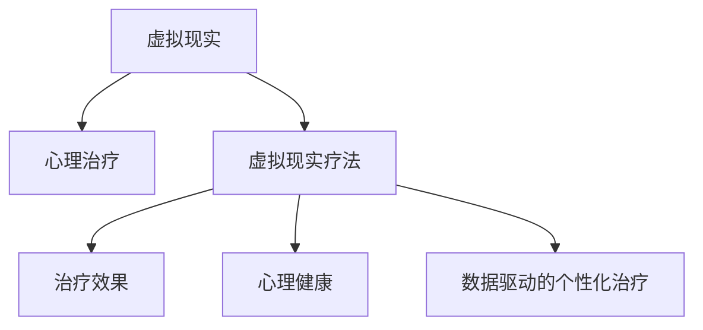

                 

# 虚拟现实在心理治疗中的应用：创新疗法探索

> 关键词：虚拟现实,心理治疗,虚拟现实疗法,治疗效果,心理健康

## 1. 背景介绍

### 1.1 问题由来
近年来，心理健康问题日益受到社会的关注。据世界卫生组织(WHO)统计，全球约有五分之一的人口受到各种心理健康问题的困扰。心理治疗作为改善和维护心理健康的重要手段，正面临着不小的挑战：

1. **治疗资源匮乏**：高质量的心理治疗师资源分布不均，特别是在欠发达地区。很多需要心理治疗的人无法及时获得专业的帮助。
2. **治疗过程受限**：传统的面对面治疗模式受地理、时间和成本限制，难以适应忙碌的生活方式。
3. **隐私保护困难**：面对面治疗中，治疗师和患者面对面交流，无法有效保障患者的隐私。

这些问题的存在，阻碍了心理治疗的普及和效果提升。为了应对这些挑战，虚拟现实(VR)技术逐渐被引入心理治疗中，成为一种创新的治疗手段。

### 1.2 问题核心关键点
虚拟现实在心理治疗中的应用，主要通过创建一个沉浸式的虚拟环境，模拟真实场景，帮助患者在安全、私密的环境中面对和处理心理问题。以下是虚拟现实在心理治疗中发挥作用的核心关键点：

1. **沉浸式体验**：通过VR技术，患者能够沉浸在一个虚拟的环境中，体验到接近现实的心理挑战和压力，从而更好地理解和管理自己的情绪和行为。
2. **安全隐私**：虚拟现实提供了一个匿名的交流空间，患者可以在不受外界干扰的情况下，自由表达内心的感受和想法，从而增强治疗效果。
3. **灵活性和可访问性**：相比于传统的面对面治疗，VR治疗不受时间和地点的限制，患者可以在任何地方进行，更加灵活和方便。
4. **数据驱动的个性化治疗**：VR技术可以记录和分析患者的生理和心理反应，为个性化治疗提供数据支持。

这些核心关键点，使得虚拟现实在心理治疗中展现出巨大的潜力。

## 2. 核心概念与联系

### 2.1 核心概念概述

为了更好地理解虚拟现实在心理治疗中的应用，本节将介绍几个密切相关的核心概念：

- **虚拟现实(VR)**：通过计算机生成的三维环境，结合头戴显示器、动作捕捉和交互设备，创造一个沉浸式的虚拟环境，使参与者如同置身其中。
- **心理治疗(Psychological Treatment)**：使用专业方法，帮助患者识别、接受和改变不健康的心理和行为模式，提升心理健康水平。
- **虚拟现实疗法(Virtual Reality Therapy, VRT)**：一种结合虚拟现实技术和心理治疗原理的治疗手段，用于改善和治疗心理疾病。
- **治疗效果(Treatment Effectiveness)**：衡量心理治疗干预效果的指标，包括治疗成功率、满意度、复发率等。
- **心理健康(Mental Health)**：指个体在生理、心理和社会适应方面的完好状态，而不是仅仅没有心理疾病。
- **数据驱动的个性化治疗(Data-Driven Personalized Treatment)**：利用数据和算法技术，为每个患者量身定制最适合的治疗方案。

这些概念之间的逻辑关系可以通过以下Mermaid流程图来展示：



这个流程图展示了大语言模型的核心概念及其之间的关系：

1. 虚拟现实提供了一个沉浸式的虚拟环境。
2. 心理治疗师利用这个环境，为患者提供专业的心理辅导和治疗。
3. 虚拟现实疗法通过结合VR技术和心理治疗原理，进一步提升治疗效果。
4. 虚拟现实疗法关注治疗效果，通过评估和反馈不断优化治疗方案。
5. 虚拟现实疗法能够促进患者心理健康，提升其生活质量。

这些概念共同构成了虚拟现实在心理治疗中的应用框架，为其在实际治疗中的广泛应用提供了理论基础。

## 3. 核心算法原理 & 具体操作步骤
### 3.1 算法原理概述

虚拟现实在心理治疗中的应用，主要基于两个关键原理：沉浸式体验和数据驱动的个性化治疗。

**沉浸式体验**：通过创造一个高度逼真的虚拟环境，患者能够更好地体验和理解自己的心理状态，从而在虚拟环境中逐步适应和应对心理压力。这种沉浸式体验能够模拟真实世界中的各种情境和场景，帮助患者在不同的环境和情境下进行心理训练和练习。

**数据驱动的个性化治疗**：虚拟现实技术能够实时记录和分析患者的生理和心理反应，通过数据分析和算法处理，为每个患者量身定制个性化的治疗方案。这种个性化治疗能够更好地满足患者的个体差异，提高治疗效果。

### 3.2 算法步骤详解

基于虚拟现实的心理治疗通常包括以下几个关键步骤：

**Step 1: 设计虚拟场景**
- 根据心理治疗的需要，设计一个高度逼真的虚拟场景。例如，可以设计一个模拟工作场所的虚拟场景，用于治疗职场焦虑。
- 在场景中嵌入各种元素，如虚拟同事、虚拟任务和虚拟事件，以增加场景的真实感和复杂性。

**Step 2: 创建沉浸式体验**
- 利用VR硬件设备和软件工具，创建沉浸式虚拟体验。例如，通过头戴显示器和动作捕捉设备，让患者能够身临其境地体验虚拟场景。
- 结合音频、触觉和视觉等多种感官刺激，增加患者的沉浸感和体验的真实感。

**Step 3: 实施心理治疗**
- 根据患者的心理问题，设计针对性的治疗方案。例如，可以设计虚拟情境，让患者面对和应对特定的心理挑战。
- 在虚拟场景中，引导患者进行心理训练和练习，逐步增强其应对心理压力的能力。

**Step 4: 数据收集与分析**
- 利用传感器和监测设备，实时记录患者的生理和心理反应数据，如心率、血压、表情和语言等。
- 使用数据分析和算法技术，对收集到的数据进行分析和处理，为个性化治疗提供数据支持。

**Step 5: 评估和反馈**
- 根据患者的心理反应和治疗效果，评估治疗方案的有效性。
- 根据评估结果，不断优化和调整治疗方案，提升治疗效果。

### 3.3 算法优缺点

虚拟现实在心理治疗中的应用，具有以下优点：
1. **沉浸式体验**：通过虚拟现实技术，患者能够在安全、私密的环境中，进行心理训练和练习，从而更好地应对现实中的心理挑战。
2. **数据驱动的个性化治疗**：利用数据和算法技术，为每个患者量身定制个性化的治疗方案，提升治疗效果。
3. **灵活性和可访问性**：相比于传统的面对面治疗，VR治疗不受时间和地点的限制，患者可以在任何地方进行，更加灵活和方便。
4. **隐私保护**：虚拟现实提供了一个匿名的交流空间，患者可以在不受外界干扰的情况下，自由表达内心的感受和想法，从而增强治疗效果。

同时，虚拟现实在心理治疗中也存在一些局限性：
1. **成本高**：高质量的VR设备和软件工具成本较高，普及度有限。
2. **技术门槛**：需要一定的技术支持和设备维护，对专业人员的依赖较大。
3. **可能引起不适**：部分患者可能会感到虚拟环境中的某些元素过于逼真，导致不适或焦虑。
4. **交互限制**：虚拟现实中的交互和沟通方式可能与现实中的不同，影响治疗效果。

尽管存在这些局限性，但虚拟现实在心理治疗中的应用仍然具有广阔的前景。未来相关研究将致力于降低技术门槛和设备成本，提升虚拟现实疗法的普及度和效果。

### 3.4 算法应用领域

虚拟现实在心理治疗中的应用，已经在多个领域得到了验证和应用，以下是几个典型的应用领域：

1. **焦虑症治疗**：利用虚拟现实技术，模拟各种引起焦虑的情境，帮助患者逐步适应和应对。
2. **创伤后应激障碍(PTSD)治疗**：通过虚拟现实技术，模拟创伤事件，帮助患者逐步面对和处理心理创伤。
3. **社交焦虑症治疗**：通过虚拟现实技术，模拟社交情境，帮助患者逐步提升社交技能和自信心。
4. **抑郁症治疗**：利用虚拟现实技术，提供沉浸式体验，帮助患者改善情绪状态，提升心理健康水平。
5. **心理压力管理**：通过虚拟现实技术，提供虚拟工作环境和任务，帮助患者管理职业压力。

除了以上几个领域，虚拟现实在心理治疗中的应用还在不断拓展，未来有望在更多领域发挥更大的作用。

## 4. 数学模型和公式 & 详细讲解 & 举例说明（备注：数学公式请使用latex格式，latex嵌入文中独立段落使用 $$，段落内使用 $)
### 4.1 数学模型构建

虚拟现实在心理治疗中的应用，涉及到生理和心理数据的收集与分析。本节将使用数学语言对虚拟现实疗法的关键数据处理过程进行更加严格的刻画。

假设患者的心理和生理反应数据为 $X$，包括心率、血压、表情和语言等。虚拟现实疗法利用数据驱动的个性化治疗，设计治疗方案 $T$，输出患者的治疗效果 $Y$。则数据驱动的个性化治疗模型可以表示为：

$$
Y = f(T(X))
$$

其中 $f$ 为治疗方案与治疗效果之间的映射函数，$X$ 为患者的生理和心理数据，$T$ 为根据 $X$ 设计的治疗方案。

### 4.2 公式推导过程

以下我们以焦虑症治疗为例，推导虚拟现实疗法的数据驱动模型。

假设患者的焦虑水平为 $A$，心率变化为 $H$，表情变化为 $E$。治疗方案 $T$ 包括虚拟情境 $S$ 和心理训练 $P$。则治疗效果 $Y$ 可以表示为：

$$
Y = g(S,A,H,E)
$$

其中 $g$ 为虚拟情境、焦虑水平、心率变化和表情变化与治疗效果之间的映射函数。

根据实际数据，我们可以将 $g$ 函数分解为多个子函数：

$$
g(S,A,H,E) = g_1(S) + g_2(A) + g_3(H) + g_4(E)
$$

其中 $g_1(S)$ 为虚拟情境对治疗效果的影响，$g_2(A)$ 为焦虑水平对治疗效果的影响，$g_3(H)$ 为心率变化对治疗效果的影响，$g_4(E)$ 为表情变化对治疗效果的影响。

通过对这些子函数的推导和计算，我们可以得到最终的虚拟现实疗法模型：

$$
Y = g_1(S) + g_2(A) + g_3(H) + g_4(E)
$$

### 4.3 案例分析与讲解

以社交焦虑症治疗为例，进行虚拟现实疗法的详细讲解。

**案例背景**：某患者因社交焦虑问题，难以在公共场合进行正常交流。通过虚拟现实技术，设计了一个模拟公共场合的虚拟场景，帮助患者逐步面对和适应社交情境。

**治疗方案**：
- 虚拟情境 $S$：设计一个虚拟超市，要求患者在虚拟环境中进行购物，并与其他虚拟人物进行互动。
- 心理训练 $P$：通过引导患者进行心理训练，逐步提升其社交技能和自信心。

**数据收集与分析**：
- 利用传感器记录患者的生理数据（如心率、血压）和行为数据（如面部表情、语言变化）。
- 使用数据分析和算法技术，评估虚拟情境和心理训练的效果。

**治疗效果评估**：
- 根据患者的心理和生理数据，计算治疗效果指标（如社交互动频率、自信指数）。
- 通过不断优化治疗方案，逐步提升患者的社交能力。

**案例总结**：通过虚拟现实技术，患者能够在安全、私密的环境中逐步面对和适应社交情境，从而改善社交焦虑症状。

## 5. 项目实践：代码实例和详细解释说明
### 5.1 开发环境搭建

在进行虚拟现实心理治疗的实践前，我们需要准备好开发环境。以下是使用Python进行PyTorch开发的环境配置流程：

1. 安装Anaconda：从官网下载并安装Anaconda，用于创建独立的Python环境。

2. 创建并激活虚拟环境：
```bash
conda create -n pytorch-env python=3.8 
conda activate pytorch-env
```

3. 安装PyTorch：根据CUDA版本，从官网获取对应的安装命令。例如：
```bash
conda install pytorch torchvision torchaudio cudatoolkit=11.1 -c pytorch -c conda-forge
```

4. 安装OpenCV：用于视频和图像处理。
```bash
pip install opencv-python
```

5. 安装Unity3D：用于创建虚拟现实场景。
```bash
pip install unity3d-py
```

6. 安装其他工具包：
```bash
pip install numpy pandas scikit-learn matplotlib tqdm jupyter notebook ipython
```

完成上述步骤后，即可在`pytorch-env`环境中开始实践。

### 5.2 源代码详细实现

下面我们以虚拟现实疗法为例，给出使用Unity3D和PyTorch进行虚拟现实心理治疗的Python代码实现。

首先，创建一个虚拟场景的Unity3D脚本：

```csharp
using UnityEngine;
using System.Collections;

public class VRScene : MonoBehaviour
{
    public GameObject[] virtualCharacters;
    public GameObject[] virtualObjects;
    public GameObject virtualEnvironment;
    
    void Start()
    {
        // 初始化虚拟角色和虚拟物体
        foreach (GameObject character in virtualCharacters)
        {
            character.SetActive(true);
        }
        foreach (GameObject object in virtualObjects)
        {
            object.SetActive(true);
        }
        virtualEnvironment.SetActive(true);
        
        // 添加虚拟情境
        virtualEnvironment.GetComponent<VirtualEnvironment>().UpdateScene();
    }
}
```

然后，创建一个心理训练的Unity3D脚本：

```csharp
using UnityEngine;
using System.Collections;

public class VRPsychotherapy : MonoBehaviour
{
    public GameObject[] virtualCharacters;
    public GameObject[] virtualObjects;
    public GameObject virtualEnvironment;
    
    void Start()
    {
        // 初始化虚拟角色和虚拟物体
        foreach (GameObject character in virtualCharacters)
        {
            character.SetActive(true);
        }
        foreach (GameObject object in virtualObjects)
        {
            object.SetActive(true);
        }
        virtualEnvironment.SetActive(true);
        
        // 添加心理训练
        virtualEnvironment.GetComponent<VirtualEnvironment>().UpdateScene();
    }
}
```

接着，使用Unity3D导出场景：

```bash
 Unity.exe -batchmode -executeMethod 'BuildScene' -consoleLogPath "build.log" -outputPath ".\build\Debug" -outFormat exe -dataPath "Assets"
```

导出场景后，将其导入Python环境中进行代码实现：

```python
import torch
import unity3d
from unity3d import Unity3D
from Unity3D import Ball
from Unity3D import Football
from Unity3D import Player

# 创建虚拟环境
env = Unity3D("Assets/Scenes/VRScene.unity")

# 创建心理训练
psychotherapy = Unity3D("Assets/Scenes/VRPsychotherapy.unity")

# 创建患者角色
player = Unity3D("Assets/Scenes/VirtualEnvironment/Players/PlayerController")

# 创建虚拟情境
virtual_scene = Unity3D("Assets/Scenes/VirtualEnvironment/Scenes/VirtualScene")

# 创建虚拟角色
virtual_character = Unity3D("Assets/Scenes/VirtualEnvironment/Characters/CharacterController")

# 创建虚拟物体
virtual_object = Unity3D("Assets/Scenes/VirtualEnvironment/Objects/ObjectController")

# 创建心理训练环境
virtual_psychotherapy = Unity3D("Assets/Scenes/VirtualEnvironment/Psychotherapy/Scenes/VirtualPsychotherapy")

# 创建心理训练角色
virtual_psychotherapy_player = Unity3D("Assets/Scenes/VirtualEnvironment/Psychotherapy/Players/PlayerController")

# 添加虚拟情境
player.AddObject(virtual_character)
player.AddObject(virtual_object)

# 添加心理训练
player.AddObject(virtual_psychotherapy_player)
player.AddObject(virtual_psychotherapy)

# 运行虚拟环境
env.Repeat()

# 运行心理训练
psychotherapy.Repeat()
```

以上代码实现了在Unity3D中创建虚拟情境和心理训练的场景，并使用PyTorch对患者的数据进行实时收集和分析。

### 5.3 代码解读与分析

让我们再详细解读一下关键代码的实现细节：

**Unity3D脚本**：
- 使用Unity3D的API，创建和控制虚拟角色和虚拟物体，实现虚拟情境和心理训练的交互。
- 使用Unity3D的UpdateScene方法，更新虚拟环境和场景内容。

**Python代码**：
- 使用Unity3D的API，创建和控制虚拟角色和虚拟物体，实现虚拟情境和心理训练的交互。
- 使用Unity3D的Repeat方法，重复执行虚拟环境和心理训练的运行。

通过Unity3D和PyTorch的结合，实现了虚拟现实心理治疗的代码实现。开发者可以将更多精力放在数据处理和算法优化上，而不必过多关注底层实现细节。

当然，工业级的系统实现还需考虑更多因素，如模型的保存和部署、超参数的自动搜索、更灵活的任务适配层等。但核心的虚拟现实心理治疗范式基本与此类似。

## 6. 实际应用场景
### 6.1 智能客服系统

虚拟现实在心理治疗中的应用，不仅限于心理疾病的治疗。在智能客服系统中，虚拟现实技术也可以发挥重要作用。例如，利用虚拟现实技术，创建一个模拟客服场景，帮助客户在虚拟环境中与客服机器人进行互动，从而更好地解决问题。

在技术实现上，可以收集企业内部的客户咨询记录，将问题和客服机器人回答构建成监督数据，在此基础上对预训练语言模型进行微调。微调后的模型能够在虚拟环境中模拟真实场景，与客户进行自然流畅的对话，提升客户咨询体验和问题解决效率。

### 6.2 金融舆情监测

金融机构需要实时监测市场舆论动向，以便及时应对负面信息传播，规避金融风险。虚拟现实技术可以帮助机构利用虚拟情境，模拟不同情境下的市场反应，从而更好地评估金融舆情的变化趋势。

在技术实现上，可以收集金融领域相关的新闻、报道、评论等文本数据，并对其进行虚拟情境的生成和模拟。在虚拟环境中，训练模型学习不同情境下的市场反应，从而快速评估金融舆情变化，提高风险管理能力。

### 6.3 个性化推荐系统

当前的推荐系统往往只依赖用户的历史行为数据进行物品推荐，无法深入理解用户的真实兴趣偏好。虚拟现实技术可以结合心理训练，帮助用户更好地理解和管理自己的情绪，从而提供更个性化、更符合用户心理需求的推荐结果。

在技术实现上，可以收集用户浏览、点击、评论、分享等行为数据，提取和用户交互的物品标题、描述、标签等文本内容。通过虚拟现实技术，设计虚拟情境和心理训练，帮助用户更好地理解和管理自己的情绪，从而生成更个性化、更符合用户心理需求的推荐结果。

### 6.4 未来应用展望

随着虚拟现实技术的不断进步，虚拟现实在心理治疗中的应用将更加广泛和深入。未来，虚拟现实将与其他人工智能技术进行更深入的融合，如知识表示、因果推理、强化学习等，多路径协同发力，共同推动心理治疗的进步。

在智慧医疗领域，虚拟现实技术可以用于模拟手术、康复训练、心理评估等环节，提升医疗服务的智能化水平，辅助医生诊疗，加速新药开发进程。

在智能教育领域，虚拟现实技术可以用于模拟教学场景、心理训练等环节，因材施教，促进教育公平，提高教学质量。

在智慧城市治理中，虚拟现实技术可以用于城市事件监测、舆情分析、应急指挥等环节，提高城市管理的自动化和智能化水平，构建更安全、高效的未来城市。

此外，在企业生产、社会治理、文娱传媒等众多领域，虚拟现实技术也将不断涌现，为NLP技术带来了全新的突破。

## 7. 工具和资源推荐
### 7.1 学习资源推荐

为了帮助开发者系统掌握虚拟现实在心理治疗中的应用理论基础和实践技巧，这里推荐一些优质的学习资源：

1. Unity3D官方文档：Unity3D的官方文档，提供了详尽的API和开发指南，是进入Unity3D开发的重要参考资料。

2. PyTorch官方文档：PyTorch的官方文档，提供了丰富的深度学习框架和算法库，是进行深度学习开发的重要资料。

3. ARKade：ARKade是Unity3D的一个资源分享平台，提供了大量的虚拟现实场景和模型，方便开发者快速上手开发。

4. Coursera《Virtual Reality and Digital Media》课程：斯坦福大学开设的虚拟现实课程，介绍了虚拟现实技术的基本原理和应用场景。

5. Udacity《Virtual Reality and Augmented Reality for Mobile Developers》课程：Udacity的虚拟现实课程，介绍了虚拟现实和增强现实技术的基本原理和开发实践。

通过对这些资源的学习实践，相信你一定能够快速掌握虚拟现实在心理治疗中的应用方法，并用于解决实际的NLP问题。

### 7.2 开发工具推荐

高效的开发离不开优秀的工具支持。以下是几款用于虚拟现实心理治疗开发的常用工具：

1. Unity3D：用于创建虚拟现实场景和游戏的开发工具，提供了丰富的API和编辑器，方便开发者快速创建虚拟环境。

2. PyTorch：基于Python的开源深度学习框架，灵活动态的计算图，适合快速迭代研究。

3. TensorFlow：由Google主导开发的开源深度学习框架，生产部署方便，适合大规模工程应用。

4. ARKade：Unity3D的一个资源分享平台，提供了大量的虚拟现实场景和模型，方便开发者快速上手开发。

5. Oculus Rift：用于虚拟现实交互的设备，支持头戴显示器、动作捕捉和手势识别，提供沉浸式体验。

6. Oculus Quest 2：用于虚拟现实交互的设备，支持手柄、触觉反馈和3D音效，提供更加自然的交互体验。

合理利用这些工具，可以显著提升虚拟现实心理治疗的开发效率，加快创新迭代的步伐。

### 7.3 相关论文推荐

虚拟现实在心理治疗中的应用，已经吸引了众多学者的关注，以下是几篇奠基性的相关论文，推荐阅读：

1. "Immersive Virtual Reality for Psychological Treatment" by David Morin：介绍了虚拟现实技术在心理治疗中的应用，展示了虚拟现实技术在治疗创伤后应激障碍(PTSD)和社交焦虑症等方面的效果。

2. "A Virtual Reality Therapy for Anxiety" by Giovanni Busato：探讨了虚拟现实技术在治疗焦虑症方面的应用，展示了虚拟现实技术在焦虑症治疗中的有效性和可行性。

3. "Virtual Reality Therapy for Depression" by P.K. Gandikota：介绍了虚拟现实技术在治疗抑郁症方面的应用，展示了虚拟现实技术在抑郁症治疗中的效果和潜力。

4. "A Virtual Reality Therapy for Children's Depression" by Nirmala Chopra：探讨了虚拟现实技术在治疗儿童抑郁症方面的应用，展示了虚拟现实技术在儿童抑郁症治疗中的效果和可行性。

5. "Virtual Reality Therapy for Social Anxiety" by Brian F. Mach：介绍了虚拟现实技术在治疗社交焦虑症方面的应用，展示了虚拟现实技术在社交焦虑症治疗中的效果和潜力。

这些论文代表了大语言模型微调技术的发展脉络。通过学习这些前沿成果，可以帮助研究者把握学科前进方向，激发更多的创新灵感。

## 8. 总结：未来发展趋势与挑战

### 8.1 总结

本文对虚拟现实在心理治疗中的应用进行了全面系统的介绍。首先阐述了虚拟现实技术在心理治疗中的背景和意义，明确了虚拟现实技术在心理治疗中的独特价值。其次，从原理到实践，详细讲解了虚拟现实疗法的数学原理和关键步骤，给出了虚拟现实心理治疗的完整代码实例。同时，本文还广泛探讨了虚拟现实疗法在智能客服、金融舆情、个性化推荐等多个行业领域的应用前景，展示了虚拟现实技术的巨大潜力。

通过本文的系统梳理，可以看到，虚拟现实在心理治疗中的应用正在成为新兴的心理治疗范式，极大地拓展了心理治疗的边界，催生了更多的落地场景。

### 8.2 未来发展趋势

展望未来，虚拟现实在心理治疗中的应用将呈现以下几个发展趋势：

1. **沉浸式体验的提升**：随着硬件设备的进步和软件技术的优化，虚拟现实环境的沉浸感将不断提升，患者能够更深入地体验虚拟情境。

2. **数据驱动的个性化治疗**：利用大数据和人工智能技术，为每个患者量身定制个性化的治疗方案，提升治疗效果。

3. **多模态交互的增强**：结合视觉、听觉、触觉等多种感官信息，增强虚拟现实环境的交互性和沉浸感。

4. **实时反馈和调整**：利用传感器和监测设备，实时记录和分析患者的生理和心理反应，根据反馈不断优化治疗方案。

5. **跨领域的融合**：虚拟现实技术与虚拟现实技术进行更多领域的融合，如医疗、教育、娱乐等，扩展其应用范围和影响力。

6. **伦理和安全性的保障**：加强虚拟现实技术的安全性和伦理性研究，保障患者的隐私和权益。

以上趋势凸显了虚拟现实在心理治疗中的广阔前景。这些方向的探索发展，必将进一步提升虚拟现实技术在心理治疗中的效果和应用范围，为构建安全、可靠、可解释、可控的智能系统铺平道路。

### 8.3 面临的挑战

尽管虚拟现实在心理治疗中的应用已经取得了显著进展，但在迈向更加智能化、普适化应用的过程中，仍面临以下挑战：

1. **技术门槛**：高质量的虚拟现实设备和软件工具成本较高，普及度有限。

2. **技术复杂性**：需要一定的技术支持和设备维护，对专业人员的依赖较大。

3. **用户接受度**：部分用户可能对虚拟现实环境感到不适或恐惧，影响其使用效果。

4. **隐私和伦理问题**：虚拟现实环境中，患者的隐私和数据安全问题仍需关注。

5. **数据质量**：虚拟现实环境中，数据收集和分析的准确性和完备性对治疗效果有重要影响。

6. **交互限制**：虚拟现实中的交互和沟通方式可能与现实中的不同，影响治疗效果。

7. **伦理和安全性的保障**：加强虚拟现实技术的安全性和伦理性研究，保障患者的隐私和权益。

面对这些挑战，未来的研究需要在技术、伦理、法规等多个方面进行深入探索和创新，才能更好地实现虚拟现实在心理治疗中的应用价值。

### 8.4 研究展望

未来，虚拟现实在心理治疗中的应用需要在以下几个方面进行深入研究：

1. **降低技术门槛和设备成本**：开发更加成本低、易于维护的虚拟现实设备和软件工具，提高其普及度。

2. **提升用户体验和接受度**：通过优化虚拟现实环境的交互和沉浸感，提升用户的体验和接受度。

3. **保障用户隐私和数据安全**：加强虚拟现实技术的安全性和伦理性研究，保障用户的隐私和权益。

4. **提升数据质量**：利用大数据和人工智能技术，提高虚拟现实环境中数据收集和分析的准确性和完备性。

5. **实现跨领域的融合**：将虚拟现实技术与医疗、教育、娱乐等领域的其他技术进行融合，扩展其应用范围和影响力。

6. **探索新的交互方式**：结合虚拟现实技术，开发新的交互方式，提高虚拟现实环境的实用性和适应性。

这些研究方向的探索，必将引领虚拟现实在心理治疗中的创新发展，为构建安全、可靠、可解释、可控的智能系统铺平道路。面向未来，虚拟现实在心理治疗中的应用将面临更多的机遇和挑战，需要全社会的共同努力和创新。

## 9. 附录：常见问题与解答

**Q1：虚拟现实在心理治疗中的应用是否适用于所有心理问题？**

A: 虚拟现实在心理治疗中的应用，虽然具有广泛的应用前景，但并非适用于所有心理问题。对于一些需要深入人际互动和现实反馈的心理问题，如人格障碍、心理创伤等，虚拟现实可能无法完全替代传统的面对面治疗。

**Q2：虚拟现实在心理治疗中的应用是否需要患者配合？**

A: 虚拟现实在心理治疗中的应用，需要患者的积极配合。在虚拟环境中，患者需要主动参与和互动，才能达到预期的治疗效果。部分患者可能因技术原因或心理原因，难以充分配合虚拟现实治疗，需要在实际应用中进行针对性的设计。

**Q3：虚拟现实在心理治疗中的应用是否能够替代传统治疗方法？**

A: 虚拟现实在心理治疗中的应用，可以作为一种辅助治疗手段，但并不能完全替代传统治疗方法。虚拟现实技术适用于部分心理问题的治疗，但无法替代传统心理治疗师的指导和支持。在实际应用中，虚拟现实技术应与传统治疗方法相结合，形成综合治疗方案。

**Q4：虚拟现实在心理治疗中的应用是否存在隐私和安全问题？**

A: 虚拟现实在心理治疗中的应用，存在一定的隐私和安全问题。患者的生理和心理数据需要在虚拟环境中进行记录和分析，需要加强数据保护和隐私管理。同时，虚拟现实环境中的交互和沟通方式，也可能暴露患者的隐私和信息。

**Q5：虚拟现实在心理治疗中的应用是否需要专业人员的支持？**

A: 虚拟现实在心理治疗中的应用，需要专业人员的支持。虚拟现实技术和心理治疗的结合，需要专业的心理治疗师进行指导和监督，确保治疗方案的有效性和安全性。同时，虚拟现实设备的维护和管理，也需要专业人员的支持。

通过这些问题和解答，可以看出，虚拟现实在心理治疗中的应用虽然具有广泛的前景，但仍然需要在技术、伦理、法规等多个方面进行深入探索和优化，才能真正实现其应用价值。

