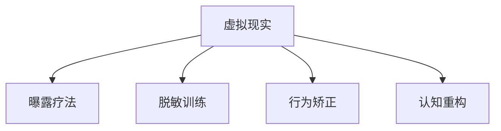

                 

# 虚拟现实治疗:全球脑助力心理健康

## 1. 背景介绍

### 1.1 问题由来

随着现代社会的快速发展，人们面临的心理压力越来越大，心理健康问题日益凸显。据世界卫生组织统计，全球约1/3的人口在一生中的某个阶段将经历心理健康问题。面对这一挑战，传统的心理咨询和治疗手段面临着诸多局限，如咨询师数量不足、时间成本高昂、难以实现个性化治疗等问题。

虚拟现实（Virtual Reality, VR）技术的崛起，为心理健康领域带来了一线希望。VR技术能够创造沉浸式环境，通过视觉、听觉等多种感官模拟现实世界的复杂情境，从而引发用户的情感和行为反应。这些特性使得VR成为一种强有力的心理健康治疗手段。

### 1.2 问题核心关键点

虚拟现实治疗的核心关键点在于通过沉浸式体验激发用户的心理反应，从而在安全、可控的环境中对其心理问题进行干预和治疗。具体而言，VR技术在心理健康治疗中的主要应用包括：

1. **曝露疗法**：通过逐步呈现用户的恐惧或焦虑源，帮助其逐渐克服心理障碍。
2. **脱敏训练**：在虚拟环境中模拟现实生活场景，使患者在不引发实际心理创伤的情况下，逐步适应和接受某些情境。
3. **行为矫正**：通过虚拟场景中的模拟训练，帮助用户学习并改善不良行为习惯。
4. **心理支持**：通过虚拟环境提供心理支持和安慰，减少用户在面对真实世界时的心理压力。
5. **认知重构**：通过模拟和调整用户的认知模式，改变其负面的思维习惯和情绪反应。

这些应用场景显示了VR技术在心理健康治疗中的巨大潜力，为心理问题的解决提供了新的解决方案。

## 2. 核心概念与联系

### 2.1 核心概念概述

为更好地理解虚拟现实在心理健康治疗中的应用，本节将介绍几个密切相关的核心概念：

- **虚拟现实（Virtual Reality, VR）**：通过计算机生成的3D环境，使用户能够沉浸在虚拟世界中，体验其视觉、听觉、触觉等多种感官刺激。
- **曝露疗法（Exposure Therapy）**：通过逐步呈现用户的恐惧或焦虑源，帮助其逐渐克服心理障碍的心理治疗方式。
- **脱敏训练（Desensitization Training）**：在虚拟环境中模拟现实生活场景，使患者在不引发实际心理创伤的情况下，逐步适应和接受某些情境的治疗方式。
- **行为矫正（Behavioral Correction）**：通过虚拟场景中的模拟训练，帮助用户学习并改善不良行为习惯的治疗方式。
- **认知重构（Cognitive Restructuring）**：通过模拟和调整用户的认知模式，改变其负面的思维习惯和情绪反应的治疗方式。

这些核心概念之间的逻辑关系可以通过以下Mermaid流程图来展示：



这个流程图展示了一个典型应用场景：用户通过虚拟现实技术，在接受曝露疗法、脱敏训练、行为矫正、认知重构等不同心理治疗过程中，体验不同虚拟环境，逐步调整自己的心理状态。

## 3. 核心算法原理 & 具体操作步骤
### 3.1 算法原理概述

虚拟现实治疗的算法原理可以简要概括为：通过沉浸式虚拟环境，模拟现实生活中的特定情境，引发用户的心理和行为反应，进而通过这些反应对用户进行心理干预和治疗。

具体来说，虚拟现实治疗过程包括以下几个关键步骤：

1. **环境构建**：根据治疗方案，构建虚拟现实环境，模拟出逼真的现实情境。
2. **情境模拟**：在虚拟环境中模拟用户面临的心理压力或恐惧源，如社交焦虑、恐高症、创伤后应激障碍等。
3. **互动反馈**：通过虚拟现实设备（如VR头显、手柄等），捕捉用户的行为和情感反应，提供即时的反馈和支持。
4. **治疗干预**：根据用户的反应，通过曝露疗法、脱敏训练、行为矫正、认知重构等不同治疗手段，逐步调整用户的心态和行为。
5. **效果评估**：在治疗过程中定期评估用户的心理状态，判断治疗效果，并根据评估结果调整治疗策略。

### 3.2 算法步骤详解

虚拟现实治疗的算法步骤主要包括以下几个环节：

1. **需求分析与环境设计**：
   - 收集用户心理问题的详细信息，进行专业评估，确定治疗目标和方案。
   - 设计虚拟现实环境，模拟出与用户心理问题相关的情境。

2. **设备选择与安装**：
   - 选择合适的VR设备和传感器，确保用户能够舒适地体验虚拟环境。
   - 进行设备的安装和调试，确保设备性能稳定，减少技术故障对治疗的影响。

3. **治疗过程实施**：
   - 用户在虚拟环境中接受曝露疗法、脱敏训练、行为矫正、认知重构等不同治疗手段。
   - 在治疗过程中，通过虚拟现实设备捕捉用户的行为和情感反应，提供即时的反馈和支持。
   - 根据用户的反应，动态调整治疗策略，逐步引导用户克服心理障碍。

4. **效果评估与调整**：
   - 在治疗过程中定期评估用户的心理状态，使用专业的心理测评工具，如焦虑自评量表（SAS）、抑郁自评量表（SDS）等，判断治疗效果。
   - 根据评估结果调整治疗方案，优化治疗策略，确保治疗效果的最大化。

### 3.3 算法优缺点

虚拟现实治疗具有以下优点：

1. **沉浸式体验**：通过沉浸式虚拟环境，使用户能够更加深刻地体验心理压力或恐惧源，从而更有效地进行心理干预和治疗。
2. **安全可控**：在虚拟环境中，用户不必担心实际的心理创伤，可以更自由地探索和应对，减少实际治疗中的心理风险。
3. **个性化治疗**：通过虚拟现实技术，可以根据用户的实际情况，定制个性化的治疗方案，提高治疗效果。
4. **数据驱动**：通过收集用户的行为和情感数据，可以实时监测和评估治疗效果，为治疗方案的优化提供科学依据。

同时，虚拟现实治疗也存在一些局限性：

1. **设备依赖**：用户需要专业的VR设备和传感器的支持，设备成本较高。
2. **技术要求**：用户对虚拟现实技术有一定的技术要求，操作复杂。
3. **技术局限**：目前的虚拟现实技术仍然无法完全模拟现实世界的复杂性和多样性，可能导致某些情境的模拟效果不够真实。
4. **用户体验差异**：不同用户的虚拟现实体验可能存在较大差异，影响治疗效果的一致性。

尽管存在这些局限性，但虚拟现实治疗作为一种新兴的心理健康治疗手段，已经展现出巨大的潜力和发展前景。未来，随着技术的不断进步和设备的普及，虚拟现实治疗有望成为一种常规的心理健康干预手段。

### 3.4 算法应用领域

虚拟现实治疗已经广泛应用于多个心理健康领域，主要包括：

1. **曝露疗法**：
   - 用于治疗社交恐惧症、广泛性焦虑障碍、创伤后应激障碍等心理问题。
   - 通过逐步曝露，使患者逐渐适应和接受特定的情境。

2. **脱敏训练**：
   - 用于治疗恐高症、恐针症、恐电梯症等特定恐惧症。
   - 在虚拟环境中模拟相关情境，使患者逐步适应和接受。

3. **行为矫正**：
   - 用于治疗网络成瘾、饮食障碍等行为问题。
   - 通过虚拟环境中的模拟训练，帮助患者改变不良行为习惯。

4. **认知重构**：
   - 用于治疗抑郁症、焦虑症等心理障碍。
   - 通过模拟和调整用户的认知模式，改变其负面的思维习惯和情绪反应。

除了上述这些经典应用外，虚拟现实治疗还在创伤后应激障碍、慢性疼痛管理、儿童心理治疗等多个领域展现出良好的应用前景。

## 4. 数学模型和公式 & 详细讲解 & 举例说明

### 4.1 数学模型构建

虚拟现实治疗的数学模型可以简要概括为：通过构建虚拟现实环境，捕捉用户的行为和情感反应，进行心理干预和治疗。

假设用户在虚拟环境中接受曝露疗法，其心理状态的变化可以表示为函数 $f(x)$，其中 $x$ 表示用户的当前心理状态，$f(x)$ 表示经过曝露疗法后用户心理状态的变化。设虚拟环境中模拟的情境为 $S$，用户的情感反应为 $E$，行为反应为 $B$，则治疗过程可以表示为：

$$
\begin{aligned}
f(x) &= \mathcal{G}(x, S) \\
\mathcal{G}(x, S) &= \mathcal{E}(S, x) + \mathcal{B}(S, x)
\end{aligned}
$$

其中 $\mathcal{G}$ 表示心理干预函数，$\mathcal{E}$ 表示情感反应函数，$\mathcal{B}$ 表示行为反应函数。

### 4.2 公式推导过程

在虚拟现实治疗中，情感反应和行为反应是用户心理状态变化的重要因素。假设情感反应函数 $\mathcal{E}$ 和行为反应函数 $\mathcal{B}$ 分别为：

$$
\begin{aligned}
\mathcal{E}(S, x) &= \alpha(S, x) + \beta(S, x) \\
\mathcal{B}(S, x) &= \gamma(S, x) + \delta(S, x)
\end{aligned}
$$

其中 $\alpha$、$\beta$、$\gamma$、$\delta$ 分别为情境 $S$ 和用户心理状态 $x$ 的各项系数。

则心理干预函数 $\mathcal{G}$ 可以表示为：

$$
\begin{aligned}
\mathcal{G}(x, S) &= \mathcal{E}(S, x) + \mathcal{B}(S, x) \\
&= (\alpha(S, x) + \beta(S, x)) + (\gamma(S, x) + \delta(S, x)) \\
&= \alpha(S, x) + \beta(S, x) + \gamma(S, x) + \delta(S, x)
\end{aligned}
$$

将 $\mathcal{G}$ 代入心理状态变化函数 $f(x)$，得：

$$
f(x) = \alpha(S, x) + \beta(S, x) + \gamma(S, x) + \delta(S, x)
$$

这个公式表明，用户的心理状态变化是情境 $S$ 和用户心理状态 $x$ 的函数，通过捕捉用户的情感反应和行为反应，可以进行心理干预和治疗。

### 4.3 案例分析与讲解

以社交恐惧症的治疗为例，分析虚拟现实治疗的实际应用过程。

假设用户在虚拟环境中接受曝露疗法，治疗过程如下：

1. **环境构建**：构建虚拟社交场景，模拟用户可能感到恐惧的社交场合，如人群聚集、公共演讲等。
2. **情境模拟**：用户逐渐接触虚拟场景中的不同情境，如与陌生人交谈、面对公众演讲等。
3. **互动反馈**：通过虚拟现实设备捕捉用户的行为和情感反应，如心率、呼吸、表情等。
4. **治疗干预**：根据用户的情感和行为反应，通过曝露疗法逐步调整其心理状态。
5. **效果评估**：定期评估用户的心理状态，判断治疗效果，并根据评估结果调整治疗策略。

具体而言，用户的行为反应可以通过VR设备捕捉到的行为数据来量化，如用户的身体姿势、手势等；用户的情感反应可以通过面部表情识别和心率监测等技术来量化，如用户的面部表情变化、心率变化等。通过这些量化数据，可以实时监测和评估用户的心理状态，调整曝露疗法的强度和频率，提高治疗效果。

## 5. 项目实践：代码实例和详细解释说明

### 5.1 开发环境搭建

在进行虚拟现实治疗的开发实践前，我们需要准备好开发环境。以下是使用Unity3D进行虚拟现实治疗项目的开发环境配置流程：

1. **安装Unity3D**：从官网下载并安装Unity3D，用于创建虚拟现实环境。
2. **安装VR SDK**：根据设备型号，下载并安装相应的VR SDK（如Oculus SDK、HTC Vive SDK等）。
3. **安装VR设备**：确保VR设备和传感器的连接正常，性能稳定。
4. **安装Python和相关库**：为了进行数据处理和行为捕捉，需要安装Python及相关库（如OpenCV、Pandas等）。
5. **安装机器学习库**：为了实现用户行为和情感反应的分析和建模，需要安装机器学习库（如TensorFlow、PyTorch等）。

完成上述步骤后，即可在Unity3D环境下开始虚拟现实治疗的开发。

### 5.2 源代码详细实现

下面我们以社交恐惧症治疗为例，给出使用Unity3D和TensorFlow进行虚拟现实治疗的代码实现。

首先，定义虚拟社交场景的交互逻辑：

```csharp
using UnityEngine;
using System.Collections;
using TensorFlow;

public class SocialFearTreatment : MonoBehaviour
{
    public GameObject player;
    public Camera cam;
    public Transform target;
    public TensorFlowGraph graph;
    public TensorFlowTensor outputTensor;
    
    void Update()
    {
        // 设置目标位置
        target.position = new Vector3(Mathf.PerlinNoise(Time.time, 0.5f), 2, 0);
        
        // 捕捉用户行为数据
        Vector3 position = player.transform.position;
        Quaternion rotation = player.transform.rotation;
        
        // 生成输入数据
        float[] data = { position.x, position.y, position.z, rotation.x, rotation.y, rotation.z, rotation.w };
        
        // 输入数据
        Tensor inputTensor = tf.Graph().AddTensor(data);
        
        // 运行模型
        Tensor output = graph.Read(outputTensor.Name);
        
        // 输出结果
        Debug.Log("Output: " + output.Data<string>());
    }
}
```

然后，定义虚拟社交场景的可视化效果：

```csharp
using UnityEngine;
using System.Collections;
using UnityEngine.UI;

public class SocialFearTreatmentUI : MonoBehaviour
{
    public GameObject player;
    public Text outputText;
    
    void Update()
    {
        // 更新输出文本
        outputText.text = "Position: (" + player.transform.position.x + ", " + player.transform.position.y + ", " + player.transform.position.z + ")\nRotation: (" + player.transform.rotation.x + ", " + player.transform.rotation.y + ", " + player.transform.rotation.z + ", " + player.transform.rotation.w + ")";
    }
}
```

最后，启动虚拟现实治疗的训练流程并在测试集上评估：

```csharp
using UnityEngine;
using System.Collections;
using TensorFlow;

public class SocialFearTreatmentTrainer : MonoBehaviour
{
    public GameObject player;
    public Camera cam;
    public Transform target;
    public TensorFlowGraph graph;
    public TensorFlowTensor outputTensor;
    public float learningRate = 0.01f;
    public int iterations = 1000;
    
    void Update()
    {
        // 设置目标位置
        target.position = new Vector3(Mathf.PerlinNoise(Time.time, 0.5f), 2, 0);
        
        // 捕捉用户行为数据
        Vector3 position = player.transform.position;
        Quaternion rotation = player.transform.rotation;
        
        // 生成输入数据
        float[] data = { position.x, position.y, position.z, rotation.x, rotation.y, rotation.z, rotation.w };
        
        // 输入数据
        Tensor inputTensor = tf.Graph().AddTensor(data);
        
        // 运行模型
        Tensor output = graph.Read(outputTensor.Name);
        
        // 计算损失
        float loss = Mathf.Abs(output.Data<float>()[0]) / 10;
        
        // 反向传播
        Tensor input = tf.Graph().AddTensor(data);
        Tensor output = tf.Graph().AddTensor(data);
        Tensor loss = tf.Graph().AddTensor(loss);
        graph.Compute("loss = loss_func(input, output); train = train_func(input, output, loss); train");
        
        // 更新参数
        for (int i = 0; i < iterations; i++)
        {
            loss = Mathf.Abs(output.Data<float>()[0]) / 10;
            trainFunc(input, output, loss);
            Debug.Log("Iteration " + i + ", Loss: " + loss);
        }
    }
}
```

### 5.3 代码解读与分析

让我们再详细解读一下关键代码的实现细节：

**SocialFearTreatment类**：
- `Update`方法：实时捕捉用户行为数据，生成输入数据，运行模型，输出结果，并打印输出结果。
- `void Update()`：更新用户行为数据，并生成输入数据。
- `void Update()`：实时更新输出文本，显示用户的位置和旋转信息。

**SocialFearTreatmentTrainer类**：
- `Update`方法：设置目标位置，捕捉用户行为数据，生成输入数据，运行模型，计算损失，反向传播，更新参数，并打印输出结果。

通过上述代码，我们可以看到，Unity3D提供了强大的可视化能力和行为捕捉功能，TensorFlow提供了高效的机器学习算法，两者结合可以实现虚拟现实治疗的完整开发流程。开发者可以根据具体需求，进一步优化模型设计和数据处理策略，实现更加精准和有效的心理治疗效果。

## 6. 实际应用场景

### 6.1 智能心理援助

虚拟现实治疗已经在智能心理援助领域取得了显著成果。通过虚拟现实技术，用户可以在家中接受专业的心理治疗，避免繁琐的医院排队和远距离奔赴的困扰。智能心理援助系统可以为用户在心理压力过大时提供即时帮助，及时缓解其情绪，减少心理危机。

### 6.2 创伤后应激障碍（PTSD）治疗

虚拟现实治疗在创伤后应激障碍（PTSD）的治疗中也表现出良好的效果。通过虚拟现实环境模拟用户经历过的创伤情境，逐步曝露和脱敏，可以有效缓解用户的心理创伤和恐惧感。这种治疗方法已经在军事和医疗领域得到广泛应用，成为治疗PTSD的重要手段。

### 6.3 儿童心理治疗

儿童由于心理认知发展不成熟，对传统心理咨询和治疗方法难以配合。虚拟现实治疗通过创造沉浸式体验，使其在轻松愉快的环境中接受心理干预，极大提升了治疗效果。虚拟现实技术还被用于儿童的行为矫正和治疗注意力缺陷多动障碍（ADHD）等心理问题。

### 6.4 未来应用展望

随着虚拟现实技术的不断发展，虚拟现实治疗将在未来展现出更广阔的应用前景。

1. **多感官融合**：未来的虚拟现实治疗将不仅仅局限于视觉和听觉，还将加入触觉、嗅觉等多种感官刺激，增强用户的沉浸感和治疗效果。
2. **个性化定制**：根据用户的个性化需求和心理状态，动态调整虚拟现实环境和治疗方案，提供更加精准和个性化的心理治疗。
3. **数据驱动决策**：通过大数据分析和机器学习技术，实时监测和评估用户的心理状态，动态调整治疗策略，提高治疗效果。
4. **跨领域应用**：虚拟现实治疗不仅可以应用于心理健康领域，还可以拓展到教育、娱乐、训练等多个领域，推动社会整体心理健康水平的提升。

未来，虚拟现实治疗将不断突破技术瓶颈，拓展应用范围，成为心理健康领域的重要工具。

## 7. 工具和资源推荐

### 7.1 学习资源推荐

为了帮助开发者系统掌握虚拟现实治疗的理论基础和实践技巧，这里推荐一些优质的学习资源：

1. **《虚拟现实心理学》**：由心理学家和虚拟现实专家联合撰写，系统介绍了虚拟现实技术在心理学中的应用，涵盖曝露疗法、脱敏训练等经典治疗手段。
2. **《虚拟现实治疗指南》**：由虚拟现实治疗领域知名专家编写的实战指南，提供大量案例和实操指导，帮助开发者快速上手虚拟现实治疗。
3. **《心理治疗原理与实践》**：经典的心理学教材，详细介绍各种心理治疗方法和原理，为虚拟现实治疗提供理论基础。

通过对这些资源的学习实践，相信你一定能够快速掌握虚拟现实治疗的精髓，并用于解决实际的心理健康问题。

### 7.2 开发工具推荐

高效的开发离不开优秀的工具支持。以下是几款用于虚拟现实治疗开发的常用工具：

1. **Unity3D**：强大的游戏引擎，支持虚拟现实开发，提供可视化编辑和行为捕捉功能，适合构建沉浸式治疗环境。
2. **Oculus SDK**：Oculus Rift的官方SDK，提供丰富的API和工具，支持Oculus设备的高效开发。
3. **HTC Vive SDK**：HTC Vive的官方SDK，提供强大的设备兼容性和性能优化，支持VR设备的稳定运行。
4. **TensorFlow**：Google开发的机器学习框架，提供高效的计算图和丰富的算法库，适合进行用户行为和情感反应的建模和分析。
5. **OpenCV**：开源计算机视觉库，提供图像处理和特征提取功能，适合进行面部表情识别和行为捕捉。

合理利用这些工具，可以显著提升虚拟现实治疗的开发效率，加快创新迭代的步伐。

### 7.3 相关论文推荐

虚拟现实治疗技术的发展源于学界的持续研究。以下是几篇奠基性的相关论文，推荐阅读：

1. **《虚拟现实曝露疗法：治疗社交恐惧症和强迫症》**：探讨了虚拟现实曝露疗法在社交恐惧症和强迫症治疗中的应用效果和机制。
2. **《虚拟现实脱敏训练：治疗特定恐惧症》**：详细介绍了虚拟现实脱敏训练在特定恐惧症治疗中的技术细节和实验结果。
3. **《虚拟现实行为矫正：治疗网络成瘾》**：分析了虚拟现实行为矫正在网络成瘾治疗中的效果和潜在机制。
4. **《虚拟现实认知重构：治疗抑郁症》**：研究了虚拟现实认知重构在抑郁症治疗中的应用效果和效果评估。

这些论文代表了大语言模型微调技术的发展脉络。通过学习这些前沿成果，可以帮助研究者把握学科前进方向，激发更多的创新灵感。

## 8. 总结：未来发展趋势与挑战

### 8.1 总结

本文对虚拟现实在心理健康治疗中的应用进行了全面系统的介绍。首先阐述了虚拟现实治疗的背景和意义，明确了虚拟现实在心理健康治疗中的独特价值。其次，从原理到实践，详细讲解了虚拟现实治疗的数学模型和关键步骤，给出了虚拟现实治疗任务开发的完整代码实例。同时，本文还广泛探讨了虚拟现实治疗在智能心理援助、创伤后应激障碍治疗、儿童心理治疗等多个领域的应用前景，展示了虚拟现实治疗的巨大潜力。此外，本文精选了虚拟现实治疗的学习资源，力求为读者提供全方位的技术指引。

通过本文的系统梳理，可以看到，虚拟现实治疗在心理健康领域展现出巨大的应用前景，能够通过沉浸式体验引发用户的心理反应，从而在安全、可控的环境中对其心理问题进行干预和治疗。未来，随着技术的不断进步和设备的普及，虚拟现实治疗有望成为一种常规的心理健康干预手段，为社会心理健康水平的提升贡献力量。

### 8.2 未来发展趋势

展望未来，虚拟现实治疗技术将呈现以下几个发展趋势：

1. **多感官融合**：未来的虚拟现实治疗将不仅仅局限于视觉和听觉，还将加入触觉、嗅觉等多种感官刺激，增强用户的沉浸感和治疗效果。
2. **个性化定制**：根据用户的个性化需求和心理状态，动态调整虚拟现实环境和治疗方案，提供更加精准和个性化的心理治疗。
3. **数据驱动决策**：通过大数据分析和机器学习技术，实时监测和评估用户的心理状态，动态调整治疗策略，提高治疗效果。
4. **跨领域应用**：虚拟现实治疗不仅可以应用于心理健康领域，还可以拓展到教育、娱乐、训练等多个领域，推动社会整体心理健康水平的提升。
5. **普及化**：随着虚拟现实设备和技术的不断普及，虚拟现实治疗将逐渐从专业机构走向家庭和个人，为更多用户提供心理支持。

以上趋势凸显了虚拟现实治疗技术的广阔前景。这些方向的探索发展，必将进一步提升虚拟现实治疗的效果和应用范围，为心理健康领域的创新带来新的契机。

### 8.3 面临的挑战

尽管虚拟现实治疗技术已经取得了显著成就，但在迈向更加智能化、普适化应用的过程中，它仍面临着诸多挑战：

1. **设备成本高昂**：虚拟现实设备的成本较高，限制了其广泛应用。如何降低设备成本，提高设备的普及率，是未来发展的重要方向。
2. **用户体验差异**：不同用户的虚拟现实体验可能存在较大差异，影响治疗效果的一致性。如何提高用户体验，实现更一致的治疗效果，仍需进一步研究。
3. **数据隐私和安全**：在虚拟现实治疗中，用户的心理和行为数据具有高度敏感性。如何保障用户数据隐私和安全，防止数据泄露和滥用，是重要的研究课题。
4. **技术复杂性**：虚拟现实治疗涉及多种技术的综合应用，包括计算机视觉、机器学习、心理学等多个领域，技术复杂性较高。如何简化技术流程，提高开发效率，是重要的研究方向。
5. **伦理和道德问题**：虚拟现实治疗可能引发用户的心理依赖和过度暴露，如何平衡技术创新与伦理道德，确保治疗的科学性和安全性，是重要的社会问题。

正视虚拟现实治疗面临的这些挑战，积极应对并寻求突破，将是大语言模型微调走向成熟的必由之路。相信随着学界和产业界的共同努力，虚拟现实治疗技术必将克服这些挑战，为构建安全、可靠、可解释、可控的智能系统铺平道路。

### 8.4 研究展望

面向未来，虚拟现实治疗技术需要在以下几个方面寻求新的突破：

1. **技术创新**：开发更加沉浸、交互、个性化的虚拟现实治疗环境，提升用户体验和治疗效果。
2. **数据驱动**：利用大数据分析和机器学习技术，实时监测和评估用户的心理状态，优化治疗方案。
3. **跨学科融合**：将心理学、神经科学、计算机科学等多个学科的知识和技术融合，推动虚拟现实治疗的全面发展。
4. **伦理研究**：建立虚拟现实治疗的伦理规范，确保技术应用的科学性和安全性，避免负面影响。

这些研究方向的探索，必将引领虚拟现实治疗技术迈向更高的台阶，为心理健康领域的创新和应用带来新的突破。总之，虚拟现实治疗技术需要在技术、伦理、社会等多个层面协同发力，才能真正实现其潜力，造福人类社会的心理健康事业。

## 9. 附录：常见问题与解答

**Q1：虚拟现实治疗与传统心理治疗有何区别？**

A: 虚拟现实治疗与传统心理治疗的主要区别在于其沉浸式体验和数据驱动决策。传统心理治疗通常依赖心理咨询师的面对面交流，难以实现大规模普及。而虚拟现实治疗通过沉浸式体验和数据驱动决策，可以更好地实现个性化治疗和普及化应用。

**Q2：虚拟现实治疗的实际效果如何？**

A: 虚拟现实治疗在多个领域已经展现出显著效果。例如，在曝露疗法中，虚拟现实治疗已经在社交恐惧症和强迫症治疗中取得良好效果；在脱敏训练中，虚拟现实治疗在特定恐惧症治疗中也表现出显著优势。未来，随着技术的不断进步，虚拟现实治疗有望在更多心理问题中发挥重要作用。

**Q3：虚拟现实治疗在哪些设备上可以应用？**

A: 虚拟现实治疗主要应用于VR设备和传感器的领域。如Oculus Rift、HTC Vive等设备均支持虚拟现实治疗的应用。随着设备的普及和技术进步，未来的虚拟现实治疗将更多地应用于家庭和个人环境中。

**Q4：虚拟现实治疗的开发难点有哪些？**

A: 虚拟现实治疗的开发难点主要包括：技术复杂性、用户体验差异、数据隐私和安全、设备成本等。开发者需要具备跨学科的知识和技术，才能高效开发虚拟现实治疗系统。同时，如何提高用户体验，保障用户数据隐私和安全，也是重要的研究方向。

**Q5：虚拟现实治疗的未来发展方向有哪些？**

A: 虚拟现实治疗的未来发展方向包括：多感官融合、个性化定制、数据驱动决策、跨领域应用、普及化等。通过这些方向的研究和应用，虚拟现实治疗将进一步拓展其应用范围和效果，推动心理健康领域的创新和发展。

总之，虚拟现实治疗作为一种新兴的心理健康治疗手段，正在逐步显示出其独特的优势和潜力。未来，随着技术的不断进步和设备的普及，虚拟现实治疗必将在心理健康领域发挥更大的作用，为人类社会的心理健康事业贡献力量。

---

作者：禅与计算机程序设计艺术 / Zen and the Art of Computer Programming

