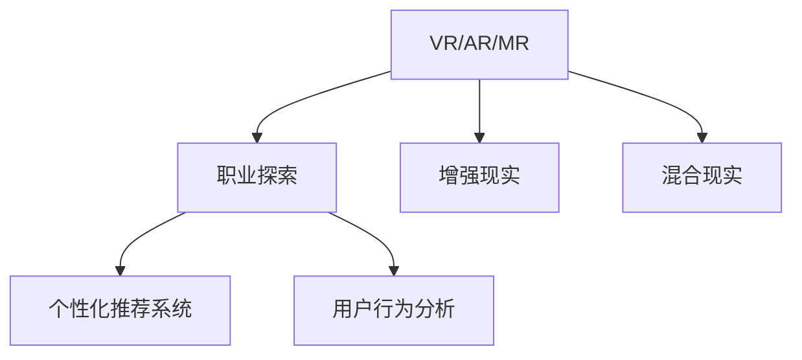

                 

# 虚拟现实职业体验创业：身临其境的职业探索平台

## 1. 背景介绍

### 1.1 问题由来
随着虚拟现实技术（Virtual Reality, VR）的飞速发展，人们已经能够在虚拟环境中体验到几乎与现实无异的感官体验。与此同时，随着就业市场的竞争日益激烈，职场人士对于职业探索的迫切需求不断增长。传统的职业探索方式，如实地考察、信息搜集和咨询等，已经不能满足现代职业探索的需求，尤其是在高竞争的职业领域。基于此，我们提出了利用虚拟现实技术构建职业探索平台，以解决现代职业探索中面临的痛点问题。

### 1.2 问题核心关键点
一个成功的职业探索平台需要具备以下几个关键特点：
- **沉浸式体验**：让用户能够身临其境地了解工作环境和日常工作流程。
- **多样性选择**：提供多种职业领域和工作岗位的虚拟体验，满足不同用户的需求。
- **个性化推荐**：基于用户的兴趣和能力，推荐合适的职业路径。
- **互动性强**：支持用户与虚拟职业导师、同事、客户等进行互动，增强真实感。
- **高效率**：提供快速、便捷的虚拟体验方式，降低用户探索成本。

## 2. 核心概念与联系

### 2.1 核心概念概述

为更好地理解虚拟现实职业体验平台，本节将介绍几个密切相关的核心概念：

- **虚拟现实(VR)**：一种通过计算机生成的仿真环境，使用户能够沉浸在三维空间中进行互动。
- **增强现实(AR)**：通过虚拟信息与现实世界的结合，提供增强的现实体验。
- **混合现实(MR)**：结合VR和AR，创造一个既有虚拟元素又有现实元素的混合空间。
- **职业探索**：通过模拟各种职业环境和日常工作流程，帮助用户了解不同职业的实际情况，从而做出职业决策。
- **个性化推荐系统**：通过数据分析和算法，根据用户的兴趣和背景推荐合适的职业路径和相关资源。
- **用户行为分析**：通过分析用户在虚拟环境中的行为数据，提供个性化的职业指导和建议。

这些概念之间的逻辑关系可以通过以下Mermaid流程图来展示：



这个流程图展示了大模型微调的各个核心概念及其之间的关系：

1. 虚拟现实、增强现实和混合现实提供了虚拟职业探索环境。
2. 职业探索通过模拟不同的职业环境和日常工作流程，帮助用户了解职业情况。
3. 个性化推荐系统根据用户的兴趣和背景，推荐合适的职业路径。
4. 用户行为分析通过分析用户在虚拟环境中的行为数据，提供个性化的职业指导。

这些概念共同构成了虚拟现实职业体验平台的基石，使其能够提供沉浸式、多样性、个性化、互动性强的职业探索体验。

## 3. 核心算法原理 & 具体操作步骤
### 3.1 算法原理概述

虚拟现实职业体验平台的算法原理，可以归纳为以下几个步骤：

1. **数据采集**：收集不同职业的详细信息，包括工作环境、日常工作流程、同事和客户的基本信息等。
2. **数据处理**：对采集到的数据进行处理，包括数据清洗、特征提取、数据标注等，以供虚拟环境构建。
3. **虚拟环境构建**：利用VR/AR/MR技术，构建逼真的虚拟职业环境，包括工作场景、办公设施、同事和客户等。
4. **个性化推荐**：根据用户的行为数据和偏好，使用推荐算法为用户推荐合适的职业路径。
5. **用户互动**：提供与虚拟职业导师、同事、客户等的互动接口，使用户能够沉浸在虚拟环境中，了解职业实际情况。
6. **反馈与优化**：收集用户的反馈数据，不断优化虚拟环境和推荐算法。

### 3.2 算法步骤详解

**Step 1: 数据采集**
- **工作环境数据**：通过现场考察、网络搜集、专家访谈等方式，收集工作环境的照片、视频和文本信息。
- **日常工作流程数据**：通过问卷调查、实地观察等方式，收集用户日常工作的流程和步骤。
- **同事和客户数据**：通过问卷调查、访谈等方式，收集同事和客户的基本信息，包括性格特点、工作职责、沟通方式等。

**Step 2: 数据处理**
- **数据清洗**：去除无用的数据，修正数据错误，处理缺失值。
- **特征提取**：从文本、图像、视频等数据中提取有用的特征，如工作场景的灯光、家具布局等。
- **数据标注**：对工作环境、日常工作流程和同事客户信息进行标注，如工作流程中的各个步骤、同事的职责等。

**Step 3: 虚拟环境构建**
- **环境建模**：使用3D建模软件，根据数据处理后的信息构建虚拟工作环境。
- **交互设计**：设计虚拟环境中的交互界面和功能，使用户能够与虚拟环境中的元素进行互动。
- **渲染与优化**：使用高效的渲染引擎，优化虚拟环境的性能，提高用户的沉浸感和流畅度。

**Step 4: 个性化推荐**
- **用户画像构建**：根据用户的历史行为和兴趣，构建用户画像，包括职业偏好、技能水平等。
- **推荐算法选择**：选择合适的推荐算法，如协同过滤、内容推荐、深度学习等。
- **推荐系统构建**：构建个性化推荐系统，根据用户画像和推荐算法，为用户推荐合适的职业路径。

**Step 5: 用户互动**
- **虚拟导师**：设计虚拟职业导师角色，帮助用户解答职业问题，提供职业建议。
- **同事与客户模拟**：设计虚拟同事和客户，模拟真实工作场景中的互动，使用户了解实际工作情况。
- **互动界面设计**：设计友好的交互界面，支持用户与虚拟导师、同事、客户等进行互动。

**Step 6: 反馈与优化**
- **用户反馈收集**：收集用户对虚拟环境、推荐结果等的反馈，及时调整和优化。
- **模型迭代优化**：基于用户的反馈数据，不断迭代和优化虚拟环境和推荐算法。

### 3.3 算法优缺点

虚拟现实职业体验平台的算法具有以下优点：
1. **沉浸式体验**：通过虚拟现实技术，用户能够身临其境地了解职业情况，增强职业探索的真实感。
2. **多样化选择**：能够提供多种职业领域和工作岗位的虚拟体验，满足不同用户的需求。
3. **个性化推荐**：基于用户的兴趣和能力，推荐合适的职业路径，提高职业探索的精准度。
4. **互动性强**：支持用户与虚拟职业导师、同事、客户等的互动，增强真实感。
5. **高效率**：提供快速、便捷的虚拟体验方式，降低用户探索成本。

同时，该算法也存在一定的局限性：
1. **成本高**：数据采集和虚拟环境构建需要较高的成本和资源投入。
2. **技术复杂**：涉及多种技术，如3D建模、渲染、推荐算法等，技术门槛较高。
3. **数据质量依赖**：虚拟环境的真实感和推荐效果高度依赖于数据的质量和完整性。
4. **用户体验差异**：不同用户的体验和偏好不同，需要根据用户特点进行调整和优化。
5. **设备依赖**：用户需要配备VR/AR设备，限制了用户的体验范围。

尽管存在这些局限性，但就目前而言，虚拟现实职业体验平台仍是一种高效、互动性强的职业探索方式，具有广阔的应用前景。

### 3.4 算法应用领域

虚拟现实职业体验平台可以广泛应用于以下领域：

- **职业规划与指导**：为在校学生、职场新人提供职业探索和规划服务。
- **企业招聘**：为企业提供一种新型的招聘方式，帮助企业更直观地了解候选人的职业素养和工作适应性。
- **职业转换**：为想要转行的职场人士提供职业探索和适配服务，帮助他们顺利过渡到新的职业领域。
- **技能培训**：通过虚拟环境模拟实际工作场景，帮助用户进行技能培训和职业实践。
- **职业咨询**：为职业咨询师提供一种新的咨询工具，提高咨询服务的沉浸感和互动性。

除了上述这些应用场景外，虚拟现实职业体验平台还可应用于教育培训、企业培训、职业健康与安全等领域，为职业探索和职业发展提供全方位支持。

## 4. 数学模型和公式 & 详细讲解 & 举例说明
### 4.1 数学模型构建

假设虚拟现实职业体验平台为每个职业构建了一个虚拟环境 $E$，该环境由多个场景 $S$ 组成。每个场景 $S_i$ 包含多个元素 $E_i$，如办公桌、椅子、显示器等。每个元素 $E_i$ 可以被用户操作，并产生相应的反馈。

定义用户对每个元素 $E_i$ 的偏好为 $P_i$，偏好度在0到1之间，表示用户对元素 $E_i$ 的兴趣程度。用户对每个场景 $S_i$ 的偏好为 $P_S$，偏好度在0到1之间，表示用户对场景 $S_i$ 的整体兴趣程度。

用户在虚拟环境中停留的时间 $T$ 和完成的任务 $T$ 作为衡量用户兴趣度的指标。定义用户对场景 $S_i$ 的停留时间为 $T_i$，完成任务数为 $C_i$，总停留时间为 $T_{total}$，总任务数为 $C_{total}$。

假设用户对场景 $S_i$ 的偏好 $P_S$ 可以用以下公式表示：

$$
P_S = \frac{T_i + \alpha C_i}{T_{total} + \alpha C_{total}}
$$

其中 $\alpha$ 为任务完成度的权重系数，可以根据不同职业领域进行调整。

### 4.2 公式推导过程

根据用户对场景和元素的偏好度，可以使用推荐算法为用户推荐合适的职业路径。假设推荐系统基于协同过滤算法，根据用户历史行为数据构建用户画像，并与其他用户进行相似度比较，推荐相似用户喜欢的职业路径。

协同过滤算法的关键在于计算用户之间的相似度，可以使用余弦相似度公式：

$$
similarity(u, v) = \frac{\sum_{i=1}^{n} p_{ui} \times p_{vi}}{\sqrt{\sum_{i=1}^{n} p_{ui}^2} \times \sqrt{\sum_{i=1}^{n} p_{vi}^2}}
$$

其中 $p_{ui}$ 和 $p_{vi}$ 分别表示用户 $u$ 和用户 $v$ 对职业路径 $i$ 的偏好度。

根据相似度结果，选择相似度最高的若干个用户，将他们喜欢的职业路径推荐给目标用户。假设相似度前 $k$ 个用户对应的职业路径为 $\{path_1, path_2, ..., path_k\}$，推荐算法可以将这些职业路径推荐给目标用户，并计算推荐路径的平均偏好度 $P_R$：

$$
P_R = \frac{1}{k} \sum_{j=1}^{k} \frac{T_{j} + \alpha C_{j}}{T_{total_j} + \alpha C_{total_j}}
$$

### 4.3 案例分析与讲解

假设我们要为一名软件工程师用户推荐合适的职业路径。首先，根据用户的历史行为数据，构建用户画像，包括编程技能、项目经验、技术偏好等。然后，计算用户与平台上的其他用户之间的相似度，选择相似度最高的若干个用户，将他们喜欢的职业路径推荐给目标用户。

例如，如果相似度最高的用户喜欢数据科学和机器学习领域，那么软件工程师用户也有很高的概率对这两个领域感兴趣。推荐算法可以根据这些用户的历史行为数据，计算出数据科学和机器学习领域的停留时间和完成的任务数，并计算推荐路径的平均偏好度。最终，将推荐路径和平均偏好度反馈给用户，帮助其做出职业决策。

## 5. 项目实践：代码实例和详细解释说明
### 5.1 开发环境搭建

在进行虚拟现实职业体验平台开发前，我们需要准备好开发环境。以下是使用Python进行PyTorch开发的环境配置流程：

1. 安装Anaconda：从官网下载并安装Anaconda，用于创建独立的Python环境。

2. 创建并激活虚拟环境：
```bash
conda create -n pytorch-env python=3.8 
conda activate pytorch-env
```

3. 安装PyTorch：根据CUDA版本，从官网获取对应的安装命令。例如：
```bash
conda install pytorch torchvision torchaudio cudatoolkit=11.1 -c pytorch -c conda-forge
```

4. 安装Transformer库：
```bash
pip install transformers
```

5. 安装各类工具包：
```bash
pip install numpy pandas scikit-learn matplotlib tqdm jupyter notebook ipython
```

完成上述步骤后，即可在`pytorch-env`环境中开始项目实践。

### 5.2 源代码详细实现

下面我们以一个简单的虚拟现实环境模拟系统为例，给出使用PyTorch和React构建的代码实现。

首先，定义虚拟场景和元素类：

```python
import torch
import torch.nn as nn
import torch.optim as optim
from torch.utils.data import DataLoader

class Scene:
    def __init__(self):
        self.elements = []

    def add_element(self, element):
        self.elements.append(element)

class Element:
    def __init__(self, name, action, reward):
        self.name = name
        self.action = action
        self.reward = reward

    def interact(self, user):
        user = user + self.action
        return user + self.reward
```

然后，定义用户类：

```python
class User:
    def __init__(self, preferences):
        self.preferences = preferences
        self.rewards = []

    def get_preference(self, scene):
        return self.preferences[scene.name]

    def update_rewards(self, rewards):
        self.rewards += rewards

    def get_reward(self, element):
        return self.rewards[element.name]
```

接着，定义场景类：

```python
class Scene:
    def __init__(self, name, elements):
        self.name = name
        self.elements = elements

    def interact(self, user):
        for element in self.elements:
            user.rewards += element.interact(user)
        return self.name
```

最后，定义交互过程：

```python
class VirtualRealityEnvironment:
    def __init__(self, scenes, user):
        self.scenes = scenes
        self.user = user

    def interact(self, scene_name):
        scene = self.scenes[scene_name]
        self.user.update_rewards(scene.interact(self.user))
        return scene_name
```

这段代码实现了基本的虚拟现实交互过程，用户通过与场景中的元素进行互动，获得奖励并更新偏好度。在实际应用中，需要对这些基本组件进行扩展和优化，以支持更复杂的虚拟场景和用户行为分析。

### 5.3 代码解读与分析

让我们再详细解读一下关键代码的实现细节：

**Scene类**：
- `__init__`方法：初始化虚拟场景和其中的元素。
- `add_element`方法：向场景中添加新的元素。
- `interact`方法：用户与场景中的元素进行互动，并更新用户的偏好度。

**Element类**：
- `__init__`方法：初始化虚拟元素的属性。
- `interact`方法：用户与元素进行互动，并计算奖励。

**User类**：
- `__init__`方法：初始化用户的基本信息和奖励列表。
- `get_preference`方法：获取用户对某个场景的偏好度。
- `update_rewards`方法：根据用户与元素的互动，更新用户的奖励列表。
- `get_reward`方法：获取用户对某个元素的奖励值。

**VirtualRealityEnvironment类**：
- `__init__`方法：初始化虚拟现实环境。
- `interact`方法：用户与虚拟环境中的场景进行互动，并更新用户的偏好度和奖励列表。

这段代码虽然简单，但已经体现了虚拟现实职业体验平台的基本交互逻辑。在实际应用中，需要对这些组件进行扩展和优化，以支持更复杂的虚拟场景和用户行为分析。例如，可以引入更多的场景元素，如办公桌、椅子、显示器等，设计更多的工作任务和互动场景，构建更逼真的虚拟环境。

## 6. 实际应用场景

### 6.1 智能招聘系统

虚拟现实职业体验平台可以应用于企业招聘中，帮助企业更好地了解候选人的职业素养和工作适应性。例如，企业可以在虚拟环境中模拟实际工作场景，要求候选人完成特定的工作任务，观察候选人的工作表现和决策能力，从而评估其是否适合特定的岗位。

具体而言，企业可以通过平台提供的虚拟场景和任务，引导候选人进行虚拟面试。候选人需要在虚拟环境中完成一系列任务，如编写代码、处理数据、解决实际问题等，并接受虚拟导师的评估。平台可以根据候选人的表现，自动生成职业素养报告，帮助企业做出更好的招聘决策。

### 6.2 职业技能培训

虚拟现实职业体验平台还可以用于职业技能培训，为员工提供一种新型的培训方式。例如，IT行业可以通过平台模拟软件开发流程、系统维护、项目管理等职业场景，让员工进行虚拟实践。员工可以在虚拟环境中学习新技能，掌握实际工作流程，提高职业技能。

在培训过程中，虚拟导师可以根据员工的互动行为，提供个性化的指导和建议，帮助员工更快地掌握新技能。平台还可以根据员工的表现，生成培训报告，评估员工的学习效果，提出改进建议。

### 6.3 职业健康与安全

虚拟现实职业体验平台可以应用于职业健康与安全领域，帮助员工进行职业健康与安全培训。例如，安全生产部门可以通过平台模拟各种安全生产场景，让员工进行虚拟演练。员工需要在虚拟环境中识别和应对各种安全隐患，掌握应急处理方法，提高安全生产意识和能力。

平台可以根据员工的表现，生成培训报告，评估员工的安全意识和应急处理能力，提出改进建议。安全生产部门还可以根据员工的表现，进行有针对性的安全培训，提升安全生产水平。

## 7. 工具和资源推荐
### 7.1 学习资源推荐

为了帮助开发者系统掌握虚拟现实职业体验平台的技术基础和实践技巧，这里推荐一些优质的学习资源：

1. 《虚拟现实技术基础》系列博文：由虚拟现实专家撰写，深入浅出地介绍了虚拟现实技术的原理、应用和开发方法。

2. 《增强现实开发实战》课程：Udacity提供的增强现实开发课程，涵盖多种增强现实技术和开发工具。

3. 《混合现实技术》书籍：介绍混合现实技术的原理和应用，适合深入学习混合现实开发。

4. 《用户行为分析与推荐系统》书籍：详细介绍了推荐算法的原理和实现，适合学习个性化推荐系统。

5. 《虚拟现实职业探索平台》开源项目：提供了一个开源的虚拟现实职业探索平台，包括数据采集、虚拟环境构建、推荐算法等组件，是学习虚拟现实职业体验平台的重要参考。

通过对这些资源的学习实践，相信你一定能够快速掌握虚拟现实职业体验平台的技术细节，并用于解决实际的职业探索问题。

### 7.2 开发工具推荐

高效的开发离不开优秀的工具支持。以下是几款用于虚拟现实职业体验平台开发的常用工具：

1. Unity：一款广泛使用的游戏引擎，支持VR/AR/MR开发，提供丰富的3D建模和渲染功能。

2. Unreal Engine：一款高端的游戏引擎，支持高品质的虚拟现实开发，适合制作复杂的虚拟场景和交互界面。

3. VRTK：一款基于Unity的虚拟现实开发框架，提供了一套简单易用的组件和工具，支持多种VR设备。

4. Google ARCore：由Google提供的增强现实开发平台，支持多种AR应用开发。

5. ARKit：由苹果提供的增强现实开发平台，支持多种iOS设备。

6. TensorFlow：由Google提供的开源深度学习框架，支持各种机器学习和推荐算法。

7. PyTorch：由Facebook提供的开源深度学习框架，支持高效的推荐系统开发。

合理利用这些工具，可以显著提升虚拟现实职业体验平台的开发效率，加快创新迭代的步伐。

### 7.3 相关论文推荐

虚拟现实职业体验平台的研究源于学界的持续研究。以下是几篇奠基性的相关论文，推荐阅读：

1. "Virtual Reality in Education: A Survey"（《虚拟现实在教育中的应用综述》）：综述了虚拟现实技术在教育中的应用，包括虚拟课堂、虚拟实验室等。

2. "Virtual Reality Training for Surgeons"（《虚拟现实手术培训》）：介绍了虚拟现实技术在医学领域的手术培训应用，提高了手术技能的实际水平。

3. "Virtual Reality in Psychology: A Review"（《虚拟现实在心理学中的应用综述》）：综述了虚拟现实技术在心理学领域的应用，包括虚拟治疗、虚拟实验等。

4. "Virtual Reality for Job Exploration"（《虚拟现实职业探索》）：介绍了虚拟现实技术在职业探索中的应用，包括虚拟工作场景模拟、职业路径推荐等。

5. "Adaptive Recommendation Systems"（《自适应推荐系统》）：介绍了推荐算法的原理和实现，支持虚拟现实职业体验平台的用户推荐系统。

这些论文代表了大模型微调技术的发展脉络。通过学习这些前沿成果，可以帮助研究者把握学科前进方向，激发更多的创新灵感。

## 8. 总结：未来发展趋势与挑战

### 8.1 总结

本文对虚拟现实职业体验平台进行了全面系统的介绍。首先阐述了虚拟现实职业体验平台的背景和意义，明确了平台在职业探索中的应用价值。其次，从原理到实践，详细讲解了虚拟现实职业体验平台的算法原理和具体操作步骤，给出了代码实例和详细解释。同时，本文还广泛探讨了平台在招聘、培训、安全等各个领域的应用场景，展示了平台的广阔应用前景。此外，本文精选了虚拟现实职业体验平台的学习资源、开发工具和相关论文，力求为读者提供全方位的技术指引。

通过本文的系统梳理，可以看到，虚拟现实职业体验平台在现代职业探索中扮演着越来越重要的角色。它通过沉浸式、多样化、个性化、互动性强的虚拟环境，帮助用户了解职业情况，做出更加明智的职业决策。未来，伴随技术的不断发展，虚拟现实职业体验平台必将在更多领域得到应用，为职业探索和职业发展提供全面支持。

### 8.2 未来发展趋势

展望未来，虚拟现实职业体验平台将呈现以下几个发展趋势：

1. **高分辨率和沉浸感增强**：随着VR/AR技术的不断进步，虚拟环境的分辨率和沉浸感将进一步提升，使用户能够更加真实地体验职业场景。
2. **多模态互动**：引入语音、手势等多种交互方式，提升用户的互动体验。
3. **实时反馈和优化**：基于用户的实时互动数据，动态调整虚拟环境，提高用户的沉浸感和体验感。
4. **智能推荐系统**：引入机器学习和推荐算法，实现更加精准和个性化的职业推荐。
5. **跨平台兼容**：支持多种VR/AR设备，增强平台的普及性和可访问性。
6. **虚拟职业导师**：引入虚拟职业导师，提供个性化的职业指导和建议。

这些趋势凸显了虚拟现实职业体验平台在职业探索中的重要性和应用潜力，将继续推动其在各个领域的应用发展。

### 8.3 面临的挑战

尽管虚拟现实职业体验平台已经取得了不小的进展，但在迈向更加智能化、普适化应用的过程中，它仍面临着诸多挑战：

1. **成本高昂**：虚拟现实设备的成本较高，设备普及率较低，限制了平台的应用范围。
2. **技术复杂**：涉及多种技术，如3D建模、渲染、交互设计等，技术门槛较高。
3. **用户体验差异**：不同用户的体验和偏好不同，需要根据用户特点进行调整和优化。
4. **数据隐私和安全**：用户数据的安全和隐私保护需要高度重视，避免数据泄露和滥用。
5. **设备兼容性**：不同设备之间的兼容性和互操作性问题需要解决，提高平台的普及性。

尽管存在这些挑战，但随着技术的不断进步和市场的不断成熟，虚拟现实职业体验平台必将在未来迎来更多的发展机遇。

### 8.4 研究展望

面对虚拟现实职业体验平台所面临的挑战，未来的研究需要在以下几个方面寻求新的突破：

1. **降低成本**：开发低成本的虚拟现实设备，提高设备的普及率和用户可访问性。
2. **提高交互体验**：引入语音、手势等多种交互方式，提升用户的互动体验。
3. **增强实时性**：提高虚拟环境的渲染速度和互动响应速度，提升用户的沉浸感和体验感。
4. **优化推荐算法**：引入更加先进的推荐算法，实现更加精准和个性化的职业推荐。
5. **提升安全性**：加强用户数据的安全和隐私保护，确保平台的安全性和可信度。
6. **开发跨平台应用**：支持多种VR/AR设备，增强平台的兼容性和普及性。

这些研究方向的探索，必将引领虚拟现实职业体验平台迈向更高的台阶，为职业探索和职业发展提供更加全面和高效的支持。

## 9. 附录：常见问题与解答

**Q1：虚拟现实职业体验平台是否适用于所有职业领域？**

A: 虚拟现实职业体验平台适用于大多数职业领域，特别是那些难以通过实地考察和体验进行探索的领域。例如，医疗、航空、深海等高风险职业，或者某些特殊的职业角色，如航天员、消防员等。然而，对于需要高度操作技能的职业，如厨师、雕刻师等，虚拟现实体验的精确度可能会受到一定的限制。

**Q2：如何保证虚拟现实职业体验平台的安全性？**

A: 虚拟现实职业体验平台的安全性主要依赖于数据隐私和安全技术。首先需要确保用户的隐私数据不被泄露或滥用，可以通过加密存储和传输数据，限制数据访问权限，加强数据保护措施。其次，需要防范恶意攻击，如黑客入侵、数据篡改等，可以通过安全审计、异常检测等技术手段进行防范。

**Q3：虚拟现实职业体验平台的应用范围有哪些？**

A: 虚拟现实职业体验平台可以应用于以下领域：

- **职业探索与规划**：为在校学生、职场新人提供职业探索和规划服务。
- **招聘与录用**：为企业提供一种新型的招聘方式，帮助企业更直观地了解候选人的职业素养和工作适应性。
- **技能培训**：通过虚拟环境模拟实际工作场景，帮助员工进行技能培训和职业实践。
- **职业健康与安全**：帮助员工进行职业健康与安全培训，提高安全生产水平。
- **职业咨询与指导**：为职业咨询师提供一种新的咨询工具，提高咨询服务的沉浸感和互动性。

除了上述这些应用场景外，虚拟现实职业体验平台还可应用于教育培训、企业培训、职业健康与安全等领域，为职业探索和职业发展提供全方位支持。

**Q4：虚拟现实职业体验平台的技术难点有哪些？**

A: 虚拟现实职业体验平台的技术难点主要包括：

- **高分辨率和沉浸感**：如何提高虚拟环境的分辨率和沉浸感，使用户能够更加真实地体验职业场景。
- **多模态互动**：如何引入语音、手势等多种交互方式，提升用户的互动体验。
- **实时反馈和优化**：如何基于用户的实时互动数据，动态调整虚拟环境，提高用户的沉浸感和体验感。
- **智能推荐系统**：如何引入机器学习和推荐算法，实现更加精准和个性化的职业推荐。
- **跨平台兼容**：如何支持多种VR/AR设备，增强平台的普及性和可访问性。

这些技术难点需要在未来的研究中不断攻克，才能进一步提升虚拟现实职业体验平台的用户体验和应用效果。

**Q5：虚拟现实职业体验平台如何提高用户体验？**

A: 虚拟现实职业体验平台可以通过以下方式提高用户体验：

- **高分辨率和沉浸感**：提高虚拟环境的分辨率和沉浸感，使用户能够更加真实地体验职业场景。
- **多模态互动**：引入语音、手势等多种交互方式，提升用户的互动体验。
- **实时反馈和优化**：基于用户的实时互动数据，动态调整虚拟环境，提高用户的沉浸感和体验感。
- **智能推荐系统**：引入机器学习和推荐算法，实现更加精准和个性化的职业推荐。
- **虚拟职业导师**：引入虚拟职业导师，提供个性化的职业指导和建议。

通过这些技术手段，虚拟现实职业体验平台可以进一步提升用户体验，帮助用户更好地了解职业情况，做出更加明智的职业决策。

---

作者：禅与计算机程序设计艺术 / Zen and the Art of Computer Programming

