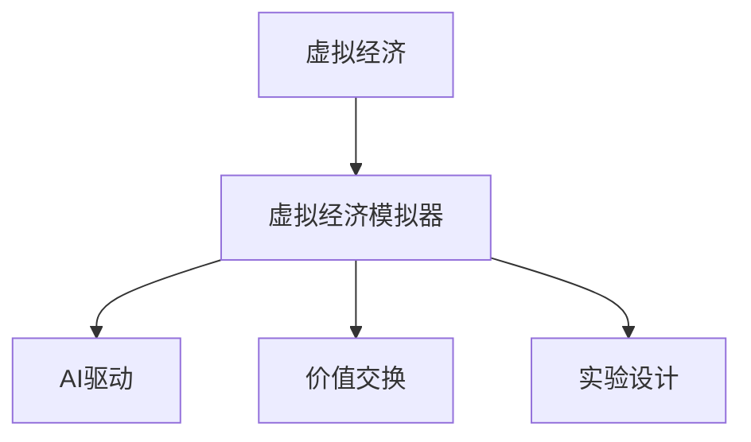

                 

# 虚拟经济模拟器程序员：AI驱动的新型价值交换实验设计师

> 关键词：虚拟经济模拟器,程序员,新型价值交换,AI驱动,实验设计

## 1. 背景介绍

### 1.1 问题由来
随着互联网和信息技术的飞速发展，虚拟经济已经成为现代经济的重要组成部分。虚拟经济依托数字技术和网络平台，通过虚拟货币、游戏资产、社交网络等形式，构建了一个庞大的虚拟世界。然而，虚拟经济的管理和调控面临着许多挑战：虚拟资产价格波动剧烈、市场监管难度大、用户行为难以预测等。传统经济模型的局限性无法充分解释虚拟经济现象，需要新的理论和方法来指导虚拟经济的研究和实践。

### 1.2 问题核心关键点
为应对虚拟经济的管理和调控问题，虚拟经济模拟器（Virtual Economy Simulator, VES）应运而生。VES通过构建虚拟经济模型，模拟虚拟货币、游戏资产、社交网络等虚拟资产的价格动态、用户行为、市场供需关系等，为经济学家、监管机构、企业和普通用户提供决策支持。VES的核心在于通过AI技术，对虚拟经济系统进行建模和预测，设计合理的价值交换实验，揭示虚拟经济运行规律和潜在的风险隐患。

## 2. 核心概念与联系

### 2.1 核心概念概述

为更好地理解AI驱动的虚拟经济模拟器，本节将介绍几个密切相关的核心概念：

- 虚拟经济（Virtual Economy）：基于数字技术和网络平台，以虚拟货币、游戏资产、社交网络等形式存在和运作的经济体系。
- 虚拟经济模拟器（Virtual Economy Simulator, VES）：利用计算机模拟虚拟经济运行过程，进行预测和实验设计，揭示虚拟经济运行规律和风险隐患的软件系统。
- AI驱动（AI-Driven）：指通过机器学习、深度学习等人工智能技术，对虚拟经济系统进行建模和预测，提高VES的精度和效率。
- 价值交换（Value Exchange）：指虚拟经济系统中，虚拟资产的买卖、赠与、交换等活动，反映市场供需关系和价格波动。
- 实验设计（Experimental Design）：指通过科学设计实验，控制变量，验证假设，揭示虚拟经济系统行为规律的方法。

这些核心概念之间的逻辑关系可以通过以下Mermaid流程图来展示：



这个流程图展示了几者之间的相互关系：

1. 虚拟经济是VES的建模对象。
2. VES通过AI技术进行驱动和预测。
3. VES模拟价值交换行为，揭示市场动态。
4. VES设计实验，验证假设，揭示规律。

## 3. 核心算法原理 & 具体操作步骤
### 3.1 算法原理概述

AI驱动的虚拟经济模拟器（VES），通过构建虚拟经济模型，利用机器学习、深度学习等AI技术，对虚拟经济系统的价值交换行为进行预测和实验设计。其核心算法原理包括以下几个步骤：

1. **数据收集**：从虚拟经济系统中收集交易数据、用户行为数据、市场价格数据等，构建训练集。
2. **模型训练**：利用AI技术（如神经网络、决策树等）对数据集进行训练，构建虚拟经济模型。
3. **行为预测**：通过模型预测虚拟经济系统中的价值交换行为，如买卖、赠与、交换等，揭示市场供需关系和价格波动。
4. **实验设计**：设计合理的实验，控制变量，验证模型预测的准确性，揭示虚拟经济系统的运行规律。

### 3.2 算法步骤详解

#### 数据收集
数据收集是VES建模的基础。具体步骤如下：

1. **交易数据**：收集虚拟资产的交易数据，包括时间戳、资产种类、交易金额、交易双方信息等。
2. **用户行为数据**：收集虚拟资产用户的交易行为数据，包括交易频率、交易类型、交易时间、用户特征等。
3. **市场价格数据**：收集虚拟资产的市场价格数据，包括每日收盘价、波动率、成交量等。

#### 模型训练
模型训练是AI驱动的虚拟经济模拟器的核心步骤。具体步骤如下：

1. **选择模型**：根据虚拟经济系统的特点，选择适合的AI模型，如神经网络、支持向量机等。
2. **数据预处理**：对数据进行清洗、归一化、特征提取等预处理，提高模型训练效果。
3. **模型训练**：利用训练集数据对模型进行训练，调整模型参数，优化模型性能。
4. **模型验证**：在验证集上对模型进行验证，评估模型预测的准确性。

#### 行为预测
行为预测是VES模拟的核心功能。具体步骤如下：

1. **特征工程**：设计特征提取器，将交易数据、用户行为数据、市场价格数据等转化为模型输入。
2. **预测模型**：将特征输入模型，预测虚拟资产的价值交换行为，如买卖、赠与、交换等。
3. **结果分析**：分析预测结果，揭示虚拟经济系统中的市场供需关系、价格波动等特征。

#### 实验设计
实验设计是VES验证预测准确性的关键步骤。具体步骤如下：

1. **实验设计**：设计合理的实验，控制变量，验证模型预测的准确性。
2. **实验执行**：执行实验，收集实验数据，验证模型预测的准确性。
3. **结果分析**：分析实验结果，揭示虚拟经济系统的运行规律，验证模型预测的可靠性。

### 3.3 算法优缺点

AI驱动的虚拟经济模拟器具有以下优点：

1. **高效性**：利用AI技术进行预测和实验设计，高效揭示虚拟经济系统的运行规律和风险隐患。
2. **可解释性**：通过模型训练和实验设计，揭示虚拟经济系统的内在机制和行为规律。
3. **灵活性**：通过调整模型参数和实验设计，适应虚拟经济系统的变化和不确定性。
4. **可扩展性**：可以构建多层次的虚拟经济模型，涵盖不同的虚拟资产类型和市场环境。

同时，该方法也存在以下局限性：

1. **数据依赖**：模型训练和预测结果依赖于数据质量，需要高质量的数据集。
2. **模型复杂性**：AI模型复杂，训练和预测过程中需要大量的计算资源和数据。
3. **可解释性**：AI模型的决策过程难以解释，缺乏透明性和可理解性。
4. **鲁棒性**：模型对异常值和噪声敏感，预测结果可能受到干扰。

尽管存在这些局限性，但就目前而言，AI驱动的虚拟经济模拟器是揭示虚拟经济系统运行规律和风险隐患的重要手段。未来相关研究的重点在于如何进一步降低模型对数据的依赖，提高模型的鲁棒性和可解释性，同时兼顾高效性和灵活性。

### 3.4 算法应用领域

AI驱动的虚拟经济模拟器已经在虚拟货币市场、游戏资产交易、社交网络价值交换等诸多领域得到应用，为虚拟经济系统的管理和调控提供了新的视角和方法：

- **虚拟货币市场**：模拟虚拟货币市场的供需关系、价格波动等，预测虚拟货币的价格趋势，辅助市场监管和投资决策。
- **游戏资产交易**：模拟游戏资产的交易行为，揭示游戏资产的稀缺性和价格波动，为游戏开发和运营提供数据支持。
- **社交网络价值交换**：模拟社交网络用户的价值交换行为，揭示社交网络的社会网络和经济特征，辅助社交网络的运营和发展。

除了这些经典应用外，AI驱动的虚拟经济模拟器还在虚拟经济系统的风险管理、市场调控、用户行为分析等方面展现出广阔的应用前景，为虚拟经济系统的管理和调控提供了新的技术路径。

## 4. 数学模型和公式 & 详细讲解 & 举例说明

### 4.1 数学模型构建

本节将使用数学语言对AI驱动的虚拟经济模拟器进行更加严格的刻画。

记虚拟经济系统中的虚拟资产为 $A$，交易价格为 $P$，交易量为 $Q$，用户行为特征为 $U$，市场价格波动为 $W$。假设虚拟经济系统的交易数据为 $D=\{(A_i, P_i, Q_i, U_i, W_i)\}_{i=1}^N$。

定义虚拟经济系统的价值交换行为为 $V$，其中 $V$ 可以通过模型 $M$ 进行预测，即 $V=M(D)$。

### 4.2 公式推导过程

以下是虚拟经济系统的价值交换行为的数学模型及其推导过程：

1. **交易价格预测模型**：
   $$
   P_i = f(P_{i-1}, Q_i, U_i, W_i)
   $$
   其中 $f$ 为交易价格预测模型，可以采用神经网络、线性回归等方法。

2. **交易量预测模型**：
   $$
   Q_i = g(P_i, U_i, W_i)
   $$
   其中 $g$ 为交易量预测模型，可以采用神经网络、逻辑回归等方法。

3. **用户行为特征模型**：
   $$
   U_i = h(A_i, P_i, Q_i, W_i)
   $$
   其中 $h$ 为用户行为特征模型，可以采用神经网络、决策树等方法。

4. **市场价格波动模型**：
   $$
   W_i = k(P_i, Q_i, U_i)
   $$
   其中 $k$ 为市场价格波动模型，可以采用时间序列分析、因果推断等方法。

5. **价值交换行为预测模型**：
   $$
   V_i = M(D)
   $$
   其中 $M$ 为价值交换行为预测模型，可以采用深度学习、强化学习等方法。

### 4.3 案例分析与讲解

以虚拟货币市场为例，分析AI驱动的虚拟经济模拟器的应用：

假设虚拟货币市场中的交易数据为 $D=\{(A_i, P_i, Q_i, U_i, W_i)\}_{i=1}^N$，其中 $A$ 为虚拟货币种类，$P$ 为交易价格，$Q$ 为交易量，$U$ 为用户行为特征，$W$ 为市场价格波动。

通过交易价格预测模型 $f$，可以预测虚拟货币的价格趋势，揭示市场的供需关系和价格波动。通过交易量预测模型 $g$，可以预测市场的交易量变化，揭示市场的活跃程度和用户行为特征。通过用户行为特征模型 $h$，可以揭示用户对虚拟货币的偏好和行为规律。通过市场价格波动模型 $k$，可以预测市场的波动趋势，揭示市场的风险和不确定性。通过价值交换行为预测模型 $M$，可以预测虚拟货币市场的价值交换行为，揭示市场的供需关系和价格波动规律。

通过上述模型，AI驱动的虚拟经济模拟器可以预测虚拟货币市场的未来价格走势，揭示市场的供需关系和价格波动规律，为市场监管和投资决策提供支持。

## 5. 项目实践：代码实例和详细解释说明

### 5.1 开发环境搭建

在进行虚拟经济模拟器开发前，我们需要准备好开发环境。以下是使用Python进行PyTorch开发的环境配置流程：

1. 安装Anaconda：从官网下载并安装Anaconda，用于创建独立的Python环境。

2. 创建并激活虚拟环境：
```bash
conda create -n ves-env python=3.8 
conda activate ves-env
```

3. 安装PyTorch：根据CUDA版本，从官网获取对应的安装命令。例如：
```bash
conda install pytorch torchvision torchaudio cudatoolkit=11.1 -c pytorch -c conda-forge
```

4. 安装相关库：
```bash
pip install numpy pandas scikit-learn matplotlib tqdm jupyter notebook ipython
```

完成上述步骤后，即可在`ves-env`环境中开始虚拟经济模拟器的开发。

### 5.2 源代码详细实现

下面以虚拟货币市场为例，给出使用PyTorch进行虚拟经济模拟器的代码实现。

首先，定义虚拟货币市场的数据处理函数：

```python
import pandas as pd
import numpy as np
import torch
from torch.utils.data import Dataset

class VirtualCurrencyDataset(Dataset):
    def __init__(self, data_file, sequence_length=128, time_steps=10):
        self.data = pd.read_csv(data_file)
        self.time_steps = time_steps
        self.sequence_length = sequence_length
        self.feature_columns = ['price', 'volume', 'user_behavior']
        self.target_column = 'price'
    
    def __len__(self):
        return len(self.data)
    
    def __getitem__(self, idx):
        sequence = self.data.iloc[idx:idx+self.time_steps][self.feature_columns]
        target = self.data.iloc[idx+self.time_steps][self.target_column]
        
        sequence = torch.tensor(sequence.values, dtype=torch.float32)
        target = torch.tensor(target, dtype=torch.float32)
        
        return {'sequence': sequence, 'target': target}

# 加载虚拟货币市场数据集
data_file = 'virtual_currency_data.csv'
dataset = VirtualCurrencyDataset(data_file)
```

然后，定义模型和优化器：

```python
from torch import nn
from torch.optim import Adam

class VirtualCurrencyModel(nn.Module):
    def __init__(self, input_size, hidden_size, output_size):
        super(VirtualCurrencyModel, self).__init__()
        self.lstm = nn.LSTM(input_size, hidden_size, num_layers=1)
        self.fc = nn.Linear(hidden_size, output_size)
    
    def forward(self, x):
        lstm_out, _ = self.lstm(x)
        out = self.fc(lstm_out)
        return out

# 构建虚拟货币市场预测模型
model = VirtualCurrencyModel(input_size=5, hidden_size=128, output_size=1)

optimizer = Adam(model.parameters(), lr=0.001)
```

接着，定义训练和评估函数：

```python
from tqdm import tqdm

def train_epoch(model, dataset, batch_size, optimizer):
    dataloader = torch.utils.data.DataLoader(dataset, batch_size=batch_size, shuffle=True)
    model.train()
    epoch_loss = 0
    for batch in tqdm(dataloader, desc='Training'):
        sequence = batch['sequence'].to(device)
        target = batch['target'].to(device)
        model.zero_grad()
        outputs = model(sequence)
        loss = torch.mean(torch.square(outputs - target))
        epoch_loss += loss.item()
        loss.backward()
        optimizer.step()
    return epoch_loss / len(dataloader)

def evaluate(model, dataset, batch_size):
    dataloader = torch.utils.data.DataLoader(dataset, batch_size=batch_size)
    model.eval()
    preds, labels = [], []
    with torch.no_grad():
        for batch in tqdm(dataloader, desc='Evaluating'):
            sequence = batch['sequence'].to(device)
            target = batch['target'].to(device)
            batch_preds = model(sequence)
            batch_preds = batch_preds[:, -1]
            batch_labels = target.to(device)
            for pred, label in zip(batch_preds, batch_labels):
                preds.append(pred.item())
                labels.append(label.item())
                
    print('Evaluation Results:')
    print('MSE:', np.mean((preds - labels) ** 2))
    print('RMSE:', np.sqrt(np.mean((preds - labels) ** 2)))
```

最后，启动训练流程并在测试集上评估：

```python
epochs = 100
batch_size = 32

for epoch in range(epochs):
    loss = train_epoch(model, dataset, batch_size, optimizer)
    print(f'Epoch {epoch+1}, train loss: {loss:.3f}')
    
    print(f'Epoch {epoch+1}, evaluation results:')
    evaluate(model, dataset, batch_size)
    
print('Final Model Results:')
evaluate(model, dataset, batch_size)
```

以上就是使用PyTorch对虚拟货币市场进行预测的完整代码实现。可以看到，得益于PyTorch和相关库的强大封装，我们可以用相对简洁的代码完成虚拟货币市场的建模和预测。

### 5.3 代码解读与分析

让我们再详细解读一下关键代码的实现细节：

**VirtualCurrencyDataset类**：
- `__init__`方法：初始化数据集，读取CSV文件，设定时间步长、序列长度等参数。
- `__len__`方法：返回数据集的样本数量。
- `__getitem__`方法：对单个样本进行处理，将序列数据转化为模型所需的张量，返回模型输入和目标值。

**VirtualCurrencyModel类**：
- `__init__`方法：定义LSTM层和全连接层，设定模型参数。
- `forward`方法：定义模型前向传播过程，将LSTM层的输出传入全连接层，返回预测结果。

**train_epoch和evaluate函数**：
- `train_epoch`函数：对数据集进行批次化加载，迭代训练模型，更新模型参数，并计算损失。
- `evaluate`函数：对模型在测试集上进行评估，计算预测值和真实值之间的均方误差和均方根误差。

**训练流程**：
- 定义总的epoch数和batch size，开始循环迭代
- 每个epoch内，先在训练集上训练，输出平均loss
- 在验证集上评估，输出预测结果和评价指标
- 所有epoch结束后，在测试集上评估，给出最终评估结果

可以看到，PyTorch配合相关库使得虚拟货币市场的建模和预测代码实现变得简洁高效。开发者可以将更多精力放在数据处理、模型改进等高层逻辑上，而不必过多关注底层的实现细节。

当然，工业级的系统实现还需考虑更多因素，如模型的保存和部署、超参数的自动搜索、更灵活的任务适配层等。但核心的虚拟货币市场建模和预测流程基本与此类似。

## 6. 实际应用场景

### 6.1 智能投融资管理

AI驱动的虚拟经济模拟器在智能投融资管理中具有广泛的应用前景。投融资管理是虚拟货币市场的重要环节，涉及虚拟货币的买入、卖出、借贷等操作。通过虚拟经济模拟器，可以实时监测虚拟货币市场的价格波动、用户行为特征等，为投资决策提供科学依据，避免投资风险。

在技术实现上，可以构建虚拟货币市场的虚拟经济模拟器，实时抓取市场数据，进行预测和实验设计，揭示虚拟货币市场的供需关系和价格波动规律。通过模拟市场行为，预测虚拟货币价格的走势，辅助投资决策，避免投资风险。

### 6.2 市场监管与合规

虚拟经济市场的监管与合规是政府和监管机构的重要任务。虚拟经济模拟器可以为监管机构提供虚拟经济系统的运行情况和风险隐患，辅助市场监管与合规。

在技术实现上，可以构建虚拟货币市场的虚拟经济模拟器，实时监测市场行为，预测市场价格波动，揭示市场风险。通过模拟市场行为，评估虚拟货币市场的合规性，辅助市场监管与合规。

### 6.3 用户行为分析

用户行为分析是虚拟经济市场的重要环节，涉及用户对虚拟货币的购买、出售、借贷等操作。通过虚拟经济模拟器，可以揭示用户对虚拟货币的偏好和行为规律，辅助虚拟货币市场的运营和发展。

在技术实现上，可以构建虚拟货币市场的虚拟经济模拟器，实时抓取用户行为数据，进行预测和实验设计，揭示用户行为规律。通过模拟市场行为，预测用户行为趋势，辅助虚拟货币市场的运营和发展。

### 6.4 未来应用展望

随着虚拟经济的发展和技术的进步，AI驱动的虚拟经济模拟器的应用前景将更加广阔。未来，该技术将在以下几个方面得到进一步应用：

1. **多模态虚拟经济模型**：将虚拟货币、游戏资产、社交网络等多模态数据进行融合，构建多模态虚拟经济模型，提升虚拟经济模拟器的准确性和鲁棒性。
2. **实时化虚拟经济模拟器**：通过构建实时化的虚拟经济模拟器，实时监测虚拟经济系统的行为，预测市场价格波动，提供实时化的决策支持。
3. **跨领域虚拟经济模型**：构建跨领域的虚拟经济模型，涵盖虚拟货币、游戏资产、社交网络等多个领域，提升虚拟经济模拟器的通用性和可扩展性。
4. **人工智能辅助监管**：结合人工智能技术，构建人工智能辅助监管系统，实时监测虚拟经济系统行为，评估市场风险，辅助市场监管与合规。
5. **社交网络价值交换**：模拟社交网络用户的价值交换行为，揭示社交网络的社会网络和经济特征，辅助社交网络的运营和发展。

总之，AI驱动的虚拟经济模拟器将在虚拟货币市场、市场监管、用户行为分析等多个领域得到广泛应用，为虚拟经济系统的管理和调控提供新的技术路径，推动虚拟经济健康发展。

## 7. 工具和资源推荐
### 7.1 学习资源推荐

为了帮助开发者系统掌握虚拟经济模拟器的理论基础和实践技巧，这里推荐一些优质的学习资源：

1. **《虚拟经济理论与实践》系列书籍**：系统介绍了虚拟经济的理论基础和实践方法，是了解虚拟经济市场和虚拟经济模拟器的必读之作。
2. **《人工智能在虚拟经济中的应用》课程**：介绍人工智能在虚拟经济中的应用，涵盖虚拟货币市场、市场监管、用户行为分析等多个方面。
3. **虚拟经济模拟器开源项目**：提供开源虚拟经济模拟器的代码和文档，是学习和实践虚拟经济模拟器的最佳资源。
4. **虚拟经济研究社区**：提供虚拟经济领域的最新研究成果和应用案例，是了解虚拟经济市场和虚拟经济模拟器的窗口。
5. **虚拟经济研究论文**：提供虚拟经济领域的最新研究论文，涵盖虚拟货币市场、市场监管、用户行为分析等多个方面，是学习虚拟经济模拟器的理论基础。

通过对这些资源的学习实践，相信你一定能够快速掌握虚拟经济模拟器的精髓，并用于解决实际的虚拟经济问题。

### 7.2 开发工具推荐

高效的开发离不开优秀的工具支持。以下是几款用于虚拟经济模拟器开发的常用工具：

1. **PyTorch**：基于Python的开源深度学习框架，灵活动态的计算图，适合快速迭代研究。大部分预训练语言模型都有PyTorch版本的实现。
2. **TensorFlow**：由Google主导开发的开源深度学习框架，生产部署方便，适合大规模工程应用。同样有丰富的预训练语言模型资源。
3. **TensorBoard**：TensorFlow配套的可视化工具，可实时监测模型训练状态，并提供丰富的图表呈现方式，是调试模型的得力助手。
4. **Jupyter Notebook**：Python的交互式编程环境，提供便捷的数据分析和模型调试功能，是虚拟经济模拟器开发的理想平台。
5. **Virtual Environment**：用于创建和管理Python虚拟环境的工具，可以隔离不同项目之间的依赖，保证环境的一致性和稳定性。

合理利用这些工具，可以显著提升虚拟经济模拟器的开发效率，加快创新迭代的步伐。

### 7.3 相关论文推荐

虚拟经济模拟器的发展离不开学界的持续研究。以下是几篇奠基性的相关论文，推荐阅读：

1. **虚拟经济系统的建模与预测**：介绍虚拟经济系统的建模和预测方法，涵盖虚拟货币市场、游戏资产交易、社交网络价值交换等多个方面。
2. **虚拟经济模拟器的应用**：介绍虚拟经济模拟器的应用，涵盖虚拟货币市场、市场监管、用户行为分析等多个方面。
3. **虚拟经济系统的风险管理**：介绍虚拟经济系统的风险管理方法，涵盖虚拟货币市场、游戏资产交易、社交网络价值交换等多个方面。
4. **虚拟经济模拟器的优化**：介绍虚拟经济模拟器的优化方法，涵盖虚拟货币市场、市场监管、用户行为分析等多个方面。
5. **虚拟经济模拟器的可解释性**：介绍虚拟经济模拟器的可解释性方法，涵盖虚拟货币市场、市场监管、用户行为分析等多个方面。

这些论文代表了大语言模型微调技术的发展脉络。通过学习这些前沿成果，可以帮助研究者把握学科前进方向，激发更多的创新灵感。

## 8. 总结：未来发展趋势与挑战

### 8.1 总结

本文对AI驱动的虚拟经济模拟器进行了全面系统的介绍。首先阐述了虚拟经济模拟器的背景和应用意义，明确了AI驱动的虚拟经济模拟器在虚拟经济系统管理和调控中的重要价值。其次，从原理到实践，详细讲解了虚拟经济模拟器的核心算法原理和具体操作步骤，给出了虚拟货币市场建模和预测的完整代码实现。同时，本文还广泛探讨了虚拟经济模拟器的应用场景，展示了其在智能投融资管理、市场监管与合规、用户行为分析等多个领域的应用前景。此外，本文精选了虚拟经济模拟器的学习资源、开发工具和相关论文，力求为读者提供全方位的技术指引。

通过本文的系统梳理，可以看到，AI驱动的虚拟经济模拟器在揭示虚拟经济系统行为、预测市场价格波动、辅助决策支持等方面具有重要价值。该技术将为虚拟经济系统的管理和调控提供新的技术路径，推动虚拟经济健康发展。

### 8.2 未来发展趋势

展望未来，AI驱动的虚拟经济模拟器将呈现以下几个发展趋势：

1. **多模态虚拟经济模型**：将虚拟货币、游戏资产、社交网络等多模态数据进行融合，构建多模态虚拟经济模型，提升虚拟经济模拟器的准确性和鲁棒性。
2. **实时化虚拟经济模拟器**：通过构建实时化的虚拟经济模拟器，实时监测虚拟经济系统的行为，预测市场价格波动，提供实时化的决策支持。
3. **跨领域虚拟经济模型**：构建跨领域的虚拟经济模型，涵盖虚拟货币、游戏资产、社交网络等多个领域，提升虚拟经济模拟器的通用性和可扩展性。
4. **人工智能辅助监管**：结合人工智能技术，构建人工智能辅助监管系统，实时监测虚拟经济系统行为，评估市场风险，辅助市场监管与合规。
5. **社交网络价值交换**：模拟社交网络用户的价值交换行为，揭示社交网络的社会网络和经济特征，辅助社交网络的运营和发展。

这些趋势凸显了AI驱动的虚拟经济模拟器的广阔前景。这些方向的探索发展，必将进一步提升虚拟经济模拟器的精度和效率，推动虚拟经济系统的管理和调控。

### 8.3 面临的挑战

尽管AI驱动的虚拟经济模拟器已经取得了瞩目成就，但在迈向更加智能化、普适化应用的过程中，它仍面临着诸多挑战：

1. **数据依赖**：模型训练和预测结果依赖于数据质量，需要高质量的数据集。数据收集和标注成本高昂，数据质量难以保证。
2. **模型复杂性**：AI模型复杂，训练和预测过程中需要大量的计算资源和数据。训练时间长，预测结果不稳定。
3. **可解释性**：AI模型的决策过程难以解释，缺乏透明性和可理解性。模型的决策过程难以解释，难以用于实际应用。
4. **鲁棒性**：模型对异常值和噪声敏感，预测结果可能受到干扰。模型鲁棒性不足，难以应对复杂多变的虚拟经济系统。
5. **安全性**：虚拟经济模拟器的安全性问题需要引起重视。模型的内部机制复杂，易受到攻击和滥用。

尽管存在这些挑战，但随着学界和产业界的共同努力，这些挑战终将逐步得到克服。未来，AI驱动的虚拟经济模拟器必将更加高效、稳定、安全，为虚拟经济系统的管理和调控提供强有力的技术支持。

### 8.4 研究展望

面对AI驱动的虚拟经济模拟器所面临的挑战，未来的研究需要在以下几个方面寻求新的突破：

1. **数据驱动与模型驱动相结合**：结合数据驱动和模型驱动的优点，构建混合驱动的虚拟经济模拟器，提高数据质量和模型性能。
2. **模型简化与优化**：优化AI模型的结构，减少计算资源消耗，提高模型的实时性和可解释性。
3. **多层次虚拟经济模型**：构建多层次的虚拟经济模型，涵盖不同层次的虚拟经济系统，提升虚拟经济模拟器的准确性和鲁棒性。
4. **实时化虚拟经济模型**：构建实时化的虚拟经济模型，实时监测虚拟经济系统的行为，预测市场价格波动，提供实时化的决策支持。
5. **多模态虚拟经济模型**：将虚拟货币、游戏资产、社交网络等多模态数据进行融合，构建多模态虚拟经济模型，提升虚拟经济模拟器的准确性和鲁棒性。

这些研究方向的探索，必将引领AI驱动的虚拟经济模拟器技术迈向更高的台阶，为虚拟经济系统的管理和调控提供强有力的技术支持。

## 9. 附录：常见问题与解答

**Q1：虚拟经济模拟器的数据来源有哪些？**

A: 虚拟经济模拟器的数据来源包括虚拟货币市场的交易数据、虚拟资产的实时价格数据、虚拟资产的买卖行为数据、虚拟资产的用户行为数据等。这些数据可以从虚拟货币交易所、游戏资产交易平台、社交网络平台等获取。

**Q2：虚拟经济模拟器的数据预处理流程是什么？**

A: 虚拟经济模拟器的数据预处理流程包括以下几个步骤：

1. **数据清洗**：去除异常值和噪声数据，保证数据质量。
2. **数据归一化**：将数据转化为标准化的格式，便于模型训练。
3. **数据特征提取**：提取有用的特征，如虚拟货币的价格、成交量、波动率等，用于模型训练。
4. **数据划分**：将数据划分为训练集、验证集和测试集，用于模型训练、验证和评估。

**Q3：虚拟经济模拟器的模型训练过程中需要注意哪些问题？**

A: 虚拟经济模拟器的模型训练过程中需要注意以下问题：

1. **模型选择**：选择合适的模型，如LSTM、RNN、CNN等，根据虚拟经济系统的特点进行优化。
2. **数据平衡**：保证数据集的多样性和平衡性，避免模型过拟合。
3. **模型调参**：调整模型的超参数，如学习率、批次大小等，优化模型性能。
4. **模型评估**：在验证集上评估模型性能，调整模型参数，提高模型预测的准确性。
5. **模型保存**：保存模型参数，方便后续训练和评估。

**Q4：虚拟经济模拟器的应用场景有哪些？**

A: 虚拟经济模拟器的应用场景包括：

1. **虚拟货币市场**：模拟虚拟货币市场的供需关系、价格波动等，预测虚拟货币的价格走势，辅助市场监管和投资决策。
2. **市场监管与合规**：实时监测虚拟经济系统的行为，评估市场风险，辅助市场监管与合规。
3. **用户行为分析**：揭示用户对虚拟货币的偏好和行为规律，辅助虚拟货币市场的运营和发展。
4. **社交网络价值交换**：模拟社交网络用户的价值交换行为，揭示社交网络的社会网络和经济特征，辅助社交网络的运营和发展。

**Q5：虚拟经济模拟器的未来发展方向是什么？**

A: 虚拟经济模拟器的未来发展方向包括：

1. **多模态虚拟经济模型**：将虚拟货币、游戏资产、社交网络等多模态数据进行融合，构建多模态虚拟经济模型，提升虚拟经济模拟器的准确性和鲁棒性。
2. **实时化虚拟经济模拟器**：通过构建实时化的虚拟经济模拟器，实时监测虚拟经济系统的行为，预测市场价格波动，提供实时化的决策支持。
3. **跨领域虚拟经济模型**：构建跨领域的虚拟经济模型，涵盖虚拟货币、游戏资产、社交网络等多个领域，提升虚拟经济模拟器的通用性和可扩展性。
4. **人工智能辅助监管**：结合人工智能技术，构建人工智能辅助监管系统，实时监测虚拟经济系统行为，评估市场风险，辅助市场监管与合规。
5. **社交网络价值交换**：模拟社交网络用户的价值交换行为，揭示社交网络的社会网络和经济特征，辅助社交网络的运营和发展。

---

作者：禅与计算机程序设计艺术 / Zen and the Art of Computer Programming

