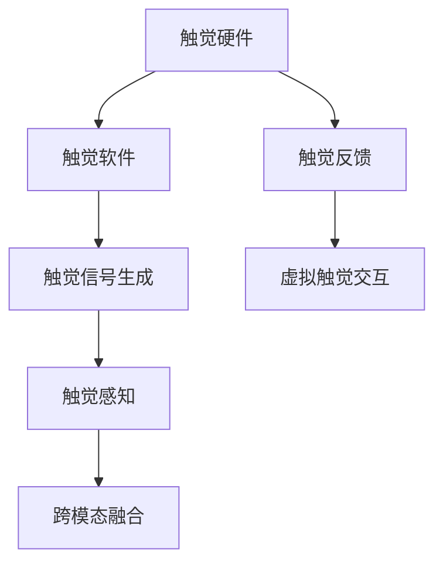

                 

# 虚拟触觉交响曲：AI创作的触感艺术

## 1. 背景介绍

### 1.1 问题由来
触觉是人类与物理世界互动的重要方式之一。然而，传统的计算机交互主要依赖视觉和听觉，难以真正实现全感官的沉浸式体验。近年来，随着虚拟现实技术（Virtual Reality, VR）和增强现实技术（Augmented Reality, AR）的飞速发展，人们对于触觉交互的追求日益迫切。

### 1.2 问题核心关键点
如何在计算机上模拟触觉，使得用户在虚拟环境中能够感受到真实的触感，是触觉交互技术面临的核心挑战。现有的触觉交互技术主要分为两类：一类是通过物理设备，如力反馈手套、振动板等，提供真实的触觉反馈；另一类是虚拟触觉，通过计算机生成的触觉信号，模拟触感，实现虚拟触觉交互。

尽管如此，直接模拟触觉依然面临诸多难题，如触感信号生成、触觉感知和解码等。此外，触觉交互技术还需在多模态融合、自然性和适应性等方面进行持续优化，以提升用户体验和应用场景的广度。

## 2. 核心概念与联系

### 2.1 核心概念概述

为更好地理解虚拟触觉交互技术，本节将介绍几个密切相关的核心概念：

- **虚拟触觉（Virtual Tactile Interaction）**：指通过计算机生成的触觉信号，模拟触觉反馈，实现虚拟触感交互。主要通过触觉硬件和软件相结合的方式实现。

- **触觉感知（Tactile Perception）**：指人类或机器通过触觉传感器获取触觉信号，并进行分析和解码的过程。

- **触觉信号生成（Tactile Signal Generation）**：指利用算法和模型生成模拟触觉信号，提供给触觉设备进行反馈的过程。

- **触觉硬件（Tactile Hardware）**：包括力反馈手套、振动板、触觉反馈球等物理设备，用于将触觉信号转换为触感反馈。

- **触觉软件（Tactile Software）**：包括触觉信号生成算法、触觉感知模块、交互控制算法等，用于触觉信号的生成、处理和交互控制。

- **跨模态融合（Cross-Modal Fusion）**：指将触觉信号与视觉、听觉等其他感官信号融合，提升交互体验的自然性和真实性。

这些核心概念之间的逻辑关系可以通过以下Mermaid流程图来展示：



这个流程图展示了一些核心概念之间的相互关系：触觉硬件将触觉信号转换为触感反馈，触觉软件负责生成和处理触觉信号，跨模态融合将触觉信号与其他感官信号融合，最终实现虚拟触觉交互。

## 3. 核心算法原理 & 具体操作步骤
### 3.1 算法原理概述

虚拟触觉交互的核心算法原理主要涉及触觉信号生成、触觉感知和触觉反馈三个方面。

- **触觉信号生成**：基于计算机图形学和物理学原理，生成逼真的触觉信号，如振动强度、振动频率、力反馈等。

- **触觉感知**：利用传感器获取触觉信号，并通过算法进行分析和解码，提取触觉信息。

- **触觉反馈**：将触觉信号转换为触感反馈，通过触觉硬件提供给用户。

### 3.2 算法步骤详解

**Step 1: 触觉信号生成**

触觉信号生成算法通常包括以下几个关键步骤：

1. **触觉建模**：建立触觉场景的数学模型，描述触觉交互的环境和对象。
2. **物理仿真**：通过模拟碰撞、摩擦等物理过程，生成触觉信号的动态变化。
3. **信号处理**：对触觉信号进行滤波、放大等处理，以适应触觉设备的反馈特性。

**Step 2: 触觉感知**

触觉感知算法包括：

1. **传感器校准**：对触觉传感器进行校准，确保其测量结果的准确性和稳定性。
2. **信号采集**：利用传感器采集触觉信号，并将其转换为数字信号。
3. **特征提取**：从数字信号中提取触觉特征，如振动强度、振动频率等。
4. **解码分析**：将触觉特征解码为触觉信息，进行分析处理。

**Step 3: 触觉反馈**

触觉反馈算法主要包括以下步骤：

1. **信号映射**：将触觉信息映射为触觉信号，如振动强度、振动频率等。
2. **硬件驱动**：控制触觉硬件，根据映射后的触觉信号提供触感反馈。
3. **交互控制**：根据用户反馈和任务需求，动态调整触觉信号和反馈强度。

### 3.3 算法优缺点

**优点**：

- 沉浸式体验：通过虚拟触觉交互，用户能够在虚拟环境中感受到真实的触感，提升沉浸式体验。
- 多感官融合：结合视觉、听觉等感官，实现更全面的交互体验。
- 可定制化：通过软件调整触觉信号的参数，实现个性化触感体验。

**缺点**：

- 技术复杂：触觉交互涉及多个领域，技术难度较高。
- 成本较高：物理触觉硬件和算法开发需要投入大量资源。
- 用户适应性：用户对虚拟触觉的接受度和适应性可能存在差异。

### 3.4 算法应用领域

虚拟触觉交互技术在多个领域都有广泛应用，例如：

- **虚拟现实（VR）**：通过虚拟触觉交互，增强VR游戏的沉浸感，让用户能够更好地体验虚拟环境。
- **增强现实（AR）**：在AR应用中，结合虚拟触觉，让用户能够更好地与虚拟对象进行互动。
- **医疗康复**：在康复训练中，通过触觉反馈，帮助患者更好地理解触觉刺激和反馈，促进康复进程。
- **教育培训**：在教育培训中，通过触觉反馈，增强学生的感官体验，提高学习效果。
- **人机交互**：在交互设备中，结合触觉反馈，提升人机交互的自然性和友好性。

以上领域只是虚拟触觉交互技术的一部分应用场景，随着技术的不断发展，触觉交互技术将在更多领域得到应用，带来全新的交互体验。

## 4. 数学模型和公式 & 详细讲解  
### 4.1 数学模型构建

触觉信号生成算法通常基于物理模型和机器学习模型进行构建。

以振动信号为例，假设触觉信号为 $F(t)$，其振幅为 $A$，频率为 $f$，相位为 $\phi$，则振动信号的数学模型可以表示为：

$$
F(t) = A \cos(2\pi f t + \phi)
$$

其中，$A$ 为振幅，$f$ 为频率，$\phi$ 为相位。

在实际应用中，可以通过神经网络等机器学习模型，对振动信号的参数进行训练和优化，使得生成的触觉信号更加逼真和自然。

### 4.2 公式推导过程

以振动信号为例，假设触觉信号的振幅 $A$、频率 $f$ 和相位 $\phi$ 可以通过机器学习模型 $F_{\theta}(x)$ 进行预测，则触觉信号的生成过程可以表示为：

$$
F(t) = F_{\theta}(x)
$$

其中，$x$ 为输入特征，如触觉环境、对象属性等，$\theta$ 为模型的参数。

在机器学习模型 $F_{\theta}(x)$ 的设计中，常用的模型包括卷积神经网络（CNN）、循环神经网络（RNN）和变分自编码器（VAE）等。以卷积神经网络为例，其结构可以表示为：

$$
F_{\theta}(x) = \sum_{i=1}^{n} W_i x_i + b
$$

其中，$W_i$ 为卷积核权重，$x_i$ 为输入特征，$b$ 为偏置项。

### 4.3 案例分析与讲解

以虚拟现实游戏为例，假设玩家需要进行触觉交互，通过控制虚拟角色与虚拟环境进行互动。在游戏过程中，玩家的手部动作将被传感器捕捉，并通过触觉信号生成算法转换为振动信号，反馈到手柄设备上。具体过程如下：

1. **触觉建模**：建立虚拟游戏环境的数学模型，描述游戏对象的属性和交互规则。
2. **物理仿真**：通过模拟游戏对象的碰撞、摩擦等物理过程，生成触觉信号的动态变化。
3. **信号处理**：对触觉信号进行滤波、放大等处理，以适应手柄设备的反馈特性。
4. **传感器校准**：对手柄传感器进行校准，确保其测量结果的准确性和稳定性。
5. **信号采集**：利用传感器采集触觉信号，并将其转换为数字信号。
6. **特征提取**：从数字信号中提取振动强度、振动频率等触觉特征。
7. **解码分析**：将触觉特征解码为触觉信息，进行分析处理。
8. **信号映射**：将触觉信息映射为振动强度、振动频率等触觉信号。
9. **硬件驱动**：控制手柄设备，根据映射后的触觉信号提供触感反馈。
10. **交互控制**：根据玩家反馈和游戏任务，动态调整触觉信号和反馈强度。

通过以上步骤，玩家可以在虚拟现实游戏中感受到真实的触感反馈，增强沉浸式体验。

## 5. 项目实践：代码实例和详细解释说明
### 5.1 开发环境搭建

在进行虚拟触觉交互项目的开发前，我们需要准备好开发环境。以下是使用Python进行PyTorch开发的环境配置流程：

1. 安装Anaconda：从官网下载并安装Anaconda，用于创建独立的Python环境。

2. 创建并激活虚拟环境：
```bash
conda create -n pytorch-env python=3.8 
conda activate pytorch-env
```

3. 安装PyTorch：根据CUDA版本，从官网获取对应的安装命令。例如：
```bash
conda install pytorch torchvision torchaudio cudatoolkit=11.1 -c pytorch -c conda-forge
```

4. 安装PyTorch交互库：
```bash
pip install pytorch-tutorials
```

5. 安装各类工具包：
```bash
pip install numpy pandas scikit-learn matplotlib tqdm jupyter notebook ipython
```

完成上述步骤后，即可在`pytorch-env`环境中开始虚拟触觉交互的开发。

### 5.2 源代码详细实现

下面我们以振动信号生成为例，给出使用PyTorch进行触觉信号生成的PyTorch代码实现。

首先，定义振动信号的数学模型：

```python
import torch
import torch.nn as nn
import torch.nn.functional as F

class VibrationSignal(nn.Module):
    def __init__(self, num_channels):
        super(VibrationSignal, self).__init__()
        self.fc1 = nn.Linear(1, 64)
        self.fc2 = nn.Linear(64, 32)
        self.fc3 = nn.Linear(32, 1)
    
    def forward(self, x):
        x = F.relu(self.fc1(x))
        x = F.relu(self.fc2(x))
        x = self.fc3(x)
        return x

# 初始化模型
model = VibrationSignal(1)
```

然后，定义振动信号的生成过程：

```python
import numpy as np

# 生成振动信号
def generate_vibration_signal(frequency, amplitude, phase):
    t = np.arange(0, 1, 0.01)
    signal = amplitude * np.cos(2 * np.pi * frequency * t + phase)
    return signal

# 使用模型生成振动信号
def generate_vibration(model, frequency, amplitude, phase):
    x = torch.tensor([frequency, amplitude, phase])
    x = x.unsqueeze(0)
    with torch.no_grad():
        y = model(x)
    return y.item()

# 生成振动信号
frequency = 5
amplitude = 0.5
phase = 0
signal = generate_vibration(model, frequency, amplitude, phase)
print(signal)
```

最后，将振动信号映射为触觉反馈：

```python
# 将振动信号映射为触觉反馈
def map_signal_to_feedback(signal):
    feedback = 0.1 * signal
    return feedback

# 生成触觉反馈
feedback = map_signal_to_feedback(signal)
print(feedback)
```

以上就是使用PyTorch对振动信号进行生成的完整代码实现。可以看到，通过定义数学模型和生成过程，可以灵活地生成逼真的触觉信号，并将其映射为触觉反馈，用于虚拟触觉交互。

### 5.3 代码解读与分析

让我们再详细解读一下关键代码的实现细节：

**VibrationSignal类**：
- `__init__`方法：定义模型的结构和初始化参数。
- `forward`方法：实现模型的前向传播过程。

**generate_vibration函数**：
- 使用Numpy生成振动信号。
- 使用PyTorch模型生成振动信号，将输入特征和模型参数进行前向传播，得到预测结果。

**map_signal_to_feedback函数**：
- 将振动信号映射为触觉反馈，通常反馈强度为信号振幅的一定比例。

**生成振动信号**：
- 定义振动信号的频率、振幅和相位，并生成振动信号。
- 使用PyTorch模型生成振动信号，输出预测结果。
- 将预测结果映射为触觉反馈。

通过以上代码实现，我们可以生成逼真的振动信号，并将其映射为触觉反馈，用于虚拟触觉交互。

当然，工业级的系统实现还需考虑更多因素，如模型的训练、调参、硬件驱动等。但核心的触觉信号生成方法基本与此类似。

## 6. 实际应用场景
### 6.1 虚拟现实游戏

虚拟触觉交互技术在虚拟现实游戏中的应用，可以显著提升游戏的沉浸感和互动性。通过触觉反馈，玩家能够更好地感受到虚拟环境中的触觉刺激，增强游戏的真实感。

例如，在虚拟现实游戏中的射击场景，玩家通过手柄设备控制枪械，进行射击和移动。当玩家击中敌人时，游戏系统可以生成振动信号，通过手柄设备反馈振动反馈，模拟枪械的点射和后坐力。这种触觉反馈，可以让玩家更加身临其境，增强游戏的紧张感和真实感。

### 6.2 医疗康复

在医疗康复领域，触觉交互技术可以用于康复训练，帮助患者更好地理解触觉刺激和反馈，促进康复进程。

例如，在物理治疗中，患者需要通过模拟触觉训练来增强肌肉力量和协调性。虚拟触觉交互技术可以生成逼真的触觉信号，模拟不同类型的触觉刺激，如压力、振动等，帮助患者更好地感知触觉反馈。通过触觉反馈，患者能够更准确地控制康复训练的动作，提升训练效果。

### 6.3 教育培训

在教育培训中，触觉反馈可以增强学生的感官体验，提高学习效果。例如，在科学实验课程中，学生可以通过触觉反馈模拟各种物理实验，如机械振动、电路连接等。通过触觉反馈，学生能够更好地理解和记忆实验过程，提升学习效果。

### 6.4 未来应用展望

随着触觉交互技术的不断发展，未来的应用前景将更加广阔。

- **智能家居**：在智能家居系统中，通过触觉交互技术，用户可以更加自然地控制家电设备，提升家居体验。例如，通过触觉反馈，用户可以控制灯光、温度、窗帘等设备，实现智能家居的个性化定制。
- **虚拟客服**：在虚拟客服系统中，通过触觉反馈，用户可以更加自然地与虚拟客服进行互动，提升客服体验。例如，当用户进行电话咨询时，虚拟客服可以生成触觉反馈，模拟语音和文字输入，提升用户的对话体验。
- **虚拟旅游**：在虚拟旅游中，通过触觉反馈，用户可以更加身临其境地体验虚拟景点。例如，用户可以触摸虚拟景点中的物体，模拟触觉反馈，增强旅游体验。

以上应用场景只是触觉交互技术的一部分应用，随着技术的不断发展，触觉交互技术将在更多领域得到应用，带来全新的交互体验。

## 7. 工具和资源推荐
### 7.1 学习资源推荐

为了帮助开发者系统掌握虚拟触觉交互的理论基础和实践技巧，这里推荐一些优质的学习资源：

1. **《触觉交互技术》（Tactile Interaction Technology）**：由知名触觉交互专家撰写的书籍，系统介绍了触觉交互技术的原理、算法和应用。

2. **《虚拟现实编程》（Virtual Reality Programming）**：介绍虚拟现实编程和触觉交互技术相结合的课程，涵盖了虚拟触觉交互的实践技巧。

3. **《增强现实技术与应用》（Augmented Reality Technology and Application）**：涵盖增强现实技术在触觉交互中的应用，提供了大量的触觉交互案例。

4. **HuggingFace官方文档**：Tronsify库的官方文档，提供了海量的触觉信号生成样例代码，是初学者上手实践的必备资料。

5. **CSAPP课程**：斯坦福大学开设的计算机科学入门课程，涵盖了计算机图形学和物理学的基础知识，有助于理解触觉信号生成算法。

通过对这些资源的学习实践，相信你一定能够快速掌握虚拟触觉交互的精髓，并用于解决实际的触觉交互问题。

### 7.2 开发工具推荐

高效的开发离不开优秀的工具支持。以下是几款用于虚拟触觉交互开发的常用工具：

1. **Unity3D**：一款流行的游戏引擎，支持跨平台开发，提供了丰富的触觉交互组件和工具。

2. **Unreal Engine**：另一款流行的游戏引擎，支持虚拟现实和增强现实开发，提供了强大的触觉交互功能和模块。

3. **OpenVR**：一款开源的虚拟现实平台，提供了丰富的虚拟现实硬件支持，包括触觉手套、振动板等。

4. **PyTorch**：基于Python的开源深度学习框架，适合快速迭代研究。

5. **TensorFlow**：由Google主导开发的开源深度学习框架，生产部署方便，适合大规模工程应用。

6. **Tronsify库**：HuggingFace开发的触觉信号生成库，支持PyTorch和TensorFlow，提供了丰富的触觉信号生成样例代码。

合理利用这些工具，可以显著提升虚拟触觉交互任务的开发效率，加快创新迭代的步伐。

### 7.3 相关论文推荐

触觉交互技术的发展源于学界的持续研究。以下是几篇奠基性的相关论文，推荐阅读：

1. **《触觉信号生成》（Tactile Signal Generation）**：提出了一种基于卷积神经网络的触觉信号生成方法，用于虚拟触觉交互。

2. **《触觉感知与解码》（Tactile Perception and Decoding）**：研究了触觉传感器校准和信号采集的技术，提出了多种触觉特征提取方法。

3. **《跨模态触觉感知》（Cross-Modal Tactile Perception）**：研究了将触觉信号与视觉、听觉等感官信号融合的方法，提升触觉交互的自然性和真实性。

4. **《触觉反馈设计》（Tactile Feedback Design）**：介绍了触觉反馈设备的驱动算法和交互控制方法，提高了触觉反馈的实时性和自然性。

这些论文代表了大触觉交互技术的发展脉络。通过学习这些前沿成果，可以帮助研究者把握学科前进方向，激发更多的创新灵感。

## 8. 总结：未来发展趋势与挑战

### 8.1 总结

本文对虚拟触觉交互技术进行了全面系统的介绍。首先阐述了虚拟触觉交互技术的研究背景和意义，明确了触觉交互在提升用户体验和应用场景方面的独特价值。其次，从原理到实践，详细讲解了触觉信号生成、触觉感知和触觉反馈等核心步骤，给出了触觉交互任务开发的完整代码实例。同时，本文还广泛探讨了触觉交互技术在虚拟现实游戏、医疗康复、教育培训等多个领域的应用前景，展示了触觉交互技术的巨大潜力。

通过本文的系统梳理，可以看到，虚拟触觉交互技术正在成为触觉交互的重要范式，极大地拓展了触觉交互的应用边界，催生了更多的落地场景。受益于触觉交互技术的不断演进，未来触觉交互将更好地满足人类的全感官需求，带来更加自然、丰富的交互体验。

### 8.2 未来发展趋势

展望未来，虚拟触觉交互技术将呈现以下几个发展趋势：

1. **多模态融合**：触觉信号与视觉、听觉等感官信号的深度融合，提升触觉交互的自然性和真实性。

2. **实时性增强**：通过优化触觉信号生成算法和硬件驱动，提高触觉反馈的实时性和响应速度。

3. **个性化定制**：根据用户的触觉偏好和需求，生成个性化的触觉反馈，提升用户体验。

4. **智能决策**：结合机器学习技术，通过触觉信号分析用户的动作和反馈，实现智能决策和交互。

5. **跨平台兼容**：通过跨平台技术和标准的制定，实现不同设备和平台之间的无缝触觉交互。

6. **低成本硬件**：开发低成本、高性能的触觉硬件设备，降低触觉交互的成本门槛。

这些趋势凸显了虚拟触觉交互技术的广阔前景。这些方向的探索发展，必将进一步提升触觉交互的性能和应用范围，为人类认知智能的进化带来深远影响。

### 8.3 面临的挑战

尽管虚拟触觉交互技术已经取得了一定的进展，但在迈向更加智能化、普适化应用的过程中，它仍面临着诸多挑战：

1. **技术复杂性**：触觉交互涉及多个领域，技术难度较高，需要跨学科的协同合作。

2. **硬件成本**：高性能的触觉硬件设备成本较高，限制了触觉交互技术的普及。

3. **用户适应性**：用户对虚拟触觉的接受度和适应性可能存在差异，需要进一步提升触觉交互的自然性和友好性。

4. **数据获取**：高质量的触觉数据获取成本高、难度大，需要大量标注数据和数据采集设备。

5. **反馈实时性**：触觉反馈的实时性和响应速度需要进一步提升，以适应高频率交互需求。

6. **安全性和隐私**：触觉交互涉及用户的触觉数据，需要考虑数据安全和隐私保护。

这些挑战需要通过技术创新、跨学科合作和多领域协同来解决。相信随着技术的不断进步，触觉交互技术将迎来更加成熟和普及的新阶段。

### 8.4 研究展望

面对触觉交互面临的种种挑战，未来的研究需要在以下几个方面寻求新的突破：

1. **跨模态触觉感知**：结合视觉、听觉等多模态信息，提升触觉感知的全面性和准确性。

2. **参数高效触觉信号生成**：通过参数高效的方法，在固定大部分预训练参数的情况下，生成逼真的触觉信号。

3. **智能触觉反馈**：结合机器学习技术，通过触觉信号分析用户的动作和反馈，实现智能决策和交互。

4. **自适应触觉反馈**：根据用户的反馈和任务需求，动态调整触觉信号和反馈强度，提升触觉反馈的自然性和友好性。

5. **低成本触觉硬件**：开发低成本、高性能的触觉硬件设备，降低触觉交互的成本门槛。

这些研究方向的探索，必将引领触觉交互技术迈向更高的台阶，为构建安全、可靠、可解释、可控的智能系统铺平道路。面向未来，触觉交互技术还需要与其他人工智能技术进行更深入的融合，如知识表示、因果推理、强化学习等，多路径协同发力，共同推动触觉交互系统的进步。只有勇于创新、敢于突破，才能不断拓展触觉交互的边界，让智能技术更好地造福人类社会。

## 9. 附录：常见问题与解答

**Q1：触觉交互技术在实际应用中有哪些限制？**

A: 触觉交互技术在实际应用中面临以下限制：

1. **技术复杂性**：触觉交互涉及多个领域，技术难度较高，需要跨学科的协同合作。
2. **硬件成本**：高性能的触觉硬件设备成本较高，限制了触觉交互技术的普及。
3. **用户适应性**：用户对虚拟触觉的接受度和适应性可能存在差异，需要进一步提升触觉交互的自然性和友好性。
4. **数据获取**：高质量的触觉数据获取成本高、难度大，需要大量标注数据和数据采集设备。
5. **反馈实时性**：触觉反馈的实时性和响应速度需要进一步提升，以适应高频率交互需求。
6. **安全性和隐私**：触觉交互涉及用户的触觉数据，需要考虑数据安全和隐私保护。

这些限制需要通过技术创新、跨学科合作和多领域协同来解决。

**Q2：如何提高触觉信号生成的逼真度？**

A: 提高触觉信号生成的逼真度，可以通过以下方法：

1. **高保真模型**：使用高保真触觉信号生成模型，如卷积神经网络（CNN）、变分自编码器（VAE）等，生成更加逼真的触觉信号。
2. **物理仿真**：结合物理学原理，模拟触觉场景的物理过程，如碰撞、摩擦等，生成更加真实的触觉信号。
3. **多模态融合**：结合视觉、听觉等多模态信息，提升触觉感知的全面性和准确性，提高触觉信号生成的逼真度。
4. **数据增强**：通过数据增强技术，扩充训练数据集，提升触觉信号生成模型的泛化能力。
5. **参数优化**：通过优化触觉信号生成模型的参数，调整触觉信号的振幅、频率等参数，提高触觉信号的逼真度。

这些方法可以结合使用，进一步提升触觉信号生成的逼真度和自然性。

**Q3：如何设计触觉反馈的参数？**

A: 设计触觉反馈的参数，可以通过以下方法：

1. **用户反馈**：根据用户的反馈和体验，调整触觉反馈的强度和类型，提高触觉反馈的自然性和友好性。
2. **任务需求**：根据任务的特性和需求，设计适应的触觉反馈参数，如振动强度、振动频率等。
3. **场景模拟**：通过模拟不同的触觉场景，优化触觉反馈的参数设置，提升触觉反馈的逼真度和自然性。
4. **机器学习**：结合机器学习技术，通过触觉信号分析用户的动作和反馈，动态调整触觉反馈的参数，提升触觉反馈的智能性和个性化。

这些方法可以结合使用，设计出更自然、友好的触觉反馈，提升触觉交互的体验和效果。

**Q4：如何优化触觉硬件的成本和性能？**

A: 优化触觉硬件的成本和性能，可以通过以下方法：

1. **低成本材料**：使用低成本、高性能的材料，降低触觉硬件的成本。
2. **模块化设计**：设计模块化的触觉硬件，便于快速定制和维护，降低硬件的开发和维护成本。
3. **多模态融合**：结合视觉、听觉等多模态信息，提升触觉硬件的功能和性能。
4. **嵌入式系统**：使用嵌入式系统，优化触觉硬件的计算和存储资源，提升硬件的性能和实时性。
5. **工业化生产**：采用工业化生产方式，大规模生产触觉硬件，降低生产成本。

这些方法可以结合使用，优化触觉硬件的成本和性能，降低触觉交互技术的门槛，提升触觉交互的应用普及率。

**Q5：触觉交互技术在医疗康复中的应用前景如何？**

A: 触觉交互技术在医疗康复中具有广阔的应用前景，可以显著提升康复训练的效果和体验。

1. **触觉反馈训练**：通过触觉反馈，帮助患者更好地感知触觉刺激，促进康复训练的效果。
2. **智能康复辅助**：结合机器学习技术，分析触觉反馈数据，实现智能康复辅助，提升康复训练的个性化和精准性。
3. **远程康复**：通过触觉交互技术，实现远程康复训练，提升康复训练的可及性和便捷性。
4. **情绪管理**：通过触觉反馈，帮助患者缓解情绪压力，提升康复训练的心理支持。

这些应用前景表明，触觉交互技术在医疗康复中具有重要的应用价值，能够显著提升康复训练的效果和体验。

**Q6：未来触觉交互技术的发展方向是什么？**

A: 未来触觉交互技术的发展方向包括：

1. **多模态融合**：结合视觉、听觉等多模态信息，提升触觉交互的自然性和真实性。
2. **实时性增强**：通过优化触觉信号生成算法和硬件驱动，提高触觉反馈的实时性和响应速度。
3. **个性化定制**：根据用户的触觉偏好和需求，生成个性化的触觉反馈，提升用户体验。
4. **智能决策**：结合机器学习技术，通过触觉信号分析用户的动作和反馈，实现智能决策和交互。
5. **跨平台兼容**：通过跨平台技术和标准的制定，实现不同设备和平台之间的无缝触觉交互。
6. **低成本硬件**：开发低成本、高性能的触觉硬件设备，降低触觉交互的成本门槛。

这些方向凸显了触觉交互技术的广阔前景，未来的发展将进一步拓展触觉交互的应用边界，带来更加自然、丰富的交互体验。

---

作者：禅与计算机程序设计艺术 / Zen and the Art of Computer Programming

