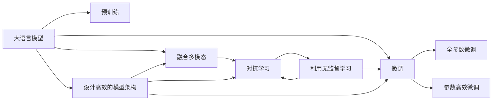

                 

# 融合AI大模型的用户意图识别技术

> 关键词：人工智能,大模型,用户意图识别,深度学习,自然语言处理,意图分类,微调

## 1. 背景介绍

### 1.1 问题由来

随着互联网和移动互联网的普及，人们的交互方式从传统的文本转变为更加多样化的语音、图像、视频等形式。与此同时，用户对智能客服、智能助手等应用的需求也日益增长。在这样的背景下，理解用户意图、提供个性化服务成为了自然语言处理(Natural Language Processing, NLP)领域的一个重要研究方向。

用户意图识别（User Intent Recognition, UIR）是智能交互系统中的一个核心子任务，它旨在通过分析用户输入的自然语言文本，准确判断用户的意图和需求。这一过程不仅关系到系统的响应速度和用户体验，更是智能客服系统能否真正提供个性化服务的关键。然而，传统的意图识别方法往往依赖于手动标注的语料库，不仅成本高昂，且难以覆盖海量用户的多样化需求。

近年来，随着大语言模型（Large Language Models, LLMs）如BERT、GPT等在预训练自然语言理解领域的突破性进展，基于预训练语言模型的用户意图识别方法逐渐受到重视。利用大模型进行预训练，能够在大量的无标签文本数据上学习丰富的语言知识，并在少量有标签数据上进行微调，从而获得较好的泛化能力。本文将深入探讨基于大模型进行用户意图识别的方法，从原理到实践，逐步展开。

### 1.2 问题核心关键点

用户意图识别的核心在于将用户的自然语言输入映射到意图类别上，其任务本质是序列标注问题。具体而言，可以将其看作从输入序列（如文本句子）到意图标签序列（如意图分类标签）的映射问题。为了应对这一挑战，当前主流的解决方案包括：

1. **基于预训练语言模型（Pre-trained Language Models, PLMs）的微调**：利用大模型在大量无标签数据上进行预训练，然后在特定任务上进行微调，提取语言特征和任务信息。
2. **融合多模态信息**：结合语音、图像、视频等多种模态的信息，提升用户意图识别的准确性和鲁棒性。
3. **引入对抗学习（Adversarial Learning）**：通过对抗训练等技术，提高模型对未知语境的适应能力。
4. **利用无监督学习方法（Unsupervised Learning）**：在无需标注数据的情况下，通过自监督学习等方法获取语言知识的表示。
5. **设计高效的模型架构（Efficient Model Architecture）**：通过模型裁剪、知识蒸馏等技术，提高模型的推理速度和空间效率。

本文将重点介绍基于预训练语言模型的微调方法，探讨如何利用大模型的先验知识，在少量标注数据上实现高效的用户意图识别。

## 2. 核心概念与联系

### 2.1 核心概念概述

用户意图识别的大模型微调方法，本质上是一种基于深度学习的序列标注技术。其核心思想是：利用大模型的预训练知识，通过微调学习特定的意图分类任务，将用户的自然语言输入映射到意图标签序列上。这一过程可以分为两个主要步骤：

1. **预训练步骤**：在无标签的语料库上，通过自监督学习任务训练大语言模型，学习语言知识的表示。
2. **微调步骤**：在特定任务的数据集上，利用有标签的样本进行微调，学习任务特定的意图分类能力。

核心概念包括：

- **大语言模型（Large Language Models, LLMs）**：如BERT、GPT等，通过在无标签数据上进行自监督学习，获得通用语言知识的表示。
- **序列标注（Sequence Labeling）**：将输入序列（如文本句子）映射到意图标签序列（如意图分类标签）的过程，属于NLP领域的核心任务之一。
- **微调（Fine-Tuning）**：在大模型的基础上，通过有标签的样本进行微调，学习特定任务的知识。
- **对抗学习（Adversarial Learning）**：通过引入对抗样本，提高模型在未知语境下的鲁棒性和泛化能力。
- **多模态融合（Multi-modal Fusion）**：结合语音、图像、视频等多种模态的信息，提升用户意图识别的准确性和鲁棒性。

这些核心概念之间的逻辑关系可以通过以下Mermaid流程图来展示：



这个流程图展示了用户意图识别过程中涉及的关键概念及其之间的关系：

1. 大语言模型通过预训练获得语言知识的表示。
2. 微调利用大模型的预训练知识，学习特定任务的意图分类能力。
3. 融合多模态和对抗学习进一步提升模型的性能和鲁棒性。
4. 利用无监督学习方法获取更多的语言知识。
5. 设计高效的模型架构，提高模型的推理速度和空间效率。

这些概念共同构成了用户意图识别的大模型微调方法，使其能够在各种场景下发挥强大的语言理解和生成能力。通过理解这些核心概念，我们可以更好地把握用户意图识别的工作原理和优化方向。

## 3. 核心算法原理 & 具体操作步骤
### 3.1 算法原理概述

基于大模型的用户意图识别方法，其核心在于将大模型的预训练知识和特定任务的意图分类目标相结合。具体而言，可以分为以下几个步骤：

1. **预训练步骤**：在无标签的语料库上，通过自监督学习任务训练大语言模型，学习语言知识的表示。
2. **微调步骤**：在特定任务的数据集上，利用有标签的样本进行微调，学习任务特定的意图分类能力。
3. **模型评估与部署**：评估微调后模型的性能，并在实际应用系统中进行部署和优化。

### 3.2 算法步骤详解

#### 3.2.1 预训练步骤

预训练步骤主要包括以下几个关键步骤：

1. **选择预训练语言模型**：选择合适的预训练语言模型，如BERT、GPT等。
2. **准备训练数据**：收集大量的无标签文本数据，作为预训练的语料库。
3. **训练模型**：在大规模语料库上，使用自监督学习任务（如掩码语言模型、句子重排、下一句预测等）训练语言模型。
4. **保存预训练模型**：将训练好的预训练模型保存下来，以备后续微调使用。

#### 3.2.2 微调步骤

微调步骤主要包括以下几个关键步骤：

1. **选择微调数据集**：选择适合特定意图识别任务的数据集，如对话数据、产品评论数据等。
2. **准备数据集**：将数据集划分为训练集、验证集和测试集，并进行数据预处理。
3. **设置微调超参数**：选择合适的优化算法（如AdamW、SGD等）及其参数，设置学习率、批大小、迭代轮数等。
4. **执行梯度训练**：在微调数据集上，利用有标签样本进行微调训练，更新模型参数。
5. **评估模型性能**：在验证集上评估模型性能，根据性能指标决定是否继续微调。
6. **测试与部署**：在测试集上评估模型性能，并将模型集成到实际应用系统中。

### 3.3 算法优缺点

基于大模型的用户意图识别方法具有以下优点：

1. **高效**：利用大模型的预训练知识，可以在少量标注数据上实现高效的意图识别。
2. **泛化能力强**：大模型在大量无标签数据上进行预训练，学习到广泛的通用知识，适用于各种NLP任务。
3. **灵活性高**：微调方法能够根据具体任务需求灵活调整模型结构，提升模型性能。

同时，该方法也存在一些局限性：

1. **依赖标注数据**：微调需要标注数据，获取高质量标注数据的成本较高。
2. **模型复杂度**：大模型的参数量较大，在计算和存储空间上存在一定负担。
3. **过拟合风险**：在微调过程中容易发生过拟合，尤其是在标注数据量不足的情况下。
4. **模型可解释性差**：大模型的决策过程缺乏可解释性，难以对其推理逻辑进行分析和调试。

尽管存在这些局限性，基于大模型的微调方法仍然是目前用户意图识别的主流技术范式，广泛应用于智能客服、智能助手等应用场景。

### 3.4 算法应用领域

基于大模型的用户意图识别方法，已经在智能客服、智能助手、对话系统等多个领域得到了广泛应用。具体而言：

1. **智能客服系统**：通过微调预训练模型，智能客服系统能够自动理解用户输入的意图，并提供相应的服务。
2. **智能助手**：在智能助手应用中，微调模型能够根据用户输入的命令和上下文信息，执行各类操作，如日程安排、邮件管理等。
3. **对话系统**：对话系统中，微调模型能够生成自然流畅的回复，模拟人类的对话方式，提升用户体验。
4. **产品评论分析**：在电商平台中，微调模型能够分析用户对产品的评论，识别用户情感倾向，帮助商家优化产品和服务。

这些应用场景展示了基于大模型用户意图识别方法的重要性和广泛应用前景。随着技术的不断发展，预训练语言模型和微调方法将继续在更广泛的领域中发挥作用。

## 4. 数学模型和公式 & 详细讲解 & 举例说明

### 4.1 数学模型构建

用户意图识别的大模型微调方法，本质上是一种序列标注问题。假设输入序列为 $x=(x_1, x_2, ..., x_n)$，意图标签序列为 $y=(y_1, y_2, ..., y_n)$，其中 $y_i$ 表示输入序列中第 $i$ 个位置的意图分类标签。

定义微调模型 $M_{\theta}$，其中 $\theta$ 为模型参数。在微调过程中，我们希望最大化模型的预测概率 $P(y|x)$，即：

$$
P(y|x) = \frac{e^{L(x, y; \theta)}}{Z(x; \theta)}
$$

其中 $L(x, y; \theta)$ 为损失函数，$Z(x; \theta)$ 为归一化因子。常用的损失函数包括交叉熵损失函数（Cross-Entropy Loss）和逻辑回归损失函数（Logistic Loss）。

在微调过程中，通过反向传播算法计算损失函数对模型参数 $\theta$ 的梯度，并使用优化算法更新模型参数，最小化损失函数。

### 4.2 公式推导过程

#### 4.2.1 交叉熵损失函数

交叉熵损失函数是序列标注问题中最常用的损失函数之一。假设输入序列 $x_i$ 对应的意图标签为 $y_i$，模型预测的意图标签为 $\hat{y}_i$，则交叉熵损失函数可以表示为：

$$
L(x_i, y_i; \theta) = -\sum_{k=1}^n (y_{ik} \log \hat{y}_{ik} + (1-y_{ik}) \log (1-\hat{y}_{ik}))
$$

其中 $n$ 为输入序列的长度。

在微调过程中，我们将每个输入序列 $x_i$ 的交叉熵损失求和，得到总的损失函数：

$$
\mathcal{L}(\theta) = \frac{1}{N} \sum_{i=1}^N L(x_i, y_i; \theta)
$$

其中 $N$ 为样本总数。

#### 4.2.2 优化算法

在微调过程中，我们通常使用梯度下降（Gradient Descent）等优化算法，通过迭代更新模型参数 $\theta$，最小化损失函数 $\mathcal{L}(\theta)$。

假设优化算法为梯度下降，则模型参数的更新公式为：

$$
\theta \leftarrow \theta - \eta \nabla_{\theta} \mathcal{L}(\theta)
$$

其中 $\eta$ 为学习率，$\nabla_{\theta} \mathcal{L}(\theta)$ 为损失函数对模型参数的梯度。

### 4.3 案例分析与讲解

#### 4.3.1 对话系统中的用户意图识别

在对话系统中，用户输入的自然语言需要被映射到意图标签序列上。例如，用户输入 "我想查询明天的天气"，意图标签可能为 "查询天气"。

首先，我们需要收集大量的对话数据，并对其进行标注。然后，利用这些标注数据对大模型进行微调。在微调过程中，可以使用交叉熵损失函数进行训练，并根据验证集上的性能指标决定是否继续微调。

在微调完成后，我们可以使用微调后的模型对用户输入的自然语言进行意图分类，并提供相应的服务。例如，对于用户输入 "我想买一部手机"，模型可以将其分类为 "购买商品"，然后执行相应的操作，如展示手机列表、提供购买链接等。

## 5. 项目实践：代码实例和详细解释说明

### 5.1 开发环境搭建

在进行用户意图识别的大模型微调实践前，我们需要准备好开发环境。以下是使用Python进行PyTorch开发的环境配置流程：

1. 安装Anaconda：从官网下载并安装Anaconda，用于创建独立的Python环境。

2. 创建并激活虚拟环境：
```bash
conda create -n pytorch-env python=3.8 
conda activate pytorch-env
```

3. 安装PyTorch：根据CUDA版本，从官网获取对应的安装命令。例如：
```bash
conda install pytorch torchvision torchaudio cudatoolkit=11.1 -c pytorch -c conda-forge
```

4. 安装Transformers库：
```bash
pip install transformers
```

5. 安装各类工具包：
```bash
pip install numpy pandas scikit-learn matplotlib tqdm jupyter notebook ipython
```

完成上述步骤后，即可在`pytorch-env`环境中开始微调实践。

### 5.2 源代码详细实现

下面我们以对话系统中的用户意图识别任务为例，给出使用Transformers库对BERT模型进行微调的PyTorch代码实现。

首先，定义对话数据集：

```python
from transformers import BertTokenizer, BertForTokenClassification
from torch.utils.data import Dataset, DataLoader

class DialogDataset(Dataset):
    def __init__(self, dialogs, intent_labels):
        self.dialogs = dialogs
        self.intent_labels = intent_labels
        self.tokenizer = BertTokenizer.from_pretrained('bert-base-cased')

    def __len__(self):
        return len(self.dialogs)

    def __getitem__(self, item):
        dialog = self.dialogs[item]
        intent_label = self.intent_labels[item]

        tokens = self.tokenizer(dialog, return_tensors='pt', padding='max_length', truncation=True)
        input_ids = tokens['input_ids']
        attention_mask = tokens['attention_mask']
        labels = torch.tensor([intent_label], dtype=torch.long)

        return {'input_ids': input_ids, 
                'attention_mask': attention_mask,
                'labels': labels}
```

然后，定义模型和优化器：

```python
from transformers import BertForTokenClassification, AdamW

model = BertForTokenClassification.from_pretrained('bert-base-cased', num_labels=4)  # 假设意图分类数为4

optimizer = AdamW(model.parameters(), lr=2e-5)
```

接着，定义训练和评估函数：

```python
from tqdm import tqdm

device = torch.device('cuda') if torch.cuda.is_available() else torch.device('cpu')
model.to(device)

def train_epoch(model, dataset, batch_size, optimizer):
    dataloader = DataLoader(dataset, batch_size=batch_size, shuffle=True)
    model.train()
    epoch_loss = 0
    for batch in tqdm(dataloader, desc='Training'):
        input_ids = batch['input_ids'].to(device)
        attention_mask = batch['attention_mask'].to(device)
        labels = batch['labels'].to(device)
        model.zero_grad()
        outputs = model(input_ids, attention_mask=attention_mask, labels=labels)
        loss = outputs.loss
        epoch_loss += loss.item()
        loss.backward()
        optimizer.step()
    return epoch_loss / len(dataloader)

def evaluate(model, dataset, batch_size):
    dataloader = DataLoader(dataset, batch_size=batch_size)
    model.eval()
    preds, labels = [], []
    with torch.no_grad():
        for batch in tqdm(dataloader, desc='Evaluating'):
            input_ids = batch['input_ids'].to(device)
            attention_mask = batch['attention_mask'].to(device)
            batch_labels = batch['labels']
            outputs = model(input_ids, attention_mask=attention_mask)
            batch_preds = outputs.logits.argmax(dim=2).to('cpu').tolist()
            batch_labels = batch_labels.to('cpu').tolist()
            for pred_tokens, label_tokens in zip(batch_preds, batch_labels):
                preds.append(pred_tokens[:len(label_tokens)])
                labels.append(label_tokens)
                
    return preds, labels

def classification_report(preds, labels):
    return classification_report(labels, preds)
```

最后，启动训练流程并在测试集上评估：

```python
epochs = 5
batch_size = 16

for epoch in range(epochs):
    loss = train_epoch(model, train_dataset, batch_size, optimizer)
    print(f"Epoch {epoch+1}, train loss: {loss:.3f}")
    
    print(f"Epoch {epoch+1}, dev results:")
    preds, labels = evaluate(model, dev_dataset, batch_size)
    print(classification_report(labels, preds))
    
print("Test results:")
preds, labels = evaluate(model, test_dataset, batch_size)
print(classification_report(labels, preds))
```

以上就是使用PyTorch对BERT进行对话系统用户意图识别的完整代码实现。可以看到，得益于Transformers库的强大封装，我们可以用相对简洁的代码完成BERT模型的加载和微调。

### 5.3 代码解读与分析

让我们再详细解读一下关键代码的实现细节：

**DialogDataset类**：
- `__init__`方法：初始化对话和意图标签，分词器等关键组件。
- `__len__`方法：返回数据集的样本数量。
- `__getitem__`方法：对单个样本进行处理，将对话输入编码为token ids，将意图标签编码为数字，并对其进行定长padding，最终返回模型所需的输入。

**训练和评估函数**：
- 使用PyTorch的DataLoader对数据集进行批次化加载，供模型训练和推理使用。
- 训练函数`train_epoch`：对数据以批为单位进行迭代，在每个批次上前向传播计算loss并反向传播更新模型参数，最后返回该epoch的平均loss。
- 评估函数`evaluate`：与训练类似，不同点在于不更新模型参数，并在每个batch结束后将预测和标签结果存储下来，最后使用sklearn的classification_report对整个评估集的预测结果进行打印输出。

**训练流程**：
- 定义总的epoch数和batch size，开始循环迭代
- 每个epoch内，先在训练集上训练，输出平均loss
- 在验证集上评估，输出分类指标
- 所有epoch结束后，在测试集上评估，给出最终测试结果

可以看到，PyTorch配合Transformers库使得BERT微调的代码实现变得简洁高效。开发者可以将更多精力放在数据处理、模型改进等高层逻辑上，而不必过多关注底层的实现细节。

当然，工业级的系统实现还需考虑更多因素，如模型的保存和部署、超参数的自动搜索、更灵活的任务适配层等。但核心的微调范式基本与此类似。

## 6. 实际应用场景

### 6.1 智能客服系统

基于大语言模型微调的对话技术，可以广泛应用于智能客服系统的构建。传统客服往往需要配备大量人力，高峰期响应缓慢，且一致性和专业性难以保证。而使用微调后的对话模型，可以7x24小时不间断服务，快速响应客户咨询，用自然流畅的语言解答各类常见问题。

在技术实现上，可以收集企业内部的历史客服对话记录，将问题和最佳答复构建成监督数据，在此基础上对预训练对话模型进行微调。微调后的对话模型能够自动理解用户意图，匹配最合适的答案模板进行回复。对于客户提出的新问题，还可以接入检索系统实时搜索相关内容，动态组织生成回答。如此构建的智能客服系统，能大幅提升客户咨询体验和问题解决效率。

### 6.2 金融舆情监测

金融机构需要实时监测市场舆论动向，以便及时应对负面信息传播，规避金融风险。传统的人工监测方式成本高、效率低，难以应对网络时代海量信息爆发的挑战。基于大语言模型微调的文本分类和情感分析技术，为金融舆情监测提供了新的解决方案。

具体而言，可以收集金融领域相关的新闻、报道、评论等文本数据，并对其进行主题标注和情感标注。在此基础上对预训练语言模型进行微调，使其能够自动判断文本属于何种主题，情感倾向是正面、中性还是负面。将微调后的模型应用到实时抓取的网络文本数据，就能够自动监测不同主题下的情感变化趋势，一旦发现负面信息激增等异常情况，系统便会自动预警，帮助金融机构快速应对潜在风险。

### 6.3 个性化推荐系统

当前的推荐系统往往只依赖用户的历史行为数据进行物品推荐，无法深入理解用户的真实兴趣偏好。基于大语言模型微调技术，个性化推荐系统可以更好地挖掘用户行为背后的语义信息，从而提供更精准、多样的推荐内容。

在实践中，可以收集用户浏览、点击、评论、分享等行为数据，提取和用户交互的物品标题、描述、标签等文本内容。将文本内容作为模型输入，用户的后续行为（如是否点击、购买等）作为监督信号，在此基础上微调预训练语言模型。微调后的模型能够从文本内容中准确把握用户的兴趣点。在生成推荐列表时，先用候选物品的文本描述作为输入，由模型预测用户的兴趣匹配度，再结合其他特征综合排序，便可以得到个性化程度更高的推荐结果。

### 6.4 未来应用展望

随着大语言模型微调技术的发展，其在更广泛的领域中将会得到应用，为传统行业带来变革性影响。

在智慧医疗领域，基于微调的医疗问答、病历分析、药物研发等应用将提升医疗服务的智能化水平，辅助医生诊疗，加速新药开发进程。

在智能教育领域，微调技术可应用于作业批改、学情分析、知识推荐等方面，因材施教，促进教育公平，提高教学质量。

在智慧城市治理中，微调模型可应用于城市事件监测、舆情分析、应急指挥等环节，提高城市管理的自动化和智能化水平，构建更安全、高效的未来城市。

此外，在企业生产、社会治理、文娱传媒等众多领域，基于大模型微调的人工智能应用也将不断涌现，为经济社会发展注入新的动力。相信随着技术的日益成熟，微调方法将成为人工智能落地应用的重要范式，推动人工智能技术在垂直行业的规模化落地。

## 7. 工具和资源推荐
### 7.1 学习资源推荐

为了帮助开发者系统掌握大语言模型微调的理论基础和实践技巧，这里推荐一些优质的学习资源：

1. 《Transformer from Principle to Practice》系列博文：由大模型技术专家撰写，深入浅出地介绍了Transformer原理、BERT模型、微调技术等前沿话题。

2. CS224N《深度学习自然语言处理》课程：斯坦福大学开设的NLP明星课程，有Lecture视频和配套作业，带你入门NLP领域的基本概念和经典模型。

3. 《Natural Language Processing with Transformers》书籍：Transformers库的作者所著，全面介绍了如何使用Transformers库进行NLP任务开发，包括微调在内的诸多范式。

4. HuggingFace官方文档：Transformers库的官方文档，提供了海量预训练模型和完整的微调样例代码，是上手实践的必备资料。

5. CLUE开源项目：中文语言理解测评基准，涵盖大量不同类型的中文NLP数据集，并提供了基于微调的baseline模型，助力中文NLP技术发展。

通过对这些资源的学习实践，相信你一定能够快速掌握大语言模型微调的精髓，并用于解决实际的NLP问题。
###  7.2 开发工具推荐

高效的开发离不开优秀的工具支持。以下是几款用于大语言模型微调开发的常用工具：

1. PyTorch：基于Python的开源深度学习框架，灵活动态的计算图，适合快速迭代研究。大部分预训练语言模型都有PyTorch版本的实现。

2. TensorFlow：由Google主导开发的开源深度学习框架，生产部署方便，适合大规模工程应用。同样有丰富的预训练语言模型资源。

3. Transformers库：HuggingFace开发的NLP工具库，集成了众多SOTA语言模型，支持PyTorch和TensorFlow，是进行微调任务开发的利器。

4. Weights & Biases：模型训练的实验跟踪工具，可以记录和可视化模型训练过程中的各项指标，方便对比和调优。与主流深度学习框架无缝集成。

5. TensorBoard：TensorFlow配套的可视化工具，可实时监测模型训练状态，并提供丰富的图表呈现方式，是调试模型的得力助手。

6. Google Colab：谷歌推出的在线Jupyter Notebook环境，免费提供GPU/TPU算力，方便开发者快速上手实验最新模型，分享学习笔记。

合理利用这些工具，可以显著提升大语言模型微调任务的开发效率，加快创新迭代的步伐。

### 7.3 相关论文推荐

大语言模型和微调技术的发展源于学界的持续研究。以下是几篇奠基性的相关论文，推荐阅读：

1. Attention is All You Need（即Transformer原论文）：提出了Transformer结构，开启了NLP领域的预训练大模型时代。

2. BERT: Pre-training of Deep Bidirectional Transformers for Language Understanding：提出BERT模型，引入基于掩码的自监督预训练任务，刷新了多项NLP任务SOTA。

3. Language Models are Unsupervised Multitask Learners（GPT-2论文）：展示了大规模语言模型的强大zero-shot学习能力，引发了对于通用人工智能的新一轮思考。

4. Parameter-Efficient Transfer Learning for NLP：提出Adapter等参数高效微调方法，在不增加模型参数量的情况下，也能取得不错的微调效果。

5. Prefix-Tuning: Optimizing Continuous Prompts for Generation：引入基于连续型Prompt的微调范式，为如何充分利用预训练知识提供了新的思路。

6. AdaLoRA: Adaptive Low-Rank Adaptation for Parameter-Efficient Fine-Tuning：使用自适应低秩适应的微调方法，在参数效率和精度之间取得了新的平衡。

这些论文代表了大语言模型微调技术的发展脉络。通过学习这些前沿成果，可以帮助研究者把握学科前进方向，激发更多的创新灵感。

## 8. 总结：未来发展趋势与挑战

### 8.1 总结

本文对基于大模型的用户意图识别方法进行了全面系统的介绍。首先阐述了用户意图识别的背景和重要性，明确了微调在提升模型性能、降低标注成本等方面的独特价值。其次，从原理到实践，详细讲解了微调的数学模型、优化算法和具体步骤，给出了微调任务开发的完整代码实例。同时，本文还探讨了微调方法在智能客服、金融舆情、个性化推荐等领域的广泛应用，展示了微调范式的巨大潜力。最后，本文精选了微调技术的各类学习资源，力求为读者提供全方位的技术指引。

通过本文的系统梳理，可以看到，基于大模型的用户意图识别方法不仅能够高效、灵活地处理自然语言输入，还具有广泛的适用性和强大的学习能力。得益于预训练语言模型的先验知识，微调方法在标注数据不足的情况下也能取得较好的性能提升，广泛应用于智能客服、智能助手、对话系统等多个场景。未来，随着大模型技术的进一步发展，微调方法将继续在NLP领域发挥重要作用，推动人工智能技术的产业化应用。

### 8.2 未来发展趋势

展望未来，用户意图识别技术将呈现以下几个发展趋势：

1. **大模型的规模化应用**：随着计算资源和数据量的增长，大模型的参数量将继续扩大，其在用户意图识别中的应用将更加广泛。超大模型将带来更强的泛化能力和更高的精度。

2. **微调方法的优化**：未来的微调方法将更加注重参数效率和计算效率，通过模型裁剪、知识蒸馏等技术，进一步降低微调过程的计算和存储成本。

3. **多模态融合**：结合语音、图像、视频等多种模态的信息，提升用户意图识别的准确性和鲁棒性。多模态信息的融合，将显著提升语言模型对现实世界的理解和建模能力。

4. **无监督学习和主动学习**：在无需标注数据的情况下，通过自监督学习、主动学习等方法获取语言知识的表示，降低对标注数据的依赖。

5. **对抗学习与鲁棒性**：通过对抗训练等技术，提高模型对未知语境的适应能力，增强模型的鲁棒性和泛化能力。

6. **跨领域迁移能力**：利用大模型的通用语言知识，在特定领域的数据上进行微调，提升模型在不同领域和任务中的表现。

以上趋势凸显了用户意图识别技术的广阔前景。这些方向的探索发展，必将进一步提升模型的性能和应用范围，为NLP技术带来新的突破。

### 8.3 面临的挑战

尽管用户意图识别技术已经取得了显著进展，但在迈向更加智能化、普适化应用的过程中，仍面临诸多挑战：

1. **标注数据成本高**：获取高质量标注数据的成本较高，特别是在小数据场景下，标注数据的获取尤为困难。

2. **模型复杂度高**：大模型的参数量较大，在计算和存储空间上存在一定负担，导致模型推理速度较慢，推理成本高。

3. **过拟合风险**：在微调过程中容易发生过拟合，尤其是在标注数据量不足的情况下。

4. **模型可解释性差**：大模型的决策过程缺乏可解释性，难以对其推理逻辑进行分析和调试。

5. **安全性和偏见**：预训练语言模型可能学习到有害信息，通过微调传递到下游任务，产生误导性、歧视性的输出。

6. **模型更新频率**：随着数据分布的变化，模型需要持续更新以保持性能，这将对系统的维护和部署带来挑战。

尽管存在这些挑战，基于大模型的用户意图识别技术仍具有广阔的发展前景。通过不断优化模型设计、改进训练方法和引入更多的先验知识，用户意图识别技术有望在更多场景中得到应用，为各行各业提供强大的智能支持。

### 8.4 研究展望

面对用户意图识别技术所面临的挑战，未来的研究需要在以下几个方面寻求新的突破：

1. **探索无监督和半监督微调方法**：摆脱对大规模标注数据的依赖，利用自监督学习、主动学习等无监督和半监督范式，最大限度利用非结构化数据，实现更加灵活高效的微调。

2. **研究参数高效和计算高效的微调范式**：开发更加参数高效的微调方法，在固定大部分预训练参数的同时，只更新极少量的任务相关参数。同时优化微调模型的计算图，减少前向传播和反向传播的资源消耗，实现更加轻量级、实时性的部署。

3. **引入因果推断和对比学习**：通过引入因果推断和对比学习思想，增强微调模型建立稳定因果关系的能力，学习更加普适、鲁棒的语言表征，从而提升模型泛化性和抗干扰能力。

4. **融合多模态信息**：结合语音、图像、视频等多种模态的信息，提升用户意图识别的准确性和鲁棒性。

5. **利用无监督学习方法**：在无需标注数据的情况下，通过自监督学习、主动学习等方法获取语言知识的表示，降低对标注数据的依赖。

6. **结合因果分析和博弈论工具**：将因果分析方法引入微调模型，识别出模型决策的关键特征，增强输出解释的因果性和逻辑性。借助博弈论工具刻画人机交互过程，主动探索并规避模型的脆弱点，提高系统稳定性。

7. **纳入伦理道德约束**：在模型训练目标中引入伦理导向的评估指标，过滤和惩罚有偏见、有害的输出倾向。同时加强人工干预和审核，建立模型行为的监管机制，确保输出符合人类价值观和伦理道德。

这些研究方向的探索，必将引领用户意图识别技术迈向更高的台阶，为构建安全、可靠、可解释、可控的智能系统铺平道路。面向未来，用户意图识别技术还需要与其他人工智能技术进行更深入的融合，如知识表示、因果推理、强化学习等，多路径协同发力，共同推动自然语言理解和智能交互系统的进步。只有勇于创新、敢于突破，才能不断拓展语言模型的边界，让智能技术更好地造福人类社会。

## 9. 附录：常见问题与解答

**Q1：用户意图识别的大模型微调方法与传统的意图分类方法有何不同？**

A: 用户意图识别的大模型微调方法与传统的意图分类方法有以下不同：

1. **数据依赖性**：大模型微调方法依赖于预训练语言模型在无标签数据上学习到的知识，能够在少量标注数据上实现高效的意图识别。而传统的意图分类方法通常需要大量标注数据进行训练。

2. **模型复杂度**：大模型微调方法通常使用预训练语言模型，参数量较大，但可以通过微调过程中的参数裁剪等技术，减小模型的计算和存储空间负担。传统的意图分类方法则需要重新训练模型，模型复杂度高。

3. **泛化能力**：大模型微调方法利用预训练语言模型学习到的通用知识，能够在大规模数据集上进行预训练，提升模型的泛化能力。而传统的意图分类方法则需要针对特定任务进行训练，泛化能力有限。

4. **可解释性**：大模型微调方法的决策过程缺乏可解释性，难以对其推理逻辑进行分析和调试。而传统的意图分类方法可以根据具体的算法和模型结构，提供更直观的解释。

综上所述，大模型微调方法在数据依赖性、模型复杂度、泛化能力和可解释性等方面与传统的意图分类方法存在显著差异。

**Q2：如何选择合适的微调超参数？**

A: 微调超参数的选择对模型性能和训练效果至关重要。以下是一些常见的微调超参数及其选择策略：

1. **学习率（Learning Rate）**：学习率是微调过程中最重要的超参数之一。通常建议从0.001开始，逐步减小至1e-5。如果模型收敛较快，可以保持较小的学习率；如果模型收敛较慢，可以逐步减小学习率。

2. **批大小（Batch Size）**：批大小决定了模型在每个训练步骤中处理的数据量。通常建议从16开始，逐步增加至32或64。如果计算资源充足，可以尝试更大的批大小，但需要注意梯度爆炸等问题。

3. **迭代轮数（Epochs）**：迭代轮数决定了模型在数据集上训练的轮数。通常建议从10开始，逐步增加至20或30。如果模型性能提升较慢，可以适当增加迭代轮数。

4. **优化器（Optimizer）**：常用的优化器包括AdamW、SGD等。通常建议选择AdamW，因为其收敛速度快且稳定性好。

5. **正则化技术（Regularization Techniques）**：常用的正则化技术包括L2正则、Dropout、Early Stopping等。这些技术可以帮助缓解过拟合问题，提高模型泛化能力。

选择合适的微调超参数需要根据具体任务和数据集进行调整。通常建议通过网格搜索或随机搜索等方式进行超参数优化，找到最佳的超参数组合。

**Q3：大模型微调过程中如何避免过拟合？**

A: 过拟合是微调过程中常见的挑战，特别是在标注数据不足的情况下。以下是一些避免过拟合的策略：

1. **数据增强（Data Augmentation）**：通过回译、近义替换等方式扩充训练集，增加数据多样性。

2. **正则化技术（Regularization Techniques）**：常用的正则化技术包括L2正则、Dropout、Early Stopping等。这些技术可以帮助缓解过拟合问题，提高模型泛化能力。

3. **对抗训练（Adversarial Training）**：引入对抗样本，提高模型对未知语境的适应能力，增强模型的鲁棒性。

4. **参数高效微调（Parameter-Efficient Fine-Tuning）**：只更新极少量的任务相关参数，减小过拟合风险。

5. **模型裁剪（Model Pruning）**：通过剪枝技术，去除模型中冗余的参数，减小模型复杂度，提高泛化能力。

6. **知识蒸馏（Knowledge Distillation）**：通过将大型预训练模型的小型蒸馏模型进行微调，减小模型规模，提高泛化能力。

这些策略往往需要根据具体任务和数据集进行调整。只有在数据、模型、训练、推理等各环节进行全面优化，才能最大限度地发挥大模型微调的威力。

**Q4：如何评估用户意图识别的模型性能？**

A: 用户意图识别的模型性能评估通常包括以下几个指标：

1. **准确率（Accuracy）**：准确率是最基本的评估指标，表示模型正确分类的样本数占总样本数的比例。

2. **精确率（Precision）**：精确率表示模型正确预测为正类的样本数占预测为正类的样本数的比例。

3. **召回率（Recall）**：召回率表示模型正确预测为正类的样本数占实际为正类的样本数的比例。

4. **F1分数（F1 Score）**：F1分数是精确率和召回率的调和平均数，综合了模型的准确性和召回率。

5. **混淆矩阵（Confusion Matrix）**：混淆矩阵可以帮助我们直观地了解模型在各类意图上的表现，找出模型的优势和不足。

6. **ROC曲线和AUC值（ROC Curve and AUC）**：ROC曲线和AUC值可以评估模型在不同阈值下的性能，帮助我们找到最优的分类阈值。

7. **平均绝对误差（MAE）**：如果任务是回归任务，可以使用平均绝对误差等指标评估模型性能。

通常，我们会使用sklearn、TensorFlow等库提供的评估函数，计算上述指标，并绘制相应的图表。同时，我们可以使用混淆矩阵、ROC曲线等工具，更直观地理解模型的表现。

**Q5：如何优化用户意图识别的模型推理速度？**

A: 用户意图识别的模型推理速度是系统性能的重要指标之一。以下是一些优化模型推理速度的策略：

1. **模型裁剪（Model Pruning）**：通过剪枝技术，去除模型中冗余的参数，减小模型复杂度，提高推理速度。

2. **模型量化（Model Quantization）**：将浮点模型转为定点模型，压缩存储空间，提高计算效率。

3. **知识蒸馏（Knowledge Distillation）**：通过将大型预训练模型的小型蒸馏模型进行微调，减小模型规模，提高推理速度。

4. **高效数据加载（Efficient Data Loading）**：通过异步加载、批量加载等方式，减少模型推理过程中的数据传输时间。

5. **模型并行（Model Parallelism）**：通过模型并行技术，将模型在不同GPU或TPU上并行推理，提高推理速度。

6. **优化算法（Optimizer）**：选择合适的优化算法，如AdamW、Adafactor等，可以提高模型收敛速度和推理效率。

通过这些策略，我们可以在保证模型性能的前提下，显著提升推理速度，优化用户体验。

---

作者：禅与计算机程序设计艺术 / Zen and the Art of Computer Programming

