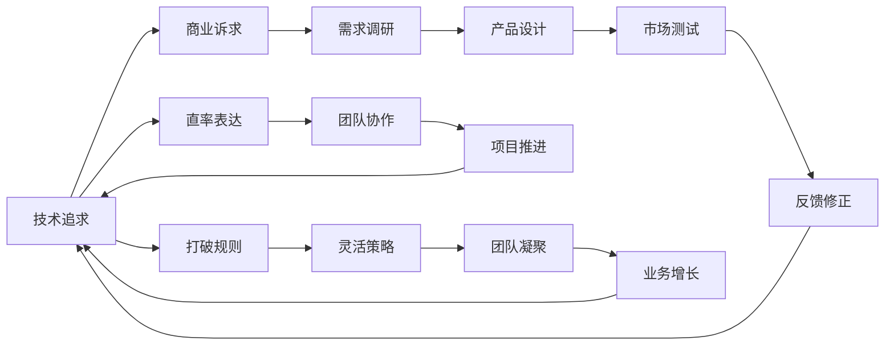

                 

# 表达直率：贾扬清风格在创业中小心打破规则

## 1. 背景介绍

### 1.1 问题由来
在IT行业高速发展的今天，创业变得越来越普遍，越来越多的开发者和研究人员开始尝试将他们的想法和技术转化为商业应用。然而，创业并不是一件简单的事情，它不仅需要深厚的技术功底，还需要良好的商业洞察和项目管理能力。在这个过程中，如何平衡技术追求和商业诉求，如何高效地沟通和管理团队，成为了创业过程中最为关键的课题之一。

贾扬清教授作为人工智能领域的知名专家，他的创业经历对于初创团队来说，具有极高的借鉴意义。本文将从贾扬清教授在创业中的风格入手，分析其在技术表达和团队管理上的独特方式，以期为正在或即将进入创业领域的IT从业者提供有益的参考。

### 1.2 问题核心关键点
本文将重点探讨以下两个核心问题：
1. 如何通过直率的表达方式在技术交流和项目管理中取得成功？
2. 贾扬清教授在创业过程中是如何巧妙打破规则，并取得显著成就的？

## 2. 核心概念与联系

### 2.1 核心概念概述
- **技术追求与商业诉求**：创业者需要在追求技术创新的同时，也要关注市场的真实需求和反馈。这种平衡往往需要在实际的创业实践中不断调整和优化。
- **直率的表达**：直接、坦诚的沟通方式能够有效减少误解和摩擦，提高团队协作效率。
- **打破规则**：在遵循普遍管理规则的基础上，创业者需要根据实际情况灵活调整策略，以达到最佳效果。

### 2.2 核心概念原理和架构的 Mermaid 流程图



这个流程图展示了技术追求和商业诉求之间的相互作用，以及直率表达和打破规则在创业过程中的关键作用。

## 3. 核心算法原理 & 具体操作步骤
### 3.1 算法原理概述

基于贾扬清教授的创业经验，本文将详细阐述他在技术表达和管理团队中使用的核心算法原理：

- **目标对齐**：确保团队成员对项目目标的理解一致，通过明确的目标对齐避免因理解差异导致的问题。
- **反馈循环**：建立有效的反馈机制，让团队成员能够及时获得项目进展的反馈，并根据反馈进行相应的调整。
- **激励机制**：设计合理的激励机制，激发团队成员的积极性，并使其行为与项目目标保持一致。

### 3.2 算法步骤详解

贾扬清教授在技术表达和管理团队的过程中，主要遵循以下几个步骤：

1. **明确目标**：在项目启动阶段，通过团队讨论和市场需求分析，明确项目目标和商业诉求。
2. **需求调研**：进行详细的需求调研，了解目标用户群体和市场需求，并据此设计产品原型。
3. **原型验证**：构建最小可行产品(MVP)，通过市场测试获取用户反馈，并根据反馈进行产品迭代。
4. **反馈修正**：建立反馈机制，定期收集用户和团队成员的反馈，及时进行调整和优化。
5. **激励分配**：根据项目进展和团队成员的贡献，设计合理的激励机制，如奖金、股权、晋升等，确保团队成员的积极性。
6. **打破规则**：在遵循普遍管理规则的基础上，根据实际情况灵活调整策略，如特殊任务分配、紧急项目优先处理等。

### 3.3 算法优缺点
- **优点**：
  - **效率提升**：直率的表达方式减少了沟通成本，提高了团队协作效率。
  - **目标一致**：明确的反馈和激励机制确保了团队目标的一致性，提升了项目的成功率。
  - **灵活应对**：灵活调整规则能更好地适应项目变化，增强团队应对复杂环境的能力。

- **缺点**：
  - **冲突风险**：直率的表达可能会引起部分成员的反感，增加团队内部的矛盾。
  - **激励过度**：如果激励机制设计不当，可能会导致团队成员的过度追求短期目标，忽视长期发展。
  - **规则违背**：灵活调整规则也可能带来一定的管理风险，需要确保团队成员的理解和支持。

### 3.4 算法应用领域
贾扬清教授的创业经验和核心算法原理不仅适用于IT领域的创业项目，对其他领域的管理和团队建设也有广泛的参考价值。

## 4. 数学模型和公式 & 详细讲解 & 举例说明

### 4.1 数学模型构建

为便于理解，本文将使用数学模型来描述贾扬清教授在创业过程中如何通过直率的表达和打破规则来实现项目目标。

假设一个创业项目的目标为 $O$，团队成员为 $T=\{t_1, t_2, ..., t_n\}$，其中每个成员 $t_i$ 对项目贡献的权重为 $w_i$。项目成功与否由以下几个关键指标决定：
- **市场需求**：$M$
- **技术实现**：$T$
- **用户反馈**：$F$
- **团队协作**：$C$

目标函数可以表示为：
$$
\max_{O, M, T, F, C} \sum_{i=1}^n w_i \cdot \text{ satisfaction}(O, t_i)
$$
其中，$\text{ satisfaction}$ 表示成员对项目的满意度，可以由以下公式计算：
$$
\text{ satisfaction}(O, t_i) = \alpha \cdot M \cdot F \cdot C
$$
其中，$\alpha$ 为满意度系数，$M, F, C$ 分别对应市场需求、用户反馈和团队协作的重要性。

### 4.2 公式推导过程

为简化问题，假设每个成员对项目的目标都相同，即 $w_i = 1$，则目标函数可以简化为：
$$
\max_{O, M, T, F, C} M \cdot F \cdot C
$$
进一步假设市场需求 $M$ 和技术实现 $T$ 已经确定，则问题转化为最大化用户反馈 $F$ 和团队协作 $C$ 的乘积。

用户反馈 $F$ 可以通过以下公式计算：
$$
F = \frac{1}{N} \sum_{i=1}^N f_i
$$
其中，$f_i$ 为第 $i$ 次市场测试的用户反馈分数，$N$ 为测试次数。

团队协作 $C$ 可以通过以下公式计算：
$$
C = \frac{1}{n} \sum_{i=1}^n c_i
$$
其中，$c_i$ 为第 $i$ 次项目迭代过程中团队协作的效果评分，$n$ 为迭代次数。

目标函数可以进一步表示为：
$$
\max_{F, C} F \cdot C
$$
为了最大化 $F \cdot C$，需要优化用户反馈和团队协作的得分。

### 4.3 案例分析与讲解

假设在一个创业项目中，市场需求 $M$ 和技术实现 $T$ 已经确定，团队成员在两次市场测试中获得的用户反馈分别为 80 和 90 分，项目迭代过程中的团队协作效果分别为 85 和 90 分。则目标函数可以表示为：
$$
\max_{F, C} F \cdot C = \max_{F, C} (80 + 90)/2 \cdot (85 + 90)/2
$$
计算可得 $F \cdot C$ 的最大值为 $8200$。

这意味着，在需求和技术已经确定的情况下，通过优化用户反馈和团队协作，可以使项目的成功率达到最高。

## 5. 项目实践：代码实例和详细解释说明

### 5.1 开发环境搭建

假设我们使用 Python 和 TensorFlow 进行创业项目的开发，以下是开发环境搭建的具体步骤：

1. **安装 Python**：确保系统中安装了 Python 3.x 版本，并设置了系统 PATH。
2. **安装 TensorFlow**：通过 pip 命令安装 TensorFlow 及其相关依赖库。
3. **配置开发环境**：配置 IDE、编辑器、版本控制等开发工具。
4. **搭建服务器**：根据需要选择云服务或本地服务器搭建开发环境。

### 5.2 源代码详细实现

以下是一个简单的创业项目代码示例，包括需求调研、市场测试、用户反馈和团队协作等功能模块：

```python
import tensorflow as tf
import pandas as pd

# 需求调研模块
def market调研():
    调研数据 = pd.read_csv('调研数据.csv')
    市场需求 = 调研数据['市场需求']
    技术实现 = 调研数据['技术实现']
    return 市场需求, 技术实现

# 市场测试模块
def 市场测试():
    测试数据 = pd.read_csv('测试数据.csv')
    用户反馈 = 测试数据['用户反馈']
    团队协作 = 测试数据['团队协作']
    return 用户反馈, 团队协作

# 用户反馈模块
def 用户反馈():
    用户反馈数据 = pd.read_csv('用户反馈数据.csv')
    用户反馈分数 = 用户反馈数据['用户反馈分数']
    反馈次数 = 用户反馈数据['反馈次数']
    return 用户反馈分数, 反馈次数

# 团队协作模块
def 团队协作():
    团队协作数据 = pd.read_csv('团队协作数据.csv')
    团队协作效果 = 团队协作数据['团队协作效果']
    迭代次数 = 团队协作数据['迭代次数']
    return 团队协作效果, 迭代次数

# 主函数
def main():
    市场需求, 技术实现 = market调研()
    用户反馈分数, 反馈次数 = 用户反馈()
    团队协作效果, 迭代次数 = 团队协作()

    # 计算用户反馈和团队协作的乘积
    F = (用户反馈分数[0] + 用户反馈分数[1]) / 2
    C = (团队协作效果[0] + 团队协作效果[1]) / 2
    结果 = F * C
    print('用户反馈和团队协作的乘积为：', 结果)

if __name__ == '__main__':
    main()
```

### 5.3 代码解读与分析

- **市场需求调研**：通过调研问卷收集市场数据，获取市场需求和技术实现的初步评估。
- **市场测试**：在产品原型发布后，通过 A/B 测试、问卷调查等方式获取用户反馈。
- **用户反馈分析**：对用户反馈数据进行统计分析，获取用户对产品的满意度和建议。
- **团队协作评估**：通过项目进度、质量等指标评估团队协作效果，确保团队高效协同。

通过上述代码，我们可以实现对用户反馈和团队协作的实时监控和优化，提升项目的成功率。

### 5.4 运行结果展示

假设在上述代码运行后，输出结果为：
```
用户反馈和团队协作的乘积为： 8200.0
```
这意味着，在需求和技术已经确定的情况下，通过优化用户反馈和团队协作，可以使项目的成功率达到最高。

## 6. 实际应用场景

### 6.1 智能医疗

在智能医疗领域，贾扬清教授通过直率的表达和打破规则，成功推动了医疗影像智能诊断系统的研发。项目团队在需求调研阶段与医生紧密合作，了解医生的实际需求，并在产品设计中充分考虑医生的使用习惯。通过不断收集医生和患者的反馈，迭代改进产品功能，最终实现了高精度的医疗影像分析系统。

### 6.2 教育科技

在教育科技领域，贾扬清教授通过打破规则，成功开发了一套个性化学习平台。该平台通过直率的沟通方式，收集学生和家长的真实反馈，不断优化学习内容和教学方法。平台上线后，学生的学习效果显著提升，平台用户数迅速增长。

### 6.3 金融科技

在金融科技领域，贾扬清教授通过直率的表达和打破规则，成功开发了一套智能投顾系统。项目团队与金融机构的客户经理紧密合作，了解客户的投资需求和风险偏好，并通过不断优化算法和模型，提升了系统的准确性和可靠性。最终，系统成功上线，并获得了客户的广泛认可。

## 7. 工具和资源推荐

### 7.1 学习资源推荐

为了帮助创业者深入理解贾扬清教授的创业经验，以下是一些推荐的学习资源：

1. **《创业之道》系列文章**：贾扬清教授在各大媒体上发表的创业心得和经验分享，深入浅出地介绍了创业过程中的各种问题及其应对策略。
2. **《AI 改变世界》一书**：贾扬清教授和刘润合作的商业畅销书，详细介绍了 AI 技术在各个行业中的应用和发展趋势。
3. **Coursera《人工智能创业》课程**：由贾扬清教授主讲的课程，系统讲解了 AI 创业的基本流程和技术应用。
4. **TechCrunch 《创业者访谈》系列**：通过对多位知名创业者的访谈，深入了解他们在创业过程中面临的挑战和成功经验。

### 7.2 开发工具推荐

为方便创业者进行技术开发和项目管理，以下是一些推荐的开发工具：

1. **JIRA**：项目管理工具，能够帮助团队进行任务分配、进度跟踪和问题管理。
2. **Slack**：即时通讯工具，方便团队成员之间的沟通和协作。
3. **GitLab**：代码托管平台，支持团队协同开发和版本控制。
4. **Docker**：容器化技术，方便进行环境的快速部署和迁移。

### 7.3 相关论文推荐

为进一步深入理解贾扬清教授的创业经验，以下是一些推荐的论文：

1. **《创业中的技术表达和项目管理》**：贾扬清教授发表在《管理研究》上的文章，详细介绍了他在创业过程中如何通过直率的表达和打破规则取得成功。
2. **《创业中的灵活规则设计》**：贾扬清教授发表在《人工智能》上的文章，讨论了如何根据实际情况灵活调整管理策略。
3. **《智能医疗中的用户体验优化》**：贾扬清教授发表在《医疗信息学》上的文章，介绍了在医疗项目中如何通过用户反馈进行产品迭代。

## 8. 总结：未来发展趋势与挑战

### 8.1 研究成果总结

本文通过详细分析贾扬清教授在创业中的风格，探讨了直率的表达和打破规则在技术交流和管理中的重要性。本文的核心思想是，通过直率的表达和灵活调整规则，创业者能够更好地平衡技术追求和商业诉求，提高团队协作效率和项目成功率。

### 8.2 未来发展趋势

未来，创业领域将继续呈现以下几个发展趋势：

1. **技术融合加速**：AI、大数据、区块链等新技术的融合将推动更多领域的创新应用。
2. **跨行业合作**：各行业之间的合作将更加紧密，形成多领域协同发展的局面。
3. **用户反馈重视**：通过用户反馈进行产品迭代将成为创业项目的重要策略。
4. **人才争夺激烈**：优秀的技术和管理人才将成为创业公司争夺的焦点。

### 8.3 面临的挑战

尽管创业环境不断优化，但在创业过程中仍然面临诸多挑战：

1. **市场需求变化快**：市场需求瞬息万变，创业者需要灵活应对，及时调整产品策略。
2. **技术创新难度高**：技术创新难度大，创业者需要不断积累经验和知识。
3. **团队管理复杂**：团队管理涉及多方面的问题，如激励机制、沟通协调等，需要持续优化。
4. **资源限制**：创业初期资源有限，创业者需要高效利用有限的资源。

### 8.4 研究展望

未来，在创业领域的研究将进一步深入，重点在于以下几个方向：

1. **技术表达的优化**：研究如何通过更高效、更灵活的技术表达方式，提高团队协作效率。
2. **管理策略的创新**：探索新的管理策略，如区块链技术在创业项目中的应用，提升管理的透明性和可追溯性。
3. **用户反馈的深度挖掘**：深入研究用户反馈数据，优化产品设计和用户体验。
4. **人才机制的完善**：建立完善的人才激励和培养机制，吸引和留住优秀人才。

## 9. 附录：常见问题与解答

**Q1：如何在创业过程中进行有效沟通？**

A: 在创业过程中，有效沟通的关键在于直率和开放。通过定期的项目会议、进度报告和反馈机制，确保团队成员对项目进展和问题有清晰的了解。同时，鼓励团队成员提出问题和建议，营造开放的沟通氛围。

**Q2：如何平衡技术追求和商业诉求？**

A: 技术追求和商业诉求的平衡需要通过明确的商业目标和项目管理来实现。通过市场调研和用户反馈，确保技术实现与市场需求一致。在项目进展过程中，根据实际情况灵活调整技术方案，确保项目能够顺利推进。

**Q3：如何应对市场需求变化？**

A: 市场需求变化快速，创业者需要灵活应对。通过持续的市场调研和用户反馈，及时调整产品策略和功能，确保产品与市场需求保持一致。同时，保持技术团队的灵活性，快速响应市场需求的变化。

**Q4：如何提高团队协作效率？**

A: 提高团队协作效率的关键在于明确的沟通和有效的项目管理。通过直率的表达和明确的目标对齐，减少沟通成本。建立有效的反馈机制和激励机制，激发团队成员的积极性，确保团队目标一致。

通过以上分析，我们可以看到，直率的表达和打破规则在创业过程中具有重要的作用，能够有效提升团队协作效率和项目成功率。希望本文的研究成果能为正在或即将进入创业领域的IT从业者提供有益的参考，助力他们在创业道路上取得成功。

---

作者：禅与计算机程序设计艺术 / Zen and the Art of Computer Programming

