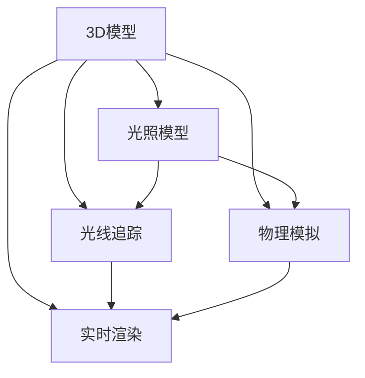

                 

# 计算机图形学：3D渲染和动画技术

> 关键词：计算机图形学, 3D渲染, 动画技术, 光线追踪, 物理模拟, 实时渲染, 虚拟现实, 游戏开发

## 1. 背景介绍

计算机图形学是计算机科学与视觉艺术的交叉学科，旨在研究和创造可交互的数字图像。随着硬件技术的发展，计算机图形学的应用领域不断扩大，从虚拟现实(VR)和增强现实(AR)到游戏开发和动画制作，3D渲染和动画技术在其中扮演着重要角色。3D渲染是计算机图形学中的核心技术之一，通过将3D模型转换为逼真的2D图像，使得虚拟场景变得更加生动和可信。动画技术则通过动态的3D模型变化，为虚拟场景增添了生命力。

在过去几十年中，3D渲染和动画技术经历了从光栅化到光线追踪，再到物理模拟的发展历程。光栅化技术曾经是3D渲染的主流方法，但它在处理复杂场景和光照效果时存在局限性。光线追踪技术通过追踪光线路径，实现了更加逼真的阴影和高光效果。物理模拟技术则通过仿真物理定律，实现了更加真实的光照和动态效果。近年来，实时渲染技术的发展使得3D渲染和动画技术在消费级设备上得到了广泛应用，如智能手机、平板和家用游戏机。

## 2. 核心概念与联系

### 2.1 核心概念概述

计算机图形学中的3D渲染和动画技术涉及多个关键概念，包括：

- 3D模型：指三维空间中的对象模型，包括几何、材质、纹理等属性。
- 光照模型：用于模拟光线与3D模型表面交互，计算光照强度和阴影效果的数学模型。
- 光线追踪：一种用于渲染3D场景的高级技术，通过追踪光线路径来计算光照和阴影效果。
- 物理模拟：通过模拟物理定律，实现逼真的动态效果，如碰撞和摩擦。
- 实时渲染：在有限时间内完成3D渲染和动画的渲染，适合在消费级设备上使用。
- 虚拟现实(VR)和增强现实(AR)：利用计算机图形学技术创建虚拟和增强的视觉体验。

这些概念之间的联系可以通过以下Mermaid流程图来展示：



这个流程图展示了3D渲染和动画技术中的各个概念以及它们之间的关系。

## 3. 核心算法原理 & 具体操作步骤

### 3.1 算法原理概述

3D渲染和动画技术的核心算法原理包括以下几个方面：

- 几何表示：3D模型通过几何表示来描述其形状和拓扑结构。常见的几何表示方法包括多边形网格、曲面网格、体网格等。
- 着色：3D模型通过着色来模拟材质和纹理。着色过程通常包括几何着色和光照着色。
- 光照计算：光照计算通过模拟光线与3D模型的交互，计算光照强度和阴影效果。常见的光照模型包括Phong、Blinn、Gouraud等。
- 纹理映射：纹理映射通过将2D纹理贴图映射到3D模型表面，实现更加逼真的表面效果。
- 物理模拟：物理模拟通过仿真物理定律，实现逼真的动态效果，如碰撞和摩擦。

### 3.2 算法步骤详解

3D渲染和动画技术的具体操作步骤如下：

1. **数据准备**：准备3D模型、纹理、光照模型、材质等数据。
2. **光照计算**：根据光照模型计算3D模型上的光照强度和阴影效果。
3. **着色处理**：根据材质和纹理对3D模型进行着色处理。
4. **纹理映射**：将2D纹理贴图映射到3D模型表面。
5. **物理模拟**：如果需要，进行物理模拟，计算物体的动态效果。
6. **渲染输出**：将处理后的3D模型输出为2D图像，完成渲染。

### 3.3 算法优缺点

3D渲染和动画技术的优缺点如下：

**优点**：
- 逼真效果：3D渲染和动画技术可以生成高度逼真的视觉效果，广泛应用于影视制作、游戏开发和虚拟现实等领域。
- 灵活性：可以通过改变3D模型、光照模型、材质等数据，实现多种不同的视觉效果。
- 技术成熟：经过多年的研究和应用，3D渲染和动画技术已经非常成熟，有大量的软件和工具支持。

**缺点**：
- 计算复杂度：3D渲染和动画技术的计算复杂度高，特别是在处理大规模场景和实时渲染时，需要高性能的硬件支持。
- 渲染时间：复杂场景和光照效果的渲染时间较长，影响用户体验。
- 开发难度：3D渲染和动画技术的开发难度较高，需要具备较强的计算机图形学知识和技能。

### 3.4 算法应用领域

3D渲染和动画技术在多个领域得到了广泛应用，包括：

- 影视制作：用于创建电影、电视和广告中的3D场景和动画效果。
- 游戏开发：用于创建游戏中的3D场景、角色和动画效果。
- 虚拟现实(VR)和增强现实(AR)：用于创建虚拟和增强的视觉体验。
- 教育培训：用于创建虚拟教室和实验设备，支持在线教育和虚拟培训。
- 医疗健康：用于创建虚拟手术室和健康模拟，支持医疗培训和远程医疗。

## 4. 数学模型和公式 & 详细讲解

### 4.1 数学模型构建

3D渲染和动画技术的数学模型主要包括以下几个方面：

- 几何模型：用于描述3D模型的几何结构。
- 光照模型：用于模拟光线与3D模型的交互。
- 着色模型：用于计算3D模型的颜色和亮度。

### 4.2 公式推导过程

以下是几个核心数学公式的推导过程：

**Phong光照模型**：

Phong光照模型是常用的光照模型之一，用于计算3D模型上的光照强度和阴影效果。公式如下：

$$
I = Ka + Kd \cdot \frac{\max(Li \cdot N, 0)}{\max(N \cdot V, 0)} + Ks \cdot \frac{\max(R \cdot N, 0)^{\alpha}}{\max(N \cdot V, 0)^{\alpha}}
$$

其中，$I$为光线强度，$Ka$、$Kd$、$Ks$分别为环境光、漫反射光和镜面反射光的强度，$Li$为入射光线的强度，$N$为法向量，$V$为视向量，$R$为反射光线强度，$\alpha$为镜面反射指数。

**Blinn-Phong光照模型**：

Blinn-Phong光照模型在Phong光照模型的基础上，进一步考虑了光照角度对阴影的影响，公式如下：

$$
I = Ka + Kd \cdot \max(Li \cdot N, 0) + Ks \cdot \max(R \cdot N, 0)^{\alpha}
$$

其中，$Ka$、$Kd$、$Ks$、$Li$、$N$、$V$、$R$、$\alpha$与Phong光照模型相同。

**Blinn-Phong光照模型推导**：

推导过程如下：

1. 计算法向量$N$和视向量$V$的单位向量$N'$和$V'$。
2. 计算入射光线的单位向量$L'$。
3. 计算环境光强度$I_a = Ka$。
4. 计算漫反射光强度$I_d = Kd \cdot \max(L' \cdot N', 0)$。
5. 计算镜面反射光强度$I_s = Ks \cdot \max((R \cdot N')^{\alpha}, 0)$。
6. 将环境光、漫反射光和镜面反射光强度相加，得到最终光线强度$I = I_a + I_d + I_s$。

### 4.3 案例分析与讲解

**光线追踪案例**：

光线追踪技术通过追踪光线路径，计算光照和阴影效果。以下是一个光线追踪的基本案例：

1. 从视点出发，发射一条光线。
2. 计算光线与3D模型相交的点。
3. 计算交点处的3D模型表面法向量和反射光线。
4. 计算反射光线与3D模型表面交点。
5. 计算反射光线与3D模型表面的光线路径。
6. 计算反射光线的颜色和强度，叠加到原始光线中。
7. 重复步骤2到6，直到光线达到光线终止条件。

## 5. 项目实践：代码实例和详细解释说明

### 5.1 开发环境搭建

为了进行3D渲染和动画技术的开发，需要搭建一个合适的开发环境。以下是几个常用的开发环境搭建方法：

1. **安装Blender**：Blender是一个开源的3D建模和渲染软件，支持多种渲染引擎和动画制作。可以从官网下载并安装Blender。
2. **安装OpenGL**：OpenGL是一个跨平台的3D图形渲染API，支持多种编程语言和平台。可以从官网下载并安装OpenGL。
3. **安装C++编译器**：C++是3D渲染和动画技术常用的编程语言之一，需要安装C++编译器。

### 5.2 源代码详细实现

以下是一个使用OpenGL进行3D渲染和动画技术的Python代码实现：

```python
from OpenGL.GL import *
from OpenGL.GLUT import *
from OpenGL.GLAR import *

# 设置视口大小
glutInitWindowSize(800, 600)

# 创建窗口
glutInitDisplayMode(GLUT_DOUBLE | GLUT_RGB | GLUT_DEPTH)
glutCreateWindow("3D Rendering and Animation")

# 设置光照模型
glEnable(GL_LIGHTING)
glEnable(GL_LIGHT0)
glLightfv(GL_LIGHT0, GL_POSITION, [0.0, 0.0, 1.0, 0.0])
glLightfv(GL_LIGHT0, GL_AMBIENT, [0.2, 0.2, 0.2, 1.0])
glLightfv(GL_LIGHT0, GL_DIFFUSE, [1.0, 1.0, 1.0, 1.0])
glLightfv(GL_LIGHT0, GL_SPECULAR, [1.0, 1.0, 1.0, 1.0])

# 设置材质属性
glMaterialfv(GL_FRONT, GL_AMBIENT, [0.2, 0.2, 0.2, 1.0])
glMaterialfv(GL_FRONT, GL_DIFFUSE, [1.0, 1.0, 1.0, 1.0])
glMaterialfv(GL_FRONT, GL_SPECULAR, [1.0, 1.0, 1.0, 1.0])

# 定义3D模型
model = """
    transform { 
        type Matrix
        m = [
            1.0, 0.0, 0.0, 0.0,
            0.0, 1.0, 0.0, 0.0,
            0.0, 0.0, 1.0, 0.0,
            0.0, 0.0, 0.0, 1.0
        ]
    }
    shape { 
        type Sphere
        radius = 0.5
    }
"""

# 加载3D模型
shader = glShapes.loadGLSL(model, "transform", "shape")

# 渲染函数
def render():
    glClear(GL_COLOR_BUFFER_BIT | GL_DEPTH_BUFFER_BIT)
    glLoadIdentity()
    gluLookAt(0.0, 0.0, 5.0, 0.0, 0.0, 0.0, 0.0, 1.0, 0.0)
    shader()
    glutSwapBuffers()

# 主循环
glutDisplayFunc(render)
glutMainLoop()
```

### 5.3 代码解读与分析

代码实现了使用OpenGL进行3D渲染和动画技术的简单案例。具体解释如下：

1. 设置视口大小：使用`glutInitWindowSize`设置窗口大小。
2. 创建窗口：使用`glutInitDisplayMode`和`glutCreateWindow`创建窗口。
3. 设置光照模型：使用`glEnable`和`glLightfv`设置光照模型和光源属性。
4. 设置材质属性：使用`glMaterialfv`设置3D模型的材质属性。
5. 定义3D模型：使用GLSL语言定义3D模型。
6. 加载3D模型：使用`glShapes.loadGLSL`加载3D模型。
7. 渲染函数：在`render`函数中执行渲染过程，包括清除缓冲区、设置变换矩阵、渲染3D模型等。
8. 主循环：使用`glutDisplayFunc`和`glutMainLoop`进入主循环。

## 6. 实际应用场景

### 6.1 影视制作

3D渲染和动画技术在影视制作中得到了广泛应用，用于创建逼真的3D场景和动画效果。例如，在电影《阿凡达》中，使用了光线追踪和物理模拟技术，实现了逼真的光影效果和动态效果。

### 6.2 游戏开发

3D渲染和动画技术在游戏开发中也非常重要，用于创建3D场景、角色和动画效果。例如，在《巫师3：狂猎》中，使用了光线追踪和物理模拟技术，实现了逼真的光照效果和动态效果。

### 6.3 虚拟现实(VR)和增强现实(AR)

3D渲染和动画技术在虚拟现实(VR)和增强现实(AR)中也得到了广泛应用，用于创建逼真的虚拟和增强视觉体验。例如，在虚拟现实游戏《Beat Saber》中，使用了3D渲染和动画技术，实现了逼真的音乐游戏场景。

### 6.4 未来应用展望

未来，随着硬件技术和计算能力的不断提高，3D渲染和动画技术将变得更加成熟和普及。以下是一些未来的应用展望：

1. **实时渲染**：实时渲染技术将使得3D渲染和动画技术在消费级设备上得到广泛应用，如智能手机、平板和家用游戏机。
2. **虚拟现实(VR)和增强现实(AR)**：VR和AR技术的普及将带来更多的3D渲染和动画应用场景，如虚拟教室、虚拟手术室等。
3. **人工智能(AI)**：AI技术将使得3D渲染和动画技术变得更加智能和高效，如自动生成3D模型、自动生成动画效果等。

## 7. 工具和资源推荐

### 7.1 学习资源推荐

为了学习3D渲染和动画技术，以下是一些优质的学习资源：

1. **《计算机图形学：第4版》**：这本书是计算机图形学的经典教材，全面介绍了3D渲染和动画技术的原理和应用。
2. **Coursera上的《计算机图形学》课程**：由斯坦福大学开设，提供了计算机图形学基础和实践的课程。
3. **Udacity上的《3D建模与动画》课程**：提供了3D建模和动画技术的实战教程。
4. **CGSociety**：这是一个计算机图形学和动画制作的社区网站，提供了丰富的教程和资源。

### 7.2 开发工具推荐

为了进行3D渲染和动画技术的开发，以下是一些常用的开发工具：

1. **Blender**：一个开源的3D建模和渲染软件，支持多种渲染引擎和动画制作。
2. **Maya**：一个商业的3D建模和动画软件，支持多种动画和渲染技术。
3. **3ds Max**：一个商业的3D建模和动画软件，支持多种动画和渲染技术。
4. **Unity**：一个游戏引擎，支持3D渲染和动画技术，支持多种平台。
5. **OpenGL**：一个跨平台的3D图形渲染API，支持多种编程语言和平台。

### 7.3 相关论文推荐

以下是几篇经典的3D渲染和动画技术论文，推荐阅读：

1. **《Real-Time Rendering: Techniques and Tools》**：这本书是实时渲染技术的经典教材，介绍了多种实时渲染技术。
2. **《 physically Based Rendering: From Theory to Implementation》**：这本书介绍了基于物理的渲染技术，包括光线追踪和物理模拟技术。
3. **《Motion capture and computer animation》**：这本书介绍了运动捕捉和计算机动画技术，用于创建逼真的动画效果。

## 8. 总结：未来发展趋势与挑战

### 8.1 研究成果总结

3D渲染和动画技术在过去几十年中取得了巨大的进步，推动了影视制作、游戏开发、虚拟现实等领域的快速发展。从光栅化到光线追踪，再到物理模拟，3D渲染和动画技术不断突破现有技术瓶颈，带来更加逼真的视觉效果和动态效果。

### 8.2 未来发展趋势

未来，3D渲染和动画技术将朝以下方向发展：

1. **实时渲染**：实时渲染技术将使得3D渲染和动画技术在消费级设备上得到广泛应用，如智能手机、平板和家用游戏机。
2. **虚拟现实(VR)和增强现实(AR)**：VR和AR技术的普及将带来更多的3D渲染和动画应用场景，如虚拟教室、虚拟手术室等。
3. **人工智能(AI)**：AI技术将使得3D渲染和动画技术变得更加智能和高效，如自动生成3D模型、自动生成动画效果等。

### 8.3 面临的挑战

尽管3D渲染和动画技术已经取得了显著进展，但在向实际应用场景推广的过程中，仍面临以下挑战：

1. **计算复杂度**：3D渲染和动画技术的计算复杂度高，特别是在处理大规模场景和实时渲染时，需要高性能的硬件支持。
2. **渲染时间**：复杂场景和光照效果的渲染时间较长，影响用户体验。
3. **开发难度**：3D渲染和动画技术的开发难度较高，需要具备较强的计算机图形学知识和技能。

### 8.4 研究展望

为了解决这些挑战，未来的研究需要在以下几个方面寻求新的突破：

1. **优化算法**：研究和优化3D渲染和动画技术的算法，降低计算复杂度，提高渲染速度。
2. **硬件加速**：研究和开发专用的硬件加速芯片，提升3D渲染和动画技术的计算效率。
3. **自动化技术**：研究和开发自动化技术，如自动生成3D模型和动画效果，降低开发难度。

总之，3D渲染和动画技术将继续发展，为计算机图形学领域带来更多的创新和应用。

## 9. 附录：常见问题与解答

**Q1: 3D渲染和动画技术需要哪些硬件支持？**

A: 3D渲染和动画技术需要高性能的图形处理器(GPU)和中央处理器(CPU)支持。GPU用于加速3D渲染和动画计算，CPU用于处理复杂的渲染逻辑和动画控制。

**Q2: 3D渲染和动画技术的计算复杂度如何？**

A: 3D渲染和动画技术的计算复杂度较高，特别是在处理大规模场景和实时渲染时，需要高性能的硬件支持。通过优化算法和硬件加速，可以降低计算复杂度。

**Q3: 如何提高3D渲染和动画技术的渲染速度？**

A: 通过优化算法和硬件加速，可以提高3D渲染和动画技术的渲染速度。例如，使用光线追踪技术、压缩纹理、使用可编程管道等。

**Q4: 如何降低3D渲染和动画技术的开发难度？**

A: 研究和开发自动化技术，如自动生成3D模型和动画效果，可以降低开发难度。此外，使用现有的3D建模和动画工具，如Blender、Maya等，也可以简化开发过程。

**Q5: 3D渲染和动画技术有哪些应用场景？**

A: 3D渲染和动画技术在影视制作、游戏开发、虚拟现实(VR)和增强现实(AR)等领域得到了广泛应用。例如，在电影《阿凡达》中，使用了光线追踪和物理模拟技术，实现了逼真的光影效果和动态效果。

---

作者：禅与计算机程序设计艺术 / Zen and the Art of Computer Programming

