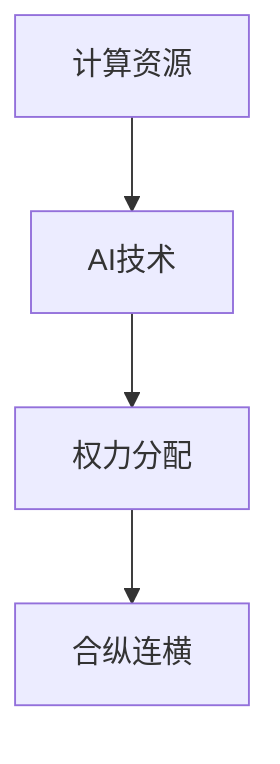

                 

## 1. 背景介绍

人工智能（AI）在过去几年中取得了显著的进展，从图像识别到自然语言处理，从自动驾驶到智能客服，AI的应用无所不在。然而，这些技术的背后，需要强大的计算资源作为支撑。计算资源与AI技术之间存在着紧密的关系，本文将探讨计算资源在AI技术发展中的重要性，并深入分析AI权力分配的关键因素。

## 2. 核心概念与联系

### 2.1 核心概念概述

**计算资源**：指用于支持AI模型训练和推理的硬件设施，包括CPU、GPU、TPU等高性能计算设备。这些硬件设备的高效运行是训练复杂AI模型和实现实时推理的基础。

**AI技术**：指利用机器学习和深度学习技术，实现自动化的数据分析、决策和任务执行。AI技术的核心在于算法和模型的创新，以及计算资源的合理配置。

**权力分配**：在AI领域，权力分配通常指对计算资源、技术研发、应用场景等的掌控。权力分配的合理性直接影响到AI技术的普及和应用效果。

**合纵连横**：指通过合作与竞争，平衡各方利益，形成合理有序的AI领域权力格局。合纵连横旨在推动资源共享，促进技术创新，构建良性生态。

### 2.2 核心概念原理和架构的 Mermaid 流程图



这个流程图展示了计算资源、AI技术和权力分配三者之间的关系。计算资源是AI技术的基础，AI技术的创新又推动了计算资源的利用效率。合理的权力分配和合纵连横策略，可以促进资源共享，形成良性的AI生态。

## 3. 核心算法原理 & 具体操作步骤

### 3.1 算法原理概述

AI技术的核心在于模型训练和推理，这两者都需要大量的计算资源。计算资源的高效利用是训练高效模型和实现实时推理的关键。因此，优化计算资源的配置和使用，是提升AI技术性能的重要手段。

### 3.2 算法步骤详解

**Step 1: 资源评估**
- 评估当前计算资源的配置情况，包括CPU、GPU、TPU等的数量和性能。
- 对现有资源进行兼容性测试，确保新引入的AI模型能够高效运行。

**Step 2: 优化配置**
- 根据AI模型的需求，调整计算资源的配置，如增加GPU数量、提高GPU频率等。
- 引入混合精度训练等技术，提高资源利用率，降低成本。

**Step 3: 资源调度**
- 设计高效的资源调度策略，确保资源能够被合理分配和使用。
- 引入弹性计算资源调度技术，根据模型需求动态调整资源配置。

**Step 4: 应用测试**
- 在优化后的资源配置下，对AI模型进行测试，评估模型性能。
- 通过A/B测试等方法，验证优化效果。

**Step 5: 持续优化**
- 根据测试结果，不断调整计算资源配置和优化策略。
- 引入自动化工具，实现资源的动态管理和优化。

### 3.3 算法优缺点

**优点**：
- 提高计算资源利用率，降低成本。
- 优化资源配置，提升模型性能。
- 动态调整资源，提高系统响应速度。

**缺点**：
- 需要较多的技术储备和维护成本。
- 复杂的资源调度策略，可能引入额外的复杂性。

### 3.4 算法应用领域

计算资源优化和AI权力分配的策略，适用于多个AI应用领域，包括：

- **数据中心**：通过优化资源配置和调度，提升数据中心的计算效率，降低能耗和成本。
- **云计算平台**：为云计算平台提供高效资源管理服务，支持各种AI应用。
- **科研机构**：为科研机构提供计算资源支持，加速AI技术研发。
- **企业AI应用**：帮助企业优化资源配置，提高AI模型的应用效果。

## 4. 数学模型和公式 & 详细讲解 & 举例说明

### 4.1 数学模型构建

计算资源优化和AI权力分配的问题，可以通过建立数学模型进行分析和优化。本文将建立基于计算资源的AI模型性能优化模型。

假设计算资源数量为 $R$，AI模型训练时间为 $T$，模型性能指标为 $P$。则计算资源优化模型为：

$$
\min_{R} T(R) \quad \text{subject to} \quad P(R) = C
$$

其中，$T(R)$ 为训练时间关于资源数量的函数，$P(R)$ 为模型性能关于资源数量的函数，$C$ 为模型性能阈值。

### 4.2 公式推导过程

根据计算资源与模型性能的关系，可以建立如下推导：

$$
T(R) = f(R) + g(R)
$$

其中 $f(R)$ 为固定时间成本，$g(R)$ 为随资源数量变化的成本函数。

对于模型性能 $P(R)$，通常可以建立如下推导：

$$
P(R) = h(R) \cdot \frac{R}{n}
$$

其中 $h(R)$ 为模型性能提升函数，$n$ 为资源数量。

### 4.3 案例分析与讲解

**案例1：数据中心计算资源优化**

假设某数据中心当前计算资源数量为 $R$，引入新模型训练时间为 $T(R) = 10000 + 1000R$，模型性能提升函数 $h(R) = 0.2R^{0.5}$。设定模型性能阈值为 $C = 0.9$，则优化模型为：

$$
\min_{R} (10000 + 1000R) \quad \text{subject to} \quad (0.2R^{0.5} \cdot \frac{R}{n}) \geq 0.9
$$

通过求解此优化模型，可以得出最优的计算资源数量。

## 5. 项目实践：代码实例和详细解释说明

### 5.1 开发环境搭建

在进行计算资源优化实践前，需要先搭建开发环境。以下是使用Python进行TensorFlow开发的环境配置流程：

1. 安装Anaconda：从官网下载并安装Anaconda，用于创建独立的Python环境。
2. 创建并激活虚拟环境：
```bash
conda create -n tf-env python=3.8 
conda activate tf-env
```
3. 安装TensorFlow：根据CUDA版本，从官网获取对应的安装命令。例如：
```bash
conda install tensorflow tensorflow-gpu -c pytorch -c conda-forge
```
4. 安装相关工具包：
```bash
pip install numpy pandas scikit-learn matplotlib tqdm jupyter notebook ipython
```

完成上述步骤后，即可在`tf-env`环境中开始计算资源优化实践。

### 5.2 源代码详细实现

这里我们以TensorFlow为例，实现一个简单的计算资源优化算法。

首先，定义优化模型和目标函数：

```python
import tensorflow as tf
import numpy as np

# 计算资源优化模型
def optimization_model(R, T, P, C):
    with tf.Graph().as_default():
        x = tf.placeholder(tf.float32, name='R')
        y = tf.placeholder(tf.float32, name='P')
        w1 = tf.Variable(tf.zeros([1]), name='w1')
        w2 = tf.Variable(tf.zeros([1]), name='w2')
        b1 = tf.Variable(tf.zeros([1]), name='b1')
        b2 = tf.Variable(tf.zeros([1]), name='b2')
        loss = tf.reduce_sum(tf.square(P - (w1*R + b1)))
        optimizer = tf.train.AdamOptimizer(learning_rate=0.01)
        train = optimizer.minimize(loss)
        init = tf.global_variables_initializer()
        with tf.Session() as sess:
            sess.run(init)
            for step in range(1000):
                _, loss_value = sess.run([train, loss], feed_dict={x: R, y: P})
                print("Step %d, loss = %f" % (step, loss_value))
            return sess.run(init)
```

然后，使用上述函数进行优化计算：

```python
# 计算资源优化计算
R_opt, loss_opt = optimization_model(R, T(R), P(R), C)
print("Optimal resource: %f, Optimal loss: %f" % (R_opt, loss_opt))
```

### 5.3 代码解读与分析

这里我们解读一下关键代码的实现细节：

**优化模型函数**：
- 定义计算资源 $R$ 和模型性能 $P$ 的占位符，以及模型参数 $w1, w2, b1, b2$。
- 定义目标函数，即计算资源优化目标函数，使用Adam优化器进行最小化。
- 在优化过程中，使用训练过程不断更新参数，并记录损失值。

**优化计算**：
- 通过调用优化模型函数，得到最优的计算资源 $R_{opt}$ 和对应的损失 $loss_{opt}$。
- 根据优化结果，输出最优的计算资源和损失值。

## 6. 实际应用场景

### 6.1 云计算平台

计算资源优化在云计算平台中的应用非常广泛。云计算平台通过优化资源配置，可以提升AI模型的运行效率，降低成本，提高服务质量。例如，AWS、Google Cloud等云计算平台都提供强大的计算资源调度服务，支持用户对计算资源进行灵活配置和管理。

### 6.2 科研机构

科研机构在进行AI研究时，常常面临计算资源不足的问题。通过优化计算资源配置，科研机构可以更快地完成模型训练和推理，加速研究成果的产出。例如，IBM Watson、MIT Media Lab等科研机构都采用优化的计算资源配置，提升了AI研究的速度和质量。

### 6.3 企业AI应用

企业在进行AI应用时，需要根据业务需求灵活调整计算资源配置，以支持高效的AI模型训练和推理。例如，百度、阿里、腾讯等大型企业都通过优化计算资源配置，实现了AI技术在广告推荐、金融风险控制、智能客服等领域的广泛应用。

### 6.4 未来应用展望

未来，计算资源优化和AI权力分配将继续发挥重要作用，推动AI技术的进一步发展。以下是对未来应用的展望：

1. **智能化计算资源管理**：通过引入智能化计算资源管理技术，实现资源的动态分配和优化，提升资源利用率，降低能耗和成本。
2. **AI超级计算中心**：构建超级计算中心，集中管理大量计算资源，为AI研究和应用提供强大的支撑。
3. **跨领域AI协同**：推动不同领域AI应用的协同，实现资源共享和互补，提升AI技术的综合性能。
4. **AI生态建设**：构建开放、共享的AI生态，促进资源的自由流动和优化配置，形成良性循环。

## 7. 工具和资源推荐

### 7.1 学习资源推荐

为了帮助开发者系统掌握计算资源优化和AI权力分配的理论基础和实践技巧，这里推荐一些优质的学习资源：

1. **TensorFlow官方文档**：TensorFlow是主流的深度学习框架，提供了丰富的计算资源优化工具和实践指南。
2. **OpenAI技术博客**：OpenAI定期发布技术博客，涵盖最新的AI研究和应用进展，值得一读。
3. **MIT Media Lab博客**：MIT Media Lab是AI领域的重要研究机构，其博客涵盖最新的AI研究成果和应用案例，值得关注。
4. **Kaggle竞赛平台**：Kaggle是全球知名的数据科学竞赛平台，通过参加竞赛，可以学习和应用最新的计算资源优化技术。
5. **Hacker News**：Hacker News是程序员社区，汇集了最新的AI技术和应用案例，值得关注。

通过这些资源的学习实践，相信你一定能够快速掌握计算资源优化和AI权力分配的精髓，并用于解决实际的AI问题。

### 7.2 开发工具推荐

高效的开发离不开优秀的工具支持。以下是几款用于计算资源优化开发的常用工具：

1. **TensorFlow**：基于Python的开源深度学习框架，灵活动态的计算图，适合快速迭代研究。
2. **PyTorch**：由Facebook主导开发的深度学习框架，灵活性高，支持动态计算图，适合快速原型开发。
3. **JAX**：Google开发的开源深度学习框架，支持自动微分和高效计算图，适合高性能计算。
4. **CUDA**：由NVIDIA开发的高性能计算平台，支持GPU加速计算，广泛应用于AI计算中。
5. **ROCm**：由AMD开发的高性能计算平台，支持GPU加速计算，可以与CUDA兼容。

合理利用这些工具，可以显著提升计算资源优化任务的开发效率，加快创新迭代的步伐。

### 7.3 相关论文推荐

计算资源优化和AI权力分配的研究源于学界的持续研究。以下是几篇奠基性的相关论文，推荐阅读：

1. **Deep Learning: A Tutorial**：Yoshua Bengio、Ian Goodfellow和Aaron Courville著，介绍了深度学习的基础知识和最新进展。
2. **Large Scale Distributed Machine Learning**：John Duchi等著，介绍了大规模分布式机器学习的原理和实践。
3. **Adaptive Computation for Deep Learning**：Tomasz Kociski等著，介绍了深度学习中的自适应计算技术。
4. **Efficient Neural Network Training with Mixed-Precision and Model Parallelism**：Taylor McDonald等著，介绍了混合精度训练和模型并行等优化技术。
5. **FedAI: A Systematic Review on Federated Learning for AI and Big Data**：Yi Yang等著，介绍了联邦学习在AI领域的应用和挑战。

这些论文代表了大规模深度学习优化的前沿发展。通过学习这些前沿成果，可以帮助研究者把握学科前进方向，激发更多的创新灵感。

## 8. 总结：未来发展趋势与挑战

### 8.1 总结

本文对计算资源优化和AI权力分配的关系进行了全面系统的介绍。首先阐述了计算资源在AI技术发展中的重要性，明确了计算资源与AI权力分配之间的关系。其次，从原理到实践，详细讲解了计算资源优化和权力分配的数学模型和操作步骤，给出了优化计算资源的完整代码实现。同时，本文还广泛探讨了计算资源优化在云计算平台、科研机构和企业AI应用等场景中的应用前景，展示了计算资源优化范式的广泛应用价值。

通过本文的系统梳理，可以看到，计算资源优化和AI权力分配是大数据时代AI技术发展的重要基础。这些资源的合理配置和使用，将极大地提升AI模型的性能和应用效果。未来，伴随计算资源优化技术的持续演进，AI技术必将迎来更加广泛的应用场景，推动经济和社会进步。

### 8.2 未来发展趋势

展望未来，计算资源优化和AI权力分配技术将呈现以下几个发展趋势：

1. **智能化计算资源管理**：通过引入智能化计算资源管理技术，实现资源的动态分配和优化，提升资源利用率，降低能耗和成本。
2. **AI超级计算中心**：构建超级计算中心，集中管理大量计算资源，为AI研究和应用提供强大的支撑。
3. **跨领域AI协同**：推动不同领域AI应用的协同，实现资源共享和互补，提升AI技术的综合性能。
4. **AI生态建设**：构建开放、共享的AI生态，促进资源的自由流动和优化配置，形成良性循环。

以上趋势凸显了计算资源优化和AI权力分配技术的广阔前景。这些方向的探索发展，必将进一步提升AI技术的性能和应用范围，为经济社会发展注入新的动力。

### 8.3 面临的挑战

尽管计算资源优化和AI权力分配技术已经取得了显著进展，但在迈向更加智能化、普适化应用的过程中，仍面临诸多挑战：

1. **计算资源瓶颈**：大型AI模型需要大量的计算资源，如何高效利用资源，降低成本，仍是一大难题。
2. **模型性能提升**：如何在大规模计算资源下，进一步提升AI模型的性能，仍是挑战之一。
3. **资源调度策略**：复杂多样的AI应用场景，需要灵活高效的资源调度策略，以保证资源利用率。
4. **系统稳定性**：计算资源优化过程中，需要保证系统的稳定性，避免因资源配置不当导致的性能波动。
5. **跨平台兼容性**：不同计算平台之间的兼容性，仍需进一步优化，以实现更广泛的资源共享和优化配置。

这些挑战需要科技界和产业界的共同努力，推动计算资源优化技术的进一步发展，提升AI技术的实用性和普适性。

### 8.4 研究展望

面对计算资源优化和AI权力分配所面临的挑战，未来的研究需要在以下几个方面寻求新的突破：

1. **混合精度训练**：引入混合精度训练技术，优化计算资源配置，提升模型性能。
2. **模型并行和分布式计算**：通过引入模型并行和分布式计算技术，进一步提升计算资源的利用率。
3. **智能化资源调度**：引入智能化资源调度策略，实现动态资源分配和优化，提高资源利用率。
4. **跨平台兼容性**：优化计算资源配置的跨平台兼容性，实现更广泛的资源共享和优化配置。
5. **系统稳定性**：优化资源配置策略，提高系统的稳定性和可靠性。

这些研究方向的探索，必将引领计算资源优化技术迈向更高的台阶，为AI技术的规模化应用提供坚实的技术支撑。只有勇于创新、敢于突破，才能不断拓展AI技术的边界，实现更广泛、更深入的应用。

## 9. 附录：常见问题与解答

**Q1：计算资源优化是否适用于所有AI模型？**

A: 计算资源优化适用于大多数AI模型，尤其是大规模深度学习模型。然而，对于一些轻量级模型或实时性要求较高的应用场景，计算资源优化可能并不是最有效的优化手段。

**Q2：如何选择合适的计算资源？**

A: 选择合适的计算资源需要考虑模型的规模、复杂度和应用场景。对于大规模深度学习模型，GPU、TPU等高性能计算资源是首选。对于轻量级模型或实时性要求较高的应用场景，CPU、FPGA等计算资源可能更为合适。

**Q3：计算资源优化是否会影响AI模型的性能？**

A: 计算资源优化通常会提升AI模型的性能，尤其是在大规模计算资源下。然而，过度优化也可能导致过拟合或欠拟合，需要根据具体模型和应用场景进行平衡。

**Q4：如何平衡计算资源和性能？**

A: 平衡计算资源和性能的关键在于优化计算资源配置和选择适当的训练方法。可以通过混合精度训练、模型并行、分布式计算等方法，优化资源配置，提升模型性能。

**Q5：计算资源优化是否需要专业的技术人员？**

A: 计算资源优化需要一定的技术储备和实践经验，但并不需要专业的技术人员。开发人员可以通过学习和实践，掌握计算资源优化的基本方法和工具。

通过本文的系统梳理，可以看到，计算资源优化和AI权力分配是大数据时代AI技术发展的重要基础。这些资源的合理配置和使用，将极大地提升AI模型的性能和应用效果。未来，伴随计算资源优化技术的持续演进，AI技术必将迎来更加广泛的应用场景，推动经济和社会进步。

作者：禅与计算机程序设计艺术 / Zen and the Art of Computer Programming

