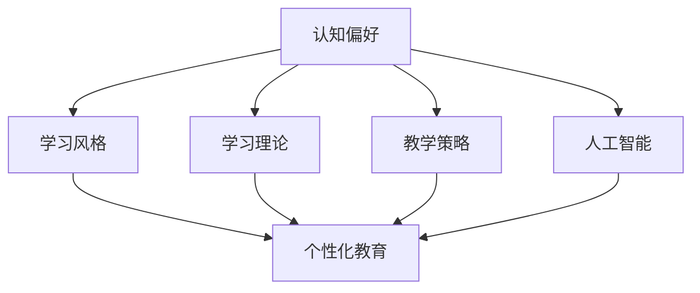

                 

# 认知偏好与学习风格：个性化教育的基础

> 关键词：认知偏好,学习风格,个性化教育,学习理论,教学策略,人工智能

## 1. 背景介绍

### 1.1 问题由来

教育一直是人类社会最重要的活动之一，其目的是培养个体具备适应社会所需的知识、技能和情感。传统的教育模式往往采用“一刀切”的方法，即所有学生均接受同样的教学内容和教学方法，这种模式往往忽视了学生的个性化需求和多样性。在信息化、智能化的今天，如何根据学生的认知偏好和学习风格，提供个性化、差异化的教育服务，成为了教育领域亟待解决的问题。

### 1.2 问题核心关键点

1. **认知偏好**：指个体在信息处理、思考方式和解决问题时的倾向性，包括信息获取的渠道、偏好内容的形式、处理信息的速率等。
2. **学习风格**：指个体在学习和认知过程中表现出的偏好和习惯，包括视觉、听觉、动觉等不同的学习方式。
3. **个性化教育**：根据学生的认知偏好和学习风格，提供定制化的教学内容和教学方法，以提高学习效率和效果。
4. **学习理论**：描述人类学习过程的理论模型，如行为主义、认知主义、建构主义等，为个性化教育提供理论依据。
5. **教学策略**：结合学习理论和教育技术，设计的具体教学方法，如多媒体教学、翻转课堂、项目学习等。
6. **人工智能**：通过数据分析和机器学习，实现对学生认知偏好和学习风格的识别，并据此提供个性化的教学建议。

### 1.3 问题研究意义

研究认知偏好与学习风格，对于实现个性化教育，提高教学效果具有重要意义：

1. **提高学习效率**：根据学生的个性化需求，采用适合其学习风格的教学方法，能够显著提高学习效率。
2. **增强学习体验**：个性化的学习内容和教学策略，能够提升学生的学习兴趣和动力，改善学习体验。
3. **促进全面发展**：个性化教育能够兼顾学生的认知、情感和行为等多方面需求，促进其全面发展。
4. **适应未来教育趋势**：随着信息技术的发展，传统教育模式将逐渐被更加灵活、个性化的教育模式所取代。
5. **促进教育公平**：通过提供适合不同学生需求的教育资源，能够缩小教育差距，促进教育公平。

## 2. 核心概念与联系

### 2.1 核心概念概述

为更好地理解认知偏好与学习风格在个性化教育中的应用，本节将介绍几个密切相关的核心概念：

- **认知偏好**：指个体在信息处理和思维过程中的倾向性，包括信息获取的途径（如视觉、听觉、阅读）、处理信息的速率（如快慢）、对信息的理解和记忆方式（如逻辑推理、图像识别）等。
- **学习风格**：指个体在学习过程中的习惯和偏好，包括视觉型、听觉型、动觉型等不同的学习方式。
- **个性化教育**：根据学生的认知偏好和学习风格，提供定制化的教学内容和教学方法，以提高学习效率和效果。
- **学习理论**：描述人类学习过程的理论模型，如行为主义、认知主义、建构主义等，为个性化教育提供理论依据。
- **教学策略**：结合学习理论和教育技术，设计的具体教学方法，如多媒体教学、翻转课堂、项目学习等。
- **人工智能**：通过数据分析和机器学习，实现对学生认知偏好和学习风格的识别，并据此提供个性化的教学建议。

这些核心概念之间的逻辑关系可以通过以下Mermaid流程图来展示：



这个流程图展示了个体认知偏好、学习风格、个性化教育之间的逻辑关系：

1. 认知偏好和学习风格是个性化教育的基础，通过识别个体的认知偏好和学习风格，能够提供更贴合其需求的个性化教育。
2. 学习理论和教学策略为个性化教育提供理论指导和实践方法。
3. 人工智能技术能够对学生的认知偏好和学习风格进行识别和分析，进一步提升个性化教育的精准性和有效性。

这些概念共同构成了个性化教育的核心框架，使其能够在教学实践中发挥重要作用。

## 3. 核心算法原理 & 具体操作步骤
### 3.1 算法原理概述

个性化教育的实现，核心在于识别和分析学生的认知偏好和学习风格，据此提供定制化的教学内容和教学方法。其基本原理可以概括为：

1. **数据收集**：通过问卷、测试、观察等方法，收集学生在学习过程中的表现数据。
2. **数据分析**：运用统计学、机器学习等技术，对学生的数据进行分析，识别其认知偏好和学习风格。
3. **内容定制**：根据分析结果，定制适合学生的教学内容和教学方法。
4. **教学实施**：将定制化的教学内容和方法应用于实际教学中，实时监测和调整。
5. **效果评估**：通过测验、反馈等手段，评估个性化教育的实施效果，不断优化教学策略。

### 3.2 算法步骤详解

个性化教育的实现步骤一般包括以下几个关键环节：

**Step 1: 数据收集与预处理**
- 设计问卷和测试，收集学生在学习过程中的表现数据。
- 清洗和处理数据，去除噪声和异常值，确保数据质量。
- 将数据分为训练集和测试集，用于模型训练和效果评估。

**Step 2: 识别认知偏好和学习风格**
- 使用统计学方法，如因子分析、聚类分析等，识别学生的认知偏好和学习风格。
- 使用机器学习算法，如决策树、支持向量机等，对数据进行建模，预测学生的认知偏好和学习风格。

**Step 3: 定制个性化教学内容**
- 根据学生的认知偏好和学习风格，定制适合的教学内容，如多媒体资源、教学视频等。
- 设计个性化的教学策略，如翻转课堂、项目学习等。
- 采用人工智能技术，如自然语言处理、图像识别等，辅助个性化教学内容的设计和实现。

**Step 4: 教学实施与监测**
- 将定制化的教学内容和方法应用于实际教学中，实时监测学生的学习效果。
- 使用反馈系统，收集学生和教师的反馈，不断优化教学策略。
- 定期对教学效果进行评估，调整教学内容和策略，确保个性化教育的持续改进。

### 3.3 算法优缺点

个性化教育技术具有以下优点：
1. 提高学习效率：根据学生的个性化需求，采用适合其学习风格的教学方法，能够显著提高学习效率。
2. 增强学习体验：个性化的学习内容和教学策略，能够提升学生的学习兴趣和动力，改善学习体验。
3. 促进全面发展：个性化教育能够兼顾学生的认知、情感和行为等多方面需求，促进其全面发展。

同时，该方法也存在一定的局限性：
1. 数据收集困难：个性化教育的实施需要大量的学生数据，数据收集和处理过程复杂。
2. 技术实现复杂：个性化教育涉及多学科、多技术领域的知识，技术实现难度较高。
3. 师资力量不足：个性化教育需要专业的教师和技术人员，师资力量不足可能会影响教育效果。
4. 数据隐私问题：学生的个人信息和行为数据需要严格保护，防止隐私泄露。
5. 技术依赖性强：个性化教育的实施对技术依赖性强，需要持续的资金和资源投入。

尽管存在这些局限性，但就目前而言，个性化教育技术仍是大势所趋，具有广阔的应用前景。未来相关研究的重点在于如何进一步降低数据收集和处理的复杂性，提高个性化教育的可操作性和可扩展性，同时兼顾数据隐私和教学质量。

### 3.4 算法应用领域

个性化教育技术已经在多个领域得到了应用，取得了显著的效果，以下是几个典型的应用场景：

**1. 基础教育**
- 在基础教育阶段，个性化教育技术可以帮助教师识别学生的认知偏好和学习风格，提供适合的教学内容和教学方法。例如，在数学教学中，可以根据学生的视觉、听觉、动觉偏好，设计适合的教学视频和互动练习。

**2. 高等教育**
- 在高等教育阶段，个性化教育技术可以帮助学生根据其认知偏好和学习风格，选择适合的课程和教学方法。例如，在计算机科学课程中，可以推荐适合学生学习风格的编程资源和练习，提升学习效果。

**3. 职业培训**
- 在职业培训领域，个性化教育技术可以帮助学员根据其认知偏好和学习风格，定制适合的培训内容和培训方法。例如，在IT软件开发培训中，可以提供适合学员学习风格的代码编写练习和项目实践。

**4. 终身学习**
- 在终身学习领域，个性化教育技术可以帮助学习者根据其认知偏好和学习风格，选择适合的课程和资源。例如，在在线学习平台上，可以推荐适合学习者学习风格的课程和学习资源，提升学习效果。

除了上述这些经典场景外，个性化教育技术还可以应用于更多领域，如医学教育、企业培训、家庭教育等，为不同层次、不同需求的教育对象提供个性化的学习支持。

## 4. 数学模型和公式 & 详细讲解 & 举例说明
### 4.1 数学模型构建

本节将使用数学语言对个性化教育的核心算法进行更加严格的刻画。

假设学生有$n$种认知偏好$P=\{p_1, p_2, ..., p_n\}$和$m$种学习风格$S=\{s_1, s_2, ..., s_m\}$，记学生在学习过程中的表现数据为$D=\{(x_i, y_i)\}_{i=1}^N$，其中$x_i$为输入特征向量，$y_i$为输出标签。

定义认知偏好和学习风格的概率分布为$p_1, p_2, ..., p_n$和$s_1, s_2, ..., s_m$，则学生的认知偏好和学习风格的概率为：

$$
\mathbb{P}(P_i | D) = \frac{\sum_{j=1}^N I(x_j=p_i)I(y_j=1)}{\sum_{j=1}^N I(x_j=p_i)} \quad \text{for} \quad i=1,...,n
$$

$$
\mathbb{P}(S_i | D) = \frac{\sum_{j=1}^N I(x_j=s_i)I(y_j=1)}{\sum_{j=1}^N I(x_j=s_i)} \quad \text{for} \quad i=1,...,m
$$

其中$I(x_j=p_i)$表示特征向量$x_j$中是否包含认知偏好$p_i$，$I(x_j=s_i)$表示特征向量$x_j$中是否包含学习风格$s_i$。

### 4.2 公式推导过程

以下我们以认知偏好的识别为例，推导认知偏好的识别公式及其梯度计算。

假设认知偏好的识别任务为二分类问题，即识别学生是否具有认知偏好$p_i$。定义学生具有认知偏好$p_i$的二分类问题为$C_{p_i}$，其目标是最小化经验风险：

$$
\mathcal{L}(p_i) = -\frac{1}{N}\sum_{j=1}^N [y_jI(x_j=p_i)\log\hat{y_j} + (1-y_j)I(x_j=p_i)\log(1-\hat{y_j})]
$$

其中$\hat{y_j} = \mathbb{P}(P_i | D)$表示学生具有认知偏好$p_i$的概率，$y_j=1$表示学生实际上具有认知偏好$p_i$，$y_j=0$表示学生实际上不具有认知偏好$p_i$。

根据链式法则，经验风险对认知偏好$p_i$的梯度为：

$$
\frac{\partial \mathcal{L}(p_i)}{\partial p_i} = -\frac{1}{N}\sum_{j=1}^N [y_j\hat{y_j} - (1-y_j)(1-\hat{y_j})]I(x_j=p_i)
$$

在得到认知偏好的识别梯度后，即可带入参数更新公式，完成模型的迭代优化。重复上述过程直至收敛，最终得到适合学生的认知偏好$p_i$。

### 4.3 案例分析与讲解

假设有一名学生在数学学习中表现出以下特征：
- 喜欢使用视觉图表理解数学概念，即视觉型认知偏好；
- 在解决数学问题时，更倾向于通过阅读数学公式和题干，而非听讲解，即听觉型认知偏好；
- 通过动手操作和实践，能够更好地掌握数学知识，即动觉型认知偏好。

那么，可以通过以下步骤对学生的认知偏好进行识别和分析：

1. **数据收集**：设计问卷和测试，收集学生在学习过程中的表现数据。例如，可以设计以下问卷：
   - 你是否喜欢使用数学图表理解数学概念？（是/否）
   - 你在解决数学问题时，更倾向于听老师讲解，还是阅读题干？（听/阅读）
   - 你通过动手操作和实践，是否能够更好地掌握数学知识？（是/否）

2. **数据分析**：对收集到的数据进行统计分析，识别学生的认知偏好和学习风格。例如，可以使用以下方法：
   - 因子分析：将多个特征归结为少数几个因子，识别学生的认知偏好。
   - 聚类分析：将学生分为不同的认知偏好类别，找到适合学生的认知偏好。

3. **认知偏好的识别**：根据分析结果，确定学生的认知偏好。例如，通过因子分析，可以识别出该学生的认知偏好为视觉型、听觉型和动觉型。

4. **定制个性化教学内容**：根据学生的认知偏好，设计适合的教学内容和方法。例如，可以为该学生提供以下教学内容和方法：
   - 数学图表和公式的可视化解释
   - 通过阅读题干进行问题解答的指导
   - 动手操作和实践的练习

通过这些步骤，可以有效地识别学生的认知偏好，并据此提供个性化的教学支持，提升学习效果。

## 5. 项目实践：代码实例和详细解释说明
### 5.1 开发环境搭建

在进行个性化教育技术开发前，我们需要准备好开发环境。以下是使用Python进行Scikit-learn开发的环境配置流程：

1. 安装Anaconda：从官网下载并安装Anaconda，用于创建独立的Python环境。

2. 创建并激活虚拟环境：
```bash
conda create -n eda-env python=3.8 
conda activate eda-env
```

3. 安装Scikit-learn：
```bash
conda install scikit-learn
```

4. 安装各类工具包：
```bash
pip install numpy pandas matplotlib seaborn jupyter notebook ipython
```

完成上述步骤后，即可在`eda-env`环境中开始个性化教育技术的开发。

### 5.2 源代码详细实现

下面我们以认知偏好的识别为例，给出使用Scikit-learn对学生数据进行认知偏好识别的Python代码实现。

首先，定义数据处理函数：

```python
import numpy as np
from sklearn.preprocessing import StandardScaler
from sklearn.decomposition import PCA
from sklearn.decomposition import FactorAnalysis
from sklearn.cluster import KMeans

def process_data(X, method):
    if method == 'PCA':
        X_pca = PCA(n_components=2).fit_transform(X)
    elif method == 'FA':
        X_pca = FactorAnalysis(n_components=2).fit_transform(X)
    elif method == 'KMeans':
        kmeans = KMeans(n_clusters=2).fit(X)
        X_pca = kmeans.predict(X)
    else:
        raise ValueError('Invalid method')
    return X_pca
```

然后，加载数据并处理：

```python
from sklearn.datasets import make_classification
from sklearn.model_selection import train_test_split
from sklearn.metrics import accuracy_score

# 生成模拟数据
X, y = make_classification(n_samples=1000, n_features=5, random_state=42)

# 将数据分为训练集和测试集
X_train, X_test, y_train, y_test = train_test_split(X, y, test_size=0.2, random_state=42)

# 标准化数据
scaler = StandardScaler()
X_train_scaled = scaler.fit_transform(X_train)
X_test_scaled = scaler.transform(X_test)

# 使用PCA进行降维
X_train_pca = process_data(X_train_scaled, 'PCA')
X_test_pca = process_data(X_test_scaled, 'PCA')

# 使用FA进行降维
X_train_fa = process_data(X_train_scaled, 'FA')
X_test_fa = process_data(X_test_scaled, 'FA')

# 使用KMeans进行聚类
X_train_kmeans = process_data(X_train_scaled, 'KMeans')
X_test_kmeans = process_data(X_test_scaled, 'KMeans')
```

接着，定义模型训练和评估函数：

```python
from sklearn.linear_model import LogisticRegression
from sklearn.metrics import confusion_matrix

def train_model(X, y):
    model = LogisticRegression()
    model.fit(X, y)
    return model

def evaluate_model(model, X_test, y_test):
    y_pred = model.predict(X_test)
    accuracy = accuracy_score(y_test, y_pred)
    confusion = confusion_matrix(y_test, y_pred)
    return accuracy, confusion
```

最后，启动训练流程并在测试集上评估：

```python
# 训练PCA模型
model_pca = train_model(X_train_pca, y_train)
accuracy_pca, confusion_pca = evaluate_model(model_pca, X_test_pca, y_test)
print(f'PCA model accuracy: {accuracy_pca:.2f}')
print(f'PCA model confusion matrix:\n{confusion_pca}')

# 训练FA模型
model_fa = train_model(X_train_fa, y_train)
accuracy_fa, confusion_fa = evaluate_model(model_fa, X_test_fa, y_test)
print(f'FA model accuracy: {accuracy_fa:.2f}')
print(f'FA model confusion matrix:\n{confusion_fa}')

# 训练KMeans模型
model_kmeans = train_model(X_train_kmeans, y_train)
accuracy_kmeans, confusion_kmeans = evaluate_model(model_kmeans, X_test_kmeans, y_test)
print(f'KMeans model accuracy: {accuracy_kmeans:.2f}')
print(f'KMeans model confusion matrix:\n{confusion_kmeans}')
```

以上就是使用Scikit-learn对学生数据进行认知偏好识别的完整代码实现。可以看到，得益于Scikit-learn的强大封装，我们可以用相对简洁的代码完成认知偏好的识别和分析。

### 5.3 代码解读与分析

让我们再详细解读一下关键代码的实现细节：

**process_data函数**：
- 根据传入的方法，对数据进行PCA、FA或KMeans处理，并返回降维后的数据。
- 该函数使用scikit-learn库中的PCA、FactorAnalysis和KMeans等算法，对数据进行降维和聚类，以识别学生的认知偏好。

**train_model函数**：
- 定义Logistic Regression模型，使用训练数据拟合模型，返回拟合后的模型。
- 该函数使用scikit-learn库中的LogisticRegression算法，对数据进行二分类模型的训练。

**evaluate_model函数**：
- 使用训练好的模型对测试数据进行预测，并计算准确率和混淆矩阵。
- 该函数使用scikit-learn库中的accuracy_score和confusion_matrix算法，对模型的性能进行评估。

**训练流程**：
- 定义训练和测试数据，并进行标准化处理。
- 对训练数据进行PCA、FA和KMeans处理，以识别学生的认知偏好。
- 对处理后的数据使用Logistic Regression模型进行训练和评估。
- 在测试集上对训练好的模型进行评估，输出准确率和混淆矩阵。

可以看到，Scikit-learn库使得认知偏好的识别过程变得简洁高效。开发者可以将更多精力放在数据分析、模型改进等高层逻辑上，而不必过多关注底层的实现细节。

当然，工业级的系统实现还需考虑更多因素，如模型的保存和部署、超参数的自动搜索、更灵活的认知偏好识别方法等。但核心的算法流程基本与此类似。

## 6. 实际应用场景
### 6.1 智能教育系统

基于个性化教育技术的智能教育系统，可以帮助教师根据学生的认知偏好和学习风格，提供个性化的教学内容和方法。

在技术实现上，可以收集学生在学习过程中的表现数据，如课堂互动、作业成绩等，并对其进行认知偏好和学习风格的识别。基于识别结果，系统可以动态调整教学内容和教学方法，如调整讲授速度、使用多媒体资源等，以适应不同学生的需求。

### 6.2 在线学习平台

在线学习平台可以根据学生的认知偏好和学习风格，提供定制化的学习资源和教学策略，提升学习效果。

例如，在数学课程中，平台可以根据学生的认知偏好，推荐适合的数学公式和图表解释，提供视频讲解和动手练习，帮助学生更好地掌握数学知识。

### 6.3 企业培训系统

企业培训系统可以通过个性化教育技术，帮助员工根据其认知偏好和学习风格，选择适合的培训课程和教学方法。

例如，在IT软件开发培训中，系统可以根据员工的认知偏好，推荐适合的编程资源和项目练习，提升培训效果。

### 6.4 未来应用展望

随着个性化教育技术的不断发展，未来将会有更多的应用场景得到实现，为教育和学习带来革命性影响：

1. 实时评估与反馈：基于AI技术，实时监测学生的学习过程，提供实时反馈，帮助学生及时调整学习策略。
2. 自适应学习路径：根据学生的学习效果和反馈，动态调整学习路径，实现个性化学习路径的设计。
3. 跨学科整合：将不同学科的知识进行整合，形成跨学科的个性化学习方案，提升学生的综合素质。
4. 智能辅导系统：结合自然语言处理技术，构建智能辅导系统，为学生提供24小时在线辅导服务。
5. 多语种学习：基于多语言处理技术，提供多语种的个性化学习支持，帮助学生掌握多种语言能力。

以上趋势凸显了个性化教育技术的广阔前景。这些方向的探索发展，必将进一步提升教育和学习的效果，为人类认知智能的进化带来深远影响。

## 7. 工具和资源推荐
### 7.1 学习资源推荐

为了帮助开发者系统掌握个性化教育技术的理论基础和实践技巧，这里推荐一些优质的学习资源：

1. 《教育技术学导论》：介绍教育技术的基本概念、原理和方法，为个性化教育提供理论基础。
2. 《认知心理学》：描述人类认知过程的心理学理论，为个性化教育提供理论依据。
3. 《机器学习基础》：介绍机器学习的基本概念、算法和应用，为个性化教育提供技术支持。
4. 《Scikit-learn官方文档》：Scikit-learn库的官方文档，提供了丰富的数据分析和机器学习工具，是进行个性化教育技术开发的必备资料。
5. Coursera《教育数据分析》课程：斯坦福大学开设的教育数据分析课程，涵盖数据收集、数据处理和数据分析等内容，助力个性化教育技术开发。

通过对这些资源的学习实践，相信你一定能够快速掌握个性化教育技术的精髓，并用于解决实际的个性化教育问题。
### 7.2 开发工具推荐

高效的开发离不开优秀的工具支持。以下是几款用于个性化教育技术开发的常用工具：

1. Scikit-learn：Python的机器学习库，提供丰富的数据分析和机器学习工具，适合快速迭代研究。
2. TensorFlow：由Google主导开发的深度学习框架，生产部署方便，适合大规模工程应用。
3. Jupyter Notebook：Python的数据分析和机器学习开发环境，支持代码编写、数据可视化、结果展示等功能，方便开发和分享。
4. PyTorch：基于Python的深度学习框架，灵活动态的计算图，适合快速迭代研究。
5. Weights & Biases：模型训练的实验跟踪工具，可以记录和可视化模型训练过程中的各项指标，方便对比和调优。

合理利用这些工具，可以显著提升个性化教育技术的开发效率，加快创新迭代的步伐。

### 7.3 相关论文推荐

个性化教育技术的发展源于学界的持续研究。以下是几篇奠基性的相关论文，推荐阅读：

1. Piaget, J. (1950). The Moral Judgment of the Child. London: Routledge & Kegan Paul.
2. Vygotsky, L. S. (1978). Mind in Society: The Development of Higher Psychological Processes. Harvard University Press.
3. Gardner, H. (1983). Frames of Mind: The Theory of Multiple Intelligences. Basic Books.
4. Hong, L., & Wu, X. (2014). Personalized Learning: From Theory to Practice. Emerald Group Publishing Limited.
5. Rose, D. R. (2014). "Personalized Learning: A Vision for Every Student, Everywhere." U.S. Department of Education.
6. Pane, J. (2013). "Preparing Students for Success: Building a Personalized Learning System for All Students." Alliance for Excellent Education.

这些论文代表了个性化教育技术的发展脉络。通过学习这些前沿成果，可以帮助研究者把握学科前进方向，激发更多的创新灵感。

## 8. 总结：未来发展趋势与挑战
### 8.1 总结

本文对个性化教育技术的原理和实践进行了全面系统的介绍。首先阐述了认知偏好与学习风格在个性化教育中的应用，明确了个性化教育技术的重要意义。其次，从原理到实践，详细讲解了个性化教育的核心算法和操作步骤，给出了个性化教育技术开发的完整代码实例。同时，本文还广泛探讨了个性化教育技术在智能教育、在线学习、企业培训等多个领域的应用前景，展示了个性化教育技术的巨大潜力。此外，本文精选了个性化教育技术的各类学习资源，力求为读者提供全方位的技术指引。

通过本文的系统梳理，可以看到，个性化教育技术正在成为教育领域的重要范式，极大地提高了教学效果和学习体验。未来，伴随个性化教育技术的不断进步，教育和学习将迎来更加个性化、高效化的发展，为人类认知智能的进化带来深远影响。

### 8.2 未来发展趋势

展望未来，个性化教育技术将呈现以下几个发展趋势：

1. 实时评估与反馈：基于AI技术，实时监测学生的学习过程，提供实时反馈，帮助学生及时调整学习策略。
2. 自适应学习路径：根据学生的学习效果和反馈，动态调整学习路径，实现个性化学习路径的设计。
3. 跨学科整合：将不同学科的知识进行整合，形成跨学科的个性化学习方案，提升学生的综合素质。
4. 智能辅导系统：结合自然语言处理技术，构建智能辅导系统，为学生提供24小时在线辅导服务。
5. 多语种学习：基于多语言处理技术，提供多语种的个性化学习支持，帮助学生掌握多种语言能力。

以上趋势凸显了个性化教育技术的广阔前景。这些方向的探索发展，必将进一步提升教育和学习的效果，为人类认知智能的进化带来深远影响。

### 8.3 面临的挑战

尽管个性化教育技术已经取得了一定的进展，但在迈向更加智能化、普适化应用的过程中，仍面临诸多挑战：

1. 数据收集和处理：个性化教育技术需要大量的学生数据，数据收集和处理过程复杂，且数据隐私问题需要严格保护。
2. 算法和技术实现：个性化教育技术的实现涉及多学科、多技术领域的知识，算法和技术实现难度较高，需要持续的资金和资源投入。
3. 教师和师资力量：个性化教育技术需要专业的教师和技术人员，师资力量不足可能会影响教育效果。
4. 模型和策略优化：个性化教育技术的实施需要对模型和策略进行不断优化，以适应不同学生的需求。
5. 技术依赖性：个性化教育技术的实施对技术依赖性强，需要持续的资金和资源投入。

尽管存在这些挑战，但个性化教育技术仍是大势所趋，具有广阔的应用前景。未来相关研究的重点在于如何进一步降低数据收集和处理的复杂性，提高个性化教育的可操作性和可扩展性，同时兼顾数据隐私和教学质量。

### 8.4 研究展望

面向未来，个性化教育技术的研究需要在以下几个方面寻求新的突破：

1. 探索无监督和半监督个性化教育方法：摆脱对大规模标注数据的依赖，利用自监督学习、主动学习等无监督和半监督范式，最大限度利用非结构化数据，实现更加灵活高效的个性化教育。
2. 研究参数高效和计算高效的个性化教育范式：开发更加参数高效的个性化教育方法，在固定大部分预训练参数的同时，只更新极少量的任务相关参数。同时优化个性化教育的计算图，减少前向传播和反向传播的资源消耗，实现更加轻量级、实时性的部署。
3. 引入因果分析和博弈论工具：将因果分析方法引入个性化教育模型，识别出模型决策的关键特征，增强输出解释的因果性和逻辑性。借助博弈论工具刻画人机交互过程，主动探索并规避模型的脆弱点，提高系统稳定性。
4. 纳入伦理道德约束：在模型训练目标中引入伦理导向的评估指标，过滤和惩罚有偏见、有害的输出倾向。同时加强人工干预和审核，建立模型行为的监管机制，确保输出符合人类价值观和伦理道德。
5. 实现多模态数据的整合：将视觉、听觉、动觉等多模态信息与文本信息进行协同建模，提升个性化教育技术的综合效果。

这些研究方向的探索，必将引领个性化教育技术迈向更高的台阶，为构建安全、可靠、可解释、可控的智能系统铺平道路。面向未来，个性化教育技术还需要与其他人工智能技术进行更深入的融合，如知识表示、因果推理、强化学习等，多路径协同发力，共同推动个性化教育技术的进步。只有勇于创新、敢于突破，才能不断拓展个性化教育技术的边界，让个性化教育技术更好地造福人类社会。

## 9. 附录：常见问题与解答

**Q1：如何识别学生的认知偏好和学习风格？**

A: 识别学生的认知偏好和学习风格，可以通过问卷调查、行为观察、测试等多种方式进行。具体方法包括：

1. 问卷调查：设计涵盖认知偏好和学习风格的问卷，收集学生的数据。
2. 行为观察：通过观察学生在课堂中的表现，识别其认知偏好和学习风格。
3. 测试：设计针对特定认知偏好和学习风格的测试题目，收集学生的答题数据。

**Q2：如何设计适合学生的个性化教学内容？**

A: 根据学生的认知偏好和学习风格，设计适合的个性化教学内容，可以通过以下步骤进行：

1. 分析学生的认知偏好和学习风格，确定其学习需求和特点。
2. 结合学习理论和教学策略，设计适合学生的教学内容和方法。
3. 采用人工智能技术，如自然语言处理、图像识别等，辅助个性化教学内容的设计和实现。

**Q3：个性化教育技术在实际应用中需要注意哪些问题？**

A: 在实际应用中，个性化教育技术需要注意以下几个问题：

1. 数据隐私：收集学生的个人信息和行为数据时，需要严格保护数据隐私，防止数据泄露。
2. 师资力量：个性化教育技术需要专业的教师和技术人员，师资力量不足可能会影响教育效果。
3. 模型和策略优化：个性化教育技术的实施需要对模型和策略进行不断优化，以适应不同学生的需求。
4. 技术依赖性：个性化教育技术的实施对技术依赖性强，需要持续的资金和资源投入。

这些问题的解决需要多方协作，共同推动个性化教育技术的进步。只有通过不断优化和改进，才能实现个性化教育的理想效果。

**Q4：如何优化个性化教育技术的性能？**

A: 优化个性化教育技术的性能，可以从以下几个方面入手：

1. 数据处理：优化数据收集和处理流程，提高数据的质量和效率。
2. 算法优化：优化算法的实现，提高模型的精度和效率。
3. 教学策略改进：结合学习理论和教学策略，设计适合学生的教学内容和方法。
4. 实时反馈：实时监测学生的学习过程，提供实时反馈，帮助学生及时调整学习策略。

这些优化措施的实施，需要多方协作，共同推动个性化教育技术的进步。只有通过不断优化和改进，才能实现个性化教育的理想效果。

---

作者：禅与计算机程序设计艺术 / Zen and the Art of Computer Programming

